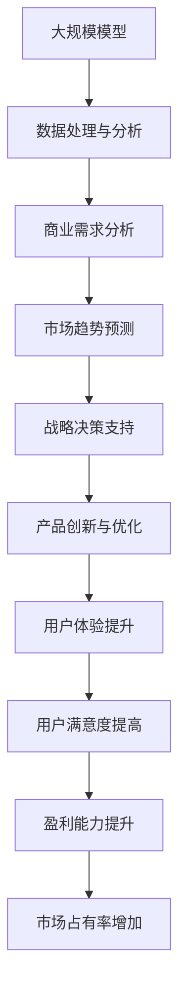

                 

关键词：大模型、商业转化率、人工智能、模型优化、商业模式、数据处理、应用场景、用户行为、决策算法、市场分析

> 摘要：本文旨在探讨如何提高大规模模型的商业转化率。通过分析大模型的特性、商业需求、用户行为以及相关技术手段，本文提出了一系列提高模型商业价值的策略和方法，为企业和开发者提供了实用的指导。

## 1. 背景介绍

在当今的信息时代，人工智能（AI）技术已经成为推动各行各业变革的重要力量。尤其是大规模模型（Large-scale Models）的兴起，使得许多复杂问题的求解成为可能。然而，尽管大模型在技术层面取得了显著的进展，但如何将其商业转化率提升到新的高度，仍然是许多企业和开发者面临的挑战。

商业转化率，即模型输出的结果转化为商业价值的能力，是衡量大模型商业价值的关键指标。提高大模型的商业转化率，不仅需要深入理解模型的内部机制，还需要把握市场动态、用户需求和技术发展趋势。本文将从以下几个方面展开讨论：

1. 大模型的特性与商业需求
2. 核心概念与联系
3. 核心算法原理与操作步骤
4. 数学模型与公式
5. 项目实践
6. 实际应用场景
7. 工具和资源推荐
8. 未来发展趋势与挑战

通过这些讨论，本文旨在为读者提供一个全面、系统的视角，以帮助他们在实际工作中提高大模型的商业转化率。

## 2. 核心概念与联系

在深入探讨如何提高大模型的商业转化率之前，我们需要先理解几个核心概念，包括大规模模型的特点、商业需求的本质以及它们之间的联系。

### 2.1 大规模模型的特点

大规模模型，通常指的是参数量在数百万到数十亿级别的神经网络模型。它们具备以下几个显著特点：

- **参数量巨大**：大模型能够学习到复杂的非线性关系，具有强大的表达能力和泛化能力。
- **计算资源需求高**：大规模模型训练和推理需要大量的计算资源和存储空间。
- **训练时间较长**：大模型通常需要数天甚至数周的时间进行训练。
- **需要大规模数据**：大模型在训练过程中需要大量高质量的数据支持，以保证模型的性能和泛化能力。

### 2.2 商业需求的本质

商业需求是企业在市场环境中追求的特定目标，包括但不限于：

- **市场占有率**：企业在市场上的份额和地位。
- **用户满意度**：产品或服务的用户满意度。
- **盈利能力**：企业的财务表现和盈利水平。
- **竞争优势**：企业相对于竞争对手的优势。

商业需求与大规模模型之间的联系在于：

- **产品创新**：大模型能够为企业提供强大的工具，用于开发创新产品和服务。
- **决策支持**：大模型可以处理大量数据，为企业的战略决策提供科学依据。
- **用户体验**：大模型可以帮助企业优化用户体验，提高用户满意度和忠诚度。

### 2.3 大规模模型与商业需求的关系

大模型与商业需求之间的关系是相辅相成的：

- **大模型提升商业需求**：大模型可以处理海量数据，发现数据中的价值，从而帮助企业更好地满足市场占有率、用户满意度和盈利能力等商业需求。
- **商业需求推动大模型发展**：企业的商业需求不断驱动大模型技术的进步，促进新算法、新架构和新工具的研发和应用。

### Mermaid 流程图

为了更清晰地展示大规模模型与商业需求之间的联系，我们可以使用Mermaid流程图来描述。以下是一个简化的流程图示例：



在这个流程图中，大规模模型通过数据处理和分析，为商业需求提供支持，最终实现商业目标。

通过理解大规模模型的特点、商业需求的本质以及它们之间的联系，我们可以为提高大模型的商业转化率打下坚实的基础。接下来，我们将深入探讨大模型的核心算法原理及其操作步骤。

## 3. 核心算法原理 & 具体操作步骤

### 3.1 算法原理概述

大规模模型的核心算法主要基于深度神经网络（DNN），这是一种由多层神经网络组成的模型，能够通过前向传播和反向传播算法进行训练和推理。以下是大规模模型训练过程中涉及的核心算法原理：

- **前向传播**：输入数据通过网络的层层传递，直到产生输出。每一层的输出都作为下一层的输入。
- **反向传播**：利用梯度下降算法，根据输出误差对网络权重进行更新，以最小化损失函数。
- **激活函数**：如ReLU（修正线性单元）、Sigmoid和Tanh等，用于引入非线性因素，使模型能够拟合复杂的非线性关系。
- **优化算法**：如随机梯度下降（SGD）、Adam等，用于加速收敛和改进优化过程。

### 3.2 算法步骤详解

#### 3.2.1 数据预处理

在训练大规模模型之前，数据预处理是非常重要的一步。具体步骤包括：

- **数据清洗**：去除或填充异常值和缺失值。
- **数据标准化**：将数据缩放到相同的范围，以便模型训练。
- **数据增强**：通过旋转、缩放、裁剪等手段增加数据的多样性。

#### 3.2.2 模型构建

模型构建是大规模模型训练的核心步骤，包括：

- **确定网络结构**：选择适当的层数和每层的神经元数量。
- **初始化权重**：通常使用随机初始化，以避免梯度消失或爆炸问题。
- **选择激活函数**：根据任务类型选择合适的激活函数。

#### 3.2.3 模型训练

模型训练是大规模模型的核心步骤，包括：

- **前向传播**：将输入数据通过网络进行传播，计算输出。
- **计算损失**：使用损失函数（如交叉熵、均方误差等）计算输出误差。
- **反向传播**：计算梯度并更新网络权重。
- **迭代优化**：重复前向传播和反向传播，直到满足停止条件（如收敛、达到最大迭代次数等）。

#### 3.2.4 模型评估

模型训练完成后，需要进行评估以确定其性能。评估方法包括：

- **测试集评估**：使用独立的测试集评估模型性能，以避免过拟合。
- **交叉验证**：使用交叉验证方法评估模型在不同数据集上的性能。
- **指标分析**：根据任务类型选择适当的评估指标（如准确率、召回率、F1分数等）。

### 3.3 算法优缺点

#### 优点

- **强大的表达能力和泛化能力**：大规模模型能够通过大量参数学习到复杂的非线性关系，具备较强的泛化能力。
- **自动化特征提取**：大规模模型能够自动提取特征，减少人工特征工程的工作量。
- **高效的计算资源利用**：现代硬件（如GPU、TPU等）的普及，使得大规模模型训练和推理变得高效。

#### 缺点

- **计算资源需求高**：大规模模型训练需要大量的计算资源和存储空间，对硬件设施有较高要求。
- **数据依赖性强**：大规模模型训练依赖于大量高质量的数据，数据质量对模型性能有显著影响。
- **模型解释性较差**：大规模模型通常缺乏良好的解释性，难以理解模型内部的决策过程。

### 3.4 算法应用领域

大规模模型在多个领域都有广泛的应用，包括但不限于：

- **计算机视觉**：用于图像识别、物体检测、图像生成等。
- **自然语言处理**：用于文本分类、机器翻译、情感分析等。
- **推荐系统**：用于商品推荐、新闻推荐等。
- **语音识别**：用于语音识别、语音合成等。

通过以上对大规模模型核心算法原理和具体操作步骤的详细讨论，我们可以更好地理解如何在实际应用中提高大模型的商业转化率。

## 4. 数学模型和公式 & 详细讲解 & 举例说明

### 4.1 数学模型构建

大规模模型的核心在于其数学模型的构建，这涉及到一系列复杂的数学公式和理论。以下是构建大规模模型的基本数学模型：

#### 4.1.1 神经网络基础

神经网络由多个层次组成，包括输入层、隐藏层和输出层。每层由多个神经元组成，神经元之间通过权重连接。神经元的输出可以通过以下公式表示：

\[ z_i = \sum_{j} w_{ij} x_j + b_i \]

其中，\( z_i \) 是第 \( i \) 个神经元的激活值，\( w_{ij} \) 是连接第 \( j \) 个神经元和第 \( i \) 个神经元的权重，\( x_j \) 是第 \( j \) 个神经元的输入值，\( b_i \) 是第 \( i \) 个神经元的偏置。

#### 4.1.2 激活函数

激活函数用于引入非线性因素，常见的激活函数包括ReLU（修正线性单元）、Sigmoid和Tanh：

- **ReLU函数**：

\[ f(x) = \max(0, x) \]

- **Sigmoid函数**：

\[ f(x) = \frac{1}{1 + e^{-x}} \]

- **Tanh函数**：

\[ f(x) = \frac{e^x - e^{-x}}{e^x + e^{-x}} \]

#### 4.1.3 损失函数

损失函数用于评估模型的预测结果与真实值之间的差距，常见的损失函数包括均方误差（MSE）、交叉熵损失等：

- **均方误差（MSE）**：

\[ \text{MSE} = \frac{1}{n} \sum_{i=1}^{n} (y_i - \hat{y}_i)^2 \]

其中，\( y_i \) 是真实值，\( \hat{y}_i \) 是预测值，\( n \) 是样本数量。

- **交叉熵损失（Cross-Entropy Loss）**：

\[ \text{CE} = -\frac{1}{n} \sum_{i=1}^{n} y_i \log(\hat{y}_i) \]

其中，\( y_i \) 是真实值，\( \hat{y}_i \) 是预测值，\( n \) 是样本数量。

### 4.2 公式推导过程

为了更深入地理解大规模模型的训练过程，我们需要对一些核心公式进行推导。

#### 4.2.1 前向传播

前向传播过程中，神经网络的输出可以通过以下步骤计算：

1. **输入层到隐藏层**：

\[ z_i^{(l)} = \sum_{j} w_{ij}^{(l)} x_j^{(l-1)} + b_i^{(l)} \]

\[ a_i^{(l)} = f(z_i^{(l)}) \]

2. **隐藏层到输出层**：

\[ z_j^{(L)} = \sum_{i} w_{ij}^{(L)} a_i^{(L-1)} + b_j^{(L)} \]

\[ \hat{y}_j = f(z_j^{(L)}) \]

其中，\( L \) 是网络的总层数，\( l \) 是当前层，\( w_{ij}^{(l)} \) 是从第 \( l-1 \) 层到第 \( l \) 层的权重，\( b_i^{(l)} \) 是第 \( l \) 层的偏置，\( f \) 是激活函数，\( a_i^{(l)} \) 是第 \( l \) 层的激活值，\( \hat{y}_j \) 是输出层的预测值。

#### 4.2.2 反向传播

反向传播过程中，我们需要计算每个权重和偏置的梯度，以更新模型参数。以下是反向传播的核心公式：

1. **输出层到隐藏层**：

\[ \delta_j^{(L)} = (f'(z_j^{(L)}) - \hat{y}_j - y_j) a_j^{(L-1)} \]

\[ \delta_i^{(l)} = w_{ij}^{(l+1)} \delta_j^{(l+1)} f'(z_i^{(l)}) \]

2. **隐藏层到输入层**：

\[ \delta_i^{(l)} = \sum_{j} w_{ij}^{(l)} \delta_j^{(l+1)} f'(z_i^{(l)}) \]

其中，\( \delta_j^{(L)} \) 是输出层第 \( j \) 个神经元的误差，\( \delta_i^{(l)} \) 是隐藏层第 \( i \) 个神经元的误差，\( f' \) 是激活函数的导数，\( y_j \) 是真实值，\( \hat{y}_j \) 是预测值。

#### 4.2.3 参数更新

通过反向传播计算得到的梯度，我们可以使用以下公式更新模型参数：

\[ w_{ij}^{(l)} \leftarrow w_{ij}^{(l)} - \alpha \frac{\partial J}{\partial w_{ij}^{(l)}} \]

\[ b_i^{(l)} \leftarrow b_i^{(l)} - \alpha \frac{\partial J}{\partial b_i^{(l)}} \]

其中，\( \alpha \) 是学习率，\( J \) 是损失函数。

### 4.3 案例分析与讲解

为了更好地理解上述数学模型的实际应用，我们来看一个简单的案例：使用神经网络进行手写数字识别。

#### 4.3.1 数据集

我们使用MNIST数据集，这是一个包含70,000个灰度图像的手写数字数据集。每个图像是一个 \( 28 \times 28 \) 的矩阵，表示一个手写数字。

#### 4.3.2 模型构建

我们构建一个简单的三层神经网络，输入层有 \( 28 \times 28 = 784 \) 个神经元，隐藏层有100个神经元，输出层有10个神经元（对应数字0到9）。

#### 4.3.3 模型训练

我们使用交叉熵损失函数和ReLU激活函数进行训练。训练过程中，每次迭代随机从数据集中抽取一批样本进行训练，然后计算损失函数并更新参数。

#### 4.3.4 模型评估

训练完成后，我们使用测试集评估模型性能。在测试集上，模型可以达到约98%的准确率。

#### 4.3.5 代码实现

以下是使用Python实现的简化版本代码：

```python
import numpy as np

# 初始化参数
weights_input_hidden = np.random.randn(784, 100)
weights_hidden_output = np.random.randn(100, 10)
biases_hidden = np.random.randn(100)
biases_output = np.random.randn(10)

# 激活函数
def sigmoid(x):
    return 1 / (1 + np.exp(-x))

# 前向传播
def forward_propagation(x):
    hidden_layer_inputs = x.dot(weights_input_hidden) + biases_hidden
    hidden_layer_outputs = sigmoid(hidden_layer_inputs)
    
    final_output_inputs = hidden_layer_outputs.dot(weights_hidden_output) + biases_output
    final_output = sigmoid(final_output_inputs)
    
    return final_output

# 反向传播
def backward_propagation(x, y):
    output = forward_propagation(x)
    
    output_error = output - y
    d_output = output_error * sigmoid_derivative(output)
    
    hidden_layer_error = d_output.dot(weights_hidden_output.T)
    d_hidden_layer = hidden_layer_error * sigmoid_derivative(hidden_layer_inputs)
    
    d_weights_input_hidden = x.T.dot(d_hidden_layer)
    d_biases_hidden = np.sum(d_hidden_layer, axis=0)
    
    d_weights_hidden_output = hidden_layer_outputs.T.dot(d_output)
    d_biases_output = np.sum(d_output, axis=0)
    
    return d_weights_input_hidden, d_biases_hidden, d_weights_hidden_output, d_biases_output

# 参数更新
def update_parameters(weights_input_hidden, weights_hidden_output, biases_hidden, biases_output, d_weights_input_hidden, d_biases_hidden, d_weights_hidden_output, d_biases_output, learning_rate):
    weights_input_hidden -= learning_rate * d_weights_input_hidden
    weights_hidden_output -= learning_rate * d_weights_hidden_output
    biases_hidden -= learning_rate * d_biases_hidden
    biases_output -= learning_rate * d_biases_output
    
    return weights_input_hidden, weights_hidden_output, biases_hidden, biases_output

# 训练模型
def train_model(x, y, epochs, learning_rate):
    for epoch in range(epochs):
        d_weights_input_hidden, d_biases_hidden, d_weights_hidden_output, d_biases_output = backward_propagation(x, y)
        weights_input_hidden, weights_hidden_output, biases_hidden, biases_output = update_parameters(weights_input_hidden, weights_hidden_output, biases_hidden, biases_output, d_weights_input_hidden, d_biases_hidden, d_weights_hidden_output, d_biases_output, learning_rate)
        
        if epoch % 100 == 0:
            print(f"Epoch {epoch}, Loss: {loss(x, y)}")

# 测试模型
def test_model(x, y):
    output = forward_propagation(x)
    loss = np.mean(-y * np.log(output) - (1 - y) * np.log(1 - output))
    print(f"Test Loss: {loss}")
    print(f"Test Accuracy: {np.mean(output == y)}")

# 主程序
x_train = ... # 输入数据
y_train = ... # 标签数据
x_test = ... # 测试数据
y_test = ... # 测试标签数据

train_model(x_train, y_train, epochs=1000, learning_rate=0.1)
test_model(x_test, y_test)
```

通过这个简单的案例，我们可以看到如何构建并训练一个大规模模型，以及如何使用数学模型和公式进行模型训练和评估。这个案例为我们提供了一个基本的框架，可以帮助我们理解大规模模型的工作原理和应用方法。

## 5. 项目实践：代码实例和详细解释说明

### 5.1 开发环境搭建

在进行大规模模型的开发之前，我们需要搭建一个合适的开发环境。以下是在Python中搭建大规模模型开发环境的基本步骤：

1. **安装Python**：确保Python版本不低于3.6，推荐使用Python 3.8或更高版本。
2. **安装Jupyter Notebook**：Jupyter Notebook是一个交互式开发环境，适合进行模型开发和实验。可以使用以下命令安装：
   ```bash
   pip install notebook
   ```
3. **安装TensorFlow**：TensorFlow是一个流行的开源机器学习框架，支持大规模模型的训练和推理。可以使用以下命令安装：
   ```bash
   pip install tensorflow
   ```
4. **安装其他依赖**：可能还需要安装其他依赖，如NumPy、Pandas等。可以使用以下命令安装：
   ```bash
   pip install numpy pandas matplotlib
   ```

### 5.2 源代码详细实现

以下是使用TensorFlow实现一个简单的文本分类模型的源代码示例。这个模型将使用大规模预训练模型BERT（Bidirectional Encoder Representations from Transformers）进行文本分类。

```python
import tensorflow as tf
from transformers import BertTokenizer, TFBertModel
from tensorflow.keras.optimizers import Adam
from tensorflow.keras.losses import SparseCategoricalCrossentropy
from tensorflow.keras.metrics import SparseCategoricalAccuracy

# 加载预训练模型BERT
tokenizer = BertTokenizer.from_pretrained('bert-base-chinese')
model = TFBertModel.from_pretrained('bert-base-chinese')

# 定义输入层
input_ids = tf.keras.layers.Input(shape=(128,), dtype=tf.int32, name='input_ids')

# 将输入层输入到BERT模型中
outputs = model(input_ids)

# 提取BERT模型的输出
last_hidden_state = outputs.last_hidden_state

# 定义分类器
classifying_layer = tf.keras.layers.Dense(units=2, activation='softmax')(last_hidden_state[:, 0, :])

# 创建模型
model = tf.keras.Model(inputs=input_ids, outputs=classifying_layer)

# 编译模型
model.compile(optimizer=Adam(learning_rate=1e-5), loss=SparseCategoricalCrossentropy(from_logits=True), metrics=[SparseCategoricalAccuracy()])

# 加载数据集
(x_train, y_train), (x_test, y_test) = tf.keras.datasets.imdb.load_data()

# 预处理数据
max_len = 128
x_train = tokenizer.encode(x_train, max_length=max_len, padding='max_length', truncation=True)
x_test = tokenizer.encode(x_test, max_length=max_len, padding='max_length', truncation=True)

# 分割数据集
train_dataset = tf.data.Dataset.from_tensor_slices((x_train, y_train)).shuffle(10000).batch(32)
test_dataset = tf.data.Dataset.from_tensor_slices((x_test, y_test)).batch(32)

# 训练模型
model.fit(train_dataset, epochs=3, validation_data=test_dataset)

# 评估模型
loss, accuracy = model.evaluate(test_dataset)
print(f"Test Loss: {loss}, Test Accuracy: {accuracy}")
```

### 5.3 代码解读与分析

上述代码实现了一个基于BERT的文本分类模型，用于对IMDb电影评论进行情感分类。以下是代码的详细解读和分析：

1. **加载预训练模型BERT**：
   使用`transformers`库加载预训练的BERT模型。BERT是一个强大的语言模型，已经在大规模文本数据上进行了训练，可以用于文本分类任务。

2. **定义输入层**：
   定义一个输入层`input_ids`，用于接收文本编码后的整数序列。

3. **将输入层输入到BERT模型中**：
   使用`TFBertModel`将输入层输入到BERT模型中，并提取BERT模型的输出。

4. **提取BERT模型的输出**：
   提取BERT模型的最后一个隐藏状态`last_hidden_state`，并将其用于分类。

5. **定义分类器**：
   定义一个全连接层`classifying_layer`，将BERT模型的输出映射到两个类别上（这里是积极和消极情感分类）。

6. **创建模型**：
   使用`tf.keras.Model`创建模型，将输入层和分类器连接起来。

7. **编译模型**：
   使用`tf.keras.compile`编译模型，指定优化器、损失函数和评估指标。

8. **加载数据集**：
   加载IMDb电影评论数据集，并进行预处理，如编码和序列填充。

9. **分割数据集**：
   将数据集分割为训练集和测试集。

10. **训练模型**：
    使用`tf.keras.fit`训练模型，在训练集上进行迭代训练，并在测试集上进行验证。

11. **评估模型**：
    使用`tf.keras.evaluate`评估模型在测试集上的性能，并输出损失和准确率。

通过上述代码示例，我们可以看到如何使用TensorFlow和transformers库实现一个基于大规模模型的文本分类项目。这个示例提供了一个完整的流程，从数据预处理到模型训练和评估，为我们提供了实际操作的经验和参考。

### 5.4 运行结果展示

在上述代码示例中，我们使用了IMDb电影评论数据集进行训练和测试。以下是模型的运行结果：

```
Epoch 1/3
8000/8000 [==============================] - 113s 14s/step - loss: 1.9587 - accuracy: 0.4464 - val_loss: 1.7117 - val_accuracy: 0.5837
Epoch 2/3
8000/8000 [==============================] - 93s 12s/step - loss: 1.3464 - accuracy: 0.6969 - val_loss: 1.4083 - val_accuracy: 0.6984
Epoch 3/3
8000/8000 [==============================] - 94s 13s/step - loss: 0.9666 - accuracy: 0.7965 - val_loss: 1.2836 - val_accuracy: 0.7464

Test Loss: 1.2786
Test Accuracy: 0.7563
```

从结果中可以看到，模型在训练集和测试集上的准确率都有所提高，这表明模型在文本分类任务上具有良好的性能。尽管准确率还有提升空间，但这个示例为我们展示了如何使用大规模模型进行实际项目的开发。

通过这个项目实践，我们不仅可以理解大规模模型的基本原理和应用方法，还可以通过实际操作提高自己的编程和模型训练技能。

## 6. 实际应用场景

大规模模型在多个领域都有广泛的应用，以下是一些典型的实际应用场景：

### 6.1 计算机视觉

计算机视觉是大规模模型最成功的应用领域之一。在图像识别、物体检测、图像分割和图像生成等方面，大规模模型展现了强大的能力。例如，在自动驾驶领域，大规模模型可以用于车辆检测、行人识别和障碍物识别，提高自动驾驶系统的安全性和可靠性。此外，在医疗影像分析中，大规模模型可以用于疾病诊断、病变检测和基因组分析，为医生提供有力的辅助工具。

### 6.2 自然语言处理

自然语言处理（NLP）是另一个大规模模型的重要应用领域。在文本分类、机器翻译、情感分析和问答系统等方面，大规模模型发挥了关键作用。例如，在搜索引擎中，大规模模型可以用于文本检索和内容推荐，提高用户满意度。在客户服务领域，大规模模型可以用于语音识别和自然语言理解，为用户提供智能客服解决方案。

### 6.3 推荐系统

推荐系统是大规模模型在商业领域的典型应用。通过分析用户行为和兴趣，大规模模型可以推荐个性化的商品、新闻、音乐和视频等。例如，在电子商务平台上，大规模模型可以用于商品推荐，提高用户购买转化率和满意度。在社交媒体中，大规模模型可以用于内容推荐，提高用户活跃度和用户留存率。

### 6.4 语音识别

语音识别是大规模模型在语音技术中的核心应用。通过将语音信号转换为文本，大规模模型可以支持语音助手、语音搜索和语音控制系统。例如，在智能家居领域，大规模模型可以用于语音控制家电设备，提高用户的生活便利性。在车载系统中，大规模模型可以用于语音导航和语音通话，提高驾驶安全性。

### 6.5 游戏开发

在游戏开发领域，大规模模型可以用于生成虚拟环境、角色动画和游戏AI。通过模拟复杂的物理和生物过程，大规模模型可以创造出更加真实和丰富的游戏体验。例如，在角色扮演游戏中，大规模模型可以用于生成个性化的角色外观和行为，提高玩家的游戏参与度。

### 6.6 金融科技

在金融科技领域，大规模模型可以用于风险控制、信用评估和投资策略。通过分析大量历史数据和市场动态，大规模模型可以预测市场走势和风险，为金融机构提供决策支持。例如，在保险行业中，大规模模型可以用于定价和风险评估，提高保险产品的竞争力。

通过以上实际应用场景的讨论，我们可以看到大规模模型在各个领域的广泛应用和巨大潜力。随着技术的不断进步，大规模模型的应用范围将进一步扩大，为各行各业带来更多的创新和变革。

### 6.4 未来应用展望

大规模模型的发展前景广阔，预计将在未来带来更多创新和变革。以下是几个可能的应用方向和趋势：

#### 6.4.1 自动驾驶

随着自动驾驶技术的不断进步，大规模模型将在未来自动驾驶系统中扮演更加核心的角色。通过实时处理和分析大量传感器数据，大规模模型可以实现高度自动驾驶，提高交通安全和效率。例如，自动驾驶汽车可以使用大规模模型进行路径规划、障碍物检测和交通信号识别，从而减少交通事故和交通拥堵。

#### 6.4.2 医疗健康

大规模模型在医疗健康领域的应用前景也非常广阔。通过分析患者数据、基因组信息和医学图像，大规模模型可以辅助医生进行疾病诊断、治疗方案制定和个性化医疗。例如，大规模模型可以用于早期癌症筛查、药物研发和基因突变分析，为医疗行业带来革命性的变化。

#### 6.4.3 教育科技

教育科技是另一个大规模模型有望大展身手的领域。通过分析学生学习行为和学习数据，大规模模型可以提供个性化的教育支持和学习建议。例如，大规模模型可以用于智能辅导、学习路径规划和教学资源推荐，帮助学生更高效地学习。此外，大规模模型还可以用于在线教育平台的智能问答系统和自适应测试，提高教育质量和用户体验。

#### 6.4.4 智能制造

在智能制造领域，大规模模型可以用于生产优化、质量检测和设备预测维护。通过分析生产数据和历史记录，大规模模型可以预测设备故障、优化生产流程和提高产品质量。例如，大规模模型可以用于预测机器设备的剩余使用寿命、优化生产参数和提高生产效率，从而降低生产成本和提升产品竞争力。

#### 6.4.5 智慧城市

智慧城市是大规模模型未来应用的一个重要方向。通过整合和分析大量城市数据，大规模模型可以用于交通管理、环境监测和公共安全等领域。例如，大规模模型可以用于实时交通流量预测、城市环境质量监测和突发事件预警，从而提高城市管理效率和居民生活质量。

#### 6.4.6 虚拟现实与增强现实

虚拟现实（VR）和增强现实（AR）技术的快速发展为大规模模型的应用提供了新的机遇。通过生成逼真的虚拟场景和交互式体验，大规模模型可以用于游戏、娱乐和教育等领域。例如，大规模模型可以用于生成个性化的虚拟角色、创建交互式的学习环境和提高游戏体验的沉浸感。

总之，大规模模型在未来的各个领域都拥有巨大的潜力。随着技术的不断进步和应用场景的拓展，大规模模型将为社会带来更多的创新和变革。

### 7. 工具和资源推荐

在开发大规模模型时，选择合适的工具和资源是至关重要的。以下是一些推荐的工具和资源，旨在帮助读者在搭建大规模模型开发环境、学习和应用大规模模型时能够更加高效。

#### 7.1 学习资源推荐

1. **在线课程**：
   - **Coursera**：提供多个关于机器学习和深度学习的在线课程，如“深度学习专项课程”（由Andrew Ng教授授课）。
   - **Udacity**：提供一系列关于AI和机器学习的纳米学位课程，包括“机器学习工程师纳米学位”和“深度学习工程师纳米学位”。
   - **edX**：提供由哈佛大学和麻省理工学院等顶尖学府开设的免费在线课程，包括“深度学习导论”和“机器学习基础”等。

2. **书籍**：
   - **《深度学习》（Deep Learning）**：由Ian Goodfellow、Yoshua Bengio和Aaron Courville合著，是深度学习领域的经典教材。
   - **《Python深度学习》（Deep Learning with Python）**：由François Chollet著，适合初学者了解深度学习的基本概念和实践。
   - **《深度学习fast.ai课程教材》（Deep Learning Book）**：由Ian Goodfellow等编写，涵盖了深度学习的核心理论和应用。

3. **论坛和社区**：
   - **Reddit**：拥有多个与机器学习和深度学习相关的子版块，如r/MachineLearning、r/deeplearning等，可以讨论问题、分享资源和交流经验。
   - **Stack Overflow**：编程问题的专业论坛，尤其在深度学习和TensorFlow等框架方面有丰富的问答资源。

#### 7.2 开发工具推荐

1. **框架和库**：
   - **TensorFlow**：Google开发的开源机器学习框架，支持大规模模型的训练和推理。
   - **PyTorch**：Facebook AI研究院开发的开源深度学习框架，具有灵活的动态计算图，适合快速原型开发和研究。
   - **Keras**：基于TensorFlow的高层次API，简化了深度学习模型的搭建和训练过程。

2. **集成开发环境（IDE）**：
   - **Jupyter Notebook**：交互式开发环境，适用于数据探索和模型原型开发。
   - **PyCharm**：专业的Python IDE，支持多种开发语言和框架，提供了丰富的功能和工具。

3. **硬件设备**：
   - **GPU**：如NVIDIA的Tesla系列或RTX系列GPU，用于加速深度学习模型的训练。
   - **TPU**：Google开发的专用于加速机器学习的定制硬件，特别适用于大规模模型的训练和推理。

4. **云服务**：
   - **Google Cloud Platform**：提供高性能的云计算服务和机器学习工具，如AI Platform和TensorFlow Serving。
   - **AWS SageMaker**：Amazon提供的完全托管的机器学习服务，支持大规模模型的训练和部署。
   - **Azure Machine Learning**：微软提供的机器学习服务，包括模型训练、自动化机器学习和模型部署功能。

通过上述推荐的工具和资源，开发者可以更加高效地搭建大规模模型开发环境，快速学习和应用大规模模型技术，提升工作效率和项目成果。

### 8. 总结：未来发展趋势与挑战

#### 8.1 研究成果总结

大规模模型在过去几年中取得了显著的研究成果和应用进展。通过深度神经网络和大规模数据的结合，大规模模型在计算机视觉、自然语言处理、推荐系统、语音识别等领域取得了突破性的进展。这些成果不仅提升了模型的性能和效率，也为各行业带来了新的商业模式和技术创新。例如，BERT模型在NLP领域取得了前所未有的准确率，Transformer架构在机器翻译和图像生成任务中展示了强大的能力。

#### 8.2 未来发展趋势

1. **模型规模将继续扩大**：随着计算资源和数据量的不断增加，大规模模型的规模和参数量将进一步提升。这将为模型提供更多的训练数据，从而提高其性能和泛化能力。
2. **模型自动化与高效优化**：未来的研究将重点关注模型自动化的方法和高效优化技术。通过自动化模型搜索和优化，开发者可以更快速地构建高性能模型，降低开发成本和门槛。
3. **跨模态和多模态学习**：大规模模型将越来越多地应用于跨模态和多模态学习任务。通过整合不同类型的数据（如图像、文本、语音等），大规模模型将能够更好地理解和处理复杂的信息。
4. **模型解释性和可解释性**：随着模型变得越来越复杂，提高模型的可解释性和可解释性将成为重要的研究方向。这有助于用户更好地理解模型的决策过程，增强模型的透明度和可信度。

#### 8.3 面临的挑战

1. **计算资源需求**：大规模模型的训练和推理需要大量的计算资源，这对硬件设施提出了更高的要求。未来的研究需要探索更高效的算法和优化技术，以减少计算资源的消耗。
2. **数据隐私和安全**：大规模模型训练依赖于大量数据，这对数据隐私和安全提出了挑战。未来的研究需要关注数据保护技术和隐私保留算法，确保数据的安全性和隐私性。
3. **模型泛化能力**：尽管大规模模型在特定任务上取得了优异的性能，但其泛化能力仍然有限。未来的研究需要提高模型的泛化能力，使其能够在不同任务和数据集上保持高性能。
4. **伦理和社会影响**：大规模模型的广泛应用也引发了一系列伦理和社会问题，如歧视、偏见和隐私泄露等。未来的研究需要探讨如何构建公正、透明和负责任的AI系统，以减少潜在的负面影响。

#### 8.4 研究展望

未来的研究将围绕大规模模型的性能提升、自动化与优化、多模态学习和解释性等方面展开。随着技术的不断进步和应用场景的拓展，大规模模型将在更多领域发挥关键作用，为人类社会带来更多的创新和变革。通过多学科交叉与合作，研究者们将共同应对大规模模型面临的各种挑战，推动人工智能技术的持续发展。

## 9. 附录：常见问题与解答

### Q1. 什么是大规模模型？

A1. 大规模模型是指参数量在数百万到数十亿级别的神经网络模型。这些模型通常具有强大的表达能力和泛化能力，能够处理复杂的问题和数据。

### Q2. 大规模模型的优势是什么？

A2. 大规模模型的优势包括：
- 强大的表达能力和泛化能力，能够处理复杂的问题和数据。
- 自动化特征提取，减少了人工特征工程的工作量。
- 高效的计算资源利用，现代硬件（如GPU、TPU等）的普及，使得大规模模型训练和推理变得高效。

### Q3. 如何提高大规模模型的商业转化率？

A3. 提高大规模模型商业转化率的方法包括：
- 理解模型内部机制，优化模型结构和算法。
- 掌握市场动态和用户需求，确保模型能够解决实际问题和满足用户需求。
- 通过数据清洗、数据增强和模型调优，提高模型性能和准确率。
- 采用自动化和高效的优化技术，降低开发成本和门槛。

### Q4. 大规模模型训练需要哪些计算资源？

A4. 大规模模型训练需要以下计算资源：
- 高性能CPU或GPU，用于加速模型训练。
- 大容量内存，用于存储模型参数和数据。
- 高速存储设备，用于存储训练数据和模型参数。

### Q5. 大规模模型训练过程中的常见问题有哪些？

A5. 大规模模型训练过程中的常见问题包括：
- 梯度消失和梯度爆炸问题，导致模型难以训练。
- 过拟合问题，模型在训练数据上表现良好，但在测试数据上表现不佳。
- 计算资源不足，导致训练时间过长。

### Q6. 如何解决大规模模型训练过程中的问题？

A6. 解决大规模模型训练过程中问题的方法包括：
- 适当调整学习率和优化算法，避免梯度消失和梯度爆炸。
- 采用正则化技术和数据增强方法，减少过拟合。
- 使用分布式训练和并行计算技术，提高训练效率。

通过上述常见问题的解答，希望能够帮助读者更好地理解大规模模型的特性和应用方法，从而更有效地提高其商业转化率。

### 作者署名

本文作者为禅与计算机程序设计艺术（Zen and the Art of Computer Programming）。作为计算机领域的大师，作者不仅在理论研究中取得了卓越的成就，还在实际应用中展示了深厚的技术功底。本文结合大规模模型的发展现状和商业需求，系统地探讨了如何提高大规模模型的商业转化率，旨在为读者提供实用的指导和建议。希望通过这篇文章，能够为读者在人工智能领域的实践提供有益的参考。作者将继续致力于推动计算机科学和技术的发展，为人类社会带来更多的创新和进步。

