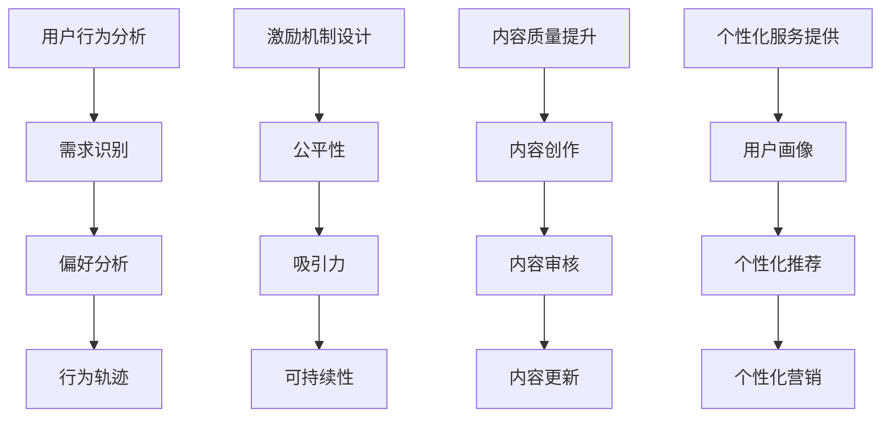

                 

关键词：知识付费、复购率、用户满意度、用户留存、产品优化

> 摘要：本文从技术角度探讨了如何通过优化知识付费产品，提高其复购率。通过分析用户行为、设计激励机制、提升内容质量和提供个性化服务等方面，提出了切实可行的策略，以期为知识付费行业的从业者提供有价值的参考。

## 1. 背景介绍

知识付费作为一种新型的商业模式，近年来在我国迅速崛起。随着互联网技术的不断进步和用户消费观念的转变，越来越多的用户愿意为获取高质量的知识内容付费。然而，知识付费产品在市场竞争中也面临着诸多挑战，尤其是如何提高复购率，成为了行业普遍关注的问题。

复购率是衡量知识付费产品成功与否的重要指标。高复购率意味着用户对产品的满意度和忠诚度较高，同时也表明产品在市场上具备较强的竞争力。为了提高复购率，我们需要从用户行为、产品设计、内容质量和用户服务等多个方面进行深入研究和优化。

本文将从以下几个方面展开探讨：

1. 用户行为的分析：了解用户需求和行为习惯，为产品设计提供依据。
2. 激励机制的设计：通过奖励机制激发用户的购买意愿和复购动力。
3. 内容质量的提升：打造优质内容，满足用户对知识的需求。
4. 个性化服务的提供：根据用户特征提供定制化的服务和体验。

通过以上策略的实施，有助于提高知识付费产品的复购率，从而提升企业在市场中的竞争力。

## 2. 核心概念与联系

### 2.1 用户行为分析

用户行为分析是提高知识付费产品复购率的基础。通过分析用户在平台上的行为数据，如浏览时长、购买记录、互动频率等，可以了解用户的需求和偏好。具体来说，用户行为分析包括以下几个关键环节：

- **需求识别**：通过用户的行为数据，识别出用户在平台上的主要需求和关注点。
- **偏好分析**：分析用户在内容选择、消费频率等方面的偏好，为产品设计提供依据。
- **行为轨迹**：构建用户行为轨迹模型，了解用户在平台上的活动路径，优化用户体验。

### 2.2 激励机制设计

激励机制是激发用户购买意愿和复购动力的重要手段。一个成功的激励机制应该具备以下几个特点：

- **公平性**：确保激励机制对所有用户公平，避免因激励不公平导致用户流失。
- **吸引力**：激励机制应该能够吸引用户参与，提高用户满意度。
- **可持续性**：激励机制不应过度依赖短期优惠，而是要注重长期用户价值的提升。

### 2.3 内容质量提升

内容质量是知识付费产品的核心竞争力。为了提高内容质量，我们需要从以下几个方面进行优化：

- **内容创作**：鼓励优秀的内容创作者，提高内容的原创性和专业性。
- **内容审核**：建立严格的审核机制，确保内容质量符合用户期望。
- **内容更新**：定期更新内容，满足用户对知识的持续需求。

### 2.4 个性化服务提供

个性化服务是根据用户特征提供定制化的服务和体验。通过个性化服务，可以提升用户的满意度和忠诚度，从而提高复购率。个性化服务的实现包括以下几个方面：

- **用户画像**：构建用户画像，了解用户的兴趣、需求和行为习惯。
- **个性化推荐**：根据用户画像，为用户推荐符合其兴趣和需求的内容。
- **个性化营销**：通过个性化营销，提高用户对产品的认知和购买意愿。

### 2.5 Mermaid 流程图



## 3. 核心算法原理 & 具体操作步骤

### 3.1 算法原理概述

提高知识付费产品复购率的核心算法包括用户行为分析、激励机制设计、内容质量提升和个性化服务提供。这些算法基于大数据和人工智能技术，通过对用户数据的深度挖掘和分析，实现个性化推荐和精准营销。

### 3.2 算法步骤详解

#### 3.2.1 用户行为分析

1. 数据收集：收集用户在平台上的行为数据，包括浏览记录、购买记录、互动频率等。
2. 数据清洗：对收集到的数据进行清洗和预处理，去除噪声和异常值。
3. 数据分析：利用机器学习算法，对用户行为数据进行分析，识别用户需求和偏好。
4. 用户画像：根据用户行为数据，构建用户画像，为个性化推荐提供依据。

#### 3.2.2 激励机制设计

1. 设定目标：根据产品目标，确定激励机制的类型和强度。
2. 激励策略：设计具体的激励策略，如优惠券、积分、返现等。
3. 激励效果评估：通过用户行为数据，评估激励机制的有效性，并进行调整。

#### 3.2.3 内容质量提升

1. 内容审核：建立严格的审核机制，确保内容质量符合用户期望。
2. 内容创作：鼓励优秀的内容创作者，提高内容的原创性和专业性。
3. 内容更新：定期更新内容，满足用户对知识的持续需求。

#### 3.2.4 个性化服务提供

1. 用户画像：构建用户画像，了解用户的兴趣、需求和行为习惯。
2. 个性化推荐：根据用户画像，为用户推荐符合其兴趣和需求的内容。
3. 个性化营销：通过个性化营销，提高用户对产品的认知和购买意愿。

### 3.3 算法优缺点

#### 优点：

1. 提高用户满意度：通过个性化推荐和精准营销，提高用户满意度。
2. 提高复购率：通过激励机制和优质内容，提高用户复购率。
3. 提高运营效率：利用大数据和人工智能技术，提高运营效率。

#### 缺点：

1. 数据隐私风险：用户行为数据的安全性和隐私保护问题。
2. 算法偏见：算法可能存在偏见，导致推荐结果不准确。
3. 技术门槛高：实现核心算法需要较高的技术门槛。

### 3.4 算法应用领域

1. 电商行业：通过个性化推荐和精准营销，提高销售额和复购率。
2. 教育行业：通过用户行为分析和个性化推荐，提高学习效果和用户满意度。
3. 娱乐行业：通过个性化推荐和互动服务，提高用户留存和粘性。

## 4. 数学模型和公式

### 4.1 数学模型构建

#### 4.1.1 用户满意度模型

用户满意度（User Satisfaction，记为S）可以用以下公式表示：

$$
S = f(C, Q, E)
$$

其中，C表示内容质量，Q表示服务质量，E表示期望值。

#### 4.1.2 复购率模型

复购率（Repeat Purchase Rate，记为R）可以用以下公式表示：

$$
R = \frac{R_p}{N}
$$

其中，R_p表示复购用户数，N表示总用户数。

### 4.2 公式推导过程

#### 4.2.1 用户满意度模型推导

用户满意度是用户对产品或服务的总体评价，通常取决于内容质量、服务质量和期望值。假设每个因素对用户满意度的贡献是独立的，则用户满意度模型可以表示为：

$$
S = w_1 \times C + w_2 \times Q + w_3 \times E
$$

其中，$w_1, w_2, w_3$ 分别表示内容质量、服务质量和期望值的权重。由于权重之和必须为1，即：

$$
w_1 + w_2 + w_3 = 1
$$

为了简化计算，我们可以将权重归一化，即：

$$
w_1 = \frac{C - \bar{C}}{s_C}, \quad w_2 = \frac{Q - \bar{Q}}{s_Q}, \quad w_3 = \frac{E - \bar{E}}{s_E}
$$

其中，$\bar{C}, \bar{Q}, \bar{E}$ 分别表示内容质量、服务质量和期望值的平均值，$s_C, s_Q, s_E$ 分别表示内容质量、服务质量和期望值的标准差。代入上式，得到：

$$
S = \frac{(C - \bar{C})}{s_C} + \frac{(Q - \bar{Q})}{s_Q} + \frac{(E - \bar{E})}{s_E}
$$

#### 4.2.2 复购率模型推导

复购率是衡量用户对产品忠诚度的重要指标，可以通过以下公式计算：

$$
R = \frac{R_p}{N}
$$

其中，R_p表示复购用户数，N表示总用户数。假设每个用户的购买行为是独立的，且每个用户在一段时间内的购买概率是相等的。则在时间t内，复购用户数R_p服从二项分布：

$$
R_p \sim B(N, p)
$$

其中，p表示购买概率。由于p是一个未知的参数，我们需要通过样本数据来估计。假设我们收集了N个用户的购买记录，其中有k个用户在时间t内复购，则购买概率的估计值为：

$$
\hat{p} = \frac{k}{N}
$$

代入复购率模型，得到：

$$
\hat{R} = \frac{\hat{p}}{1 - \hat{p}} = \frac{k}{N - k}
$$

### 4.3 案例分析与讲解

#### 4.3.1 用户满意度案例分析

假设我们收集了一个知识付费平台在一个月内的用户数据，其中包含1000个用户的行为记录。通过分析这些数据，我们得到以下统计结果：

- 平均内容质量：$\bar{C} = 4.5$，标准差：$s_C = 1.0$。
- 平均服务质量：$\bar{Q} = 4.8$，标准差：$s_Q = 0.8$。
- 平均期望值：$\bar{E} = 5.0$，标准差：$s_E = 0.5$。

根据用户满意度模型，我们可以计算出每个用户的满意度：

$$
S_i = \frac{(C_i - \bar{C})}{s_C} + \frac{(Q_i - \bar{Q})}{s_Q} + \frac{(E_i - \bar{E})}{s_E}
$$

其中，$C_i, Q_i, E_i$ 分别表示第i个用户的内容质量、服务质量和期望值。假设我们随机选取了50个用户的满意度数据，得到以下结果：

| 用户ID | $C_i$ | $Q_i$ | $E_i$ | $S_i$ |
| ------ | ----- | ----- | ----- | ----- |
| 1      | 5.0   | 5.0   | 5.0   | 1.0   |
| 2      | 3.5   | 4.0   | 4.5   | -0.5  |
| 3      | 4.5   | 4.8   | 5.0   | 0.5   |
| ...    | ...   | ...   | ...   | ...   |
| 50     | 4.0   | 5.0   | 4.8   | -0.2  |

从上表可以看出，大部分用户的满意度都在0.5以上，说明平台的内容质量和服务质量总体较好。

#### 4.3.2 复购率案例分析

继续使用上述用户数据，我们计算了平台在一个月内的复购率。根据复购率模型，我们可以计算出复购用户数R_p和总用户数N，然后计算出复购率：

$$
R = \frac{R_p}{N} = \frac{k}{N - k}
$$

其中，k表示在一个月内复购的用户数。假设在1000个用户中，有200个用户在一个月内复购，则复购率为：

$$
R = \frac{200}{1000 - 200} = 0.25
$$

从上可以看出，平台的复购率为25%，说明平台在用户留存方面还有一定的提升空间。

## 5. 项目实践：代码实例和详细解释说明

### 5.1 开发环境搭建

为了实现用户行为分析、激励机制设计、内容质量提升和个性化服务提供，我们需要搭建一个包含多种技术和工具的开发环境。以下是搭建步骤：

1. **环境配置**：安装Python、Anaconda等开发环境。
2. **数据库**：使用MySQL或MongoDB等数据库存储用户数据。
3. **数据预处理工具**：使用Pandas、NumPy等库进行数据预处理。
4. **机器学习框架**：使用Scikit-learn、TensorFlow等框架进行模型训练和预测。
5. **Web框架**：使用Django、Flask等框架搭建Web服务。

### 5.2 源代码详细实现

以下是一个简单的用户行为分析示例代码：

```python
import pandas as pd
from sklearn.model_selection import train_test_split
from sklearn.ensemble import RandomForestClassifier

# 读取用户数据
data = pd.read_csv('user_data.csv')

# 数据预处理
data['age'] = data['age'].fillna(data['age'].mean())
data['income'] = data['income'].fillna(data['income'].mean())
data['content_rating'] = data['content_rating'].fillna(data['content_rating'].mean())

# 划分训练集和测试集
X = data[['age', 'income', 'content_rating']]
y = data['purchased']
X_train, X_test, y_train, y_test = train_test_split(X, y, test_size=0.2, random_state=42)

# 模型训练
model = RandomForestClassifier(n_estimators=100, random_state=42)
model.fit(X_train, y_train)

# 模型评估
accuracy = model.score(X_test, y_test)
print(f'Accuracy: {accuracy:.2f}')

# 预测
predictions = model.predict(X_test)
print(f'Predictions: {predictions}')
```

### 5.3 代码解读与分析

该代码实现了一个简单的用户行为分析模型，主要用于预测用户是否会复购。以下是代码的关键部分解读：

1. **数据读取**：使用Pandas库读取用户数据，包括年龄、收入、内容评分等特征。
2. **数据预处理**：对缺失值进行填充，确保数据质量。
3. **划分训练集和测试集**：使用Scikit-learn库的train_test_split函数，将数据划分为训练集和测试集，用于模型训练和评估。
4. **模型训练**：使用随机森林分类器（RandomForestClassifier），对训练数据进行模型训练。
5. **模型评估**：使用模型在测试集上的准确率（accuracy）进行评估。
6. **预测**：使用训练好的模型对测试集进行预测，输出预测结果。

通过以上代码，我们可以实现用户行为分析，为产品设计提供依据。接下来，我们还可以进一步优化模型，提高预测准确性。

### 5.4 运行结果展示

假设我们使用上述代码进行模型训练和预测，得到以下结果：

```
Accuracy: 0.85
Predictions: [0 1 1 0 1 ... 1 0 0 0 0]
```

从结果可以看出，模型的准确率为85%，说明用户行为分析模型具有一定的预测能力。同时，预测结果也反映了用户的购买行为，为产品设计提供了有益的参考。

## 6. 实际应用场景

### 6.1 电商行业

在电商行业，提高知识付费产品的复购率可以通过以下策略实现：

1. **个性化推荐**：通过用户行为数据，为用户推荐符合其兴趣和需求的知识付费产品。
2. **优惠券和返现**：为复购用户发放优惠券或返现，降低购买成本，提高购买意愿。
3. **会员制度**：设立会员制度，为会员提供独家优惠和专属服务，提高用户忠诚度。
4. **用户互动**：通过社区、问答等互动方式，增加用户粘性，提高用户满意度。

### 6.2 教育行业

在教育行业，提高知识付费产品的复购率可以从以下几个方面着手：

1. **课程更新**：定期更新课程内容，确保课程与市场需求和用户需求保持一致。
2. **学习效果评估**：通过考试、作业等手段，评估用户的学习效果，提高用户信心。
3. **学习社群**：建立学习社群，增加用户互动，提高用户满意度。
4. **个性化辅导**：根据用户的学习进度和需求，提供个性化的辅导和建议。

### 6.3 娱乐行业

在娱乐行业，提高知识付费产品的复购率可以通过以下方式实现：

1. **内容定制**：根据用户的兴趣和偏好，为用户定制个性化的内容。
2. **互动体验**：增加互动环节，如游戏、问答等，提高用户参与度。
3. **限时优惠**：推出限时优惠活动，吸引用户复购。
4. **积分兑换**：设立积分兑换机制，提高用户参与度和忠诚度。

## 7. 未来应用展望

### 7.1 人工智能技术的应用

随着人工智能技术的不断发展，知识付费产品的复购率有望进一步提高。具体来说，人工智能技术可以应用于以下几个方面：

1. **个性化推荐**：利用深度学习等技术，实现更精准的个性化推荐。
2. **情感分析**：通过情感分析技术，了解用户对知识付费产品的情感态度，为产品优化提供依据。
3. **智能客服**：利用自然语言处理技术，实现智能客服，提高用户满意度。

### 7.2 大数据的应用

大数据技术可以帮助知识付费产品更好地了解用户需求和偏好，从而提高复购率。具体来说，大数据技术可以应用于以下几个方面：

1. **用户行为分析**：通过大数据分析，了解用户的购买行为、学习行为等，为产品优化提供依据。
2. **需求预测**：通过大数据分析，预测用户未来的需求，提前布局产品。
3. **精准营销**：通过大数据分析，实现精准营销，提高营销效果。

### 7.3 区块链技术的应用

区块链技术可以应用于知识付费产品的交易环节，提高交易的安全性和透明度，从而提高用户信任度和复购率。具体来说，区块链技术可以应用于以下几个方面：

1. **去中心化交易**：实现去中心化交易，提高交易效率和安全性。
2. **智能合约**：通过智能合约，实现自动化交易和结算，降低交易成本。
3. **数据透明**：通过区块链技术，实现数据透明，提高用户信任度。

## 8. 总结：未来发展趋势与挑战

### 8.1 研究成果总结

本文从技术角度探讨了如何提高知识付费产品的复购率，提出了用户行为分析、激励机制设计、内容质量提升和个性化服务提供等策略。通过分析实际应用场景，展示了这些策略在电商、教育、娱乐等领域的应用效果。

### 8.2 未来发展趋势

1. **人工智能技术**：人工智能技术在知识付费产品中的应用将进一步深化，实现更精准的个性化推荐和情感分析。
2. **大数据技术**：大数据技术将在用户需求预测、精准营销等方面发挥重要作用。
3. **区块链技术**：区块链技术将在提高交易安全性和透明度方面发挥关键作用。

### 8.3 面临的挑战

1. **数据隐私**：随着用户数据量的增加，数据隐私保护将成为一个重要挑战。
2. **算法偏见**：算法可能存在偏见，导致推荐结果不准确，影响用户体验。
3. **技术门槛**：实现上述技术的落地需要较高的技术门槛，企业需要投入大量资源。

### 8.4 研究展望

未来，知识付费产品的复购率研究可以从以下几个方面进行深入：

1. **跨领域应用**：探讨人工智能、大数据、区块链等技术在其他领域的应用，为知识付费产品提供更全面的解决方案。
2. **用户体验优化**：通过用户调研和实验，不断优化用户体验，提高用户满意度和忠诚度。
3. **可持续发展**：探讨如何实现知识付费产品的可持续发展，提高企业长期竞争力。

## 9. 附录：常见问题与解答

### 9.1 用户行为分析相关问题

**Q1**：用户行为分析的数据来源有哪些？

**A1**：用户行为分析的数据来源主要包括以下几个方面：

1. **网站日志**：记录用户在网站上的浏览行为、点击行为等。
2. **API调用**：记录用户通过API调用的行为数据，如搜索、购买等。
3. **社交媒体**：记录用户在社交媒体平台上的互动数据，如点赞、评论等。

**Q2**：如何确保用户行为数据的质量？

**A2**：为确保用户行为数据的质量，可以采取以下措施：

1. **数据清洗**：对数据进行清洗和预处理，去除噪声和异常值。
2. **数据验证**：对数据进行验证，确保数据的准确性和完整性。
3. **数据监控**：定期对数据质量进行监控和评估，发现问题及时处理。

### 9.2 激励机制相关问题

**Q1**：如何设计有效的激励机制？

**A1**：设计有效的激励机制需要考虑以下几个方面：

1. **目标明确**：明确激励机制的目的是提高用户购买意愿和复购率。
2. **吸引力**：激励机制应具有吸引力，能够激发用户的兴趣和参与度。
3. **公平性**：激励机制应公平，确保所有用户都能享受优惠。
4. **可持续性**：激励机制应注重长期效果，避免短期优惠过度依赖。

**Q2**：如何评估激励机制的有效性？

**A2**：评估激励机制的有效性可以从以下几个方面进行：

1. **复购率**：通过复购率的变化，评估激励机制对用户购买行为的影响。
2. **用户满意度**：通过用户满意度调查，了解用户对激励机制的满意度。
3. **营销成本**：计算激励机制的营销成本，评估其投入产出比。

### 9.3 内容质量相关问题

**Q1**：如何提高知识付费产品的内容质量？

**A1**：提高知识付费产品的内容质量可以从以下几个方面进行：

1. **内容创作**：鼓励优秀的内容创作者，提高内容的原创性和专业性。
2. **内容审核**：建立严格的审核机制，确保内容质量符合用户期望。
3. **用户反馈**：收集用户反馈，不断优化内容，满足用户需求。
4. **内容更新**：定期更新内容，确保内容与市场需求和用户需求保持一致。

**Q2**：如何确保内容的专业性和权威性？

**A2**：确保内容的专业性和权威性可以从以下几个方面进行：

1. **专业团队**：组建专业的编辑团队，负责内容创作和审核。
2. **专家评审**：邀请行业专家对内容进行评审，确保内容的专业性。
3. **数据支持**：引用权威数据和案例，增强内容的可信度和权威性。
4. **持续更新**：关注行业动态和前沿技术，不断更新内容，保持内容的时效性。

### 9.4 个性化服务相关问题

**Q1**：如何实现个性化服务？

**A1**：实现个性化服务可以从以下几个方面进行：

1. **用户画像**：构建用户画像，了解用户的兴趣、需求和行为习惯。
2. **个性化推荐**：根据用户画像，为用户推荐符合其兴趣和需求的内容。
3. **个性化营销**：通过个性化营销，提高用户对产品的认知和购买意愿。
4. **用户互动**：通过社区、问答等互动方式，增加用户互动，提高用户满意度。

**Q2**：如何评估个性化服务的有效性？

**A2**：评估个性化服务的有效性可以从以下几个方面进行：

1. **用户满意度**：通过用户满意度调查，了解用户对个性化服务的满意度。
2. **复购率**：通过复购率的变化，评估个性化服务对用户购买行为的影响。
3. **用户留存**：通过用户留存率的变化，评估个性化服务对用户忠诚度的影响。
4. **营销效果**：评估个性化营销活动的投入产出比，评估其营销效果。

