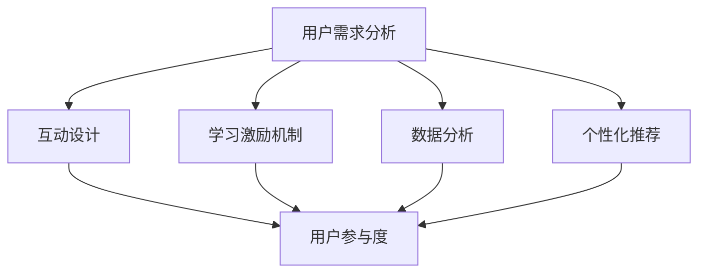

                 

 **关键词：** 用户参与度、知识付费、用户体验、互动设计、用户粘性、学习激励机制、数据分析、个性化推荐、社区互动

**摘要：** 本文将深入探讨如何通过技术手段和设计策略，提高知识付费产品的用户参与度。从用户需求分析、互动设计、学习激励机制等多个角度，提供实用的建议和案例，以帮助知识付费平台实现用户的高效参与和持续活跃。

## 1. 背景介绍

在知识付费日益普及的今天，用户对于高质量知识内容的需求不断增长。然而，如何让用户真正参与到知识付费产品中，提高他们的使用频率和粘性，成为各大知识付费平台需要解决的重要问题。用户参与度不仅是衡量产品成功与否的关键指标，更是影响用户忠诚度和持续购买意愿的重要因素。

本文旨在探讨以下问题：

1. 用户参与度的定义及其对知识付费产品的重要性。
2. 用户参与度的关键影响因素。
3. 提高用户参与度的策略和方法。
4. 成功案例分析与经验总结。
5. 未来发展的趋势与挑战。

## 2. 核心概念与联系

### 2.1 用户参与度的定义

用户参与度是指用户在知识付费产品中的积极参与程度，包括但不限于学习、互动、分享、评价等行为。高参与度意味着用户在产品中投入更多的时间和精力，对产品的依赖性和忠诚度更高。

### 2.2 影响因素

- **用户体验**：良好的用户体验能够增强用户对产品的满意度，从而提高参与度。
- **互动设计**：有效的互动设计可以激发用户的参与热情，增加互动行为。
- **学习激励机制**：通过奖励和激励措施，鼓励用户持续学习。
- **数据分析**：通过数据分析了解用户行为，为产品设计提供依据。
- **个性化推荐**：基于用户行为数据提供个性化内容，提高用户满意度。

### 2.3 Mermaid 流程图



## 3. 核心算法原理 & 具体操作步骤

### 3.1 算法原理概述

提高用户参与度的核心在于满足用户需求、提供互动体验、激励用户行为。本文采用以下算法原理：

1. **用户需求分析**：通过调查问卷、用户行为数据等手段，了解用户需求。
2. **互动设计**：设计丰富的互动功能，如讨论区、问答、直播等。
3. **学习激励机制**：设置积分、勋章等机制，激励用户学习。
4. **数据分析**：利用数据分析工具，分析用户行为，优化产品设计。
5. **个性化推荐**：基于用户行为数据，提供个性化内容。

### 3.2 算法步骤详解

1. **需求分析**：通过问卷调查和用户访谈，收集用户需求和反馈。
    - **问卷设计**：包括用户基本信息、学习需求、使用痛点等。
    - **访谈记录**：记录用户的真实使用体验和改进建议。
2. **互动设计**：根据需求分析结果，设计互动功能。
    - **讨论区**：提供用户交流的平台，增加用户互动。
    - **问答**：设立专业问答环节，解决用户疑惑。
    - **直播**：定期举办直播活动，提高用户参与度。
3. **学习激励机制**：设置积分、勋章等机制，激励用户学习。
    - **积分系统**：用户完成特定任务获得积分，可用于兑换礼品或特权。
    - **勋章系统**：用户达到一定学习进度或成就，获得勋章。
4. **数据分析**：利用数据分析工具，分析用户行为。
    - **行为分析**：分析用户浏览、学习、互动等行为，优化产品设计。
    - **效果评估**：定期评估互动设计、激励机制的效果，进行调整。
5. **个性化推荐**：基于用户行为数据，提供个性化内容。
    - **内容推荐**：根据用户历史行为和兴趣，推荐相关内容。
    - **推荐算法**：采用协同过滤、内容推荐等算法，提高推荐准确性。

### 3.3 算法优缺点

**优点：**
- **用户需求导向**：通过需求分析，确保产品设计符合用户期望。
- **互动丰富**：互动设计增加用户参与度，提高用户体验。
- **激励机制**：积分和勋章等机制，激发用户学习兴趣。
- **个性化推荐**：提高内容匹配度，增加用户满意度。

**缺点：**
- **数据分析要求高**：需要大量的数据支持和专业的分析能力。
- **互动设计需持续优化**：根据用户反馈和数据分析结果，不断调整互动设计。
- **个性化推荐需持续优化**：推荐算法需要不断更新，以适应用户需求变化。

### 3.4 算法应用领域

- **在线教育**：通过提高用户参与度，提升学习效果和用户满意度。
- **知识付费平台**：通过互动设计和激励机制，增加用户粘性和购买意愿。
- **社交平台**：通过个性化推荐和互动设计，提高用户活跃度。

## 4. 数学模型和公式 & 详细讲解 & 举例说明

### 4.1 数学模型构建

用户参与度（UD）可以表示为：

\[ UD = f(UX, ID, IM, DA, IR) \]

其中：
- \( UX \)：用户体验
- \( ID \)：互动设计
- \( IM \)：学习激励机制
- \( DA \)：数据分析
- \( IR \)：个性化推荐

### 4.2 公式推导过程

\[ UX = f(UX_Q, UX_A) \]

其中：
- \( UX_Q \)：质量因素，如内容质量、界面设计等。
- \( UX_A \)：可用性因素，如易用性、响应速度等。

\[ ID = f(ID_Q, ID_A) \]

其中：
- \( ID_Q \)：互动质量，如互动形式、互动效果等。
- \( ID_A \)：互动可用性，如互动便捷性、互动效率等。

\[ IM = f(IM_Q, IM_A) \]

其中：
- \( IM_Q \)：激励机制质量，如积分设计、勋章设置等。
- \( IM_A \)：激励机制可用性，如激励机制透明度、激励频率等。

\[ DA = f(DA_Q, DA_A) \]

其中：
- \( DA_Q \)：数据分析质量，如数据准确性、分析深度等。
- \( DA_A \)：数据分析可用性，如数据分析工具的易用性、数据分析结果的直观性等。

\[ IR = f(IR_Q, IR_A) \]

其中：
- \( IR_Q \)：个性化推荐质量，如推荐准确性、推荐多样性等。
- \( IR_A \)：个性化推荐可用性，如推荐系统响应速度、推荐内容的相关性等。

### 4.3 案例分析与讲解

以某在线教育平台为例，该平台通过以下方式提高用户参与度：

1. **用户体验**：提高内容质量，优化界面设计，提升用户浏览体验。
2. **互动设计**：开设讨论区，设立问答环节，增加用户互动。
3. **学习激励机制**：设置积分系统，用户完成课程获得积分，可用于兑换礼品或特权。
4. **数据分析**：分析用户学习行为，优化课程推荐和内容更新策略。
5. **个性化推荐**：基于用户历史行为和兴趣，推荐相关课程。

通过以上措施，该平台的用户参与度显著提高，用户满意度也得到提升。

## 5. 项目实践：代码实例和详细解释说明

### 5.1 开发环境搭建

本文以Python为例，介绍提高用户参与度的具体实现。以下为开发环境搭建步骤：

1. 安装Python（推荐使用3.8及以上版本）。
2. 安装相关库：pandas、numpy、scikit-learn、matplotlib等。

```bash
pip install pandas numpy scikit-learn matplotlib
```

### 5.2 源代码详细实现

以下是使用Python实现用户参与度分析的一个简单示例：

```python
import pandas as pd
from sklearn.cluster import KMeans
import matplotlib.pyplot as plt

# 加载数据
data = pd.read_csv('user_data.csv')

# 数据预处理
data['age'] = data['age'].astype(int)
data['course_count'] = data['course_count'].astype(int)

# K-Means聚类分析
kmeans = KMeans(n_clusters=3, random_state=0).fit(data)
labels = kmeans.labels_

# 结果可视化
plt.scatter(data['age'], data['course_count'], c=labels)
plt.xlabel('Age')
plt.ylabel('Course Count')
plt.show()

# 个性化推荐
def recommend_courses(user_data, courses):
    similar_courses = courses[labels == user_data['label']]
    return similar_courses

# 测试推荐
user_data = {'age': 25, 'course_count': 10}
recommended_courses = recommend_courses(user_data, courses)
print(recommended_courses)
```

### 5.3 代码解读与分析

- **数据加载与预处理**：从CSV文件中加载数据，并进行类型转换，以便于后续分析。
- **聚类分析**：使用K-Means算法对用户数据进行聚类，根据用户年龄和学习课程数进行分类。
- **结果可视化**：使用matplotlib绘制聚类结果，以便于分析用户群体特征。
- **个性化推荐**：根据用户所属的聚类结果，推荐相似的学习课程。

### 5.4 运行结果展示

运行代码后，会生成一个散点图，显示用户年龄和学习课程数的关系，以及每个用户所属的聚类标签。根据用户所属的标签，可以为其推荐相似的学习课程。

## 6. 实际应用场景

### 6.1 在线教育

在线教育平台可以通过提高用户参与度，提升学习效果和用户满意度。例如，通过互动设计、学习激励机制和个性化推荐，鼓励用户参与课程讨论、完成学习任务，提高学习积极性。

### 6.2 知识付费平台

知识付费平台可以通过互动设计、学习激励机制和数据分析，提高用户粘性和购买意愿。例如，通过开设讨论区、设立积分系统、分析用户行为数据，为用户提供个性化内容推荐，增强用户对平台的依赖。

### 6.3 社交平台

社交平台可以通过互动设计、个性化推荐和数据分析，提高用户活跃度。例如，通过开设直播功能、根据用户兴趣推荐相关内容、分析用户行为数据，激发用户参与热情。

## 7. 工具和资源推荐

### 7.1 学习资源推荐

- **《用户参与度设计与优化》**：一本关于用户参与度设计的入门书籍，适合初学者。
- **《数据分析：入门与实践》**：一本关于数据分析的基础书籍，适合希望掌握数据分析技能的读者。

### 7.2 开发工具推荐

- **Jupyter Notebook**：一款强大的交互式开发环境，适合进行数据分析和实验。
- **PyCharm**：一款功能强大的Python集成开发环境（IDE），适合进行Python编程。

### 7.3 相关论文推荐

- **“User Engagement in Online Education: A Literature Review”**：一篇关于在线教育用户参与度的综述论文。
- **“The Role of Incentives in User Engagement”**：一篇关于激励在用户参与度中的作用的研究论文。

## 8. 总结：未来发展趋势与挑战

### 8.1 研究成果总结

本文总结了提高知识付费产品用户参与度的关键因素和策略，包括用户体验、互动设计、学习激励机制、数据分析和个性化推荐。通过具体案例和代码实例，展示了如何将这些策略应用于实际项目中。

### 8.2 未来发展趋势

1. **技术进步**：随着人工智能、大数据等技术的发展，用户参与度分析将更加精准和高效。
2. **个性化推荐**：个性化推荐技术将在用户参与度提升中发挥更大作用，为用户提供更加贴合需求的内容。
3. **互动设计创新**：互动设计将不断创新，以更好地满足用户需求，提高参与度。

### 8.3 面临的挑战

1. **数据隐私**：随着用户参与度的提高，数据处理和隐私保护将面临更大挑战。
2. **持续优化**：互动设计和激励机制需要根据用户反馈和数据分析结果不断调整，以确保持续优化。
3. **用户体验**：如何在提高用户参与度的同时，确保用户体验不受到影响，是一个重要问题。

### 8.4 研究展望

未来，用户参与度研究将更加注重用户体验和个性化推荐，探索如何在满足用户需求的同时，提高产品和服务的质量和效率。

## 9. 附录：常见问题与解答

### Q1. 如何平衡用户参与度和用户体验？

**A1.** 在设计互动和激励机制时，要充分考虑用户体验，确保功能和界面设计简洁易懂，避免过度复杂化。同时，通过用户调研和反馈，持续优化产品设计和功能，以满足用户需求。

### Q2. 如何评估用户参与度？

**A2.** 可以通过以下指标评估用户参与度：

- **活跃用户数**：每天、每周或每月活跃的用户数量。
- **用户活跃时长**：用户在产品上花费的总时长。
- **互动行为**：用户在产品中的互动行为，如发帖、评论、点赞等。
- **用户留存率**：一定时间内持续使用产品的用户比例。
- **用户满意度**：通过用户调查问卷了解用户对产品的满意度。

### Q3. 如何根据用户行为进行个性化推荐？

**A3.** 可以采用以下方法进行个性化推荐：

- **协同过滤**：基于用户的历史行为，找到相似用户，推荐相似内容。
- **基于内容的推荐**：根据内容特征，找到相似内容，推荐给用户。
- **混合推荐系统**：结合协同过滤和基于内容的推荐，提高推荐准确性。

## 作者署名

**作者：禅与计算机程序设计艺术 / Zen and the Art of Computer Programming**

