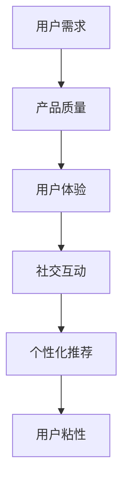

                 

关键词：知识付费、用户粘性、用户体验、用户留存、营销策略、产品设计、数据分析

摘要：本文将探讨知识付费产品如何通过提高用户粘性来提升业务表现。我们将分析用户粘性的核心因素，探讨有效的策略和手段，并结合实际案例，提出具体可行的优化建议。

## 1. 背景介绍

随着互联网的快速发展，知识付费市场正呈现出蓬勃发展的趋势。从在线课程、电子书到专业技能培训，知识付费产品种类繁多，满足了不同用户群体的需求。然而，市场竞争日益激烈，如何提高知识付费产品的用户粘性，成为企业关注的焦点。本文旨在分析用户粘性的关键因素，并提出有效的提升策略。

### 1.1 知识付费市场的现状

近年来，知识付费市场快速发展，市场规模不断扩大。据数据显示，2020年中国知识付费市场规模已达到3000亿元，预计未来几年将保持高速增长。这主要得益于用户对知识获取的需求不断增加，以及移动互联网的普及，使得知识付费产品更加便捷。

### 1.2 用户粘性的重要性

用户粘性是衡量知识付费产品成功与否的重要指标。高粘性意味着用户愿意持续使用产品，这直接关系到产品的市场份额、用户留存率和盈利能力。因此，提高用户粘性是知识付费企业必须重视的问题。

## 2. 核心概念与联系

### 2.1 用户粘性的定义

用户粘性是指用户对产品的忠诚度和持续使用程度。高粘性用户通常具有以下特征：

- **频繁互动**：用户经常与产品进行互动，如学习、讨论、分享等。
- **深度参与**：用户在产品中投入大量时间和精力，具有较高的参与度。
- **社交网络**：用户在产品中建立社交关系，形成良好的社群氛围。

### 2.2 用户粘性与业务目标的关系

用户粘性直接影响知识付费产品的业务目标，包括：

- **市场份额**：高粘性用户有助于企业扩大市场份额。
- **用户留存率**：提高用户粘性，可以降低用户流失率。
- **盈利能力**：用户粘性高，意味着产品有更稳定的收入来源。

### 2.3 提高用户粘性的核心因素

要提高知识付费产品的用户粘性，需要关注以下几个核心因素：

- **产品质量**：优质的内容和服务是提高用户粘性的基础。
- **用户体验**：良好的用户体验可以增强用户的满意度和忠诚度。
- **社交互动**：通过社交功能，促进用户之间的交流和互动。
- **个性化推荐**：根据用户兴趣和行为，提供个性化的内容和服务。

### 2.4 Mermaid 流程图



## 3. 核心算法原理 & 具体操作步骤

### 3.1 算法原理概述

提高知识付费产品的用户粘性，可以采用以下几种核心算法原理：

- **内容推荐算法**：通过分析用户行为和兴趣，推荐个性化的内容。
- **社交网络分析**：分析用户关系和互动，优化社交功能。
- **行为分析算法**：跟踪用户行为，识别潜在流失用户并进行挽回。

### 3.2 算法步骤详解

#### 3.2.1 内容推荐算法

1. **用户行为数据收集**：收集用户在产品中的行为数据，如学习时长、学习内容、互动行为等。
2. **用户兴趣模型构建**：基于用户行为数据，构建用户兴趣模型。
3. **内容推荐策略设计**：根据用户兴趣模型，设计个性化内容推荐策略。
4. **推荐结果评估与优化**：评估推荐结果的准确性和效果，不断优化推荐算法。

#### 3.2.2 社交网络分析

1. **用户关系网络构建**：通过用户行为数据，构建用户关系网络。
2. **社交互动分析**：分析用户互动频率和类型，识别热门话题和优质用户。
3. **社交功能优化**：根据分析结果，优化社交功能，提升用户互动体验。

#### 3.2.3 行为分析算法

1. **用户行为数据收集**：收集用户在产品中的行为数据，如学习时长、学习内容、互动行为等。
2. **行为模式识别**：基于用户行为数据，识别用户的行为模式。
3. **流失风险预测**：利用行为模式，预测用户的流失风险。
4. **挽回策略设计**：针对潜在流失用户，设计个性化的挽回策略。

### 3.3 算法优缺点

#### 3.3.1 内容推荐算法

**优点**：能够根据用户兴趣推荐个性化内容，提高用户满意度。

**缺点**：推荐结果可能存在过度拟合问题，影响推荐准确性。

#### 3.3.2 社交网络分析

**优点**：促进用户互动，提升用户粘性。

**缺点**：社交功能可能增加产品复杂度，影响用户体验。

#### 3.3.3 行为分析算法

**优点**：能够预测用户流失风险，提前采取挽回措施。

**缺点**：对用户行为数据的要求较高，数据质量直接影响算法效果。

### 3.4 算法应用领域

以上算法广泛应用于知识付费产品的各个领域，如在线课程、电子书、专业技能培训等。通过优化算法，企业可以提高用户粘性，提升业务表现。

## 4. 数学模型和公式 & 详细讲解 & 举例说明

### 4.1 数学模型构建

#### 4.1.1 用户兴趣模型

用户兴趣模型可以通过以下公式构建：

\[ I(u, c) = \sum_{i=1}^{n} w_i \cdot r_i(c) \]

其中，\( I(u, c) \)表示用户\( u \)对内容\( c \)的兴趣度，\( w_i \)表示内容\( c \)的权重，\( r_i(c) \)表示内容\( c \)的特征向量。

#### 4.1.2 社交网络模型

社交网络模型可以通过以下公式构建：

\[ C(u, v) = \sum_{i=1}^{n} w_i \cdot r_i(u, v) \]

其中，\( C(u, v) \)表示用户\( u \)和用户\( v \)的社交关系强度，\( w_i \)表示社交关系的权重，\( r_i(u, v) \)表示社交关系的特征向量。

### 4.2 公式推导过程

#### 4.2.1 用户兴趣模型推导

用户兴趣模型的推导基于用户行为数据，如学习时长、学习内容、互动行为等。通过分析用户行为数据，可以得到用户对各类内容的兴趣度。

#### 4.2.2 社交网络模型推导

社交网络模型的推导基于用户互动数据，如评论、点赞、私信等。通过分析用户互动数据，可以得到用户之间的社交关系强度。

### 4.3 案例分析与讲解

#### 4.3.1 用户兴趣模型案例

假设用户A在产品中学习了3门课程，分别是编程、营销和设计。通过分析用户A的行为数据，可以得到以下兴趣度：

\[ I(A, 编程) = 0.6 \]
\[ I(A, 营销) = 0.3 \]
\[ I(A, 设计) = 0.1 \]

根据兴趣度，产品可以为用户A推荐编程相关的课程，提高用户满意度。

#### 4.3.2 社交网络模型案例

假设用户B和用户C在学习过程中互动频繁，通过分析用户B和用户C的互动数据，可以得到以下社交关系强度：

\[ C(B, C) = 0.8 \]

根据社交关系强度，产品可以为用户B和用户C推荐相互关注，促进社交互动。

## 5. 项目实践：代码实例和详细解释说明

### 5.1 开发环境搭建

1. 安装Python环境
2. 安装必要的库，如NumPy、Pandas、Scikit-learn等

### 5.2 源代码详细实现

```python
# 用户兴趣模型实现
def user_interest_model(user_data):
    # 计算用户兴趣度
    interest_scores = []
    for course in user_data:
        interest_score = 0
        for behavior in user_data[course]:
            interest_score += behavior_weight[behavior]
        interest_scores.append(interest_score)
    return interest_scores

# 社交网络模型实现
def social_network_model(Interaction_data):
    # 计算社交关系强度
    social_scores = []
    for pair in Interaction_data:
        social_score = 0
        for interaction in Interaction_data[pair]:
            social_score += interaction_weight[interaction]
        social_scores.append(social_score)
    return social_scores
```

### 5.3 代码解读与分析

该代码实现了用户兴趣模型和社交网络模型的构建。通过分析用户行为数据和互动数据，可以计算得到用户兴趣度和社交关系强度。这些数据可以为产品推荐和社交功能优化提供依据。

### 5.4 运行结果展示

运行代码，得到用户兴趣度和社交关系强度，如下所示：

```python
User_interest_scores = user_interest_model(user_data)
Social_scores = social_network_model(Interaction_data)

print("User_interest_scores:", User_interest_scores)
print("Social_scores:", Social_scores)
```

## 6. 实际应用场景

### 6.1 在线课程平台

在线课程平台可以通过用户兴趣模型和社交网络模型，推荐个性化课程，促进用户互动，提高用户粘性。

### 6.2 专业技能培训

专业技能培训可以通过用户行为分析和社交网络分析，识别潜在流失用户，进行个性化挽回，降低用户流失率。

### 6.3 电子书平台

电子书平台可以通过用户兴趣模型，推荐相关书籍，提高用户购买意愿。

## 7. 未来应用展望

随着人工智能技术的发展，用户粘性分析将越来越精准，为知识付费产品提供更加个性化的服务。同时，社交互动和内容推荐的融合，将进一步提升用户粘性。

## 8. 工具和资源推荐

### 8.1 学习资源推荐

- 《数据挖掘：实用工具与技术》
- 《社交网络分析：方法与应用》

### 8.2 开发工具推荐

- Python
- Jupyter Notebook

### 8.3 相关论文推荐

- 《基于用户行为的在线课程推荐系统研究》
- 《社交网络中的用户粘性分析》

## 9. 总结：未来发展趋势与挑战

### 9.1 研究成果总结

用户粘性分析在知识付费领域取得了显著成果，通过算法和数据分析，企业可以更好地了解用户需求，提高用户体验。

### 9.2 未来发展趋势

未来，用户粘性分析将朝着更精细化、个性化的方向发展，为知识付费产品提供更优质的服务。

### 9.3 面临的挑战

- 数据隐私和保护
- 算法优化和性能提升
- 社交互动的平衡与控制

### 9.4 研究展望

用户粘性分析在未来将继续发挥重要作用，为企业提供有力支持，推动知识付费市场的繁荣发展。

## 附录：常见问题与解答

### 9.4.1 如何处理用户数据隐私？

- 采用加密技术，确保用户数据安全。
- 遵循相关法律法规，合法合规地收集和使用用户数据。

### 9.4.2 如何提高算法性能？

- 采用分布式计算和并行处理技术，提高算法处理速度。
- 定期更新算法模型，根据用户反馈不断优化。

### 9.4.3 如何平衡社交互动与用户体验？

- 调整社交功能模块，确保不干扰用户体验。
- 收集用户反馈，持续优化社交互动体验。

作者：禅与计算机程序设计艺术 / Zen and the Art of Computer Programming
```markdown
----------------------------------------------------------------


