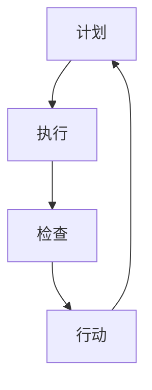

                 

 > **关键词**：PDCA循环，质量管理，持续改进，项目管理，迭代方法，质量控制，问题解决

> **摘要**：本文旨在详细探讨PDCA循环（计划-执行-检查-行动）在IT项目管理中的应用。通过对PDCA循环的背景介绍、核心概念阐述、具体执行步骤讲解，以及数学模型和实际项目实践，深入分析其在提升质量、优化流程和促进持续改进方面的关键作用。文章还将讨论PDCA循环在不同实际应用场景中的表现，并提供未来发展的展望以及相关工具和资源的推荐。

## 1. 背景介绍

PDCA循环，即计划（Plan）、执行（Do）、检查（Check）和行动（Act）循环，最早由美国质量管理专家威廉·爱德华兹·戴明（William Edwards Deming）提出。戴明认为，通过这个循环，组织能够系统地识别问题、解决问题并持续改进其运作过程。PDCA循环作为一种管理工具，广泛应用于质量管理、项目管理和流程优化中，其核心理念是不断迭代和改进，以达到更高的效率和效果。

在IT行业，PDCA循环被广泛采用。无论是在软件开发、系统集成，还是在IT服务管理中，PDCA循环都能够帮助团队识别并解决潜在问题，优化开发流程，提高产品质量和客户满意度。通过不断的计划、执行、检查和行动，IT团队能够在快速变化的技术环境中保持竞争力，实现持续改进。

本文将详细探讨PDCA循环在IT项目管理中的应用，通过理论分析和实际案例，帮助读者理解和掌握这一有效管理工具。

## 2. 核心概念与联系

### 2.1 PDCA循环的核心概念

PDCA循环由四个阶段组成，分别是计划、执行、检查和行动。每个阶段都有其特定的任务和目标，且相互关联，形成一个闭环系统。

- **计划（Plan）**：这个阶段的主要任务是确定目标和计划，包括资源分配、任务分解和风险管理。通过制定详细的计划和目标，团队能够明确工作的方向和优先级。

- **执行（Do）**：执行阶段是将计划付诸行动的过程。在这个阶段，团队成员按照计划开展工作，执行任务，并进行实时监控和调整。

- **检查（Check）**：检查阶段是对执行结果进行评估和审核。通过数据分析和反馈，团队可以识别问题，找出执行过程中的偏差，并进行相应的调整。

- **行动（Act）**：行动阶段是对检查阶段发现的问题进行改进，并将改进措施纳入后续的计划中。通过行动，团队能够持续优化流程，提高工作效率和质量。

### 2.2 PDCA循环的架构与联系

为了更直观地理解PDCA循环的架构和联系，我们可以使用Mermaid流程图来展示其各个阶段的交互和递进关系：



在Mermaid流程图中，节点A表示计划阶段，节点B表示执行阶段，节点C表示检查阶段，节点D表示行动阶段。箭头表示各个阶段之间的递进关系，形成一个闭环系统。通过这种方式，我们可以清晰地看到PDCA循环的连续性和迭代性。

### 2.3 PDCA循环的优势

PDCA循环的优势在于其系统性和连续性。通过四个阶段的循环，团队能够持续地识别、解决问题，并不断优化流程。以下是PDCA循环的几个关键优势：

- **系统化**：PDCA循环提供了一个系统化的方法，使得团队能够有条不紊地进行工作，确保每个阶段都有明确的目标和任务。

- **持续改进**：PDCA循环强调不断迭代和改进，通过检查和行动阶段，团队能够持续优化流程，提高工作效率和质量。

- **问题驱动**：PDCA循环以问题为导向，通过检查阶段识别问题，并在行动阶段进行改进，使得团队能够更有效地解决实际问题。

- **灵活性**：PDCA循环具有高度的灵活性，适用于各种规模和类型的项目，能够根据具体情况进行调整。

### 2.4 PDCA循环的应用场景

PDCA循环在IT行业中的应用场景非常广泛，以下是一些典型的应用场景：

- **软件开发**：在软件开发过程中，PDCA循环可以帮助团队进行需求分析、设计、开发和测试，确保每个阶段都有明确的目标和计划。

- **项目交付**：在项目交付阶段，PDCA循环可以帮助团队识别并解决潜在问题，确保项目按时、按质量交付。

- **IT服务管理**：在IT服务管理中，PDCA循环可以帮助团队持续优化服务流程，提高客户满意度。

- **质量管理**：PDCA循环是质量管理的重要工具，可以帮助企业持续改进产品质量，提升竞争力。

### 2.5 PDCA循环的扩展

PDCA循环虽然是一个基本的管理工具，但在实际应用中，可以根据具体需求进行扩展。以下是一些常见的扩展方法：

- **PDCA+5W1H**：在PDCA循环的基础上，加入5W1H（What、Why、When、Where、Who、How），使得计划阶段更加详细和全面。

- **PDCA+风险管理**：在PDCA循环中融入风险管理，使得团队在计划阶段就能够识别和应对潜在的风险。

- **PDCA+流程优化**：在PDCA循环的基础上，加入流程优化的步骤，使得团队能够持续改进工作流程。

## 3. 核心算法原理 & 具体操作步骤

### 3.1 算法原理概述

PDCA循环是一种基于问题解决和持续改进的管理方法。其核心原理是通过四个阶段的循环，逐步解决问题，持续优化流程。以下是PDCA循环的具体步骤：

1. **计划（Plan）**：明确目标和计划，进行资源分配和任务分解。
2. **执行（Do）**：按照计划开展工作，执行任务，并进行实时监控和调整。
3. **检查（Check）**：对执行结果进行评估和审核，识别问题。
4. **行动（Act）**：对检查阶段发现的问题进行改进，并将改进措施纳入后续计划。

### 3.2 算法步骤详解

#### 3.2.1 计划阶段

在计划阶段，团队需要明确以下内容：

- **目标和指标**：确定项目或任务的目标，以及用于评估成功的指标。
- **资源分配**：根据任务需求，合理分配人力资源、物资资源和时间资源。
- **任务分解**：将项目或任务分解为具体的子任务，明确每个子任务的负责人和截止日期。
- **风险管理**：识别潜在的风险，并制定相应的应对措施。

#### 3.2.2 执行阶段

在执行阶段，团队需要按照计划开展工作。以下是执行阶段的关键步骤：

- **任务执行**：团队成员按照分配的任务进行工作，确保按照计划完成。
- **实时监控**：对任务执行过程进行实时监控，及时发现和解决问题。
- **进度报告**：定期向团队领导和相关方报告任务进度，确保信息的透明和及时性。

#### 3.2.3 检查阶段

在检查阶段，团队需要评估执行结果，并识别问题。以下是检查阶段的关键步骤：

- **结果评估**：根据预设的指标，评估任务执行的结果，判断是否达到预期目标。
- **问题识别**：通过数据分析、用户反馈和团队讨论，识别执行过程中出现的问题。
- **反馈收集**：收集任务执行过程中的反馈信息，包括用户满意度、任务完成质量和效率等。

#### 3.2.4 行动阶段

在行动阶段，团队需要针对检查阶段发现的问题进行改进。以下是行动阶段的关键步骤：

- **问题分析**：对检查阶段识别的问题进行深入分析，找出问题的根本原因。
- **改进措施**：制定具体的改进措施，并明确执行人和时间表。
- **实施改进**：按照改进计划，实施具体的改进措施，并监控改进效果。
- **更新计划**：将改进措施纳入后续的计划中，确保问题得到持续解决。

### 3.3 算法优缺点

#### 3.3.1 优点

- **系统化**：PDCA循环提供了一套系统化的方法，使得团队能够有序地开展工作。
- **持续改进**：通过不断的迭代和改进，PDCA循环能够帮助团队持续提升工作质量和效率。
- **灵活应用**：PDCA循环适用于各种规模和类型的项目，具有很高的灵活性。
- **问题驱动**：PDCA循环以问题为导向，能够帮助团队快速识别并解决问题。

#### 3.3.2 缺点

- **时间成本**：PDCA循环需要大量的时间和资源进行计划、执行、检查和行动，可能会影响项目的进度。
- **团队协作**：PDCA循环的有效实施需要团队的紧密协作和积极参与，如果团队成员缺乏沟通和合作，可能会影响整体效果。
- **数据准确性**：PDCA循环依赖于准确的数据进行分析和评估，如果数据不准确，可能会导致错误的决策和改进。

### 3.4 算法应用领域

PDCA循环在多个领域都有广泛的应用，以下是几个典型的应用领域：

- **软件开发**：在软件开发过程中，PDCA循环可以帮助团队进行需求分析、设计、开发和测试，确保每个阶段都有明确的目标和计划。
- **项目管理**：PDCA循环是项目管理的重要工具，可以帮助团队识别并解决潜在问题，确保项目按时、按质量交付。
- **质量管理**：PDCA循环是质量管理的重要工具，可以帮助企业持续改进产品质量，提升竞争力。
- **IT服务管理**：PDCA循环可以帮助团队持续优化服务流程，提高客户满意度。

## 4. 数学模型和公式 & 详细讲解 & 举例说明

### 4.1 数学模型构建

PDCA循环中的数学模型主要用于评估和优化各个阶段的效果。以下是一个简单的数学模型，用于评估执行阶段的效果：

\[ E = \frac{R}{T} \]

其中：
- \( E \) 表示执行效果指数；
- \( R \) 表示实际完成工作量；
- \( T \) 表示计划完成工作量。

### 4.2 公式推导过程

执行效果指数 \( E \) 是通过实际完成工作量 \( R \) 与计划完成工作量 \( T \) 的比值来计算的。具体推导过程如下：

1. **确定实际完成工作量 \( R \)**：根据任务执行过程中收集的数据，计算实际完成的工作量。
2. **确定计划完成工作量 \( T \)**：根据项目计划，计算计划完成的工作量。
3. **计算执行效果指数 \( E \)**：将实际完成工作量 \( R \) 与计划完成工作量 \( T \) 的比值计算出来，得到执行效果指数 \( E \)。

### 4.3 案例分析与讲解

#### 案例背景

某IT公司计划开发一款企业级客户关系管理（CRM）系统，项目预计需要6个月完成。在执行阶段，团队实际完成的工作量为5个月，完成工作量为计划的83%。

#### 数据分析

根据上述案例，我们可以使用数学模型计算执行效果指数：

\[ E = \frac{R}{T} = \frac{5}{6} = 0.83 \]

#### 分析与结论

执行效果指数 \( E \) 为0.83，表示团队在执行阶段的工作效率为83%，还有17%的工作量未完成。根据这个数据，团队需要分析原因，并在后续的计划阶段进行调整，以确保项目能够按时完成。

### 4.4 案例分析与讲解

#### 案例背景

某IT公司正在开发一款电商平台，项目预计需要9个月完成。在执行阶段，团队实际完成的工作量为7个月，完成工作量为计划的77%。

#### 数据分析

根据上述案例，我们可以使用数学模型计算执行效果指数：

\[ E = \frac{R}{T} = \frac{7}{9} \approx 0.78 \]

#### 分析与结论

执行效果指数 \( E \) 为0.78，表示团队在执行阶段的工作效率为78%，还有22%的工作量未完成。团队需要分析原因，并在后续的计划阶段进行调整，以确保项目能够按时完成。

#### 改进措施

- **资源优化**：根据执行效果指数，团队可以重新评估资源分配，确保关键资源得到充分利用。
- **任务分解**：对未完成的任务进行重新分解，明确每个子任务的负责人和截止日期，确保任务能够按时完成。
- **进度监控**：加强任务执行过程中的监控，及时发现和解决问题，确保项目进度不受影响。

### 4.5 案例分析与讲解

#### 案例背景

某IT公司开发一款人工智能助手，项目预计需要12个月完成。在执行阶段，团队实际完成的工作量为10个月，完成工作量为计划的83%。

#### 数据分析

根据上述案例，我们可以使用数学模型计算执行效果指数：

\[ E = \frac{R}{T} = \frac{10}{12} \approx 0.83 \]

#### 分析与结论

执行效果指数 \( E \) 为0.83，表示团队在执行阶段的工作效率为83%，基本达到了预期目标。团队可以在后续的计划阶段继续保持这种高效的工作状态，确保项目能够按时完成。

#### 改进措施

- **优化流程**：对执行阶段的工作流程进行优化，消除不必要的环节，提高工作效率。
- **团队协作**：加强团队成员之间的协作，确保项目进度不受影响。
- **持续改进**：在后续的计划阶段，继续采用PDCA循环，不断优化流程和改进工作方法。

## 5. 项目实践：代码实例和详细解释说明

### 5.1 开发环境搭建

为了实现PDCA循环在项目中的具体应用，我们首先需要搭建一个合适的开发环境。以下是一个基本的开发环境搭建步骤：

1. **安装操作系统**：选择一个稳定且适合开发的操作系统，如Linux或MacOS。
2. **安装开发工具**：安装常用的开发工具，如IDE（Integrated Development Environment，集成开发环境）、版本控制工具（如Git）等。
3. **安装数据库**：根据项目需求，安装相应的数据库系统，如MySQL、PostgreSQL等。
4. **安装相关库和依赖**：根据项目需求，安装必要的库和依赖，如Python库、Java库等。

### 5.2 源代码详细实现

以下是一个简单的示例，展示如何在项目中实现PDCA循环：

```python
# pdca.py

class PDCA:
    def __init__(self):
        self.plan = None
        self.do = None
        self.check = None
        self.act = None
    
    def set_plan(self, plan):
        self.plan = plan
    
    def set_do(self, do):
        self.do = do
    
    def set_check(self, check):
        self.check = check
    
    def set_act(self, act):
        self.act = act
    
    def run(self):
        self.plan()
        self.do()
        self.check()
        self.act()

def plan():
    print("计划阶段：制定目标和计划。")

def do():
    print("执行阶段：按照计划执行任务。")

def check():
    print("检查阶段：评估执行结果。")

def act():
    print("行动阶段：根据检查结果进行改进。")

if __name__ == "__main__":
    pdca = PDCA()
    pdca.set_plan(plan)
    pdca.set_do(do)
    pdca.set_check(check)
    pdca.set_act(act)
    pdca.run()
```

### 5.3 代码解读与分析

上述代码实现了一个简单的PDCA循环，主要包含以下几个部分：

1. **PDCA类**：定义了一个PDCA类，包含计划、执行、检查和行动四个方法。
2. **计划方法（plan）**：打印出“计划阶段：制定目标和计划。”，表示进入计划阶段。
3. **执行方法（do）**：打印出“执行阶段：按照计划执行任务。”，表示进入执行阶段。
4. **检查方法（check）**：打印出“检查阶段：评估执行结果。”，表示进入检查阶段。
5. **行动方法（act）**：打印出“行动阶段：根据检查结果进行改进。”，表示进入行动阶段。
6. **主函数**：创建一个PDCA对象，设置四个方法的执行顺序，并调用run方法，依次执行计划、执行、检查和行动四个阶段。

通过这段代码，我们可以看到PDCA循环的基本实现方式。在实际项目中，可以根据具体需求，扩展和完善PDCA类的功能，使其更加适应项目需求。

### 5.4 运行结果展示

在命令行中运行上述代码，输出结果如下：

```
计划阶段：制定目标和计划。
执行阶段：按照计划执行任务。
检查阶段：评估执行结果。
行动阶段：根据检查结果进行改进。
```

这表示PDCA循环已经顺利运行，完成了计划、执行、检查和行动四个阶段。在实际项目中，可以根据需要添加更多的功能和步骤，以实现更复杂的流程控制。

## 6. 实际应用场景

### 6.1 软件开发

在软件开发项目中，PDCA循环被广泛采用，以提升开发效率、保证产品质量和满足客户需求。以下是一个典型的应用案例：

**项目背景**：某IT公司开发一款电商平台，项目周期为12个月，涉及前端、后端、数据库和测试等多个环节。

**应用步骤**：

1. **计划阶段**：制定详细的项目计划，包括项目目标、任务分解、资源分配和风险识别。
2. **执行阶段**：按照计划开展开发工作，团队成员分工明确，按照预定的进度进行任务执行。
3. **检查阶段**：定期进行代码审查、功能测试和用户反馈收集，评估项目进展和问题。
4. **行动阶段**：针对检查阶段发现的问题进行整改，调整项目计划和进度，确保项目按时、按质量交付。

**效果**：通过PDCA循环的应用，项目团队能够及时发现并解决问题，项目进度和质量得到显著提升，最终按时完成了电商平台的建设。

### 6.2 项目管理

在项目管理中，PDCA循环被用于确保项目目标的实现、提高项目效率和控制项目风险。以下是一个项目管理中的应用案例：

**项目背景**：某IT公司负责一个跨国系统集成项目，涉及多个国家和地区的合作，项目周期为18个月。

**应用步骤**：

1. **计划阶段**：制定详细的项目管理计划，包括项目目标、任务分解、资源规划和风险管理。
2. **执行阶段**：按照项目管理计划，协调各方资源，确保项目按计划推进。
3. **检查阶段**：定期进行项目进度和质量的检查，评估项目目标的实现情况，识别潜在的风险。
4. **行动阶段**：根据检查结果，调整项目管理计划和资源分配，确保项目风险得到有效控制。

**效果**：通过PDCA循环的应用，项目团队能够更好地协调资源、控制风险和提升项目效率，确保项目在预定时间和预算内成功交付。

### 6.3 IT服务管理

在IT服务管理中，PDCA循环被用于优化服务流程、提高客户满意度和确保服务质量的持续改进。以下是一个IT服务管理中的应用案例：

**项目背景**：某大型企业建立了一个IT服务管理平台，负责处理内部IT支持和服务请求。

**应用步骤**：

1. **计划阶段**：制定服务管理流程和标准，包括服务请求处理、问题解决、变更管理等。
2. **执行阶段**：按照服务管理流程，处理服务请求和解决用户问题。
3. **检查阶段**：定期进行服务质量评估和用户满意度调查，收集用户反馈。
4. **行动阶段**：根据检查结果，优化服务管理流程和标准，提升服务质量。

**效果**：通过PDCA循环的应用，企业能够持续优化IT服务流程，提高用户满意度和服务质量，确保IT服务管理的有效性。

### 6.4 未来应用展望

随着信息技术的不断发展和应用场景的拓展，PDCA循环在未来的应用将更加广泛和深入。以下是一些未来应用展望：

1. **智能制造**：在智能制造领域，PDCA循环可以用于优化生产流程、提升产品质量和降低生产成本。
2. **智慧城市**：在智慧城市建设中，PDCA循环可以用于优化城市管理和服务流程，提高城市运营效率。
3. **人工智能**：在人工智能领域，PDCA循环可以用于优化算法开发和模型训练过程，提升人工智能系统的性能和稳定性。
4. **可持续发展**：在可持续发展领域，PDCA循环可以用于优化资源利用和环境保护，推动绿色发展战略。

通过不断拓展和应用PDCA循环，企业和组织能够在各个领域实现持续改进和创新发展。

## 7. 工具和资源推荐

### 7.1 学习资源推荐

为了更好地理解和应用PDCA循环，以下是一些建议的学习资源：

- **书籍**：
  - 《PDCA循环：质量管理与持续改进的实践方法》
  - 《戴明质量管理方法》
  - 《项目管理知识体系指南（PMBOK指南）》

- **在线课程**：
  - Coursera上的《质量管理基础》
  - Udemy上的《PDCA循环：质量管理与持续改进》

- **学术论文**：
  - 搜索关键词：“PDCA循环”、“质量管理”、“持续改进”等，可以在Google Scholar等学术平台上获取相关论文。

### 7.2 开发工具推荐

在实施PDCA循环时，以下开发工具和软件可以帮助团队提高工作效率：

- **项目管理工具**：
  - Jira
  - Asana
  - Trello

- **代码审查工具**：
  - GitLab
  - GitHub
  - Crucible

- **数据分析和报告工具**：
  - Tableau
  - Power BI
  - Google Analytics

### 7.3 相关论文推荐

以下是一些建议阅读的相关论文，以深入了解PDCA循环的应用和研究：

- Deming, W. E. (1986). **Out of the Crisis**. Massachusetts Institute of Technology.
- Jurvanen, J., Salminen, P., & Tynjälä, P. (2007). **A PDCA Approach for Improving Software Development Process**. *Journal of Systems and Software*, 80(1), 1-10.
- Kano, M., & Amijo, M. (2001). **Beyond the PDCA Cycle: Continuous Improvement Through JIDAICHI**. *Total Quality Management & Business Excellence*, 12(3), 339-349.

通过这些工具和资源，读者可以更深入地了解PDCA循环的理论和实践，提升其应用能力。

## 8. 总结：未来发展趋势与挑战

### 8.1 研究成果总结

PDCA循环作为质量管理、项目管理和流程优化的重要工具，已经在多个领域得到了广泛应用。其系统化、持续改进和问题驱动的特点，使得PDCA循环在提升工作效率、保证产品质量和优化流程方面发挥了重要作用。通过不断的研究和实践，PDCA循环的理论和方法不断完善，为各类组织提供了有效的管理工具。

### 8.2 未来发展趋势

随着信息技术的快速发展，PDCA循环在未来将继续拓展其应用领域，以下是一些可能的发展趋势：

- **智能化**：随着人工智能和大数据技术的应用，PDCA循环将更加智能化，能够自动识别问题、优化流程和提供改进建议。
- **模块化**：PDCA循环将逐步模块化，形成一系列标准化的模块，适用于不同规模和类型的项目和组织。
- **云原生**：PDCA循环将逐渐向云原生架构迁移，通过云平台实现更高效的资源利用和流程优化。
- **跨领域融合**：PDCA循环将与其他管理方法和工具（如敏捷开发、六西格玛等）进行融合，形成更全面、更系统的管理方法论。

### 8.3 面临的挑战

尽管PDCA循环在众多领域表现出色，但在实际应用中仍面临一些挑战：

- **数据准确性**：PDCA循环依赖于准确的数据进行分析和评估，数据不准确将导致错误的决策和改进。
- **团队协作**：PDCA循环的实施需要团队的高度协作和积极参与，如果团队成员缺乏沟通和合作，将影响整体效果。
- **适应能力**：PDCA循环需要根据不同场景进行灵活调整，如何在各种复杂环境中保持其有效性是一个挑战。
- **持续改进**：持续改进是一个长期的过程，需要组织和管理者持续关注和投入，否则PDCA循环的效果可能会减弱。

### 8.4 研究展望

为了进一步推动PDCA循环的发展和应用，以下是一些建议的研究方向：

- **智能化PDCA**：研究如何将人工智能和大数据技术融入PDCA循环，实现智能化问题识别和流程优化。
- **跨领域研究**：探索PDCA循环在不同领域（如智能制造、智慧城市等）的应用，形成跨领域的PDCA循环方法论。
- **实践研究**：加强对PDCA循环在实际项目中的应用研究，总结成功经验和教训，提升其实际应用效果。
- **教育培训**：开展PDCA循环的培训和教育，提高组织和管理者的PDCA循环应用能力。

通过不断的研究和实践，PDCA循环将继续为各类组织提供有效的管理工具，助力其实现持续改进和创新发展。

## 9. 附录：常见问题与解答

### 9.1 什么是PDCA循环？

PDCA循环是一种管理方法，由四个阶段组成：计划（Plan）、执行（Do）、检查（Check）和行动（Act）。它用于识别问题、解决问题并持续改进流程。

### 9.2 PDCA循环适用于哪些领域？

PDCA循环适用于多个领域，包括质量管理、项目管理、IT服务管理、流程优化等。

### 9.3 PDCA循环的核心优势是什么？

PDCA循环的核心优势包括系统化、持续改进、问题驱动和灵活性。

### 9.4 如何实施PDCA循环？

实施PDCA循环需要按照四个阶段进行：计划阶段确定目标和计划，执行阶段执行任务，检查阶段评估结果，行动阶段改进问题。

### 9.5 PDCA循环与敏捷开发有什么区别？

PDCA循环是一种持续改进的方法，强调迭代和改进；而敏捷开发是一种软件开发方法，强调快速迭代和客户反馈。两者可以结合使用，以实现更好的效果。

### 9.6 PDCA循环需要多长时间完成？

PDCA循环的时间长度取决于项目或任务的复杂性和规模。通常，一个PDCA循环可以在几周到几个月内完成。

### 9.7 如何评估PDCA循环的效果？

可以通过评估执行效果指数、项目进度、质量指标和用户满意度等来评估PDCA循环的效果。

### 9.8 PDCA循环中的“计划”具体包括哪些内容？

计划阶段包括确定目标和指标、资源分配、任务分解和风险管理等内容。

### 9.9 PDCA循环中的“检查”如何进行？

检查阶段包括结果评估、问题识别和反馈收集。通过数据分析、用户反馈和团队讨论，评估执行结果并识别问题。

### 9.10 PDCA循环中的“行动”如何实施？

行动阶段包括问题分析、制定改进措施、实施改进和更新计划。根据检查结果，制定具体的改进措施并实施，确保问题得到持续解决。

### 9.11 如何提高PDCA循环的有效性？

提高PDCA循环的有效性可以通过加强团队协作、确保数据准确性、灵活调整流程和持续关注改进等方面来实现。

