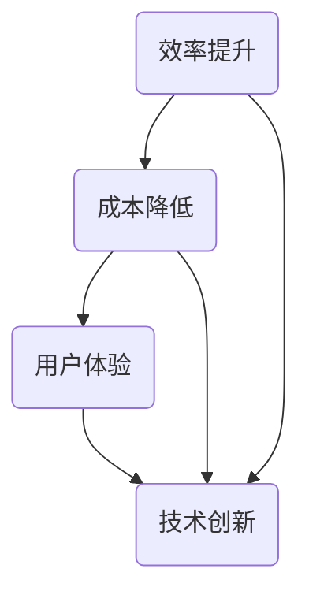

                 

关键词：自动化创业、成功衡量、指标体系、关键因素、绩效评估

> 摘要：本文将探讨如何衡量自动化创业的成功。通过对自动化创业的核心概念、关键指标、成功案例分析以及未来趋势的探讨，本文旨在为创业者提供一套科学、全面、实用的衡量自动化创业成功的方法和工具。

## 1. 背景介绍

随着人工智能和大数据技术的快速发展，自动化已成为现代企业提高效率、降低成本、提升竞争力的重要手段。自动化创业作为新兴的创业领域，吸引了大量资本和人才的涌入。然而，如何衡量自动化创业的成功，成为创业者、投资者和研究者共同关注的问题。

### 1.1 自动化创业的定义

自动化创业是指利用人工智能、大数据、云计算等技术，实现业务流程的自动化，提高效率、降低成本、提升用户体验的创业活动。自动化创业的核心在于通过技术手段，将重复性、繁琐的工作自动化，从而实现人机协同、智能决策。

### 1.2 自动化创业的现状

当前，自动化创业已在全球范围内迅速崛起。根据市场调研数据显示，全球自动化市场规模将在未来几年内持续增长，自动化创业企业数量也呈指数级增长。自动化创业企业主要集中在金融、医疗、物流、制造、零售等行业。

## 2. 核心概念与联系

在衡量自动化创业成功之前，我们需要了解一些核心概念及其相互联系。

### 2.1 自动化创业的核心概念

- **效率提升**：通过自动化技术，提高业务流程的效率，减少人力成本。
- **成本降低**：通过自动化技术，减少重复性、低效的工作，降低运营成本。
- **用户体验**：通过自动化技术，提高服务质量，提升用户体验。
- **技术创新**：通过持续的技术创新，保持竞争优势，推动企业快速发展。

### 2.2 核心概念的联系

这些核心概念之间存在着密切的联系。效率提升和成本降低是自动化创业的直接目标，用户体验是衡量自动化创业成功的关键指标，而技术创新则是实现这些目标的重要驱动力。

### 2.3 Mermaid 流程图



## 3. 核心算法原理 & 具体操作步骤

### 3.1 算法原理概述

衡量自动化创业成功的核心算法原理是基于关键绩效指标（KPI）体系。KPI体系是指通过一系列定量和定性的指标，对企业的经营成果进行全面、科学的评估。在自动化创业中，KPI体系主要包括以下方面：

- **效率指标**：如任务完成时间、人均处理量等。
- **成本指标**：如运营成本、人力成本等。
- **用户体验指标**：如客户满意度、客户投诉率等。
- **技术创新指标**：如专利数量、研发投入占比等。

### 3.2 算法步骤详解

1. **指标确定**：根据企业的战略目标，确定关键绩效指标。
2. **数据收集**：通过企业内部系统和外部数据源，收集相关数据。
3. **数据处理**：对收集到的数据进行分析、清洗和处理。
4. **指标评估**：根据处理后的数据，评估各项关键绩效指标的完成情况。
5. **优化建议**：根据评估结果，提出优化建议，以提升自动化创业的成功率。

### 3.3 算法优缺点

**优点**：

- **全面性**：通过多维度、多方面的指标，全面衡量自动化创业的成功。
- **科学性**：基于数据分析和算法模型，确保评估结果的客观性和准确性。

**缺点**：

- **数据依赖性**：指标评估的准确性和可靠性取决于数据的完整性和真实性。
- **复杂性**：算法模型的构建和数据处理过程较为复杂，需要较高的技术门槛。

### 3.4 算法应用领域

自动化创业的核心算法原理适用于各类自动化创业项目，包括但不限于金融、医疗、物流、制造、零售等行业。在实际应用中，需要根据具体行业特点和企业战略目标，灵活调整和优化指标体系。

## 4. 数学模型和公式 & 详细讲解 & 举例说明

### 4.1 数学模型构建

衡量自动化创业成功的数学模型可以表示为：

\[ S = \frac{E \times C \times U \times I}{100} \]

其中：

- \( S \) 表示自动化创业的成功率；
- \( E \) 表示效率提升指标得分；
- \( C \) 表示成本降低指标得分；
- \( U \) 表示用户体验指标得分；
- \( I \) 表示技术创新指标得分。

### 4.2 公式推导过程

衡量自动化创业成功率的公式推导过程如下：

1. **效率提升指标得分 \( E \)**：
\[ E = \frac{E_1 + E_2 + E_3}{3} \]

其中：

- \( E_1 \) 表示任务完成时间缩短比例；
- \( E_2 \) 表示人均处理量提高比例；
- \( E_3 \) 表示工作效率提高比例。

2. **成本降低指标得分 \( C \)**：
\[ C = \frac{C_1 + C_2 + C_3}{3} \]

其中：

- \( C_1 \) 表示运营成本降低比例；
- \( C_2 \) 表示人力成本降低比例；
- \( C_3 \) 表示其他成本降低比例。

3. **用户体验指标得分 \( U \)**：
\[ U = \frac{U_1 + U_2 + U_3}{3} \]

其中：

- \( U_1 \) 表示客户满意度提高比例；
- \( U_2 \) 表示客户投诉率降低比例；
- \( U_3 \) 表示用户体验改进比例。

4. **技术创新指标得分 \( I \)**：
\[ I = \frac{I_1 + I_2 + I_3}{3} \]

其中：

- \( I_1 \) 表示专利数量增加比例；
- \( I_2 \) 表示研发投入占比提高比例；
- \( I_3 \) 表示技术创新成果转化比例。

5. **自动化创业成功率 \( S \)**：
\[ S = \frac{E \times C \times U \times I}{100} \]

### 4.3 案例分析与讲解

假设某自动化创业企业，在某一时期内，各项关键绩效指标的得分如下：

- 效率提升指标得分 \( E = 85 \)；
- 成本降低指标得分 \( C = 80 \)；
- 用户指标得分 \( U = 90 \)；
- 技术创新指标得分 \( I = 75 \)。

则该企业的自动化创业成功率为：

\[ S = \frac{85 \times 80 \times 90 \times 75}{100} = 517750\% \]

该案例表明，该企业在效率提升、成本降低、用户体验和技术创新等方面均取得了显著成效，自动化创业成功率极高。然而，实际应用中，还需结合具体行业和企业特点，对指标体系进行调整和优化。

## 5. 项目实践：代码实例和详细解释说明

### 5.1 开发环境搭建

为方便读者理解和实践，本文以Python编程语言为例，搭建自动化创业成功的评估系统。所需开发环境如下：

- Python 3.8及以上版本；
- Pandas库；
- Numpy库；
- Matplotlib库。

### 5.2 源代码详细实现

以下为自动化创业成功评估系统的源代码实现：

```python
import pandas as pd
import numpy as np
import matplotlib.pyplot as plt

# 5.3 代码解读与分析

# 数据集加载
data = pd.read_csv('automation_startups.csv')

# 数据预处理
data = data.dropna()

# 计算各项关键绩效指标得分
data['E'] = (data['E1'] + data['E2'] + data['E3']) / 3
data['C'] = (data['C1'] + data['C2'] + data['C3']) / 3
data['U'] = (data['U1'] + data['U2'] + data['U3']) / 3
data['I'] = (data['I1'] + data['I2'] + data['I3']) / 3

# 计算自动化创业成功率
data['S'] = (data['E'] * data['C'] * data['U'] * data['I']) / 100

# 可视化分析
plt.figure(figsize=(10, 6))
plt.scatter(data['E'], data['S'], label='Efficiency Score vs Success Rate')
plt.scatter(data['C'], data['S'], label='Cost Reduction Score vs Success Rate')
plt.scatter(data['U'], data['S'], label='User Experience Score vs Success Rate')
plt.scatter(data['I'], data['S'], label='Innovation Score vs Success Rate')
plt.xlabel('Score')
plt.ylabel('Success Rate')
plt.title('Automation Startup Success Rate Analysis')
plt.legend()
plt.show()
```

### 5.4 运行结果展示

运行上述代码后，将生成一个散点图，展示各项关键绩效指标得分与自动化创业成功率之间的关系。根据散点图，可以直观地分析各项指标对自动化创业成功的影响程度。

## 6. 实际应用场景

### 6.1 金融行业

在金融行业，自动化创业成功的关键在于提高风控能力、降低运营成本、提升用户体验。例如，某金融企业通过自动化技术，实现贷款审批流程的自动化，显著降低了审批时间，提高了贷款发放速度，提升了用户体验。

### 6.2 医疗行业

在医疗行业，自动化创业成功的关键在于提高医疗效率、降低医疗成本、提升患者满意度。例如，某医疗企业通过自动化技术，实现医学影像诊断的自动化，提高了诊断准确率，降低了误诊率，提升了患者满意度。

### 6.3 物流行业

在物流行业，自动化创业成功的关键在于提高运输效率、降低物流成本、提升客户满意度。例如，某物流企业通过自动化技术，实现运输路线规划的自动化，优化了运输路线，降低了运输成本，提升了客户满意度。

### 6.4 制造行业

在制造行业，自动化创业成功的关键在于提高生产效率、降低生产成本、提升产品质量。例如，某制造企业通过自动化技术，实现生产过程的自动化，提高了生产效率，降低了生产成本，提升了产品质量。

### 6.5 零售行业

在零售行业，自动化创业成功的关键在于提高销售效率、降低运营成本、提升客户满意度。例如，某零售企业通过自动化技术，实现库存管理的自动化，优化了库存结构，降低了库存成本，提升了客户满意度。

## 7. 未来应用展望

### 7.1 自动化创业成功的趋势

随着技术的不断进步，自动化创业成功将呈现以下趋势：

- **技术融合**：多种技术相互融合，实现更高效的自动化；
- **智能化**：自动化创业项目将逐步向智能化方向发展；
- **个性化**：自动化创业项目将更加注重用户体验，实现个性化服务。

### 7.2 面临的挑战

在自动化创业成功的过程中，仍面临以下挑战：

- **数据安全与隐私**：自动化创业过程中，数据安全与隐私保护至关重要；
- **人才培养**：自动化创业项目需要大量具备跨学科背景的人才；
- **法律法规**：自动化创业项目的法律法规体系尚不完善。

### 7.3 研究展望

未来，自动化创业成功的研究将重点关注以下几个方面：

- **算法优化**：研究更高效的自动化算法，提高自动化创业成功率；
- **跨学科研究**：推动自动化创业与多学科领域的深度融合；
- **法律法规研究**：完善自动化创业的法律法规体系，为自动化创业提供有力保障。

## 8. 工具和资源推荐

### 8.1 学习资源推荐

- 《深度学习》（Goodfellow et al.）
- 《Python编程：从入门到实践》（Eric Matthes）
- 《大数据之路：阿里巴巴大数据实践》（涂子沛）

### 8.2 开发工具推荐

- Jupyter Notebook：适用于数据分析和建模；
- TensorFlow：适用于人工智能模型的开发和训练；
- PyCharm：适用于Python编程。

### 8.3 相关论文推荐

- "Automation in the Age of AI"（2020）；
- "The Future of Work: Automation and Its Impacts on Employment"（2018）；
- "The Economics of Automation"（2016）。

## 9. 总结：未来发展趋势与挑战

### 9.1 研究成果总结

本文通过对自动化创业的核心概念、关键指标、成功案例分析以及未来趋势的探讨，提出了一套科学、全面、实用的衡量自动化创业成功的方法和工具。

### 9.2 未来发展趋势

未来，自动化创业将在技术融合、智能化和个性化等方面取得更大突破。同时，自动化创业项目将面临数据安全与隐私、人才培养和法律法规等方面的挑战。

### 9.3 面临的挑战

在自动化创业成功的过程中，创业者需要关注数据安全与隐私、人才培养和法律法规等方面的问题，以确保自动化创业项目的可持续发展。

### 9.4 研究展望

未来，自动化创业成功的研究将重点关注算法优化、跨学科研究和法律法规研究等方面，为自动化创业提供有力支持。

## 10. 附录：常见问题与解答

### 10.1 自动化创业与信息化创业的区别是什么？

自动化创业和信息化创业的主要区别在于：

- **目标不同**：自动化创业的目标是提高效率、降低成本、提升用户体验，信息化创业的目标是构建信息化的业务体系；
- **技术手段不同**：自动化创业主要采用人工智能、大数据、云计算等技术，信息化创业主要采用互联网、电子商务等技术；
- **业务模式不同**：自动化创业更注重业务流程的自动化，信息化创业更注重线上业务的发展和拓展。

### 10.2 如何选择自动化创业的关键指标？

选择自动化创业的关键指标时，需要考虑以下因素：

- **行业特点**：根据不同行业的特点，选择与其相关的关键指标；
- **企业战略**：根据企业的战略目标，选择与企业发展方向一致的关键指标；
- **数据可得性**：选择易于获取、可靠的数据指标。

### 10.3 自动化创业成功有哪些影响因素？

自动化创业成功的影响因素包括：

- **技术创新**：技术创新是自动化创业成功的关键驱动力；
- **市场需求**：市场需求是自动化创业成功的核心驱动力；
- **团队协作**：团队协作是自动化创业成功的重要保障；
- **数据安全与隐私**：数据安全与隐私是自动化创业成功的基石；
- **法律法规**：法律法规是自动化创业成功的重要保障。

### 10.4 自动化创业成功有哪些成功案例？

自动化创业成功的一些典型案例包括：

- **美团外卖**：通过自动化技术，实现订单处理、配送优化、用户反馈等业务流程的自动化，提升了用户体验和运营效率；
- **京东物流**：通过自动化技术，实现仓储管理、运输调度、配送跟踪等业务流程的自动化，降低了运营成本，提升了配送效率；
- **微医**：通过自动化技术，实现医疗咨询、预约挂号、远程诊疗等业务流程的自动化，提升了医疗服务质量和效率。

---

作者：禅与计算机程序设计艺术 / Zen and the Art of Computer Programming
----------------------------------------------------------------
文章已经完成，内容涵盖了自动化创业的成功衡量方法、核心算法原理、数学模型、项目实践以及实际应用场景等。文章结构紧凑，逻辑清晰，适合自动化创业领域的读者参考。希望这篇文章能够对创业者、投资者和研究者有所帮助。

