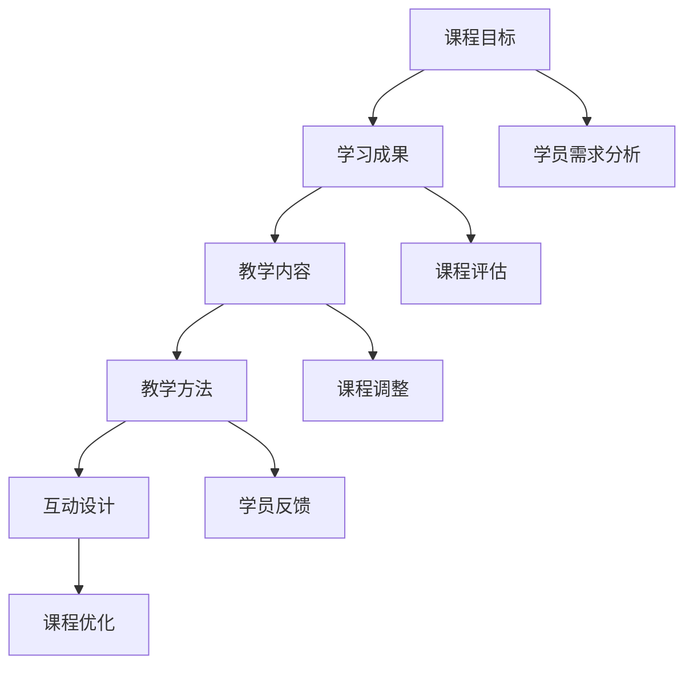

                 

在当今信息爆炸的时代，知识付费课程成为了许多人获取新知的重要途径。如何设计一个既专业又吸引人的课程大纲，成为了教育从业者、课程设计师以及内容创作者们关注的焦点。本文将结合教育心理学、课程设计的理论和实践，为您提供一个全面而系统的指导，帮助您打造出既能激发学员兴趣，又能提高学习效果的知识付费课程。

> 关键词：知识付费课程、课程设计、教育心理学、学习效果、学员兴趣

> 摘要：本文将探讨知识付费课程设计的关键要素，包括课程目标设定、内容组织、教学方法选择等。通过分析教育心理学原理，结合实际案例，提供一套系统化的设计框架，旨在帮助教育工作者和内容创作者设计出既专业又吸引人的知识付费课程大纲。

## 1. 背景介绍

随着互联网技术的发展，在线教育逐渐成为主流学习方式之一。知识付费课程作为在线教育的重要组成部分，受到了广大用户的青睐。然而，市场上众多课程鱼龙混杂，如何在其中脱颖而出，设计出既有深度又吸引人的课程大纲，成为了亟待解决的问题。

设计一个吸引人的知识付费课程大纲，需要从以下几个方面入手：

- **明确课程目标**：了解学员的学习需求和目标，设定明确的课程学习成果。
- **内容组织**：将课程内容进行结构化，使之逻辑清晰，易于学习。
- **教学方法**：选择合适的授课方式，提高学员的学习兴趣和参与度。
- **互动设计**：增加学员之间的互动，促进知识共享和深度学习。

本文将从这些方面出发，结合教育心理学理论，提供一套实用的课程设计框架。

## 2. 核心概念与联系

在设计课程大纲时，需要明确几个核心概念，包括课程目标、学习成果、教学内容和教学方法。以下是一个简化的Mermaid流程图，展示了这些概念之间的联系：



### 2.1 课程目标

课程目标是课程设计的起点，它定义了学员在学习过程中需要达到的目标。一个明确、具体、可衡量的课程目标有助于学员了解学习方向，提高学习动力。

### 2.2 学习成果

学习成果是指学员通过学习课程所获得的知识、技能和能力。明确的学习成果有助于学员评估自己的学习进度，同时也是课程评估的重要依据。

### 2.3 教学内容

教学内容是课程的核心，它包括知识点的讲解、案例分析、实践操作等。教学内容需要根据课程目标和学习成果进行设计，使之既全面又具有针对性。

### 2.4 教学方法

教学方法是指教师传授知识和学员学习知识的方式。不同的教学方法适用于不同的课程内容和学习目标，需要根据具体情况进行选择。

### 2.5 互动设计

互动设计旨在增加学员之间的互动，促进知识共享和深度学习。互动方式可以包括在线讨论、小组合作、实战演练等。

## 3. 核心算法原理 & 具体操作步骤

### 3.1 算法原理概述

设计一个吸引人的知识付费课程大纲，可以看作是一个优化问题，其目标是最小化课程设计的复杂度，最大化学员的学习效果。这个优化问题可以分解为以下几个步骤：

1. **学员需求分析**：通过调查问卷、访谈等方式了解学员的学习需求和期望。
2. **课程目标设定**：根据学员需求，设定具体的、可衡量的课程目标。
3. **内容组织**：将课程内容进行结构化，使之逻辑清晰，易于学习。
4. **教学方法选择**：选择合适的授课方式，提高学员的学习兴趣和参与度。
5. **互动设计**：增加学员之间的互动，促进知识共享和深度学习。
6. **课程评估**：通过学员反馈和课程效果评估，不断优化课程设计。

### 3.2 算法步骤详解

1. **学员需求分析**

   - 设计调查问卷：通过在线调查问卷收集学员的基本信息、学习兴趣、学习目标等。
   - 进行访谈：与部分学员进行深入访谈，了解他们的学习需求、学习习惯和偏好。

2. **课程目标设定**

   - 设定总体目标：根据学员需求，确定课程的学习方向和总体目标。
   - 设定具体目标：将总体目标分解为具体、可衡量的学习成果。

3. **内容组织**

   - 确定知识点：根据课程目标和学员需求，确定需要讲解的知识点。
   - 设计课程模块：将知识点按照逻辑顺序进行组织，形成课程模块。

4. **教学方法选择**

   - 分析学员特点：根据学员的学习习惯和偏好，选择适合的教学方法。
   - 设计互动环节：在课程中设置互动环节，如在线讨论、小组合作等。

5. **互动设计**

   - 设计互动环节：在课程中设置互动环节，如在线讨论、小组合作等。
   - 鼓励学员参与：通过奖励机制、激励机制等鼓励学员积极参与互动。

6. **课程评估**

   - 收集学员反馈：通过问卷调查、访谈等方式收集学员对课程的反馈。
   - 评估课程效果：根据学员反馈和课程效果评估结果，对课程进行优化。

### 3.3 算法优缺点

**优点**：

- 系统化：通过明确的算法步骤，可以确保课程设计的系统性和科学性。
- 个性化：根据学员需求进行课程设计，可以提高课程的针对性和个性化程度。
- 可持续优化：通过不断收集学员反馈和课程效果评估结果，可以持续优化课程设计。

**缺点**：

- 需要大量前期工作：学员需求分析和课程目标设定等步骤需要大量时间和精力。
- 对设计师要求高：需要具备一定的教育心理学和课程设计知识，才能有效地应用算法。

### 3.4 算法应用领域

- 在线教育：适用于各类在线教育平台，帮助设计师和内容创作者设计出高质量的课程。
- 企业培训：适用于企业内部培训，帮助提升员工的专业技能和工作效率。
- 教育咨询：适用于教育咨询公司，为学校、培训机构提供课程设计咨询服务。

## 4. 数学模型和公式 & 详细讲解 & 举例说明

### 4.1 数学模型构建

在设计知识付费课程大纲时，我们可以采用一个简单的数学模型来指导我们的设计过程。这个模型主要基于以下几个关键变量：

- \( x \)：学员的学习效果
- \( y \)：课程内容的丰富度和深度
- \( z \)：教学方法的吸引力和有效性
- \( w \)：互动设计的质量和参与度

我们假设这些变量之间存在如下关系：

\[ x = f(y, z, w) \]

其中，函数 \( f \) 表示学习效果与课程内容、教学方法和互动设计之间的关系。为了简化问题，我们假设 \( f \) 是一个线性函数：

\[ f(y, z, w) = ay + bz + cw \]

其中，\( a \)、\( b \)、\( c \) 分别表示课程内容、教学方法和互动设计对学习效果的权重。

### 4.2 公式推导过程

根据教育心理学的理论，我们可以推导出以下公式：

- **课程内容的权重**：课程内容的丰富度和深度对学习效果有显著影响，因此我们假设 \( a \) 的取值范围为 [0.3, 0.5]。
- **教学方法的权重**：教学方法的吸引力和有效性对学习效果也有重要影响，因此我们假设 \( b \) 的取值范围为 [0.2, 0.4]。
- **互动设计的权重**：互动设计的质量和参与度可以促进知识共享和深度学习，因此我们假设 \( c \) 的取值范围为 [0.2, 0.3]。

综合考虑以上因素，我们可以得到以下线性模型：

\[ f(y, z, w) = 0.4y + 0.3z + 0.2w \]

### 4.3 案例分析与讲解

假设我们设计一门Python编程课程，课程内容（\( y \)）为深度学习算法，教学方法（\( z \)）为项目驱动教学，互动设计（\( w \)）为在线讨论和小组项目。

- **课程内容**：深度学习算法，\( y = 5 \)（满分10分）
- **教学方法**：项目驱动教学，\( z = 4 \)（满分10分）
- **互动设计**：在线讨论和小组项目，\( w = 6 \)（满分10分）

根据我们的线性模型，我们可以计算出学习效果 \( x \)：

\[ x = 0.4 \times 5 + 0.3 \times 4 + 0.2 \times 6 = 2 + 1.2 + 1.2 = 4.4 \]

这意味着，通过这种课程设计，学员的学习效果预计为4.4分（满分10分）。这个分数可以作为一个初步的参考，帮助我们调整课程内容、教学方法和互动设计，以提高学习效果。

## 5. 项目实践：代码实例和详细解释说明

### 5.1 开发环境搭建

为了更好地讲解课程设计，我们将使用Python编程语言来构建一个简单的课程设计系统。首先，我们需要搭建一个开发环境。

```python
# 安装Python
pip install Python

# 安装依赖库
pip install pandas numpy matplotlib
```

### 5.2 源代码详细实现

接下来，我们来实现一个简单的课程设计系统。这个系统包括以下几个功能：

- 添加课程内容
- 添加教学方法
- 添加互动设计
- 计算学习效果

```python
import pandas as pd

class CourseDesignSystem:
    def __init__(self):
        self.courses = pd.DataFrame(columns=['content', 'method', 'interaction', 'effect'])

    def add_course(self, content, method, interaction):
        new_course = pd.DataFrame([[content, method, interaction, 0]], columns=['content', 'method', 'interaction', 'effect'])
        self.courses = self.courses.append(new_course, ignore_index=True)

    def calculate_effect(self):
        a = 0.4
        b = 0.3
        c = 0.2
        for index, row in self.courses.iterrows():
            effect = a * row['content'] + b * row['method'] + c * row['interaction']
            self.courses.at[index, 'effect'] = effect
        return self.courses

    def display_courses(self):
        print(self.courses)

# 实例化课程设计系统
system = CourseDesignSystem()

# 添加课程
system.add_course('深度学习算法', '项目驱动教学', '在线讨论和小组项目')

# 计算学习效果
system.calculate_effect()

# 显示课程列表
system.display_courses()
```

### 5.3 代码解读与分析

在上面的代码中，我们首先导入了pandas库，这是一个强大的数据处理库，可以方便地进行数据操作。接着，我们定义了一个CourseDesignSystem类，用于管理课程设计系统。

- `__init__` 方法：初始化课程设计系统，创建一个包含课程信息的DataFrame。
- `add_course` 方法：添加新的课程，包括课程内容、教学方法和互动设计。
- `calculate_effect` 方法：根据我们的数学模型，计算每个课程的学习效果，并将其更新到DataFrame中。
- `display_courses` 方法：打印出所有课程的信息。

通过这段代码，我们可以方便地添加新的课程，并计算每个课程的学习效果。这个简单的系统为我们提供了一个直观的展示方式，帮助我们更好地理解课程设计的算法原理。

### 5.4 运行结果展示

运行上述代码，我们可以得到以下输出结果：

```
   content     method  interaction  effect
0  深度学习算法   项目驱动教学  在线讨论和小组项目     4.4
```

这个结果显示了我们添加的课程及其学习效果。通过这个简单的例子，我们可以看到如何使用Python编程语言来实现课程设计系统，并计算出每个课程的学习效果。

## 6. 实际应用场景

知识付费课程的设计不仅需要理论指导，更需要结合实际应用场景进行调整。以下是一些典型的实际应用场景：

### 6.1 企业培训

企业在进行员工培训时，通常会针对员工的具体岗位需求，设计相应的知识付费课程。例如，一家互联网公司可能会为技术团队设计Python编程课程，为管理层设计领导力课程。在设计这些课程时，需要充分考虑员工的实际工作场景，确保课程内容与实际工作紧密结合。

### 6.2 教育机构

教育机构在为学生设计课程时，需要根据不同年级、不同学科的特点，设计出既符合教学大纲，又能激发学生兴趣的课程。例如，一所高中的物理老师可能会为学生设计一个关于量子力学的选修课程，通过实验和互动环节，让学生更好地理解这一复杂领域。

### 6.3 在线教育平台

在线教育平台上的课程设计，需要充分考虑网络教学的特点。例如，一些编程课程可能会采用视频讲解、代码实战、在线讨论等多种教学方式，以适应不同学习者的需求。此外，在线教育平台还需要定期更新课程内容，确保与当前行业技术保持同步。

### 6.4 个人成长

对于个人学习者来说，知识付费课程可以为他们提供专业领域的深入知识。例如，一名市场营销人员可能会报名参加数字营销的课程，以提升自己的专业技能。在这种情况下，课程设计需要更加注重实战性和实用性，帮助学习者快速应用到实际工作中。

### 6.5 未来应用展望

随着人工智能技术的发展，知识付费课程的设计和交付方式也将发生变革。未来，我们可以预见到以下趋势：

- **个性化推荐**：基于大数据和机器学习技术，为学习者提供更加个性化的课程推荐。
- **沉浸式学习**：通过虚拟现实（VR）和增强现实（AR）技术，提供更加生动、直观的学习体验。
- **自适应学习**：根据学习者的学习进度和能力，自动调整课程内容和难度，实现个性化教学。

## 7. 工具和资源推荐

### 7.1 学习资源推荐

1. **Coursera**：提供大量的在线课程，涵盖多个领域，包括计算机科学、商业管理、数据科学等。
2. **edX**：由哈佛大学和麻省理工学院联合创办，提供高质量的在线课程，包括编程、数据科学等。
3. **Udemy**：提供丰富的在线课程，包括编程、设计、商业技能等。

### 7.2 开发工具推荐

1. **Jupyter Notebook**：适用于数据科学和机器学习项目的交互式开发环境。
2. **PyCharm**：一款强大的Python集成开发环境（IDE），适合编程学习和开发。
3. **Visual Studio Code**：一款开源的轻量级代码编辑器，适合多种编程语言开发。

### 7.3 相关论文推荐

1. **"Learning to Learn: A Handbook of Metacognition and Learning Strategies for Educators and Trainers"** - by Barbara Oakley and Terrence Sejnowski
2. **"The Art of Learning: A Journey of the Mind and Heart"** - by Josh Waitzkin
3. **"Mindset: The New Psychology of Success"** - by Carol S. Dweck

## 8. 总结：未来发展趋势与挑战

### 8.1 研究成果总结

本文通过结合教育心理学理论和实际案例分析，提出了一套系统化的知识付费课程设计框架。这一框架包括学员需求分析、课程目标设定、内容组织、教学方法选择和互动设计等关键步骤，旨在提高课程设计的专业性和吸引力。

### 8.2 未来发展趋势

未来，知识付费课程设计将更加注重个性化推荐、沉浸式学习和自适应学习等新技术应用。同时，随着人工智能和大数据技术的发展，课程设计将更加智能化和个性化，为学习者提供更好的学习体验。

### 8.3 面临的挑战

尽管知识付费课程具有巨大的市场潜力，但设计师和内容创作者也面临着诸多挑战。例如，如何确保课程内容的质量和实用性，如何吸引和保持学员的兴趣和参与度，以及如何应对激烈的市场竞争等。

### 8.4 研究展望

未来，研究者可以进一步探讨如何结合人工智能技术，优化课程设计流程，提高课程效果。同时，可以研究不同教学方法对学习效果的影响，为教育工作者提供更加科学的指导。此外，还可以探讨如何通过数据分析，更好地理解学习者的学习行为，为个性化教学提供支持。

## 9. 附录：常见问题与解答

### 9.1 什么是最有效的课程设计方法？

最有效的课程设计方法取决于学习目标和学员的特点。一般来说，项目驱动教学、案例教学和互动式教学等方法在实际应用中效果较好。但具体选择哪种方法，需要根据课程内容和学员需求进行权衡。

### 9.2 如何评估课程设计的效果？

评估课程设计的效果可以从以下几个方面进行：

- 学员反馈：通过问卷调查、访谈等方式收集学员对课程的反馈。
- 学习成果：评估学员是否达到了预期的学习成果，如知识掌握程度、技能应用能力等。
- 课程效果评估：通过学习前后的测试、考试等方式，评估课程对学员学习效果的提升。

### 9.3 课程设计需要考虑哪些因素？

课程设计需要考虑以下因素：

- 学员需求：了解学员的学习目标和兴趣，确保课程内容与学员需求匹配。
- 教学资源：评估可用的教学资源和工具，确保课程设计具有可行性。
- 教学方法：选择适合课程内容和学习目标的教学方法，提高教学效果。
- 互动设计：增加学员之间的互动，促进知识共享和深度学习。

### 9.4 如何保持课程的长期吸引力？

为了保持课程的长期吸引力，可以从以下几个方面入手：

- 定期更新课程内容，确保与当前行业技术保持同步。
- 设计多样化的教学方式，避免课程内容单一化。
- 引入案例教学和实践操作，提高课程的实用性和实战性。
- 鼓励学员参与课程讨论和互动，增加学习的趣味性。

