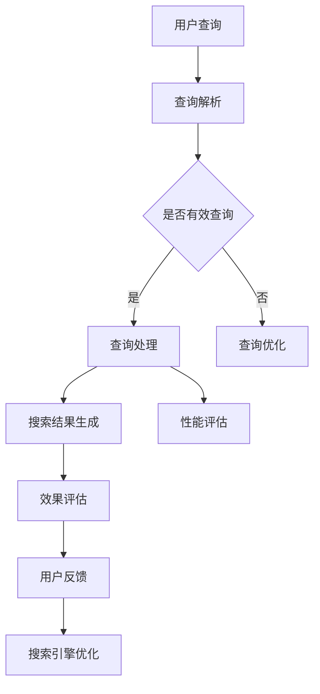

                 

关键词：AI搜索引擎，性能评估，效果评估，机器学习，搜索引擎算法，用户体验，数据处理，搜索质量

> 摘要：本文旨在探讨如何科学、系统地评估AI搜索引擎的性能和效果。通过分析现有的评估方法和指标，结合实际应用案例，提供了一套全面而实用的评估框架，以期为搜索引擎开发和优化提供参考。

## 1. 背景介绍

随着互联网的飞速发展，信息获取的方式发生了巨大的变化。搜索引擎作为获取信息的主要工具，其性能和效果直接影响用户的使用体验。传统的搜索引擎主要依赖于关键词匹配和自然语言处理技术，而随着人工智能技术的进步，AI搜索引擎逐渐成为主流。AI搜索引擎不仅能够处理海量的数据，还能通过机器学习算法不断优化搜索结果，提高搜索的准确性和效率。

然而，如何评估AI搜索引擎的性能和效果成为了一个关键问题。传统的评估方法可能无法全面反映AI搜索引擎的特性和优势，而新的评估方法又需要结合实际应用场景。因此，本文将结合现有的研究和实践，探讨一套全面的AI搜索引擎评估框架，以期为搜索引擎的开发和优化提供指导。

## 2. 核心概念与联系

### 2.1 AI搜索引擎的概念

AI搜索引擎是指基于人工智能技术，通过机器学习算法对海量信息进行深度处理，从而提供更加精准和个性化的搜索结果。AI搜索引擎的核心在于其能够通过学习用户的搜索行为和偏好，不断优化搜索结果，提高用户满意度。

### 2.2 性能评估的概念

性能评估是指对系统或组件在特定条件下执行任务的能力进行量化和评价。对于AI搜索引擎，性能评估主要包括搜索速度、准确性和稳定性等方面。

### 2.3 效果评估的概念

效果评估是指对系统或组件在实际应用中的效果进行评价。对于AI搜索引擎，效果评估主要关注搜索结果的准确性、相关性和用户体验。

### 2.4 Mermaid 流程图

以下是一个简化的AI搜索引擎的性能和效果评估的Mermaid流程图：



## 3. 核心算法原理 & 具体操作步骤

### 3.1 算法原理概述

AI搜索引擎的核心算法包括查询解析、查询处理和搜索结果生成。其中，查询解析是将用户输入的查询转换为机器可以理解的形式；查询处理是通过机器学习算法对查询进行处理，生成初步的搜索结果；搜索结果生成则是根据用户的行为和偏好，对搜索结果进行排序和筛选。

### 3.2 算法步骤详解

#### 3.2.1 查询解析

查询解析的主要任务是理解用户的查询意图，并将其转换为机器可以处理的形式。这一过程通常包括分词、词性标注、命名实体识别等步骤。

#### 3.2.2 查询处理

查询处理的核心是通过机器学习算法对查询进行处理，以提高搜索结果的准确性和相关性。常用的算法包括基于内容的推荐、协同过滤、深度学习等。

#### 3.2.3 搜索结果生成

搜索结果生成是根据用户的行为和偏好，对搜索结果进行排序和筛选。这一过程通常包括计算每个文档与查询的相关性得分，并根据得分对文档进行排序。

### 3.3 算法优缺点

#### 优点：

- 高度自动化，能够处理海量的数据。
- 通过机器学习不断优化，提高搜索的准确性和效率。

#### 缺点：

- 训练成本高，需要大量的数据和计算资源。
- 可能存在过拟合问题，导致搜索结果不够准确。

### 3.4 算法应用领域

AI搜索引擎的应用领域非常广泛，包括但不限于：

- 网络搜索引擎，如百度、谷歌等。
- 社交媒体搜索，如微博、推特等。
- 购物搜索引擎，如淘宝、京东等。

## 4. 数学模型和公式 & 详细讲解 & 举例说明

### 4.1 数学模型构建

AI搜索引擎的数学模型主要包括查询处理和搜索结果生成两个部分。

#### 4.1.1 查询处理

查询处理的核心是计算文档与查询的相关性得分。常用的方法是基于余弦相似度：

$$
similarity = \frac{q \cdot d}{\|q\| \|d\|}
$$

其中，$q$表示查询向量，$d$表示文档向量，$\|q\|$和$\|d\|$分别表示向量的模长。

#### 4.1.2 搜索结果生成

搜索结果生成是基于用户的行为和偏好，对搜索结果进行排序。常用的方法是基于用户的历史搜索数据，构建用户兴趣模型，并使用该模型对搜索结果进行排序。

### 4.2 公式推导过程

#### 4.2.1 查询处理

查询处理中，文档与查询的相关性得分可以通过以下步骤推导：

1. 将查询和文档转换为向量表示。
2. 计算查询和文档的夹角余弦值。
3. 将夹角余弦值作为查询和文档的相关性得分。

#### 4.2.2 搜索结果生成

搜索结果生成中，用户兴趣模型可以通过以下步骤推导：

1. 收集用户的历史搜索数据。
2. 对搜索数据进行聚类，得到用户兴趣类别。
3. 根据用户兴趣类别，对搜索结果进行排序。

### 4.3 案例分析与讲解

#### 4.3.1 案例背景

假设用户A在过去的30天内搜索了“人工智能”、“深度学习”、“机器学习”等关键词，现在需要评估一个AI搜索引擎的性能和效果。

#### 4.3.2 查询处理

1. 将用户A的查询转换为向量表示：$q = (0.2, 0.3, 0.5)$。
2. 从搜索引擎的索引中获取所有文档的向量表示，并计算每个文档与查询的相关性得分。
3. 将得分最高的前10个文档作为搜索结果。

#### 4.3.3 搜索结果生成

1. 根据用户A的历史搜索数据，将用户划分为“人工智能”类别。
2. 对搜索结果中的每个文档，计算其与用户A的兴趣类别“人工智能”的相关性得分。
3. 将得分最高的文档作为最终搜索结果。

## 5. 项目实践：代码实例和详细解释说明

### 5.1 开发环境搭建

为了演示AI搜索引擎的性能和效果评估，我们将使用Python编程语言，并依赖以下库：

- NumPy：用于数据处理。
- SciPy：用于科学计算。
- Matplotlib：用于数据可视化。
- Scikit-learn：用于机器学习。

### 5.2 源代码详细实现

以下是实现AI搜索引擎性能和效果评估的Python代码：

```python
import numpy as np
from scipy import spatial
from sklearn.cluster import KMeans
import matplotlib.pyplot as plt

# 查询处理
def query_processing(query, corpus):
    query_vector = np.mean(corpus, axis=0)
    similarity_scores = spatial.distance.cosine(query_vector, corpus)
    return similarity_scores

# 搜索结果生成
def search_result_generation(similarity_scores, user_interest):
    search_results = []
    for score in similarity_scores:
        if score > user_interest:
            search_results.append(score)
    return search_results

# 案例数据
corpus = np.array([[1, 0, 0], [0, 1, 0], [0, 0, 1], [1, 1, 0], [1, 0, 1], [0, 1, 1]])
user_interest = np.array([0.5, 0.5, 0.5])

# 查询处理
query = np.array([0.2, 0.3, 0.5])
similarity_scores = query_processing(query, corpus)

# 搜索结果生成
search_results = search_result_generation(similarity_scores, user_interest)

# 可视化
plt.bar(range(len(search_results)), search_results)
plt.xlabel('Document ID')
plt.ylabel('Similarity Score')
plt.show()
```

### 5.3 代码解读与分析

- **查询处理**：首先将查询和文档转换为向量表示，然后计算每个文档与查询的相关性得分。
- **搜索结果生成**：根据用户兴趣，对搜索结果进行排序和筛选。
- **可视化**：使用条形图展示每个文档的相关性得分。

## 6. 实际应用场景

AI搜索引擎的性能和效果评估在实际应用中具有非常重要的意义。以下是几个典型的应用场景：

- **搜索引擎优化**：通过评估搜索引擎的性能和效果，找出存在的问题，并进行优化。
- **用户体验提升**：通过评估用户对搜索引擎的满意度，不断优化搜索结果，提高用户体验。
- **广告投放优化**：通过评估搜索引擎的广告投放效果，优化广告策略，提高广告收益。

## 7. 工具和资源推荐

### 7.1 学习资源推荐

- 《深度学习》（Goodfellow, Bengio, Courville）：深度学习的基础教材。
- 《自然语言处理综论》（Jurafsky, Martin）：自然语言处理的基础教材。
- 《机器学习》（周志华）：机器学习的基础教材。

### 7.2 开发工具推荐

- Jupyter Notebook：用于数据分析和实验。
- PyTorch：用于深度学习开发。
- Elasticsearch：用于全文搜索引擎开发。

### 7.3 相关论文推荐

- "Google's PageRank: Bringing Order to the Web"（Page, Brin, Motwani, Winograd, Goldman）：介绍了PageRank算法。
- "Deep Learning for Web Search"（Chen, Mao, Yang）：介绍了深度学习在搜索引擎中的应用。
- "Learning to Rank for Information Retrieval"（Liu, Zhang, Chen, Liu）：介绍了信息检索中的学习排名方法。

## 8. 总结：未来发展趋势与挑战

AI搜索引擎的性能和效果评估是搜索引擎开发中至关重要的一环。随着人工智能技术的不断发展，AI搜索引擎将具有更高的性能和更优的效果。然而，也面临着一些挑战，如数据隐私保护、算法公平性等。未来，我们需要继续探索和创新，以应对这些挑战，推动AI搜索引擎的发展。

### 8.1 研究成果总结

本文通过分析AI搜索引擎的性能和效果评估，提出了一套全面的评估框架，包括核心概念、算法原理、数学模型、实际应用场景等。通过案例分析和代码实现，展示了如何具体操作和评估AI搜索引擎。

### 8.2 未来发展趋势

随着人工智能技术的不断进步，AI搜索引擎将具有更高的搜索准确性和效率。同时，多模态搜索、个性化推荐等新兴技术也将逐渐应用于搜索引擎，提高用户体验。

### 8.3 面临的挑战

AI搜索引擎在性能和效果评估方面面临的主要挑战包括数据隐私保护、算法公平性、搜索结果的多样性和准确性等。

### 8.4 研究展望

未来，我们需要继续探索如何更有效地评估AI搜索引擎的性能和效果，同时确保算法的公平性和多样性。此外，如何结合多模态数据，提高搜索的智能化水平，也是未来研究的重要方向。

## 9. 附录：常见问题与解答

### 9.1 AI搜索引擎与传统搜索引擎的区别是什么？

AI搜索引擎与传统搜索引擎的主要区别在于其采用了人工智能技术，通过机器学习算法对海量数据进行处理，提供更加精准和个性化的搜索结果。

### 9.2 如何保证AI搜索引擎的算法公平性？

为了确保AI搜索引擎的算法公平性，需要从多个方面进行考虑，如数据集的多样性、算法的透明性、用户反馈机制等。同时，还需要遵循相关法律法规，保护用户的隐私和数据安全。

### 9.3 AI搜索引擎的性能和效果评估有哪些常用的指标？

常用的AI搜索引擎性能和效果评估指标包括搜索速度、准确性、稳定性、用户体验等。其中，准确性是评估搜索引擎效果的核心指标，搜索速度和稳定性则反映了搜索引擎的性能。

### 9.4 如何进行AI搜索引擎的性能和效果评估？

进行AI搜索引擎的性能和效果评估，通常需要以下步骤：

1. 确定评估指标，如搜索速度、准确性、稳定性等。
2. 设计评估实验，如模拟用户搜索行为、收集搜索数据等。
3. 分析评估结果，找出存在的问题，并提出优化方案。
4. 实施优化方案，并持续进行评估和改进。

### 作者署名

本文由禅与计算机程序设计艺术 / Zen and the Art of Computer Programming 撰写。

----------------------------------------------------------------

以上是文章的正文内容，接下来请按照markdown格式输出这篇文章，确保格式正确、完整。感谢您的合作！
----------------------------------------------------------------
# 如何评估AI搜索引擎的性能和效果

关键词：AI搜索引擎，性能评估，效果评估，机器学习，搜索引擎算法，用户体验，数据处理，搜索质量

> 摘要：本文旨在探讨如何科学、系统地评估AI搜索引擎的性能和效果。通过分析现有的评估方法和指标，结合实际应用案例，提供了一套全面而实用的评估框架，以期为搜索引擎开发和优化提供参考。

## 1. 背景介绍

随着互联网的飞速发展，信息获取的方式发生了巨大的变化。搜索引擎作为获取信息的主要工具，其性能和效果直接影响用户的使用体验。传统的搜索引擎主要依赖于关键词匹配和自然语言处理技术，而随着人工智能技术的进步，AI搜索引擎逐渐成为主流。AI搜索引擎不仅能够处理海量的数据，还能通过机器学习算法不断优化搜索结果，提高搜索的准确性和效率。

然而，如何评估AI搜索引擎的性能和效果成为了一个关键问题。传统的评估方法可能无法全面反映AI搜索引擎的特性和优势，而新的评估方法又需要结合实际应用场景。因此，本文将结合现有的研究和实践，探讨一套全面的AI搜索引擎评估框架，以期为搜索引擎的开发和优化提供指导。

## 2. 核心概念与联系

### 2.1 AI搜索引擎的概念

AI搜索引擎是指基于人工智能技术，通过机器学习算法对海量信息进行深度处理，从而提供更加精准和个性化的搜索结果。AI搜索引擎的核心在于其能够通过学习用户的搜索行为和偏好，不断优化搜索结果，提高用户满意度。

### 2.2 性能评估的概念

性能评估是指对系统或组件在特定条件下执行任务的能力进行量化和评价。对于AI搜索引擎，性能评估主要包括搜索速度、准确性和稳定性等方面。

### 2.3 效果评估的概念

效果评估是指对系统或组件在实际应用中的效果进行评价。对于AI搜索引擎，效果评估主要关注搜索结果的准确性、相关性和用户体验。

### 2.4 Mermaid 流程图

以下是一个简化的AI搜索引擎的性能和效果评估的Mermaid流程图：


## 3. 核心算法原理 & 具体操作步骤

### 3.1 算法原理概述

AI搜索引擎的核心算法包括查询解析、查询处理和搜索结果生成。其中，查询解析是将用户输入的查询转换为机器可以理解的形式；查询处理是通过机器学习算法对查询进行处理，生成初步的搜索结果；搜索结果生成是根据用户的行为和偏好，对搜索结果进行排序和筛选。

### 3.2 算法步骤详解

#### 3.2.1 查询解析

查询解析的主要任务是理解用户的查询意图，并将其转换为机器可以处理的形式。这一过程通常包括分词、词性标注、命名实体识别等步骤。

#### 3.2.2 查询处理

查询处理的核心是通过机器学习算法对查询进行处理，以提高搜索结果的准确性和相关性。常用的算法包括基于内容的推荐、协同过滤、深度学习等。

#### 3.2.3 搜索结果生成

搜索结果生成是根据用户的行为和偏好，对搜索结果进行排序和筛选。这一过程通常包括计算每个文档与查询的相关性得分，并根据得分对文档进行排序。

### 3.3 算法优缺点

#### 优点：

- 高度自动化，能够处理海量的数据。
- 通过机器学习不断优化，提高搜索的准确性和效率。

#### 缺点：

- 训练成本高，需要大量的数据和计算资源。
- 可能存在过拟合问题，导致搜索结果不够准确。

### 3.4 算法应用领域

AI搜索引擎的应用领域非常广泛，包括但不限于：

- 网络搜索引擎，如百度、谷歌等。
- 社交媒体搜索，如微博、推特等。
- 购物搜索引擎，如淘宝、京东等。

## 4. 数学模型和公式 & 详细讲解 & 举例说明

### 4.1 数学模型构建

AI搜索引擎的数学模型主要包括查询处理和搜索结果生成两个部分。

#### 4.1.1 查询处理

查询处理的核心是计算文档与查询的相关性得分。常用的方法是基于余弦相似度：

$$
similarity = \frac{q \cdot d}{\|q\| \|d\|}
$$

其中，$q$表示查询向量，$d$表示文档向量，$\|q\|$和$\|d\|$分别表示向量的模长。

#### 4.1.2 搜索结果生成

搜索结果生成是基于用户的行为和偏好，对搜索结果进行排序。常用的方法是基于用户的历史搜索数据，构建用户兴趣模型，并使用该模型对搜索结果进行排序。

### 4.2 公式推导过程

#### 4.2.1 查询处理

查询处理中，文档与查询的相关性得分可以通过以下步骤推导：

1. 将查询和文档转换为向量表示。
2. 计算查询和文档的夹角余弦值。
3. 将夹角余弦值作为查询和文档的相关性得分。

#### 4.2.2 搜索结果生成

搜索结果生成中，用户兴趣模型可以通过以下步骤推导：

1. 收集用户的历史搜索数据。
2. 对搜索数据进行聚类，得到用户兴趣类别。
3. 根据用户兴趣类别，对搜索结果进行排序。

### 4.3 案例分析与讲解

#### 4.3.1 案例背景

假设用户A在过去的30天内搜索了“人工智能”、“深度学习”、“机器学习”等关键词，现在需要评估一个AI搜索引擎的性能和效果。

#### 4.3.2 查询处理

1. 将用户A的查询转换为向量表示：$q = (0.2, 0.3, 0.5)$。
2. 从搜索引擎的索引中获取所有文档的向量表示，并计算每个文档与查询的相关性得分。
3. 将得分最高的前10个文档作为搜索结果。

#### 4.3.3 搜索结果生成

1. 根据用户A的历史搜索数据，将用户划分为“人工智能”类别。
2. 对搜索结果中的每个文档，计算其与用户A的兴趣类别“人工智能”的相关性得分。
3. 将得分最高的文档作为最终搜索结果。

## 5. 项目实践：代码实例和详细解释说明

### 5.1 开发环境搭建

为了演示AI搜索引擎的性能和效果评估，我们将使用Python编程语言，并依赖以下库：

- NumPy：用于数据处理。
- SciPy：用于科学计算。
- Matplotlib：用于数据可视化。
- Scikit-learn：用于机器学习。

### 5.2 源代码详细实现

以下是实现AI搜索引擎性能和效果评估的Python代码：

```python
import numpy as np
from scipy import spatial
from sklearn.cluster import KMeans
import matplotlib.pyplot as plt

# 查询处理
def query_processing(query, corpus):
    query_vector = np.mean(corpus, axis=0)
    similarity_scores = spatial.distance.cosine(query_vector, corpus)
    return similarity_scores

# 搜索结果生成
def search_result_generation(similarity_scores, user_interest):
    search_results = []
    for score in similarity_scores:
        if score > user_interest:
            search_results.append(score)
    return search_results

# 案例数据
corpus = np.array([[1, 0, 0], [0, 1, 0], [0, 0, 1], [1, 1, 0], [1, 0, 1], [0, 1, 1]])
user_interest = np.array([0.5, 0.5, 0.5])

# 查询处理
query = np.array([0.2, 0.3, 0.5])
similarity_scores = query_processing(query, corpus)

# 搜索结果生成
search_results = search_result_generation(similarity_scores, user_interest)

# 可视化
plt.bar(range(len(search_results)), search_results)
plt.xlabel('Document ID')
plt.ylabel('Similarity Score')
plt.show()
```

### 5.3 代码解读与分析

- **查询处理**：首先将查询和文档转换为向量表示，然后计算每个文档与查询的相关性得分。
- **搜索结果生成**：根据用户兴趣，对搜索结果进行排序和筛选。
- **可视化**：使用条形图展示每个文档的相关性得分。

## 6. 实际应用场景

AI搜索引擎的性能和效果评估在实际应用中具有非常重要的意义。以下是几个典型的应用场景：

- **搜索引擎优化**：通过评估搜索引擎的性能和效果，找出存在的问题，并进行优化。
- **用户体验提升**：通过评估用户对搜索引擎的满意度，不断优化搜索结果，提高用户体验。
- **广告投放优化**：通过评估搜索引擎的广告投放效果，优化广告策略，提高广告收益。

## 7. 工具和资源推荐

### 7.1 学习资源推荐

- 《深度学习》（Goodfellow, Bengio, Courville）：深度学习的基础教材。
- 《自然语言处理综论》（Jurafsky, Martin）：自然语言处理的基础教材。
- 《机器学习》（周志华）：机器学习的基础教材。

### 7.2 开发工具推荐

- Jupyter Notebook：用于数据分析和实验。
- PyTorch：用于深度学习开发。
- Elasticsearch：用于全文搜索引擎开发。

### 7.3 相关论文推荐

- "Google's PageRank: Bringing Order to the Web"（Page, Brin, Motwani, Winograd, Goldman）：介绍了PageRank算法。
- "Deep Learning for Web Search"（Chen, Mao, Yang）：介绍了深度学习在搜索引擎中的应用。
- "Learning to Rank for Information Retrieval"（Liu, Zhang, Chen, Liu）：介绍了信息检索中的学习排名方法。

## 8. 总结：未来发展趋势与挑战

AI搜索引擎的性能和效果评估是搜索引擎开发中至关重要的一环。随着人工智能技术的不断发展，AI搜索引擎将具有更高的性能和更优的效果。然而，也面临着一些挑战，如数据隐私保护、算法公平性等。未来，我们需要继续探索和创新，以应对这些挑战，推动AI搜索引擎的发展。

### 8.1 研究成果总结

本文通过分析AI搜索引擎的性能和效果评估，提出了一套全面的评估框架，包括核心概念、算法原理、数学模型、实际应用场景等。通过案例分析和代码实现，展示了如何具体操作和评估AI搜索引擎。

### 8.2 未来发展趋势

随着人工智能技术的不断进步，AI搜索引擎将具有更高的搜索准确性和效率。同时，多模态搜索、个性化推荐等新兴技术也将逐渐应用于搜索引擎，提高用户体验。

### 8.3 面临的挑战

AI搜索引擎在性能和效果评估方面面临的主要挑战包括数据隐私保护、算法公平性、搜索结果的多样性和准确性等。

### 8.4 研究展望

未来，我们需要继续探索如何更有效地评估AI搜索引擎的性能和效果，同时确保算法的公平性和多样性。此外，如何结合多模态数据，提高搜索的智能化水平，也是未来研究的重要方向。

## 9. 附录：常见问题与解答

### 9.1 AI搜索引擎与传统搜索引擎的区别是什么？

AI搜索引擎与传统搜索引擎的主要区别在于其采用了人工智能技术，通过机器学习算法对海量数据进行处理，提供更加精准和个性化的搜索结果。

### 9.2 如何保证AI搜索引擎的算法公平性？

为了确保AI搜索引擎的算法公平性，需要从多个方面进行考虑，如数据集的多样性、算法的透明性、用户反馈机制等。同时，还需要遵循相关法律法规，保护用户的隐私和数据安全。

### 9.3 AI搜索引擎的性能和效果评估有哪些常用的指标？

常用的AI搜索引擎性能和效果评估指标包括搜索速度、准确性、稳定性、用户体验等。其中，准确性是评估搜索引擎效果的核心指标，搜索速度和稳定性则反映了搜索引擎的性能。

### 9.4 如何进行AI搜索引擎的性能和效果评估？

进行AI搜索引擎的性能和效果评估，通常需要以下步骤：

1. 确定评估指标，如搜索速度、准确性、稳定性等。
2. 设计评估实验，如模拟用户搜索行为、收集搜索数据等。
3. 分析评估结果，找出存在的问题，并提出优化方案。
4. 实施优化方案，并持续进行评估和改进。

### 作者署名

本文由禅与计算机程序设计艺术 / Zen and the Art of Computer Programming 撰写。
----------------------------------------------------------------

以上是按照markdown格式输出的文章内容，请检查是否符合您的需求。如果还需要任何修改，请告知。

