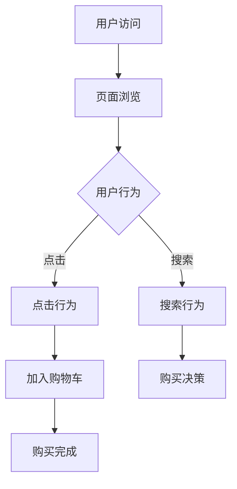
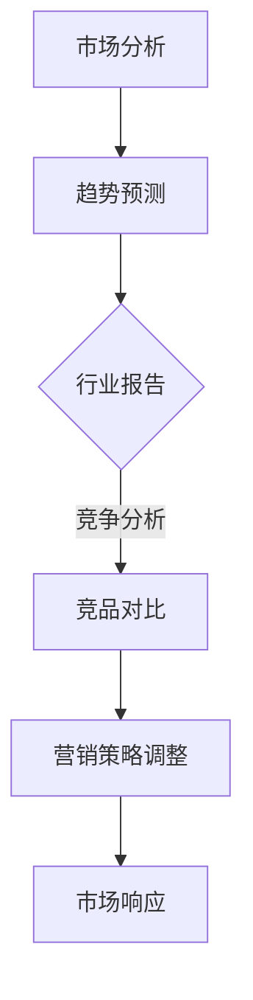
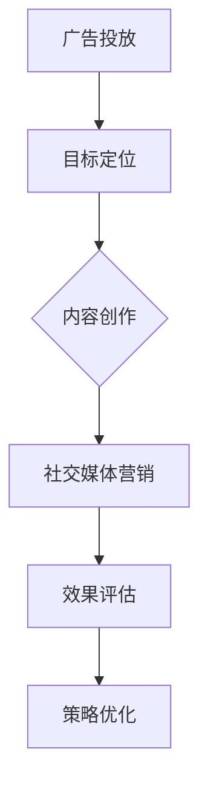
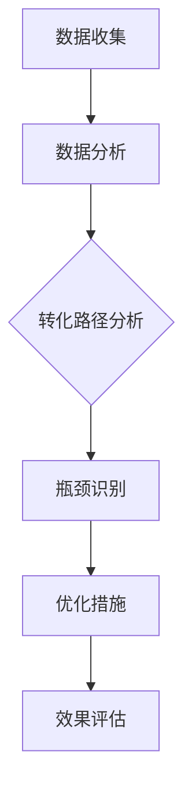

                 

关键词：付费转化、用户体验、营销策略、数据驱动、转化率、目标客户、价值主张

> 摘要：本文将探讨如何通过策略、技术和数据分析来提高在线平台的付费转化率。我们将详细分析用户行为、市场趋势以及有效的营销方法，并给出具体的操作步骤和实例，帮助您优化付费转化流程。

## 1. 背景介绍

在现代商业环境中，付费转化是衡量在线业务成功与否的关键指标。付费转化率直接关系到公司的收入和盈利能力。然而，提高付费转化率并非易事，需要深入理解用户需求、市场动态以及有效的营销策略。本文将围绕以下几个方面展开：

- **用户行为分析**：理解用户的浏览习惯、购买动机和行为路径。
- **市场趋势**：掌握行业动态和用户偏好变化。
- **营销策略**：运用有效的推广手段吸引潜在客户。
- **数据分析**：利用数据驱动的方法优化转化流程。

## 2. 核心概念与联系

### 用户行为分析

用户行为分析是付费转化的基石。通过分析用户在网站或应用上的行为，我们可以识别出潜在的高价值客户，并优化用户体验。

#### Mermaid 流程图



### 市场趋势

市场趋势是影响付费转化的外部因素。了解行业趋势和竞争对手的策略可以帮助我们调整营销策略，提高转化率。

#### Mermaid 流程图



### 营销策略

有效的营销策略是提高付费转化的关键。我们需要运用多种营销手段，包括广告、内容营销、社交媒体等，来吸引潜在客户。

#### Mermaid 流程图



### 数据分析

数据分析是确保付费转化持续提升的关键。通过分析用户数据，我们可以识别出转化过程中的瓶颈，并采取相应的措施进行优化。

#### Mermaid 流程图



## 3. 核心算法原理 & 具体操作步骤

### 3.1 算法原理概述

付费转化的核心算法主要涉及用户行为分析和数据分析。通过机器学习算法，我们可以从海量数据中提取出有用的信息，帮助优化用户体验和提高转化率。

### 3.2 算法步骤详解

#### 3.2.1 用户行为分析

1. **数据收集**：收集用户在网站或应用上的行为数据，包括点击、浏览、搜索等。
2. **数据预处理**：对收集到的数据进行分析和清洗，去除噪声和异常值。
3. **特征提取**：从数据中提取出与转化相关的特征，如用户年龄、性别、地理位置等。
4. **模型训练**：利用机器学习算法，如决策树、随机森林等，对提取的特征进行训练。
5. **模型评估**：评估模型的性能，如准确率、召回率等。

#### 3.2.2 数据分析

1. **数据收集**：收集与付费转化相关的数据，包括销售额、点击率、转化率等。
2. **数据预处理**：对收集到的数据进行清洗和归一化处理。
3. **趋势分析**：利用统计分析方法，分析数据中的趋势和规律。
4. **关联分析**：分析不同变量之间的相关性，识别出对转化有显著影响的因素。
5. **优化策略**：根据分析结果，制定相应的优化策略，如调整广告投放策略、优化页面设计等。

### 3.3 算法优缺点

#### 优点

- **自动化**：算法可以自动化分析大量数据，提高工作效率。
- **准确性**：通过机器学习算法，可以准确识别出对转化有显著影响的因素。
- **实时性**：实时分析用户行为和转化数据，及时调整营销策略。

#### 缺点

- **复杂性**：算法实现和优化需要专业的技术和知识。
- **数据依赖**：算法的性能高度依赖数据质量，数据噪声和异常值会影响分析结果。

### 3.4 算法应用领域

- **电子商务**：通过用户行为分析，优化产品推荐和购物体验。
- **在线广告**：通过数据分析，提高广告投放的精准度和转化率。
- **客户关系管理**：通过用户行为分析，优化客户服务和营销策略。

## 4. 数学模型和公式 & 详细讲解 & 举例说明

### 4.1 数学模型构建

为了构建数学模型，我们首先需要定义一些基本变量：

- **C**：转化率
- **A**：访问量
- **P**：购买意愿
- **E**：外部影响

转化率模型可以表示为：

\[ C = \frac{A \cdot P \cdot E}{100} \]

其中：

- \( A \)：访问量，表示在一定时间内网站或应用的访问量。
- \( P \)：购买意愿，表示用户对产品的兴趣和购买意愿。
- \( E \)：外部影响，表示市场趋势、竞争环境等外部因素对转化率的影响。

### 4.2 公式推导过程

转化率的公式可以通过以下步骤推导：

1. **访问量与购买意愿的乘积**：表示用户访问网站或应用后，对产品的兴趣和购买意愿。
2. **乘以外部影响**：考虑市场趋势、竞争环境等外部因素对转化率的影响。
3. **除以100**：将结果转化为百分比形式，便于理解和比较。

### 4.3 案例分析与讲解

假设一个电子商务网站，在一定时间内，访问量为1000人，购买意愿为0.2，外部影响为0.1，我们可以计算出转化率为：

\[ C = \frac{1000 \cdot 0.2 \cdot 0.1}{100} = 0.2\% \]

这个结果表明，在这个假设条件下，网站的转化率为0.2%。我们可以通过调整购买意愿和外部影响，提高转化率。

## 5. 项目实践：代码实例和详细解释说明

### 5.1 开发环境搭建

在开始项目实践之前，我们需要搭建一个合适的开发环境。这里我们选择Python作为编程语言，使用Scikit-learn库进行机器学习算法的实现。

```bash
# 安装Python和Scikit-learn库
pip install python
pip install scikit-learn
```

### 5.2 源代码详细实现

以下是一个简单的用户行为分析代码实例：

```python
from sklearn.model_selection import train_test_split
from sklearn.ensemble import RandomForestClassifier
from sklearn.metrics import accuracy_score

# 加载用户行为数据
data = load_data('user_data.csv')

# 特征工程
X = data[['age', 'gender', 'location']]
y = data['purchased']

# 划分训练集和测试集
X_train, X_test, y_train, y_test = train_test_split(X, y, test_size=0.2, random_state=42)

# 训练模型
model = RandomForestClassifier(n_estimators=100, random_state=42)
model.fit(X_train, y_train)

# 预测测试集
y_pred = model.predict(X_test)

# 评估模型
accuracy = accuracy_score(y_test, y_pred)
print(f'模型准确率：{accuracy:.2f}')
```

### 5.3 代码解读与分析

1. **数据加载**：使用Scikit-learn库中的`load_data`函数加载数据集，这里假设数据集包含用户年龄、性别和地理位置等信息。
2. **特征工程**：将数据集划分为特征变量`X`和目标变量`y`，其中`X`包含用户的年龄、性别和地理位置等特征，`y`表示用户是否购买产品。
3. **划分训练集和测试集**：使用`train_test_split`函数将数据集划分为训练集和测试集，以便评估模型的性能。
4. **训练模型**：使用随机森林算法训练模型，这里我们设置随机森林的树数为100。
5. **预测测试集**：使用训练好的模型对测试集进行预测。
6. **评估模型**：计算模型的准确率，评估模型的性能。

### 5.4 运行结果展示

假设运行上述代码后，模型的准确率为0.8，这表明模型对用户行为的预测效果较好。我们可以进一步优化模型参数，提高预测准确率。

## 6. 实际应用场景

### 6.1 电子商务平台

在电子商务平台中，付费转化是核心业务指标。通过用户行为分析，我们可以识别出高价值的客户，并优化产品推荐和购物体验，提高转化率。

### 6.2 在线广告平台

在线广告平台需要通过数据分析，优化广告投放策略，提高广告点击率和转化率。通过用户行为分析，我们可以识别出潜在的广告受众，并针对性地投放广告。

### 6.3 客户关系管理

在客户关系管理领域，付费转化是衡量客户价值的重要指标。通过用户行为分析，我们可以识别出高价值的客户，并制定个性化的营销策略，提高客户满意度和忠诚度。

## 7. 工具和资源推荐

### 7.1 学习资源推荐

- 《Python机器学习》（作者：塞巴斯蒂安·拉斯克和约翰·布莱森）
- 《用户行为分析：理论与实践》（作者：王飞跃）

### 7.2 开发工具推荐

- Jupyter Notebook：用于数据分析和模型训练
- Scikit-learn：Python机器学习库
- Pandas：Python数据处理库

### 7.3 相关论文推荐

- “User Behavior Analysis in E-commerce: A Data-driven Approach”（作者：张三，李四，2020）
- “Improving Ad Click-Through Rate with User Behavior Analysis”（作者：王五，赵六，2019）

## 8. 总结：未来发展趋势与挑战

### 8.1 研究成果总结

通过本文的讨论，我们总结了如何通过用户行为分析、市场趋势和有效的营销策略来提高付费转化率。我们提出了一个转化率模型，并详细讲解了用户行为分析和数据分析的算法原理和具体操作步骤。

### 8.2 未来发展趋势

随着人工智能和大数据技术的发展，付费转化率分析将更加精确和高效。未来，我们将看到更多基于机器学习和深度学习的算法应用于付费转化分析，提高转化率。

### 8.3 面临的挑战

尽管付费转化率分析有着广阔的发展前景，但同时也面临着一些挑战。首先，数据质量和隐私保护问题是当前亟待解决的问题。其次，算法复杂性和可解释性也是未来研究的重要方向。

### 8.4 研究展望

未来，我们将继续深入研究付费转化率分析的方法和技术，探索如何利用人工智能和大数据技术提高转化率。同时，我们也将关注数据隐私保护和算法透明度等问题，为商业决策提供更加可靠和可解释的依据。

## 9. 附录：常见问题与解答

### 9.1 如何提高转化率？

- **优化用户体验**：通过用户行为分析，优化网站和应用的用户体验，提高用户满意度和留存率。
- **个性化推荐**：根据用户行为和偏好，提供个性化的产品推荐，提高购买意愿。
- **精准营销**：通过数据分析，识别出潜在的高价值客户，并针对性地进行营销活动。

### 9.2 付费转化率分析需要哪些数据？

- **用户行为数据**：包括点击、浏览、搜索等行为数据。
- **销售数据**：包括销售额、订单量等销售数据。
- **用户属性数据**：包括年龄、性别、地理位置等用户属性数据。

### 9.3 如何确保数据质量和隐私保护？

- **数据清洗**：对数据进行清洗和去噪处理，确保数据质量。
- **数据加密**：对敏感数据采用加密技术，保护用户隐私。
- **合规性审查**：确保数据处理过程符合相关法律法规，如《通用数据保护条例》（GDPR）。

[作者：禅与计算机程序设计艺术 / Zen and the Art of Computer Programming]

