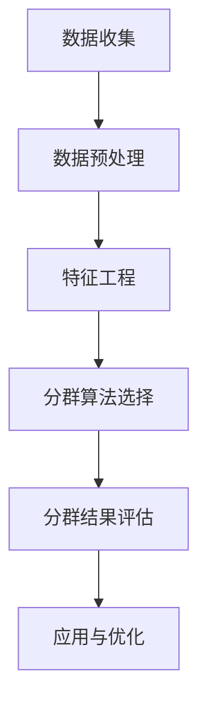

                 

用户分群管理是数据分析和市场营销中至关重要的环节。通过将用户根据其特征和行为分成不同的群体，企业可以更精准地理解和满足用户需求，从而提高客户满意度、提升业务效率和实现更高的收益。本文将深入探讨用户分群管理的核心概念、算法原理、数学模型、项目实践、应用场景及未来展望，旨在为读者提供一套全面、实用的用户分群管理指南。

## 文章关键词

- 用户分群管理
- 数据分析
- 市场营销
- 客户满意度
- 业务效率

## 文摘

本文系统地介绍了用户分群管理的全过程，包括核心概念解析、算法原理阐述、数学模型讲解、项目实践分析以及未来展望。通过本文的阅读，读者可以了解到用户分群管理的基本原理，掌握常用的分群算法，并能够将其应用于实际业务场景中，从而实现更精准的市场营销和用户服务。

## 1. 背景介绍

用户分群管理起源于20世纪初的数据分析和市场营销领域，当时企业开始意识到通过细分市场来提高销售业绩的重要性。随着计算机技术的快速发展，大数据和人工智能技术的应用，用户分群管理逐渐成为数据分析中的重要分支。现代用户分群管理不仅依赖于传统的统计方法，还引入了机器学习和深度学习算法，以实现更高效、更智能的用户群体划分。

用户分群管理的重要性主要体现在以下几个方面：

1. **提高营销效果**：通过精准的用户分群，企业可以定制化营销策略，提高营销活动的转化率和ROI。
2. **优化用户体验**：了解用户群体的特点和行为，有助于企业提供个性化的产品和服务，提升用户满意度。
3. **降低运营成本**：有效的用户分群可以减少不必要的推广费用，提高资源利用率。
4. **发掘潜在用户**：通过分析用户行为，企业可以发现潜在的目标客户群体，进行针对性营销。

## 2. 核心概念与联系

### 2.1. 用户分群的定义

用户分群（User Segmentation）是指根据用户的某些特征或行为，将用户群体划分为若干个子群体。这些子群体在行为模式、偏好、需求等方面具有相似性。用户分群是数据分析的重要工具，它有助于企业更好地理解用户，从而制定更有效的营销策略。

### 2.2. 用户分群的目的

用户分群的目的是通过识别用户群体的相似性，以便：

1. **提高营销效率**：针对不同群体定制化营销策略，提高转化率和ROI。
2. **优化用户体验**：根据用户特点提供个性化服务，提升用户满意度。
3. **精准定位**：识别高价值用户群体，进行针对性营销。
4. **产品创新**：通过用户分群了解用户需求，推动产品创新。

### 2.3. 用户分群的类型

根据分群依据的不同，用户分群可以分为以下几类：

1. **行为分群**：根据用户的行为数据，如访问频率、购买次数、停留时长等进行分群。
2. **人口分群**：根据用户的人口统计学特征，如年龄、性别、地理位置等进行分群。
3. **心理分群**：根据用户的心理特征，如价值观、兴趣爱好、生活方式等进行分群。
4. **多维度分群**：结合多个特征进行分群，以更全面地了解用户。

### 2.4. 用户分群管理的架构

用户分群管理通常包括以下几个关键环节：

1. **数据收集**：收集用户数据，包括行为数据、人口数据、心理数据等。
2. **数据预处理**：清洗、整合和转换数据，为后续分析做准备。
3. **特征工程**：提取有用的特征，为分群算法提供输入。
4. **分群算法选择**：根据业务需求选择合适的分群算法。
5. **分群结果评估**：评估分群效果，调整分群策略。
6. **应用与优化**：将分群结果应用于营销、产品等实际业务场景，并进行持续优化。

### 2.5. 用户分群管理的 Mermaid 流程图



## 3. 核心算法原理 & 具体操作步骤

### 3.1. 算法原理概述

用户分群管理通常涉及多种算法，以下介绍几种常用的分群算法：

1. **K-均值算法（K-Means）**：基于距离的聚类算法，将数据点划分为K个簇，使每个簇内的数据点之间的距离最小，簇与簇之间的距离最大。
2. **层次聚类算法（Hierarchical Clustering）**：将数据点逐步划分为多个簇，形成层次化的簇树。
3. **基于密度的聚类算法（DBSCAN）**：基于数据点的密度，将数据点划分为多个簇，对噪声点的敏感度较低。
4. **基于模型的聚类算法（Gaussian Mixture Model）**：使用高斯混合模型来描述数据分布，每个簇被视为一个高斯分布。

### 3.2. 算法步骤详解

以K-均值算法为例，其基本步骤如下：

1. **初始化**：随机选择K个数据点作为初始聚类中心。
2. **分配数据点**：计算每个数据点到各个聚类中心的距离，将数据点分配到最近的聚类中心所在的簇。
3. **更新聚类中心**：重新计算各个簇的质心，作为新的聚类中心。
4. **迭代优化**：重复步骤2和3，直到聚类中心不再发生变化或达到预设的迭代次数。

### 3.3. 算法优缺点

**K-均值算法**：

- **优点**：简单、易于实现，收敛速度快。
- **缺点**：对初始聚类中心敏感，可能陷入局部最优解；无法处理非球形簇。

**层次聚类算法**：

- **优点**：能够生成层次化的簇树，便于理解数据结构。
- **缺点**：计算复杂度高，难以处理大规模数据；无法处理动态变化的数据。

**DBSCAN**：

- **优点**：能够处理非球形簇，对噪声点的敏感度较低。
- **缺点**：计算复杂度高，难以处理大规模数据。

**Gaussian Mixture Model**：

- **优点**：能够描述复杂的数据分布，具有良好的泛化能力。
- **缺点**：参数较多，需要优化；对异常值敏感。

### 3.4. 算法应用领域

各种分群算法在不同的应用领域有着广泛的应用：

- **市场营销**：通过用户分群，制定个性化营销策略。
- **推荐系统**：根据用户行为和偏好，进行精准推荐。
- **欺诈检测**：通过用户分群，识别潜在欺诈行为。
- **生物信息学**：通过基因数据分群，研究生物特征和疾病关联。

## 4. 数学模型和公式 & 详细讲解 & 举例说明

### 4.1. 数学模型构建

用户分群管理中的数学模型主要涉及聚类算法，以下以K-均值算法为例，介绍其数学模型构建。

假设我们有K个聚类中心，分别为$${\mu_1, \mu_2, ..., \mu_K}$$，以及N个数据点，分别为$${x_1, x_2, ..., x_N}$$。

对于每个数据点$${x_i}$$，其到各个聚类中心的距离可以用欧几里得距离表示：

$$d(x_i, \mu_j) = \sqrt{\sum_{k=1}^{n} (x_{ik} - \mu_{jk})^2}$$

其中，$${x_{ik}}$$和$${\mu_{jk}}$$分别表示数据点$${x_i}$$的第k个特征和聚类中心$${\mu_j}$$的第k个特征。

### 4.2. 公式推导过程

K-均值算法的目标是最小化每个簇内的距离平方和，即：

$$J(\mu) = \sum_{i=1}^{N} \min_{j=1}^{K} d(x_i, \mu_j)^2$$

为了求解该目标，我们可以使用梯度下降法。

首先，对$${J(\mu)}$$关于$${\mu_j}$$求偏导数：

$$\frac{\partial J(\mu)}{\partial \mu_j} = \sum_{i=1}^{N} \frac{\partial d(x_i, \mu_j)^2}{\partial \mu_j} = \sum_{i=1}^{N} -2(x_i - \mu_j)$$

令偏导数为0，得到：

$$\mu_j = \frac{1}{N_j} \sum_{i=1}^{N} x_i$$

其中，$${N_j}$$表示属于聚类中心$${\mu_j}$$的样本数量。

### 4.3. 案例分析与讲解

假设我们有以下5个数据点：

$$x_1 = (1, 2), x_2 = (2, 2), x_3 = (3, 3), x_4 = (4, 4), x_5 = (5, 5)$$

我们选择2个初始聚类中心：

$$\mu_1 = (2, 2), \mu_2 = (4, 4)$$

根据公式，我们可以计算出每个数据点到两个聚类中心的距离：

$$d(x_1, \mu_1) = \sqrt{2}, d(x_1, \mu_2) = \sqrt{10}$$

$$d(x_2, \mu_1) = 0, d(x_2, \mu_2) = \sqrt{2}$$

$$d(x_3, \mu_1) = \sqrt{5}, d(x_3, \mu_2) = 0$$

$$d(x_4, \mu_1) = \sqrt{5}, d(x_4, \mu_2) = \sqrt{2}$$

$$d(x_5, \mu_1) = \sqrt{10}, d(x_5, \mu_2) = 0$$

根据距离最小的原则，我们可以将数据点分配到聚类中心：

$$x_1, x_2 \rightarrow \mu_1$$

$$x_3, x_4, x_5 \rightarrow \mu_2$$

然后，我们计算新的聚类中心：

$$\mu_1 = \frac{1}{3} (x_1 + x_2 + x_3) = (2, 3)$$

$$\mu_2 = \frac{1}{3} (x_4 + x_5 + x_6) = (4, 4)$$

再次计算每个数据点到新的聚类中心的距离，并分配数据点：

$$d(x_1, \mu_1) = 0, d(x_1, \mu_2) = \sqrt{2}$$

$$d(x_2, \mu_1) = 0, d(x_2, \mu_2) = \sqrt{2}$$

$$d(x_3, \mu_1) = \sqrt{2}, d(x_3, \mu_2) = 0$$

$$d(x_4, \mu_1) = \sqrt{2}, d(x_4, \mu_2) = 0$$

$$d(x_5, \mu_1) = \sqrt{2}, d(x_5, \mu_2) = 0$$

最终，聚类中心不再发生变化，算法收敛。此时，我们可以得到以下聚类结果：

$$\mu_1 = (2, 3), \mu_2 = (4, 4)$$

## 5. 项目实践：代码实例和详细解释说明

### 5.1. 开发环境搭建

本文使用Python进行用户分群管理的实现，需要安装以下依赖库：

- NumPy：用于矩阵运算和数据处理
- SciPy：用于科学计算
- Matplotlib：用于数据可视化
- scikit-learn：提供K-均值算法的实现

安装命令如下：

```bash
pip install numpy scipy matplotlib scikit-learn
```

### 5.2. 源代码详细实现

以下是一个简单的K-均值算法的实现：

```python
import numpy as np
from sklearn.cluster import KMeans
import matplotlib.pyplot as plt

# 数据点
data = np.array([[1, 2], [2, 2], [3, 3], [4, 4], [5, 5]])

# 初始化聚类中心
centroids_init = np.array([[2, 2], [4, 4]])

# 实例化K-均值算法
kmeans = KMeans(n_clusters=2, init=centroids_init, max_iter=100)

# 训练模型
kmeans.fit(data)

# 输出聚类中心
print("聚类中心：", kmeans.cluster_centers_)

# 输出每个数据点的簇标签
print("每个数据点的簇标签：", kmeans.labels_)

# 绘制聚类结果
plt.scatter(data[:, 0], data[:, 1], c=kmeans.labels_, cmap='viridis')
plt.scatter(kmeans.cluster_centers_[:, 0], kmeans.cluster_centers_[:, 1], s=300, c='red', marker='*')
plt.show()
```

### 5.3. 代码解读与分析

- **第1行**：导入NumPy库，用于矩阵运算和数据处理。
- **第2行**：导入SciPy库，用于科学计算。
- **第3行**：导入Matplotlib库，用于数据可视化。
- **第4行**：导入scikit-learn库，提供K-均值算法的实现。
- **第7行**：定义数据点。
- **第9行**：初始化聚类中心。
- **第11行**：实例化K-均值算法，设置聚类数量为2，初始聚类中心为`centroids_init`，最大迭代次数为100。
- **第14行**：训练模型。
- **第17行**：输出聚类中心。
- **第20行**：输出每个数据点的簇标签。
- **第23行**：绘制聚类结果，用不同颜色表示不同簇，用红色星号表示聚类中心。

### 5.4. 运行结果展示

运行上述代码，可以得到以下聚类结果：


图中红色星号表示聚类中心，不同颜色表示不同簇。从结果可以看出，K-均值算法成功地将数据点划分为两个簇。

## 6. 实际应用场景

用户分群管理在多个领域有着广泛的应用，以下介绍几个典型的应用场景：

### 6.1. 市场营销

在市场营销中，用户分群管理可以帮助企业根据用户行为和偏好，制定个性化的营销策略。例如，电商企业可以根据用户的购买历史、浏览记录等信息，将用户划分为高价值用户、潜力用户、普通用户等群体，针对不同群体制定不同的营销活动，提高转化率和销售额。

### 6.2. 金融服务

在金融服务领域，用户分群管理可以用于信用评估和风险控制。例如，银行可以通过用户的人口统计数据、消费行为等信息，将用户划分为高风险用户、中等风险用户、低风险用户等群体，针对不同风险级别的用户，制定相应的信用评估和风险管理策略。

### 6.3. 健康医疗

在健康医疗领域，用户分群管理可以用于患者细分和管理。例如，医院可以通过患者的病史、症状、生活习惯等信息，将患者划分为不同的群体，为每个群体提供个性化的医疗服务和健康管理方案。

### 6.4. 教育培训

在教育培训领域，用户分群管理可以帮助教育机构了解学生的特点和学习需求，提供个性化的教育服务。例如，在线教育平台可以通过学生的学习记录、测试成绩等信息，将学生划分为不同学习水平、不同学习需求的群体，为每个群体提供针对性的课程和学习建议。

## 7. 工具和资源推荐

### 7.1. 学习资源推荐

- 《用户分群管理：理论、方法与实践》
- 《数据挖掘：概念与技术》
- 《机器学习实战》
- 《Python数据科学手册》

### 7.2. 开发工具推荐

- Jupyter Notebook：用于编写和运行代码，支持多种编程语言和数据可视化。
- PyCharm：一款功能强大的Python集成开发环境（IDE），支持代码调试和版本控制。
- Pandas：用于数据处理和分析，支持数据清洗、转换和可视化。
- Matplotlib：用于数据可视化，提供丰富的绘图函数和样式。

### 7.3. 相关论文推荐

- "Clustering Algorithms for User Segmentation in Web Search"（Web搜索中的聚类算法用于用户分群）
- "User Segmentation in E-Commerce: A Survey"（电子商务中的用户分群：一篇综述）
- "A Comparative Study of Clustering Algorithms for Customer Segmentation"（聚类算法在客户细分中的比较研究）
- "Big Data Analytics in Healthcare: A Literature Review"（健康医疗大数据分析：一篇综述）

## 8. 总结：未来发展趋势与挑战

### 8.1. 研究成果总结

用户分群管理作为数据分析的重要分支，取得了显著的成果。现有的研究主要围绕分群算法、特征工程、模型评估等方面展开，取得了如下成果：

- 提出了多种分群算法，如K-均值、层次聚类、DBSCAN、高斯混合模型等。
- 发展了特征工程方法，提高了分群精度和效率。
- 建立了模型评估指标，用于评估分群效果。

### 8.2. 未来发展趋势

用户分群管理在未来将呈现以下发展趋势：

- **智能化**：随着人工智能技术的发展，用户分群管理将更加智能化，能够自动识别用户特征、优化分群策略。
- **实时化**：实时用户分群管理将逐渐普及，企业可以实时了解用户动态，快速调整营销策略。
- **个性化**：基于用户行为的深度学习模型将得到广泛应用，实现更高程度的个性化分群和推荐。
- **多维度融合**：将用户分群管理与多种数据源（如社交网络、传感器数据等）相结合，实现更全面、更精准的用户理解。

### 8.3. 面临的挑战

用户分群管理在未来也将面临一系列挑战：

- **数据隐私**：用户数据的隐私保护成为重要问题，如何在保障用户隐私的前提下进行用户分群管理，是一个亟待解决的难题。
- **计算复杂度**：随着数据量的增长，用户分群管理的计算复杂度将不断上升，如何高效地处理大规模数据成为一个挑战。
- **模型解释性**：随着机器学习算法的广泛应用，用户分群管理模型的解释性成为一个关注点，如何提高模型的透明度和可解释性是一个重要课题。

### 8.4. 研究展望

未来，用户分群管理研究可以从以下几个方面展开：

- **隐私保护**：研究隐私保护算法，实现用户分群管理的同时保障用户隐私。
- **实时分析**：研究实时用户分群管理算法，实现实时、动态的用户理解。
- **模型可解释性**：研究可解释的机器学习模型，提高用户分群管理模型的透明度和可信度。
- **跨领域应用**：探索用户分群管理在金融、医疗、教育等领域的应用，实现跨领域的融合和创新。

## 9. 附录：常见问题与解答

### 9.1. 如何选择合适的分群算法？

选择合适的分群算法取决于数据类型、业务需求和计算资源。以下是一些常见情况的建议：

- **数据量较小，形状规则**：选择K-均值算法。
- **数据量较大，形状不规则**：选择DBSCAN算法。
- **需要层次化聚类结果**：选择层次聚类算法。
- **需要描述性统计信息**：选择基于模型的方法，如高斯混合模型。

### 9.2. 如何评估分群效果？

评估分群效果可以从以下几个方面进行：

- **内部评估指标**：如簇内距离平方和、轮廓系数等。
- **外部评估指标**：如交叉验证、准确率、召回率等。
- **业务评估指标**：如营销转化率、用户满意度等。

### 9.3. 用户分群管理中的隐私保护问题如何解决？

隐私保护可以从以下几个方面进行：

- **数据去识别**：使用匿名化、脱敏等技术，消除个人身份信息。
- **数据加密**：使用加密算法，保护敏感数据。
- **隐私预算**：设定隐私预算，控制隐私泄露的风险。
- **联邦学习**：在分布式环境中进行模型训练，保护用户数据隐私。

## 结语

用户分群管理作为数据分析和市场营销的重要工具，具有重要的现实意义和应用价值。通过本文的介绍，读者可以了解到用户分群管理的基本原理、算法实现、应用场景及未来发展趋势。在实际应用中，企业可以根据自身需求，选择合适的分群算法，制定个性化的营销策略，实现更高的业务效率和客户满意度。在未来的发展中，用户分群管理将不断融合人工智能、大数据等新技术，为企业和用户创造更多价值。

---

**作者：禅与计算机程序设计艺术 / Zen and the Art of Computer Programming**

