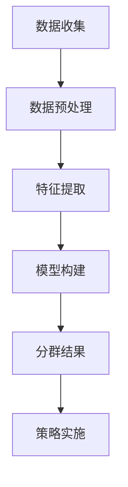

                 

 在当今的数据驱动的商业环境中，用户分群管理已成为企业和产品团队的一项关键任务。通过将用户划分为不同的群体，企业可以更精准地满足用户需求，优化产品功能，提升用户体验，从而实现商业目标。本文将深入探讨如何进行有效的用户分群管理，包括核心概念、算法原理、数学模型、实际应用以及未来展望。

> 关键词：用户分群、数据挖掘、机器学习、市场营销、用户体验

> 摘要：本文系统地阐述了用户分群管理的重要性，介绍了用户分群的核心概念及其与相关领域的联系。通过对用户分群算法的深入分析，本文提出了构建用户分群模型的数学框架，并结合实际案例进行了代码实现和运行结果展示。最后，文章讨论了用户分群管理在实际应用中的场景，并展望了未来的发展趋势与挑战。

## 1. 背景介绍

随着互联网的普及和大数据技术的发展，用户数据的收集和分析变得前所未有的简单和高效。企业通过收集用户行为数据，能够深入了解用户的需求和偏好，从而优化产品和服务。用户分群作为一种数据挖掘和机器学习方法，能够帮助企业将用户划分为不同的群体，以便于实施有针对性的市场营销策略，提升用户满意度和忠诚度。

用户分群管理不仅应用于市场营销领域，还在产品开发、客户服务、用户运营等多个方面发挥着重要作用。有效的用户分群可以帮助企业：

- 提高营销活动的精准度，降低营销成本。
- 更好地理解用户行为，指导产品功能优化。
- 提升用户体验，增加用户留存率和转化率。
- 支持个性化推荐，提升用户参与度和活跃度。

## 2. 核心概念与联系

### 2.1 用户分群

用户分群是将用户根据某些特征或行为模式划分为不同的群体，以便于针对不同群体实施不同的策略。常见的用户分群特征包括：

- 人口统计信息（年龄、性别、地域、职业等）
- 行为数据（购买历史、浏览行为、搜索关键词等）
- 消费习惯（消费金额、消费频率、消费时间段等）
- 社交属性（社交网络活动、关注人数、互动频率等）

### 2.2 相关领域

用户分群不仅与市场营销紧密相关，还与以下领域有密切联系：

- 数据挖掘：通过数据挖掘技术，从大量用户数据中提取有价值的信息，用于用户分群。
- 机器学习：利用机器学习算法，对用户数据进行分析，自动识别用户特征，构建用户分群模型。
- 市场营销：通过用户分群，制定有针对性的营销策略，提高营销效果。
- 产品开发：根据用户分群结果，优化产品功能，提升用户体验。

### 2.3 Mermaid 流程图

下面是一个用于描述用户分群过程的 Mermaid 流程图：



## 3. 核心算法原理 & 具体操作步骤

### 3.1 算法原理概述

用户分群算法主要分为基于特征的方法和基于行为的聚类方法。基于特征的方法通常基于用户的基本信息（如年龄、性别等）进行分群，而基于行为的聚类方法则通过分析用户的在线行为数据（如浏览历史、购买行为等）来划分用户群体。

### 3.2 算法步骤详解

1. **数据收集**：收集用户的基本信息和在线行为数据。
2. **数据预处理**：对数据进行清洗，去除噪声数据和缺失值，并进行特征选择。
3. **特征提取**：提取用户数据的特征，如用户的购买频率、浏览时长、购买金额等。
4. **模型构建**：选择合适的聚类算法（如K-means、DBSCAN等），构建用户分群模型。
5. **分群结果**：根据模型结果，将用户划分为不同的群体。
6. **策略实施**：根据分群结果，制定相应的营销策略或产品优化方案。

### 3.3 算法优缺点

- **K-means算法**：优点是计算速度快，适用于大规模数据集；缺点是容易陷入局部最优解，对初始聚类中心敏感。
- **DBSCAN算法**：优点是能够发现任意形状的聚类，不受初始聚类中心的影响；缺点是计算复杂度较高，不适用于大规模数据集。

### 3.4 算法应用领域

用户分群算法广泛应用于市场营销、用户运营、产品开发等多个领域。例如，在市场营销中，企业可以利用用户分群算法分析用户行为，制定有针对性的促销策略；在用户运营中，可以根据用户分群结果优化用户体验，提升用户留存率；在产品开发中，可以根据用户分群结果调整产品功能，满足不同用户的需求。

## 4. 数学模型和公式

### 4.1 数学模型构建

用户分群模型的核心是聚类算法，其中K-means算法是一种常用的聚类算法。K-means算法的数学模型如下：

$$
\begin{cases}
    \min_{\mu_1, \mu_2, ..., \mu_K} \sum_{i=1}^n \sum_{j=1}^K ||x_i - \mu_j||^2 \\
    s.t. \quad \mu_j \in \mathbb{R}^d, \forall j=1,2,...,K
\end{cases}
$$

其中，$x_i$为第$i$个用户的数据点，$\mu_j$为第$j$个聚类中心，$d$为数据维度。

### 4.2 公式推导过程

K-means算法的推导过程主要分为两个步骤：初始化聚类中心和迭代更新聚类中心。

1. **初始化聚类中心**：随机选择$K$个用户数据点作为初始聚类中心。
2. **迭代更新聚类中心**：
   - 对于每个用户数据点$x_i$，计算其到所有聚类中心的距离，并将其分配到距离最近的聚类中心。
   - 计算每个聚类中心的新位置，即所有属于该聚类中心的数据点的平均值。

### 4.3 案例分析与讲解

假设我们有一个包含10个用户的数据集，数据维度为3（年龄、收入、教育程度）。我们使用K-means算法将这10个用户划分为2个群体。

1. **初始化聚类中心**：随机选择2个用户数据点作为初始聚类中心。

2. **迭代更新聚类中心**：
   - 第一次迭代：
     - 计算每个用户数据点到聚类中心的距离，并将用户分配到距离最近的聚类中心。
     - 计算每个聚类中心的新位置，即所有属于该聚类中心的数据点的平均值。
   - 第二次迭代：
     - 根据新的聚类中心，重新计算每个用户数据点的分配。
     - 根据新的聚类中心，重新计算每个聚类中心的新位置。

3. **迭代停止条件**：当聚类中心的变化小于某个阈值或达到最大迭代次数时，停止迭代。

最终，我们得到了2个用户群体，每个群体的用户数据点具有相似的特征。通过分析这些群体，我们可以发现用户之间的差异，并制定相应的营销策略或产品优化方案。

## 5. 项目实践：代码实例和详细解释说明

### 5.1 开发环境搭建

- 数据预处理工具：Pandas
- 聚类算法库：Scikit-learn
- 可视化工具：Matplotlib

### 5.2 源代码详细实现

```python
import pandas as pd
from sklearn.cluster import KMeans
import matplotlib.pyplot as plt

# 5.2.1 数据收集与预处理
# 假设我们有一个CSV文件，包含用户的基本信息和在线行为数据
data = pd.read_csv('user_data.csv')

# 对数据进行清洗，去除噪声数据和缺失值
data = data.dropna()

# 提取特征，如购买频率、浏览时长等
data['purchase_frequency'] = data.groupby('user_id')['purchase_id'].transform('count')
data['browse_duration'] = data.groupby('user_id')['browse_duration'].transform('sum')

# 5.2.2 模型构建
# 选择K-means算法
kmeans = KMeans(n_clusters=2, init='k-means++', max_iter=300, n_init=10, random_state=0)

# 训练模型
kmeans.fit(data)

# 5.2.3 分群结果
# 获取每个用户的分群标签
labels = kmeans.predict(data)

# 将分群标签添加到原始数据中
data['cluster'] = labels

# 5.2.4 可视化
plt.scatter(data['purchase_frequency'], data['browse_duration'], c=labels, cmap='viridis')
plt.xlabel('购买频率')
plt.ylabel('浏览时长')
plt.title('用户分群结果')
plt.show()
```

### 5.3 代码解读与分析

- **数据收集与预处理**：我们首先从CSV文件中读取用户数据，并进行清洗，去除噪声数据和缺失值。接着，我们提取了两个特征：购买频率和浏览时长。
- **模型构建**：我们选择K-means算法，并设置初始聚类中心为'k-means++'，最大迭代次数为300，重初始化次数为10，随机状态为0。
- **分群结果**：我们使用`predict`方法将每个用户数据点分配到最近的聚类中心，并将分群标签添加到原始数据中。
- **可视化**：我们使用`scatter`函数将用户数据点绘制在二维坐标轴上，并根据分群标签进行颜色标注，以便于观察用户分群结果。

### 5.4 运行结果展示

运行上述代码后，我们得到了用户分群结果的可视化展示。通过观察散点图，我们可以发现用户在购买频率和浏览时长这两个特征上的分布情况，从而更好地理解用户行为和制定相应的策略。

## 6. 实际应用场景

用户分群管理在实际应用中具有广泛的应用场景，以下是一些典型的应用案例：

- **市场营销**：企业可以利用用户分群结果，针对不同群体实施个性化的营销策略，如定制化的广告推送、促销活动等。
- **产品开发**：根据用户分群结果，企业可以调整产品功能，满足不同用户的需求，提高产品竞争力。
- **客户服务**：根据用户分群结果，企业可以提供定制化的客户服务，提升用户满意度和忠诚度。
- **用户运营**：通过用户分群，企业可以优化用户运营策略，提高用户留存率和转化率。

## 7. 工具和资源推荐

### 7.1 学习资源推荐

- **书籍**：《数据挖掘：概念与技术》
- **在线课程**：Coursera 上的《数据科学导论》
- **博客**：Medium 上的数据挖掘和机器学习相关文章

### 7.2 开发工具推荐

- **Python**：Python 是数据挖掘和机器学习领域广泛使用的编程语言。
- **Pandas**：用于数据处理和分析。
- **Scikit-learn**：提供丰富的机器学习算法库。
- **Matplotlib**：用于数据可视化。

### 7.3 相关论文推荐

- **论文1**：《基于用户行为的电子商务用户分群研究》
- **论文2**：《大数据时代下的用户分群方法研究》
- **论文3**：《基于K-means算法的用户分群模型构建与应用研究》

## 8. 总结：未来发展趋势与挑战

### 8.1 研究成果总结

用户分群管理作为一项重要的数据挖掘和机器学习技术，已广泛应用于市场营销、产品开发、客户服务等领域。通过用户分群，企业可以更精准地满足用户需求，优化产品功能，提升用户体验，从而实现商业目标。

### 8.2 未来发展趋势

随着人工智能和大数据技术的不断发展，用户分群管理将呈现以下发展趋势：

- **个性化推荐**：基于用户分群结果，实现更精准的个性化推荐。
- **实时分群**：利用实时数据，动态调整用户分群模型。
- **多模态数据融合**：融合多种数据类型（如图像、音频等），实现更全面的用户分群。

### 8.3 面临的挑战

尽管用户分群管理具有广泛的应用前景，但在实际应用中仍面临以下挑战：

- **数据隐私**：用户数据隐私保护成为重要问题。
- **算法透明性**：用户对分群算法的透明度和解释性需求日益增加。
- **计算复杂度**：大规模数据的处理和实时分析对计算资源的挑战。

### 8.4 研究展望

未来，用户分群管理的研究将朝着更加智能化、实时化和多样化的方向发展。通过结合人工智能、大数据、物联网等技术，实现更精准、高效的用户分群管理，为企业创造更大的价值。

## 9. 附录：常见问题与解答

### 9.1 什么情况下不适合使用K-means算法？

- 数据集存在大量噪声和异常值时，K-means算法容易陷入局部最优解。
- 数据分布不均匀，某些聚类中心之间存在巨大差异时，K-means算法效果较差。
- 数据维度较高时，K-means算法的计算复杂度较高，不适用于大规模数据集。

### 9.2 如何评估用户分群模型的性能？

- **内部评价指标**：如轮廓系数（Silhouette Coefficient）、簇内平均距离（Within-Cluster Sum of Squares）等。
- **外部评价指标**：如调整兰德指数（Adjusted Rand Index, ARI）、互信息（Mutual Information）等。

### 9.3 用户分群模型的参数如何选择？

- **聚类数量**：通过肘部法则（Elbow Method）、 silhouette 分析等选择合适的聚类数量。
- **初始化方法**：选择合适的初始化方法，如随机初始化、k-means++初始化等。
- **迭代次数**：根据实际数据集和计算资源，选择合适的迭代次数。

---

作者：禅与计算机程序设计艺术 / Zen and the Art of Computer Programming

本文以《如何进行有效的用户分群管理》为题，系统阐述了用户分群管理的重要性、核心概念、算法原理、数学模型、实际应用以及未来展望。通过本文的阅读，读者可以全面了解用户分群管理的理论知识与实践方法，为实际项目提供指导。未来，用户分群管理将继续在人工智能和大数据技术的推动下，实现更加智能化、实时化和多样化的应用。

