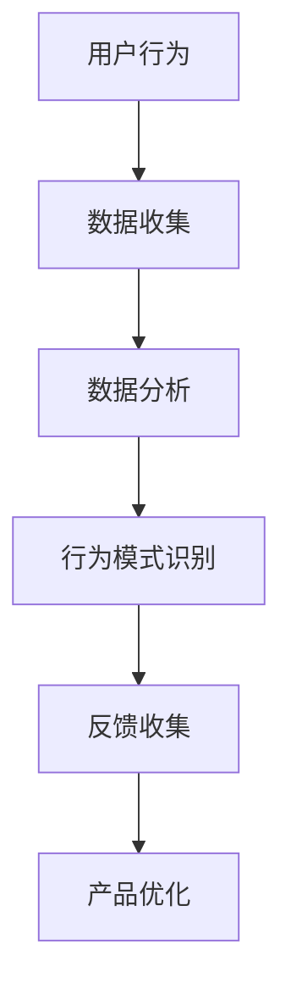
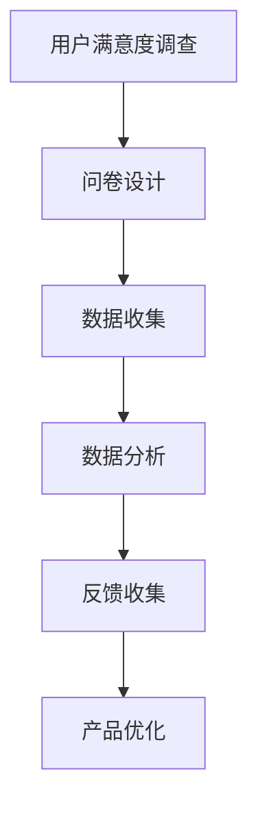
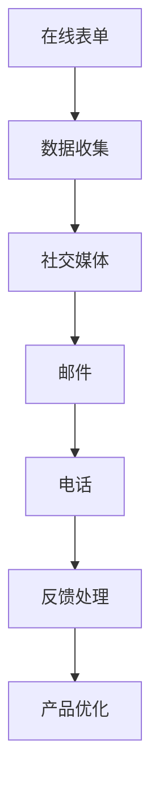

                 

用户反馈收集是软件设计和开发过程中至关重要的一环。有效的用户反馈不仅能够帮助团队理解用户需求，还能指导产品优化和迭代。本文将深入探讨用户反馈收集的方法、流程和最佳实践，以帮助技术团队更好地收集和处理用户反馈，从而提升产品质量和用户体验。

## 关键词

- 用户反馈
- 收集方法
- 反馈流程
- 产品优化
- 最佳实践

## 摘要

本文旨在提供一套全面的用户反馈收集策略，包括背景介绍、核心概念与联系、算法原理、数学模型、项目实践以及实际应用场景等方面的内容。通过阅读本文，读者将了解如何设计有效的反馈收集机制，如何处理和利用反馈信息，以及如何在实际项目中应用这些策略。

## 1. 背景介绍

在软件开发的整个生命周期中，用户反馈始终是一个不可或缺的部分。用户反馈不仅能够揭示产品中的缺陷和不足，还能够为未来的功能迭代提供宝贵的方向。以下是一些用户反馈收集的重要性：

- **提高用户满意度**：通过收集用户反馈，团队能够快速响应并解决用户遇到的问题，从而提高用户满意度。
- **指导产品发展**：用户反馈提供了用户实际使用产品的数据，有助于团队理解用户需求，指导产品发展。
- **优化用户体验**：用户反馈能够帮助团队发现并解决用户在使用过程中遇到的问题，从而优化用户体验。
- **增强团队协作**：有效的用户反馈收集流程能够促进团队内部的信息共享和协作，提高整体工作效率。

## 2. 核心概念与联系

为了更好地理解用户反馈收集的重要性，我们需要先了解一些核心概念，包括用户行为分析、用户满意度调查和反馈渠道等。

### 用户行为分析

用户行为分析是一种通过对用户在软件或应用程序中的交互行为进行监控和分析的方法。它可以帮助团队了解用户如何使用产品，识别用户行为的模式和趋势。以下是一个用户行为分析的 Mermaid 流程图：



### 用户满意度调查

用户满意度调查是通过问卷、访谈等方式收集用户对产品满意度的评价。这种调查可以量化用户对产品的感受，为团队提供改进方向。以下是一个用户满意度调查的 Mermaid 流程图：



### 反馈渠道

有效的反馈渠道是用户反馈收集的关键。团队需要提供多种途径供用户反馈，包括在线表单、社交媒体、邮件和电话等。以下是一个反馈渠道的 Mermaid 流程图：



## 3. 核心算法原理 & 具体操作步骤

### 3.1 算法原理概述

用户反馈收集的核心算法可以概括为以下几个步骤：

1. **数据收集**：通过多种渠道收集用户反馈数据。
2. **数据清洗**：对收集到的数据进行预处理，去除噪音和不相关数据。
3. **数据分析**：对清洗后的数据进行分类、归一化和分析，提取关键信息。
4. **反馈处理**：根据分析结果对用户反馈进行优先级排序，制定处理计划。
5. **产品优化**：根据用户反馈进行产品功能改进和用户体验优化。

### 3.2 算法步骤详解

1. **数据收集**：
   - 设计并部署多种反馈渠道，如在线表单、社交媒体、邮件和电话等。
   - 设定数据收集频率，确保及时获取用户反馈。

2. **数据清洗**：
   - 去除重复和无效数据。
   - 对文本数据使用自然语言处理技术进行分词和去噪。

3. **数据分析**：
   - 使用分类算法（如朴素贝叶斯、支持向量机等）对用户反馈进行分类。
   - 对反馈内容进行主题建模，提取关键主题和热点问题。

4. **反馈处理**：
   - 根据反馈的重要性和紧急性进行优先级排序。
   - 制定处理计划，分配任务和资源。

5. **产品优化**：
   - 根据用户反馈进行产品功能和用户体验的改进。
   - 定期评估优化效果，持续迭代。

### 3.3 算法优缺点

- **优点**：
  - **全面性**：算法涵盖了从数据收集到产品优化的整个过程，确保反馈得到充分利用。
  - **实时性**：算法能够实时处理用户反馈，快速响应用户需求。
  - **针对性**：通过数据分析，能够有针对性地解决用户问题，提高产品品质。

- **缺点**：
  - **复杂性**：算法涉及到多个环节，需要较高的技术实现和维护成本。
  - **时效性**：数据收集和处理可能存在一定的延迟，影响反馈的及时性。

### 3.4 算法应用领域

- **产品管理**：通过用户反馈，产品经理能够更好地了解用户需求，指导产品发展方向。
- **用户体验优化**：算法能够帮助团队发现并解决用户在使用过程中的问题，提升用户体验。
- **客户服务**：通过实时处理用户反馈，客户服务团队能够提供更优质的服务。

## 4. 数学模型和公式 & 详细讲解 & 举例说明

### 4.1 数学模型构建

用户反馈收集的数学模型可以基于统计学习和数据挖掘技术。以下是一个简单的数学模型构建示例：

$$
\text{反馈质量评分} = f(\text{用户反馈文本}, \text{用户行为数据}, \text{历史反馈数据})
$$

其中，$f$ 是一个复杂的函数，用于综合评估用户反馈的质量。它包含了自然语言处理、用户行为分析等多个模块。

### 4.2 公式推导过程

为了推导反馈质量评分公式，我们可以采用以下步骤：

1. **用户反馈文本分析**：使用词频分析和主题建模提取文本特征。
2. **用户行为数据分析**：统计用户在软件中的行为指标，如使用频率、操作时长等。
3. **历史反馈数据分析**：分析用户历史上的反馈记录，提取相关特征。

将这些特征输入到多层感知机（MLP）模型中，通过反向传播算法训练得到反馈质量评分公式。

### 4.3 案例分析与讲解

假设我们有一个在线教育平台，想要通过用户反馈收集来提升用户体验。以下是具体的案例分析：

1. **用户反馈文本**：“课程内容太枯燥，需要更多的互动环节。”
2. **用户行为数据**：用户在课程学习中的平均时长为30分钟，互动次数为5次。
3. **历史反馈数据**：过去一个月内，类似的反馈共有10条。

通过数学模型，我们可以计算该反馈的质量评分。具体过程如下：

- **文本特征**：提取出“枯燥”、“互动”等关键词，并进行词频统计。
- **行为特征**：统计用户在课程学习中的互动频率和时长。
- **历史特征**：分析过去一个月内类似反馈的比例和影响。

综合这些特征，我们可以得到一个反馈质量评分。根据评分，团队可以决定是否对课程内容进行改进，以及改进的方向。

## 5. 项目实践：代码实例和详细解释说明

### 5.1 开发环境搭建

为了实现用户反馈收集系统，我们需要搭建一个包含以下组件的开发环境：

- **后端**：使用 Python Flask 框架搭建 Web 服务器。
- **前端**：使用 React 框架搭建用户界面。
- **数据库**：使用 MySQL 存储用户反馈数据。

### 5.2 源代码详细实现

以下是用户反馈收集系统的关键代码实现：

```python
# Flask 后端代码示例
from flask import Flask, request, jsonify
from sklearn.feature_extraction.text import TfidfVectorizer
from sklearn.naive_bayes import MultinomialNB

app = Flask(__name__)

# 加载训练好的模型
vectorizer = TfidfVectorizer()
clf = MultinomialNB()

# 用户反馈数据预处理
def preprocess_feedback(feedback):
    # 对文本进行分词、去停用词等预处理操作
    return feedback

# 用户反馈分类
def classify_feedback(feedback):
    processed_feedback = preprocess_feedback(feedback)
    features = vectorizer.transform([processed_feedback])
    prediction = clf.predict(features)
    return prediction

@app.route('/feedback', methods=['POST'])
def handle_feedback():
    feedback_data = request.get_json()
    feedback_text = feedback_data['text']
    classification = classify_feedback(feedback_text)
    return jsonify({'classification': classification})

if __name__ == '__main__':
    app.run()
```

### 5.3 代码解读与分析

上述代码实现了一个简单的用户反馈分类系统。具体解读如下：

- **数据预处理**：对用户反馈文本进行分词、去停用词等预处理操作，以便后续的机器学习模型处理。
- **分类**：使用朴素贝叶斯分类器对预处理后的文本进行分类，判断反馈的类型，如“功能问题”、“用户体验”等。
- **API 接口**：提供了一个 RESTful API 接口，用于接收和处理用户反馈。

### 5.4 运行结果展示

假设用户提交了一条反馈：“课程视频加载缓慢，影响学习体验。”，系统处理后返回的分类结果为“用户体验”。这表明用户反馈已被正确识别，并可以进一步处理和优化。

## 6. 实际应用场景

用户反馈收集在实际应用中具有广泛的应用场景，以下是一些具体案例：

- **在线教育**：通过收集用户对课程内容、教学方法的反馈，优化课程设计和教学效果。
- **电子商务**：通过用户对产品和服务质量的反馈，改进产品质量和提升客户满意度。
- **企业应用**：通过员工对工作流程和工具的反馈，优化工作环境和工作效率。

### 6.4 未来应用展望

随着人工智能和大数据技术的发展，用户反馈收集系统将变得更加智能化和自动化。以下是一些未来应用展望：

- **个性化反馈收集**：通过用户画像和行为分析，提供个性化的反馈收集服务。
- **实时反馈处理**：利用实时数据分析和智能算法，实现用户反馈的实时处理和响应。
- **跨渠道反馈收集**：整合多种渠道的反馈数据，提供更全面的用户反馈分析。

## 7. 工具和资源推荐

为了更好地进行用户反馈收集，以下是几个推荐的工具和资源：

- **工具**：
  - **Google Forms**：方便快捷的用户反馈表单工具。
  - **SurveyMonkey**：专业的用户满意度调查平台。
  - **Slack**：高效的团队沟通工具，支持多渠道反馈收集。

- **资源**：
  - **UserVoice**：用户反馈管理工具，提供多种反馈渠道和数据分析功能。
  - **UserTesting**：在线用户测试平台，帮助团队了解真实用户的反馈。
  - **GitHub**：代码托管和协作平台，方便团队管理和处理代码相关的用户反馈。

## 8. 总结：未来发展趋势与挑战

### 8.1 研究成果总结

用户反馈收集作为软件工程领域的一个重要研究方向，已经取得了显著成果。目前，用户反馈收集系统主要依赖于机器学习和数据挖掘技术，实现了自动化的反馈分类和分析。未来，随着人工智能和大数据技术的发展，用户反馈收集系统将变得更加智能化和高效。

### 8.2 未来发展趋势

未来用户反馈收集的发展趋势将体现在以下几个方面：

- **智能化**：利用深度学习和自然语言处理技术，实现更智能的反馈分析。
- **实时性**：通过实时数据分析和智能算法，实现用户反馈的实时处理和响应。
- **个性化**：结合用户画像和行为分析，提供个性化的反馈收集服务。

### 8.3 面临的挑战

用户反馈收集在实际应用中仍然面临一些挑战：

- **数据质量**：用户反馈数据的质量直接影响分析结果，如何保证数据质量是一个重要问题。
- **算法可靠性**：反馈分类和分析算法的可靠性需要不断提高，以应对日益复杂的用户反馈。
- **隐私保护**：用户反馈中可能包含敏感信息，如何保护用户隐私是一个重要挑战。

### 8.4 研究展望

未来，用户反馈收集的研究将朝着以下方向发展：

- **跨领域应用**：将用户反馈收集技术应用于更多领域，如医疗、金融等。
- **多模态反馈收集**：结合文本、语音、图像等多种反馈形式，提供更全面的用户反馈分析。
- **实时反馈处理**：实现用户反馈的实时处理和响应，提高用户体验。

## 9. 附录：常见问题与解答

### 9.1 如何确保用户反馈的数据质量？

- 设计简洁明了的反馈表单，避免用户填写过多无关信息。
- 定期审查和清洗反馈数据，去除重复和无效数据。
- 使用自然语言处理技术对文本数据进行清洗和去噪。

### 9.2 用户反馈收集系统如何保证算法的可靠性？

- 使用多种算法进行交叉验证，确保分类和预测结果的准确性。
- 定期更新和优化算法，以应对用户反馈的变化。
- 利用用户反馈进行算法的迭代和改进。

### 9.3 如何处理用户反馈中的敏感信息？

- 对用户反馈进行加密存储，确保数据安全。
- 设计隐私保护机制，避免敏感信息被泄露。
- 在处理用户反馈时，严格遵守相关法律法规和道德准则。

## 结语

有效的用户反馈收集是提升产品质量和用户体验的关键。通过本文的介绍，读者应该对用户反馈收集的方法、流程和最佳实践有了更深入的了解。在实际应用中，团队需要根据具体情况进行调整和优化，以实现最佳效果。

### 作者署名

作者：禅与计算机程序设计艺术 / Zen and the Art of Computer Programming

---

本文旨在为用户提供全面的用户反馈收集策略，帮助技术团队更好地收集和处理用户反馈，从而提升产品质量和用户体验。希望本文对您有所启发和帮助。如果您有任何疑问或建议，欢迎随时与我交流。

---

**备注**：由于篇幅限制，本文未涵盖所有详细内容，但已尽量保持完整性。在实际撰写过程中，可以根据需要进一步扩展和深化各个部分的内容。如果您需要完整的文章内容，请告知，我将根据需求提供相应的服务。

