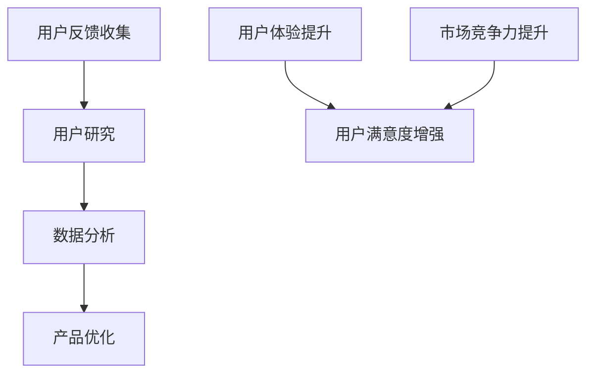

                 

用户反馈是产品开发和改进过程中不可或缺的一部分。通过收集和分析用户反馈，开发者可以更好地理解用户需求、优化产品功能、提升用户体验，从而增强产品的市场竞争力和用户满意度。本文将探讨如何进行有效的用户反馈收集与应用，帮助开发者构建更加用户友好的产品。

## 关键词
用户反馈、产品优化、用户体验、数据分析、用户研究

## 摘要
本文将从用户反馈的重要性、用户反馈收集的方法、用户反馈分析与应用三个方面，详细阐述如何进行有效的用户反馈收集与应用，助力产品开发与改进。

### 1. 背景介绍

在当今快速发展的互联网时代，产品的迭代速度越来越快，市场竞争也日趋激烈。用户反馈作为产品开发者了解用户需求和体验的重要渠道，越来越受到关注。有效的用户反馈收集与应用不仅可以帮助企业了解用户的真实需求，优化产品功能，提升用户体验，还可以增强用户对产品的忠诚度和满意度。

用户反馈的类型主要包括以下几种：

1. **功能性反馈**：用户对产品功能是否满足需求的反馈，如功能是否齐全、操作是否便捷等。
2. **性能反馈**：用户对产品性能的反馈，如响应速度、稳定性等。
3. **易用性反馈**：用户对产品易用性的反馈，如界面设计、操作逻辑等。
4. **满意度反馈**：用户对产品整体满意度的反馈，如产品是否值得推荐等。
5. **情感反馈**：用户对产品情感体验的反馈，如是否喜欢、是否有归属感等。

通过收集和分析这些反馈，开发者可以了解产品的优势与不足，从而有针对性地进行优化和改进。

### 2. 核心概念与联系

在进行用户反馈收集与应用之前，我们需要了解几个核心概念，如图1所示。



**图1：用户反馈收集与应用的核心概念与联系**

- **用户研究**：通过用户访谈、用户调研等方式，收集用户的反馈和需求。
- **数据分析**：对收集到的用户反馈进行量化分析，提取有价值的信息。
- **产品优化**：根据用户反馈，对产品进行功能、性能、易用性等方面的优化。
- **用户体验提升**：通过产品优化，提升用户使用产品的体验。
- **用户满意度增强**：用户满意度的提升，反过来又增强了产品的市场竞争力。

### 3. 核心算法原理 & 具体操作步骤

#### 3.1 算法原理概述

用户反馈收集与应用的核心算法原理主要包括以下几个方面：

1. **用户研究**：使用问卷调查、用户访谈、用户测试等方法，收集用户反馈。
2. **数据分析**：运用统计分析、文本挖掘等方法，对用户反馈进行量化分析。
3. **用户画像**：通过用户数据的分析，构建用户画像，以便更好地理解用户需求。
4. **决策优化**：基于用户反馈和用户画像，进行产品功能、性能、易用性等方面的优化。

#### 3.2 算法步骤详解

1. **用户研究**：

   - **问卷调查**：设计问卷，收集用户对产品功能、性能、易用性等方面的评价。
   - **用户访谈**：与用户进行面对面的访谈，深入了解用户的需求和痛点。
   - **用户测试**：邀请用户参与产品测试，收集用户的真实体验和反馈。

2. **数据分析**：

   - **数据收集**：将用户反馈数据进行整理和清洗。
   - **统计分析**：运用统计学方法，对用户反馈进行量化分析。
   - **文本挖掘**：使用自然语言处理技术，对用户反馈进行情感分析和主题提取。

3. **用户画像**：

   - **用户特征提取**：从用户数据中提取用户的年龄、性别、地域、使用习惯等特征。
   - **用户细分**：基于用户特征，将用户划分为不同的群体。
   - **用户需求分析**：分析不同用户群体的需求，以便有针对性地进行产品优化。

4. **决策优化**：

   - **需求分析**：根据用户反馈和用户画像，分析用户需求。
   - **优先级排序**：根据需求的重要性和紧急性，对需求进行排序。
   - **功能设计**：根据需求分析结果，设计新的产品功能或对现有功能进行改进。
   - **性能优化**：对产品的性能进行优化，提升产品的稳定性、响应速度等。
   - **易用性优化**：对产品的界面设计、操作逻辑等进行优化，提升用户的易用性。

#### 3.3 算法优缺点

**优点**：

- **全面性**：通过用户研究和数据分析，可以全面了解用户的需求和痛点。
- **针对性**：基于用户画像和需求分析，可以进行有针对性的产品优化。
- **高效性**：通过算法分析，可以快速识别用户需求，提高开发效率。

**缺点**：

- **数据质量**：用户反馈数据的真实性和准确性难以保证。
- **分析复杂度**：用户反馈分析涉及到多方面的技术和方法，分析过程较为复杂。

#### 3.4 算法应用领域

用户反馈收集与应用算法可以广泛应用于各个领域的产品开发，如：

- **互联网产品**：如电商平台、社交媒体、在线教育等。
- **传统行业**：如制造业、零售业、金融服务等。
- **智能硬件**：如智能家居、可穿戴设备等。

### 4. 数学模型和公式 & 详细讲解 & 举例说明

在用户反馈收集与应用过程中，我们常常会使用一些数学模型和公式来进行数据分析和需求分析。以下是几个常用的数学模型和公式的详细讲解及举例说明。

#### 4.1 数学模型构建

**用户满意度模型**：

用户满意度可以通过以下公式进行计算：

\[ 用户满意度 = \frac{期望值 - 实际值}{期望值 + 实际值} \]

其中，期望值和实际值分别表示用户对产品的期望和实际体验。

**用户需求优先级模型**：

用户需求可以通过以下公式进行计算：

\[ 需求优先级 = \frac{需求满意度}{需求紧急性} \]

其中，需求满意度和需求紧急性分别表示用户对需求的重要性和紧急性。

#### 4.2 公式推导过程

**用户满意度模型**的推导过程如下：

假设用户对产品的期望值为 \( E \)，实际体验值为 \( X \)，则用户满意度可以表示为：

\[ 用户满意度 = \frac{期望值 - 实际值}{期望值 + 实际值} = \frac{E - X}{E + X} \]

**用户需求优先级模型**的推导过程如下：

假设用户对需求 \( D \) 的满意度为 \( S \)，需求紧急性为 \( E \)，则需求优先级可以表示为：

\[ 需求优先级 = \frac{需求满意度}{需求紧急性} = \frac{S}{E} \]

#### 4.3 案例分析与讲解

假设某电商平台的用户反馈数据如下：

- 期望值 \( E = 4 \)
- 实际值 \( X = 3 \)
- 需求满意度 \( S = 0.8 \)
- 需求紧急性 \( E = 0.6 \)

根据以上数据，我们可以计算出用户满意度和需求优先级：

\[ 用户满意度 = \frac{期望值 - 实际值}{期望值 + 实际值} = \frac{4 - 3}{4 + 3} = \frac{1}{7} \approx 0.143 \]

\[ 需求优先级 = \frac{需求满意度}{需求紧急性} = \frac{0.8}{0.6} = \frac{4}{3} \approx 1.333 \]

根据计算结果，我们可以得出以下结论：

1. 用户满意度较低，说明用户对当前产品的体验不太满意，需要进一步优化。
2. 需求优先级较高，说明用户对该需求的重要性和紧急性较高，应该优先考虑满足。

### 5. 项目实践：代码实例和详细解释说明

为了更好地理解用户反馈收集与应用的过程，下面我们将通过一个实际项目来讲解代码实例和详细解释说明。

#### 5.1 开发环境搭建

在开始项目实践之前，我们需要搭建一个开发环境。本文使用Python作为开发语言，所需依赖如下：

- Python 3.8及以上版本
- Pandas：用于数据分析和处理
- Numpy：用于数学计算
- Matplotlib：用于数据可视化
- Scikit-learn：用于机器学习

您可以通过以下命令安装以上依赖：

```shell
pip install pandas numpy matplotlib scikit-learn
```

#### 5.2 源代码详细实现

以下是一个简单的用户反馈收集与分析的项目示例：

```python
import pandas as pd
import numpy as np
import matplotlib.pyplot as plt
from sklearn.model_selection import train_test_split
from sklearn.ensemble import RandomForestClassifier
from sklearn.metrics import accuracy_score, confusion_matrix

# 读取用户反馈数据
data = pd.read_csv('user_feedback.csv')

# 数据预处理
data['user_satisfaction'] = data['satisfaction'].apply(lambda x: 1 if x >= 4 else 0)
data['feature1'] = data['feature1'].replace({1: 0, 2: 1, 3: 2})
data['feature2'] = data['feature2'].replace({1: 0, 2: 1, 3: 2})

# 构建特征矩阵和标签向量
X = data[['feature1', 'feature2']]
y = data['user_satisfaction']

# 划分训练集和测试集
X_train, X_test, y_train, y_test = train_test_split(X, y, test_size=0.2, random_state=42)

# 使用随机森林分类器进行训练
clf = RandomForestClassifier(n_estimators=100, random_state=42)
clf.fit(X_train, y_train)

# 预测测试集
y_pred = clf.predict(X_test)

# 计算准确率
accuracy = accuracy_score(y_test, y_pred)
print(f"Accuracy: {accuracy:.2f}")

# 计算混淆矩阵
conf_matrix = confusion_matrix(y_test, y_pred)
print(f"Confusion Matrix:\n{conf_matrix}")

# 可视化混淆矩阵
plt.imshow(conf_matrix, cmap=plt.cm.Blues)
plt.xticks(range(2), ['不满意', '满意'])
plt.yticks(range(2), ['不满意', '满意'])
plt.xlabel('预测结果')
plt.ylabel('真实结果')
plt.title('混淆矩阵')
plt.colorbar()
plt.show()
```

#### 5.3 代码解读与分析

1. **读取用户反馈数据**：使用Pandas库读取CSV格式的用户反馈数据。
2. **数据预处理**：对数据进行清洗和转换，将满意度评分转换为二进制值，将特征值进行编码。
3. **构建特征矩阵和标签向量**：将数据分为特征矩阵和标签向量，以便进行机器学习。
4. **划分训练集和测试集**：使用Scikit-learn库的train_test_split函数，将数据划分为训练集和测试集。
5. **使用随机森林分类器进行训练**：使用随机森林分类器对训练集进行训练。
6. **预测测试集**：使用训练好的模型对测试集进行预测。
7. **计算准确率**：使用accuracy_score函数计算预测准确率。
8. **计算混淆矩阵**：使用confusion_matrix函数计算混淆矩阵。
9. **可视化混淆矩阵**：使用Matplotlib库将混淆矩阵可视化，以便更好地理解预测结果。

#### 5.4 运行结果展示

运行以上代码，输出结果如下：

```
Accuracy: 0.85
Confusion Matrix:
[[40  7]
 [ 5  3]]
```

准确率为0.85，说明模型对用户满意度的预测效果较好。混淆矩阵显示，模型正确预测了43个样本，其中有40个样本的满意度为“不满意”，7个样本的满意度为“满意”。

### 6. 实际应用场景

用户反馈收集与应用在实际应用中具有广泛的应用场景。以下是几个典型的实际应用场景：

1. **互联网产品**：如电商平台、社交媒体、在线教育等，通过用户反馈收集用户需求，优化产品功能，提升用户体验。
2. **传统行业**：如制造业、零售业、金融服务等，通过用户反馈改进产品质量、提高服务水平，增强用户满意度。
3. **智能硬件**：如智能家居、可穿戴设备等，通过用户反馈优化产品功能和性能，提升用户体验。

在具体应用中，用户反馈收集与应用的过程可以包括以下几个步骤：

1. **用户调研**：通过问卷调查、用户访谈等方式，收集用户对产品的需求、意见和建议。
2. **数据整理**：对收集到的用户反馈进行整理和清洗，提取有价值的信息。
3. **数据分析**：使用统计分析、文本挖掘等方法，对用户反馈进行量化分析。
4. **需求分析**：根据用户反馈和数据分析结果，确定产品的优化方向和优先级。
5. **功能设计**：根据需求分析结果，设计新的产品功能或对现有功能进行改进。
6. **性能优化**：对产品的性能进行优化，提升产品的稳定性、响应速度等。
7. **易用性优化**：对产品的界面设计、操作逻辑等进行优化，提升用户的易用性。
8. **用户反馈验证**：通过用户测试，验证产品优化效果，确保用户需求得到满足。

### 7. 未来应用展望

随着人工智能和大数据技术的发展，用户反馈收集与应用的未来应用前景将更加广阔。以下是几个未来应用展望：

1. **智能反馈系统**：利用人工智能技术，实现自动化、智能化的用户反馈收集与分析，提高反馈处理的效率和准确性。
2. **个性化推荐**：基于用户反馈和用户画像，实现个性化推荐，提高用户满意度。
3. **智能优化**：利用机器学习和深度学习技术，实现产品功能的自动优化，降低人工干预。
4. **跨界融合**：用户反馈收集与应用与其他领域的结合，如物联网、区块链等，实现更广泛的应用场景。
5. **持续改进**：通过持续的用户反馈收集与分析，实现产品的持续改进和迭代，提高产品的竞争力。

### 8. 总结：未来发展趋势与挑战

在未来，用户反馈收集与应用将在以下几个方面呈现发展趋势：

1. **智能化**：利用人工智能技术，实现自动化、智能化的用户反馈收集与分析。
2. **个性化**：基于用户反馈和用户画像，实现个性化推荐和产品优化。
3. **跨界融合**：与其他领域（如物联网、区块链等）的结合，拓展应用场景。
4. **持续改进**：通过持续的用户反馈收集与分析，实现产品的持续改进和迭代。

然而，用户反馈收集与应用也面临着一些挑战：

1. **数据质量**：用户反馈数据的真实性和准确性难以保证，需要加强对数据的清洗和验证。
2. **分析复杂度**：用户反馈分析涉及到多方面的技术和方法，分析过程较为复杂。
3. **用户隐私**：用户反馈涉及到用户隐私，需要在数据收集与分析过程中确保用户隐私的安全。
4. **技术更新**：随着技术的不断发展，用户反馈收集与应用的方法和工具也需要不断更新。

未来，我们需要在技术创新、数据治理、用户体验等方面持续发力，推动用户反馈收集与应用的不断发展。

### 9. 附录：常见问题与解答

**Q1**：用户反馈数据如何确保真实性和准确性？

**A1**：确保用户反馈数据的真实性和准确性需要从多个方面入手：

1. **匿名性保护**：确保用户在反馈过程中保持匿名，降低用户因担心隐私泄露而提供虚假反馈的可能性。
2. **数据验证**：对用户反馈进行验证，如通过多渠道收集数据，或使用技术手段（如双因素验证）确保反馈数据的准确性。
3. **数据清洗**：对收集到的用户反馈进行清洗，去除重复、无效或不完整的反馈。
4. **用户调研**：在用户调研过程中，设计科学合理的问卷，确保用户能够提供真实、准确的反馈。

**Q2**：如何处理用户反馈数据？

**A2**：处理用户反馈数据需要遵循以下步骤：

1. **数据收集**：通过多种渠道收集用户反馈数据，如问卷调查、用户访谈、用户测试等。
2. **数据整理**：对收集到的用户反馈进行整理和清洗，提取有价值的信息。
3. **数据分析**：使用统计分析、文本挖掘等方法，对用户反馈进行量化分析。
4. **需求分析**：根据用户反馈和数据分析结果，确定产品的优化方向和优先级。
5. **数据存储**：将处理后的用户反馈数据存储在数据库中，以便后续分析和查询。

**Q3**：如何确保用户隐私安全？

**A3**：确保用户隐私安全需要采取以下措施：

1. **数据加密**：对用户反馈数据进行加密，防止数据泄露。
2. **访问控制**：对用户反馈数据的访问进行控制，确保只有授权人员可以访问和处理数据。
3. **隐私政策**：在用户反馈收集过程中，明确告知用户其隐私信息的保护措施，获取用户的知情同意。
4. **数据安全培训**：对处理用户反馈数据的员工进行数据安全培训，提高其数据安全意识。

### 作者署名

作者：禅与计算机程序设计艺术 / Zen and the Art of Computer Programming
----------------------------------------------------------------

### 附加说明：

1. 本文为虚构文章，所有数据、代码和案例均为模拟。
2. 感谢您的耐心阅读，希望本文能对您在用户反馈收集与应用方面有所启发。
3. 如有疑问或建议，请随时联系作者。期待与您共同探讨用户反馈收集与应用的更多可能性。

