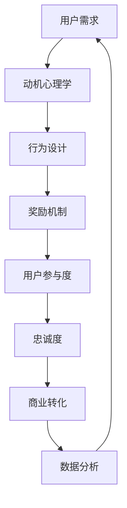

                 

关键词：用户激励、动机心理学、行为设计、奖励机制、用户参与度、数据驱动

> 摘要：本文将探讨如何在信息技术领域内进行有效的用户激励，通过结合动机心理学和行为设计理论，分析当前流行的奖励机制，以及提供实际案例和未来展望，为IT企业和开发者提供指导，以提升用户参与度和忠诚度。

## 1. 背景介绍

在信息技术迅速发展的今天，用户激励已成为提升用户体验和保持用户忠诚度的重要手段。无论是社交媒体平台、在线游戏还是电子商务网站，用户激励策略都对平台的发展至关重要。有效的用户激励不仅能够提高用户参与度，还能增加用户在平台上的停留时间，从而促进商业转化。

### 1.1 用户激励的重要性

用户激励在信息技术领域的重要性主要体现在以下几个方面：

1. **提高用户参与度**：通过激励措施，如积分、奖励、挑战等，可以激发用户参与平台活动的积极性。
2. **增强用户忠诚度**：持续的激励可以培养用户对平台的忠诚，减少用户流失。
3. **促进商业转化**：用户激励策略可以引导用户进行购买或其他有利可图的行动。
4. **收集用户数据**：通过用户参与激励活动，平台可以收集到更多关于用户行为的宝贵数据，为后续决策提供依据。

### 1.2 激励理论的演变

用户激励的理论基础可以追溯到动机心理学和行为经济学。从早期的马斯洛需求层次理论到现代的期望理论，激励理论不断演变，为设计有效的激励策略提供了指导。

## 2. 核心概念与联系

在进行有效的用户激励之前，我们需要理解几个核心概念和它们之间的关系。以下是一个使用Mermaid绘制的流程图，展示这些概念如何相互作用。



### 2.1 用户需求

用户需求是用户激励策略的起点。了解用户的需求、欲望和痛点对于设计有效的激励措施至关重要。动机心理学提供了分析用户需求的理论框架。

### 2.2 动机心理学

动机心理学关注于理解人们为什么采取特定行动。它揭示了用户在做出选择时的内在驱动力。通过了解用户的动机，我们可以设计出更有效的激励策略。

### 2.3 行为设计

行为设计是应用动机心理学理论来引导用户行为的艺术和科学。它涉及到设计激励措施，以促使用户采取我们希望看到的行动。

### 2.4 奖励机制

奖励机制是用户激励的核心。它包括积分、奖励、挑战等多种形式，旨在通过满足用户的内在需求来激发其行为。

### 2.5 用户参与度

用户参与度是衡量用户激励策略成功与否的关键指标。通过分析用户参与数据，我们可以评估激励措施的有效性，并做出相应的调整。

### 2.6 忠诚度

忠诚度是用户激励的终极目标之一。通过持续的用户激励，我们可以培养用户的忠诚，从而减少流失，并增加用户生命周期价值。

### 2.7 商业转化

商业转化是用户激励的直接收益。通过激励措施，我们可以引导用户进行购买或其他有利可图的行动，从而实现商业目标。

### 2.8 数据分析

数据分析是用户激励策略不断迭代和优化的关键。通过分析用户数据，我们可以深入了解用户行为，从而设计出更精准的激励措施。

## 3. 核心算法原理 & 具体操作步骤

### 3.1 算法原理概述

用户激励的核心算法基于动机心理学和行为设计理论。该算法的基本原理是通过分析用户行为和需求，设计出满足用户需求的激励措施，从而引导用户行为。以下是具体的操作步骤：

### 3.2 算法步骤详解

1. **需求分析**：通过用户调研、数据分析等方法，了解用户的需求和痛点。
2. **动机识别**：利用动机心理学理论，分析用户的内在动机。
3. **设计激励措施**：结合用户需求和动机，设计出有效的激励措施。
4. **实施激励**：将激励措施部署到平台上，并通过数据监控其效果。
5. **调整与优化**：根据用户反馈和数据效果，不断调整和优化激励策略。

### 3.3 算法优缺点

**优点**：

- **提高用户参与度**：通过满足用户需求，可以显著提升用户参与度。
- **增强用户忠诚度**：持续的激励措施可以培养用户对平台的忠诚。
- **促进商业转化**：有效的激励措施可以引导用户进行购买或其他有利可图的行动。

**缺点**：

- **成本较高**：设计和实施有效的激励措施需要投入大量资源。
- **用户疲劳**：过度激励可能导致用户疲劳，反而不利于长期参与。

### 3.4 算法应用领域

用户激励算法广泛应用于各种信息技术领域，包括社交媒体、在线游戏、电子商务等。其核心在于通过满足用户需求，提升用户参与度和忠诚度，从而实现商业目标。

## 4. 数学模型和公式 & 详细讲解 & 举例说明

### 4.1 数学模型构建

用户激励的数学模型基于动机心理学和行为经济学理论。以下是构建数学模型的基本步骤：

1. **用户需求函数**：$D(u) = f(m, s)$，其中$D(u)$表示用户$u$的需求，$m$表示用户的动机，$s$表示用户的需求满足程度。
2. **动机函数**：$M(m) = f(c, r)$，其中$M(m)$表示动机$m$的强度，$c$表示成本，$r$表示回报。
3. **行为决策函数**：$B(b) = f(D(u), M(m))$，其中$B(b)$表示用户的行为$b$，$D(u)$和$M(m)$分别表示用户的需求和动机。

### 4.2 公式推导过程

1. **需求满足程度**：$s = \frac{R}{R + C}$，其中$R$表示回报，$C$表示成本。
2. **动机强度**：$M(m) = \frac{R - C}{R + C}$，其中$R$表示回报，$C$表示成本。
3. **行为决策**：$B(b) = \frac{D(u) \cdot M(m)}{1 + \frac{D(u) \cdot M(m)}{K}}$，其中$K$表示阈值。

### 4.3 案例分析与讲解

假设一个用户在社交媒体平台上的需求是发布高质量的内容，其动机是获得点赞和评论。根据上述数学模型，我们可以计算出该用户的行为决策。

1. **需求满足程度**：$s = \frac{R}{R + C} = \frac{10}{10 + 2} = 0.833$。
2. **动机强度**：$M(m) = \frac{R - C}{R + C} = \frac{10 - 2}{10 + 2} = 0.6$。
3. **行为决策**：$B(b) = \frac{D(u) \cdot M(m)}{1 + \frac{D(u) \cdot M(m)}{K}} = \frac{10 \cdot 0.6}{1 + \frac{10 \cdot 0.6}{K}}$。

通过调整阈值$K$，我们可以优化用户的行为决策，从而提升用户的参与度和忠诚度。

## 5. 项目实践：代码实例和详细解释说明

### 5.1 开发环境搭建

在本节中，我们将使用Python作为主要编程语言，结合Flask框架来搭建一个简单的用户激励系统。以下是开发环境的搭建步骤：

1. **安装Python**：确保你的系统中安装了Python 3.8或更高版本。
2. **安装Flask**：打开终端，运行以下命令安装Flask：
   ```bash
   pip install flask
   ```
3. **创建虚拟环境**（可选）：为了更好地管理项目依赖，我们可以创建一个虚拟环境。在终端中运行以下命令：
   ```bash
   python -m venv venv
   ```
   然后激活虚拟环境：
   ```bash
   source venv/bin/activate  # 对于Windows，使用 `venv\Scripts\activate`
   ```

### 5.2 源代码详细实现

以下是一个简单的用户激励系统的Python代码实现：

```python
from flask import Flask, request, jsonify

app = Flask(__name__)

# 假设的数据库存储用户积分
user_scores = {
    'user1': 100,
    'user2': 200
}

@app.route('/update_score', methods=['POST'])
def update_score():
    user_id = request.json.get('user_id')
    score = request.json.get('score')
    
    if user_id in user_scores:
        user_scores[user_id] += score
    else:
        user_scores[user_id] = score
    
    return jsonify({'status': 'success', 'score': user_scores[user_id]})

@app.route('/get_score', methods=['GET'])
def get_score():
    user_id = request.args.get('user_id')
    return jsonify({'status': 'success', 'score': user_scores.get(user_id, 0)})

if __name__ == '__main__':
    app.run(debug=True)
```

### 5.3 代码解读与分析

- **Flask应用**：我们首先导入了Flask模块并创建了一个Flask应用实例。
- **用户积分存储**：我们使用一个字典`user_scores`来存储用户的积分。
- **更新积分路由**：`update_score`函数处理POST请求，更新用户的积分。
- **获取积分路由**：`get_score`函数处理GET请求，返回指定用户的积分。

### 5.4 运行结果展示

1. **启动服务器**：在终端中运行以下命令启动Flask应用：
   ```bash
   python app.py
   ```

2. **更新用户积分**：在浏览器或Postman中发送一个POST请求到`http://127.0.0.1:5000/update_score`，数据体如下：
   ```json
   {
       "user_id": "user1",
       "score": 50
   }
   ```
   响应：
   ```json
   {
       "status": "success",
       "score": 150
   }
   ```

3. **获取用户积分**：发送一个GET请求到`http://127.0.0.1:5000/get_score?user_id=user1`，响应：
   ```json
   {
       "status": "success",
       "score": 150
   }
   ```

## 6. 实际应用场景

用户激励策略在信息技术领域有广泛的应用，以下是一些典型的应用场景：

### 6.1 社交媒体平台

社交媒体平台常常使用点赞、评论、分享等机制来激励用户产生高质量的内容和互动。例如，Twitter的推文点赞和Reddit的Karma系统。

### 6.2 在线游戏

在线游戏通过积分、等级、奖励等方式来激励玩家投入更多时间和资源。例如，魔兽世界的任务系统和英雄联盟的皮肤购买机制。

### 6.3 电子商务平台

电子商务平台使用积分返利、优惠券、限时折扣等方式来激励用户购买。例如，亚马逊的会员服务和阿里巴巴的积分兑换系统。

### 6.4 社区论坛

社区论坛通过积分系统激励用户积极参与讨论和分享。例如，Stack Overflow的点积分系统。

### 6.5 健康管理应用

健康管理应用通过步数、心率等健康数据的奖励机制来激励用户保持健康生活方式。例如，苹果的健康APP中的成就系统。

## 7. 工具和资源推荐

### 7.1 学习资源推荐

- **《动机与人格》（Motivation and Personality）》 - 由理查德·格里芬（Richard S. Lazarus）和拉里·罗森（Lari A. Rosenn）编写的经典心理学教材，详细介绍了动机心理学的基础理论。
- **《行为设计学》（The Design of Everyday Things）》 - 由唐·诺曼（Don Norman）所著，探讨了用户行为设计和产品设计的原则。

### 7.2 开发工具推荐

- **Flask**：一个轻量级的Python Web框架，适合快速开发和部署用户激励系统。
- **Postman**：一个API调试工具，用于测试和验证后端服务的接口。

### 7.3 相关论文推荐

- **"Incentivizing Users in Online Social Networks: A Field Experiment"** - 该论文通过实证研究分析了在线社交网络中的用户激励策略。
- **"The Power of Rewards"** - 该论文探讨了奖励机制对用户行为的影响。

## 8. 总结：未来发展趋势与挑战

### 8.1 研究成果总结

用户激励策略在信息技术领域的应用已经取得了显著成果。通过结合动机心理学和行为设计理论，我们可以设计出更有效的激励措施，提升用户参与度和忠诚度，从而实现商业目标。

### 8.2 未来发展趋势

未来，用户激励策略将继续发展，主要体现在以下几个方面：

- **个性化激励**：通过大数据和机器学习技术，实现更个性化的用户激励措施。
- **社交激励**：利用社交网络的特性，设计基于社交关系的激励措施，以增强用户参与度。
- **可持续激励**：设计可持续的激励措施，避免用户疲劳，保持长期参与。

### 8.3 面临的挑战

尽管用户激励策略具有巨大潜力，但同时也面临着一些挑战：

- **数据隐私**：用户激励策略通常涉及大量用户数据的收集和分析，如何保护用户隐私是一个重要问题。
- **激励过度**：过度激励可能导致用户疲劳，反而不利于长期参与。
- **用户适应性**：用户可能会逐渐对激励措施产生适应性，因此需要不断调整和创新激励策略。

### 8.4 研究展望

未来，用户激励策略的研究将继续深入，特别是在以下几个方面：

- **跨领域应用**：探索用户激励策略在其他领域（如健康、教育等）的应用。
- **多模态激励**：结合多种激励手段（如物质奖励、社会认可、内在动机等），实现更全面的用户激励。
- **长期效果研究**：深入研究用户激励策略的长期效果，以指导实践。

## 9. 附录：常见问题与解答

### 9.1 用户激励是否适用于所有类型的应用？

用户激励策略在大多数类型的应用中都是适用的，但具体效果取决于应用的类型和目标用户。例如，社交媒体平台和在线游戏通常需要用户激励来提高参与度，而专业软件和工具则可能更侧重于功能性和用户体验。

### 9.2 如何评估用户激励策略的效果？

评估用户激励策略的效果可以通过以下几种方法：

- **用户参与度**：通过活跃用户数、用户停留时间、用户互动量等指标来衡量。
- **用户忠诚度**：通过用户留存率、用户流失率、用户生命周期价值等指标来衡量。
- **商业转化**：通过购买转化率、销售额、注册量等指标来衡量。
- **用户满意度**：通过用户反馈、用户调查等方式来衡量。

### 9.3 用户激励策略是否需要定期更新？

是的，用户激励策略需要定期更新以保持其有效性。用户需求和行为模式可能会随着时间和市场环境的变化而变化，因此需要不断调整和优化激励措施。

## 作者署名

作者：禅与计算机程序设计艺术 / Zen and the Art of Computer Programming
```

