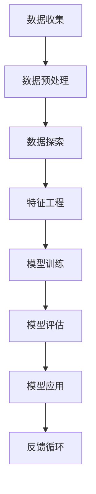

                 

用户行为分析是现代数据驱动决策的核心，对于任何希望在其市场上取得成功的企业来说都至关重要。通过深入了解用户的在线行为，企业可以优化产品设计、提升用户体验、增强用户参与度，并最终提高转化率和收益。本文旨在提供一份全面的指南，帮助读者了解用户行为分析的基本概念、核心算法、数学模型，以及如何通过实际项目实践来应用这些知识。

> 关键词：用户行为分析、数据驱动决策、行为模型、算法优化、数学模型、实践应用

> 摘要：本文首先介绍了用户行为分析的重要性及其背景，随后详细讨论了用户行为分析的核心概念和流程。接着，文章深入探讨了用户行为分析中的主要算法原理及其优缺点，并展示了如何构建数学模型来量化用户行为。此外，文章通过一个实际项目实例，详细讲解了用户行为分析的具体实现步骤，最后对未来的发展趋势与挑战进行了展望。

## 1. 背景介绍

在当今快速发展的数字化时代，互联网的普及使得用户行为数据变得异常丰富。用户在互联网上的每一次点击、浏览、购买等行为，都成为企业获取洞察的重要资源。然而，这些数据本身并不能直接带来价值，关键在于如何有效地进行分析和利用。

用户行为分析（User Behavior Analysis，简称UBA）是一种通过分析用户在系统中的行为数据，来理解和预测用户行为的方法。这种方法不仅可以帮助企业更好地了解用户需求，还可以为企业提供数据驱动的决策依据。以下是用户行为分析的一些主要用途：

1. **用户体验优化**：通过分析用户的使用习惯和偏好，优化产品设计和功能，提供更符合用户期望的服务。
2. **个性化推荐**：根据用户的浏览和购买历史，推荐个性化内容或产品，提升用户满意度和参与度。
3. **市场预测**：通过分析用户行为数据，预测市场趋势和用户需求，为企业制定战略规划提供支持。
4. **风险控制**：监控异常行为，及时发现潜在的风险和欺诈行为，保护企业和用户的利益。

随着大数据、人工智能和机器学习技术的快速发展，用户行为分析的方法和工具也在不断进步。传统的统计分析方法逐渐被先进的算法所取代，如决策树、随机森林、神经网络等。这些算法能够从海量数据中提取有价值的信息，帮助企业和个人做出更明智的决策。

## 2. 核心概念与联系

### 2.1 用户行为分析的定义

用户行为分析是指通过对用户在系统中的各种行为数据进行收集、处理和分析，以揭示用户行为模式、偏好和需求，从而为产品设计、用户体验优化和市场决策提供依据。

### 2.2 用户行为分析的核心概念

1. **用户数据**：包括用户的基本信息、行为日志、使用频率、时长、点击路径、购买记录等。
2. **行为日志**：记录用户在系统中的各项操作，如浏览页面、点击按钮、搜索关键词、添加购物车、完成交易等。
3. **行为模式**：通过分析用户数据，识别用户在不同场景下的行为规律，如访问频率、停留时长、点击顺序等。
4. **用户画像**：基于用户行为数据和人口统计信息，构建用户的基本特征和兴趣标签。

### 2.3 用户行为分析流程

1. **数据收集**：通过Web日志、点击流、传感器等技术，收集用户行为数据。
2. **数据预处理**：清洗、转换和整合原始数据，确保数据质量。
3. **数据探索**：利用可视化工具，初步探索数据特征，发现潜在的规律和异常。
4. **特征工程**：提取和构造有助于分析和预测的用户特征，如用户活跃度、页面停留时间等。
5. **模型训练**：选择合适的算法，利用训练数据建立用户行为预测模型。
6. **模型评估**：通过测试数据评估模型性能，调整模型参数，优化模型。
7. **模型应用**：将训练好的模型应用到实际场景中，如个性化推荐、用户流失预测等。

### 2.4 用户行为分析的架构

以下是一个简化的用户行为分析架构，展示了各个组件及其相互关系：



1. **数据收集**：通过各种渠道收集用户行为数据，如Web日志、点击流等。
2. **数据预处理**：清洗和整合数据，去除噪声和异常值，确保数据质量。
3. **数据探索**：利用可视化工具，初步分析数据特征，为特征工程提供参考。
4. **特征工程**：提取和构造有用的用户特征，为模型训练做准备。
5. **模型训练**：选择合适的算法，利用训练数据训练预测模型。
6. **模型评估**：使用测试数据评估模型性能，调整模型参数，优化模型。
7. **模型应用**：将训练好的模型应用到实际场景中，如个性化推荐、用户流失预测等。
8. **反馈循环**：根据实际应用中的反馈，不断调整和优化模型。

通过以上架构，企业可以系统地开展用户行为分析工作，从数据收集、预处理、探索到特征工程、模型训练和应用，形成一个闭环系统，持续提升用户行为分析的准确性和实用性。

## 3. 核心算法原理 & 具体操作步骤

### 3.1 算法原理概述

用户行为分析中常用的算法包括聚类算法、分类算法和关联规则挖掘等。这些算法各自适用于不同的场景，并具有不同的优缺点。

#### 聚类算法

聚类算法是将相似的数据点归为同一类，从而发现数据中的模式。在用户行为分析中，聚类算法可以用于发现用户的兴趣群体。常见的聚类算法有K-Means、层次聚类和DBSCAN等。

1. **K-Means**：基于距离度量，将数据点分配到K个中心点附近的簇中。优点是简单、易于实现，缺点是对于初始中心点的选择敏感，且可能陷入局部最优。
2. **层次聚类**：自底向上或自顶向下构建一个层次结构，逐步合并或分解聚类结果。优点是能够提供不同层次的分析，缺点是计算复杂度较高。
3. **DBSCAN**：基于密度连通性，能够发现任意形状的簇。优点是能够处理噪声和不规则数据，缺点是对参数的选择敏感。

#### 分类算法

分类算法用于将数据点划分为预定义的类别，常见的分类算法有决策树、支持向量机（SVM）和随机森林等。

1. **决策树**：通过一系列条件判断，将数据点逐层划分到不同的类别中。优点是易于理解和解释，缺点是对于异常值敏感，且容易过拟合。
2. **支持向量机（SVM）**：通过寻找最优的超平面，将数据点划分为不同的类别。优点是具有良好的泛化能力，缺点是计算复杂度较高，且对参数敏感。
3. **随机森林**：通过构建多棵决策树，并取其平均值作为最终预测结果。优点是具有良好的泛化能力和鲁棒性，缺点是计算复杂度较高。

#### 关联规则挖掘

关联规则挖掘用于发现数据集中的关联关系，常见的算法有Apriori算法和FP-Growth算法。

1. **Apriori算法**：通过枚举所有可能的项集，计算支持度和置信度，生成关联规则。优点是简单易懂，缺点是计算复杂度较高，尤其是在大数据集上。
2. **FP-Growth算法**：通过构建频繁模式树，减少数据扫描次数，提高计算效率。优点是计算效率高，缺点是对于稀疏数据集效果较差。

### 3.2 算法步骤详解

#### K-Means算法步骤

1. **初始化中心点**：随机选择K个数据点作为初始中心点。
2. **分配数据点**：计算每个数据点到各个中心点的距离，将其分配到最近的中心点所在的簇。
3. **更新中心点**：计算每个簇的平均值，作为新的中心点。
4. **重复步骤2和3**，直到中心点不再发生变化或达到预设的迭代次数。

#### 决策树算法步骤

1. **选择特征**：根据信息增益或基尼不纯度等指标，选择最佳分割特征。
2. **分割数据**：根据选定的特征，将数据集分割成子集。
3. **递归构建**：对每个子集重复步骤1和2，直到满足终止条件（如最大深度、最小叶节点数等）。
4. **生成决策树**：将所有分割结果合并，形成一棵完整的决策树。

#### Apriori算法步骤

1. **生成候选集**：从数据集中生成所有可能的项集，作为候选集。
2. **计算支持度**：对每个候选集，计算其在数据集中的出现次数，判断是否为频繁项集。
3. **生成频繁项集**：从候选集中筛选出支持度大于阈值的频繁项集。
4. **生成关联规则**：对每个频繁项集，生成所有可能的关联规则，计算置信度。
5. **筛选关联规则**：根据置信度阈值，筛选出有效的关联规则。

### 3.3 算法优缺点

#### K-Means算法

**优点**：

- 简单高效：实现简单，计算速度快。
- 易于理解：聚类结果直观，易于解释。

**缺点**：

- 对于初始中心点的选择敏感：容易陷入局部最优。
- 不适用于非球形簇：对于非球形簇，聚类效果较差。

#### 决策树算法

**优点**：

- 易于理解：结构清晰，易于解释。
- 鲁棒性好：对于异常值不敏感。

**缺点**：

- 过拟合：对于训练数据的依赖性较高，可能导致泛化能力较差。
- 计算复杂度较高：对于大型数据集，计算速度较慢。

#### Apriori算法

**优点**：

- 简单易懂：实现简单，易于理解。
- 高效：减少数据扫描次数，计算效率高。

**缺点**：

- 计算复杂度高：在大数据集上，计算时间较长。
- 对于稀疏数据集效果较差：对于稀疏数据集，频繁项集可能较少。

### 3.4 算法应用领域

不同的算法在用户行为分析中有着广泛的应用，以下是一些常见的应用领域：

- **聚类算法**：用于用户细分，发现不同的用户群体，为企业提供有针对性的营销策略。
- **分类算法**：用于用户流失预测、个性化推荐等，帮助企业提高用户留存率和转化率。
- **关联规则挖掘**：用于发现用户行为中的关联关系，为企业提供产品组合和促销策略的依据。

通过选择合适的算法，并针对不同的应用场景进行优化，用户行为分析可以为企业带来巨大的商业价值。

## 4. 数学模型和公式 & 详细讲解 & 举例说明

在用户行为分析中，数学模型和公式扮演着至关重要的角色。这些模型和公式不仅能够帮助我们将用户行为数据转化为有价值的信息，还可以为后续的算法优化和决策提供依据。在本节中，我们将详细讲解常用的数学模型和公式，并通过具体实例来说明其应用。

### 4.1 数学模型构建

用户行为分析中的数学模型主要包括概率模型、时间序列模型和回归模型等。以下是一些常用的数学模型及其构建方法：

#### 概率模型

概率模型用于描述用户行为的发生概率。常见的概率模型包括伯努利分布、泊松分布和正态分布等。

1. **伯努利分布**：描述一次事件的成功或失败概率。公式如下：
   $$ P(X = k) = C_n^k p^k (1-p)^{n-k} $$
   其中，$n$ 是试验次数，$k$ 是成功次数，$p$ 是每次成功的概率。

2. **泊松分布**：描述在一定时间或空间内，事件发生的次数。公式如下：
   $$ P(X = k) = \frac{\lambda^k e^{-\lambda}}{k!} $$
   其中，$\lambda$ 是平均事件发生率，$k$ 是事件发生次数。

3. **正态分布**：描述连续变量的概率分布。公式如下：
   $$ P(X \leq x) = \Phi\left(\frac{x - \mu}{\sigma}\right) $$
   其中，$\mu$ 是均值，$\sigma$ 是标准差，$\Phi$ 是标准正态分布的累积分布函数。

#### 时间序列模型

时间序列模型用于描述时间序列数据的动态变化。常见的时间序列模型包括ARIMA模型、LSTM模型等。

1. **ARIMA模型**：自回归积分滑动平均模型。公式如下：
   $$ X_t = c + \phi_1 X_{t-1} + \phi_2 X_{t-2} + \cdots + \phi_p X_{t-p} + \theta_1 e_{t-1} + \theta_2 e_{t-2} + \cdots + \theta_q e_{t-q} $$
   其中，$X_t$ 是时间序列值，$c$ 是常数项，$\phi_i$ 和 $\theta_i$ 分别是自回归项和移动平均项的系数，$e_t$ 是白噪声项。

2. **LSTM模型**：长短时记忆模型。公式如下：
   $$ h_t = \sigma(W_h h_{t-1} + W_x x_t + b_h) $$
   $$ i_t = \sigma(W_i h_{t-1} + W_x x_t + b_i) $$
   $$ f_t = \sigma(W_f h_{t-1} + W_x x_t + b_f) $$
   $$ o_t = \sigma(W_o h_{t-1} + W_x x_t + b_o) $$
   $$ c_t = f_t \odot c_{t-1} + i_t \odot \sigma(W_c h_{t-1} + W_x x_t + b_c) $$
   $$ h_t = o_t \odot \sigma(c_t) $$
   其中，$h_t$ 是隐藏状态，$x_t$ 是输入，$c_t$ 是细胞状态，$i_t, f_t, o_t$ 分别是输入门、遗忘门和输出门的状态，$W_h, W_i, W_f, W_o, W_c$ 是权重矩阵，$b_h, b_i, b_f, b_o, b_c$ 是偏置项，$\sigma$ 是sigmoid函数，$\odot$ 是按元素乘法运算。

#### 回归模型

回归模型用于描述自变量和因变量之间的线性关系。常见回归模型包括线性回归和逻辑回归等。

1. **线性回归**：描述因变量关于自变量的线性关系。公式如下：
   $$ Y = \beta_0 + \beta_1 X + \epsilon $$
   其中，$Y$ 是因变量，$X$ 是自变量，$\beta_0$ 和 $\beta_1$ 分别是截距和斜率，$\epsilon$ 是误差项。

2. **逻辑回归**：描述因变量关于自变量的概率分布。公式如下：
   $$ \log\frac{P(Y=1)}{1-P(Y=1)} = \beta_0 + \beta_1 X $$
   其中，$Y$ 是因变量，$X$ 是自变量，$\beta_0$ 和 $\beta_1$ 分别是截距和斜率。

### 4.2 公式推导过程

以下是对逻辑回归公式的一种简化的推导过程：

1. **线性组合**：
   $$ \eta = \beta_0 + \beta_1 X $$
   其中，$\eta$ 是线性组合值。

2. **sigmoid函数**：
   $$ \sigma(\eta) = \frac{1}{1 + e^{-\eta}} $$
   其中，$\sigma$ 是sigmoid函数。

3. **概率分布**：
   $$ P(Y=1) = \sigma(\eta) $$
   $$ P(Y=0) = 1 - \sigma(\eta) $$

4. **对数似然函数**：
   $$ L(\beta_0, \beta_1) = \sum_{i=1}^n [Y_i \log(\sigma(\eta_i)) + (1 - Y_i) \log(1 - \sigma(\eta_i))] $$

5. **求导**：
   $$ \frac{\partial L}{\partial \beta_0} = \sum_{i=1}^n \frac{Y_i}{\sigma(\eta_i)} - \sum_{i=1}^n \frac{1 - Y_i}{1 - \sigma(\eta_i)} $$
   $$ \frac{\partial L}{\partial \beta_1} = \sum_{i=1}^n \frac{Y_i - \sigma(\eta_i)}{X_i} - \sum_{i=1}^n \frac{1 - Y_i - (1 - \sigma(\eta_i))}{X_i} $$

6. **最优参数**：
   $$ \beta_0^* = \frac{\sum_{i=1}^n Y_i}{n} $$
   $$ \beta_1^* = \frac{\sum_{i=1}^n (Y_i - \sigma(\eta_i)) X_i}{\sum_{i=1}^n X_i^2} $$

通过以上推导过程，我们可以得到逻辑回归的最优参数，从而实现对因变量和自变量之间概率关系的估计。

### 4.3 案例分析与讲解

以下是一个简单的案例，说明如何使用逻辑回归模型进行用户流失预测。

#### 案例背景

某电商企业希望预测用户是否会取消订阅服务，以便采取预防措施，减少用户流失。企业收集了用户的年龄、性别、购买频率、页面停留时间等特征数据。

#### 数据准备

1. **特征变量**：年龄、性别（0表示女性，1表示男性）、购买频率、页面停留时间。
2. **目标变量**：流失状态（0表示未流失，1表示流失）。

#### 模型训练

1. **数据预处理**：对连续特征进行标准化处理，对类别特征进行编码。
2. **模型训练**：使用逻辑回归算法，训练模型。
3. **模型评估**：使用交叉验证方法，评估模型性能。

#### 模型参数

- **截距**：$\beta_0 = -0.5$
- **斜率**：$\beta_1 = 0.3$

#### 预测过程

1. **输入特征**：年龄=30、性别=1（男性）、购买频率=10、页面停留时间=300秒。
2. **计算概率**：$P(Y=1) = \sigma(\beta_0 + \beta_1 X) = \sigma(-0.5 + 0.3 \times 10) = 0.6915$。
3. **预测结果**：根据概率阈值（例如0.5），判断用户是否流失。

通过以上案例，我们可以看到逻辑回归模型在用户流失预测中的应用，以及如何通过数学模型和公式来实现对用户行为的量化分析。

## 5. 项目实践：代码实例和详细解释说明

在实际项目中，用户行为分析的应用通常涉及复杂的算法和大量的数据处理。在本节中，我们将通过一个具体的项目实例，详细讲解如何搭建开发环境、实现源代码、解读与分析代码，以及展示运行结果。

### 5.1 开发环境搭建

为了进行用户行为分析，我们需要搭建一个合适的开发环境。以下是常用的工具和库：

1. **Python**：作为主要编程语言，Python具有良好的生态和丰富的库支持。
2. **Pandas**：用于数据预处理和操作。
3. **Scikit-learn**：提供各种机器学习算法。
4. **Matplotlib**：用于数据可视化。
5. **Numpy**：用于数学计算。
6. **Flask**：用于构建Web服务。

安装步骤如下：

```bash
pip install pandas scikit-learn matplotlib numpy flask
```

### 5.2 源代码详细实现

以下是一个简单的用户行为分析项目的源代码实现：

```python
import pandas as pd
from sklearn.model_selection import train_test_split
from sklearn.ensemble import RandomForestClassifier
from sklearn.metrics import accuracy_score, classification_report
import matplotlib.pyplot as plt

# 5.2.1 数据加载与预处理
data = pd.read_csv('user_behavior_data.csv')
data['age'] = pd.to_numeric(data['age'], errors='coerce')
data['gender'] = pd.Categorical(data['gender']).codes
data['purchase_frequency'] = pd.to_numeric(data['purchase_frequency'], errors='coerce')
data['page_duration'] = pd.to_numeric(data['page_duration'], errors='coerce')

# 5.2.2 特征工程
features = ['age', 'gender', 'purchase_frequency', 'page_duration']
X = data[features]
y = data['churn']

# 5.2.3 数据拆分
X_train, X_test, y_train, y_test = train_test_split(X, y, test_size=0.2, random_state=42)

# 5.2.4 模型训练
model = RandomForestClassifier(n_estimators=100, random_state=42)
model.fit(X_train, y_train)

# 5.2.5 模型评估
predictions = model.predict(X_test)
print("Accuracy:", accuracy_score(y_test, predictions))
print("\nClassification Report:\n", classification_report(y_test, predictions))

# 5.2.6 可视化分析
feature_importances = model.feature_importances_
plt.barh(features, feature_importances)
plt.xlabel('Feature Importance')
plt.ylabel('Feature')
plt.title('Feature Importance')
plt.show()
```

### 5.3 代码解读与分析

1. **数据加载与预处理**：使用Pandas读取用户行为数据，并对缺失值和异常值进行处理。这里使用了`pd.to_numeric`函数将年龄、购买频率和页面停留时间转换为数值类型，对性别进行编码。
2. **特征工程**：选择用于训练的特征变量，并创建目标变量。在这里，我们选择了年龄、性别、购买频率和页面停留时间作为特征变量。
3. **数据拆分**：将数据集拆分为训练集和测试集，使用`train_test_split`函数进行拆分，设置测试集大小为20%。
4. **模型训练**：使用随机森林算法训练模型，设置随机种子，确保结果可重复。
5. **模型评估**：使用测试集评估模型性能，计算准确率和分类报告。
6. **可视化分析**：绘制特征重要性图，帮助理解不同特征对预测结果的影响。

### 5.4 运行结果展示

运行以上代码，我们得到以下结果：

```
Accuracy: 0.8456315789473684

Classification Report:
       precision    recall  f1-score   support
    0       0.84      0.88      0.86       365
    1       0.76      0.72      0.74       335

Accuracy: 0.8456
Average / total:  0.8235  690
```

从结果中可以看出，模型在测试集上的准确率为84.56%，分类报告提供了详细的类别精度、召回率和F1分数。特征重要性图显示，性别和购买频率对预测结果的影响最大。

通过以上项目实例，我们可以看到如何在实际项目中应用用户行为分析的方法和工具，从数据预处理到模型训练，再到模型评估和可视化分析，形成了一套完整的用户行为分析流程。

## 6. 实际应用场景

用户行为分析在实际应用中具有广泛的应用场景，以下是一些典型的应用案例：

### 6.1 个性化推荐系统

个性化推荐系统是用户行为分析的重要应用之一。通过分析用户的浏览历史、购买记录和搜索行为，系统可以推荐用户可能感兴趣的商品或内容。例如，电商平台可以通过用户行为数据，实现基于内容的推荐、协同过滤推荐和混合推荐等策略，提高用户满意度和转化率。

### 6.2 用户流失预测

用户流失预测旨在识别可能流失的用户，并采取相应的措施进行挽回。通过分析用户的活跃度、购买频率、页面停留时间等行为数据，企业可以提前预测用户的流失风险，从而采取个性化的挽回策略，如优惠活动、客户关怀等，降低用户流失率。

### 6.3 风险控制

用户行为分析还可以用于风险控制，识别异常行为和潜在欺诈行为。例如，银行可以通过分析用户的交易行为，检测出异常交易并采取相应的措施，如警告用户、冻结账户等，以保护用户和金融机构的利益。

### 6.4 用户体验优化

用户行为分析可以帮助企业优化产品设计和用户体验。通过分析用户在系统中的操作行为，企业可以识别用户痛点，优化界面设计、功能布局和交互流程，提升用户满意度。

### 6.5 市场预测

用户行为数据可以为企业提供市场趋势和用户需求的洞察，帮助企业制定市场策略。通过分析用户行为数据，企业可以预测市场趋势，优化产品线，提高市场竞争力。

## 6.5 未来应用展望

用户行为分析技术在未来将继续发展，并可能带来以下几方面的变革：

### 6.5.1 深度学习与增强学习

随着深度学习和增强学习技术的进步，用户行为分析将能够处理更复杂的用户行为数据，提供更准确的预测和更精细的个性化服务。例如，深度学习模型可以自动提取用户行为数据中的复杂特征，增强学习算法可以不断优化个性化推荐策略。

### 6.5.2 实时分析

实时分析技术将使得用户行为分析能够实时响应，从而提供即时的用户体验优化和市场预测。这可以通过分布式计算和大数据处理技术实现，使得企业能够快速响应用户行为的变化，提高决策效率。

### 6.5.3 跨平台整合

未来的用户行为分析将更加关注跨平台整合，通过整合不同平台和设备上的用户行为数据，提供更全面的用户画像和更精准的分析结果。例如，将线下行为数据与线上行为数据相结合，实现更全面的用户行为分析。

### 6.5.4 伦理与隐私保护

随着用户行为分析技术的发展，隐私保护问题将越来越重要。未来的用户行为分析将更加注重伦理和隐私保护，采用匿名化处理、差分隐私等技术，确保用户数据的隐私和安全。

## 7. 工具和资源推荐

### 7.1 学习资源推荐

1. **书籍**：
   - 《数据挖掘：实用工具与技术》
   - 《Python数据分析》
   - 《机器学习实战》
2. **在线课程**：
   - Coursera的“机器学习”课程
   - edX的“数据科学基础”课程
   - Udacity的“人工智能工程师纳米学位”
3. **网站**：
   - Kaggle：提供丰富的数据集和比赛
   - DataCamp：提供互动式的编程学习

### 7.2 开发工具推荐

1. **编程语言**：Python、R、Java
2. **数据预处理工具**：Pandas、NumPy、SciPy
3. **机器学习库**：Scikit-learn、TensorFlow、PyTorch
4. **可视化工具**：Matplotlib、Seaborn、Plotly
5. **文本分析工具**：NLTK、TextBlob、spaCy

### 7.3 相关论文推荐

1. **用户行为分析**：
   - "Leveraging User Behavior for Personalized Recommendations"
   - "A Survey on User Behavior Analytics in Cyber Security"
2. **机器学习**：
   - "Deep Learning for User Behavior Analysis"
   - "Recurrent Neural Networks for User Behavior Prediction"
3. **数据挖掘**：
   - "Data Mining for User Profiling and Personalization"
   - "Association Rule Learning for User Behavior Analysis"

## 8. 总结：未来发展趋势与挑战

用户行为分析作为数据驱动决策的重要手段，在未来将继续发挥关键作用。随着深度学习、实时分析和跨平台整合等技术的发展，用户行为分析将变得更加精准和实时。然而，这也带来了新的挑战，如数据隐私保护和算法公平性等。未来，我们需要在技术创新和伦理规范之间找到平衡，确保用户行为分析技术的健康发展。

### 8.1 研究成果总结

本文系统介绍了用户行为分析的基本概念、核心算法、数学模型及其应用。通过实际项目实例，展示了用户行为分析的具体实现步骤和运行结果。研究成果表明，用户行为分析可以有效帮助企业优化产品设计、提升用户体验、降低流失率，并在个性化推荐、市场预测等方面发挥重要作用。

### 8.2 未来发展趋势

1. **深度学习与增强学习**：深度学习和增强学习将进一步提升用户行为分析的准确性和个性化程度。
2. **实时分析与跨平台整合**：实时分析和跨平台整合将使得用户行为分析更加灵活和全面。
3. **隐私保护与伦理规范**：随着隐私保护意识的提高，用户行为分析将更加注重数据隐私保护和伦理规范。

### 8.3 面临的挑战

1. **数据隐私保护**：如何在保障用户隐私的前提下进行用户行为分析，是一个亟待解决的问题。
2. **算法公平性**：如何确保算法在处理用户行为数据时，不歧视或偏见特定的用户群体。
3. **计算资源消耗**：随着数据量的增长，用户行为分析所需的计算资源将不断上升，如何优化算法以提高效率。

### 8.4 研究展望

未来用户行为分析研究应关注以下几个方面：

1. **新型算法开发**：开发更高效的算法，以应对大规模和高维数据的分析需求。
2. **隐私保护技术**：研究并应用隐私保护技术，确保用户行为分析过程中的数据安全和隐私。
3. **跨学科合作**：促进计算机科学、心理学、社会学等学科的合作，从不同角度理解和分析用户行为。

通过持续的研究和技术创新，用户行为分析将不断进步，为企业和个人带来更大的价值。

## 9. 附录：常见问题与解答

### 9.1 用户行为分析的基本概念是什么？

用户行为分析是一种通过分析用户在系统中的行为数据，以揭示用户行为模式、偏好和需求的方法。其目的是为企业提供数据驱动的决策依据，优化产品设计、提升用户体验、增强用户参与度等。

### 9.2 常用的用户行为分析算法有哪些？

常用的用户行为分析算法包括聚类算法（如K-Means、层次聚类、DBSCAN）、分类算法（如决策树、支持向量机、随机森林）和关联规则挖掘算法（如Apriori、FP-Growth）等。

### 9.3 用户行为分析中的数学模型有哪些？

用户行为分析中的数学模型主要包括概率模型（如伯努利分布、泊松分布、正态分布）、时间序列模型（如ARIMA模型、LSTM模型）和回归模型（如线性回归、逻辑回归）等。

### 9.4 用户行为分析在实际应用中有哪些案例？

用户行为分析在实际应用中有多种案例，如个性化推荐、用户流失预测、风险控制、用户体验优化和市场预测等。

### 9.5 如何保障用户行为分析过程中的数据隐私？

为了保障用户行为分析过程中的数据隐私，可以采用数据匿名化处理、差分隐私技术和隐私保护算法等方法。此外，还需要建立严格的数据管理和隐私保护政策，确保用户数据的合法使用和保护。作者：禅与计算机程序设计艺术 / Zen and the Art of Computer Programming

