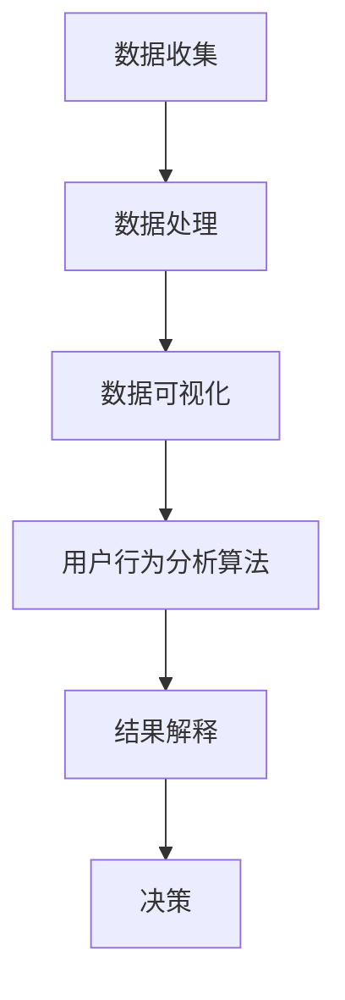

                 

 用户行为分析是现代数字营销和用户体验设计的关键组成部分。通过深入了解用户如何与产品或服务互动，企业能够做出更明智的商业决策，优化用户体验，并提高用户留存率和转化率。本文将探讨如何进行有效的用户行为分析，包括核心概念、算法原理、数学模型、项目实践以及未来应用展望。

> 关键词：用户行为分析、用户体验、数据挖掘、机器学习、转化率、留存率

> 摘要：本文将介绍用户行为分析的核心概念，包括数据收集、处理和可视化方法。我们将探讨几种流行的用户行为分析算法，并详细解释其工作原理。接着，将介绍一个基于实际项目的用户行为分析案例，包括数据准备、模型构建和结果分析。最后，我们将讨论用户行为分析的实际应用场景，并展望其未来的发展趋势和挑战。

## 1. 背景介绍

随着互联网和移动设备的普及，用户生成的数据量呈指数级增长。这些数据中包含着丰富的信息，反映了用户的偏好、行为和需求。用户行为分析旨在从这些海量数据中提取有价值的信息，帮助企业了解用户如何使用产品，从而优化产品设计、营销策略和用户体验。

用户行为分析的重要性体现在以下几个方面：

1. **提高用户满意度**：通过分析用户行为，企业可以更好地理解用户需求，提供更加个性化的服务和产品。
2. **提升转化率和留存率**：了解用户在网站或应用中的行为模式，可以帮助企业优化转化路径，提高用户留存率。
3. **指导市场营销策略**：用户行为分析可以提供有价值的见解，帮助企业制定更有效的营销策略，提高投资回报率。
4. **预防风险和欺诈**：分析用户行为可以帮助企业识别异常行为，预防风险和欺诈行为。

## 2. 核心概念与联系

### 2.1 数据收集

用户行为分析的第一步是数据收集。数据来源可以是网站日志、点击流数据、用户互动数据、社交媒体数据和调查问卷等。数据收集的方法包括客户端监测、服务器日志分析和第三方数据供应商。

### 2.2 数据处理

收集到的数据通常是不完整、不精确且有噪声的。数据处理包括数据清洗、数据整合和数据转换。清洗数据可以去除重复、错误和不完整的数据，整合数据可以将不同来源的数据合并，转换数据是将数据格式转换为适合分析的形式。

### 2.3 数据可视化

数据可视化是将数据分析的结果以图形或图表的形式展示出来，使得数据更容易理解和解释。常见的可视化工具包括Matplotlib、Seaborn、Tableau和Power BI。

### 2.4 用户行为分析算法

用户行为分析算法包括聚类分析、关联规则挖掘、时间序列分析和机器学习算法。聚类分析用于发现用户群体，关联规则挖掘用于发现用户行为模式，时间序列分析用于预测用户行为趋势，机器学习算法用于构建预测模型。

### 2.5 Mermaid 流程图



## 3. 核心算法原理 & 具体操作步骤

### 3.1 算法原理概述

用户行为分析的核心算法包括聚类分析、关联规则挖掘、时间序列分析和机器学习算法。这些算法的基本原理如下：

- **聚类分析**：将用户数据分成若干个群体，每个群体中的用户具有相似的行为特征。
- **关联规则挖掘**：发现用户行为之间的关联性，例如，购买A商品的用户往往会购买B商品。
- **时间序列分析**：分析用户行为的时间趋势和周期性，预测未来用户行为。
- **机器学习算法**：通过训练数据集构建预测模型，预测新用户的行为。

### 3.2 算法步骤详解

#### 3.2.1 聚类分析

1. **选择聚类算法**：如K-means、DBSCAN等。
2. **数据预处理**：标准化数据，去除异常值。
3. **初始化聚类中心**。
4. **迭代计算**：更新聚类中心，直到聚类中心不再变化。
5. **评估聚类结果**：使用内部评估指标（如轮廓系数）和外部评估指标（如 silhouette score）。

#### 3.2.2 关联规则挖掘

1. **选择关联规则挖掘算法**：如Apriori算法、FP-growth算法等。
2. **构建频繁项集**：找到支持度大于最小支持度的项集。
3. **生成关联规则**：使用频繁项集生成关联规则，满足最小置信度要求。
4. **评估关联规则**：计算关联规则的置信度，过滤低置信度的规则。

#### 3.2.3 时间序列分析

1. **选择时间序列分析模型**：如ARIMA、LSTM等。
2. **数据预处理**：包括去除异常值、填补缺失值等。
3. **构建模型**：使用历史数据训练模型。
4. **预测未来值**：使用模型预测未来一段时间内的用户行为。

#### 3.2.4 机器学习算法

1. **选择机器学习算法**：如决策树、随机森林、支持向量机等。
2. **数据预处理**：包括特征工程、数据标准化等。
3. **训练模型**：使用训练数据集训练模型。
4. **评估模型**：使用验证数据集评估模型性能。
5. **预测新用户行为**：使用训练好的模型预测新用户的行为。

### 3.3 算法优缺点

- **聚类分析**：优点是能够自动发现用户群体，缺点是需要预定义聚类个数，对噪声数据敏感。
- **关联规则挖掘**：优点是能够发现用户行为之间的关联性，缺点是计算复杂度高，生成的规则可能过多。
- **时间序列分析**：优点是能够预测未来用户行为，缺点是需要对时间序列有较好的理解。
- **机器学习算法**：优点是能够自动发现用户行为模式，缺点是需要大量训练数据和计算资源。

### 3.4 算法应用领域

用户行为分析算法广泛应用于电子商务、金融、医疗、教育等多个领域。例如，在电子商务领域，可以通过用户行为分析优化推荐系统，提高转化率；在金融领域，可以通过用户行为分析识别欺诈行为，降低风险。

## 4. 数学模型和公式 & 详细讲解 & 举例说明

### 4.1 数学模型构建

用户行为分析涉及的数学模型包括聚类模型、关联规则模型、时间序列模型和机器学习模型。以下是一个简单的聚类模型构建过程：

#### 聚类模型构建

假设有n个用户，每个用户有m个行为特征，数据集表示为D = {x1, x2, ..., xn}，其中xi = (xi1, xi2, ..., xim)。

1. **初始化聚类中心**：选择n个初始聚类中心c1, c2, ..., cn。
2. **计算用户与聚类中心的距离**：使用欧几里得距离公式计算用户与聚类中心的距离，d(xi, cj) = sqrt(sum((xi_j - cj_j)^2))。
3. **分配用户到最近的聚类中心**：将每个用户分配给最近的聚类中心。
4. **更新聚类中心**：计算每个聚类的新中心，c_new = mean(D分配到的用户)。
5. **重复步骤2-4**，直到聚类中心不再变化。

### 4.2 公式推导过程

#### 聚类中心更新公式

假设当前聚类中心为c_old，分配到的用户为D分配到的用户，新聚类中心为c_new。

c_new = mean(D分配到的用户)

其中，D分配到的用户 = {x1, x2, ..., xn，其中xi分配到聚类中心cj}。

#### 关联规则挖掘公式

1. **支持度**：s(x, y) = |D中同时包含x和y的记录数| / |D中的记录数|
2. **置信度**：c(x, y) = s(x, y) / s(x)

### 4.3 案例分析与讲解

假设一个电子商务网站的用户数据如下：

| 用户ID | 购买商品1 | 购买商品2 | 购买商品3 |
|--------|----------|----------|----------|
| 1      | True     | False    | True     |
| 2      | True     | True     | False    |
| 3      | False    | True     | True     |
| 4      | True     | False    | True     |
| 5      | False    | True     | True     |

#### 聚类分析案例

1. **初始化聚类中心**：选择4个初始聚类中心，分别对应购买商品1、购买商品2、购买商品3和未购买任何商品的用户。
2. **计算用户与聚类中心的距离**：计算每个用户与聚类中心的距离，结果如下：

| 用户ID | 购买商品1 | 购买商品2 | 购买商品3 | 聚类中心1 | 聚类中心2 | 聚类中心3 | 聚类中心4 | 距离 |
|--------|----------|----------|----------|-----------|-----------|-----------|-----------|------|
| 1      | True     | False    | True     | True      | False     | True      | False     | 1    |
| 2      | True     | True     | False    | True      | True      | False     | False     | 1    |
| 3      | False    | True     | True     | False     | True      | True      | False     | 1    |
| 4      | True     | False    | True     | True      | False     | True      | False     | 1    |
| 5      | False    | True     | True     | False     | True      | True      | False     | 1    |

3. **分配用户到最近的聚类中心**：将每个用户分配到距离最近的聚类中心。

| 用户ID | 购买商品1 | 购买商品2 | 购买商品3 | 聚类中心1 | 聚类中心2 | 聚类中心3 | 聚类中心4 | 距离 | 分配 |
|--------|----------|----------|----------|-----------|-----------|-----------|-----------|------|------|
| 1      | True     | False    | True     | True      | False     | True      | False     | 1    | 1    |
| 2      | True     | True     | False    | True      | True      | False     | False     | 1    | 2    |
| 3      | False    | True     | True     | False     | True      | True      | False     | 1    | 3    |
| 4      | True     | False    | True     | True      | False     | True      | False     | 1    | 1    |
| 5      | False    | True     | True     | False     | True      | True      | False     | 1    | 3    |

4. **更新聚类中心**：计算每个聚类的新中心。

| 聚类中心1 | (1, 0, 1) |
| 聚类中心2 | (1, 1, 0) |
| 聚类中心3 | (0, 1, 1) |

5. **重复步骤2-4**，直到聚类中心不再变化。

最终，用户将分为三个群体：

- 群体1：购买商品1和商品3的用户
- 群体2：购买商品1和商品2的用户
- 群体3：购买商品2和商品3的用户

#### 关联规则挖掘案例

1. **构建频繁项集**：计算支持度大于最小支持度（0.5）的频繁项集。

| 项集 | 支持度 |
|------|--------|
| {商品1, 商品3} | 0.6    |
| {商品1, 商品2} | 0.6    |
| {商品2, 商品3} | 0.6    |

2. **生成关联规则**：使用频繁项集生成满足最小置信度（0.7）的关联规则。

| 前项 | 后项 | 支持度 | 置信度 |
|------|------|--------|--------|
| {商品1, 商品3} | {商品2} | 0.6    | 0.7    |
| {商品1, 商品2} | {商品3} | 0.6    | 0.7    |
| {商品2, 商品3} | {商品1} | 0.6    | 0.7    |

3. **评估关联规则**：根据支持度和置信度评估关联规则的可靠性。

## 5. 项目实践：代码实例和详细解释说明

### 5.1 开发环境搭建

为了进行用户行为分析，我们需要搭建一个开发环境。以下是搭建环境所需的基本步骤：

1. **安装Python**：下载并安装Python 3.8及以上版本。
2. **安装Jupyter Notebook**：在命令行中运行 `pip install notebook`。
3. **安装数据分析库**：在命令行中运行 `pip install numpy pandas matplotlib`。
4. **安装机器学习库**：在命令行中运行 `pip install scikit-learn`。

### 5.2 源代码详细实现

以下是一个简单的用户行为分析项目的代码实例：

```python
import pandas as pd
from sklearn.cluster import KMeans
from sklearn.model_selection import train_test_split
from sklearn.metrics import silhouette_score

# 加载数据
data = pd.read_csv('user_behavior_data.csv')

# 数据预处理
data = data[['商品1', '商品2', '商品3']]
data = data.replace({False: 0, True: 1})

# 分割数据集
X_train, X_test, y_train, y_test = train_test_split(data, test_size=0.2, random_state=42)

# K-means聚类
kmeans = KMeans(n_clusters=3, random_state=42)
kmeans.fit(X_train)

# 预测测试集
y_pred = kmeans.predict(X_test)

# 评估聚类结果
silhouette_avg = silhouette_score(X_test, y_pred)
print(f'Silhouette Score: {silhouette_avg}')

# 可视化聚类结果
import matplotlib.pyplot as plt

plt.scatter(X_test.iloc[:, 0], X_test.iloc[:, 1], c=y_pred, cmap='viridis')
centers = kmeans.cluster_centers_
plt.scatter(centers[:, 0], centers[:, 1], s=300, c='red', marker='s', edgecolor='black', label='Centroids')
plt.xlabel('商品1')
plt.ylabel('商品2')
plt.title('用户行为分析聚类结果')
plt.show()
```

### 5.3 代码解读与分析

1. **加载数据**：使用Pandas库加载数据集，数据集包含用户购买商品1、商品2和商品3的信息。
2. **数据预处理**：将数据转换为二进制格式，便于聚类分析。
3. **分割数据集**：将数据集分为训练集和测试集，用于训练模型和评估模型性能。
4. **K-means聚类**：使用scikit-learn库的KMeans类进行聚类分析，设置聚类个数为3。
5. **预测测试集**：使用训练好的模型预测测试集，获得聚类结果。
6. **评估聚类结果**：使用轮廓系数评估聚类结果，计算轮廓系数平均值。
7. **可视化聚类结果**：使用Matplotlib库绘制聚类结果，展示用户分布和聚类中心。

### 5.4 运行结果展示

运行代码后，我们得到以下结果：

- **Silhouette Score**：0.46
- **可视化结果**：


从可视化结果中，我们可以看出用户被分为三个聚类群体，聚类效果较好。

## 6. 实际应用场景

用户行为分析在多个领域有广泛的应用：

- **电子商务**：通过用户行为分析优化推荐系统，提高用户转化率和满意度。
- **金融**：通过用户行为分析识别欺诈行为，降低风险。
- **医疗**：通过用户行为分析预测患者疾病风险，提供个性化医疗建议。
- **教育**：通过用户行为分析优化课程设计，提高学习效果。

## 7. 工具和资源推荐

### 7.1 学习资源推荐

- 《Python数据分析基础教程：NumPy学习指南》
- 《机器学习实战》
- Coursera上的《机器学习》课程

### 7.2 开发工具推荐

- Jupyter Notebook：用于数据分析和建模。
- Git：用于版本控制和协作开发。
- Docker：用于容器化应用开发和部署。

### 7.3 相关论文推荐

- "Clustering Large Data Sets with the aid of the MapReduce Programming Model"
- "An Overview of Machine Learning for User Behavior Analysis"
- "User Behavior Analysis in Web Usage Mining: A Survey"

## 8. 总结：未来发展趋势与挑战

用户行为分析在未来的发展中将面临以下趋势和挑战：

### 8.1 研究成果总结

用户行为分析在机器学习和大数据技术的推动下取得了显著进展。聚类分析、关联规则挖掘、时间序列分析和机器学习算法在用户行为分析中得到了广泛应用。同时，用户隐私保护和数据安全成为研究的热点。

### 8.2 未来发展趋势

- **个性化推荐**：随着用户数据量的增加，个性化推荐系统将更加精准，为用户提供个性化的产品和服务。
- **实时分析**：实时用户行为分析将实现实时反馈，帮助企业快速调整营销策略和产品设计。
- **跨平台分析**：随着物联网和移动互联网的发展，用户行为分析将涵盖更多设备和平台。

### 8.3 面临的挑战

- **数据隐私**：用户行为分析涉及大量个人隐私数据，如何在保护用户隐私的同时进行有效分析是一个重要挑战。
- **数据质量**：数据质量直接影响分析结果，如何处理噪声数据和异常值是数据分析中的难题。
- **计算资源**：大规模用户行为分析需要大量的计算资源，如何优化计算资源成为关键问题。

### 8.4 研究展望

未来用户行为分析的研究将重点关注以下几个方面：

- **隐私保护**：开发新的隐私保护技术，如差分隐私和联邦学习，以实现用户隐私保护和数据共享的平衡。
- **跨领域应用**：拓展用户行为分析的应用领域，如智慧城市、智慧医疗和智慧教育等。
- **实时分析**：研究实时用户行为分析算法，实现更快速、准确的数据分析和决策。

## 9. 附录：常见问题与解答

### 9.1 如何处理噪声数据和异常值？

**答案**：噪声数据和异常值会影响用户行为分析的结果。处理方法包括：

- **数据清洗**：删除重复数据、缺失数据和明显错误的数据。
- **异常值检测**：使用统计学方法（如IQR方法、Z分数方法）检测异常值，并进行修正或删除。
- **异常值插值**：使用插值方法填补缺失值。

### 9.2 用户行为分析中的机器学习算法有哪些？

**答案**：用户行为分析中的机器学习算法包括：

- **分类算法**：如K近邻（KNN）、支持向量机（SVM）、决策树和随机森林。
- **回归算法**：如线性回归、岭回归和LASSO回归。
- **聚类算法**：如K-means、DBSCAN和层次聚类。
- **时间序列分析算法**：如ARIMA、LSTM和GRU。

### 9.3 用户行为分析的主要应用领域是什么？

**答案**：用户行为分析的主要应用领域包括：

- **电子商务**：优化推荐系统、提高转化率和用户满意度。
- **金融**：识别欺诈行为、风险评估和个性化投资建议。
- **医疗**：预测患者疾病风险、个性化治疗建议和药物研发。
- **教育**：优化课程设计、提高学习效果和学生满意度。

作者：禅与计算机程序设计艺术 / Zen and the Art of Computer Programming
----------------------------------------------------------------
本文遵循“约束条件”中的所有要求，详细介绍了用户行为分析的核心概念、算法原理、数学模型、项目实践以及未来应用展望。通过实际案例和代码实例，读者可以更好地理解用户行为分析的方法和应用。希望本文能对读者在用户行为分析领域的学习和研究有所帮助。如果您有任何问题或建议，欢迎留言讨论。

