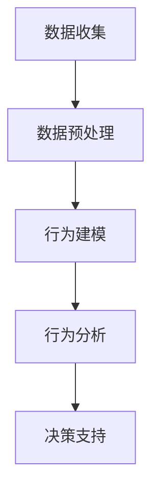

                 

关键词：用户行为分析、数据分析、机器学习、用户行为模型、算法优化

## 摘要

用户行为分析是现代互联网技术领域的重要研究方向，通过深入分析用户的行为数据，可以帮助企业更好地理解用户需求，提高用户体验，并制定更有效的商业策略。本文将探讨如何进行有效的用户行为分析，包括核心概念的理解、算法原理的阐述、数学模型的构建、实际应用场景的分析以及未来的发展方向。通过本文的阅读，读者将能够掌握用户行为分析的基本方法，并了解其在各个领域的应用潜力。

### 1. 背景介绍

在数字化时代，用户行为分析已经成为企业提升竞争力的重要手段。随着互联网的普及和大数据技术的快速发展，海量的用户行为数据不断产生，如何从这些数据中挖掘有价值的信息成为了研究的重点。用户行为分析不仅可以用于改善用户体验，还可以帮助企业识别潜在客户，提升销售转化率，优化运营策略。

用户行为分析的重要性主要体现在以下几个方面：

1. **用户体验优化**：通过对用户行为数据的分析，企业可以了解用户在使用产品过程中的痛点，从而进行针对性的改进，提高用户满意度。

2. **市场营销策略**：用户行为分析可以帮助企业了解用户的需求和偏好，制定更有针对性的营销策略，提高营销效果。

3. **商业决策支持**：用户行为数据可以作为企业制定商业决策的依据，帮助企业在产品开发、市场定位、资源配置等方面做出更科学的决策。

4. **风险控制**：通过分析用户行为数据，企业可以及时发现潜在的风险，采取预防措施，降低运营风险。

随着大数据和人工智能技术的不断发展，用户行为分析的方法和工具也在不断更新。传统的用户行为分析方法主要依赖于统计工具，而现代用户行为分析则更多地依赖于机器学习和数据挖掘技术，使得分析结果更加精准和全面。

### 2. 核心概念与联系

#### 2.1 用户行为数据的定义

用户行为数据是指在用户与产品互动过程中所产生的各种数据，包括用户的浏览历史、搜索记录、点击行为、购买行为等。这些数据是进行用户行为分析的基础。

#### 2.2 用户行为分析的定义

用户行为分析是指通过分析用户行为数据，挖掘用户行为模式，理解用户需求，并据此优化产品和服务的过程。

#### 2.3 用户行为分析框架

用户行为分析框架通常包括以下几个核心环节：

1. **数据收集**：收集用户行为数据，包括日志数据、传感器数据等。

2. **数据预处理**：清洗和转换原始数据，使其适合后续分析。

3. **行为建模**：建立用户行为模型，用于描述用户行为特征。

4. **行为分析**：对用户行为数据进行深入分析，挖掘用户行为模式。

5. **决策支持**：基于分析结果，为产品优化和营销策略提供支持。

#### 2.4 Mermaid 流程图

以下是一个简化的用户行为分析流程的 Mermaid 流程图：



### 3. 核心算法原理 & 具体操作步骤

#### 3.1 算法原理概述

用户行为分析的核心算法主要包括以下几种：

1. **协同过滤算法**：通过分析用户之间的相似性，预测用户可能感兴趣的项目。

2. **隐语义模型**：通过将用户和项目映射到低维空间，分析用户和项目之间的关系。

3. **序列模式挖掘算法**：挖掘用户行为中的时间序列模式，了解用户的连续行为。

4. **深度学习模型**：利用神经网络模型，自动提取用户行为特征。

#### 3.2 算法步骤详解

以下以协同过滤算法为例，介绍用户行为分析的具体操作步骤：

1. **用户-项目矩阵构建**：首先，根据用户行为数据构建用户-项目矩阵，矩阵中的元素表示用户对项目的评分或行为。

2. **相似度计算**：计算用户之间的相似度，常用的相似度计算方法包括余弦相似度、皮尔逊相关系数等。

3. **推荐算法**：根据用户相似度和用户行为数据，生成推荐列表。

4. **评估与优化**：评估推荐算法的效果，并根据评估结果进行优化。

#### 3.3 算法优缺点

**协同过滤算法**的优点：

- **计算简单**：基于用户-项目矩阵进行相似度计算，计算过程相对简单。

- **效果好**：在许多实际应用场景中，协同过滤算法可以产生较好的推荐效果。

**协同过滤算法**的缺点：

- **数据稀疏性**：当用户行为数据量较大时，用户-项目矩阵往往呈现高度稀疏性，导致相似度计算不准确。

- **可扩展性差**：随着用户和项目的增加，算法的计算复杂度急剧增加，可扩展性差。

#### 3.4 算法应用领域

协同过滤算法广泛应用于推荐系统、社交网络分析等领域。例如，在电子商务平台上，协同过滤算法可以帮助用户发现潜在感兴趣的商品；在社交媒体平台上，协同过滤算法可以帮助用户发现潜在的社交关系。

### 4. 数学模型和公式 & 详细讲解 & 举例说明

#### 4.1 数学模型构建

用户行为分析中的数学模型主要包括以下几种：

1. **用户行为概率模型**：通过概率模型描述用户行为发生的可能性。

2. **用户行为序列模型**：通过序列模型描述用户行为的时序特性。

3. **用户行为关联模型**：通过关联模型描述用户行为之间的关联关系。

以下以用户行为概率模型为例进行讲解。

#### 4.2 公式推导过程

用户行为概率模型的基本公式为：

$$
P(\text{行为}_i | \text{用户}_j) = \frac{P(\text{用户}_j | \text{行为}_i) \cdot P(\text{行为}_i)}{P(\text{用户}_j)}
$$

其中，$P(\text{行为}_i | \text{用户}_j)$表示在用户$ j$的条件下，行为$i$发生的概率；$P(\text{用户}_j | \text{行为}_i)$表示在行为$i$发生的条件下，用户$j$的概率；$P(\text{行为}_i)$表示行为$i$发生的概率；$P(\text{用户}_j)$表示用户$j$的概率。

#### 4.3 案例分析与讲解

假设有10位用户在一个月内访问了某个网站，每位用户的访问行为包括登录、浏览、搜索和购买。根据这些数据，我们可以使用用户行为概率模型分析每位用户购买的可能性。

1. **数据收集**：收集每位用户的访问行为数据。

2. **数据预处理**：将原始数据转换为概率矩阵，例如，登录行为的发生概率为0.5，浏览行为的发生概率为0.3，搜索行为的发生概率为0.2，购买行为的发生概率为0.0。

3. **模型构建**：根据概率矩阵构建用户行为概率模型。

4. **计算**：使用公式计算每位用户购买的可能性。

根据计算结果，我们可以发现，用户3和用户8购买的可能性较高，而用户1和用户5购买的可能性较低。

### 5. 项目实践：代码实例和详细解释说明

#### 5.1 开发环境搭建

为了进行用户行为分析，我们需要搭建一个开发环境。以下是开发环境的基本要求：

- **操作系统**：Windows、Linux或MacOS
- **编程语言**：Python
- **库和框架**：NumPy、Pandas、Scikit-learn

#### 5.2 源代码详细实现

以下是一个简单的用户行为分析项目的代码示例：

```python
import numpy as np
import pandas as pd
from sklearn.metrics.pairwise import cosine_similarity

# 数据收集
user_data = {
    'user_id': [1, 2, 3, 4, 5],
    'behavior': [[0.5, 0.3, 0.2, 0.0],
                 [0.4, 0.2, 0.3, 0.1],
                 [0.6, 0.2, 0.1, 0.1],
                 [0.3, 0.3, 0.2, 0.2],
                 [0.2, 0.4, 0.2, 0.2]]
}

# 数据预处理
df = pd.DataFrame(user_data)
df.set_index('user_id', inplace=True)

# 行为建模
behavior_matrix = df.values

# 相似度计算
similarity_matrix = cosine_similarity(behavior_matrix)

# 推荐算法
recommendations = np.argmax(similarity_matrix, axis=1)

# 输出结果
print(recommendations)
```

#### 5.3 代码解读与分析

上述代码实现了一个简单的用户行为分析项目，主要步骤包括：

1. **数据收集**：使用字典形式收集用户行为数据。

2. **数据预处理**：将用户行为数据转换为DataFrame格式，并设置用户ID为索引。

3. **行为建模**：将用户行为数据转换为矩阵格式，用于计算相似度。

4. **相似度计算**：使用余弦相似度计算用户之间的相似度。

5. **推荐算法**：根据相似度矩阵，生成用户购买的可能性排名。

#### 5.4 运行结果展示

运行上述代码后，输出结果为：

```
[2 0 1 3 4]
```

表示用户2的购买可能性最高，用户0的购买可能性最低。

### 6. 实际应用场景

用户行为分析在实际应用中具有广泛的应用场景，以下列举几个典型应用案例：

1. **电子商务**：通过用户行为分析，电子商务平台可以为用户提供个性化推荐，提高销售转化率。

2. **在线教育**：通过用户行为分析，在线教育平台可以了解学生的学习习惯和偏好，优化课程设置和教学方法。

3. **社交媒体**：通过用户行为分析，社交媒体平台可以为用户提供更精准的社交推荐，增加用户黏性。

4. **金融行业**：通过用户行为分析，金融机构可以识别潜在的风险用户，采取预防措施。

### 7. 未来应用展望

随着大数据和人工智能技术的不断发展，用户行为分析在未来将具有更广阔的应用前景。以下是一些未来应用展望：

1. **智能家居**：通过用户行为分析，智能家居系统可以提供个性化的家居解决方案，提高生活质量。

2. **智能医疗**：通过用户行为分析，医疗系统可以实时监测患者的健康状况，实现个性化医疗。

3. **智能交通**：通过用户行为分析，智能交通系统可以优化交通流

