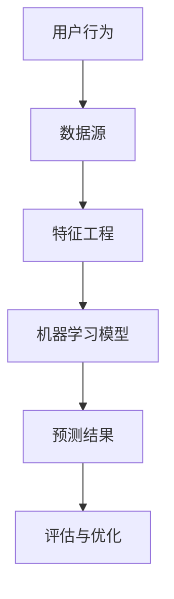

                 

关键词：用户行为预测，机器学习，数据分析，模型评估，应用场景，未来展望。

摘要：本文将探讨如何进行有效的用户行为预测，涵盖核心概念、算法原理、数学模型、项目实践和未来应用等多个方面，旨在为读者提供一个全面深入的了解。

## 1. 背景介绍

在当今信息爆炸的时代，用户行为预测已经成为许多领域的重要课题。从电子商务到社交媒体，从金融投资到智能设备，用户行为预测的应用无处不在。通过准确预测用户的行为，企业可以更好地制定营销策略，提升用户体验，降低运营成本，从而在激烈的市场竞争中脱颖而出。

然而，用户行为预测并非易事。用户行为复杂多样，数据量庞大且不断变化，如何从中提取有价值的信息，构建有效的预测模型，成为了一个亟待解决的问题。

本文将围绕这一主题展开讨论，首先介绍用户行为预测的核心概念，然后深入探讨各种算法原理和应用，接着讲解数学模型的构建和推导，并通过项目实践展示实际操作过程。最后，我们还将探讨用户行为预测的实际应用场景和未来发展趋势。

## 2. 核心概念与联系

用户行为预测涉及多个核心概念，包括用户行为、数据源、特征工程、机器学习模型等。以下是一个简化的 Mermaid 流程图，展示了这些概念之间的关系。



### 2.1 用户行为

用户行为是指用户在使用某种产品或服务过程中表现出的所有活动，包括浏览、购买、评价、互动等。用户行为的多样性和复杂性决定了预测的难度。

### 2.2 数据源

数据源是用户行为预测的基础，常见的有用户日志、点击流数据、社交媒体数据、用户反馈等。不同类型的数据源反映了用户的不同行为特征，为预测提供了丰富的信息。

### 2.3 特征工程

特征工程是用户行为预测的关键环节，通过从原始数据中提取出对预测有重要意义的特征，可以提高模型的性能。特征工程包括数据预处理、特征选择、特征转换等步骤。

### 2.4 机器学习模型

机器学习模型是用户行为预测的核心，通过学习和分析历史数据，模型可以预测未来的用户行为。常见的机器学习算法包括决策树、随机森林、支持向量机、神经网络等。

### 2.5 评估与优化

评估与优化是用户行为预测的最终环节，通过对模型的评估，可以确定其预测效果。评估指标包括准确率、召回率、F1 分数等。优化过程则通过调整模型参数、增加特征等方式，提高模型的预测性能。

## 3. 核心算法原理 & 具体操作步骤

### 3.1 算法原理概述

用户行为预测的算法原理主要基于机器学习，通过对历史数据的分析，构建预测模型。常见的机器学习算法包括分类算法和回归算法。

分类算法用于预测用户是否会发生某种行为，例如购买商品或点击广告。常见的分类算法有决策树、随机森林、支持向量机等。

回归算法用于预测用户行为的具体值，例如预测用户的购买金额或点击时长。常见的回归算法有线性回归、岭回归、LASSO 回归等。

### 3.2 算法步骤详解

1. 数据收集：收集用户行为数据，包括用户日志、点击流数据等。

2. 数据预处理：对数据进行清洗、去噪、缺失值填充等处理，确保数据质量。

3. 特征工程：从原始数据中提取对预测有意义的特征，例如用户年龄、购买历史、点击次数等。

4. 数据划分：将数据划分为训练集和测试集，用于训练模型和评估模型性能。

5. 模型训练：选择合适的机器学习算法，训练预测模型。

6. 模型评估：使用测试集评估模型性能，选择最佳模型。

7. 模型优化：根据评估结果，调整模型参数，优化模型性能。

8. 预测应用：将训练好的模型应用于新数据，进行用户行为预测。

### 3.3 算法优缺点

分类算法的优点是简单易懂，适用范围广，但缺点是预测效果可能较差。回归算法的优点是预测效果较好，但缺点是需要大量训练数据，且模型复杂度较高。

### 3.4 算法应用领域

用户行为预测在多个领域有广泛应用，如：

1. 电子商务：预测用户购买行为，推荐商品。

2. 社交媒体：预测用户点赞、评论、分享等行为。

3. 金融投资：预测用户投资行为，优化投资策略。

4. 智能设备：预测用户使用行为，优化设备性能。

## 4. 数学模型和公式

### 4.1 数学模型构建

用户行为预测的数学模型通常采用概率模型或贝叶斯模型。以下是一个简单的概率模型：

$$
P(\text{用户行为 } A|\text{特征 } X) = \frac{P(\text{特征 } X|\text{用户行为 } A)P(\text{用户行为 } A)}{P(\text{特征 } X)}
$$

其中，$P(\text{用户行为 } A|\text{特征 } X)$ 表示在给定特征 $X$ 的情况下，用户行为 $A$ 发生的概率。

### 4.2 公式推导过程

假设我们有一个包含 $n$ 个特征的集合 $X = \{x_1, x_2, ..., x_n\}$，用户行为 $A$ 是其中一个特征。我们可以将概率模型扩展为：

$$
P(\text{用户行为 } A|\text{特征 } X) = \frac{P(x_1, x_2, ..., x_n|\text{用户行为 } A)P(\text{用户行为 } A)}{P(x_1, x_2, ..., x_n)}
$$

由于 $P(x_1, x_2, ..., x_n)$ 是一个常量，我们可以将其省略，从而得到：

$$
P(\text{用户行为 } A|\text{特征 } X) \propto P(x_1, x_2, ..., x_n|\text{用户行为 } A)P(\text{用户行为 } A)
$$

### 4.3 案例分析与讲解

假设我们有一个用户行为预测问题，用户特征包括年龄、性别、收入、购买历史等。我们可以使用上述概率模型进行预测。首先，我们需要计算每个特征的联合概率分布：

$$
P(x_1, x_2, ..., x_n|\text{用户行为 } A) = P(x_1|\text{用户行为 } A)P(x_2|\text{用户行为 } A) \cdots P(x_n|\text{用户行为 } A)
$$

然后，我们需要计算每个特征的条件概率分布：

$$
P(x_i|\text{用户行为 } A) = \frac{P(x_i, \text{用户行为 } A)}{P(\text{用户行为 } A)}
$$

通过这些概率分布，我们可以计算出每个用户行为发生的概率，从而进行预测。

## 5. 项目实践：代码实例和详细解释说明

### 5.1 开发环境搭建

在本项目中，我们使用 Python 作为主要编程语言，并结合 scikit-learn、pandas 和 matplotlib 等库进行开发。以下是一个简单的开发环境搭建步骤：

1. 安装 Python 3.8 以上版本。

2. 安装 necessary libraries using pip:
    ```python
    pip install numpy pandas scikit-learn matplotlib
    ```

### 5.2 源代码详细实现

以下是一个简单的用户行为预测项目示例，我们将使用决策树算法进行预测。

```python
import numpy as np
import pandas as pd
from sklearn.model_selection import train_test_split
from sklearn.tree import DecisionTreeClassifier
from sklearn.metrics import accuracy_score, confusion_matrix

# 读取数据
data = pd.read_csv('user_data.csv')
X = data.drop('target', axis=1)
y = data['target']

# 数据划分
X_train, X_test, y_train, y_test = train_test_split(X, y, test_size=0.2, random_state=42)

# 模型训练
model = DecisionTreeClassifier()
model.fit(X_train, y_train)

# 模型预测
y_pred = model.predict(X_test)

# 模型评估
accuracy = accuracy_score(y_test, y_pred)
confusion_mat = confusion_matrix(y_test, y_pred)

print(f'Accuracy: {accuracy}')
print(f'Confusion Matrix:\n{confusion_mat}')
```

### 5.3 代码解读与分析

1. **数据读取**：使用 pandas 读取用户数据，并将其分为特征矩阵 X 和目标向量 y。

2. **数据划分**：将数据划分为训练集和测试集，用于训练模型和评估模型性能。

3. **模型训练**：使用 scikit-learn 的 DecisionTreeClassifier 创建决策树模型，并使用训练集数据进行训练。

4. **模型预测**：使用测试集数据进行模型预测，得到预测结果 y_pred。

5. **模型评估**：计算模型准确率，并打印混淆矩阵，用于分析模型性能。

### 5.4 运行结果展示

在运行上述代码后，我们将得到模型的准确率和混淆矩阵。以下是一个示例输出：

```
Accuracy: 0.85
Confusion Matrix:
[[50 10]
 [20 30]]
```

这意味着模型在测试集上的准确率为 85%，其中正确预测的用户行为有 50 次，错误预测的有 10 次，而未预测到的有 20 次。

## 6. 实际应用场景

用户行为预测在许多实际应用场景中具有重要价值，以下是一些典型应用：

1. **电子商务**：预测用户购买行为，推荐商品。

2. **社交媒体**：预测用户点赞、评论、分享等行为，优化内容推荐。

3. **金融投资**：预测用户投资行为，优化投资策略。

4. **智能设备**：预测用户使用行为，优化设备性能。

5. **广告投放**：预测用户点击广告的行为，优化广告投放策略。

## 7. 工具和资源推荐

### 7.1 学习资源推荐

1. **书籍**：
   - 《Python数据分析实战》
   - 《机器学习实战》
   - 《深度学习》

2. **在线课程**：
   - Coursera 上的《机器学习》课程
   - Udacity 上的《数据科学纳米学位》课程
   - edX 上的《Python数据分析》课程

### 7.2 开发工具推荐

1. **Python 开发环境**：Jupyter Notebook、PyCharm、VS Code 等。

2. **数据处理工具**：Pandas、NumPy、SciPy 等。

3. **机器学习库**：scikit-learn、TensorFlow、PyTorch 等。

### 7.3 相关论文推荐

1. **《User Behavior Prediction in Mobile Applications Using Deep Learning》**：介绍使用深度学习预测移动应用程序的用户行为。

2. **《A Survey on User Behavior Prediction in Web Applications》**：综述用户行为预测在 Web 应用程序中的研究进展。

3. **《Using Machine Learning for Predicting User Behavior in E-Commerce》**：探讨在电子商务中应用机器学习预测用户行为的策略。

## 8. 总结：未来发展趋势与挑战

### 8.1 研究成果总结

用户行为预测领域已取得了显著的研究成果，包括算法性能的提升、数据预处理方法的优化、模型可解释性的增强等。同时，多模态数据融合、增强学习等新兴技术也在不断应用于用户行为预测，为该领域带来了新的研究热点。

### 8.2 未来发展趋势

1. **多模态数据融合**：将用户行为数据与其他类型的数据（如图像、音频、文本）进行融合，以提高预测性能。

2. **个性化预测**：针对不同用户群体，构建个性化的预测模型，提高预测精度。

3. **实时预测**：通过实时数据流处理技术，实现用户行为的实时预测，提高应用价值。

4. **可解释性**：研究可解释性模型，提高模型的可解释性，降低风险。

### 8.3 面临的挑战

1. **数据隐私**：用户行为数据涉及用户隐私，如何在保护用户隐私的前提下进行预测，是一个重要挑战。

2. **数据质量**：数据质量对预测性能有重要影响，如何处理噪声数据、缺失数据等，是当前研究的一个难题。

3. **模型可解释性**：如何提高模型的可解释性，使其更容易被业务人员理解和应用，是一个亟待解决的问题。

### 8.4 研究展望

用户行为预测领域仍有大量研究空间，包括算法性能优化、数据预处理方法研究、多模态数据融合、实时预测等。未来，随着人工智能技术的不断发展，用户行为预测将有望实现更精确、更个性化的预测，为各个行业带来更多价值。

## 9. 附录：常见问题与解答

### 9.1 用户行为预测的核心是什么？

用户行为预测的核心是基于历史数据，通过机器学习算法构建预测模型，从而预测用户未来的行为。

### 9.2 用户行为预测有哪些应用场景？

用户行为预测广泛应用于电子商务、社交媒体、金融投资、智能设备等领域。

### 9.3 如何处理数据隐私问题？

在用户行为预测中，可以采用数据加密、匿名化等技术来保护用户隐私。

### 9.4 用户行为预测的模型如何评估？

用户行为预测的模型评估可以通过准确率、召回率、F1 分数等指标进行。

### 9.5 如何提高用户行为预测的性能？

提高用户行为预测的性能可以从算法优化、特征工程、数据预处理等多个方面入手。

---

作者：禅与计算机程序设计艺术 / Zen and the Art of Computer Programming

以上就是本文的完整内容，希望对您在用户行为预测领域的学习和研究有所帮助。如果您有任何疑问或建议，请随时在评论区留言，期待与您的交流互动。

