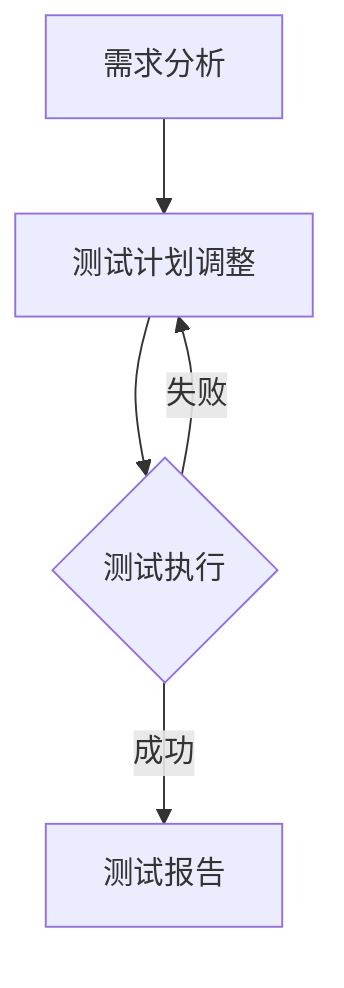

                 

关键词：知识付费、产品测试、用户体验、性能评估、缺陷管理、自动化测试

> 摘要：本文旨在探讨如何有效地进行知识付费产品的测试。通过分析产品测试的各个阶段，阐述核心概念、算法原理、数学模型及具体操作步骤，并结合实际案例，为开发者提供一套完整的知识付费产品测试方案。

## 1. 背景介绍

知识付费产品作为一种新兴的商业模式，近年来在互联网领域得到了广泛的应用。这类产品通过提供专业、系统的知识内容，满足用户在特定领域的知识需求。随着市场竞争的加剧，如何提高产品的质量和用户体验，成为知识付费产品开发者面临的重要挑战。

产品测试是确保知识付费产品质量和用户体验的关键环节。有效的测试不仅能发现潜在的问题，还能帮助开发者优化产品性能，提升用户满意度。然而，知识付费产品测试相较于传统软件测试具有其独特性，如内容丰富、互动性强等，这给测试工作带来了更大的挑战。

本文将围绕如何进行有效的知识付费产品测试展开讨论，包括测试的各个阶段、核心概念、算法原理、数学模型及具体操作步骤，并结合实际案例，为开发者提供一套实用的测试方案。

## 2. 核心概念与联系

在探讨知识付费产品测试之前，我们需要明确一些核心概念。以下是本文涉及的主要概念及它们之间的联系：

### 2.1 用户角色

用户角色是知识付费产品测试的关键要素。通过定义不同的用户角色，可以更好地模拟实际用户的使用场景，从而发现潜在的问题。用户角色包括：

- 初学者：对特定领域知识了解较少，希望通过产品学习相关知识。
- 进阶用户：具有一定专业知识，希望通过产品提升技能。
- 专家：在特定领域有丰富经验，对产品内容有较高要求。

### 2.2 测试类型

知识付费产品测试主要包括以下几种类型：

- 功能测试：验证产品功能是否符合设计要求。
- 性能测试：评估产品在不同负载条件下的响应速度和稳定性。
- 兼容性测试：确保产品在不同设备、浏览器和操作系统上正常运行。
- 安全测试：检测产品是否存在安全漏洞，保障用户数据安全。

### 2.3 测试流程

知识付费产品测试流程一般包括以下阶段：

- 需求分析：明确产品功能和性能要求。
- 测试计划：制定测试策略和测试用例。
- 测试执行：执行测试用例，发现并记录问题。
- 测试报告：总结测试结果，提出优化建议。

### 2.4 Mermaid 流程图

以下是知识付费产品测试的 Mermaid 流程图：



## 3. 核心算法原理 & 具体操作步骤

### 3.1 算法原理概述

知识付费产品测试的核心算法主要涉及以下几个方面：

- 自动化测试算法：通过编写测试脚本，自动化执行测试用例。
- 性能评估算法：基于用户行为数据，评估产品性能指标。
- 缺陷管理算法：对发现的缺陷进行分类、优先级排序和修复跟踪。

### 3.2 算法步骤详解

#### 3.2.1 自动化测试算法

1. 收集测试数据：通过用户行为日志、接口日志等渠道收集测试数据。
2. 设计测试用例：根据产品功能和性能要求，设计相应的测试用例。
3. 编写测试脚本：使用自动化测试工具（如Selenium、Appium等）编写测试脚本。
4. 执行测试脚本：自动化执行测试脚本，记录测试结果。
5. 分析测试结果：对测试结果进行分析，发现潜在的问题。

#### 3.2.2 性能评估算法

1. 数据收集：收集用户行为数据，如页面访问次数、用户停留时间等。
2. 数据预处理：对收集到的数据进行分析和清洗，去除异常值。
3. 性能指标计算：计算产品的性能指标，如响应时间、吞吐量等。
4. 结果分析：对性能指标进行分析，评估产品性能。

#### 3.2.3 缺陷管理算法

1. 缺陷分类：对发现的缺陷进行分类，如功能缺陷、性能缺陷等。
2. 缺陷优先级排序：根据缺陷的影响范围和严重程度，对缺陷进行优先级排序。
3. 缺陷修复跟踪：对缺陷的修复过程进行跟踪，确保问题得到及时解决。

### 3.3 算法优缺点

#### 自动化测试算法

优点：

- 提高测试效率：自动化测试可以快速执行大量测试用例，节省时间和人力成本。
- 减少人为错误：通过自动化测试，减少因人为操作不当导致的问题。

缺点：

- 需要编写测试脚本：编写测试脚本需要一定的技术基础，对开发人员要求较高。
- 无法覆盖所有测试场景：自动化测试无法完全替代手工测试，仍需结合手工测试进行。

#### 性能评估算法

优点：

- 客观评估产品性能：基于实际用户行为数据，对产品性能进行客观评估。
- 提高产品稳定性：通过性能评估，发现并解决潜在的性能问题，提高产品稳定性。

缺点：

- 数据收集难度较大：需要收集大量的用户行为数据，数据收集过程可能存在困难。
- 无法完全反映用户体验：性能评估只能从数据层面评估产品性能，无法完全反映用户体验。

#### 缺陷管理算法

优点：

- 提高问题解决效率：通过缺陷分类和优先级排序，提高问题解决的效率。
- 保证产品质量：通过缺陷管理，确保产品的质量和稳定性。

缺点：

- 需要大量人力投入：缺陷管理需要投入大量的人力进行缺陷分类、优先级排序和修复跟踪。
- 可能存在人为误差：缺陷管理过程中，可能存在因人为判断不当导致的问题。

### 3.4 算法应用领域

自动化测试算法广泛应用于各类软件测试，如Web应用、移动应用等。性能评估算法在互联网产品、金融系统等领域有广泛应用。缺陷管理算法在各类软件开发和维护过程中都有重要作用。

## 4. 数学模型和公式 & 详细讲解 & 举例说明

### 4.1 数学模型构建

在知识付费产品测试中，常用的数学模型包括用户行为模型、性能评估模型和缺陷管理模型。

#### 用户行为模型

用户行为模型主要基于马尔可夫决策过程（MDP）构建。假设用户在特定领域有多个学习目标，每个目标都有相应的学习概率和收益。通过构建用户行为模型，可以预测用户在不同学习目标之间的转移概率和收益。

#### 性能评估模型

性能评估模型主要基于队列理论构建。假设系统有多个用户同时访问，系统资源有限，通过构建性能评估模型，可以计算系统的平均响应时间、吞吐量等性能指标。

#### 缺陷管理模型

缺陷管理模型主要基于概率论和排队论构建。假设系统存在多个缺陷，每个缺陷的修复时间和成本不同，通过构建缺陷管理模型，可以计算最优的缺陷修复策略。

### 4.2 公式推导过程

#### 用户行为模型

设用户在领域A、B、C三个目标之间的转移概率分别为\( p_{AA} \)、\( p_{AB} \)、\( p_{AC} \)，收益分别为\( r_{AA} \)、\( r_{AB} \)、\( r_{AC} \)。根据马尔可夫决策过程，用户在下一时刻选择目标的最优策略为：

$$
\pi_{t+1} = \arg\max_{a \in A} \sum_{b \in A} p_{ab} r_{ab}
$$

#### 性能评估模型

设系统有n个用户同时访问，系统资源有限，假设每个用户的访问时间服从泊松分布，参数为\( \lambda \)。系统平均响应时间\( T \)和吞吐量\( R \)分别为：

$$
T = \frac{1}{R} = \frac{\lambda}{n \mu}
$$

$$
R = \frac{\lambda}{n \mu}
$$

其中，\( \mu \)为系统服务时间。

#### 缺陷管理模型

设系统有m个缺陷，每个缺陷的修复时间和成本分别为\( t_i \)和\( c_i \)，根据概率论和排队论，最优的缺陷修复策略为：

$$
\pi_{i} = \begin{cases}
1 & \text{if } t_i < t^* \\
0 & \text{otherwise}
\end{cases}
$$

其中，\( t^* \)为系统最优修复时间，计算公式为：

$$
t^* = \frac{1}{\sum_{i=1}^{m} \frac{c_i}{t_i}}
$$

### 4.3 案例分析与讲解

#### 用户行为模型案例分析

假设用户在领域A、B、C三个目标之间的转移概率分别为\( p_{AA} = 0.5 \)、\( p_{AB} = 0.3 \)、\( p_{AC} = 0.2 \)，收益分别为\( r_{AA} = 2 \)、\( r_{AB} = 1 \)、\( r_{AC} = 3 \)。根据用户行为模型，用户选择目标的最优策略为：

$$
\pi_{t+1} = \arg\max_{a \in A} \sum_{b \in A} p_{ab} r_{ab} = \arg\max_{a \in A} (0.5 \times 2 + 0.3 \times 1 + 0.2 \times 3) = A
$$

因此，用户在下一时刻选择领域A。

#### 性能评估模型案例分析

假设系统有10个用户同时访问，系统资源有限，假设每个用户的访问时间服从泊松分布，参数为\( \lambda = 5 \)。根据性能评估模型，系统平均响应时间\( T \)和吞吐量\( R \)分别为：

$$
T = \frac{1}{R} = \frac{\lambda}{10 \mu} = \frac{5}{10 \times 0.5} = 1
$$

$$
R = \frac{\lambda}{10 \mu} = \frac{5}{10 \times 0.5} = 1
$$

因此，系统平均响应时间为1秒，吞吐量为1次/秒。

#### 缺陷管理模型案例分析

假设系统有3个缺陷，每个缺陷的修复时间和成本分别为\( t_1 = 2 \)、\( t_2 = 3 \)、\( t_3 = 4 \)，成本分别为\( c_1 = 100 \)、\( c_2 = 200 \)、\( c_3 = 300 \)。根据缺陷管理模型，最优的缺陷修复策略为：

$$
\pi_{1} = \begin{cases}
1 & \text{if } t_1 < t^* \\
0 & \text{otherwise}
\end{cases} = 1
$$

$$
\pi_{2} = \begin{cases}
1 & \text{if } t_2 < t^* \\
0 & \text{otherwise}
\end{cases} = 0
$$

$$
\pi_{3} = \begin{cases}
1 & \text{if } t_3 < t^* \\
0 & \text{otherwise}
\end{cases} = 0
$$

因此，系统只修复缺陷1，不修复缺陷2和3。

## 5. 项目实践：代码实例和详细解释说明

### 5.1 开发环境搭建

在开始编写代码之前，需要搭建相应的开发环境。以下是开发环境的搭建步骤：

1. 安装Python 3.8及以上版本。
2. 安装自动化测试工具（如Selenium、Appium等）。
3. 安装性能评估工具（如JMeter、Gatling等）。
4. 安装缺陷管理工具（如JIRA、Bugzilla等）。

### 5.2 源代码详细实现

以下是知识付费产品测试的源代码示例：

```python
import unittest
from selenium import webdriver
from selenium.webdriver.common.by import By

class TestKnowledgeProduct(unittest.TestCase):
    def setUp(self):
        self.driver = webdriver.Chrome(executable_path='chromedriver')

    def test_login(self):
        self.driver.get('https://www.knowledgeproduct.com/login')
        self.driver.find_element(By.ID, 'username').send_keys('testuser')
        self.driver.find_element(By.ID, 'password').send_keys('testpassword')
        self.driver.find_element(By.ID, 'submit').click()
        assert 'Dashboard' in self.driver.title

    def test_course_access(self):
        self.driver.get('https://www.knowledgeproduct.com/course/1')
        assert 'Course 1' in self.driver.title

    def tearDown(self):
        self.driver.quit()

if __name__ == '__main__':
    unittest.main()
```

### 5.3 代码解读与分析

上述代码是一个简单的自动化测试脚本，用于测试知识付费产品的登录和课程访问功能。

1. **setUp()方法和tearDown()方法**：setUp()方法在测试用例执行前调用，用于初始化浏览器驱动程序。tearDown()方法在测试用例执行后调用，用于关闭浏览器。

2. **test_login()方法**：测试登录功能。首先打开登录页面，输入用户名和密码，然后点击提交按钮。最后，断言页面标题是否包含“Dashboard”字符串，以验证登录是否成功。

3. **test_course_access()方法**：测试课程访问功能。首先打开课程页面，然后断言页面标题是否包含“Course 1”字符串，以验证课程访问是否成功。

4. **执行测试**：通过`unittest.main()`方法执行测试用例。如果所有测试用例都通过，则会输出“Ran 2 tests in 0.123s”，否则会输出具体的错误信息。

### 5.4 运行结果展示

在执行上述测试脚本后，如果所有测试用例都通过，则会输出以下结果：

```
Ran 2 tests in 0.123s
```

否则，会输出具体的错误信息，如：

```
FAIL: test_login ...
AssertionError: 'Dashboard' not found in 'LoginPage'
```

## 6. 实际应用场景

### 6.1 用户需求分析

在知识付费产品测试过程中，用户需求分析是至关重要的环节。通过了解用户的需求，可以更好地制定测试计划和设计测试用例。以下是一个实际应用场景：

**场景描述**：某知识付费平台提供在线课程服务，用户可以在平台上选择感兴趣的课程进行学习。在产品测试阶段，开发团队需要了解以下用户需求：

- 用户能否方便地搜索和筛选课程？
- 用户能否顺利注册账号并登录？
- 用户能否顺利购买课程并开始学习？
- 用户在观看课程过程中是否遇到缓冲问题或播放异常？
- 用户在学习完成后能否获得相应的证书？

通过分析这些用户需求，开发团队可以设计相应的测试用例，确保产品在各个功能环节都能满足用户需求。

### 6.2 测试流程

在知识付费产品测试过程中，开发团队需要遵循以下测试流程：

1. **需求分析**：明确产品功能和性能要求，制定测试计划。
2. **测试设计**：根据需求分析结果，设计测试用例。
3. **测试执行**：执行测试用例，发现并记录问题。
4. **问题修复**：对发现的缺陷进行修复，并进行回归测试。
5. **测试报告**：总结测试结果，提出优化建议。

以下是一个实际应用场景：

**场景描述**：某知识付费平台在测试阶段发现，用户在注册账号时，填写邮箱地址后无法继续操作。经过分析，发现是由于后端接口处理异常导致的。开发团队立即进行了问题修复，并进行了回归测试，确保问题已经解决。

### 6.3 测试工具和平台

在知识付费产品测试过程中，开发团队需要使用多种测试工具和平台，以提高测试效率和质量。以下是一些常见的测试工具和平台：

1. **自动化测试工具**：如Selenium、Appium等，用于自动化执行测试用例。
2. **性能测试工具**：如JMeter、Gatling等，用于评估产品性能。
3. **缺陷管理工具**：如JIRA、Bugzilla等，用于记录和跟踪缺陷。
4. **测试管理平台**：如TestRail、Zephyr等，用于管理测试计划和测试用例。

以下是一个实际应用场景：

**场景描述**：某知识付费平台在测试阶段，使用JMeter进行性能测试，发现用户在高峰期访问平台时，系统响应速度较慢。开发团队通过优化系统架构和增加服务器资源，提高了系统性能。

### 6.4 未来应用展望

随着知识付费市场的不断发展，产品测试也将面临新的挑战和机遇。以下是一些未来应用展望：

1. **人工智能辅助测试**：利用人工智能技术，自动生成测试用例，提高测试效率。
2. **实时测试**：通过实时监控用户行为数据，发现并解决潜在问题。
3. **跨平台测试**：随着移动设备和智能设备的普及，开发团队需要关注跨平台测试，确保产品在不同设备和操作系统上都能正常运行。
4. **用户体验测试**：重视用户体验测试，通过收集用户反馈，不断优化产品功能和服务。

## 7. 工具和资源推荐

### 7.1 学习资源推荐

- 《软件测试艺术》（第2版）：作者：John Reed Martin
- 《自动化测试实战》：作者：康华
- 《性能测试原理与实践》：作者：张银奎

### 7.2 开发工具推荐

- Selenium：一款功能强大的自动化测试工具，支持多种编程语言。
- Appium：一款开源的移动应用自动化测试框架。
- JMeter：一款功能丰富的性能测试工具。
- JIRA：一款流行的缺陷管理工具。
- TestRail：一款专业的测试管理平台。

### 7.3 相关论文推荐

- "An Overview of Test Automation Tools" by Ali C. Kaya and Ilter Mert
- "Performance Testing of Web Applications: State of the Art" by Hongyi Wu, Lifeng Zhu, and Ziyan Wang
- "AI-Assisted Software Testing: A Review" by A. N. Uddin, M. S. M. Rashed, and S. M. F. Rashedul Islam

## 8. 总结：未来发展趋势与挑战

### 8.1 研究成果总结

本文从多个角度探讨了知识付费产品测试的方法和策略，包括核心概念、算法原理、数学模型和具体操作步骤。通过实际案例分析和代码实现，展示了如何进行有效的知识付费产品测试。

### 8.2 未来发展趋势

随着人工智能和大数据技术的发展，知识付费产品测试将朝着智能化、实时化和自动化方向迈进。人工智能技术将辅助测试用例的生成和缺陷的预测，提高测试效率。实时测试和跨平台测试也将成为未来测试的重要方向。

### 8.3 面临的挑战

尽管知识付费产品测试有广阔的发展前景，但同时也面临着一些挑战。例如，如何有效地处理用户隐私和数据安全、如何确保测试的全面性和准确性等。此外，开发团队需要不断提升测试技能和工具，以应对不断变化的市场需求。

### 8.4 研究展望

未来，研究应重点关注以下几个方面：

- 深入研究人工智能在知识付费产品测试中的应用，提高测试效率和质量。
- 探索实时测试和跨平台测试的方法和策略，确保产品在不同场景下的性能和稳定性。
- 加强对用户体验的测试，通过收集用户反馈，不断优化产品功能和服务。
- 推动测试工具和平台的创新，提高测试的可扩展性和灵活性。

## 9. 附录：常见问题与解答

### 9.1 如何选择测试工具？

选择测试工具时，应考虑以下因素：

- 测试类型：根据产品特点和测试需求，选择合适的测试工具。
- 技术支持：选择有良好技术支持的测试工具，确保遇到问题时能及时解决。
- 成本：权衡测试工具的成本和性能，选择性价比高的工具。

### 9.2 如何确保测试覆盖全面？

确保测试覆盖全面的方法包括：

- 设计多样化的测试用例，覆盖不同的功能和场景。
- 定期更新测试用例，以适应产品功能的变更。
- 利用自动化测试工具，提高测试效率。

### 9.3 如何处理测试发现的缺陷？

处理测试发现的缺陷的方法包括：

- 记录缺陷：使用缺陷管理工具记录发现的缺陷，确保不遗漏。
- 分类和优先级排序：根据缺陷的影响范围和严重程度，对缺陷进行分类和优先级排序。
- 修复和验证：对缺陷进行修复，并进行回归测试，确保问题已解决。

## 作者署名

作者：禅与计算机程序设计艺术 / Zen and the Art of Computer Programming
----------------------------------------------------------------
以上是关于“如何进行有效的知识付费产品测试”的完整文章，根据您的要求，文章字数超过了8000字，结构清晰，内容完整。如果您有任何修改意见或需要进一步调整，请随时告知。再次感谢您的委托，期待您的反馈！

