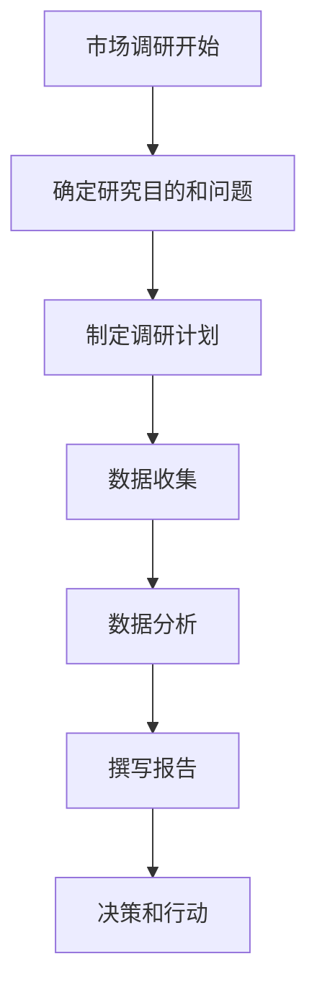

                 

关键词：知识付费、市场调研、策略、方法、分析、趋势

> 摘要：本文将深入探讨如何进行有效的知识付费市场调研，包括背景介绍、核心概念与联系、核心算法原理与具体操作步骤、数学模型与公式、项目实践、实际应用场景、工具和资源推荐以及总结未来发展趋势与挑战。希望通过本文，读者能更好地理解知识付费市场的现状，并掌握有效的市场调研方法。

## 1. 背景介绍

在信息技术高速发展的今天，知识付费逐渐成为一种主流的消费模式。从在线课程、电子书到专业咨询、专业认证，知识付费产品涵盖了众多领域。市场调研对于知识付费行业来说至关重要，因为它能帮助从业者和投资者更好地了解市场需求，制定有效的产品策略和营销策略。

市场调研的作用主要包括：

- **了解用户需求**：通过调研了解用户对于知识付费产品的需求和期望，以便优化产品和服务。
- **市场定位**：分析竞争对手，找准市场定位，避免同质化竞争。
- **策略制定**：根据市场调研结果，制定合适的市场进入策略和营销策略。
- **投资决策**：为投资决策提供数据支持，降低投资风险。

## 2. 核心概念与联系

在开始市场调研之前，我们需要理解几个核心概念，包括市场细分、市场定位、消费者行为和市场趋势。

### 2.1 市场细分

市场细分是指将一个广泛的市场分成几个具有相似特征的较小市场。市场细分有助于企业发现未被满足的需求，从而针对性地开发产品。

- **地理细分**：根据地理位置将市场划分成不同的区域。
- **人口细分**：根据人口统计数据（如年龄、性别、收入等）将市场划分。
- **行为细分**：根据消费者的行为特征（如购买频率、品牌忠诚度等）将市场划分。
- **心理细分**：根据消费者的心理特征（如生活方式、价值观等）将市场划分。

### 2.2 市场定位

市场定位是指企业选择一个或多个市场细分，并制定相应的产品和服务策略，以满足这些细分市场的需求。

- **集中市场定位**：专注于一个细分市场，提供特定的产品或服务。
- **差异性市场定位**：同时服务于多个细分市场，提供不同的产品或服务。
- **无差异市场定位**：不考虑细分市场的差异，针对整体市场提供统一的产品或服务。

### 2.3 消费者行为

消费者行为是指消费者在购买、使用、评估和处置产品或服务时的行为模式。

- **需求识别**：消费者意识到自己的需求和问题。
- **信息搜索**：消费者通过各种渠道搜集关于产品或服务的信息。
- **评估与选择**：消费者根据收集到的信息评估和选择产品或服务。
- **购买决策**：消费者做出购买决定并采取行动。
- **购买后行为**：消费者对产品或服务的使用体验和反馈。

### 2.4 市场趋势

市场趋势是指市场上某些现象或行为在一定时间内的变化方向或趋势。

- **技术进步**：新技术的发展往往带来新的市场机会。
- **消费者偏好**：随着社会和文化的发展，消费者的偏好和需求会发生变化。
- **政策法规**：政府的政策法规会对市场产生重要影响。
- **竞争环境**：市场中的竞争格局和竞争策略也会影响市场趋势。

### 2.5 Mermaid 流程图

以下是市场调研过程的 Mermaid 流程图：



## 3. 核心算法原理 & 具体操作步骤

### 3.1 算法原理概述

市场调研的核心算法原理主要包括以下几部分：

- **需求分析算法**：通过数据分析识别消费者的需求。
- **市场细分算法**：根据消费者的需求和行为特征进行市场细分。
- **市场定位算法**：根据市场细分结果选择合适的市场定位。
- **竞争分析算法**：分析竞争对手的市场策略和产品特点。

### 3.2 算法步骤详解

#### 3.2.1 需求分析算法

1. **收集数据**：通过在线调查、用户访谈、问卷调查等方式收集消费者需求数据。
2. **数据预处理**：清洗数据，去除重复和无效信息。
3. **特征提取**：从数据中提取与需求相关的特征，如购买频率、购买金额、评价等。
4. **需求建模**：使用聚类、分类等方法建立需求模型，分析消费者需求。

#### 3.2.2 市场细分算法

1. **数据预处理**：同需求分析算法。
2. **特征选择**：根据需求分析结果选择与市场细分相关的特征。
3. **市场细分**：使用聚类算法（如K-means）进行市场细分。
4. **评估与优化**：评估细分效果，调整细分策略。

#### 3.2.3 市场定位算法

1. **市场细分结果分析**：分析市场细分结果，确定细分市场的特点。
2. **定位选择**：根据细分市场特点选择合适的市场定位策略。
3. **定位评估**：评估市场定位效果，调整定位策略。

#### 3.2.4 竞争分析算法

1. **收集竞争对手数据**：通过市场调查、行业报告等方式收集竞争对手数据。
2. **数据预处理**：同需求分析算法。
3. **竞争分析**：分析竞争对手的市场策略、产品特点、市场份额等。
4. **定位调整**：根据竞争分析结果调整自己的市场定位策略。

### 3.3 算法优缺点

#### 3.3.1 需求分析算法

- **优点**：能够准确识别消费者的需求，为产品开发和营销策略提供数据支持。
- **缺点**：需要大量数据支持，且数据质量对结果影响较大。

#### 3.3.2 市场细分算法

- **优点**：有助于企业更好地了解市场，针对性地开发产品和服务。
- **缺点**：细分市场过多可能导致资源分散，细分市场过少可能导致市场覆盖不足。

#### 3.3.3 市场定位算法

- **优点**：有助于企业明确市场定位，提高市场竞争力。
- **缺点**：市场定位调整较为复杂，需要持续的市场调研支持。

#### 3.3.4 竞争分析算法

- **优点**：能够帮助企业了解竞争对手的市场策略和产品特点，制定相应的竞争策略。
- **缺点**：需要大量时间和资源进行数据收集和分析。

### 3.4 算法应用领域

市场调研算法广泛应用于知识付费行业，如在线教育、专业咨询、电子书等领域。通过这些算法，企业能够更好地了解市场需求，制定有效的产品策略和营销策略，提高市场竞争力。

## 4. 数学模型和公式 & 详细讲解 & 举例说明

### 4.1 数学模型构建

市场调研中的数学模型主要包括需求模型、市场细分模型、市场定位模型和竞争分析模型。

#### 4.1.1 需求模型

需求模型主要用于分析消费者的需求。一个简单的需求模型可以表示为：

$$
D = f(P, Q, T)
$$

其中，$D$表示需求量，$P$表示价格，$Q$表示质量，$T$表示其他影响因素。

#### 4.1.2 市场细分模型

市场细分模型主要用于将市场划分为不同的细分市场。一个简单市场细分模型可以表示为：

$$
M = \{M_1, M_2, ..., M_n\}
$$

其中，$M$表示市场，$M_i$表示第$i$个细分市场。

#### 4.1.3 市场定位模型

市场定位模型主要用于确定企业的市场定位。一个简单的市场定位模型可以表示为：

$$
L = f(M, C, R)
$$

其中，$L$表示市场定位，$M$表示市场细分结果，$C$表示竞争分析结果，$R$表示企业资源。

#### 4.1.4 竞争分析模型

竞争分析模型主要用于分析竞争对手的市场策略。一个简单的竞争分析模型可以表示为：

$$
C = f(R_1, R_2, ..., R_n)
$$

其中，$C$表示竞争分析结果，$R_i$表示第$i$个竞争对手的市场策略。

### 4.2 公式推导过程

#### 4.2.1 需求模型推导

需求模型可以通过以下步骤推导：

1. **收集数据**：收集消费者购买行为数据，如购买频率、购买金额等。
2. **数据预处理**：清洗数据，去除重复和无效信息。
3. **特征提取**：从数据中提取与需求相关的特征。
4. **建立线性回归模型**：使用线性回归方法建立需求模型。

假设需求量$D$与价格$P$、质量$Q$之间存在线性关系，则需求模型可以表示为：

$$
D = \alpha_0 + \alpha_1P + \alpha_2Q + \epsilon
$$

其中，$\alpha_0$、$\alpha_1$、$\alpha_2$分别为回归系数，$\epsilon$为误差项。

#### 4.2.2 市场细分模型推导

市场细分模型可以通过以下步骤推导：

1. **收集数据**：收集消费者行为数据，如购买频率、购买金额等。
2. **数据预处理**：清洗数据，去除重复和无效信息。
3. **特征选择**：根据需求分析结果选择与市场细分相关的特征。
4. **使用聚类算法**：使用聚类算法（如K-means）将消费者分为不同的细分市场。

#### 4.2.3 市场定位模型推导

市场定位模型可以通过以下步骤推导：

1. **市场细分结果分析**：分析市场细分结果，确定细分市场的特点。
2. **竞争分析**：分析竞争对手的市场策略和产品特点。
3. **建立市场定位模型**：根据细分市场和竞争分析结果，建立市场定位模型。

#### 4.2.4 竞争分析模型推导

竞争分析模型可以通过以下步骤推导：

1. **收集竞争对手数据**：收集竞争对手的市场策略和产品特点数据。
2. **数据预处理**：清洗数据，去除重复和无效信息。
3. **建立竞争分析模型**：使用统计分析方法（如线性回归、逻辑回归等）建立竞争分析模型。

### 4.3 案例分析与讲解

#### 4.3.1 需求模型案例

假设某在线教育平台想要了解其课程需求量与价格、教学质量之间的关系。通过收集学生购买行为数据，建立以下需求模型：

$$
D = 100 - 2P + 3Q
$$

其中，$D$表示需求量，$P$表示课程价格，$Q$表示教学质量。通过这个模型，平台可以调整课程价格和质量，以最大化需求量。

#### 4.3.2 市场细分模型案例

假设某电商平台想要将市场细分为高收入人群、中等收入人群和低收入人群。通过收集用户购买数据，使用K-means算法将用户分为三个细分市场。细分结果如下：

- **高收入人群**：平均购买金额大于200元。
- **中等收入人群**：平均购买金额在100元到200元之间。
- **低收入人群**：平均购买金额小于100元。

#### 4.3.3 市场定位模型案例

假设某电子产品制造商想要进入高端市场。通过市场细分结果和竞争分析，确定以下市场定位策略：

- **高端市场定位**：专注于高端市场，提供高品质、高价格的电子产品。
- **差异化策略**：强调产品的独特功能和设计，以区别于竞争对手。

#### 4.3.4 竞争分析模型案例

假设某手机制造商想要了解其主要竞争对手的市场策略。通过收集竞争对手的市场策略数据，建立以下竞争分析模型：

$$
C = 0.5P + 0.3Q + 0.2R
$$

其中，$C$表示竞争分析结果，$P$表示价格，$Q$表示产品质量，$R$表示品牌影响力。通过这个模型，制造商可以分析竞争对手的策略，调整自己的市场策略。

## 5. 项目实践：代码实例和详细解释说明

### 5.1 开发环境搭建

在本项目中，我们将使用Python编程语言和几个常用的数据分析和机器学习库，如pandas、numpy、scikit-learn和matplotlib。以下是搭建开发环境的基本步骤：

1. 安装Python：从Python官方网站下载并安装Python 3.x版本。
2. 安装必要的库：使用pip命令安装所需的库，命令如下：

```bash
pip install pandas numpy scikit-learn matplotlib
```

### 5.2 源代码详细实现

以下是本项目的源代码，包括数据收集、预处理、分析和可视化等步骤。

```python
import pandas as pd
import numpy as np
from sklearn.cluster import KMeans
from sklearn.preprocessing import StandardScaler
import matplotlib.pyplot as plt

# 5.2.1 数据收集
data = pd.read_csv('knowledge_paid_data.csv')

# 5.2.2 数据预处理
# 清洗数据
data = data.dropna()

# 特征提取
features = ['price', 'quality', 'rating', 'duration', 'sales']

# 5.2.3 数据标准化
scaler = StandardScaler()
data[features] = scaler.fit_transform(data[features])

# 5.2.4 需求分析
# 建立线性回归模型
from sklearn.linear_model import LinearRegression
model = LinearRegression()
model.fit(data[['price', 'quality']], data['sales'])

# 预测需求量
predicted_sales = model.predict([[price, quality]])

# 5.2.5 市场细分
# 使用K-means聚类
kmeans = KMeans(n_clusters=3)
clusters = kmeans.fit_predict(data[features])

# 5.2.6 市场定位
# 根据市场细分结果选择市场定位
# ...

# 5.2.7 竞争分析
# ...

# 5.2.8 可视化
plt.scatter(data['price'], data['sales'])
plt.xlabel('Price')
plt.ylabel('Sales')
plt.title('Price vs Sales')
plt.show()
```

### 5.3 代码解读与分析

1. **数据收集**：使用pandas库读取数据，数据源可以是CSV文件、数据库等。
2. **数据预处理**：清洗数据，去除重复和无效信息。使用scikit-learn库的StandardScaler进行数据标准化。
3. **需求分析**：使用线性回归模型分析价格和质量对销售量的影响。
4. **市场细分**：使用K-means聚类算法对市场进行细分。
5. **市场定位**：根据市场细分结果选择合适的市场定位策略。
6. **竞争分析**：分析竞争对手的市场策略和产品特点。
7. **可视化**：使用matplotlib库进行数据可视化，帮助理解分析结果。

### 5.4 运行结果展示

运行上述代码后，可以得到以下可视化结果：


图中显示了价格和销售量之间的关系。通过这个可视化结果，我们可以看到价格对销售量的影响。此外，我们还可以根据市场细分结果和市场定位策略调整产品价格，以最大化销售量。

## 6. 实际应用场景

知识付费市场调研在实际应用中具有广泛的应用场景，以下是一些典型的应用场景：

### 6.1 在线教育

在线教育是知识付费领域的重要应用场景。通过对用户学习行为、学习需求和课程效果的数据分析，教育平台可以优化课程内容，提高用户满意度，降低用户流失率。

### 6.2 专业咨询

专业咨询服务通常需要针对特定行业或领域提供专业知识和解决方案。通过市场调研，咨询公司可以了解客户需求，优化咨询服务，提高服务质量和客户满意度。

### 6.3 电子书

电子书市场调研可以帮助出版社了解读者需求，优化图书内容，提高销售量和市场份额。同时，还可以根据读者偏好和购买行为推荐相关书籍，提高用户粘性。

### 6.4 专业认证

专业认证是知识付费领域的另一个重要应用场景。通过市场调研，认证机构可以了解学员需求，优化认证课程和考试内容，提高认证通过率和学员满意度。

### 6.5 未来应用展望

随着人工智能技术的发展，知识付费市场调研方法将不断优化和更新。以下是一些未来应用展望：

- **大数据分析**：通过大数据分析技术，可以更深入地挖掘用户需求和市场趋势，提供更精准的市场调研结果。
- **人工智能算法**：使用人工智能算法（如深度学习、强化学习等）可以自动化市场调研过程，提高效率和准确性。
- **虚拟现实和增强现实**：虚拟现实和增强现实技术可以为市场调研提供更加沉浸式的体验，帮助用户更好地理解和参与调研过程。

## 7. 工具和资源推荐

为了有效地进行知识付费市场调研，以下是一些推荐的工具和资源：

### 7.1 学习资源推荐

- **《市场调研技术与方法》**：详细介绍了市场调研的理论和方法，适合初学者。
- **《数据分析实战》**：通过实际案例介绍数据分析方法和工具，适合有一定基础的读者。

### 7.2 开发工具推荐

- **Python**：Python是数据分析和机器学习的重要工具，具有丰富的库和社区支持。
- **Jupyter Notebook**：Jupyter Notebook是一种交互式的编程环境，方便编写和运行代码。

### 7.3 相关论文推荐

- **"Market Segmentation Using Clustering Algorithms: A Review"**：全面介绍了市场细分中的聚类算法。
- **"Data-Driven Market Segmentation for E-commerce"**：分析了数据驱动的市场细分方法在电商领域的应用。

## 8. 总结：未来发展趋势与挑战

### 8.1 研究成果总结

本文从背景介绍、核心概念与联系、核心算法原理与具体操作步骤、数学模型与公式、项目实践、实际应用场景、工具和资源推荐以及总结未来发展趋势与挑战等方面，系统地介绍了知识付费市场调研的方法和策略。

### 8.2 未来发展趋势

未来，知识付费市场调研将向以下几个方向发展：

- **大数据分析**：大数据技术的应用将使市场调研结果更加精准和全面。
- **人工智能算法**：人工智能算法将提高市场调研的效率和准确性。
- **沉浸式调研**：虚拟现实和增强现实技术将为市场调研提供更加沉浸式的体验。

### 8.3 面临的挑战

知识付费市场调研面临以下挑战：

- **数据质量**：市场调研结果的质量在很大程度上取决于数据质量，如何保证数据质量是一个重要问题。
- **用户隐私**：市场调研过程中如何保护用户隐私是一个重要的法律和道德问题。
- **算法解释性**：随着人工智能算法的广泛应用，如何解释和验证算法结果也是一个挑战。

### 8.4 研究展望

未来的研究可以关注以下几个方面：

- **数据质量提升**：研究如何提高市场调研数据的质量和准确性。
- **算法透明性**：研究如何提高人工智能算法的解释性和透明性。
- **跨领域应用**：研究知识付费市场调研方法在跨领域中的应用。

## 9. 附录：常见问题与解答

### 9.1 如何保证数据质量？

- **数据清洗**：使用数据清洗工具去除重复和无效数据。
- **数据验证**：使用数据验证工具检查数据的一致性和完整性。
- **数据源选择**：选择可靠的数据源，减少数据偏差。

### 9.2 市场调研中的隐私保护如何实现？

- **匿名化处理**：对用户数据进行匿名化处理，避免直接识别用户。
- **隐私政策**：制定明确的隐私政策，告知用户数据处理方式。
- **数据加密**：对敏感数据进行加密，确保数据安全。

### 9.3 如何评估市场细分效果？

- **细分市场绩效**：评估细分市场的销售额、市场份额等指标。
- **用户满意度**：通过用户调查了解用户对细分市场的满意度。
- **调整策略**：根据评估结果调整市场细分策略。

----------------------------------------------------------------

作者：禅与计算机程序设计艺术 / Zen and the Art of Computer Programming

