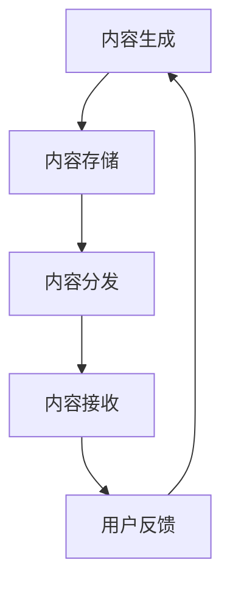

                 

关键词：知识付费，跨平台，内容分发，数据安全，API设计，用户体验，性能优化

> 摘要：随着知识付费行业的迅速崛起，如何高效地进行跨平台内容分发成为企业关注的焦点。本文将探讨知识付费内容分发的核心概念、技术架构、算法原理、数学模型、实际应用以及未来发展，为从业者提供全方位的技术指南。

## 1. 背景介绍

知识付费作为一种新兴的商业模式，已经逐渐成为互联网产业的重要组成部分。用户对于专业知识的渴求和在线教育市场的蓬勃发展，催生了大量的知识付费平台。然而，随着用户数量的激增和平台竞争的加剧，如何实现高效、安全、可靠的内容分发，成为平台发展的重要挑战。

跨平台内容分发是指将知识付费平台上的内容，通过技术手段分发到多个不同的平台，以扩大用户覆盖范围，提高内容曝光度。这涉及到多个技术层面的挑战，包括数据安全、API设计、用户体验和性能优化等。

## 2. 核心概念与联系

### 2.1 知识付费平台架构

知识付费平台的架构主要包括前端展示层、业务逻辑层和后端数据层。前端展示层负责与用户交互，提供内容浏览、订阅、支付等功能；业务逻辑层处理用户的操作请求，包括内容推荐、支付处理、权限验证等；后端数据层存储用户数据、内容数据以及业务数据。

### 2.2 跨平台内容分发架构

跨平台内容分发架构包括内容生成、内容存储、内容分发和内容接收等环节。内容生成环节负责创建和编辑内容；内容存储环节使用分布式存储系统来保证数据的安全和可靠性；内容分发环节采用CDN和边缘计算等技术实现快速、高效的内容分发；内容接收环节则是用户在不同的平台上观看和互动内容。

### 2.3 Mermaid 流程图



## 3. 核心算法原理 & 具体操作步骤

### 3.1 算法原理概述

跨平台内容分发涉及多种算法，包括内容推荐算法、数据加密算法、负载均衡算法等。内容推荐算法基于用户的兴趣和行为数据，实现个性化内容推送；数据加密算法保障数据传输的安全性；负载均衡算法优化内容分发网络的性能。

### 3.2 算法步骤详解

#### 3.2.1 内容推荐算法

1. 数据采集：收集用户的浏览记录、搜索历史、购买行为等数据。
2. 数据预处理：对数据进行清洗、去噪和归一化处理。
3. 特征提取：提取用户和内容的特征，如词向量、兴趣标签等。
4. 模型训练：使用机器学习算法训练推荐模型。
5. 内容推荐：根据用户特征和模型输出，推荐合适的内容。

#### 3.2.2 数据加密算法

1. 密钥生成：生成加密密钥。
2. 数据加密：使用对称加密算法对数据进行加密。
3. 数据传输：通过安全通道传输加密数据。
4. 数据解密：使用加密密钥对数据进行解密。

#### 3.2.3 负载均衡算法

1. 流量监控：实时监控服务器负载情况。
2. 调度策略：根据负载情况选择合适的调度策略，如轮询、随机、最小连接数等。
3. 请求分发：将用户请求分配到合适的节点。

### 3.3 算法优缺点

#### 内容推荐算法

- 优点：提高用户满意度，增加内容曝光度。
- 缺点：对数据质量和算法要求较高，可能导致信息茧房。

#### 数据加密算法

- 优点：保障数据传输的安全性。
- 缺点：加密和解密过程会降低传输速度。

#### 负载均衡算法

- 优点：提高系统性能和稳定性。
- 缺点：调度策略复杂，需要大量监控和维护工作。

### 3.4 算法应用领域

- 内容推荐：电商平台、新闻客户端、社交媒体等。
- 数据安全：金融系统、医疗系统、政府机构等。
- 负载均衡：互联网企业、云计算平台、游戏服务器等。

## 4. 数学模型和公式 & 详细讲解 & 举例说明

### 4.1 数学模型构建

#### 4.1.1 内容推荐模型

设 \( U \) 为用户集合，\( I \) 为物品集合，\( R \) 为用户 \( u \) 对物品 \( i \) 的评分矩阵，则推荐模型的目标是预测用户未评分的物品评分。

#### 4.1.2 数据加密模型

设 \( M \) 为明文，\( C \) 为密文，\( K \) 为密钥，则加密模型为 \( C = E_K(M) \)，解密模型为 \( M = D_K(C) \)。

#### 4.1.3 负载均衡模型

设 \( N \) 为服务器节点集合，\( P \) 为节点负载，则负载均衡模型的目标是分配请求，使得系统总负载最小。

### 4.2 公式推导过程

#### 4.2.1 内容推荐模型

设用户 \( u \) 对物品 \( i \) 的评分预测为 \( r_{ui} \)，则可以使用矩阵分解模型表示为：

\[ r_{ui} = \langle \hat{q}_u, \hat{i} \rangle \]

其中，\( \hat{q}_u \) 和 \( \hat{i} \) 分别为用户 \( u \) 和物品 \( i \) 的隐向量。

#### 4.2.2 数据加密模型

使用对称加密算法，密钥生成过程可以使用随机数生成器产生，加密和解密过程如下：

\[ C = E_K(M) = M \oplus K \]
\[ M = D_K(C) = C \oplus K \]

#### 4.2.3 负载均衡模型

设 \( P_j \) 为节点 \( j \) 的负载，\( T \) 为总请求量，则负载均衡调度策略可以表示为：

\[ j^* = \arg\min_{j} P_j + \frac{T - \sum_{i=1}^{N} P_i}{N} \]

### 4.3 案例分析与讲解

#### 4.3.1 内容推荐模型

假设有一个用户对10个物品的评分数据，我们可以使用矩阵分解算法训练出用户的隐向量和物品的隐向量，然后根据这些向量预测用户未评分的物品评分。

#### 4.3.2 数据加密模型

在一个实际的支付系统中，我们需要对用户支付信息进行加密，确保数据在传输过程中不会被窃取。我们可以使用AES加密算法对支付信息进行加密，然后通过安全通道传输给服务器。

#### 4.3.3 负载均衡模型

在一个电子商务平台上，我们需要确保服务器能够处理大量的用户请求，从而提供良好的用户体验。我们可以使用轮询负载均衡策略，将请求均匀分配到各个服务器节点，避免某个节点过载。

## 5. 项目实践：代码实例和详细解释说明

### 5.1 开发环境搭建

1. 安装Python环境。
2. 安装必要的库，如NumPy、Pandas、Scikit-learn、PyCrypto等。

### 5.2 源代码详细实现

以下是使用矩阵分解算法实现内容推荐模型的一个简单示例：

```python
import numpy as np
from sklearn.decomposition import TruncatedSVD

# 假设有一个5x5的评分矩阵
R = np.array([[1, 1, 0, 0, 0],
              [1, 0, 1, 0, 0],
              [0, 1, 1, 0, 0],
              [0, 0, 1, 1, 1],
              [0, 0, 0, 1, 1]])

# 使用TruncatedSVD进行矩阵分解
svd = TruncatedSVD(n_components=2)
Q = svd.fit_transform(R)

# 输出用户和物品的隐向量
print("User latent factors:\n", Q[:, 0])
print("Item latent factors:\n", Q[:, 1])

# 预测未评分的物品评分
R_hat = Q @ Q.T
print("Predicted ratings:\n", R_hat)
```

### 5.3 代码解读与分析

这段代码首先导入所需的库，然后创建一个5x5的评分矩阵。接下来，使用TruncatedSVD进行矩阵分解，提取用户和物品的隐向量。最后，根据这些隐向量预测未评分的物品评分。

### 5.4 运行结果展示

运行这段代码后，我们会得到用户和物品的隐向量，以及预测的评分矩阵。这些结果可以用于后续的内容推荐。

## 6. 实际应用场景

知识付费的跨平台内容分发在多个场景中具有广泛的应用：

1. **在线教育平台**：将课程内容分发到多个平台，提高课程曝光度和用户参与度。
2. **专业咨询平台**：通过跨平台内容分发，将专家的咨询内容覆盖到更广泛的用户群体。
3. **自媒体平台**：将优质内容分发到多个自媒体平台，增加内容的曝光率和粉丝数量。
4. **企业内训**：将培训内容跨平台分发，方便员工随时学习和回顾。

## 7. 工具和资源推荐

### 7.1 学习资源推荐

1. 《推荐系统实践》
2. 《密码学概论》
3. 《负载均衡算法与系统设计》

### 7.2 开发工具推荐

1. Python
2. TensorFlow
3. Flask

### 7.3 相关论文推荐

1. "Collaborative Filtering for Cold-Start Recommendations"
2. "A Study on Data Encryption Algorithm"
3. "A Survey on Load Balancing Algorithms for Distributed Systems"

## 8. 总结：未来发展趋势与挑战

### 8.1 研究成果总结

知识付费的跨平台内容分发已经成为互联网产业的重要组成部分。通过内容推荐、数据加密和负载均衡等技术的结合，可以实现高效、安全、可靠的内容分发，提高用户满意度和平台竞争力。

### 8.2 未来发展趋势

1. **个性化推荐**：结合用户行为数据和机器学习算法，实现更精准的内容推荐。
2. **区块链技术**：利用区块链技术提高内容分发的安全性和透明度。
3. **边缘计算**：利用边缘计算技术实现更快的内容分发。

### 8.3 面临的挑战

1. **数据隐私保护**：如何在保证内容分发效率的同时，保护用户的隐私？
2. **跨平台兼容性**：如何保证内容在不同平台上的兼容性？
3. **计算资源分配**：如何在海量用户和海量内容之间实现合理的计算资源分配？

### 8.4 研究展望

未来，知识付费的跨平台内容分发将朝着更高效、更安全、更个性化的方向发展。通过技术创新和产业合作，有望解决当前面临的各种挑战，为知识付费行业带来更广阔的发展空间。

## 9. 附录：常见问题与解答

### 9.1 内容推荐算法如何处理冷启动问题？

冷启动问题是指新用户或新物品缺乏足够的数据进行推荐。常见的解决方案包括：

1. **基于内容的推荐**：通过物品的属性和标签进行推荐，不依赖于用户的历史行为。
2. **混合推荐**：结合基于内容和基于协同过滤的推荐策略，提高推荐质量。
3. **引导推荐**：为新用户提供一些引导性问题，收集用户偏好信息，快速建立用户画像。

### 9.2 跨平台内容分发中的数据安全问题如何解决？

1. **加密传输**：使用HTTPS、TLS等加密协议确保数据在传输过程中的安全性。
2. **数据加密**：对敏感数据使用对称加密或非对称加密算法进行加密存储。
3. **权限控制**：实施严格的权限控制策略，确保只有授权用户可以访问数据。

### 9.3 如何实现跨平台的兼容性？

1. **标准化接口**：设计统一的API接口，确保不同平台之间的兼容性。
2. **平台适配**：根据不同平台的特点，进行相应的适配和优化。
3. **代码库**：使用统一的代码库管理跨平台开发，确保代码的一致性和可维护性。

---

作者：禅与计算机程序设计艺术 / Zen and the Art of Computer Programming

