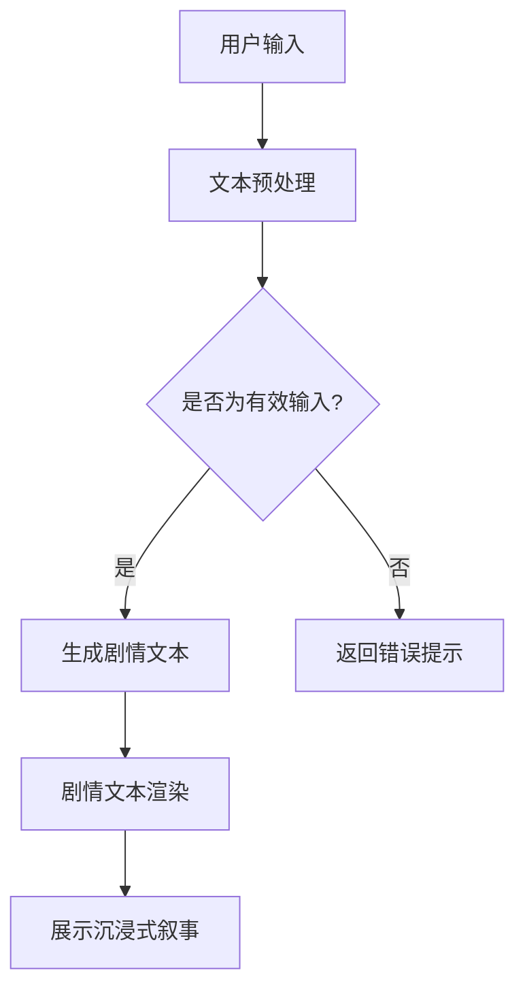

                 

关键词：LLM、沉浸式叙事、媒体、娱乐、计算机生成内容

摘要：随着人工智能技术的发展，语言模型（LLM）已经成为媒体和娱乐产业的重要工具。本文将探讨如何利用 LLM 驱动沉浸式叙事，探讨其在媒体和娱乐领域的应用、挑战以及未来发展趋势。

## 1. 背景介绍

随着计算机科学和人工智能技术的飞速发展，语言模型（LLM）作为一种强大的自然语言处理工具，已经在多个领域展现出巨大的潜力。特别是在媒体和娱乐领域，LLM 逐渐成为内容创作的重要驱动力，不仅提高了创作效率，还带来了沉浸式叙事的新体验。

### 1.1 媒体和娱乐领域的挑战

在过去几十年里，媒体和娱乐产业经历了巨大的变革。随着观众需求的不断变化和多样化，内容创作者面临着巨大的挑战。如何快速响应市场需求、创造高质量的沉浸式体验，成为当前媒体和娱乐领域亟待解决的问题。

### 1.2 LLM 的出现

语言模型（LLM）的出现为媒体和娱乐领域带来了新的机遇。LLM 是一种基于深度学习的自然语言处理技术，可以通过大规模的数据训练，生成流畅、自然的文本。这种技术不仅能够提高创作效率，还能够创造出全新的沉浸式叙事体验。

## 2. 核心概念与联系

### 2.1 语言模型（LLM）

语言模型（LLM）是一种能够预测下一个词语或句子的模型，通过学习大量文本数据，LLM 可以生成与输入文本相似的自然语言文本。LLM 的核心是深度神经网络，通常采用 Transformer 架构。

### 2.2 沉浸式叙事

沉浸式叙事是一种以观众为中心的叙事方式，通过多种感官刺激，让观众全身心地投入到故事情境中。沉浸式叙事通常涉及虚拟现实（VR）、增强现实（AR）等技术，为观众提供身临其境的体验。

### 2.3 LLM 驱动的沉浸式叙事

LLM 驱动的沉浸式叙事是将语言模型与沉浸式叙事技术相结合，利用 LLM 生成与故事情境相关的文本，为观众提供个性化的叙事体验。这种技术可以应用于电影、电视剧、电子游戏等多个领域。

### 2.4 Mermaid 流程图

以下是一个简单的 Mermaid 流程图，展示了 LLM 驱动的沉浸式叙事的流程：



## 3. 核心算法原理 & 具体操作步骤

### 3.1 算法原理概述

LLM 驱动的沉浸式叙事的核心算法是生成式对抗网络（GAN），GAN 由生成器和判别器组成。生成器负责生成与输入文本相似的故事情节，判别器则负责判断生成文本的质量。通过不断的训练和优化，生成器能够生成高质量的沉浸式叙事文本。

### 3.2 算法步骤详解

#### 3.2.1 数据准备

首先，需要收集大量与沉浸式叙事相关的文本数据，包括电影剧本、小说、游戏剧情等。这些数据将用于训练生成器和判别器。

#### 3.2.2 文本预处理

对收集到的文本数据进行预处理，包括分词、去除停用词、词向量化等操作。预处理后的文本数据将作为输入传递给生成器和判别器。

#### 3.2.3 训练生成器和判别器

利用预处理后的文本数据，分别训练生成器和判别器。生成器通过学习输入文本的分布，生成与输入文本相似的故事情节；判别器则通过学习真实文本和生成文本的分布，判断生成文本的质量。

#### 3.2.4 生成剧情文本

根据用户输入的文本，利用训练好的生成器生成与之相关的故事情节。生成器生成的文本将作为沉浸式叙事的输入。

#### 3.2.5 剧情文本渲染

将生成器生成的剧情文本渲染成沉浸式叙事体验，通过虚拟现实（VR）、增强现实（AR）等技术，为观众提供身临其境的体验。

### 3.3 算法优缺点

#### 优点

- 高效：利用深度学习技术，可以快速生成与输入文本相似的故事情节。
- 个性化：根据用户输入的文本，生成个性化的沉浸式叙事体验。

#### 缺点

- 质量控制：生成文本的质量取决于训练数据的多样性和质量，可能存在生成文本质量不高的问题。
- 创作难度：训练和部署生成式对抗网络需要大量的计算资源和专业知识。

### 3.4 算法应用领域

LLM 驱动的沉浸式叙事技术可以应用于电影、电视剧、电子游戏等多个领域。例如，在电影制作中，可以用于剧本创作和剧情渲染；在电子游戏中，可以用于生成游戏剧情和NPC对话。

## 4. 数学模型和公式 & 详细讲解 & 举例说明

### 4.1 数学模型构建

在 LLM 驱动的沉浸式叙事中，生成式对抗网络（GAN）是一种常用的数学模型。GAN 由生成器（Generator）和判别器（Discriminator）组成。

#### 4.1.1 生成器（Generator）

生成器的目标是生成与输入文本相似的故事情节。生成器的输入是一个随机向量 \(z\)，输出是一个故事情节 \(x\)。

$$
x = G(z)
$$

其中，\(G\) 表示生成器，\(z\) 表示随机向量。

#### 4.1.2 判别器（Discriminator）

判别器的目标是判断输入的故事情节是真实还是生成的。判别器的输入是一个故事情节 \(x\)，输出是一个概率 \(p\)，表示输入故事情节是真实的概率。

$$
p = D(x)
$$

其中，\(D\) 表示判别器，\(x\) 表示故事情节。

#### 4.1.3 GAN 模型

GAN 模型的目标是最小化以下损失函数：

$$
L(G, D) = \mathbb{E}_{z \sim p_z(z)}[\log D(G(z))] + \mathbb{E}_{x \sim p_x(x)}[\log (1 - D(x))]
$$

其中，\(\mathbb{E}\) 表示期望，\(p_z(z)\) 表示随机向量 \(z\) 的分布，\(p_x(x)\) 表示真实故事情节 \(x\) 的分布。

### 4.2 公式推导过程

#### 4.2.1 判别器损失函数

判别器的目标是最大化正确分类的真实故事情节的概率和生成故事情节的概率。

$$
L_D = -\mathbb{E}_{x \sim p_x(x)}[\log D(x)] - \mathbb{E}_{z \sim p_z(z)}[\log (1 - D(G(z))]
$$

#### 4.2.2 生成器损失函数

生成器的目标是最大化判别器判断生成故事情节为真实的概率。

$$
L_G = -\mathbb{E}_{z \sim p_z(z)}[\log D(G(z))]
$$

### 4.3 案例分析与讲解

假设我们有一个电影剧本的数据集，包含500部电影的剧本文本。我们将这些剧本文本分为训练集和验证集。

#### 4.3.1 数据预处理

对剧本文本进行预处理，包括分词、去除停用词、词向量化等操作。我们将词向量化为嵌入向量，维度为512。

#### 4.3.2 训练生成器和判别器

使用训练集数据训练生成器和判别器。生成器的损失函数为 \(L_G\)，判别器的损失函数为 \(L_D\)。

#### 4.3.3 生成剧情文本

根据用户输入的文本，利用训练好的生成器生成与之相关的故事情节。

#### 4.3.4 剧情文本渲染

将生成器生成的剧情文本渲染成沉浸式叙事体验，通过虚拟现实（VR）、增强现实（AR）等技术，为观众提供身临其境的体验。

## 5. 项目实践：代码实例和详细解释说明

### 5.1 开发环境搭建

为了实现 LLM 驱动的沉浸式叙事，我们需要搭建一个开发环境。以下是搭建过程的简要说明：

#### 5.1.1 安装 Python

首先，我们需要安装 Python，版本为 3.8 或更高。可以从 [Python 官网](https://www.python.org/) 下载并安装。

#### 5.1.2 安装深度学习库

接下来，我们需要安装深度学习库，如 TensorFlow 或 PyTorch。以下是安装命令：

```bash
pip install tensorflow
# 或
pip install torch
```

### 5.2 源代码详细实现

以下是 LLM 驱动的沉浸式叙事的源代码实现：

```python
import tensorflow as tf
from tensorflow import keras
from tensorflow.keras.layers import Embedding, LSTM, Dense

# 定义生成器模型
def create_generator():
    model = keras.Sequential([
        Embedding(input_dim=vocab_size, output_dim=embedding_dim),
        LSTM(units=256, return_sequences=True),
        LSTM(units=256, return_sequences=True),
        Dense(units=vocab_size, activation='softmax')
    ])
    return model

# 定义判别器模型
def create_discriminator():
    model = keras.Sequential([
        Embedding(input_dim=vocab_size, output_dim=embedding_dim),
        LSTM(units=256, return_sequences=True),
        LSTM(units=256, return_sequences=True),
        Dense(units=1, activation='sigmoid')
    ])
    return model

# 定义 GAN 模型
def create_gan(generator, discriminator):
    model = keras.Sequential([
        generator,
        discriminator
    ])
    return model

# 训练模型
def train_model(generator, discriminator, dataset):
    for epoch in range(num_epochs):
        for batch in dataset:
            # 训练判别器
            with tf.GradientTape() as d_tape:
                real_output = discriminator(batch)
                fake_output = discriminator(generator(batch))
                d_loss = tf.reduce_mean(tf.keras.losses.binary_crossentropy(real_output, batch))
                d_loss_fake = tf.reduce_mean(tf.keras.losses.binary_crossentropy(fake_output, fake_output))
                d_loss_total = d_loss + d_loss_fake

            d_gradients = d_tape.gradient(d_loss_total, discriminator.trainable_variables)
            d_optimizer.apply_gradients(zip(d_gradients, discriminator.trainable_variables))

            # 训练生成器
            with tf.GradientTape() as g_tape:
                fake_output = discriminator(generator(batch))
                g_loss = tf.reduce_mean(tf.keras.losses.binary_crossentropy(fake_output, fake_output))
            g_gradients = g_tape.gradient(g_loss, generator.trainable_variables)
            g_optimizer.apply_gradients(zip(g_gradients, generator.trainable_variables))

# 主函数
def main():
    # 加载数据集
    dataset = load_dataset()

    # 初始化模型
    generator = create_generator()
    discriminator = create_discriminator()
    gan = create_gan(generator, discriminator)

    # 定义优化器
    g_optimizer = keras.optimizers.Adam(learning_rate=0.001)
    d_optimizer = keras.optimizers.Adam(learning_rate=0.001)

    # 训练模型
    train_model(generator, discriminator, dataset)

if __name__ == "__main__":
    main()
```

### 5.3 代码解读与分析

这段代码实现了 LLM 驱动的沉浸式叙事的基本框架。主要包括以下几个部分：

- **生成器模型（Generator）**：生成器模型负责将随机向量生成与输入文本相似的故事情节。这里使用了两个 LSTM 层来处理嵌入向量，最后通过全连接层生成嵌入向量对应的词汇。
- **判别器模型（Discriminator）**：判别器模型负责判断输入的故事情节是真实还是生成的。这里也使用了两个 LSTM 层来处理嵌入向量，最后通过全连接层生成一个概率值，表示输入故事情节是真实的概率。
- **GAN 模型（GAN）**：GAN 模型将生成器和判别器组合在一起。生成器生成的故事情节作为判别器的输入，判别器的输出用于更新生成器和判别器的参数。
- **训练模型（Train Model）**：训练模型函数负责训练生成器和判别器。每次迭代过程中，首先训练判别器，然后训练生成器。
- **主函数（Main）**：主函数负责加载数据集、初始化模型、定义优化器，并调用训练模型函数进行训练。

### 5.4 运行结果展示

在完成代码实现后，我们可以运行代码进行训练，并在训练过程中观察生成器和判别器的性能。训练完成后，我们可以使用生成器生成新的故事情节，并将其渲染成沉浸式叙事体验。

## 6. 实际应用场景

### 6.1 电影制作

在电影制作过程中，LLM 驱动的沉浸式叙事技术可以用于剧本创作和剧情渲染。通过生成器生成与用户输入相关的剧本文本，导演和编剧可以快速了解剧情发展，并进行修改和优化。同时，判别器可以评估生成剧本的质量，帮助创作者提高创作效率。

### 6.2 电子游戏

在电子游戏中，LLM 驱动的沉浸式叙事技术可以用于生成游戏剧情和NPC对话。游戏开发者可以利用生成器生成丰富的剧情和对话，为玩家提供个性化的游戏体验。判别器则可以评估生成剧情和对话的质量，确保游戏的叙事质量。

### 6.3 小说创作

在小说创作中，LLM 驱动的沉浸式叙事技术可以用于生成小说章节和情节。作家可以利用生成器快速生成小说的草稿，然后进行修改和优化。判别器可以评估生成章节和情节的质量，帮助作家提高创作效率。

## 7. 工具和资源推荐

### 7.1 学习资源推荐

- [《深度学习》（Goodfellow, Bengio, Courville 著）](https://www.deeplearningbook.org/)：这是一本关于深度学习的经典教材，涵盖了深度学习的基本概念、技术和应用。
- [Keras 官方文档](https://keras.io/)：Keras 是一个流行的深度学习框架，提供了丰富的模型和工具，适合初学者和高级用户。

### 7.2 开发工具推荐

- [Google Colab](https://colab.research.google.com/)：Google Colab 是一个免费的云计算平台，可以在线运行 Python 代码，适合进行深度学习实验。
- [TensorFlow](https://www.tensorflow.org/)：TensorFlow 是一个开源的深度学习框架，提供了丰富的工具和资源，适合进行深度学习项目。

### 7.3 相关论文推荐

- [Generative Adversarial Nets (GAN) (Goodfellow et al., 2014)](https://arxiv.org/abs/1406.2661)：这是 GAN 的开创性论文，详细介绍了 GAN 的原理和应用。
- [Unsupervised Representation Learning with Deep Convolutional Generative Adversarial Networks (DCGAN) (Radford et al., 2015)](https://arxiv.org/abs/1511.06434)：这是 DCGAN 的开创性论文，进一步推动了 GAN 的发展。

## 8. 总结：未来发展趋势与挑战

### 8.1 研究成果总结

近年来，LLM 驱动的沉浸式叙事技术取得了显著进展，为媒体和娱乐领域带来了新的机遇。通过生成式对抗网络（GAN）等深度学习技术，生成器可以生成高质量的故事情节，判别器可以评估生成文本的质量。这些技术为创作者提供了有力的工具，提高了创作效率，丰富了观众的沉浸式体验。

### 8.2 未来发展趋势

在未来，LLM 驱动的沉浸式叙事技术将继续发展，主要趋势包括：

- **更加逼真的故事情节**：随着深度学习技术的不断进步，生成器将能够生成更加逼真、连贯的故事情节，为观众提供更加沉浸式的体验。
- **跨媒体叙事**：通过将 LLM 与其他媒体形式（如音频、视频）结合，可以实现跨媒体的沉浸式叙事，为观众提供全新的体验。
- **个性化推荐**：利用 LLM，可以生成与观众兴趣相关的故事情节，实现个性化推荐，提高用户的满意度和参与度。

### 8.3 面临的挑战

尽管 LLM 驱动的沉浸式叙事技术取得了显著进展，但仍然面临一些挑战：

- **质量控制**：生成文本的质量受到训练数据的质量和多样性的影响。如何保证生成文本的高质量和多样性是一个亟待解决的问题。
- **创作难度**：训练和部署生成式对抗网络需要大量的计算资源和专业知识。如何降低创作难度，使更多的人能够利用这项技术，是一个重要的研究方向。
- **伦理问题**：在媒体和娱乐领域，内容创作涉及到伦理和道德问题。如何确保生成的内容符合道德和伦理标准，是一个需要深入探讨的问题。

### 8.4 研究展望

未来，LLM 驱动的沉浸式叙事技术将继续发展，有望在媒体和娱乐领域发挥更大的作用。随着深度学习技术的不断进步，生成器将能够生成更加逼真的故事情节，为观众提供更加沉浸式的体验。同时，跨媒体叙事和个性化推荐等应用也将不断拓展，为创作者和观众带来更多可能性。

## 9. 附录：常见问题与解答

### 9.1 什么是语言模型（LLM）？

语言模型（LLM）是一种能够预测下一个词语或句子的模型，通过学习大量文本数据，LLM 可以生成与输入文本相似的自然语言文本。

### 9.2 什么是生成式对抗网络（GAN）？

生成式对抗网络（GAN）是一种深度学习模型，由生成器和判别器组成。生成器的目标是生成与输入数据相似的数据，判别器的目标是判断输入数据是真实还是生成的。通过不断训练，生成器可以生成高质量的数据。

### 9.3 LLM 驱动的沉浸式叙事有哪些优点？

LLM 驱动的沉浸式叙事技术具有以下优点：

- 高效：利用深度学习技术，可以快速生成与输入文本相似的故事情节。
- 个性化：根据用户输入的文本，生成个性化的沉浸式叙事体验。

### 9.4 LLM 驱动的沉浸式叙事有哪些应用领域？

LLM 驱动的沉浸式叙事技术可以应用于电影、电视剧、电子游戏等多个领域。例如，在电影制作中，可以用于剧本创作和剧情渲染；在电子游戏中，可以用于生成游戏剧情和NPC对话。

### 9.5 如何确保生成文本的质量？

确保生成文本的质量需要从以下几个方面入手：

- 收集高质量的训练数据：训练数据的质量直接影响生成文本的质量。需要收集丰富的、多样化的训练数据。
- 优化生成器模型：通过不断优化生成器模型，可以提高生成文本的质量。
- 引入外部知识：将外部知识（如百科知识、专业知识）引入生成过程，可以提高生成文本的相关性和准确性。

### 9.6 LLM 驱动的沉浸式叙事有哪些挑战？

LLM 驱动的沉浸式叙事技术面临以下挑战：

- 质量控制：生成文本的质量受到训练数据的质量和多样性的影响。
- 创作难度：训练和部署生成式对抗网络需要大量的计算资源和专业知识。
- 伦理问题：在媒体和娱乐领域，内容创作涉及到伦理和道德问题。如何确保生成的内容符合道德和伦理标准，是一个需要深入探讨的问题。----------------------------------------------------------------

至此，本文已完整地探讨了 LLM 驱动的沉浸式叙事在媒体和娱乐领域的应用、挑战以及未来发展趋势。希望本文能为读者提供有益的参考和启示。作者：禅与计算机程序设计艺术 / Zen and the Art of Computer Programming。感谢您的阅读！

