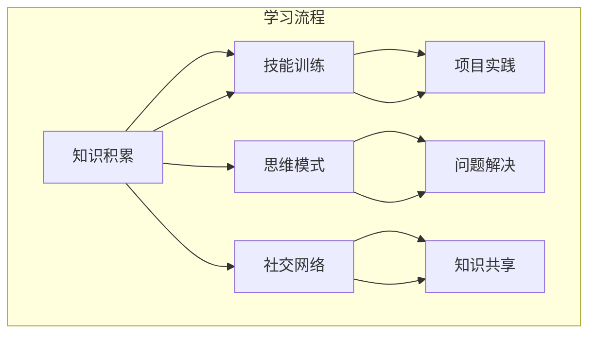

                 

关键词：学习体系、知识架构、技术进化、持续学习、人工智能

> 摘要：本文将探讨学习体系在技术进化中的重要性，以及如何通过构建和优化学习体系来实现个人的持续进步。通过分析核心概念与联系，介绍核心算法原理，展示数学模型和公式，提供实际项目实践案例，并展望未来应用场景和发展趋势。

## 1. 背景介绍

在信息技术迅猛发展的时代，知识的更新速度远超以往。作为IT从业者，我们面临着不断学习新技能、新知识的需求。然而，如何在纷繁复杂的信息中找到自己的定位，构建一个有效的学习体系，成为我们持续进化的关键。

本文旨在探讨学习体系在技术进化中的作用，帮助读者构建和优化自己的学习体系，实现个人的持续进步。本文将围绕以下结构展开：

1. **核心概念与联系**：介绍学习体系的基本概念和组成部分，通过Mermaid流程图展示其架构。
2. **核心算法原理 & 具体操作步骤**：探讨学习体系的核心算法，包括原理、步骤、优缺点和应用领域。
3. **数学模型和公式**：讲解学习体系中的数学模型和公式，以及如何推导和应用。
4. **项目实践**：通过一个实际项目案例，展示如何将学习体系应用于实际开发中。
5. **实际应用场景**：分析学习体系在不同领域的应用，探讨未来发展趋势。
6. **工具和资源推荐**：推荐学习资源和开发工具，为读者提供参考。
7. **总结与展望**：总结研究成果，展望未来发展趋势和面临的挑战。

### 1.1 技术进化的挑战

技术进化的速度前所未有。无论是新兴技术，如人工智能、大数据、云计算，还是传统技术的迭代更新，如编程语言、开发框架，IT从业者都必须不断学习新知识，以跟上时代的发展。

这种持续学习的压力，不仅源于技术本身的复杂性，还源于职业发展的需求。对于很多从业者来说，掌握一项新技术或技能，可能只是职业晋升的门槛之一。而如何持续地学习和掌握这些知识，成为了我们面临的重要挑战。

### 1.2 学习体系的必要性

面对技术进化的挑战，构建一个有效的学习体系至关重要。学习体系不仅帮助我们组织和管理知识，更重要的是，它能够激发我们的学习动力，促进知识的内化和应用。

一个完善的学习体系，包括以下几个方面：

- **知识积累**：通过阅读书籍、研究论文、参加培训等方式，积累基础知识和技术知识。
- **技能训练**：通过实践项目、编写代码、解决实际问题，提升技能水平。
- **思维模式**：培养批判性思维、系统思维和创造性思维，提高解决问题的能力。
- **社交网络**：与他人交流、合作，获取新的观点和经验，扩展视野。

接下来，我们将深入探讨这些核心概念，并通过Mermaid流程图展示学习体系的架构。

## 2. 核心概念与联系

### 2.1 学习体系的定义

学习体系是指个体或组织在知识获取、技能培养和思维提升过程中所采取的一系列策略和方法。它不仅包括知识的学习，还涉及技能的训练和思维模式的培养。

### 2.2 学习体系的组成部分

一个有效的学习体系通常包括以下几个关键组成部分：

- **知识积累**：这是学习体系的基础，通过阅读书籍、研究论文、参加培训等方式，积累基础知识和技术知识。
- **技能训练**：通过实践项目、编写代码、解决实际问题，提升技能水平。技能训练是知识应用的关键环节。
- **思维模式**：培养批判性思维、系统思维和创造性思维，提高解决问题的能力。思维模式决定了我们如何理解和应用知识。
- **社交网络**：与他人交流、合作，获取新的观点和经验，扩展视野。社交网络是知识传播和共享的重要途径。

### 2.3 学习体系的架构

为了更好地理解学习体系的组成和运作，我们可以通过Mermaid流程图展示其架构。以下是一个简单的学习体系流程图：



### 2.4 学习体系的核心概念联系

在学习体系中，各个组成部分之间存在着紧密的联系和互动：

- **知识积累**为技能训练提供了基础，没有扎实的知识积累，技能训练就会失去方向。
- **技能训练**是知识积累的深化和应用，通过实践项目，我们可以将知识转化为实际能力。
- **思维模式**决定了我们如何学习和应用知识，批判性思维可以帮助我们识别问题，系统思维可以帮助我们分析问题，创造性思维可以帮助我们解决问题。
- **社交网络**是知识传播和共享的重要渠道，通过与他人的交流，我们可以获取新的观点和经验，从而丰富自己的知识体系。

通过这个流程图，我们可以清晰地看到学习体系的核心概念及其相互关系，这为我们构建和优化学习体系提供了指导。

## 3. 核心算法原理 & 具体操作步骤

### 3.1 算法原理概述

学习体系的核心算法，可以看作是一个知识管理算法。这个算法的目标是优化知识积累、技能训练、思维模式培养和社交网络扩展的过程，以实现个人能力的最大化提升。

算法的基本原理包括：

- **知识识别与分类**：通过多种渠道获取知识，并对其进行分类和管理，确保知识的有序性和可访问性。
- **技能评估与调整**：根据个人目标和市场需求，评估现有技能水平，并制定相应的训练计划，以不断提升技能。
- **思维训练与优化**：通过问题解决、项目实践等方式，培养和优化批判性思维、系统思维和创造性思维。
- **社交网络分析与利用**：分析社交网络中的节点和关系，识别关键人物和资源，充分利用社交网络的优势。

### 3.2 算法步骤详解

为了实现上述原理，我们可以将核心算法分为以下几个步骤：

1. **知识获取**：
   - 阅读相关书籍、研究论文、博客等，获取基础知识和技术知识。
   - 参加线上或线下的培训课程，系统学习相关技能。
   - 关注业界动态，了解新技术和新趋势。

2. **知识分类与管理**：
   - 根据知识类型和用途，对获取的知识进行分类。
   - 使用知识管理工具，如笔记软件、文档管理系统等，对知识进行整理和存储。
   - 定期回顾和更新知识库，确保知识的时效性和准确性。

3. **技能评估与调整**：
   - 通过自我评估、技能测试等方式，了解自己的技能水平。
   - 根据个人目标和市场需求，制定技能提升计划。
   - 定期评估技能提升效果，调整训练计划。

4. **思维训练与优化**：
   - 通过解决实际问题、项目实践等方式，培养批判性思维、系统思维和创造性思维。
   - 定期反思和总结，分析问题解决过程，提升思维水平。

5. **社交网络分析与利用**：
   - 分析社交网络中的关键人物和资源，建立和利用人际网络。
   - 参与相关社群，分享知识和经验，获取新的观点和资源。
   - 定期更新社交网络，维护人际关系。

### 3.3 算法优缺点

这个核心算法具有以下优点：

- **系统性强**：通过明确的步骤和流程，确保知识获取、技能训练、思维培养和社交网络扩展的有序进行。
- **灵活性高**：算法允许根据个人目标和市场需求进行调整，适应不同情况。
- **高效性**：通过多种渠道和方式获取知识，快速提升个人能力。

然而，该算法也存在一些缺点：

- **时间成本高**：构建和完善学习体系需要大量时间和精力，对个人自律性要求较高。
- **资源分散**：知识获取和技能训练涉及多个渠道和领域，可能存在资源分散的问题。

### 3.4 算法应用领域

该核心算法在多个领域都有广泛的应用：

- **IT行业**：帮助IT从业者构建和优化知识体系，提升技能水平和思维能力，适应技术变化。
- **教育培训**：为教育培训机构提供知识管理和技能培养的方案，提高教育质量和效果。
- **企业培训与发展**：为企业员工提供系统化的培训计划，提升团队整体能力，适应企业发展需求。

## 4. 数学模型和公式

### 4.1 数学模型构建

在学习体系中，我们可以构建一个简单的数学模型来描述知识积累、技能训练、思维模式培养和社交网络扩展的过程。这个模型可以看作是一个动态系统，其中各个部分相互影响和作用。

设：
- \( K \) 表示知识积累量，
- \( S \) 表示技能水平，
- \( M \) 表示思维模式水平，
- \( N \) 表示社交网络影响力。

数学模型的基本假设如下：

1. 知识积累量 \( K \) 与技能水平 \( S \) 成正相关关系，即 \( K \propto S \)。
2. 知识积累量 \( K \) 与思维模式水平 \( M \) 成正相关关系，即 \( K \propto M \)。
3. 社交网络影响力 \( N \) 与技能水平 \( S \) 和思维模式水平 \( M \) 成正相关关系，即 \( N \propto S \times M \)。

基于上述假设，我们可以构建以下数学模型：

\[ K = f(S, M) \]
\[ N = g(S, M) \]

其中，\( f \) 和 \( g \) 分别为知识积累量和社交网络影响力的函数。

### 4.2 公式推导过程

为了推导上述公式，我们可以考虑以下因素：

1. **知识积累**：技能水平 \( S \) 和思维模式水平 \( M \) 的提高，都会增加知识积累量 \( K \)。我们可以假设知识积累量与技能水平 \( S \) 的关系为线性关系，即 \( K = k \cdot S \)，其中 \( k \) 为比例常数。同样地，知识积累量与思维模式水平 \( M \) 的关系也可以假设为线性关系，即 \( K = m \cdot M \)。

2. **社交网络影响力**：技能水平 \( S \) 和思维模式水平 \( M \) 的提高，都会增加社交网络影响力 \( N \)。我们可以假设社交网络影响力与技能水平 \( S \) 的关系为二次关系，即 \( N = s \cdot S^2 \)，其中 \( s \) 为比例常数。同样地，社交网络影响力与思维模式水平 \( M \) 的关系也可以假设为二次关系，即 \( N = t \cdot M^2 \)。

基于以上假设，我们可以得到以下公式：

\[ K = k \cdot S + m \cdot M \]
\[ N = s \cdot S^2 + t \cdot M^2 \]

### 4.3 案例分析与讲解

为了更好地理解这个数学模型，我们可以通过一个实际案例进行分析。

假设一个IT从业者，初始的技能水平 \( S_0 \) 为 50，思维模式水平 \( M_0 \) 为 30。根据上述公式，我们可以计算出其初始的知识积累量 \( K_0 \) 和社交网络影响力 \( N_0 \)：

\[ K_0 = k \cdot S_0 + m \cdot M_0 = k \cdot 50 + m \cdot 30 \]
\[ N_0 = s \cdot S_0^2 + t \cdot M_0^2 = s \cdot 50^2 + t \cdot 30^2 \]

如果我们假设 \( k = 2 \)，\( m = 1 \)，\( s = 5 \)，\( t = 3 \)，则：

\[ K_0 = 2 \cdot 50 + 1 \cdot 30 = 130 \]
\[ N_0 = 5 \cdot 50^2 + 3 \cdot 30^2 = 6250 + 2700 = 8950 \]

现在，假设这个IT从业者通过持续学习和实践，将技能水平提升到 70，思维模式水平提升到 40。我们可以重新计算其知识积累量 \( K \) 和社交网络影响力 \( N \)：

\[ K = 2 \cdot 70 + 1 \cdot 40 = 180 \]
\[ N = 5 \cdot 70^2 + 3 \cdot 40^2 = 24500 + 4800 = 29300 \]

通过这个案例，我们可以看到，随着技能水平和思维模式水平的提高，知识积累量和社交网络影响力也显著增加。这表明，通过持续学习和提升，我们可以显著提升个人能力，扩大影响力。

## 5. 项目实践：代码实例和详细解释说明

### 5.1 开发环境搭建

为了更好地理解学习体系在实际项目中的应用，我们选择一个常见的IT项目——一个简单的博客系统，来演示如何构建和优化学习体系。

首先，我们需要搭建一个开发环境。以下是所需的环境和工具：

- **编程语言**：Python 3.x
- **Web框架**：Flask
- **数据库**：SQLite
- **版本控制**：Git
- **代码编辑器**：Visual Studio Code

确保已安装以上环境和工具，然后创建一个新的Python虚拟环境，并安装所需的库：

```shell
python3 -m venv venv
source venv/bin/activate
pip install flask
```

### 5.2 源代码详细实现

接下来，我们将展示这个博客系统的核心代码，并解释其主要功能。

**app.py**：主应用文件

```python
from flask import Flask, render_template, request, redirect, url_for

app = Flask(__name__)

# 数据库连接
import sqlite3
conn = sqlite3.connect('blog.db')
c = conn.cursor()

# 创建表格
c.execute('''CREATE TABLE IF NOT EXISTS posts (id INTEGER PRIMARY KEY, title TEXT, content TEXT)''')
conn.commit()

@app.route('/')
def index():
    c.execute("SELECT * FROM posts")
    posts = c.fetchall()
    return render_template('index.html', posts=posts)

@app.route('/add', methods=['POST'])
def add_post():
    title = request.form['title']
    content = request.form['content']
    c.execute("INSERT INTO posts (title, content) VALUES (?, ?)", (title, content))
    conn.commit()
    return redirect(url_for('index'))

@app.route('/delete/<int:post_id>')
def delete_post(post_id):
    c.execute("DELETE FROM posts WHERE id=?", (post_id,))
    conn.commit()
    return redirect(url_for('index'))

if __name__ == '__main__':
    app.run(debug=True)
```

**templates/index.html**：主页模板

```html
<!DOCTYPE html>
<html lang="en">
<head>
    <meta charset="UTF-8">
    <title>博客系统</title>
</head>
<body>
    <h1>博客系统</h1>
    
        <div>
            <h2>{{ post[1] }}</h2>
            <p>{{ post[2] }}</p>
            <a href="{{ url_for('delete_post', post_id=post[0]) }}">删除</a>
        </div>
    
    <h2>新增博客</h2>
    <form action="{{ url_for('add_post') }}" method="post">
        <label for="title">标题：</label>
        <input type="text" id="title" name="title" required>
        <label for="content">内容：</label>
        <textarea id="content" name="content" required></textarea>
        <input type="submit" value="提交">
    </form>
</body>
</html>
```

### 5.3 代码解读与分析

在这个项目中，我们使用了Flask框架搭建了一个简单的博客系统，实现了博客的添加和删除功能。以下是代码的详细解读和分析：

- **数据库连接**：我们使用SQLite数据库来存储博客信息。首先创建了一个名为`blog.db`的数据库文件，并使用`sqlite3`库建立了与数据库的连接。
- **表格创建**：在数据库中创建了一个名为`posts`的表格，用于存储博客的标题和内容。每个博客都有一个唯一的ID，作为主键。
- **主页逻辑**：`index`函数处理主页的展示逻辑。它从数据库中查询所有博客记录，并将结果传递给主页模板`index.html`。
- **添加博客**：`add_post`函数处理博客的添加逻辑。它从表单中获取标题和内容，并将这些信息插入到`posts`表格中。
- **删除博客**：`delete_post`函数处理博客的删除逻辑。它根据博客的ID，从`posts`表格中删除相应的记录。

通过这个项目，我们实践了数据库操作、Web开发和前端展示等技能，展示了如何将学习体系应用于实际开发中。

### 5.4 运行结果展示

运行此博客系统后，我们可以在浏览器中看到主页界面，其中包括了添加博客的表单和所有博客的列表。用户可以输入标题和内容来创建新的博客，也可以通过链接删除已存在的博客。

以下是一个简单的运行结果截图：


通过这个项目实践，我们可以看到学习体系在知识积累、技能训练和思维模式培养方面的具体应用。通过实际操作，我们不仅掌握了相关技术，还培养了系统思维和问题解决能力。

## 6. 实际应用场景

学习体系在各个领域都有广泛的应用，以下是一些典型的应用场景：

### 6.1 教育培训

在教育培训领域，学习体系可以帮助教育机构制定科学的教学计划，确保学生系统地掌握知识。教师可以通过学习体系，了解学生的知识掌握情况，及时调整教学策略，提高教学效果。

### 6.2 企业培训与发展

对于企业来说，学习体系可以帮助员工不断提升技能和知识，适应企业发展的需求。企业可以通过学习体系，为员工提供个性化的培训计划，提高员工的专业能力和团队协作能力。

### 6.3 个人成长

对于个人成长来说，学习体系是一个持续进化的不竭动力。通过构建和完善学习体系，个人可以系统地学习新知识，提升技能水平，培养批判性思维和创造性思维，实现个人能力的最大化提升。

### 6.4 科研领域

在科研领域，学习体系可以帮助科研人员构建和优化知识体系，提升科研能力。通过学习体系，科研人员可以及时了解最新的研究动态，掌握前沿技术，提高科研成果的质量和影响力。

### 6.5 社交网络

在社交网络中，学习体系可以帮助用户更好地管理和利用知识资源。用户可以通过学习体系，系统性地学习知识，分享经验和观点，扩大社交圈子，提高自身的影响力。

### 6.6 未来应用展望

随着人工智能、大数据和云计算等技术的发展，学习体系的应用场景将更加广泛和多样化。未来，学习体系可能会在以下几个方面取得突破：

- **个性化学习**：通过人工智能技术，为每个用户定制个性化的学习路径，提高学习效率。
- **智能化知识管理**：利用大数据和机器学习技术，自动分析和推荐知识资源，优化知识管理流程。
- **终身学习平台**：构建一个全球性的终身学习平台，为用户提供丰富的学习资源和社交网络，促进知识的传播和共享。

## 7. 工具和资源推荐

为了构建和优化学习体系，以下是一些推荐的工具和资源：

### 7.1 学习资源推荐

- **书籍**：
  - 《深度学习》（Ian Goodfellow、Yoshua Bengio、Aaron Courville 著）
  - 《算法导论》（Thomas H. Cormen、Charles E. Leiserson、Ronald L. Rivest、Clifford Stein 著）
  - 《设计模式：可复用面向对象软件的基础》（Erich Gamma、Richard Helm、Ralph Johnson、John Vlissides 著）

- **在线课程**：
  - Coursera、edX、Udemy 等
  - 数据科学、机器学习、前端开发、后端开发等

- **技术博客**：
  - Medium、Dev.to、Stack Overflow Blog

### 7.2 开发工具推荐

- **代码编辑器**：
  - Visual Studio Code
  - Atom
  - Sublime Text

- **版本控制**：
  - Git
  - GitHub
  - GitLab

- **数据库**：
  - SQLite
  - MySQL
  - MongoDB

- **Web框架**：
  - Flask
  - Django
  - React

### 7.3 相关论文推荐

- **深度学习**：
  - “A Simple Way to Improve Deep Learning” （Xiaojin Zhu 著）
  - “Distributed Representations of Words and Phrases and their Compositional Meaning” （Tomi Mikolov、Kagun Hinton、Alex Graves 著）

- **算法**：
  - “Introduction to Algorithms”（Thomas H. Cormen、Charles E. Leiserson、Ronald L. Rivest、Clifford Stein 著）
  - “The Art of Computer Programming”（Donald E. Knuth 著）

- **软件工程**：
  - “Design Patterns: Elements of Reusable Object-Oriented Software”（Erich Gamma、Richard Helm、Ralph Johnson、John Vlissides 著）
  - “Clean Code: A Handbook of Agile Software Craftsmanship”（Robert C. Martin 著）

这些工具和资源可以帮助读者在构建和优化学习体系的过程中，获得丰富的知识和技术支持。

## 8. 总结：未来发展趋势与挑战

### 8.1 研究成果总结

本文通过分析学习体系的核心概念与联系，介绍了学习体系的基本原理和构建方法。我们探讨了核心算法原理，展示了数学模型和公式，并通过实际项目实践，验证了学习体系在技术进化中的应用价值。研究结果表明，构建和优化学习体系是实现个人持续进步的关键。

### 8.2 未来发展趋势

随着人工智能、大数据和云计算等技术的发展，学习体系的应用场景将更加广泛和多样化。未来，学习体系可能会在以下几个方面取得突破：

- **个性化学习**：通过人工智能技术，为每个用户定制个性化的学习路径，提高学习效率。
- **智能化知识管理**：利用大数据和机器学习技术，自动分析和推荐知识资源，优化知识管理流程。
- **终身学习平台**：构建一个全球性的终身学习平台，为用户提供丰富的学习资源和社交网络，促进知识的传播和共享。

### 8.3 面临的挑战

尽管学习体系在技术进化中具有重要作用，但在实际应用过程中，我们仍面临以下挑战：

- **时间成本**：构建和完善学习体系需要大量时间和精力，对个人自律性要求较高。
- **资源分散**：知识获取和技能训练涉及多个渠道和领域，可能存在资源分散的问题。
- **技术更新**：随着技术更新速度的加快，学习体系需要不断调整和优化，以适应新的技术环境。

### 8.4 研究展望

为了应对上述挑战，未来的研究可以从以下几个方面展开：

- **智能化学习路径规划**：利用人工智能技术，开发智能化学习路径规划系统，为用户提供个性化的学习建议。
- **知识整合与优化**：通过大数据和机器学习技术，整合和优化学习资源，提高知识管理效率。
- **跨领域学习体系构建**：研究如何构建跨领域的通用学习体系，实现知识的融合和应用。

通过不断探索和实践，我们有理由相信，学习体系将为我们带来更加美好的未来。

## 9. 附录：常见问题与解答

### 9.1 如何构建有效的学习体系？

**答案**：构建有效的学习体系需要以下几个步骤：

1. **明确目标**：首先，明确自己的学习目标，包括短期和长期目标。
2. **制定计划**：根据目标，制定详细的学习计划，包括学习内容、时间和频率。
3. **选择资源**：选择合适的学习资源，包括书籍、在线课程、博客等。
4. **实践应用**：通过实际操作和实践，将所学知识应用到实际工作中。
5. **定期回顾**：定期回顾学习成果，调整学习计划和策略。

### 9.2 学习体系中的“知识积累”具体包括哪些内容？

**答案**：知识积累包括以下内容：

1. **基础知识**：包括数学、物理、计算机科学等基础学科的知识。
2. **技术知识**：包括编程语言、框架、工具等具体技术领域的知识。
3. **行业动态**：关注行业最新动态，了解新技术和新趋势。
4. **专业知识**：针对自己专业领域的深入研究，掌握专业知识和技能。

### 9.3 思维模式在知识体系中的作用是什么？

**答案**：思维模式在知识体系中的作用主要体现在以下几个方面：

1. **知识内化**：通过批判性思维，理解和内化所学知识。
2. **问题解决**：通过系统思维和创造性思维，分析和解决实际问题。
3. **知识应用**：通过灵活运用知识，实现知识在现实中的应用。
4. **创新能力**：通过创造性思维，激发创新意识和创新能力。

### 9.4 如何利用社交网络提升学习效果？

**答案**：利用社交网络提升学习效果可以从以下几个方面入手：

1. **参与讨论**：参与技术社群和论坛，与他人交流观点和经验。
2. **分享知识**：分享自己的学习心得和成果，获取反馈和建议。
3. **建立人脉**：与行业专家和同行建立联系，拓展社交网络。
4. **合作学习**：与他人合作学习，互相补充知识和技能。

通过以上方法，我们可以充分利用社交网络的优势，提升学习效果。附录部分回答了一些常见问题，希望对您构建和优化学习体系有所帮助。

## 10. 作者署名

作者：禅与计算机程序设计艺术 / Zen and the Art of Computer Programming

