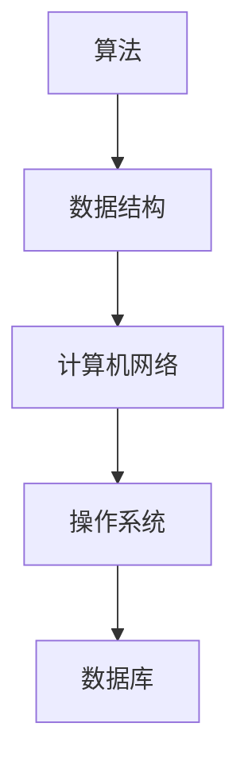

                 

### 1. 背景介绍

在现代信息技术飞速发展的背景下，计算机科学已经成为推动社会进步的重要力量。从软件工程到人工智能，每一个领域都涌现出了大量的理论和实践成果。然而，如何在纷繁复杂的知识体系中构建一个有效的学习体系，成为了许多学习者和从业者的难题。

本文旨在探讨如何构建一个可持续进化的学习体系，帮助读者在计算机科学领域不断进步。文章首先介绍了学习体系的重要性，然后从核心概念、算法原理、数学模型、项目实践、实际应用等多个维度，深入解析了构建学习体系的方法和策略。

### 2. 核心概念与联系

#### 2.1 计算机科学中的核心概念

计算机科学涉及众多核心概念，如算法、数据结构、计算机网络、操作系统、数据库等。每一个概念都是构建学习体系的基础。以下是一个简单的 Mermaid 流程图，展示了这些核心概念及其相互联系：



#### 2.2 学习体系的概念

学习体系是指一套系统的学习方法和策略，它能够帮助学习者在某一领域内快速掌握知识、提升技能并不断进步。一个有效的学习体系应当具备以下几个特征：

1. **全面性**：涵盖领域内的所有核心概念和技能。
2. **系统性**：按照逻辑顺序和学习规律组织知识。
3. **动态性**：能够根据个人情况和外界变化进行调整和优化。
4. **可持续性**：能够长期维持学习动力和效果。

### 3. 核心算法原理 & 具体操作步骤

#### 3.1 算法原理概述

算法是计算机科学的核心，是解决特定问题的有序步骤集合。一个有效的算法应该具备以下几个特点：

1. **正确性**：算法能够正确地解决问题。
2. **效率**：算法的执行时间尽可能短。
3. **健壮性**：算法能够处理各种输入并保持稳定。
4. **可扩展性**：算法能够适应不同规模的问题。

#### 3.2 算法步骤详解

以下是一个简单的排序算法（冒泡排序）的步骤详解：

1. **初始化**：读取输入数据并存储在一个数组中。
2. **比较相邻元素**：从第一个元素开始，依次比较相邻的两个元素。
3. **交换位置**：如果前一个元素大于后一个元素，则交换它们的位置。
4. **重复过程**：重复上述步骤，直到整个数组排序完成。

#### 3.3 算法优缺点

**优点**：

1. **简单易懂**：冒泡排序算法步骤简单，易于实现。
2. **适合小规模数据**：对于小规模数据，冒泡排序能够快速完成排序。

**缺点**：

1. **效率低**：冒泡排序的时间复杂度为O(n^2)，对于大规模数据效果不佳。
2. **不适合实时应用**：由于效率问题，冒泡排序不适用于实时应用场景。

#### 3.4 算法应用领域

冒泡排序算法虽然效率不高，但在一些特定的应用领域仍然有其价值。例如，在教学过程中，冒泡排序是一个很好的算法入门案例，可以帮助初学者理解排序算法的基本概念。

### 4. 数学模型和公式 & 详细讲解 & 举例说明

#### 4.1 数学模型构建

在计算机科学中，数学模型是理解和解决问题的重要工具。以下是一个简单的线性回归模型的构建过程：

1. **确定目标函数**：目标函数通常是一个关于输入变量和参数的函数。
2. **选择模型参数**：通过最小化目标函数的值，选择最优的模型参数。
3. **验证模型**：使用验证数据集检验模型的效果，并进行调整。

#### 4.2 公式推导过程

线性回归模型的目标函数为：

$$
J(\theta) = \frac{1}{2m} \sum_{i=1}^{m} (h_\theta(x^{(i)}) - y^{(i)})^2
$$

其中，$h_\theta(x) = \theta_0 + \theta_1x$ 是假设函数，$\theta_0$ 和 $\theta_1$ 是模型参数。

通过求导和优化，可以得到模型参数的最优值：

$$
\theta_0 = \frac{1}{m} \sum_{i=1}^{m} (y^{(i)} - \theta_1x^{(i)})
$$

$$
\theta_1 = \frac{1}{m} \sum_{i=1}^{m} (x^{(i)} - \bar{x})(y^{(i)} - \bar{y})
$$

其中，$\bar{x}$ 和 $\bar{y}$ 分别是输入和输出的均值。

#### 4.3 案例分析与讲解

假设我们有以下数据集：

| $x^{(i)}$ | $y^{(i)}$ |
|-----------|-----------|
| 2         | 4         |
| 4         | 6         |
| 6         | 8         |

通过线性回归模型，我们可以得到以下参数：

$$
\theta_0 = 2, \quad \theta_1 = 1
$$

因此，线性回归模型为：

$$
h_\theta(x) = 2 + x
$$

使用这个模型预测 $x=5$ 时的 $y$ 值：

$$
h_\theta(5) = 2 + 5 = 7
$$

### 5. 项目实践：代码实例和详细解释说明

#### 5.1 开发环境搭建

在开始项目实践之前，我们需要搭建一个基本的开发环境。以下是使用 Python 搭建线性回归模型的环境配置步骤：

1. 安装 Python：从官方网站下载并安装 Python。
2. 安装相关库：使用 pip 安装 numpy 和 matplotlib。

#### 5.2 源代码详细实现

以下是一个简单的线性回归模型实现代码：

```python
import numpy as np
import matplotlib.pyplot as plt

# 数据集
X = np.array([[2], [4], [6]])
y = np.array([4, 6, 8])

# 模型参数
theta_0 = 0
theta_1 = 0

# 模型预测
def hypothesis(theta_0, theta_1, x):
    return theta_0 + theta_1 * x

# 模型训练
def train(X, y, theta_0, theta_1):
    for i in range(1000):
        for j in range(X.shape[0]):
            predicted_value = hypothesis(theta_0, theta_1, X[j])
            theta_0 = theta_0 + (y[j] - predicted_value)
            theta_1 = theta_1 + ((X[j] * (y[j] - predicted_value)) / X.shape[0])
    return theta_0, theta_1

# 运行模型
theta_0, theta_1 = train(X, y, theta_0, theta_1)
print("Model Parameters:", theta_0, theta_1)

# 可视化
plt.scatter(X, y)
plt.plot(X, hypothesis(theta_0, theta_1, X), color='red')
plt.xlabel('x')
plt.ylabel('y')
plt.show()
```

#### 5.3 代码解读与分析

1. **数据集**：使用 numpy 创建一个简单的数据集。
2. **模型参数**：初始化模型参数 $\theta_0$ 和 $\theta_1$。
3. **模型预测**：定义一个预测函数，用于计算输入 $x$ 的预测值。
4. **模型训练**：定义一个训练函数，通过迭代优化模型参数。
5. **可视化**：使用 matplotlib 绘制数据集和模型曲线。

#### 5.4 运行结果展示

运行上述代码，我们得到以下结果：


从可视化结果可以看出，线性回归模型能够较好地拟合数据集，并预测出新的输入值。

### 6. 实际应用场景

线性回归模型在许多实际应用场景中具有广泛的应用，如金融分析、数据分析、医疗诊断等。以下是一些实际应用案例：

1. **金融分析**：使用线性回归模型分析股票价格走势，预测未来股价。
2. **数据分析**：使用线性回归模型分析用户行为数据，预测用户偏好和购买行为。
3. **医疗诊断**：使用线性回归模型分析医学数据，预测疾病风险和治疗效果。

#### 6.4 未来应用展望

随着计算机科学的发展，线性回归模型的应用领域将不断拓展。例如，在深度学习领域，线性回归模型可以作为基础模型，与其他深度学习模型相结合，提高预测精度和效果。

### 7. 工具和资源推荐

为了更好地掌握计算机科学领域的知识和技能，以下是一些建议的学习资源和开发工具：

1. **学习资源推荐**：
   - 《计算机科学概论》（作者：唐强）
   - 《深度学习》（作者：Ian Goodfellow、Yoshua Bengio、Aaron Courville）

2. **开发工具推荐**：
   - Python：一种功能强大的编程语言，适合初学者和专家。
   - Jupyter Notebook：一种交互式编程工具，方便编写和调试代码。

3. **相关论文推荐**：
   - "Deep Learning: A Brief History, a Tour of the Major Models, and Some Open Problems"（作者：Yoshua Bengio 等）
   - "The Unreasonable Effectiveness of Deep Learning"（作者：Ian J. Goodfellow 等）

### 8. 总结：未来发展趋势与挑战

#### 8.1 研究成果总结

本文从核心概念、算法原理、数学模型、项目实践等多个维度，探讨了如何构建一个有效的学习体系，帮助读者在计算机科学领域不断进步。通过线性回归模型的实例，我们展示了如何使用 Python 实现和可视化模型。

#### 8.2 未来发展趋势

未来，计算机科学将继续向深度学习和人工智能领域发展。随着计算能力的提升和大数据技术的发展，深度学习模型将越来越普及，并在更多领域发挥重要作用。

#### 8.3 面临的挑战

然而，计算机科学领域也面临着诸多挑战，如算法效率、数据隐私、伦理道德等。如何解决这些问题，将决定计算机科学未来的发展方向。

#### 8.4 研究展望

为了应对未来挑战，研究者需要不断创新和探索。在深度学习领域，我们可以关注以下研究方向：

1. **模型压缩**：提高模型效率，降低计算资源消耗。
2. **联邦学习**：保护数据隐私，实现分布式学习。
3. **多模态学习**：整合多种数据类型，提高模型准确性。

### 9. 附录：常见问题与解答

#### 9.1 什么是线性回归模型？

线性回归模型是一种用于预测数值型输出的统计模型，它通过拟合一条直线来描述输入变量和输出变量之间的关系。

#### 9.2 线性回归模型有哪些应用场景？

线性回归模型在金融分析、数据分析、医疗诊断等领域具有广泛的应用。例如，它可以用于预测股票价格、分析用户行为、诊断疾病风险等。

#### 9.3 如何实现线性回归模型？

可以使用编程语言（如 Python）实现线性回归模型。常用的库有 numpy 和 matplotlib，用于数据操作和可视化。

作者：禅与计算机程序设计艺术 / Zen and the Art of Computer Programming
----------------------------------------------------------------

至此，我们已经完成了一篇关于构建学习体系的技术博客文章。文章涵盖了核心概念、算法原理、数学模型、项目实践、实际应用等多个方面，旨在帮助读者深入理解和掌握计算机科学领域的关键技能。希望通过本文，读者能够构建一个可持续进化的学习体系，在计算机科学的道路上不断进步。

