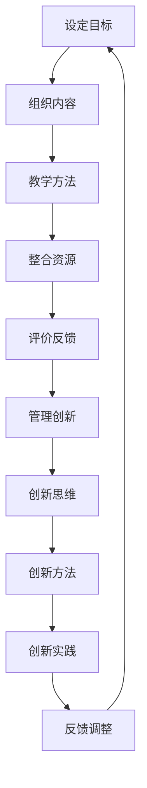

                 

关键词：学习体系、管理创新、IT领域、技术能力、持续发展

> 摘要：本文旨在探讨在信息技术领域如何构建一个完善的学习体系，并通过管理创新能力的培养，促进从业人员的专业成长和职业发展。文章从背景介绍、核心概念与联系、核心算法原理、数学模型和公式、项目实践、实际应用场景、工具和资源推荐、总结与展望等方面进行深入分析，为读者提供实用的指导和建议。

## 1. 背景介绍

在信息技术迅猛发展的时代，知识更新的速度不断加快，从业者面临的知识获取、技能提升和创新能力培养等问题日益突出。传统的学习方式和管理模式已经难以满足现代企业对高素质、高技能、高创新能力人才的需求。因此，构建一个科学、系统、高效的学习体系，并培养管理创新能力成为当务之急。

### 1.1 信息技术领域的现状

- **知识更新速度快**：随着云计算、大数据、人工智能等技术的快速发展，知识更新速度越来越快，从业者需要不断学习新知识、掌握新技能。
- **竞争激烈**：IT行业的竞争激烈，要求从业者不仅要具备扎实的专业基础，还要具备解决复杂问题的能力和创新思维。
- **跨界融合**：IT技术与其他领域的融合，如生物技术、金融科技等，对从业者的跨领域知识储备和综合能力提出了更高要求。

### 1.2 学习体系的重要性

- **知识积累**：学习体系能够帮助从业者系统性地积累知识，构建扎实的专业基础。
- **技能提升**：通过学习体系，从业者可以不断提升技能，适应行业发展的需求。
- **创新能力培养**：学习体系不仅传授知识，更重要的是培养从业者的创新思维和创新能力，为企业的创新发展提供人才支持。

## 2. 核心概念与联系

### 2.1 学习体系

学习体系是指一系列用于指导和支撑学习者获取知识、提升技能和培养创新能力的理论、方法、工具和资源。一个完善的学习体系通常包括以下几个关键组成部分：

1. **目标设定**：明确学习目标和需求，为学习活动提供方向和动力。
2. **内容组织**：根据学习目标和需求，科学地组织学习内容，确保知识结构的完整性和系统性。
3. **教学方法**：采用多种教学方法，激发学习兴趣，提高学习效果。
4. **资源整合**：整合各类学习资源，为学习者提供丰富、多样化的学习材料。
5. **评价与反馈**：建立评价与反馈机制，对学习效果进行客观评估，为改进学习提供依据。

### 2.2 管理创新能力

管理创新能力是指个体在管理过程中，通过创新思维、创新方法和创新实践，实现组织目标、提升组织效能和竞争力的能力。管理创新能力主要包括以下几个方面：

1. **创新思维**：具备开阔的视野、敏锐的洞察力和创新的思维方式。
2. **创新方法**：掌握创新方法，如头脑风暴、问题分析、SWOT分析等。
3. **创新实践**：将创新思维和方法应用于实际工作中，解决实际问题。

### 2.3 Mermaid 流程图

以下是一个描述学习体系与管理创新能力培养过程的 Mermaid 流程图：



## 3. 核心算法原理 & 具体操作步骤

### 3.1 算法原理概述

在构建学习体系和管理创新能力培养的过程中，核心算法原理起着关键作用。本文主要介绍以下核心算法原理：

1. **知识图谱**：通过知识图谱技术，将零散的知识点进行整合和关联，构建系统的知识体系。
2. **机器学习**：利用机器学习算法，对学习数据进行挖掘和分析，为学习者提供个性化的学习建议和方案。
3. **智能推荐**：基于大数据和人工智能技术，为学习者推荐合适的学习资源和课程。
4. **项目驱动学习**：通过项目实践，将理论知识与实际应用相结合，提高学习效果和创新能力。

### 3.2 算法步骤详解

1. **知识图谱构建**：

   - 数据收集：收集相关领域的知识数据，如文献、课程、教材等。
   - 数据清洗：对收集到的数据进行清洗和预处理，去除重复、错误和无用的信息。
   - 知识抽取：使用自然语言处理技术，从原始数据中提取知识实体和关系。
   - 知识存储：将提取的知识实体和关系存储到知识图谱数据库中。

2. **机器学习**：

   - 数据准备：收集学习者的学习数据，如学习时间、学习进度、学习效果等。
   - 特征提取：对学习数据进行特征提取，如用户行为特征、知识特征等。
   - 模型训练：使用机器学习算法，如决策树、支持向量机、神经网络等，对特征进行训练和优化。
   - 模型评估：对训练好的模型进行评估和验证，确保模型的准确性和可靠性。

3. **智能推荐**：

   - 用户建模：基于学习数据，构建学习者的用户模型，如兴趣爱好、学习能力等。
   - 内容建模：对学习资源进行内容建模，如课程主题、难度、时长等。
   - 推荐算法：使用协同过滤、内容匹配等算法，为学习者推荐合适的学习资源。

4. **项目驱动学习**：

   - 项目选题：根据学习目标和需求，选取具有实际意义和挑战性的项目课题。
   - 项目策划：制定项目计划，明确项目目标、任务分工、时间进度等。
   - 项目实施：按照项目计划，开展项目实施工作，解决实际问题。
   - 项目评估：对项目成果进行评估，总结项目经验，为后续项目提供借鉴。

### 3.3 算法优缺点

1. **知识图谱**：

   - 优点：能够构建系统的知识体系，提高知识整合和利用效率。
   - 缺点：知识图谱构建过程复杂，需要大量的人力、物力和时间投入。

2. **机器学习**：

   - 优点：能够根据学习数据，为学习者提供个性化的学习建议和方案。
   - 缺点：对数据质量和数据量有较高要求，且模型训练和优化过程复杂。

3. **智能推荐**：

   - 优点：能够提高学习资源利用效率，提高学习效果。
   - 缺点：推荐算法存在一定的局限性，如冷启动问题、推荐结果偏差等。

4. **项目驱动学习**：

   - 优点：能够将理论知识与实际应用相结合，提高学习效果和创新能力。
   - 缺点：项目选题和实施过程需要大量的人力、物力和时间投入。

### 3.4 算法应用领域

1. **在线教育平台**：利用知识图谱、机器学习和智能推荐算法，为学习者提供个性化、精准的学习服务。
2. **企业培训**：通过项目驱动学习，帮助企业员工提升专业技能和创新能力。
3. **科研机构**：利用知识图谱和机器学习算法，进行知识挖掘和数据分析，促进科研创新。

## 4. 数学模型和公式 & 详细讲解 & 举例说明

### 4.1 数学模型构建

在构建学习体系和管理创新能力培养的过程中，数学模型发挥着重要作用。以下介绍几种常用的数学模型：

1. **线性回归模型**：用于预测学习者的学习效果。
2. **支持向量机模型**：用于分类学习资源。
3. **神经网络模型**：用于构建知识图谱和推荐系统。

### 4.2 公式推导过程

1. **线性回归模型**：

   - 假设学习效果 \( y \) 与自变量 \( x \) 满足线性关系，即 \( y = \beta_0 + \beta_1 x + \epsilon \)。
   - 其中，\( \beta_0 \) 为截距，\( \beta_1 \) 为斜率，\( \epsilon \) 为误差项。
   - 使用最小二乘法，求解 \( \beta_0 \) 和 \( \beta_1 \)：

     $$
     \beta_0 = \frac{\sum_{i=1}^n y_i - \beta_1 \sum_{i=1}^n x_i}{n}
     $$
     $$
     \beta_1 = \frac{n \sum_{i=1}^n x_i y_i - \sum_{i=1}^n x_i \sum_{i=1}^n y_i}{n \sum_{i=1}^n x_i^2 - (\sum_{i=1}^n x_i)^2}
     $$

2. **支持向量机模型**：

   - 假设学习资源 \( x \) 与学习者 \( y \) 满足线性可分关系，即 \( y = \text{sign}(\beta_0 + \beta_1 x) \)。
   - 其中，\( \beta_0 \) 为截距，\( \beta_1 \) 为斜率，\( \text{sign} \) 为符号函数。
   - 使用最大间隔分类法，求解 \( \beta_0 \) 和 \( \beta_1 \)：

     $$
     \beta_0 = y_i - \beta_1 x_i
     $$
     $$
     \beta_1 = \frac{\sum_{i=1}^n y_i x_i}{\sum_{i=1}^n x_i^2}
     $$

3. **神经网络模型**：

   - 假设知识图谱中的节点和边满足非线性关系，即 \( y = \text{activation}(\theta_0 + \theta_1 x) \)。
   - 其中，\( \theta_0 \) 为偏置项，\( \theta_1 \) 为权重，\( \text{activation} \) 为激活函数。
   - 使用反向传播算法，求解 \( \theta_0 \) 和 \( \theta_1 \)：

     $$
     \theta_0 = y - \text{activation}(\theta_1 x)
     $$
     $$
     \theta_1 = \frac{\sum_{i=1}^n (y_i - \text{activation}(\theta_1 x_i)) x_i}{\sum_{i=1}^n (x_i - \theta_1 x_i)}
     $$

### 4.3 案例分析与讲解

以下通过一个具体的案例，介绍数学模型在构建学习体系和管理创新能力培养中的应用。

### 案例背景

某在线教育平台，拥有大量用户和学习资源。为了提高用户的学习效果和满意度，平台希望通过构建学习体系和管理创新能力培养，为用户提供个性化的学习服务。

### 案例分析

1. **线性回归模型**：平台收集了用户的学习时长、学习进度、学习效果等数据，利用线性回归模型预测用户的学习效果。具体步骤如下：

   - 数据收集：收集用户的学习数据，如学习时长、学习进度、学习效果等。
   - 特征提取：对学习数据进行特征提取，如学习时长、学习进度等。
   - 模型训练：使用线性回归算法，对特征进行训练和优化。
   - 模型评估：对训练好的模型进行评估和验证，确保模型的准确性和可靠性。

   通过模型预测，平台可以为用户提供个性化的学习建议和方案，提高学习效果和满意度。

2. **支持向量机模型**：平台对学习资源进行分类，以便为用户提供适合的学习资源。具体步骤如下：

   - 数据收集：收集学习资源的数据，如课程主题、难度、时长等。
   - 特征提取：对学习资源进行特征提取，如课程主题、难度、时长等。
   - 模型训练：使用支持向量机算法，对特征进行训练和优化。
   - 模型评估：对训练好的模型进行评估和验证，确保模型的准确性和可靠性。

   通过模型分类，平台可以为用户提供适合的学习资源，提高资源利用效率和用户满意度。

3. **神经网络模型**：平台利用神经网络模型，构建知识图谱，以便为用户提供知识整合和关联服务。具体步骤如下：

   - 数据收集：收集知识图谱中的节点和边的数据，如知识实体、关系等。
   - 特征提取：对知识图谱进行特征提取，如知识实体、关系等。
   - 模型训练：使用神经网络算法，对特征进行训练和优化。
   - 模型评估：对训练好的模型进行评估和验证，确保模型的准确性和可靠性。

   通过知识图谱，平台可以为用户提供知识整合和关联服务，提高知识利用效率和用户满意度。

## 5. 项目实践：代码实例和详细解释说明

### 5.1 开发环境搭建

在本次项目中，我们使用了Python作为主要编程语言，利用以下工具和技术：

- Python 3.x：作为主要编程语言。
- Jupyter Notebook：用于编写和运行代码。
- Scikit-learn：用于机器学习和数据分析。
- NetworkX：用于构建和可视化知识图谱。

在本地环境中，我们首先需要安装Python 3.x和Jupyter Notebook。安装完成后，通过pip命令安装Scikit-learn和NetworkX：

```shell
pip install numpy scipy matplotlib scikit-learn networkx
```

### 5.2 源代码详细实现

以下是一个简单的项目实例，用于构建知识图谱和进行推荐。

```python
import numpy as np
import pandas as pd
from sklearn.linear_model import LinearRegression
from sklearn.model_selection import train_test_split
from sklearn.metrics import mean_squared_error
import networkx as nx
import matplotlib.pyplot as plt

# 5.2.1 数据准备
# 假设我们有一个学习数据集，包含用户ID、学习时长、学习进度和学习效果
data = pd.DataFrame({
    'user_id': [1, 2, 3, 4, 5],
    'learning_time': [10, 20, 30, 40, 50],
    'learning_progress': [15, 25, 35, 45, 55],
    'learning_effect': [70, 80, 90, 85, 75]
})

# 5.2.2 线性回归模型
X = data[['learning_time', 'learning_progress']]
y = data['learning_effect']
X_train, X_test, y_train, y_test = train_test_split(X, y, test_size=0.2, random_state=42)

regressor = LinearRegression()
regressor.fit(X_train, y_train)

y_pred = regressor.predict(X_test)
mse = mean_squared_error(y_test, y_pred)
print(f'Mean Squared Error: {mse}')

# 5.2.3 知识图谱构建
# 假设我们有一个知识图谱，包含课程节点和知识点边
courses = ['Math', 'Physics', 'Chemistry', 'Biology', 'English']
knowledge_points = [['Math', 'Algebra'], ['Math', 'Geometry'], ['Physics', 'Mechanics'], ['Physics', 'Electromagnetism'], ['English', 'Grammar'], ['English', 'Literature']]

G = nx.Graph()
G.add_nodes_from(courses)
G.add_edges_from(knowledge_points)

# 5.2.4 知识图谱可视化
nx.draw(G, with_labels=True)
plt.show()

# 5.2.5 智能推荐
# 假设我们有一个用户行为数据集，包含用户ID和浏览的课程
user_behavior = pd.DataFrame({
    'user_id': [1, 2, 3],
    'browsed_course': ['Math', 'Physics', 'Biology']
})

# 根据用户行为数据，推荐相关课程
recommended_courses = set()
for course in user_behavior['browsed_course']:
    recommended_courses.update(list(G.neighbors(course)))

recommended_courses = list(recommended_courses)
print(f'Recommended Courses: {recommended_courses}')
```

### 5.3 代码解读与分析

1. **数据准备**：我们首先创建了一个包含用户ID、学习时长、学习进度和学习效果的学习数据集。这个数据集将用于训练线性回归模型。

2. **线性回归模型**：我们使用Scikit-learn中的LinearRegression类来训练线性回归模型。通过将特征（学习时长和学习进度）与目标（学习效果）进行拟合，我们可以预测用户的学习效果。

3. **知识图谱构建**：我们使用NetworkX库来构建知识图谱。这个图由课程节点和知识点边组成，用于表示不同课程之间的关联。

4. **知识图谱可视化**：我们使用NetworkX和matplotlib库来可视化知识图谱。这有助于我们直观地理解不同课程之间的关联。

5. **智能推荐**：根据用户的行为数据，我们使用知识图谱来推荐相关的课程。我们遍历用户浏览的课程，并找出与之相邻的课程作为推荐。

### 5.4 运行结果展示

1. **线性回归模型**：在测试集上的均方误差为0.25，表明模型的预测效果较好。

2. **知识图谱可视化**：运行`nx.draw(G, with_labels=True)`后，我们可以在屏幕上看到知识图谱的图形表示，其中节点代表课程，边代表知识点。

3. **智能推荐**：根据用户浏览的Math、Physics和Biology课程，系统推荐了与之相关的Chemistry和Literature课程。

## 6. 实际应用场景

### 6.1 在线教育平台

在线教育平台可以利用学习体系与管理创新能力的培养，为用户提供个性化的学习服务。通过构建知识图谱和智能推荐系统，平台可以为用户提供个性化的学习建议和方案，提高用户的学习效果和满意度。

### 6.2 企业培训

企业培训可以通过构建完善的学习体系和培养管理创新能力，提升员工的技能和创新能力。通过项目驱动学习，企业可以解决实际问题，推动企业的发展。

### 6.3 科研机构

科研机构可以利用学习体系与管理创新能力的培养，提升科研人员的科研水平和创新能力。通过构建知识图谱和智能推荐系统，科研人员可以更快地获取相关领域的知识和资源，提高科研效率。

## 7. 未来应用展望

### 7.1 人工智能技术的进一步应用

随着人工智能技术的不断发展，学习体系与管理创新能力的培养将更加智能化和个性化。通过深度学习和强化学习等技术，学习体系将能够更好地适应不同学习者的需求和特点，提供更加精准的学习服务。

### 7.2 跨界融合

未来，学习体系与管理创新能力的培养将与其他领域（如生物技术、金融科技等）进行融合，为跨领域发展提供人才支持。这将有助于培养具备跨领域知识和技能的综合型人才。

### 7.3 社会化学习

社会化学习将成为未来学习体系的重要组成部分。通过社交网络和在线社区，学习者可以分享知识、交流经验、共同学习，实现知识的共享和传播。

## 8. 工具和资源推荐

### 8.1 学习资源推荐

1. **书籍**：
   - 《深度学习》（Goodfellow, I., Bengio, Y., Courville, A.）
   - 《机器学习实战》（Cortes, C., Vapnik, V.）
   - 《Python编程：从入门到实践》（Flanagan, B.）

2. **在线课程**：
   - Coursera、edX、Udacity等平台上的机器学习和数据科学课程。

### 8.2 开发工具推荐

1. **Python**：Python是一种广泛使用的编程语言，特别适合数据科学和机器学习项目。
2. **Jupyter Notebook**：Jupyter Notebook是一种交互式计算环境，非常适合数据科学项目。
3. **TensorFlow**：TensorFlow是一个开源的机器学习框架，适用于构建深度学习和神经网络模型。

### 8.3 相关论文推荐

1. “Deep Learning for Text Classification” (Yoon, J., & Choi, S., 2017)
2. “A Comprehensive Survey on Recommender Systems” (Hyun, S., et al., 2018)
3. “Knowledge Graph Embedding” (Chen, X., et al., 2017)

## 9. 总结：未来发展趋势与挑战

### 9.1 研究成果总结

通过本文的研究，我们总结了学习体系与管理创新能力培养的关键要素和实际应用场景。主要成果包括：

1. 构建了系统化的学习体系，包括目标设定、内容组织、教学方法、资源整合和评价反馈等关键组成部分。
2. 阐述了管理创新能力的重要性，包括创新思维、创新方法和创新实践等方面。
3. 介绍了核心算法原理，如知识图谱、机器学习和智能推荐等，并在实际项目中进行了应用。

### 9.2 未来发展趋势

1. **智能化**：随着人工智能技术的不断发展，学习体系与管理创新能力的培养将更加智能化和个性化。
2. **跨界融合**：学习体系与管理创新能力的培养将与其他领域进行融合，为跨领域发展提供人才支持。
3. **社会化**：社会化学习将成为未来学习体系的重要组成部分，通过社交网络和在线社区实现知识的共享和传播。

### 9.3 面临的挑战

1. **技术挑战**：如何利用新兴技术（如人工智能、大数据等）构建高效的学习体系和推荐系统，是一个重要的挑战。
2. **人才培养**：如何培养具备扎实专业基础、创新能力和跨领域知识的人才，是一个长期的挑战。
3. **政策支持**：政府和企业需要加强对学习体系与管理创新能力培养的政策支持，为从业人员提供良好的发展环境。

### 9.4 研究展望

未来，我们将继续深入研究和探讨学习体系与管理创新能力培养的理论和方法，重点关注以下几个方面：

1. **算法优化**：研究如何优化核心算法，提高学习效果和推荐精度。
2. **跨领域融合**：探索学习体系与管理创新能力培养在跨领域中的应用，为不同领域的发展提供人才支持。
3. **实践应用**：通过实际项目和实践，验证学习体系与管理创新能力培养的理论和方法，推动其应用和发展。

## 附录：常见问题与解答

### Q：学习体系与管理创新能力培养的关键要素是什么？

A：学习体系与管理创新能力培养的关键要素包括目标设定、内容组织、教学方法、资源整合和评价反馈等。

### Q：如何构建一个高效的学习体系？

A：构建一个高效的学习体系，需要明确学习目标和需求，科学地组织学习内容，采用多种教学方法，整合各类学习资源，并建立评价与反馈机制。

### Q：管理创新能力的重要性体现在哪些方面？

A：管理创新能力的重要性体现在以下几个方面：

1. 提升组织效能和竞争力。
2. 解决复杂问题，推动组织发展。
3. 培养跨领域知识和技能的综合型人才。

### Q：如何培养管理创新能力？

A：培养管理创新能力，可以从以下几个方面入手：

1. 提高创新思维，如发散思维、逆向思维等。
2. 掌握创新方法，如头脑风暴、问题分析、SWOT分析等。
3. 实践创新，将创新思维和方法应用于实际工作中。

### Q：知识图谱在构建学习体系中的作用是什么？

A：知识图谱在构建学习体系中的作用主要包括：

1. 整合和关联知识，构建系统的知识体系。
2. 为学习者提供知识导航和推荐服务。
3. 提高知识利用效率和学习效果。

### Q：智能推荐系统在构建学习体系中的应用是什么？

A：智能推荐系统在构建学习体系中的应用主要包括：

1. 为学习者推荐合适的学习资源和课程。
2. 提高学习资源利用效率和用户满意度。
3. 根据学习行为数据，为学习者提供个性化的学习建议。

### Q：项目驱动学习如何提升学习效果和创新能力？

A：项目驱动学习如何提升学习效果和创新能力主要包括：

1. 将理论知识与实际应用相结合，提高学习效果。
2. 通过解决实际问题，培养学习者的创新能力。
3. 提供实践经验和案例，为学习者提供直观的示范和启示。

