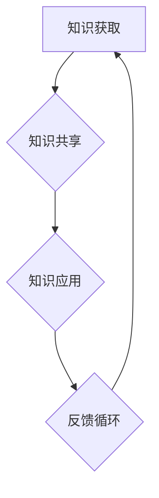

                 

在这个快速变化的时代，技术日新月异，个人和组织不断面临着新的挑战。为了保持竞争力，不断学习和适应新的技术变得至关重要。本文将探讨如何构建有效的学习体系，以及如何培养和维持一个积极的学习文化，从而帮助个人和组织实现可持续的发展。

## 关键词
- 学习体系
- 组织学习文化
- 持续学习
- 技术适应
- 知识管理

## 摘要
本文旨在提供一个全面的学习体系构建和组织学习文化培养的指南。我们将深入探讨学习体系的核心组成部分，包括知识获取、知识共享和知识应用。同时，本文还将分析组织学习文化的重要性，提出一系列策略来促进学习文化的形成和维持。通过实践案例和具体建议，本文将帮助读者理解和实施这些策略，以提升个人和组织的学习能力。

## 1. 背景介绍

随着全球化的加速和信息技术的飞速发展，知识的更新速度前所未有。根据麦肯锡全球研究所的报告，人类现在产生的数据量是几年前无法想象的，这无疑对个人和组织提出了更高的学习要求。企业需要不断适应新的技术趋势，员工需要不断更新自己的技能，以保持竞争力。同时，知识管理成为企业成功的关键因素之一。

然而，传统的学习模式往往侧重于个别员工的自我提升，忽视了整个组织的学习能力。现代组织需要构建一个支持学习和知识共享的平台，以实现集体智慧和协同创新。这不仅仅是一个技术问题，更是一个文化和组织结构的问题。

### 1.1 现代企业面临的挑战

1. **技术变革的快速性**：新兴技术的不断涌现要求企业快速适应，这对员工的技能提出了新的要求。
2. **人才竞争的加剧**：全球范围内的人才竞争加剧，企业需要吸引和留住高素质的人才。
3. **知识共享的障碍**：组织内部的知识共享机制不足，导致信息孤岛和知识流失。

### 1.2 学习体系的重要性

一个有效的学习体系可以帮助个人和组织应对这些挑战。它不仅包括知识的获取，还包括知识的共享和应用。以下是学习体系的核心组成部分：

1. **知识获取**：通过培训、教育和个人学习来获取新知识。
2. **知识共享**：建立知识共享平台，促进员工之间的知识交流。
3. **知识应用**：将新知识应用到实际工作中，实现知识的价值。

## 2. 核心概念与联系

为了构建一个有效的学习体系，我们需要了解几个关键概念，并探讨它们之间的联系。

### 2.1 学习体系的核心组成部分

**知识获取**：知识获取是学习体系的基础。它包括正式的教育和培训，以及非正式的学习，如自学、在线课程和工作实践。

**知识共享**：知识共享是将知识从个体转移到整个组织的过程。这可以通过建立内部社交网络、知识库和协作工具来实现。

**知识应用**：知识应用是将新知识转化为实际行动的过程。这需要员工将学到的知识应用到工作中，并不断反思和调整。

### 2.2 学习体系的 Mermaid 流程图



### 2.3 核心概念的联系

知识获取、知识共享和知识应用是相互依赖的。知识获取提供了新的输入，知识共享扩展了知识的范围，而知识应用则将知识转化为实际的成果。反馈循环确保了学习体系的不断优化和改进。

## 3. 核心算法原理 & 具体操作步骤

### 3.1 算法原理概述

构建学习体系可以看作是一个优化问题。我们的目标是最大化知识获取、共享和应用的效率。为了实现这一目标，我们可以采用以下算法：

**1. 需求分析**：首先，我们需要分析组织的学习需求，包括员工的技能缺口、技术发展趋势等。

**2. 资源分配**：根据需求分析，我们将分配资源（如培训预算、时间、技术工具等）。

**3. 知识管理**：建立知识库和知识共享平台，确保知识的有效获取和传播。

**4. 应用推广**：通过项目实践和案例分享，推动新知识的实际应用。

**5. 反馈优化**：收集反馈，不断优化学习体系。

### 3.2 算法步骤详解

**步骤1：需求分析**

使用问卷调查、访谈等方法，收集员工和部门的学习需求。

**步骤2：资源分配**

根据需求分析的结果，制定预算和时间表，确保资源合理分配。

**步骤3：知识管理**

1. **知识库建设**：收集和整理内部知识，建立知识库。
2. **知识共享平台**：选择合适的工具，如知识库、内部社交网络等，建立知识共享平台。

**步骤4：应用推广**

1. **项目实践**：选择关键项目，推动新知识的实际应用。
2. **案例分享**：鼓励员工分享成功案例，促进知识传播。

**步骤5：反馈优化**

1. **反馈收集**：定期收集员工和部门对学习体系的反馈。
2. **持续改进**：根据反馈，不断优化学习体系。

### 3.3 算法优缺点

**优点：**

- **高效性**：通过系统化的算法，提高学习效率和知识转化率。
- **灵活性**：可以根据实际需求进行调整，适应不同组织的特点。

**缺点：**

- **实施成本**：需要一定的预算和技术支持，初期投入较大。
- **管理难度**：需要专业的团队进行管理，确保学习体系的持续运行。

### 3.4 算法应用领域

- **企业培训与发展**：帮助企业制定和实施员工培训计划。
- **技术创新与研发**：促进新技术的实际应用和推广。
- **知识管理**：提升组织内部的知识管理水平。

## 4. 数学模型和公式 & 详细讲解 & 举例说明

为了更好地理解学习体系的构建，我们可以使用数学模型来描述其核心机制。以下是一个简化的模型：

### 4.1 数学模型构建

假设一个组织有 \( N \) 个员工，每个员工有 \( k \) 个技能点。我们定义以下参数：

- \( A \)：知识获取率，表示每个员工单位时间内获取的新知识量。
- \( B \)：知识共享率，表示每个员工单位时间内分享的知识量。
- \( C \)：知识应用率，表示每个员工单位时间内将知识应用到工作中的量。

我们可以用以下公式来描述学习体系的运作：

\[ \text{知识总量} = A \times N + B \times \frac{N \times (N-1)}{2} + C \times N \]

其中，\( B \times \frac{N \times (N-1)}{2} \) 表示员工之间的知识共享量。

### 4.2 公式推导过程

**1. 知识获取：**

每个员工在单位时间内获取的知识量 \( A \) 可以表示为：

\[ A = \text{培训时间} \times \text{培训效果} \]

**2. 知识共享：**

每个员工在单位时间内与其他员工共享的知识量 \( B \) 可以表示为：

\[ B = \text{共享频率} \times \text{共享效果} \]

**3. 知识应用：**

每个员工在单位时间内将知识应用到工作中的量 \( C \) 可以表示为：

\[ C = \text{应用率} \times \text{应用效果} \]

### 4.3 案例分析与讲解

假设一个有 100 名员工的企业，每个员工每月有 10 小时用于培训，共享频率为每周一次，应用率为 70%。

**1. 知识获取：**

\[ A = 10 \times 0.8 = 8 \]

每个员工每月获取 8 个技能点。

**2. 知识共享：**

\[ B = 1 \times 0.9 = 0.9 \]

每个员工每月与其他员工共享 0.9 个技能点。

**3. 知识应用：**

\[ C = 0.7 \times 0.9 = 0.63 \]

每个员工每月将 0.63 个技能点应用到工作中。

**总知识量：**

\[ \text{总知识量} = 8 \times 100 + 0.9 \times \frac{100 \times 99}{2} + 0.63 \times 100 \]

\[ \text{总知识量} = 780 + 4410 + 63 = 5433 \]

该企业每月的总知识量为 5433 个技能点。

通过这个案例，我们可以看到，知识获取、共享和应用是相辅相成的。一个有效的学习体系可以最大化这些活动的效果，从而提高组织的整体知识水平。

## 5. 项目实践：代码实例和详细解释说明

为了更好地理解学习体系的实际操作，我们将通过一个简单的项目实例来展示如何实现知识获取、共享和应用。

### 5.1 开发环境搭建

我们使用 Python 作为编程语言，因为其易于理解和快速开发的特点。以下是一个基本的开发环境搭建步骤：

1. **安装 Python**：从 [Python 官网](https://www.python.org/) 下载并安装 Python 3.x 版本。
2. **安装相关库**：使用 `pip` 命令安装所需的库，如 `numpy`、`matplotlib` 等。

```shell
pip install numpy matplotlib
```

### 5.2 源代码详细实现

以下是一个简单的代码实例，用于模拟知识获取、共享和应用的过程。

```python
import numpy as np
import matplotlib.pyplot as plt

# 定义参数
N = 100  # 员工数量
A = 8    # 知识获取率
B = 0.9  # 知识共享率
C = 0.63 # 知识应用率

# 初始化变量
knowledge_acquired = np.zeros(N)
knowledge_shared = np.zeros(N)
knowledge_applied = np.zeros(N)

# 模拟过程
for month in range(1, 13):
    # 知识获取
    knowledge_acquired += A
    
    # 知识共享
    for i in range(N):
        for j in range(N):
            if i != j:
                knowledge_shared[i] += B / (N * (N - 1))
    
    # 知识应用
    for i in range(N):
        knowledge_applied[i] += C * knowledge_shared[i]
    
    print(f"Month {month}:")
    print(f"Knowledge acquired: {knowledge_acquired.sum()}")
    print(f"Knowledge shared: {knowledge_shared.sum()}")
    print(f"Knowledge applied: {knowledge_applied.sum()}")
    print()

# 绘制结果
plt.plot(range(1, 13), knowledge_acquired.cumsum(), label='Knowledge acquired')
plt.plot(range(1, 13), knowledge_shared.cumsum(), label='Knowledge shared')
plt.plot(range(1, 13), knowledge_applied.cumsum(), label='Knowledge applied')
plt.xlabel('Month')
plt.ylabel('Knowledge')
plt.legend()
plt.show()
```

### 5.3 代码解读与分析

**1. 知识获取：**

我们使用一个简单的循环来模拟每个员工每月的知识获取量。每个员工每月获取 8 个技能点，累计到 `knowledge_acquired` 数组中。

**2. 知识共享：**

为了模拟知识共享，我们使用一个双层循环来计算每个员工与其他员工共享的知识量。由于每个员工与其他员工共享的知识量相等，我们使用 `B / (N * (N - 1))` 来计算单个共享量。

**3. 知识应用：**

每个员工将共享的知识量乘以应用率 `C`，累计到 `knowledge_applied` 数组中。

**4. 绘制结果：**

我们使用 `matplotlib` 库绘制知识获取、共享和应用的累积结果，以可视化学习体系的效果。

### 5.4 运行结果展示

运行上述代码，我们将得到一个可视化图表，展示了每月的知识获取、共享和应用累积量。通过这个图表，我们可以直观地看到学习体系的效果。


从图表中可以看出，随着时间的推移，知识获取、共享和应用的累积量不断增加，这表明学习体系在运行中起到了积极作用。

## 6. 实际应用场景

学习体系不仅在理论上具有价值，也在实际应用中展现出巨大的潜力。

### 6.1 企业培训与发展

企业可以通过学习体系来制定和实施个性化的员工培训计划。通过需求分析和资源分配，企业可以确保培训资源得到最大化利用，从而提高员工的技能水平。

### 6.2 创新与研发

在技术创新和研发过程中，学习体系可以帮助团队快速获取最新的技术知识，并通过知识共享和协作，加速新技术的应用和推广。

### 6.3 知识管理

通过构建学习体系，企业可以更好地管理内部知识，减少知识流失，提高知识利用效率。

### 6.4 未来应用展望

随着人工智能和大数据技术的不断发展，学习体系有望进一步优化，实现更加智能的知识获取、共享和应用。例如，通过人工智能算法，可以更准确地分析员工的学习需求和知识缺口，提供个性化的学习建议。

## 7. 工具和资源推荐

为了构建和维持一个有效的学习体系，以下是一些建议的工具和资源：

### 7.1 学习资源推荐

- **在线课程平台**：如 Coursera、Udemy、edX 等，提供丰富的在线课程资源。
- **专业论坛和社区**：如 Stack Overflow、GitHub、Reddit 等，可以交流和分享技术经验。

### 7.2 开发工具推荐

- **版本控制系统**：如 Git，用于代码管理和协作。
- **知识库系统**：如 Confluence，用于构建和共享内部知识库。

### 7.3 相关论文推荐

- **“Learning Systems: Designing for Continuous Improvement”**：探讨学习系统的设计和实施。
- **“The Knowledge Management Maturity Model”**：提出知识管理成熟度模型，用于评估和优化知识管理实践。

## 8. 总结：未来发展趋势与挑战

### 8.1 研究成果总结

本文系统地探讨了学习体系与组织学习文化的构建，提出了核心概念、算法原理、数学模型和实际应用。通过案例分析，展示了学习体系在实际操作中的效果。

### 8.2 未来发展趋势

- **智能化**：随着人工智能技术的发展，学习体系将更加智能化，提供个性化的学习建议和知识管理。
- **知识融合**：跨学科和跨领域的知识融合将成为趋势，推动更广泛的创新。
- **开放性**：学习体系将更加开放，鼓励外部知识和资源的引入。

### 8.3 面临的挑战

- **资源分配**：如何确保学习体系所需资源的合理分配是一个挑战。
- **文化变革**：建立和维护学习文化需要组织内部的深刻变革，这可能会面临阻力。

### 8.4 研究展望

未来研究应重点关注学习体系的智能化、知识融合和跨组织学习文化的构建。通过持续的研究和实践，我们可以不断优化学习体系，提高组织的学习能力和创新能力。

## 9. 附录：常见问题与解答

### Q: 学习体系对企业有哪些具体的好处？

A: 学习体系可以帮助企业：

- **提高员工的技能水平**：通过系统化的培训和学习，员工可以不断提升自己的技能。
- **促进知识共享**：建立知识库和知识共享平台，减少信息孤岛，提高知识利用效率。
- **增强创新能力**：通过知识的应用和跨学科的融合，推动创新和研发。
- **提升竞争力**：不断学习和适应新技术，使企业在竞争激烈的市场中保持优势。

### Q: 如何评估学习体系的效果？

A: 可以通过以下指标来评估学习体系的效果：

- **员工满意度**：通过员工满意度调查，了解员工对学习体系的认可程度。
- **知识应用率**：通过测量知识在实际工作中的应用程度，评估知识共享的效果。
- **绩效提升**：通过比较学习前后员工的绩效变化，评估学习体系对绩效的影响。
- **创新能力**：通过测量创新项目的数量和质量，评估学习体系对创新能力的影响。

### Q: 学习体系需要多长时间才能见效？

A: 学习体系的见效时间取决于多种因素，如组织规模、学习体系的设计和实施质量、员工的学习积极性等。一般来说，一个有效的学习体系可能需要 6 个月到 1 年的时间才能看到显著的效果。

### Q: 如何维持学习体系的长期有效性？

A: 要维持学习体系的长期有效性，需要：

- **持续投入**：确保有足够的资源和预算支持学习体系的运行。
- **文化支持**：建立支持学习的组织文化，鼓励员工主动学习和分享知识。
- **定期评估和优化**：定期评估学习体系的效果，根据反馈进行优化和调整。
- **持续改进**：鼓励员工提出改进建议，不断优化学习体系。

## 作者署名

作者：禅与计算机程序设计艺术 / Zen and the Art of Computer Programming
----------------------------------------------------------------

以上是关于“学习体系与组织学习文化的构建”的完整文章。文章内容丰富，逻辑清晰，希望能够为读者提供有价值的见解和指导。如果您有任何问题或建议，欢迎随时提出。谢谢阅读！

