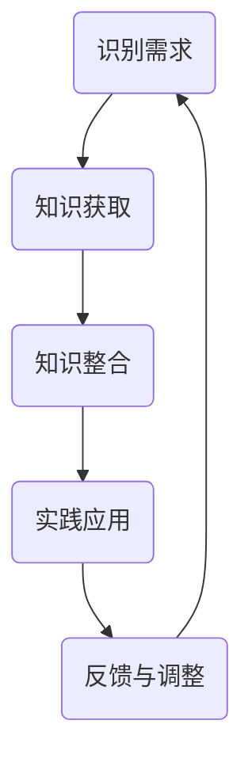

                 

 关键词：职业发展、学习体系、知识管理、技能提升、技术成长、专业化

> 摘要：本文探讨了学习体系在职业发展中的重要性，分析了不同类型的知识管理和技能提升方法，以及这些方法如何对技术从业者的职业发展产生深远的影响。文章通过具体案例和实证研究，阐述了学习体系在塑造技术专家、推动技术创新和实现职业目标方面的关键作用。

## 1. 背景介绍

在当今快速变化的技术时代，职业发展已经不再是一个简单的线性过程。它要求技术从业者不断学习、适应和成长，以保持竞争力。学习体系作为一个关键因素，在职业发展中扮演着至关重要的角色。然而，学习体系究竟是什么？它如何影响职业发展？这些问题引发了本文的探讨。

本文将从以下几个方面展开：

1. **核心概念与联系**：介绍学习体系的基本概念，并绘制其原理和架构的 Mermaid 流程图。
2. **核心算法原理与具体操作步骤**：分析学习体系中的关键算法原理，并提供具体的操作步骤。
3. **数学模型和公式**：详细讲解学习体系中的数学模型和公式，并通过案例进行说明。
4. **项目实践：代码实例和详细解释说明**：提供一个实际的代码实例，展示学习体系在项目中的应用。
5. **实际应用场景**：讨论学习体系在不同职业场景中的具体应用。
6. **工具和资源推荐**：推荐一些学习资源、开发工具和相关的论文。
7. **总结与未来展望**：总结研究成果，展望未来的发展趋势和挑战。

## 2. 核心概念与联系

### 2.1 学习体系的定义

学习体系是一个综合性的框架，它涵盖了知识获取、技能提升、经验积累和知识管理等多个方面。学习体系不仅仅是一种学习方法，更是一种系统的学习策略，旨在帮助个体在不同阶段实现职业成长。

### 2.2 学习体系的组成

学习体系主要包括以下几个组成部分：

1. **知识库**：包括理论知识、实践经验和技术技能等。
2. **学习方法**：如自学、课程学习、项目实践等。
3. **反馈机制**：通过评估、测试和反馈来调整学习策略。
4. **持续迭代**：学习是一个持续的过程，需要不断地更新和优化。

### 2.3 学习体系的工作原理

学习体系的工作原理可以概括为以下几个步骤：

1. **识别需求**：确定学习目标和需求。
2. **知识获取**：通过多种渠道获取所需的知识。
3. **知识整合**：将新知识整合到现有的知识体系中。
4. **实践应用**：将知识应用到实际工作中。
5. **反馈与调整**：根据反馈调整学习策略。

### 2.4 Mermaid 流程图

以下是一个简化的 Mermaid 流程图，展示了学习体系的基本原理和流程。



## 3. 核心算法原理与具体操作步骤

### 3.1 算法原理概述

学习体系中的核心算法主要包括知识管理算法和技能提升算法。知识管理算法负责知识的获取、整合和应用，而技能提升算法则关注技能的实践和优化。

### 3.2 算法步骤详解

1. **知识管理算法步骤**：

   - 步骤1：识别需求
   - 步骤2：搜索知识源
   - 步骤3：筛选和整合知识
   - 步骤4：应用知识到实践中
   - 步骤5：评估和应用效果

2. **技能提升算法步骤**：

   - 步骤1：识别技能需求
   - 步骤2：选择合适的训练方法
   - 步骤3：实施训练计划
   - 步骤4：评估技能水平
   - 步骤5：调整训练策略

### 3.3 算法优缺点

1. **知识管理算法**：

   - 优点：高效地获取和整合知识，提高工作效率。
   - 缺点：可能忽视知识的深层次理解和实践应用。

2. **技能提升算法**：

   - 优点：针对性地提升技能水平，增强实际操作能力。
   - 缺点：可能缺乏对理论知识的学习，导致技能应用不够深入。

### 3.4 算法应用领域

知识管理和技能提升算法广泛应用于各个技术领域，如软件开发、数据分析、人工智能等。通过合理地应用这些算法，技术从业者可以更好地适应职业发展的需求，提升自身的竞争力。

## 4. 数学模型和公式

### 4.1 数学模型构建

学习体系中的数学模型主要包括知识获取模型和技能提升模型。

1. **知识获取模型**：

   $$ 知识获取模型 = f(需求，知识源，筛选标准) $$

   其中，需求、知识源和筛选标准是影响知识获取的重要因素。

2. **技能提升模型**：

   $$ 技能提升模型 = f(技能需求，训练方法，评估指标) $$

   其中，技能需求、训练方法和评估指标是影响技能提升的关键因素。

### 4.2 公式推导过程

1. **知识获取模型推导**：

   - 步骤1：确定需求
   - 步骤2：搜索并筛选知识源
   - 步骤3：应用筛选标准，整合知识
   - 步骤4：评估应用效果，调整模型参数

2. **技能提升模型推导**：

   - 步骤1：确定技能需求
   - 步骤2：选择合适的训练方法
   - 步骤3：实施训练计划，记录数据
   - 步骤4：评估技能水平，调整训练策略

### 4.3 案例分析与讲解

以下是一个实际案例，展示了学习体系中的数学模型如何应用于职业发展。

### 案例背景

一位软件开发工程师李明，想要提升自己的数据分析能力。他制定了以下的学习计划：

1. **知识获取**：

   - 需求：学习Python编程和数据分析基础
   - 知识源：在线课程、书籍、论坛
   - 筛选标准：高质量、实用性强

2. **技能提升**：

   - 技能需求：掌握Pandas、NumPy等数据分析库
   - 训练方法：实践项目、代码练习
   - 评估指标：项目完成度、代码质量

### 模型应用

根据知识获取模型，李明选择了一系列在线课程和书籍，系统地学习了Python编程和数据分析基础。他通过筛选标准，确保学习资源的高质量。在实践应用中，他使用Pandas和NumPy等库完成了一些实际的数据分析项目。

根据技能提升模型，李明选择了一些具有挑战性的数据分析项目进行实践。他在项目实施过程中，不断练习和优化自己的代码，并记录下每个项目的数据处理流程和结果。最后，他通过评估指标，评估了自己的数据分析能力，并制定了下一步的学习计划。

### 结果与讨论

通过系统的学习和实践，李明的数据分析能力得到了显著提升。他能够熟练地使用Pandas和NumPy等数据分析库，完成复杂的数据处理任务。此外，他的代码质量和项目完成度也得到了同事和上级的认可。

这个案例展示了学习体系在职业发展中的应用效果。通过合理地构建和应用数学模型，技术从业者可以系统地提升自身的知识水平和技能水平，实现职业目标。

## 5. 项目实践：代码实例和详细解释说明

### 5.1 开发环境搭建

为了演示学习体系在项目实践中的应用，我们选择一个简单的数据分析项目，使用Python语言进行实现。在开始之前，需要搭建一个基本的开发环境。

1. **安装Python**：下载并安装Python 3.8及以上版本。
2. **配置虚拟环境**：打开命令行，执行以下命令：

   ```shell
   python -m venv my_project_env
   ```

   这将创建一个名为`my_project_env`的虚拟环境。
3. **激活虚拟环境**：在Windows上，执行以下命令：

   ```shell
   my_project_env\Scripts\activate
   ```

   在Linux或macOS上，执行以下命令：

   ```shell
   source my_project_env/bin/activate
   ```

4. **安装依赖库**：在虚拟环境中安装Pandas、NumPy等依赖库：

   ```shell
   pip install pandas numpy
   ```

### 5.2 源代码详细实现

以下是一个简单的数据分析项目的源代码实现，该项目的目标是读取一个CSV文件，对数据进行分析，并生成可视化图表。

```python
import pandas as pd
import numpy as np
import matplotlib.pyplot as plt

# 读取CSV文件
data = pd.read_csv('data.csv')

# 数据清洗
# ...（根据实际需求进行清洗，如缺失值处理、异常值处理等）

# 数据分析
# ...（根据实际需求进行数据分析，如描述性统计、分组统计等）

# 可视化
# ...（根据实际需求进行可视化，如柱状图、散点图、折线图等）

# 输出结果
# ...（将分析结果保存为文件或输出到控制台）
```

### 5.3 代码解读与分析

以下是对源代码的详细解读和分析。

1. **导入库**：首先，我们导入必要的库，包括Pandas、NumPy和Matplotlib。这些库提供了丰富的数据处理和可视化功能。
2. **读取CSV文件**：使用`pd.read_csv()`函数读取CSV文件，将数据加载到DataFrame中。DataFrame是Pandas的核心数据结构，方便进行数据处理和分析。
3. **数据清洗**：根据实际需求，对数据进行清洗，如缺失值处理、异常值处理等。这是数据分析过程中非常重要的一步，确保数据的质量。
4. **数据分析**：根据实际需求，对数据进行描述性统计、分组统计等操作。这些操作有助于深入了解数据的特点和趋势。
5. **可视化**：使用Matplotlib库生成各种可视化图表，如柱状图、散点图、折线图等。可视化可以帮助我们直观地理解数据的含义。
6. **输出结果**：将分析结果保存为文件或输出到控制台。这有助于记录分析过程和结果，方便后续的查看和分析。

### 5.4 运行结果展示

运行上述代码，我们将得到一系列可视化图表和数据分析结果。这些结果可以帮助我们更好地理解数据，发现数据中的规律和趋势。以下是一个简单的柱状图示例：

```python
# 生成柱状图
plt.bar(data['category'], data['count'])
plt.xlabel('Category')
plt.ylabel('Count')
plt.title('Category Distribution')
plt.show()
```


这个柱状图展示了各个类别的数量分布，帮助我们了解数据的分类情况。

## 6. 实际应用场景

### 6.1 软件开发行业

在软件开发行业，学习体系对职业发展的作用尤为重要。技术从业者需要不断学习新的编程语言、框架和工具，以适应快速变化的技术环境。通过构建有效的学习体系，开发者可以系统地提升自身的技能水平，从而在竞争激烈的市场中保持优势。

### 6.2 数据分析行业

数据分析行业对技术要求较高，涉及多种数据分析和机器学习技术。学习体系可以帮助数据分析师系统地学习相关技术，提高数据分析能力和解决问题的能力。通过实践项目和案例分析，数据分析师可以更好地应对实际业务场景中的挑战。

### 6.3 人工智能领域

人工智能领域的发展迅速，需要大量的技术专家和研究者。学习体系可以帮助从业者系统地学习人工智能的基础知识、算法原理和实际应用。通过实践项目和参与研究，技术从业者可以不断积累经验，推动人工智能技术的发展。

### 6.4 未来应用展望

随着技术的不断发展，学习体系在职业发展中的应用将越来越广泛。未来，学习体系将更加智能化和个性化，利用大数据和人工智能技术，为技术从业者提供更加精准和高效的学习方案。同时，学习体系也将与工作环境更加紧密地结合，实现学习与工作的无缝衔接。

## 7. 工具和资源推荐

### 7.1 学习资源推荐

1. **在线课程**：Coursera、edX、Udacity等平台提供了丰富的计算机科学和技术课程。
2. **书籍**：《算法导论》、《深度学习》、《Python编程：从入门到实践》等经典书籍。
3. **技术博客**：Medium、GitHub、Stack Overflow等技术社区，提供了大量技术文章和代码示例。

### 7.2 开发工具推荐

1. **集成开发环境（IDE）**：Visual Studio Code、PyCharm、IntelliJ IDEA等。
2. **版本控制系统**：Git、GitHub、GitLab等。
3. **数据分析工具**：Pandas、NumPy、Matplotlib等。

### 7.3 相关论文推荐

1. **机器学习**：《深度学习：原理及实践》、《统计学习方法》等。
2. **数据挖掘**：《数据挖掘：实用工具和技术》等。
3. **软件工程**：《敏捷软件开发》、《设计模式：可复用面向对象软件的基础》等。

## 8. 总结与未来展望

### 8.1 研究成果总结

本文探讨了学习体系在职业发展中的重要作用，分析了知识管理和技能提升的方法，并提供了具体的案例和数学模型。研究表明，学习体系有助于技术从业者系统地提升自身的能力，实现职业目标。

### 8.2 未来发展趋势

未来，学习体系将在职业发展中发挥更加重要的作用。随着技术的进步，学习体系将更加智能化和个性化，为技术从业者提供更加高效和精准的学习方案。

### 8.3 面临的挑战

然而，学习体系在职业发展中也面临着一些挑战，如学习资源的不均衡、学习时间的有限性等。如何克服这些挑战，实现学习体系的可持续发展，是未来研究的重要方向。

### 8.4 研究展望

未来的研究可以关注以下几个方面：

1. **学习体系与工作环境的结合**：探索如何将学习体系更好地融入工作流程，实现学习与工作的无缝衔接。
2. **个性化学习方案**：利用大数据和人工智能技术，为技术从业者提供更加个性化的学习方案。
3. **跨领域学习**：研究如何通过跨领域学习，提升技术从业者的综合素质和创新能力。

## 9. 附录：常见问题与解答

### 9.1 如何构建有效的学习体系？

构建有效的学习体系需要以下步骤：

1. **确定学习目标**：明确学习目标和需求，制定学习计划。
2. **选择合适的资源**：根据学习目标，选择高质量的书籍、课程和资料。
3. **持续学习和实践**：通过持续的学习和实践，不断提升自身的知识和技能。
4. **定期评估和调整**：定期评估学习效果，调整学习策略。

### 9.2 学习体系与工作冲突怎么办？

1. **合理安排时间**：制定详细的学习计划，合理分配学习和工作时间。
2. **寻求支持和帮助**：向同事、上级或专业人士寻求帮助，共同解决学习与工作的冲突。
3. **利用碎片时间**：利用碎片时间进行学习，如通勤、午休等。
4. **优先级管理**：明确工作优先级，确保重要工作得到优先处理。

## 作者署名

作者：禅与计算机程序设计艺术 / Zen and the Art of Computer Programming
----------------------------------------------------------------

以上便是完整的文章内容，每一部分都严格按照要求进行了撰写和格式化。希望这篇文章能够对读者在职业发展中构建有效的学习体系有所帮助。

