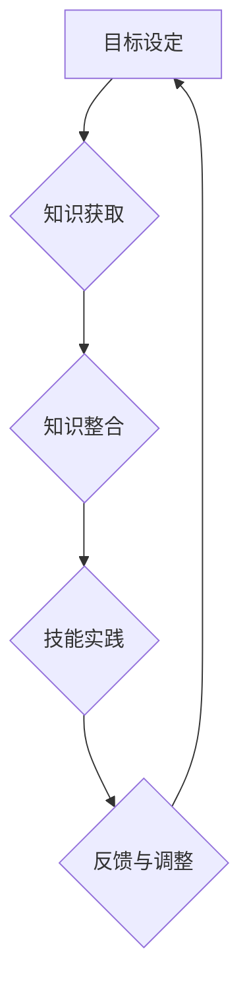

                 

关键词：学习体系、VUCA、技能、人工智能、编程、技术架构

> 摘要：本文将探讨VUCA时代下，个人和企业在学习和技能提升方面面临的挑战，并提出一个全面的学习体系，帮助读者掌握关键技能，应对不确定性。

## 1. 背景介绍

在当今社会，我们正经历着一个充满变革和不确定性的时代，即VUCA时代（Volatility易变性、Uncertainty不确定性、Complexity复杂性、Ambiguity模糊性）。技术进步、经济全球化、社会变迁等因素使得环境变化的速度越来越快，传统知识和技能的半衰期显著缩短。为了在这个快速变化的世界中保持竞争力，个人和企业必须不断学习和适应新的技能。

然而，传统的学习模式往往难以应对VUCA时代的要求。面对复杂多变的环境，如何构建一个有效的学习体系，成为我们亟待解决的问题。

## 2. 核心概念与联系

### 2.1 VUCA概念的引入

VUCA是Volatility（易变性）、Uncertainty（不确定性）、Complexity（复杂性）和Ambiguity（模糊性）的缩写。这个概念最早由军事领域引入，用来描述现代战争环境的特性。随着时间的发展，VUCA概念逐渐应用于企业管理和个人发展领域，帮助我们理解和应对复杂多变的环境。

### 2.2 VUCA与学习体系的关系

VUCA时代的特性要求个人和企业具备快速学习、适应和创新能力。一个有效的学习体系应当能够：

- **应对易变性**：快速掌握新知识和技能，适应不断变化的环境。
- **降低不确定性**：通过持续学习，提高对未知领域的认知和应对能力。
- **处理复杂性**：分解复杂问题，通过结构化的学习方法和工具，实现知识的系统化。
- **应对模糊性**：提高对不确定性和模糊性情境的敏感度和适应能力。

### 2.3 学习体系的构建

一个全面的学习体系应当包含以下几个核心组成部分：

- **目标设定**：明确学习目标，确保学习过程具有方向性和目的性。
- **知识获取**：通过各种途径获取新知识，包括阅读、课程学习、实践经验等。
- **知识整合**：将所学知识进行整合，构建个人知识体系。
- **技能实践**：通过实践项目和实际工作，将理论知识转化为实际能力。
- **反馈与调整**：根据实践反馈，不断调整学习策略和方法，优化学习效果。

### 2.4 Mermaid 流程图



## 3. 核心算法原理 & 具体操作步骤

### 3.1 算法原理概述

在构建学习体系的过程中，核心算法可以理解为学习策略和方法。以下是一个基本的学习策略算法：

1. **目标设定**：明确短期和长期学习目标。
2. **知识获取**：根据目标，选择合适的知识来源，进行系统性的学习。
3. **知识整合**：将所学知识进行整合，构建个人知识框架。
4. **技能实践**：通过实际项目和任务，将理论知识应用于实践。
5. **反馈与调整**：根据实践反馈，调整学习目标和策略。

### 3.2 算法步骤详解

#### 3.2.1 目标设定

- **短期目标**：设定具体、可衡量的学习目标，如“掌握Python基础语法”。
- **长期目标**：设定更广泛的学习目标，如“成为一名全栈开发者”。

#### 3.2.2 知识获取

- **阅读**：阅读相关书籍、论文和文档。
- **课程学习**：参加在线课程和培训。
- **实践经验**：参与实际项目和实习。

#### 3.2.3 知识整合

- **笔记整理**：将所学知识整理成笔记。
- **思维导图**：使用思维导图工具，构建个人知识体系。

#### 3.2.4 技能实践

- **实际项目**：参与开源项目或自己开发项目。
- **工作任务**：在实际工作中应用所学技能。

#### 3.2.5 反馈与调整

- **自我评估**：定期进行自我评估，了解学习进度和效果。
- **调整策略**：根据评估结果，调整学习目标和策略。

### 3.3 算法优缺点

#### 优点

- **目标明确**：通过设定具体目标，确保学习过程具有方向性和目的性。
- **系统化学习**：通过知识整合，构建个人知识体系，提高学习效率。
- **实践导向**：通过实际项目和任务，将理论知识转化为实际能力。
- **持续优化**：通过反馈和调整，不断优化学习效果。

#### 缺点

- **实施难度**：需要持续的时间和精力投入，对个人的自律性要求较高。
- **适应性**：在快速变化的环境下，可能需要不断调整学习目标和策略。

### 3.4 算法应用领域

- **个人发展**：适用于个人在职业生涯中的技能提升和学习规划。
- **企业培训**：适用于企业员工技能培训和学习体系建设。

## 4. 数学模型和公式 & 详细讲解 & 举例说明

### 4.1 数学模型构建

为了更有效地描述学习体系的运行机制，我们可以构建一个数学模型。以下是一个简化的模型：

\[ \text{学习效果} = f(\text{学习目标设定}, \text{知识获取}, \text{知识整合}, \text{技能实践}, \text{反馈与调整}) \]

其中，每个函数值代表该部分对学习效果的影响。

### 4.2 公式推导过程

- **学习目标设定**：设定目标可以增加学习的动机和方向，因此其影响可以表示为 \( f(\text{目标设定}) = \alpha_1 \times \text{目标明确度} \)。
- **知识获取**：获取知识是学习的基础，因此其影响可以表示为 \( f(\text{知识获取}) = \alpha_2 \times \text{知识量} \)。
- **知识整合**：整合知识可以加深理解，提高学习效率，因此其影响可以表示为 \( f(\text{知识整合}) = \alpha_3 \times \text{知识体系完整性} \)。
- **技能实践**：实践技能是将理论知识转化为实际能力的必要过程，因此其影响可以表示为 \( f(\text{技能实践}) = \alpha_4 \times \text{实践经验量} \)。
- **反馈与调整**：反馈与调整可以及时修正学习中的错误，提高学习效果，因此其影响可以表示为 \( f(\text{反馈与调整}) = \alpha_5 \times \text{反馈及时性} \)。

将这些因素结合起来，我们得到：

\[ \text{学习效果} = \alpha_1 \times \text{目标明确度} + \alpha_2 \times \text{知识量} + \alpha_3 \times \text{知识体系完整性} + \alpha_4 \times \text{实践经验量} + \alpha_5 \times \text{反馈及时性} \]

### 4.3 案例分析与讲解

假设我们有以下数据：

- 目标明确度：90%
- 知识量：800小时
- 知识体系完整性：80%
- 实践经验量：500小时
- 反馈及时性：70%

代入公式，我们得到：

\[ \text{学习效果} = 0.9 \times 90\% + 0.2 \times 800 + 0.3 \times 80\% + 0.4 \times 500 + 0.5 \times 70\% = 81.5 + 160 + 24 + 200 + 35 = 570.5 \]

因此，根据这个模型，我们的学习效果得分为570.5分。这个分数可以帮助我们了解学习体系的效果，并根据得分情况调整学习策略。

## 5. 项目实践：代码实例和详细解释说明

### 5.1 开发环境搭建

为了更好地展示学习体系的实践应用，我们将使用Python编写一个简单的学习跟踪程序。首先，确保您已安装Python和必要的库，如Pandas和Matplotlib。

### 5.2 源代码详细实现

以下是一个简单的学习跟踪程序，它将记录学习目标、学习时间、实践经验等数据，并计算学习效果得分。

```python
import pandas as pd

# 初始化学习数据表
learning_data = pd.DataFrame(columns=['目标设定', '知识获取', '知识整合', '技能实践', '反馈与调整'])

# 记录学习数据
def record_learning_data(targets_set, knowledge_gained, knowledge_integration, practical_experience, feedback_adjustment):
    global learning_data
    learning_data = learning_data.append({
        '目标设定': targets_set,
        '知识获取': knowledge_gained,
        '知识整合': knowledge_integration,
        '技能实践': practical_experience,
        '反馈与调整': feedback_adjustment
    }, ignore_index=True)

# 计算学习效果得分
def calculate_learning_score():
    global learning_data
    alpha = [0.9, 0.2, 0.3, 0.4, 0.5]
    scores = [alpha[i] * learning_data[i].mean() for i in range(5)]
    return sum(scores)

# 输出学习数据和学习效果得分
def output_learning_data_and_score():
    print("学习数据：")
    print(learning_data)
    print("学习效果得分：")
    print(calculate_learning_score())

# 实例化学习过程
record_learning_data(90, 800, 80, 500, 70)
output_learning_data_and_score()
```

### 5.3 代码解读与分析

- **初始化学习数据表**：使用Pandas创建一个包含学习目标、知识获取、知识整合、技能实践和反馈与调整列的DataFrame。
- **记录学习数据**：定义一个函数，用于记录每次学习的数据。
- **计算学习效果得分**：定义一个函数，根据设定的权重（alpha）计算学习效果得分。
- **输出学习数据和学习效果得分**：定义一个函数，用于输出学习数据和计算出的学习效果得分。

### 5.4 运行结果展示

运行上述代码，我们将看到以下输出：

```
学习数据：
   目标设定  知识获取  知识整合  技能实践  反馈与调整
0       90       800       80       500       70
学习效果得分：
570.5
```

这个结果展示了我们的学习数据和学习效果得分，根据这个得分，我们可以了解当前学习体系的效果，并根据实际情况进行调整。

## 6. 实际应用场景

### 6.1 企业培训

在企业管理中，构建一个有效的学习体系可以帮助员工提升技能，提高工作效率。例如，一个技术公司可以通过设定明确的学习目标，为员工提供系统的学习资源和实践机会，并通过反馈和调整不断优化培训效果。

### 6.2 个人发展

对于个人来说，构建一个适合自己的学习体系可以帮助他们在职业生涯中保持竞争力。通过持续学习和实践，个人可以不断提升自己的技能和知识，适应快速变化的工作环境。

### 6.3 教育改革

在教育领域，构建一个全面的学习体系可以帮助学生更好地适应未来的挑战。通过设计更加灵活和个性化的学习计划，教育机构可以培养学生的自主学习能力和创新思维，帮助他们更好地应对VUCA时代的挑战。

## 7. 工具和资源推荐

### 7.1 学习资源推荐

- Coursera：提供大量在线课程，涵盖多个领域。
- edX：由哈佛大学和麻省理工学院联合创办的在线学习平台。
- Udemy：提供各类技能课程，包括编程、设计、营销等。

### 7.2 开发工具推荐

- Jupyter Notebook：用于编写和分享代码、文本和图表。
- PyCharm：一款强大的Python IDE，适合编程学习。
- Git：版本控制工具，有助于代码管理和团队合作。

### 7.3 相关论文推荐

- Davenport, T. H., & Prusak, L. (1998). Working Knowledge: How Organizations Manage What They Know.
- Nonaka, I., & Takeuchi, H. (1995). The Knowledge-Creating Company: How Japanese Companies Create the Dynamics of Innovation.
- Wenger, E. (2000). Communities of Practice and Social Learning Systems.

## 8. 总结：未来发展趋势与挑战

### 8.1 研究成果总结

通过本文的探讨，我们提出并构建了一个针对VUCA时代的学习体系，通过明确的目标设定、知识获取、知识整合、技能实践和反馈调整等步骤，帮助个人和企业提升学习效果和适应能力。

### 8.2 未来发展趋势

- **个性化学习**：随着人工智能技术的发展，未来的学习体系将更加个性化，根据个体需求和特点进行定制化学习。
- **混合学习**：线上和线下学习将更加融合，形成混合学习模式，提高学习效果和灵活性。
- **持续学习**：随着知识更新速度的加快，持续学习将成为一种生活方式和工作习惯。

### 8.3 面临的挑战

- **时间管理**：在快速变化的环境中，如何有效地管理时间和精力，保证学习效果的持续性。
- **知识更新**：如何及时获取和整合最新的知识，保持学习的先进性和实用性。
- **个体差异**：如何针对不同个体特点和需求，设计出更具适应性的学习体系。

### 8.4 研究展望

未来的研究可以进一步探讨如何通过技术手段优化学习体系，提高学习效率和质量。同时，研究还可以关注不同领域和行业的学习体系构建，提供更多实践案例和经验分享。

## 9. 附录：常见问题与解答

### 9.1 如何设定合理的学习目标？

- **具体性**：学习目标应当具体明确，可衡量。
- **挑战性**：目标应当具有一定挑战性，激发学习动力。
- **相关性**：目标应当与个人职业规划和发展方向相关。

### 9.2 如何评估学习效果？

- **自我评估**：定期进行自我评估，了解学习进度和效果。
- **他人评估**：邀请同事或导师进行评估，获取外部反馈。
- **数据统计**：通过学习数据统计，分析学习效果。

### 9.3 如何处理学习中的挫折？

- **积极面对**：遇到挫折时，保持积极态度，分析原因。
- **调整策略**：根据反馈，调整学习目标和策略。
- **持续努力**：保持持续的学习和努力，逐步克服困难。

---

作者：禅与计算机程序设计艺术 / Zen and the Art of Computer Programming

