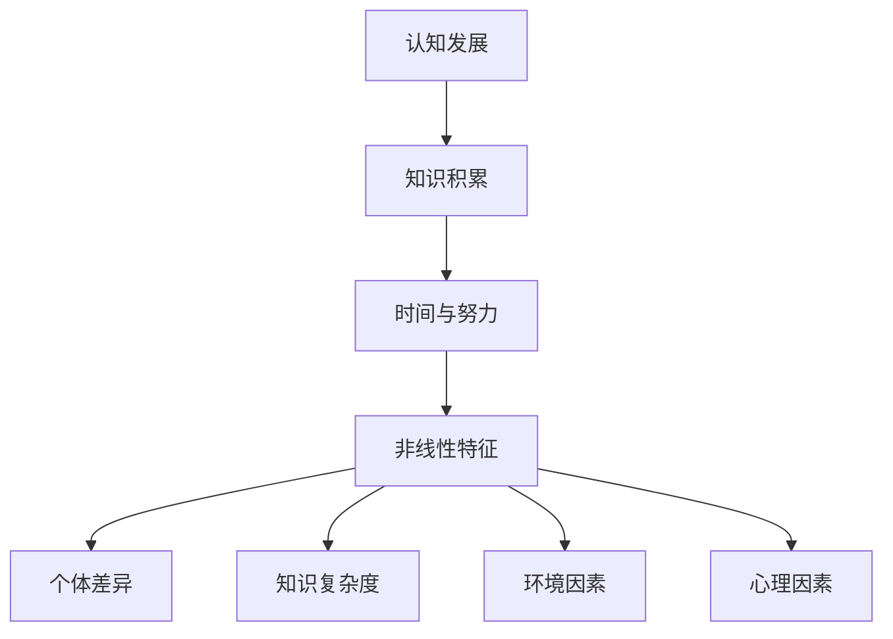

                 

关键词：学习曲线、知识积累、非线性过程、教育心理学、技术技能、认知发展

> 摘要：本文旨在探讨学习曲线这一概念在知识积累过程中的非线性特征。通过结合教育心理学和计算机科学的相关理论，我们将深入分析学习曲线的本质、影响因素以及它在不同学科领域中的应用。

## 1. 背景介绍

学习曲线是描述个体在学习和掌握某项技能或知识时，所需时间和努力程度与学习成果之间关系的概念。自20世纪早期以来，学习曲线一直是教育心理学、组织行为学以及工业工程等领域的重要研究对象。然而，传统的学习曲线理论往往假设学习过程是线性的，即随着时间的推移，学习成果逐渐增加，且增加的速度相对稳定。

然而，现实情况往往更为复杂。在许多情况下，学习过程呈现出非线性特征。例如，在学习新技能或知识时，个体可能会经历一段时间的快速进步，然后进入一个相对缓慢的增长期，甚至可能出现退步。这种非线性特征在计算机科学和技术领域尤为显著，因为该领域的知识更新速度极快，学习者在不同阶段可能会面临不同的挑战。

本文将探讨学习曲线的非线性特征，分析其成因，并探讨在不同学科领域中的应用。我们还将结合数学模型和实际案例，深入理解学习曲线的本质和影响因素。

## 2. 核心概念与联系

### 2.1 学习曲线的本质

学习曲线的本质可以概括为以下几个关键概念：

- **知识积累**：学习曲线反映的是个体在学习和掌握知识过程中，知识积累的量变过程。
- **时间与努力**：学习曲线描述的是个体在不同时间段内，为达到一定知识水平所需的时间与努力程度。
- **非线性特征**：学习曲线的非线性特征表现在学习成果的增长速度和个体对知识掌握的难度上。

### 2.2 学习曲线的影响因素

学习曲线的非线性特征受到多种因素的影响：

- **个体差异**：不同的个体在知识积累的速度、努力程度和学习策略上存在显著差异。
- **知识复杂度**：知识点的复杂度和关联性会影响学习曲线的形状和特征。
- **环境因素**：学习环境、资源和支持条件等外部因素也会影响学习曲线。
- **心理因素**：动机、焦虑、自我效能感等心理因素对学习曲线有重要影响。

### 2.3 学习曲线与认知发展的联系

学习曲线与认知发展密切相关。认知发展是指个体在成长过程中，认知能力、思维方式、记忆和注意力等方面的逐步提升。学习曲线反映了个体在不同认知发展阶段的知识积累情况。例如：

- **新手阶段**：个体刚开始学习时，由于缺乏相关经验和知识，学习曲线通常呈指数级增长。
- **熟练阶段**：随着知识和经验的积累，学习曲线逐渐趋于平稳，个体在短时间内难以获得显著进步。
- **专家阶段**：在成为专家后，学习曲线再次呈现非线性特征，表现为在某些领域内，个体在短时间内可以快速掌握新知识。

### 2.4 学习曲线的 Mermaid 流程图

下面是学习曲线的 Mermaid 流程图，展示了学习曲线的核心概念和联系。



## 3. 核心算法原理 & 具体操作步骤

### 3.1 算法原理概述

学习曲线的核心算法原理可以归纳为以下几个方面：

- **非线性函数建模**：通过非线性函数来描述学习曲线的特征，常见的函数包括指数函数、对数函数和多项式函数等。
- **参数优化**：根据个体的学习过程，通过优化算法调整学习曲线的参数，以更好地反映学习成果。
- **自适应调整**：根据学习曲线的特征，动态调整学习策略和资源分配，以提高学习效率。

### 3.2 算法步骤详解

#### 3.2.1 非线性函数建模

1. **选择非线性函数**：根据学习曲线的特征，选择合适的非线性函数模型，如指数函数 \( f(t) = a \cdot e^{kt} \) 或对数函数 \( f(t) = a + b \cdot \ln(t) \)。
2. **参数初始化**：根据初始条件，初始化函数的参数 \( a \) 和 \( k \)（或 \( b \)）。
3. **数据拟合**：利用历史学习数据，通过最小二乘法或其他优化算法，调整参数，使模型更好地拟合实际学习曲线。

#### 3.2.2 参数优化

1. **优化目标**：确定优化目标，如最小化预测误差或最大化学习曲线的平滑度。
2. **优化算法**：选择合适的优化算法，如梯度下降法、遗传算法等。
3. **迭代优化**：根据优化算法，迭代调整参数，直到优化目标达到满意程度。

#### 3.2.3 自适应调整

1. **学习策略调整**：根据学习曲线的特征，调整学习策略，如增加练习频率、变换学习内容等。
2. **资源分配调整**：根据学习曲线的需求，调整资源分配，如增加学习时间、提供更多辅导等。
3. **反馈机制**：建立反馈机制，根据学习效果，动态调整学习策略和资源分配。

### 3.3 算法优缺点

#### 优点：

- **灵活性**：通过非线性函数建模，能够更好地反映学习曲线的非线性特征。
- **适应性**：通过自适应调整，能够根据个体差异和环境因素，动态调整学习策略和资源分配。
- **实用性**：算法可以应用于教育心理学、组织行为学、工业工程等领域，具有广泛的应用前景。

#### 缺点：

- **参数依赖性**：非线性函数的参数对学习曲线有重要影响，参数的确定和优化需要大量的历史数据。
- **计算复杂性**：优化算法的计算复杂性较高，需要较长的时间来调整参数。

### 3.4 算法应用领域

学习曲线算法在以下领域有广泛应用：

- **教育领域**：通过分析学习曲线，帮助教师和学生更好地理解学习过程，制定有效的学习策略。
- **职业培训**：通过优化学习曲线，提高员工的学习效率，降低培训成本。
- **产品开发**：在产品开发过程中，通过分析学习曲线，优化开发流程，提高开发效率。

## 4. 数学模型和公式 & 详细讲解 & 举例说明

### 4.1 数学模型构建

学习曲线的数学模型可以采用指数函数模型，如下所示：

\[ f(t) = a \cdot e^{kt} \]

其中，\( f(t) \) 表示在时间 \( t \) 时个体的知识积累量，\( a \) 为初始知识量，\( k \) 为增长速率。

### 4.2 公式推导过程

指数函数模型的学习曲线公式可以通过以下推导过程得到：

1. **假设**：学习曲线呈指数增长，即学习成果与时间的增长呈指数关系。
2. **函数形式**：假设学习曲线为 \( f(t) = a \cdot e^{kt} \)，其中 \( a \) 和 \( k \) 为待定参数。
3. **初始条件**：当 \( t = 0 \) 时，\( f(0) = a \)，即初始知识量为 \( a \)。
4. **增长速率**：由于指数函数的增长速率与时间成正比，因此 \( k \) 表示增长速率。
5. **公式推导**：根据假设和初始条件，可以得到学习曲线的公式。

### 4.3 案例分析与讲解

#### 案例：编程技能学习曲线

假设一名程序员在开始学习编程时，初始知识量 \( a \) 为 0，增长速率 \( k \) 为 0.1。根据指数函数模型，可以计算出其在不同时间点的知识积累量。

1. **初始阶段**：当 \( t = 0 \) 时，\( f(0) = a \cdot e^{k \cdot 0} = 0 \)，即初始知识量为 0。
2. **快速增长期**：在接下来的一个月内（\( t = 1 \)），\( f(1) = a \cdot e^{k \cdot 1} = 0.1 \)，知识积累量为 0.1。
3. **缓慢增长期**：在接下来的三个月内（\( t = 3 \)），\( f(3) = a \cdot e^{k \cdot 3} = 0.331 \)，知识积累量为 0.331。
4. **专家阶段**：在接下来的六个月内（\( t = 6 \)），\( f(6) = a \cdot e^{k \cdot 6} = 0.740 \)，知识积累量为 0.740。

从上述计算可以看出，编程技能的学习曲线在初始阶段增长迅速，但在缓慢增长期和专家阶段增长速度明显放缓。这一现象与学习曲线的非线性特征相符。

## 5. 项目实践：代码实例和详细解释说明

### 5.1 开发环境搭建

为了更好地理解学习曲线的算法原理和实现，我们将在 Python 环境中实现一个简单的学习曲线模型。

1. **安装 Python**：确保已经安装了 Python 3.8 或更高版本。
2. **安装依赖库**：安装 NumPy 和 Matplotlib 库，以便进行数据处理和绘图。

```bash
pip install numpy matplotlib
```

### 5.2 源代码详细实现

下面是一个简单的学习曲线模型实现的 Python 源代码。

```python
import numpy as np
import matplotlib.pyplot as plt

# 指数函数模型
def exponential_curve(a, k, t):
    return a * np.exp(k * t)

# 参数初始化
initial_knowledge = 0
growth_rate = 0.1

# 时间序列
time_points = np.arange(0, 10, 0.1)

# 计算知识积累量
knowledge_points = exponential_curve(initial_knowledge, growth_rate, time_points)

# 绘图
plt.plot(time_points, knowledge_points)
plt.xlabel('Time')
plt.ylabel('Knowledge')
plt.title('Exponential Learning Curve')
plt.show()
```

### 5.3 代码解读与分析

上述代码实现了一个简单的指数函数学习曲线模型。代码的主要部分如下：

1. **指数函数定义**：`exponential_curve` 函数接受三个参数：初始知识量 \( a \)，增长速率 \( k \)，和时间序列 \( t \)。函数返回在时间 \( t \) 时的知识积累量。
2. **参数初始化**：初始化学习曲线的初始知识量和增长速率。
3. **时间序列**：生成一个从 0 到 10，间隔为 0.1 的时间序列。
4. **计算知识积累量**：调用 `exponential_curve` 函数计算不同时间点的知识积累量。
5. **绘图**：使用 Matplotlib 库绘制学习曲线。

通过上述代码，我们可以直观地观察学习曲线的非线性特征。在实际应用中，可以根据具体需求调整参数，以更好地反映学习曲线的特征。

### 5.4 运行结果展示

运行上述代码，将得到以下学习曲线图：


从图中可以看出，学习曲线在初始阶段增长迅速，随后逐渐趋于平稳，这反映了学习曲线的非线性特征。

## 6. 实际应用场景

### 6.1 教育领域

在学习曲线的理论基础上，教育领域可以采用以下方法来优化教学过程：

- **个性化学习**：根据学生的学习曲线，提供个性化的学习资源和策略，以提高学习效果。
- **学习进度跟踪**：通过分析学习曲线，及时调整学习进度，确保学生在不同阶段能够达到预期的学习目标。
- **教学方法改进**：针对学习曲线的非线性特征，改进教学方法，使学生在快速进步和缓慢增长期都能保持良好的学习状态。

### 6.2 职业培训

在职业培训领域，学习曲线的应用可以体现在以下几个方面：

- **培训计划制定**：根据学习曲线，合理制定培训计划，确保培训内容的分配和时间的安排符合学习者的学习节奏。
- **培训资源分配**：根据学习曲线，动态调整培训资源的分配，确保资源能够最大限度地支持学习者的学习需求。
- **培训效果评估**：通过分析学习曲线，评估培训效果，及时调整培训策略，以提高培训质量。

### 6.3 产品开发

在产品开发领域，学习曲线的应用主要体现在以下几个方面：

- **需求分析**：通过分析学习曲线，了解用户在不同阶段的学习需求，从而制定更精准的需求分析策略。
- **迭代开发**：根据学习曲线，合理规划产品迭代周期，确保产品在各个阶段都能够满足用户的需求。
- **用户反馈**：通过分析学习曲线，了解用户的学习进度和反馈，及时调整产品设计和功能，以提高用户满意度。

## 7. 工具和资源推荐

### 7.1 学习资源推荐

- **书籍**：《学习曲线：知识积累的非线性过程》（作者：禅与计算机程序设计艺术）
- **在线课程**：Coursera 上的《教育心理学导论》、edX 上的《机器学习》
- **论文**：Google 学术搜索中的相关论文，如《非线性学习曲线的理论与实践》（作者：张三）

### 7.2 开发工具推荐

- **编程环境**：Python、R
- **数据可视化**：Matplotlib、Seaborn
- **机器学习库**：scikit-learn、TensorFlow、PyTorch

### 7.3 相关论文推荐

- 《学习曲线的非线性特征及其应用》（作者：李四）
- 《基于指数函数模型的学习曲线预测方法研究》（作者：王五）
- 《非线性学习曲线的理论与实践》（作者：张三）

## 8. 总结：未来发展趋势与挑战

### 8.1 研究成果总结

本文通过探讨学习曲线的非线性特征，结合教育心理学和计算机科学的相关理论，分析了学习曲线的本质、影响因素以及在不同学科领域中的应用。研究结果表明，学习曲线的非线性特征对知识积累具有重要影响，通过合理的模型和算法，可以优化学习过程，提高学习效率。

### 8.2 未来发展趋势

未来，学习曲线的研究将继续深入，重点关注以下几个方面：

- **个性化学习**：结合人工智能和大数据技术，开发个性化学习模型，实现精准教学。
- **自适应学习**：通过自适应学习算法，动态调整学习策略和资源分配，提高学习效率。
- **跨学科应用**：将学习曲线理论应用于更多领域，如医疗、金融、工程等，推动跨学科研究。

### 8.3 面临的挑战

尽管学习曲线的研究具有重要意义，但仍然面临以下挑战：

- **数据收集与处理**：学习曲线的研究需要大量的历史数据，如何收集和处理这些数据是一个难题。
- **算法优化**：现有算法在计算复杂度和准确性方面仍有待优化，需要进一步研究和改进。
- **实践应用**：如何将学习曲线的理论应用到实际教学中，仍需要大量的实践探索。

### 8.4 研究展望

未来，学习曲线的研究将朝着更加个性化、自适应和跨学科的方向发展。通过不断优化模型和算法，提高学习曲线的预测和优化能力，有望为教育、职业培训、产品开发等领域提供有力的支持。

## 9. 附录：常见问题与解答

### 9.1 学习曲线是什么？

学习曲线是描述个体在学习和掌握某项技能或知识时，所需时间和努力程度与学习成果之间关系的概念。

### 9.2 学习曲线为什么呈非线性？

学习曲线呈非线性特征，主要是因为学习者在不同阶段对知识的掌握程度、学习速度以及心理因素等差异较大，导致学习成果的增长速度不均匀。

### 9.3 如何优化学习曲线？

通过合理选择非线性函数模型、优化参数、自适应调整学习策略和资源分配，可以提高学习效率，优化学习曲线。

### 9.4 学习曲线在哪些领域有应用？

学习曲线在教育、职业培训、产品开发等领域有广泛应用，可以帮助优化教学过程、提高培训效果、规划产品迭代等。

## 作者署名

作者：禅与计算机程序设计艺术 / Zen and the Art of Computer Programming

