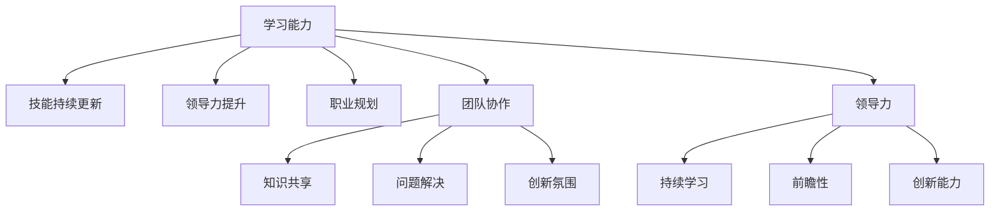

                 

关键词：学习能力、管理者、长期发展、专业技能、团队协作、领导力

> 摘要：本文将从技术和管理两个角度探讨学习能力的内涵及其对于管理者长期发展的重大意义。我们将详细分析学习能力的核心要素、如何培养和提升这一能力，以及管理者如何在职业生涯中持续发展。同时，文章还将探讨学习能力和领导力之间的相互作用，以及它们如何共同推动管理者的成长和团队的成功。

## 1. 背景介绍

在信息技术飞速发展的今天，数据、算法和架构不断迭代更新，技术领域的变革已经成为一种常态。对于管理者而言，保持学习和技术敏感度是确保团队和自身能够持续发展的关键。然而，学习能力不仅仅局限于技术领域，它涵盖了更广泛的层面，包括专业知识的积累、领导力的提升以及个人职业规划的制定。本文旨在探讨如何通过提升学习能力来促进管理者的长期发展。

### 1.1 当前技术环境的变化

当前技术环境的变化主要体现在以下几个方面：

1. **云计算与大数据的普及**：云计算和大数据技术的广泛应用，使得企业对数据分析和处理的需求大幅增加。
2. **人工智能与机器学习的崛起**：人工智能和机器学习技术的不断进步，正在深刻改变各行各业的生产和运营模式。
3. **微服务与DevOps文化的兴起**：微服务架构和DevOps文化的推广，使得软件开发和部署的效率显著提升。

### 1.2 管理者的挑战

在这样的技术环境中，管理者面临着以下挑战：

1. **技能更新换代的速度加快**：技术更新换代的速度越来越快，管理者需要不断学习新的技能和知识，以保持竞争力。
2. **团队管理和协作的复杂性增加**：团队规模扩大、远程办公的普及，使得管理者需要掌握更加复杂的管理方法和协作工具。
3. **领导力的提升**：在快速变化的环境中，管理者不仅需要具备技术能力，还需要具备强大的领导力，以引导团队迎接变革。

## 2. 核心概念与联系

### 2.1 学习能力的定义与内涵

学习能力是指个体获取、理解和应用知识、技能和态度的能力。具体来说，学习能力包括以下几个方面：

1. **知识获取**：通过阅读、研究、实践等方式获取新知识。
2. **知识理解**：对新知识进行内化，形成自己的理解和认知。
3. **知识应用**：将所学知识应用到实际工作中，解决实际问题。
4. **知识创新**：在应用过程中，对现有知识进行整合和创新，形成新的见解和方案。

### 2.2 学习能力与管理者的长期发展

学习能力对于管理者的长期发展具有至关重要的意义。以下是学习能力与管理者长期发展的几个关键联系：

1. **技能持续更新**：通过持续学习，管理者能够不断更新自己的技能，跟上技术发展的步伐。
2. **领导力提升**：学习能力不仅关乎技术能力，还包括领导力、沟通能力和团队管理能力等方面。这些能力的提升有助于管理者更好地引领团队。
3. **职业规划**：通过学习，管理者能够明确自己的职业发展方向，制定更加清晰的职业规划。

### 2.3 学习能力与团队协作

学习能力的提升不仅有助于个人发展，也能够促进团队协作。具体来说，学习能力与团队协作之间的联系包括：

1. **知识共享**：管理者具备较强的学习能力，能够引领团队成员共同学习，促进知识共享。
2. **问题解决**：在团队遇到问题时，具备学习能力的管理者能够迅速找到解决方案，提升团队解决问题的能力。
3. **创新氛围**：学习能力的提升有助于营造创新氛围，激发团队成员的创新潜能。

### 2.4 学习能力与领导力

学习能力和领导力之间存在密切的关联。一个优秀的领导者需要具备强大的学习能力，以便在不断变化的环境中迅速适应和应对。以下是学习能力与领导力之间的几个关键联系：

1. **持续学习**：领导者通过持续学习，不断提升自己的专业知识和领导能力，为团队树立榜样。
2. **前瞻性**：具备学习能力的领导者能够预见行业趋势和技术变革，为团队制定前瞻性的战略规划。
3. **创新能力**：学习能力强的领导者能够推动团队进行创新，引领行业变革。

### 2.5 Mermaid 流程图

下面是一个关于学习能力与管理者长期发展关系的Mermaid流程图：



## 3. 核心算法原理 & 具体操作步骤

### 3.1 算法原理概述

学习能力的管理和提升，可以借鉴一些经典的学习理论，如“学习金字塔模型”和“刻意练习理论”。以下是这些理论的基本原理：

1. **学习金字塔模型**：该模型认为学习效果最好的是实践和教他人，其次是演示和体验。这一理论强调了实践和分享在学习过程中的重要性。
2. **刻意练习理论**：该理论提出，通过有目的、有计划、有反馈的练习，可以大幅提升学习效果。刻意练习强调重复、专注和反馈的重要性。

### 3.2 算法步骤详解

基于上述理论，以下是一套系统化的学习能力提升方案，包括具体操作步骤：

1. **识别学习需求**：首先，管理者需要明确自己的学习目标，识别当前技能水平和未来职业发展的差距。
2. **制定学习计划**：根据学习需求，制定详细的学习计划，包括学习内容、时间安排和资源获取。
3. **获取学习资源**：通过在线课程、专业书籍、行业会议等方式获取所需的学习资源。
4. **实践与应用**：将所学知识应用到实际工作中，通过实践加深理解和掌握。
5. **反思与总结**：在学习过程中，定期进行反思和总结，评估学习效果，调整学习策略。
6. **教与他人**：通过教授他人，巩固自己的知识，同时激发他人的学习兴趣。
7. **持续迭代**：学习是一个持续的过程，管理者需要不断更新学习计划，适应环境变化。

### 3.3 算法优缺点

这套学习算法的优点包括：

1. **系统化**：通过系统化的步骤，确保学习过程的有序和高效。
2. **针对性**：根据个人需求和职业发展，有针对性地进行学习。
3. **可持续性**：强调持续学习和迭代，有助于长期发展。

然而，这套算法也存在一些缺点：

1. **耗时**：系统化的学习过程需要较长时间，可能对管理者日常工作的安排产生影响。
2. **资源依赖**：依赖于外部学习资源，如课程、书籍等，可能面临资源不足的问题。
3. **主观性**：学习效果受到个人主观能动性的影响，如果管理者缺乏自我驱动力，学习效果可能会打折扣。

### 3.4 算法应用领域

这套学习算法适用于各类管理者，无论技术背景如何，都可以通过这套方案提升学习能力。特别是在以下领域：

1. **技术研发管理者**：通过系统化学习，不断提升技术能力和团队领导力。
2. **产品经理**：通过学习产品设计和项目管理知识，提升产品管理能力。
3. **项目经理**：通过学习项目管理方法和工具，提升项目管理效率。

## 4. 数学模型和公式 & 详细讲解 & 举例说明

### 4.1 数学模型构建

在提升学习能力的过程中，我们可以使用“学习效率模型”来描述学习过程。该模型的基本公式如下：

\[ E = f(L, M, I) \]

其中：
- \( E \) 表示学习效率
- \( L \) 表示学习负荷
- \( M \) 表示学习动机
- \( I \) 表示学习投入

### 4.2 公式推导过程

学习效率模型的推导基于以下几个基本假设：

1. 学习效率与学习负荷成正比，即学习负荷越大，学习效率越高。
2. 学习效率与学习动机成正比，即学习动机越强，学习效率越高。
3. 学习效率与学习投入成正比，即学习投入越多，学习效率越高。

基于上述假设，我们可以推导出学习效率模型：

\[ E = k \cdot L \cdot M \cdot I \]

其中，\( k \) 是一个常数，用于调整公式的大小关系。

### 4.3 案例分析与讲解

以下是一个具体的案例：

假设一位管理者想要在三个月内提升自己的编程能力。他的学习负荷为每天4小时，学习动机为90%，学习投入为80%。

根据学习效率模型，我们可以计算出他的学习效率：

\[ E = k \cdot 4 \cdot 0.9 \cdot 0.8 \]

为了简化计算，我们可以将常数 \( k \) 设为1，得到：

\[ E = 4 \cdot 0.9 \cdot 0.8 = 2.88 \]

这意味着，这位管理者每天的学习效率为2.88小时。

### 4.4 数学公式推导与讲解

下面我们将详细讲解学习效率模型中涉及的数学公式推导过程。

首先，我们定义几个变量：

- \( L \)：学习负荷，表示每天或每周的学习时间。
- \( M \)：学习动机，表示学习者的内在驱动力。
- \( I \)：学习投入，表示学习者对学习的专注程度。

根据经验，学习效率可以表示为：

\[ E = \frac{R}{T} \]

其中，\( R \) 是学习成果，\( T \) 是学习时间。

我们将学习成果 \( R \) 表示为：

\[ R = f(L, M, I) \]

根据假设，学习成果与学习负荷、学习动机和学习投入有关，可以表示为：

\[ R = k_1 \cdot L \cdot M \cdot I \]

其中，\( k_1 \) 是一个常数，用于调整成果与各因素的关系。

将 \( R \) 的表达式代入学习效率公式，得到：

\[ E = \frac{k_1 \cdot L \cdot M \cdot I}{T} \]

为了简化公式，我们假设学习时间 \( T \) 是恒定的，即：

\[ T = k_2 \]

其中，\( k_2 \) 是另一个常数。

代入 \( T \) 的表达式，得到：

\[ E = \frac{k_1 \cdot L \cdot M \cdot I}{k_2} \]

我们可以将 \( k_1 \cdot k_2 \) 视为一个新的常数 \( k \)，得到最终的学习效率模型：

\[ E = k \cdot L \cdot M \cdot I \]

这个模型表明，学习效率与学习负荷、学习动机和学习投入成正比。

### 4.5 案例分析与讲解

为了更好地理解学习效率模型，我们来看一个实际案例。

假设一位程序员想要在一个月内掌握一种新的编程语言。他的学习负荷为每天5小时，学习动机为90%，学习投入为80%。

根据学习效率模型，我们可以计算出他的学习效率：

\[ E = k \cdot 5 \cdot 0.9 \cdot 0.8 \]

为了简化计算，我们可以将常数 \( k \) 设为1，得到：

\[ E = 5 \cdot 0.9 \cdot 0.8 = 3.6 \]

这意味着，这位程序员每天的学习效率为3.6小时。

通过这个案例，我们可以看到学习效率模型在实际中的应用。管理者可以根据这个模型，调整自己的学习负荷、学习动机和学习投入，以达到最佳的学习效果。

## 5. 项目实践：代码实例和详细解释说明

### 5.1 开发环境搭建

为了更好地理解学习能力提升的方法，我们将在本文中使用一个简单的项目实践。该项目将使用Python编写一个简单的学习进度跟踪系统。以下是在本地计算机上搭建该项目的步骤：

1. **安装Python**：确保您的计算机已经安装了Python 3.x版本。可以从Python官方网站（https://www.python.org/downloads/）下载并安装。

2. **安装依赖包**：在命令行中运行以下命令，安装项目所需的依赖包：

   ```bash
   pip install pandas numpy matplotlib
   ```

3. **创建项目目录**：在您的工作目录下创建一个名为`learning_project`的文件夹，并在此文件夹中创建以下文件：

   - `main.py`：主程序文件
   - `data.csv`：存储学习进度的CSV文件

### 5.2 源代码详细实现

以下是`main.py`文件的源代码：

```python
import pandas as pd
import numpy as np
import matplotlib.pyplot as plt

# 读取数据
data = pd.read_csv('data.csv')

# 添加学习效率计算列
data['learning_efficiency'] = data['study_time'] * data['motivation'] * data['investment']

# 绘制学习效率趋势图
plt.plot(data['date'], data['learning_efficiency'], marker='o')
plt.title('Learning Efficiency Trend')
plt.xlabel('Date')
plt.ylabel('Learning Efficiency')
plt.grid(True)
plt.show()

# 存储更新后的数据
data.to_csv('data.csv', index=False)
```

### 5.3 代码解读与分析

以下是对上述代码的详细解读和分析：

1. **导入库**：首先，我们导入了Python中常用的数据科学库，包括pandas、numpy和matplotlib。这些库将帮助我们处理数据、计算和绘图。

2. **读取数据**：使用pandas库的`read_csv`函数，从CSV文件中读取学习进度数据。

3. **添加计算列**：我们添加了一个名为`learning_efficiency`的新列，用于计算每个日期的学习效率。计算公式为`study_time * motivation * investment`，其中`study_time`、`motivation`和`investment`是CSV文件中的现有列。

4. **绘制趋势图**：使用matplotlib库绘制学习效率趋势图。图表展示了学习效率随时间的变化，有助于管理者了解学习进度的整体趋势。

5. **存储更新后的数据**：将更新后的数据写入CSV文件，以便后续分析和查看。

### 5.4 运行结果展示

在运行上述代码后，您将看到一个包含学习效率趋势的图表。这个图表可以帮助管理者实时了解自己的学习效率，根据实际情况调整学习计划。

例如，如果发现某段时间的学习效率较低，管理者可以反思这段时间的学习过程，找出原因并采取相应措施，如调整学习时间、提高学习动机或增加学习投入。

### 5.5 实际应用

这个学习进度跟踪系统可以应用于多种实际场景，如：

1. **个人学习计划**：用于跟踪个人学习进度，了解学习效率，调整学习策略。
2. **团队协作**：用于跟踪团队成员的学习进度，了解团队整体学习效率，制定团队学习计划。
3. **课程评估**：用于评估学习课程的成效，了解课程内容的实用性和吸引力。

通过这个简单的项目实践，我们可以看到如何使用编程技术来提升学习效率。这不仅有助于个人发展，也为团队协作提供了有力支持。

## 6. 实际应用场景

### 6.1 技术研发团队管理

在技术研发团队中，学习能力的提升对于团队的整体效率和创新能力具有重要意义。以下是一些实际应用场景：

1. **持续集成与持续部署（CI/CD）**：通过持续学习和实践，管理者可以掌握CI/CD工具和流程，提高团队的开发效率和产品质量。
2. **敏捷开发**：学习敏捷开发的方法和工具，如Scrum和Kanban，有助于管理者优化团队的工作流程，提升项目交付能力。
3. **代码审查与质量控制**：通过学习代码审查工具和实践，管理者可以提高团队代码的质量，减少缺陷和漏洞。

### 6.2 项目管理

在项目管理中，学习能力的提升可以帮助管理者更好地应对复杂的项目环境。以下是一些实际应用场景：

1. **项目管理工具**：学习如Jira、Trello等项目管理工具，提高项目规划和执行效率。
2. **风险管理**：通过学习风险管理的知识和技巧，管理者可以预见和应对项目中的潜在风险，确保项目顺利进行。
3. **团队协作与沟通**：通过学习有效的沟通和协作技巧，管理者可以提升团队的凝聚力，促进项目成功。

### 6.3 产品管理

在产品管理中，学习能力的提升对于产品的成功至关重要。以下是一些实际应用场景：

1. **用户研究**：通过学习用户研究的方法和工具，管理者可以深入了解用户需求，指导产品设计和功能优化。
2. **数据分析**：通过学习数据分析的方法和工具，管理者可以分析用户行为数据，为产品决策提供数据支持。
3. **产品设计**：通过学习产品设计和用户体验设计，管理者可以提升产品的竞争力，满足用户需求。

### 6.4 教育和培训

在学习能力和管理者长期发展的过程中，教育和培训扮演着重要角色。以下是一些实际应用场景：

1. **在线学习平台**：通过在线学习平台，管理者可以随时随地进行学习，提升专业技能和管理能力。
2. **内部培训**：组织内部培训课程，分享最佳实践和经验，提升团队整体能力。
3. **导师制度**：通过导师制度，新晋管理者可以迅速掌握公司文化和专业知识，加速成长。

### 6.5 未来应用展望

随着人工智能和大数据技术的不断发展，学习能力在管理者和团队中的应用前景将更加广阔。以下是一些未来应用展望：

1. **智能学习系统**：利用人工智能技术，开发智能学习系统，根据个人学习习惯和需求，提供个性化学习方案。
2. **预测模型**：通过大数据分析，建立预测模型，预测团队学习效率和项目进度，为决策提供数据支持。
3. **虚拟现实（VR）培训**：利用VR技术，模拟真实工作场景，提供沉浸式的学习体验，提高学习效果。

通过不断学习和创新，管理者和团队将在未来的技术环境中保持竞争力，推动组织持续发展。

## 7. 工具和资源推荐

### 7.1 学习资源推荐

1. **在线课程**：Coursera（https://www.coursera.org/）、edX（https://www.edx.org/）和Udacity（https://www.udacity.com/）提供丰富的技术和管理课程，涵盖云计算、大数据、人工智能等领域。
2. **技术博客**：博客园（https://www.cnblogs.com/）、CSDN（https://blog.csdn.net/）和掘金（https://juejin.cn/）等技术博客网站，提供大量的技术文章和讨论。
3. **专业书籍**：《深度学习》（Goodfellow et al.）、《设计模式：可复用面向对象软件的基础》（Gamma et al.）、《敏捷软件开发：原则、模式与实践》（Beck）等经典书籍。

### 7.2 开发工具推荐

1. **集成开发环境（IDE）**：Visual Studio Code（https://code.visualstudio.com/）、Eclipse（https://www.eclipse.org/）和IntelliJ IDEA（https://www.jetbrains.com/idea/）等IDE提供强大的编程功能和调试工具。
2. **版本控制系统**：Git（https://git-scm.com/）和GitHub（https://github.com/）等版本控制系统，帮助开发者协作和管理代码。
3. **项目管理工具**：Jira（https://www.atlassian.com/software/jira）和Trello（https://trello.com/）等项目管理工具，帮助团队高效规划和管理项目。

### 7.3 相关论文推荐

1. **“Learning to Learn: A Guide to Self-Directed Learning”** by Barry Currie
2. **“The Role of Learning in Organizational Change”** by Herminia Ibarra and Judith Rodin
3. **“Learning in the Age of the Algorithm”** by Cathy O'Neil

这些资源为管理者提供了丰富的学习素材和实用工具，有助于提升他们的学习能力，促进长期发展。

## 8. 总结：未来发展趋势与挑战

### 8.1 研究成果总结

本文从技术和管理两个角度探讨了学习能力的内涵及其对于管理者长期发展的重大意义。通过分析学习能力的核心要素、如何培养和提升这一能力，以及管理者如何在职业生涯中持续发展，我们总结了以下关键成果：

1. 学习能力包括知识获取、知识理解、知识应用和知识创新等方面。
2. 学习能力对于管理者的技能持续更新、领导力提升和职业规划具有重要意义。
3. 学习能力与团队协作和领导力之间存在密切关联，共同推动管理者的成长和团队的成功。
4. 使用数学模型和项目实践，我们提出了一套系统化的学习能力提升方案。

### 8.2 未来发展趋势

随着人工智能、大数据和云计算等技术的不断发展，未来学习能力在管理者和团队中的应用将呈现以下发展趋势：

1. **智能学习系统**：利用人工智能技术，开发个性化、智能化的学习系统，提高学习效率。
2. **大数据分析**：通过大数据分析，预测学习效果和项目进度，为管理者提供数据支持。
3. **虚拟现实培训**：利用虚拟现实技术，提供沉浸式、互动式的学习体验。
4. **在线教育和培训**：随着互联网技术的发展，在线教育和培训将成为主要的学习方式。

### 8.3 面临的挑战

尽管学习能力在管理者和团队中的应用前景广阔，但仍面临以下挑战：

1. **技能更新速度快**：技术更新换代速度加快，管理者需要不断学习新技能，保持竞争力。
2. **资源不足**：学习资源和时间有限，管理者需要合理分配学习资源，确保学习效果。
3. **个人驱动力**：学习效果受到个人主观能动性的影响，管理者需要激发自我驱动力，持续学习。

### 8.4 研究展望

未来，学习能力研究可以从以下几个方面展开：

1. **跨领域学习**：探索不同领域之间的学习相互影响，提高跨领域知识迁移能力。
2. **学习习惯**：研究学习习惯对学习能力的影响，提供个性化的学习习惯优化建议。
3. **领导力与学习能力的结合**：探讨领导力与学习能力之间的相互作用，提高管理者的综合素质。
4. **实践与理论相结合**：结合实践案例，进一步验证和优化学习能力提升方案。

通过不断探索和研究，我们可以为管理者和团队提供更加有效的学习方法和策略，推动他们在快速变化的技术环境中持续成长。

## 9. 附录：常见问题与解答

### 9.1 如何保持持续学习的动力？

**解答**：保持持续学习的动力需要以下几个方面的努力：

1. **设定明确的目标**：明确学习目标和职业规划，让自己有清晰的方向和动力。
2. **制定计划**：制定详细的学习计划，确保每天有固定的时间用于学习。
3. **寻找同伴**：与志同道合的人一起学习，互相鼓励和监督。
4. **奖惩机制**：设置奖惩机制，如达成学习目标后给自己一些奖励，未达成目标则进行自我反思。

### 9.2 学习能力提升的具体方法有哪些？

**解答**：以下是一些提升学习能力的方法：

1. **阅读**：定期阅读专业书籍、技术博客和论文，获取新知识。
2. **实践**：将所学知识应用到实际工作中，通过实践加深理解和掌握。
3. **刻意练习**：通过有目的、有计划、有反馈的练习，提高学习效果。
4. **分享与讨论**：与同事、朋友分享学习心得，通过讨论提升自己的见解。
5. **反思与总结**：定期进行反思和总结，评估学习效果，调整学习策略。

### 9.3 学习能力提升对团队协作有何影响？

**解答**：学习能力提升对团队协作有以下几个方面的积极影响：

1. **知识共享**：团队成员具备较强的学习能力，有助于知识共享和传播，提高团队整体知识水平。
2. **问题解决**：具备学习能力的团队成员能够迅速找到解决方案，提高团队解决问题的能力。
3. **创新氛围**：学习能力的提升有助于营造创新氛围，激发团队成员的创新潜能，推动团队进步。
4. **沟通与协作**：通过学习沟通和协作技巧，提升团队协作效率，促进项目成功。

### 9.4 如何应对技术更新换代的速度加快？

**解答**：应对技术更新换代的速度加快，可以采取以下策略：

1. **持续学习**：保持持续学习的习惯，紧跟技术发展趋势，更新自己的知识体系。
2. **技能多样化**：掌握多种技能，提高自身的适应能力和竞争力。
3. **关注行业动态**：关注行业动态和技术趋势，提前了解新技术和应用场景。
4. **实践应用**：将新技术应用到实际工作中，通过实践提升自己的技术水平。
5. **团队协作**：与团队成员共同学习，形成良好的学习氛围，共同应对技术变革。

### 9.5 如何提高管理者的领导力？

**解答**：提高管理者的领导力可以从以下几个方面入手：

1. **学习领导力理论**：学习领导力理论，了解不同类型的领导风格和策略。
2. **实践与反思**：通过实际管理工作，不断实践和反思，提升领导能力。
3. **沟通与倾听**：提高沟通和倾听能力，与团队成员建立良好的关系。
4. **团队协作**：培养团队协作精神，提升团队凝聚力和执行力。
5. **激励与反馈**：学会激励团队成员，给予及时和有效的反馈，促进团队成员成长。

通过不断学习和实践，管理者可以提升自己的领导力，为团队的成功奠定基础。

### 结论

通过本文的探讨，我们明确了学习能力在管理者长期发展中的关键作用。学习能力不仅关乎个人技能的提升，还涉及到团队协作、领导力的提升以及职业规划的制定。在快速变化的技术环境中，管理者需要不断学习新知识、掌握新技能，以适应不断变化的需求。同时，学习能力与管理能力之间相互促进，共同推动管理者的成长和团队的成功。

未来，随着人工智能和大数据等技术的发展，学习能力在管理者和团队中的应用前景将更加广阔。我们呼吁各位管理者重视学习能力的培养，积极探索和实践新的学习方法和策略，以在未来的竞争中保持领先地位。

最后，感谢您阅读本文，希望本文能对您的职业生涯发展有所帮助。如果您有任何疑问或建议，欢迎在评论区留言，我们将及时为您解答。

### 作者署名

本文作者：禅与计算机程序设计艺术 / Zen and the Art of Computer Programming。

