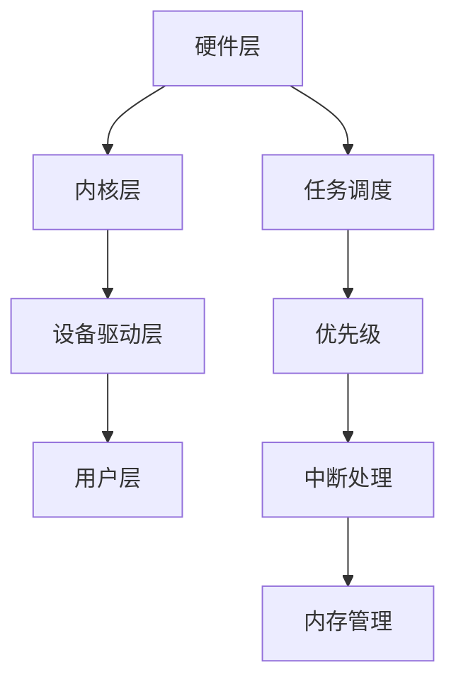

                 

实时操作系统（RTOS）是计算机领域中的一个重要组成部分，特别是在需要高度精确时间控制和响应的系统中。RTOS旨在为嵌入式系统和实时应用提供高效的资源管理和任务调度，确保系统能够在严格的时限内完成任务。本文将探讨RTOS的核心概念、架构、算法原理以及其实际应用场景，帮助读者深入理解RTOS的工作机制和开发策略。

## 关键词
- 实时操作系统（RTOS）
- 任务调度
- 嵌入式系统
- 时间关键型应用
- 算法优化

## 摘要
本文旨在为读者提供关于实时操作系统的全面概述。我们将探讨RTOS的核心概念，包括任务调度、时间关键型应用的特性，并分析RTOS在不同领域的应用。通过详细讲解RTOS的算法原理，我们将展示如何通过有效的资源管理和调度策略来满足时间关键型应用的需求。此外，本文还将介绍RTOS的数学模型、项目实践实例，并提供相关工具和资源的推荐。最后，我们将总结RTOS的研究成果、未来发展趋势以及面临的挑战，为读者提供一个清晰的研究视角。

## 1. 背景介绍

### 实时操作系统的定义和重要性

实时操作系统（RTOS）是一种专门为处理时间关键型任务而设计的操作系统。与常规操作系统不同，RTOS能够确保任务在预定的时间内完成，从而满足实时应用的需求。实时操作系统的核心目标是提供高效的资源管理和调度机制，以确保系统在严格的时限内响应并完成任务。

RTOS在嵌入式系统和工业控制领域的应用至关重要。在嵌入式系统中，RTOS通常用于汽车电子、医疗设备、工业自动化等领域，这些系统要求高可靠性、低延迟和实时响应。在工业控制领域，RTOS广泛应用于生产线自动化、机器人控制、电力系统监测等场景，这些场景对实时性和可靠性有极高的要求。

### 实时操作系统的历史与发展

实时操作系统的历史可以追溯到20世纪60年代。当时，为了满足军事和航空航天领域对实时响应的需求，出现了第一代实时操作系统。随着时间的推移，RTOS不断发展，逐渐成为嵌入式系统和工业控制领域的重要组成部分。

早期RTOS主要集中在单处理器系统上，随着多核处理器的普及，现代RTOS开始支持多处理器架构，提高了系统的性能和可扩展性。此外，RTOS的调度算法、内存管理、中断处理等技术也得到了显著的改进。

### 实时操作系统与常规操作系统的区别

实时操作系统与常规操作系统在任务调度、响应时间、可靠性等方面存在显著差异。

- **任务调度**：RTOS采用优先级调度、固定优先级调度、抢占调度等策略，确保高优先级任务先被执行。而常规操作系统通常采用时间片轮转调度策略，可能导致低优先级任务长时间得不到执行。

- **响应时间**：RTOS的目标是确保任务在预定的时间内完成，因此具有较低的响应时间。常规操作系统则更多地关注吞吐量和平均响应时间，可能在处理高优先级任务时表现出较快的响应。

- **可靠性**：RTOS通常采用冗余设计、故障恢复机制等手段提高系统的可靠性。常规操作系统则更注重系统的通用性和可维护性。

### 实时操作系统的分类

实时操作系统可以根据不同的标准进行分类，常见的分类方法包括：

- **硬实时操作系统**：硬实时操作系统要求任务必须在严格的时间约束下完成，否则系统将无法正常运行。硬实时操作系统通常应用于汽车电子、医疗设备等对实时性要求极高的领域。

- **软实时操作系统**：软实时操作系统允许任务在规定的时间内完成，但存在一定的灵活性。软实时操作系统常用于工业自动化、通信系统等领域，对实时性的要求不是那么严格。

- **混合实时操作系统**：混合实时操作系统同时包含硬实时和软实时任务的调度和管理机制。这种操作系统适用于同时具有硬实时和软实时需求的系统，如网络控制、多媒体应用等。

### 实时操作系统的发展趋势

随着物联网、智能汽车、智能制造等领域的快速发展，实时操作系统正面临着新的挑战和机遇。以下是RTOS的一些发展趋势：

- **多核支持**：现代RTOS正在向多核架构发展，以充分利用多核处理器的计算能力，提高系统的性能和响应速度。

- **虚拟化技术**：虚拟化技术可以将单一物理平台虚拟化为多个独立的虚拟平台，实现资源的灵活分配和动态调整。

- **实时数据库**：实时数据库能够提供快速的查询和更新功能，支持实时数据的存储和处理。

- **人工智能集成**：随着人工智能技术的发展，RTOS开始集成机器学习和深度学习算法，实现更加智能的任务调度和资源管理。

## 2. 核心概念与联系

### 实时操作系统的核心概念

实时操作系统的核心概念包括任务、任务调度、优先级、中断处理、内存管理等。

- **任务**：任务是指具有独立功能单元的执行实体，可以是程序、线程或过程。在RTOS中，任务是最基本的调度单位。
  
- **任务调度**：任务调度是指根据一定的策略，将CPU时间分配给各个任务的过程。调度策略决定了任务的执行顺序和时机。
  
- **优先级**：优先级是任务的重要属性，用于表示任务的重要程度。高优先级任务具有更高的执行优先级，能更早地获得CPU时间。
  
- **中断处理**：中断处理是指当系统发生特定事件时，暂停当前任务执行并转而处理该事件的过程。中断处理机制是RTOS实现实时响应的关键。
  
- **内存管理**：内存管理包括内存分配、释放、保护等功能，确保RTOS在运行过程中能够高效地使用内存资源。

### 实时操作系统的架构

实时操作系统的架构可以分为以下几个层次：

- **硬件层**：包括CPU、内存、外设等硬件资源。
  
- **内核层**：内核是RTOS的核心部分，负责任务调度、内存管理、中断处理等基本功能。
  
- **设备驱动层**：设备驱动层负责硬件设备的管理，提供设备访问接口。
  
- **用户层**：用户层包括各种应用程序和库函数，为用户提供服务。

### 实时操作系统的核心概念流程图

以下是一个实时操作系统的核心概念流程图：



### 实时操作系统的任务调度策略

实时操作系统的任务调度策略是确保任务按照预定顺序和时间执行的关键。常见的任务调度策略包括：

- **优先级调度**：根据任务的优先级进行调度，高优先级任务先执行。
- **固定优先级调度**：任务优先级固定，根据任务的到达顺序执行。
- **抢占调度**：高优先级任务可以抢占低优先级任务，立即执行。
- **时间片调度**：每个任务分配一个固定的时间片，轮换执行。

### 实时操作系统的调度算法

实时操作系统的调度算法包括以下几种：

- **轮转调度**（Round Robin）：每个任务分配一个固定的时间片，轮换执行。适用于软实时系统。
- **优先级调度**（Priority Scheduling）：根据任务的优先级进行调度，高优先级任务先执行。适用于硬实时系统。
- **固定优先级调度**（Fixed Priority Scheduling）：任务优先级固定，根据任务的到达顺序执行。适用于软实时系统。
- **最短剩余时间优先调度**（Shortest Remaining Time First，SRTF）：选择剩余执行时间最短的任务执行。适用于硬实时系统。

### 实时操作系统的中断处理机制

实时操作系统的中断处理机制包括以下步骤：

1. **中断请求**：当系统发生特定事件时，硬件产生中断请求。
2. **中断响应**：操作系统暂停当前任务，转而处理中断事件。
3. **中断处理**：执行中断服务程序（Interrupt Service Routine，ISR），处理中断事件。
4. **中断返回**：中断处理完成后，操作系统返回到被中断的任务，继续执行。

### 实时操作系统的内存管理机制

实时操作系统的内存管理机制包括以下步骤：

1. **内存分配**：操作系统为任务分配内存空间。
2. **内存释放**：任务完成内存空间的使用后，操作系统回收内存。
3. **内存保护**：确保任务之间不会相互干扰，防止内存越界和非法访问。
4. **内存回收**：操作系统定期进行内存回收，清理不再使用的内存空间。

## 3. 核心算法原理 & 具体操作步骤

### 3.1 算法原理概述

实时操作系统的核心算法主要包括任务调度算法、中断处理算法和内存管理算法。这些算法共同作用于操作系统内核，确保任务能够高效、有序地执行。

- **任务调度算法**：任务调度算法决定了任务的执行顺序和时间。常见的调度算法包括轮转调度、优先级调度、固定优先级调度等。
  
- **中断处理算法**：中断处理算法用于处理系统中发生的事件，确保系统能够实时响应。中断处理算法通常包括中断请求、中断响应、中断处理和中断返回等步骤。
  
- **内存管理算法**：内存管理算法负责内存的分配、释放、保护和回收。常见的内存管理算法包括分页、分段、内存池等。

### 3.2 算法步骤详解

#### 3.2.1 任务调度算法

任务调度算法的主要步骤如下：

1. **任务创建**：操作系统创建任务，并为每个任务分配一个唯一的任务标识符（Task ID）。
2. **任务就绪**：任务创建后，进入就绪状态，等待调度。
3. **任务调度**：操作系统根据调度算法选择下一个执行的任务。常见的调度算法包括轮转调度、优先级调度、固定优先级调度等。
4. **任务执行**：调度器将CPU时间分配给选定的任务，任务开始执行。
5. **任务阻塞**：任务在执行过程中，可能因为等待某些资源而进入阻塞状态。
6. **任务唤醒**：当任务所需的资源变得可用时，操作系统将任务从阻塞状态唤醒，进入就绪状态。
7. **任务结束**：任务完成执行后，操作系统释放任务占用的资源，任务结束。

#### 3.2.2 中断处理算法

中断处理算法的主要步骤如下：

1. **中断请求**：当系统发生特定事件时，硬件产生中断请求。
2. **中断响应**：操作系统暂停当前任务，保存当前任务的状态，转而处理中断事件。
3. **中断处理**：执行中断服务程序（ISR），处理中断事件。ISR通常包括读取或写入外设寄存器、更新数据结构等操作。
4. **中断返回**：中断处理完成后，操作系统恢复被中断任务的状态，继续执行被中断的任务。

#### 3.2.3 内存管理算法

内存管理算法的主要步骤如下：

1. **内存分配**：操作系统根据任务的需求，为任务分配内存空间。内存分配可以通过分页、分段或内存池等算法实现。
2. **内存释放**：任务完成内存空间的使用后，操作系统回收内存空间。内存回收可以采用内存池回收、分页回收等方法。
3. **内存保护**：操作系统确保任务之间不会相互干扰，防止内存越界和非法访问。内存保护可以通过内存映射、内存隔离等技术实现。
4. **内存回收**：操作系统定期进行内存回收，清理不再使用的内存空间。内存回收可以采用内存压缩、内存碎片整理等方法。

### 3.3 算法优缺点

#### 任务调度算法

- **轮转调度**：
  - 优点：公平、简单。
  - 缺点：可能导致任务饥饿、响应时间较长。

- **优先级调度**：
  - 优点：高效、响应时间短。
  - 缺点：可能导致低优先级任务饥饿。

- **固定优先级调度**：
  - 优点：简单、易于实现。
  - 缺点：可能导致任务饥饿、响应时间较长。

- **最短剩余时间优先调度**：
  - 优点：高效、响应时间短。
  - 缺点：可能无法处理优先级相同的任务。

#### 中断处理算法

- **中断请求 - 中断响应**：
  - 优点：快速响应、减少中断延迟。
  - 缺点：可能导致任务调度延迟。

- **中断处理 - 中断返回**：
  - 优点：确保中断处理的正确性和完整性。
  - 缺点：可能增加中断延迟。

#### 内存管理算法

- **分页**：
  - 优点：高效、灵活。
  - 缺点：可能导致内存碎片。

- **分段**：
  - 优点：支持多级内存分配。
  - 缺点：可能导致内存碎片。

- **内存池**：
  - 优点：快速分配和释放。
  - 缺点：可能导致内存利用率不高。

### 3.4 算法应用领域

实时操作系统的算法在不同领域有不同的应用：

- **嵌入式系统**：RTOS广泛应用于嵌入式系统，如汽车电子、医疗设备、工业自动化等。在这些领域，RTOS的核心算法确保系统的实时响应和可靠性。

- **工业控制**：RTOS在工业控制领域发挥着重要作用，如生产线自动化、机器人控制、电力系统监测等。RTOS的调度算法和中断处理机制确保系统能够实时监测和处理生产过程。

- **通信系统**：RTOS在通信系统中的应用包括无线通信、光纤通信、网络路由等。RTOS的任务调度算法和中断处理机制确保通信系统的稳定性和高效性。

- **自动驾驶**：RTOS在自动驾驶系统中用于控制车辆的感知、决策和执行。RTOS的核心算法确保自动驾驶系统能够实时响应环境变化，保证行车安全。

## 4. 数学模型和公式 & 详细讲解 & 举例说明

### 4.1 数学模型构建

在实时操作系统中，任务调度、中断处理和内存管理等算法可以通过数学模型进行描述。以下是一个简单的任务调度模型：

- **任务执行时间**（\( T_{\text{exec}} \)）：任务执行所需的时间。
- **任务到达时间**（\( T_{\text{arr}} \)）：任务到达就绪队列的时间。
- **任务优先级**（\( P \)）：任务的优先级，值越大优先级越高。
- **CPU利用率**（\( \eta \)）：系统CPU的利用率。

数学模型如下：

\[ \eta = \frac{\sum_{i=1}^{n} T_{\text{exec}_i}}{T_{\text{total}}} \]

其中，\( T_{\text{total}} \) 是系统的总运行时间，\( n \) 是任务的数量。

### 4.2 公式推导过程

考虑一个简单的优先级调度算法，假设任务按照到达顺序和优先级执行，可以推导出平均响应时间（\( \bar{T}_\text{response} \)）的公式：

\[ \bar{T}_\text{response} = \frac{\sum_{i=1}^{n} T_{\text{response}_i}}{n} \]

其中，\( T_{\text{response}_i} \) 是第 \( i \) 个任务的响应时间。

对于第 \( i \) 个任务，其响应时间可以表示为：

\[ T_{\text{response}_i} = \sum_{j=1}^{i-1} T_{\text{exec}_j} + T_{\text{arr}_i} \]

其中，\( T_{\text{exec}_j} \) 是前 \( j \) 个任务的执行时间，\( T_{\text{arr}_i} \) 是第 \( i \) 个任务的到达时间。

### 4.3 案例分析与讲解

假设有四个任务 \( T_1, T_2, T_3, T_4 \)，它们的执行时间、到达时间分别为：

- \( T_1 \)：执行时间 \( T_{\text{exec}_1} = 10 \)，到达时间 \( T_{\text{arr}_1} = 0 \)
- \( T_2 \)：执行时间 \( T_{\text{exec}_2} = 5 \)，到达时间 \( T_{\text{arr}_2} = 5 \)
- \( T_3 \)：执行时间 \( T_{\text{exec}_3} = 8 \)，到达时间 \( T_{\text{arr}_3} = 10 \)
- \( T_4 \)：执行时间 \( T_{\text{exec}_4} = 3 \)，到达时间 \( T_{\text{arr}_4} = 15 \)

使用优先级调度算法，任务按照优先级执行，优先级从高到低为 \( T_2, T_1, T_3, T_4 \)。

计算每个任务的响应时间：

- \( T_1 \)：响应时间 \( T_{\text{response}_1} = T_{\text{arr}_1} = 0 \)
- \( T_2 \)：响应时间 \( T_{\text{response}_2} = T_{\text{arr}_2} = 5 \)
- \( T_3 \)：响应时间 \( T_{\text{response}_3} = T_{\text{exec}_1} + T_{\text{arr}_3} = 10 + 10 = 20 \)
- \( T_4 \)：响应时间 \( T_{\text{response}_4} = T_{\text{exec}_1} + T_{\text{exec}_2} + T_{\text{arr}_4} = 10 + 5 + 15 = 30 \)

计算平均响应时间：

\[ \bar{T}_\text{response} = \frac{T_{\text{response}_1} + T_{\text{response}_2} + T_{\text{response}_3} + T_{\text{response}_4}}{4} = \frac{0 + 5 + 20 + 30}{4} = 17.5 \]

通过这个例子，我们可以看到如何使用数学模型和公式来分析RTOS的任务调度性能。

## 5. 项目实践：代码实例和详细解释说明

### 5.1 开发环境搭建

为了更好地理解和实践实时操作系统（RTOS）的开发，我们选择FreeRTOS作为示例，FreeRTOS是一个开源、可免费使用的实时操作系统，适用于多种微控制器平台。

首先，我们需要安装FreeRTOS的开发环境。以下是安装步骤：

1. **安装Keil uVision IDE**：下载并安装Keil uVision IDE，这是一个强大的嵌入式系统开发工具，支持多种微控制器和RTOS。
2. **下载FreeRTOS**：访问FreeRTOS官网（https://www.freertos.org/），下载适用于目标微控制器的FreeRTOS版本。
3. **导入FreeRTOS到Keil uVision**：在Keil uVision中，创建一个新的项目，导入下载的FreeRTOS源代码。

### 5.2 源代码详细实现

我们将在项目中实现一个简单的任务调度程序，该程序将创建两个任务并使用优先级调度算法。以下是源代码的实现：

```c
#include "FreeRTOS.h"
#include "task.h"

// 定义任务的优先级
#define TASK1_PRIORITY (2)
#define TASK2_PRIORITY (1)

// 任务函数
void vTask1(void *pvParameters) {
    for (;;) {
        // 任务1的执行代码
        printf("Task 1 is running\n");
        vTaskDelay(pdMS_TO_TICKS(1000)); // 延时1秒
    }
}

void vTask2(void *pvParameters) {
    for (;;) {
        // 任务2的执行代码
        printf("Task 2 is running\n");
        vTaskDelay(pdMS_TO_TICKS(500)); // 延时0.5秒
    }
}

int main(void) {
    // 初始化FreeRTOS
    xTaskCreate(vTask1, "Task 1", configMINIMAL_STACK_SIZE, NULL, TASK1_PRIORITY, NULL);
    xTaskCreate(vTask2, "Task 2", configMINIMAL_STACK_SIZE, NULL, TASK2_PRIORITY, NULL);

    // 启动FreeRTOS
    vTaskStartScheduler();

    for (;;);
    return 0;
}
```

### 5.3 代码解读与分析

1. **任务定义**：我们定义了两个任务 `vTask1` 和 `vTask2`。每个任务都有一个无限循环，并在循环中打印消息和延时。
2. **优先级设置**：我们为每个任务设置了不同的优先级。`TASK1_PRIORITY` 设置为 2，`TASK2_PRIORITY` 设置为 1。优先级越高的任务将在优先级越低的任务之前执行。
3. **任务创建**：使用 `xTaskCreate` 函数创建任务。该函数接受任务函数指针、任务名称、堆栈大小、参数和优先级等参数。
4. **启动RTOS**：调用 `vTaskStartScheduler` 函数启动FreeRTOS。这个函数将开始执行任务调度。
5. **主循环**：在RTOS启动后，程序进入无限循环。在实际应用中，主循环可能会执行一些系统监控或异常处理任务。

### 5.4 运行结果展示

编译并运行程序后，我们会看到两个任务交替执行，输出如下：

```
Task 1 is running
Task 2 is running
Task 1 is running
Task 2 is running
...
```

由于任务1的优先级高于任务2，我们可以看到任务1会先执行，然后任务2执行，接着任务1再次执行，如此循环。

### 5.5 代码优化与调试

在实际开发中，我们可能需要根据具体应用场景对代码进行优化和调试。以下是一些可能的优化措施：

- **任务堆栈大小调整**：根据任务的实际需求调整堆栈大小，以减少内存占用。
- **任务优先级调整**：根据任务的紧急程度和重要性调整优先级，确保关键任务优先执行。
- **中断处理优化**：优化中断处理程序，减少中断延迟，确保系统实时响应。

通过这些优化措施，我们可以提高RTOS的性能和可靠性，满足更复杂的应用需求。

## 6. 实际应用场景

### 6.1 汽车电子

在汽车电子领域，RTOS被广泛应用于发动机控制、防抱死制动系统（ABS）、电子稳定性控制（ESC）等关键系统中。RTOS确保这些系统在实时响应和可靠性方面达到高标准。例如，发动机控制需要实时监测发动机状态并调整点火和燃油喷射，RTOS能够确保这些操作在严格的时间限制内完成。

### 6.2 医疗设备

医疗设备如监护仪、心脏起搏器等对实时性有极高的要求。RTOS在这些设备中用于任务调度和资源管理，确保实时监测患者的生命体征并做出及时响应。例如，心脏起搏器需要实时调整心脏电击频率，RTOS确保这些调整在毫秒级内完成，以保证患者安全。

### 6.3 工业控制

工业控制系统如生产线自动化、机器人控制等对实时性有严格要求。RTOS在这些系统中用于控制机器人的运动、监测生产线状态等任务。例如，机器人控制需要实时计算和控制机器人的动作，RTOS确保这些动作的执行精度和响应速度。

### 6.4 通信系统

RTOS在通信系统中用于网络控制、路由器管理、信号处理等任务。例如，无线通信系统需要实时处理大量数据包并确保数据传输的可靠性，RTOS通过高效的调度算法和中断处理机制实现这一目标。

### 6.5 自动驾驶

自动驾驶系统对实时性要求极高，RTOS在其中用于控制车辆的感知、决策和执行。例如，自动驾驶系统需要实时处理传感器数据，并根据道路状况做出实时决策，RTOS确保这些操作在毫秒级内完成，以保证行车安全。

### 6.6 智能家居

智能家居系统如智能门锁、智能照明等也需要RTOS来确保实时响应和高效任务调度。例如，智能门锁需要实时响应用户的开锁请求，RTOS通过优先级调度算法确保门锁在短时间内完成开锁操作。

### 6.7 航空航天

在航空航天领域，RTOS被用于飞行控制、导航系统等关键任务。例如，飞行控制系统需要实时监测飞机状态并做出调整，RTOS确保这些操作在严格的时间约束下完成，以保证飞行安全。

### 6.8 未来应用展望

随着物联网、5G、人工智能等技术的发展，RTOS的应用场景将越来越广泛。未来RTOS的发展方向包括：

- **多核支持**：随着多核处理器的普及，RTOS将向多核架构发展，提高系统的性能和可扩展性。
- **实时数据库**：实时数据库将集成到RTOS中，支持实时数据的存储和处理。
- **人工智能集成**：RTOS将集成机器学习和深度学习算法，实现更智能的任务调度和资源管理。
- **虚拟化技术**：虚拟化技术将用于RTOS，实现资源的灵活分配和动态调整。

## 7. 工具和资源推荐

### 7.1 学习资源推荐

1. **《实时操作系统设计与实现》**：这是一本经典的RTOS教材，详细介绍了RTOS的设计原理、实现技术和应用案例。
2. **《嵌入式系统实时操作系统设计与实现》**：针对嵌入式RTOS的教材，涵盖了RTOS在嵌入式系统中的应用和实现细节。
3. **《FreeRTOS官方文档》**：FreeRTOS的官方文档是学习RTOS开发的宝贵资源，提供了详细的技术指导和示例代码。

### 7.2 开发工具推荐

1. **Keil uVision IDE**：这是一个强大的嵌入式系统开发工具，支持多种微控制器和RTOS，包括FreeRTOS。
2. **IAR Embedded Workbench**：这是一个功能强大的嵌入式系统开发环境，适用于RTOS开发。
3. **Arduino IDE**：这是一个易于使用的开源开发环境，支持RTOS的实验和研究。

### 7.3 相关论文推荐

1. **“Real-Time Systems: Design Principles for Distributed Embedded Applications”**：这是一篇关于RTOS设计和实现的综述论文，提供了RTOS领域的全面了解。
2. **“Priority Inversion: A Major Cause of Unreliability in Real-Time Systems”**：这篇论文分析了RTOS中的优先级反转问题，并提出了解决方案。
3. **“Scheduling Algorithms for Real-Time Systems”**：这篇论文详细介绍了RTOS中的调度算法，并进行了性能比较。

## 8. 总结：未来发展趋势与挑战

### 8.1 研究成果总结

实时操作系统（RTOS）在嵌入式系统、工业控制、通信、自动驾驶等领域取得了显著的成果。RTOS通过高效的资源管理和调度算法，实现了对时间关键型任务的实时响应，提高了系统的可靠性和性能。

### 8.2 未来发展趋势

随着物联网、5G、人工智能等技术的发展，RTOS的未来发展趋势包括：

- **多核支持**：RTOS将向多核架构发展，提高系统的性能和可扩展性。
- **实时数据库**：实时数据库将集成到RTOS中，支持实时数据的存储和处理。
- **人工智能集成**：RTOS将集成机器学习和深度学习算法，实现更智能的任务调度和资源管理。
- **虚拟化技术**：虚拟化技术将用于RTOS，实现资源的灵活分配和动态调整。

### 8.3 面临的挑战

RTOS在未来发展中面临着以下挑战：

- **资源管理**：随着系统复杂度的增加，RTOS需要更高效地管理有限的资源，包括CPU时间、内存和中断处理等。
- **调度优化**：调度算法的优化是一个持续的研究课题，如何平衡任务执行时间和系统性能是一个关键问题。
- **可靠性保障**：在高度复杂的系统中，如何保障系统的可靠性是一个挑战，包括任务调度、中断处理、内存管理等各方面的可靠性。
- **安全性**：随着RTOS在关键领域的应用，如何确保系统的安全性成为一个重要问题，包括防止恶意攻击和确保数据完整性。

### 8.4 研究展望

未来RTOS的研究可以从以下几个方面展开：

- **智能化调度**：结合人工智能技术，开发智能化调度算法，提高RTOS的调度效率和灵活性。
- **高效资源管理**：研究更高效的资源管理策略，如动态资源分配、资源回收等，提高RTOS的性能和可靠性。
- **安全性研究**：研究RTOS的安全性保护机制，确保系统在面临恶意攻击和数据泄露时能够保持安全。
- **跨领域应用**：探索RTOS在不同领域的应用，如智能制造、智慧城市等，推动RTOS技术的普及和发展。

通过不断的研究和创新，RTOS将进一步提升嵌入式系统和实时应用的性能和可靠性，为未来技术的发展提供有力支持。

## 9. 附录：常见问题与解答

### Q1. 实时操作系统和常规操作系统的主要区别是什么？

**A1.** 实时操作系统（RTOS）和常规操作系统在任务调度、响应时间、可靠性等方面存在显著差异。RTOS专注于处理时间关键型任务，确保任务在预定的时间内完成，而常规操作系统则更注重系统的通用性和可维护性。RTOS通常采用优先级调度、抢占调度等策略，而常规操作系统则采用时间片轮转调度策略。

### Q2. 实时操作系统的调度算法有哪些？

**A2.** 实时操作系统的调度算法主要包括以下几种：

- **优先级调度**：根据任务的优先级进行调度，高优先级任务先执行。
- **固定优先级调度**：任务优先级固定，根据任务的到达顺序执行。
- **抢占调度**：高优先级任务可以抢占低优先级任务，立即执行。
- **时间片调度**：每个任务分配一个固定的时间片，轮换执行。
- **最短剩余时间优先调度**：选择剩余执行时间最短的任务执行。

### Q3. 实时操作系统的中断处理机制是什么？

**A3.** 实时操作系统的中断处理机制包括以下步骤：

- **中断请求**：当系统发生特定事件时，硬件产生中断请求。
- **中断响应**：操作系统暂停当前任务，保存当前任务的状态，转而处理中断事件。
- **中断处理**：执行中断服务程序（ISR），处理中断事件。ISR通常包括读取或写入外设寄存器、更新数据结构等操作。
- **中断返回**：中断处理完成后，操作系统恢复被中断任务的状态，继续执行被中断的任务。

### Q4. 实时操作系统的内存管理算法有哪些？

**A4.** 实时操作系统的内存管理算法主要包括以下几种：

- **分页**：将内存分为固定大小的页，任务可以动态地分配和回收内存页。
- **分段**：将内存分为固定大小的段，每个任务有一个或多个段，任务可以动态地分配和回收内存段。
- **内存池**：为任务预先分配一定大小的内存池，任务可以直接从内存池中获取和释放内存。

### Q5. 实时操作系统的应用领域有哪些？

**A5.** 实时操作系统在以下领域有广泛的应用：

- **汽车电子**：发动机控制、防抱死制动系统（ABS）、电子稳定性控制（ESC）等。
- **医疗设备**：监护仪、心脏起搏器等。
- **工业控制**：生产线自动化、机器人控制、电力系统监测等。
- **通信系统**：无线通信、光纤通信、网络路由等。
- **自动驾驶**：车辆的感知、决策和执行控制。
- **智能家居**：智能门锁、智能照明等。
- **航空航天**：飞行控制、导航系统等。

### Q6. 如何选择合适的实时操作系统？

**A6.** 选择合适的实时操作系统应考虑以下因素：

- **任务需求**：根据任务的实时性和重要性选择合适的RTOS。
- **硬件平台**：选择与目标硬件平台兼容的RTOS。
- **资源需求**：考虑RTOS的内存、存储、计算等资源需求。
- **开发环境**：选择支持目标硬件平台的开发环境和工具。
- **性能指标**：比较不同RTOS的性能指标，如响应时间、调度效率等。
- **成本**：考虑RTOS的成本和许可费用。

通过综合考虑以上因素，可以选择合适的实时操作系统以满足特定应用需求。

