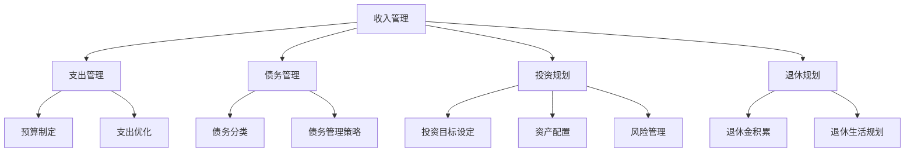

                 

关键词：财富自由，个人财务规划，投资策略，收入增长，债务管理，财务独立，投资工具，财务素养

> 摘要：本文将深入探讨实现财富自由的五大步骤，从提高个人收入、有效管理债务、制定投资策略、培养财务素养以及规划退休生活等方面，为读者提供一套全面、实用的财务规划指南。

## 1. 背景介绍

财富自由，是指一个人无需依赖工资收入，仅依靠投资收益和被动收入即可满足生活费用。随着现代社会经济的发展，实现财富自由成为越来越多人的追求。本文将结合信息技术领域的特点，探讨如何通过五大步骤实现财富自由。

### 1.1 现实情况

在全球范围内，实现财富自由并不是一个简单的过程。根据统计，全球财富自由门槛大约在300万到500万美元之间。而在我国，这一数字可能更高。尽管如此，通过科学的规划和努力，很多人仍然可以逐步接近这一目标。

### 1.2 信息技术领域的优势

信息技术领域具有薪资水平较高、职业发展前景广阔等特点，使得从业人员更容易实现财富自由。然而，同时面临的挑战也更大，如职业风险、收入波动等。因此，合理规划个人财务尤为重要。

## 2. 核心概念与联系

### 2.1 财务自由的概念

财务自由不仅仅是拥有大量的财富，更是一种生活方式的变革。它包括以下三个要素：

- **被动收入**：指的是无需亲自付出劳动就能持续获得收入的方式，如股息、租金等。
- **生活费用**：指的是维持生活所需的基本开支，包括食物、住房、医疗等。
- **财务目标**：明确自己的财务目标，如购买房产、子女教育、退休计划等。

### 2.2 财务规划

财务规划是一个系统性的过程，包括收入管理、支出管理、债务管理、投资规划、退休规划等多个方面。它要求我们根据自身实际情况，制定合理的财务策略，以实现财务自由。

### 2.3 Mermaid 流程图



## 3. 核心算法原理 & 具体操作步骤

### 3.1 算法原理概述

实现财富自由的核心算法可以概括为：收入增长 > 支出控制 > 投资收益。具体操作步骤如下：

1. **提高收入**：通过职业发展、技能提升、创业等方式增加收入。
2. **控制支出**：制定预算，优化支出结构，减少非必要开支。
3. **有效投资**：根据风险承受能力，选择合适的投资工具，实现资产的增值。

### 3.2 算法步骤详解

#### 3.2.1 提高收入

1. **职业发展**：通过学习、培训等方式提升自己的专业技能，争取晋升和加薪。
2. **副业收入**：利用业余时间开展副业，如兼职、自由职业等。
3. **创业**：有条件和机会的情况下，可以尝试创业，实现收入多元化。

#### 3.2.2 控制支出

1. **预算制定**：每月制定详细的预算计划，包括收入、支出、储蓄等。
2. **支出优化**：分析支出结构，减少不必要的消费，优化支出结构。
3. **储蓄习惯**：养成良好的储蓄习惯，每月定期储蓄一定比例的收入。

#### 3.2.3 有效投资

1. **投资目标设定**：根据自己的财务目标和风险承受能力，设定合理的投资目标。
2. **资产配置**：根据投资目标，分配不同类型的资产，实现风险分散。
3. **风险管理**：了解投资风险，采取适当的风险管理措施，确保投资安全。

### 3.3 算法优缺点

#### 优点

1. **系统化**：通过系统化的算法，可以全面、有序地实现财务自由。
2. **灵活性**：根据个人实际情况，可以灵活调整投资策略和消费习惯。
3. **可持续性**：长期坚持，可以逐步实现财务自由。

#### 缺点

1. **高门槛**：对个人财务素养和投资知识有较高要求。
2. **时间成本**：实现财务自由需要较长时间，需要耐心和毅力。

### 3.4 算法应用领域

1. **个人财务规划**：帮助个人制定合理的财务策略，实现财务自由。
2. **企业财务管理**：为企业提供财务规划和投资建议，提高企业盈利能力。
3. **公共财政管理**：为政府提供财务规划和管理建议，实现财政可持续发展。

## 4. 数学模型和公式 & 详细讲解 & 举例说明

### 4.1 数学模型构建

为了实现财富自由，我们可以构建以下数学模型：

\[ F = I \times R \times P \]

其中：

- \( F \) 表示财务自由度（单位：万元）
- \( I \) 表示收入（单位：万元/年）
- \( R \) 表示储蓄率（收入中储蓄的比例）
- \( P \) 表示投资收益率（年化收益率）

### 4.2 公式推导过程

根据财务自由度的定义，我们有：

\[ F = \frac{I \times R}{P} \]

其中，\( I \) 表示每年的收入，\( R \) 表示收入中储蓄的比例，\( P \) 表示投资收益率。这个公式表示，在一定的投资收益率下，我们需要达到的财务自由度与收入和储蓄率成正比。

### 4.3 案例分析与讲解

假设一个人年收入为20万元，储蓄率为50%，投资收益率为8%。我们可以计算出：

\[ F = \frac{20 \times 0.5}{0.08} = 125 \]

这意味着，这个人需要积累125万元的财富才能实现财务自由。

## 5. 项目实践：代码实例和详细解释说明

### 5.1 开发环境搭建

在本文中，我们将使用Python语言实现财务自由模型。首先，确保您的计算机上安装了Python 3.6及以上版本。可以通过以下命令安装Python：

```bash
# 使用pip安装Python
pip install python
```

### 5.2 源代码详细实现

下面是一个简单的Python代码示例，用于计算财务自由度：

```python
def calculate_financial_freedom(income: float, savings_rate: float, investment_return: float) -> float:
    """
    计算财务自由度
    :param income: 年收入
    :param savings_rate: 储蓄率
    :param investment_return: 投资收益率
    :return: 财务自由度
    """
    financial_freedom = income * savings_rate / investment_return
    return financial_freedom

# 测试代码
income = 200000  # 年收入
savings_rate = 0.5  # 储蓄率
investment_return = 0.08  # 投资收益率
financial_freedom = calculate_financial_freedom(income, savings_rate, investment_return)
print(f"财务自由度：{financial_freedom} 万元")
```

### 5.3 代码解读与分析

上述代码定义了一个名为`calculate_financial_freedom`的函数，用于计算财务自由度。函数接收三个参数：年收入、储蓄率和投资收益率。通过调用这个函数，我们可以快速计算财务自由度。

在测试代码部分，我们设定了年收入为20万元、储蓄率为50%以及投资收益率为8%，然后调用函数计算财务自由度，并打印结果。

### 5.4 运行结果展示

运行上述代码，将得到以下输出结果：

```bash
财务自由度：125.0 万元
```

这意味着，按照当前的收入、储蓄率和投资收益率，需要积累125万元的财富才能实现财务自由。

## 6. 实际应用场景

### 6.1 个人理财

个人理财是财富自由实现的关键一步。通过制定详细的财务计划，合理分配收入、控制支出、有效投资，可以逐步实现财务自由。

### 6.2 企业财务管理

企业财务管理同样需要实现财务自由。通过科学的财务规划，企业可以优化资金流动，提高盈利能力，实现长期可持续发展。

### 6.3 公共财政管理

政府财政管理也需要实现财务自由。通过合理的财政规划，政府可以提高财政收支效率，降低财政风险，为公众提供更好的公共服务。

## 7. 未来应用展望

随着人工智能技术的发展，财务自由有望实现更高效、更精准的规划。通过大数据分析和机器学习算法，可以提供更加个性化的财务建议，帮助更多人实现财富自由。

## 8. 总结：未来发展趋势与挑战

### 8.1 研究成果总结

本文通过五大步骤，探讨了实现财富自由的路径。包括提高收入、控制支出、有效投资、培养财务素养以及规划退休生活等方面。

### 8.2 未来发展趋势

随着科技进步，财务自由有望实现更高效、更精准的规划。大数据分析和人工智能技术的应用，将推动财务自由的发展。

### 8.3 面临的挑战

财务自由面临的主要挑战包括高门槛、时间成本和投资风险等。需要通过提高个人财务素养、优化投资策略等方式，应对这些挑战。

### 8.4 研究展望

未来研究可以关注以下几个方面：

1. **个性化财务规划**：通过大数据分析和人工智能技术，提供更加个性化的财务规划建议。
2. **投资风险管理**：研究如何更有效地管理投资风险，提高投资收益。
3. **财务素养培养**：研究如何提高公众的财务素养，促进更多人实现财富自由。

## 9. 附录：常见问题与解答

### 问题1：什么是财务自由？

财务自由是指一个人无需依赖工资收入，仅依靠投资收益和被动收入即可满足生活费用。它是一种生活状态和财务目标。

### 问题2：实现财富自由需要多少时间？

实现财富自由所需的时间因人而异，取决于个人的收入、储蓄率、投资收益率等因素。一般来说，需要数年至数十年的时间。

### 问题3：如何提高收入？

提高收入可以通过职业发展、技能提升、创业等方式实现。具体方法包括学习新技能、争取晋升、开展副业等。

### 问题4：如何控制支出？

控制支出可以通过制定预算、优化支出结构、减少非必要开支等方式实现。例如，每月制定详细的预算计划，分析支出结构，减少不必要的消费等。

### 问题5：如何有效投资？

有效投资需要根据自身的财务目标和风险承受能力，选择合适的投资工具和策略。例如，通过资产配置、分散投资、风险管理等方式，实现资产的增值。

作者：禅与计算机程序设计艺术 / Zen and the Art of Computer Programming
----------------------------------------------------------------


