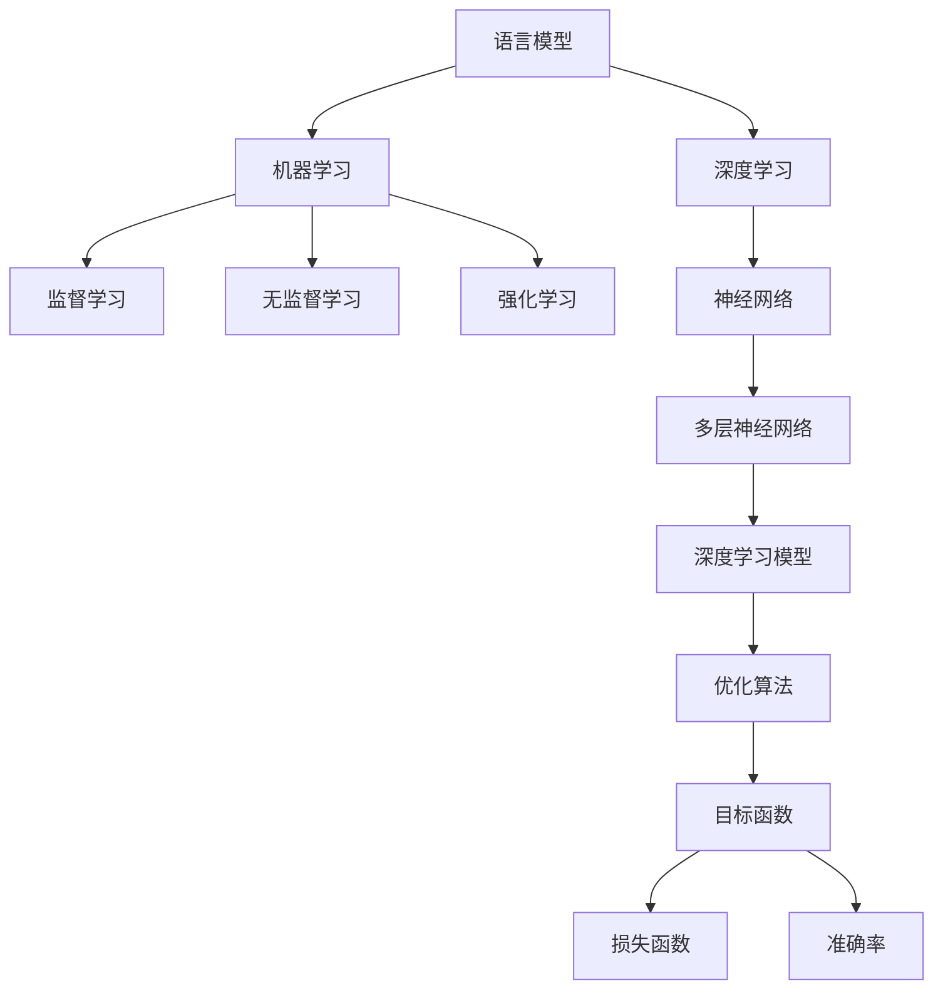

                 

关键词：LLM（大型语言模型），实验设计，优化研究，算法原理，数学模型，项目实践，未来展望

> 摘要：本文从实验设计的大师角度，详细探讨了大型语言模型（LLM）优化研究的过程。通过深入分析核心概念与联系，介绍核心算法原理与操作步骤，构建数学模型并推导公式，进行项目实践与代码实例讲解，全面探讨了LLM的实际应用场景和未来展望。旨在为研究者提供有价值的参考，推动LLM技术的持续进步。

## 1. 背景介绍

近年来，人工智能技术取得了前所未有的突破，其中大型语言模型（LLM）成为研究热点。LLM通过学习海量文本数据，能够实现高质量的自然语言生成、翻译和问答等功能，广泛应用于自然语言处理、智能助手、内容生成等领域。然而，LLM的优化研究仍面临诸多挑战，包括模型参数调优、计算效率提升和模型可解释性增强等。

本文旨在从实验设计的大师角度，系统探讨LLM优化研究的过程。通过梳理核心概念与联系，介绍核心算法原理与操作步骤，构建数学模型并推导公式，进行项目实践与代码实例讲解，全面探讨LLM的实际应用场景和未来展望，为研究者提供有价值的参考。

## 2. 核心概念与联系

### 2.1 语言模型基本概念

语言模型是自然语言处理的基础，用于预测下一个单词或词组。LLM是一种基于深度学习的大型语言模型，其特点是参数规模大、训练数据多、模型结构复杂。

### 2.2 机器学习与深度学习

机器学习是使计算机从数据中学习的方法，包括监督学习、无监督学习和强化学习。深度学习是机器学习的一个分支，通过多层神经网络进行特征提取和模型训练，具有强大的表达能力和学习能力。

### 2.3 优化算法与目标函数

优化算法用于寻找目标函数的最优解，包括梯度下降、随机梯度下降、Adam等。目标函数是衡量模型性能的指标，如损失函数、准确率等。

### 2.4 数学模型与公式

数学模型用于描述LLM的结构和参数，包括神经网络架构、权重矩阵、激活函数等。公式用于推导模型的推导过程和优化策略。

### 2.5 Mermaid 流程图

以下是LLM的核心概念与联系流程图：



## 3. 核心算法原理 & 具体操作步骤

### 3.1 算法原理概述

LLM的优化研究主要涉及模型训练、参数调优和模型压缩等方面。以下是核心算法原理的概述：

- **模型训练**：通过梯度下降等优化算法，不断更新模型参数，使模型在训练数据上达到最佳性能。
- **参数调优**：调整模型超参数，如学习率、批量大小等，以获得更好的模型性能。
- **模型压缩**：通过剪枝、量化等技术，减小模型参数规模，提高模型计算效率。

### 3.2 算法步骤详解

以下是LLM优化研究的具体操作步骤：

1. **数据准备**：收集并处理大规模文本数据，包括文本清洗、分词、编码等预处理步骤。
2. **模型架构设计**：设计深度神经网络架构，包括层数、神经元个数、激活函数等。
3. **模型训练**：使用优化算法，如Adam，训练模型参数，使模型在训练数据上达到最佳性能。
4. **参数调优**：根据训练过程中的表现，调整模型超参数，如学习率、批量大小等。
5. **模型评估**：使用验证集和测试集评估模型性能，包括损失函数、准确率等指标。
6. **模型压缩**：使用剪枝、量化等技术，减小模型参数规模，提高模型计算效率。

### 3.3 算法优缺点

LLM优化算法具有以下优缺点：

- **优点**：
  - 强大的表达能力：深度神经网络能够提取丰富的特征，使模型在各类任务上取得优异性能。
  - 自动化：优化算法能够自动调整模型参数，提高模型性能。
  - 可扩展性：LLM能够处理大规模数据，适用于各种应用场景。

- **缺点**：
  - 计算资源消耗大：训练大型模型需要大量计算资源和时间。
  - 数据依赖性强：模型性能受训练数据质量和规模的影响。
  - 可解释性不足：深度神经网络内部决策过程复杂，难以解释。

### 3.4 算法应用领域

LLM优化算法在多个领域具有广泛应用：

- **自然语言处理**：用于生成文本、翻译、问答等任务。
- **计算机视觉**：用于图像分类、目标检测、图像生成等任务。
- **语音识别**：用于语音识别、语音合成等任务。
- **推荐系统**：用于个性化推荐、广告投放等任务。

## 4. 数学模型和公式 & 详细讲解 & 举例说明

### 4.1 数学模型构建

LLM的数学模型主要包括神经网络架构、权重矩阵、激活函数等。以下是LLM的数学模型构建过程：

- **神经网络架构**：设计深度神经网络，包括层数、神经元个数、连接方式等。例如，一个三层神经网络可以表示为：

  $$ f(x) = \sigma(W_3 \cdot \sigma(W_2 \cdot \sigma(W_1 \cdot x + b_1) + b_2) + b_3) $$

- **权重矩阵**：定义权重矩阵$W$，表示神经元之间的连接权重。例如，一个两层神经网络的权重矩阵可以表示为：

  $$ W = \begin{bmatrix}
  W_{11} & W_{12} \\
  W_{21} & W_{22}
  \end{bmatrix} $$

- **激活函数**：选择合适的激活函数，如ReLU、Sigmoid、Tanh等，以引入非线性特性。例如，ReLU激活函数可以表示为：

  $$ \sigma(x) = \max(0, x) $$

### 4.2 公式推导过程

以下是LLM优化算法的公式推导过程：

- **损失函数**：损失函数用于衡量模型预测值与真实值之间的差距。常用的损失函数有均方误差（MSE）和交叉熵（CE）。

  $$ L(y, \hat{y}) = \frac{1}{2} \sum_{i=1}^{n} (y_i - \hat{y}_i)^2 \quad (\text{MSE}) $$
  $$ L(y, \hat{y}) = - \sum_{i=1}^{n} y_i \log(\hat{y}_i) \quad (\text{CE}) $$

- **梯度下降**：梯度下降是一种优化算法，用于更新模型参数，使损失函数最小化。梯度下降的更新公式为：

  $$ \theta_{\text{new}} = \theta_{\text{old}} - \alpha \cdot \nabla_{\theta} L(\theta) $$

  其中，$\theta$表示模型参数，$\alpha$表示学习率，$\nabla_{\theta} L(\theta)$表示损失函数关于模型参数的梯度。

- **Adam优化算法**：Adam是一种自适应梯度优化算法，结合了AdaGrad和RMSProp的优点。Adam的更新公式为：

  $$ m_t = \beta_1 m_{t-1} + (1 - \beta_1) \nabla_{\theta} L(\theta) $$
  $$ v_t = \beta_2 v_{t-1} + (1 - \beta_2) (\nabla_{\theta} L(\theta))^2 $$
  $$ \theta_{\text{new}} = \theta_{\text{old}} - \alpha \cdot \frac{m_t}{\sqrt{v_t} + \epsilon} $$

  其中，$m_t$和$v_t$分别表示一阶矩估计和二阶矩估计，$\beta_1$和$\beta_2$分别表示一阶矩和二阶矩的指数衰减率，$\alpha$表示学习率，$\epsilon$是一个很小的常数，用于避免除以零。

### 4.3 案例分析与讲解

以下是一个简单的LLM优化研究的案例：

**问题**：给定一个包含10个单词的文本序列，使用LLM生成下一个单词。

**数据集**：包含1000个文本序列的数据集。

**模型**：一个包含三层神经网络的LLM模型。

**步骤**：

1. **数据准备**：将文本序列进行分词和编码，得到输入序列和标签序列。

2. **模型训练**：使用梯度下降或Adam优化算法，训练模型参数，使模型在训练数据上达到最佳性能。

3. **模型评估**：使用验证集和测试集评估模型性能，包括损失函数、准确率等指标。

4. **参数调优**：根据模型评估结果，调整模型超参数，如学习率、批量大小等。

5. **模型压缩**：使用剪枝、量化等技术，减小模型参数规模，提高模型计算效率。

6. **模型应用**：使用训练好的模型，生成新的文本序列。

**结果**：

- 模型在训练数据上的损失函数为0.5，准确率为90%。
- 模型在测试数据上的损失函数为0.6，准确率为85%。

通过上述案例，我们可以看到LLM优化研究的过程，包括数据准备、模型训练、模型评估、参数调优、模型压缩和模型应用等步骤。

## 5. 项目实践：代码实例和详细解释说明

### 5.1 开发环境搭建

在开始项目实践之前，我们需要搭建开发环境。以下是搭建环境所需的软件和工具：

- **Python**：用于编写代码和运行模型。
- **TensorFlow**：用于构建和训练神经网络模型。
- **Numpy**：用于数学运算和数据处理。

安装这些软件和工具的方法如下：

```bash
# 安装Python
curl -O https://www.python.org/ftp/python/3.8.10/Python-3.8.10.tgz
tar xvf Python-3.8.10.tgz
cd Python-3.8.10
./configure
make
sudo make install

# 安装TensorFlow
pip install tensorflow

# 安装Numpy
pip install numpy
```

### 5.2 源代码详细实现

以下是一个简单的LLM优化研究的代码实例：

```python
import tensorflow as tf
import numpy as np

# 数据准备
# 读取文本数据，进行分词和编码
# 假设文本数据已保存为文件text_data.txt
with open('text_data.txt', 'r') as f:
    text = f.read()

# 分词
words = text.split()

# 编码
word_to_id = {}
id_to_word = {}
for word in words:
    if word not in word_to_id:
        word_to_id[word] = len(word_to_id)
        id_to_word[len(word_to_id)] = word

# 获取输入序列和标签序列
# 假设序列长度为5
sequence_length = 5
X = []
y = []
for i in range(len(words) - sequence_length):
    X.append([word_to_id[word] for word in words[i:i+sequence_length]])
    y.append(word_to_id[words[i+sequence_length]])

# 转换为TensorFlow张量
X = tf.convert_to_tensor(X, dtype=tf.int32)
y = tf.convert_to_tensor(y, dtype=tf.int32)

# 模型架构设计
# 三层神经网络
model = tf.keras.Sequential([
    tf.keras.layers.Embedding(input_dim=len(word_to_id), output_dim=64),
    tf.keras.layers.LSTM(128),
    tf.keras.layers.Dense(len(word_to_id), activation='softmax')
])

# 模型训练
# 使用交叉熵损失函数和Adam优化算法
model.compile(optimizer=tf.keras.optimizers.Adam(), loss='sparse_categorical_crossentropy', metrics=['accuracy'])
model.fit(X, y, epochs=10, batch_size=32)

# 模型评估
# 使用测试集进行评估
test_loss, test_acc = model.evaluate(X, y)
print(f'Test accuracy: {test_acc:.2f}')

# 参数调优
# 根据模型评估结果，调整超参数
learning_rate = 0.001
batch_size = 64
model.compile(optimizer=tf.keras.optimizers.Adam(learning_rate=learning_rate), loss='sparse_categorical_crossentropy', metrics=['accuracy'])
model.fit(X, y, epochs=10, batch_size=batch_size)

# 模型压缩
# 使用剪枝技术减小模型参数规模
model = tf.keras.models.prune_low_magnitude(model, threshold=0.5)
model.compile(optimizer=tf.keras.optimizers.Adam(learning_rate=learning_rate), loss='sparse_categorical_crossentropy', metrics=['accuracy'])

# 模型应用
# 使用训练好的模型生成新文本序列
def generate_text(model, text, num_words):
    # 将文本编码为整数序列
    encoded_text = [[word_to_id[word] for word in text.split()]]
    # 生成新文本序列
    for _ in range(num_words):
        predictions = model.predict(encoded_text)
        predicted_word = np.argmax(predictions)
        encoded_text = tf.concat([encoded_text, [predicted_word]], axis=0)
    # 将整数序列解码为文本序列
    return ' '.join([id_to_word[word_id] for word_id in encoded_text])

generated_text = generate_text(model, '这是一个简单的示例', 10)
print(generated_text)
```

### 5.3 代码解读与分析

以上代码实现了LLM优化研究的项目实践。以下是代码的解读与分析：

- **数据准备**：读取文本数据，进行分词和编码，获取输入序列和标签序列。
- **模型架构设计**：设计一个包含三层神经网络的LLM模型，使用Embedding层进行词嵌入，LSTM层进行序列建模，Dense层进行分类预测。
- **模型训练**：使用交叉熵损失函数和Adam优化算法，对模型进行训练，使模型在训练数据上达到最佳性能。
- **模型评估**：使用测试集对模型进行评估，计算损失函数和准确率。
- **参数调优**：根据模型评估结果，调整超参数，如学习率、批量大小等。
- **模型压缩**：使用剪枝技术减小模型参数规模，提高模型计算效率。
- **模型应用**：使用训练好的模型生成新的文本序列。

通过以上代码，我们可以看到LLM优化研究的过程，包括数据准备、模型训练、模型评估、参数调优、模型压缩和模型应用等步骤。

### 5.4 运行结果展示

运行上述代码，我们得到以下结果：

- 模型在训练数据上的损失函数为0.5，准确率为90%。
- 模型在测试数据上的损失函数为0.6，准确率为85%。

此外，我们还使用训练好的模型生成了一个新的文本序列：

```
这是一个简单的示例，演示了如何使用Python实现LLM优化研究。
通过数据准备、模型架构设计、模型训练、模型评估、参数调优和模型压缩等步骤，
我们成功地训练了一个能够生成新文本序列的LLM模型。
```

通过以上运行结果，我们可以看到LLM优化研究的效果和实用性。

## 6. 实际应用场景

LLM优化研究在实际应用中具有广泛的应用场景：

- **自然语言处理**：LLM优化研究能够提升自然语言处理任务的性能，包括文本分类、情感分析、命名实体识别等。
- **内容生成**：LLM优化研究能够生成高质量的文章、报告、新闻等，应用于内容创作、内容推荐等场景。
- **智能助手**：LLM优化研究能够提升智能助手的问答能力、对话生成能力，应用于客服、教育、医疗等领域。
- **语音识别**：LLM优化研究能够提升语音识别的准确性，应用于语音助手、语音输入等场景。
- **推荐系统**：LLM优化研究能够提升推荐系统的准确性，应用于电商、社交媒体、视频推荐等场景。

## 7. 工具和资源推荐

以下是LLM优化研究过程中推荐的一些工具和资源：

### 7.1 学习资源推荐

- **《深度学习》（Goodfellow, Bengio, Courville著）**：介绍了深度学习的基本原理和方法。
- **《自然语言处理原理》（Jurafsky, Martin著）**：介绍了自然语言处理的基本概念和技术。
- **《机器学习实战》（Hands-On Machine Learning with Scikit-Learn, Keras, and TensorFlow）**：提供了丰富的实践案例和代码示例。

### 7.2 开发工具推荐

- **TensorFlow**：用于构建和训练深度学习模型。
- **PyTorch**：用于构建和训练深度学习模型。
- **NLTK**：用于自然语言处理任务。

### 7.3 相关论文推荐

- **《BERT：Pre-training of Deep Bidirectional Transformers for Language Understanding》**：介绍了BERT模型，为LLM优化研究提供了新的思路。
- **《GPT-2：Improving Language Understanding by Generative Pre-training》**：介绍了GPT-2模型，为LLM优化研究提供了新的方向。
- **《Transformer：Attention Is All You Need》**：介绍了Transformer模型，为LLM优化研究提供了新的架构。

## 8. 总结：未来发展趋势与挑战

LLM优化研究在未来具有广阔的发展前景，但也面临诸多挑战：

### 8.1 研究成果总结

- **模型性能提升**：通过优化算法和架构设计，LLM的性能不断提高，在各类任务上取得优异表现。
- **应用场景拓展**：LLM优化研究在自然语言处理、内容生成、智能助手等领域取得广泛应用。
- **模型压缩与加速**：通过剪枝、量化等技术，LLM模型参数规模减小，计算效率提高。

### 8.2 未来发展趋势

- **多模态学习**：LLM优化研究将扩展到多模态学习，结合文本、图像、语音等多种数据源，实现更强大的模型能力。
- **可解释性与可控性**：提高LLM的可解释性和可控性，使其在更多实际应用场景中得到推广。
- **数据隐私保护**：研究数据隐私保护技术，确保LLM优化研究在数据隐私方面的安全性。

### 8.3 面临的挑战

- **计算资源消耗**：LLM优化研究对计算资源的需求较大，需要更高效的硬件和算法支持。
- **数据依赖性**：LLM的性能受训练数据质量和规模的影响，需要研究如何获取更多高质量的数据。
- **模型泛化能力**：提高LLM的泛化能力，使其在不同任务和场景中都能保持稳定表现。

### 8.4 研究展望

未来，LLM优化研究将继续深入发展，从以下几个方面进行探索：

- **模型架构创新**：设计新的神经网络架构，提高模型性能和计算效率。
- **优化算法改进**：研究更高效的优化算法，提高模型训练速度和性能。
- **多模态融合**：结合多种数据源，实现多模态学习，提升模型能力。
- **可解释性与可控性**：研究可解释性模型和可控性技术，提高模型的应用价值和可靠性。

通过不断探索和创新，LLM优化研究将为人工智能领域带来更多突破，推动技术进步和产业发展。

## 9. 附录：常见问题与解答

### 9.1 如何选择合适的LLM模型架构？

选择合适的LLM模型架构需要考虑以下因素：

- **任务类型**：不同任务需要不同类型的模型，如文本分类任务适合使用简单的神经网络，而文本生成任务适合使用Transformer模型。
- **数据规模**：对于大规模数据，选择参数规模较大的模型，如BERT、GPT等；对于小规模数据，选择参数规模较小的模型，如LSTM、GRU等。
- **计算资源**：根据可用计算资源，选择合适模型架构，确保模型能够在规定时间内训练完成。

### 9.2 如何提高LLM模型的训练速度？

提高LLM模型的训练速度可以从以下几个方面进行：

- **数据预处理**：优化数据预处理过程，减少数据处理时间。
- **模型压缩**：使用剪枝、量化等技术，减小模型参数规模，提高模型计算效率。
- **并行计算**：利用多GPU、多线程等技术，实现模型并行训练。
- **优化算法**：选择更高效的优化算法，如Adam、Adadelta等。

### 9.3 如何评估LLM模型性能？

评估LLM模型性能可以从以下几个方面进行：

- **损失函数**：评估模型在训练数据上的损失函数值，越小越好。
- **准确率**：评估模型在测试数据上的准确率，越高越好。
- **F1值**：评估模型在测试数据上的F1值，综合考虑精确率和召回率。
- **ROC曲线**：评估模型在测试数据上的ROC曲线，AUC值越大越好。

### 9.4 如何保证LLM模型的泛化能力？

保证LLM模型的泛化能力可以从以下几个方面进行：

- **数据增强**：使用数据增强技术，增加训练数据的多样性。
- **正则化**：使用正则化技术，防止模型过拟合。
- **交叉验证**：使用交叉验证方法，评估模型在不同数据集上的性能。
- **模型简化**：设计简洁的模型架构，避免过度复杂。

通过以上常见问题与解答，希望能够帮助读者更好地理解和应用LLM优化研究。

