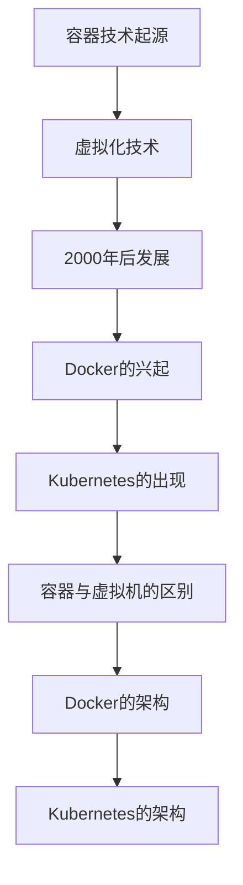

                 

 **关键词**：容器化技术、Docker、Kubernetes、微服务架构、DevOps、云原生、持续集成/持续部署（CI/CD）

**摘要**：本文将深入探讨容器化技术的核心——Docker 和 Kubernetes，分析它们的基本概念、架构、操作步骤及具体应用，旨在帮助读者全面理解容器化技术，并掌握其在现代软件开发和运维中的应用。

## 1. 背景介绍

### 1.1 容器化技术的起源

容器化技术的概念最早可以追溯到 20 世纪 70 年代的操作系统领域。当时，Unix 系统中引入了 chroot 和 cgroups 等机制，为隔离进程提供了初步的实现。然而，直到 2000 年后，随着虚拟化技术的发展，容器化技术才逐渐成熟并得到广泛应用。

### 1.2 Docker 的兴起

Docker 的诞生标志着容器化技术的真正兴起。Docker 提供了一个轻量级、可移植、自给自足的容器化解决方案，使得开发者能够更加便捷地将应用程序及其依赖环境打包到一个容器中，实现一次编写，到处运行。

### 1.3 Kubernetes 的出现

Kubernetes 是一个开源的容器编排工具，它旨在简化容器化应用程序的部署、扩展和管理。Kubernetes 在 Docker 的基础上，进一步提高了容器化应用程序的可运维性和可扩展性，成为现代云计算环境中的核心组件。

## 2. 核心概念与联系

### 2.1 容器和虚拟机的区别

容器和虚拟机是两种不同的虚拟化技术。容器是在操作系统层面上实现的虚拟化技术，通过隔离进程及其运行环境，实现了资源的共享和高效利用。而虚拟机则是通过硬件虚拟化实现的，每个虚拟机拥有独立的操作系统和资源。

### 2.2 Docker 的架构

Docker 的核心组件包括 Docker 引擎、Dockerfile、Docker Compose 和 Docker Hub。Docker 引擎负责容器的创建、启动、停止和管理；Dockerfile 是用于定义容器构建过程的脚本；Docker Compose 用于定义和管理多个容器；Docker Hub 是一个用于分享和下载 Docker 镜像的公共仓库。

### 2.3 Kubernetes 的架构

Kubernetes 的核心组件包括 Kubernetes 控制器、Kubernetes 节点、Pod、容器和容器网络。Kubernetes 控制器负责管理集群中的资源，Kubernetes 节点负责运行容器，Pod 是 Kubernetes 的最小调度单元，容器是运行在 Pod 中的应用程序，容器网络则负责容器之间的通信。

### 2.4 Mermaid 流程图



## 3. 核心算法原理 & 具体操作步骤

### 3.1 算法原理概述

容器化技术的基本原理是通过隔离和封装，将应用程序及其依赖环境打包到一个容器中，实现了一次编写，到处运行的理想状态。Docker 和 Kubernetes 分别实现了容器化技术的构建、部署和管理。

### 3.2 算法步骤详解

#### 3.2.1 Docker 的使用步骤

1. **安装 Docker**：在目标主机上安装 Docker 引擎。
2. **编写 Dockerfile**：定义容器的构建过程。
3. **构建镜像**：使用 Dockerfile 构建容器镜像。
4. **运行容器**：使用容器镜像运行容器。

#### 3.2.2 Kubernetes 的使用步骤

1. **安装 Kubernetes**：在目标主机上安装 Kubernetes 集群。
2. **编写 Kubernetes 配置文件**：定义应用程序的部署、扩展和管理策略。
3. **部署应用程序**：使用 Kubernetes API 部署应用程序。
4. **监控和管理**：使用 Kubernetes 控制器和工具监控和管理应用程序。

### 3.3 算法优缺点

#### Docker 的优缺点

- **优点**：
  - 轻量级：容器相比虚拟机具有更小的体积和启动速度。
  - 可移植性：容器可以轻松地在不同的操作系统和硬件平台上运行。
  - 高效：容器利用了宿主机的操作系统内核，提高了资源利用率。

- **缺点**：
  - 安全性：容器依赖于宿主机的操作系统，可能存在安全隐患。
  - 孤岛化：容器可能导致应用程序之间的隔离性不够。

#### Kubernetes 的优缺点

- **优点**：
  - 自动化：Kubernetes 提供了自动化部署、扩展和管理应用程序的能力。
  - 可扩展性：Kubernetes 支持大规模集群的部署和管理。
  - 可恢复性：Kubernetes 提供了故障恢复机制，提高了系统的可靠性。

- **缺点**：
  - 复杂性：Kubernetes 的配置和管理相对复杂，需要一定的学习成本。
  - 资源消耗：Kubernetes 集群本身需要一定的资源开销。

### 3.4 算法应用领域

容器化技术广泛应用于以下几个方面：

- **微服务架构**：容器化技术使得微服务架构的实现更加便捷，每个微服务都可以独立部署、扩展和管理。
- **DevOps**：容器化技术促进了 DevOps 的实践，实现了开发与运维的深度融合。
- **云原生应用**：容器化技术和 Kubernetes 为云原生应用提供了坚实的基础，推动了云计算的发展。

## 4. 数学模型和公式 & 详细讲解 & 举例说明

### 4.1 数学模型构建

容器化技术的核心在于资源利用率和隔离性。我们可以构建一个简单的数学模型来描述这两个指标：

$$
\text{资源利用率} = \frac{\text{容器实际使用的资源}}{\text{容器可用的资源}}
$$

$$
\text{隔离性} = \frac{\text{容器之间的资源共享程度}}{\text{容器之间的独立程度}}
$$

### 4.2 公式推导过程

资源利用率反映了容器对资源的使用效率，隔离性则反映了容器之间的依赖关系。通过这两个指标，我们可以对容器化技术的性能进行评估。

### 4.3 案例分析与讲解

假设有一个由三个容器组成的微服务架构，每个容器可用的资源为 2 GB，实际使用的资源为 1 GB。容器之间的资源共享程度为 0.8。

- **资源利用率**：

$$
\text{资源利用率} = \frac{1}{2} = 0.5
$$

- **隔离性**：

$$
\text{隔离性} = \frac{0.8}{1} = 0.8
$$

通过这个案例，我们可以看到容器化技术在资源利用率和隔离性方面的表现。

## 5. 项目实践：代码实例和详细解释说明

### 5.1 开发环境搭建

在本节中，我们将介绍如何搭建一个简单的 Docker 和 Kubernetes 开发环境。首先，确保您的操作系统已安装 Docker 引擎和 Kubernetes 集群。接下来，可以使用以下命令启动 Kubernetes 集群：

```bash
minikube start --vm-driver=virtualbox
```

### 5.2 源代码详细实现

在本节中，我们将实现一个简单的微服务应用程序，并将其容器化并部署到 Kubernetes 集群中。

#### 5.2.1 服务端代码

```go
package main

import (
    "log"
    "net/http"
)

func main() {
    http.HandleFunc("/", handleRequest)
    log.Fatal(http.ListenAndServe(":8080", nil))
}

func handleRequest(w http.ResponseWriter, r *http.Request) {
    w.Write([]byte("Hello, World!"))
}
```

#### 5.2.2 容器化

接下来，我们将使用 Docker 将服务端代码容器化。首先，创建一个名为 `Dockerfile` 的文件，内容如下：

```Dockerfile
FROM golang:1.18-alpine
WORKDIR /app
COPY . .
RUN go build -o main .
CMD ["./main"]
```

然后，执行以下命令构建容器镜像：

```bash
docker build -t my-service:latest .
```

### 5.3 代码解读与分析

在本节中，我们将分析上述代码的实现细节，并解释其如何与 Docker 和 Kubernetes 集成。

- **服务端代码**：使用 Go 语言实现了一个简单的 Web 服务，监听 8080 端口并返回 "Hello, World!" 字符串。
- **Dockerfile**：定义了如何构建容器镜像，使用了 Golang 官方 Alpine Linux 镜像作为基础镜像，将代码复制到 `/app` 目录并编译为可执行文件，最后设置启动命令为可执行文件。

### 5.4 运行结果展示

执行以下命令运行容器：

```bash
docker run -d -p 8080:8080 my-service:latest
```

然后，在浏览器中访问 `http://localhost:8080`，可以看到返回了 "Hello, World!" 字符串。

## 6. 实际应用场景

### 6.1 微服务架构

容器化技术使得微服务架构的实现更加灵活和高效。开发者可以将每个微服务容器化，并在 Kubernetes 集群中进行部署和管理，实现服务的自动化部署、扩展和监控。

### 6.2 DevOps 实践

容器化技术和 Kubernetes 支持了 DevOps 的实践，使得开发和运维团队能够更加紧密地合作，实现持续集成、持续部署（CI/CD）和自动化运维。

### 6.3 云原生应用

云原生应用是指完全基于容器化技术构建的应用程序。容器化技术和 Kubernetes 为云原生应用提供了坚实的基础，使得应用程序能够更好地利用云计算的资源和管理能力。

## 7. 工具和资源推荐

### 7.1 学习资源推荐

- **Docker 官方文档**：https://docs.docker.com/
- **Kubernetes 官方文档**：https://kubernetes.io/docs/
- **微服务架构教程**：https://microservices.io/

### 7.2 开发工具推荐

- **Docker Desktop**：https://www.docker.com/products/docker-desktop
- **Kubernetes CLI**：https://kubernetes.io/docs/tasks/tools/
- **kubectl**：https://kubernetes.io/docs/tasks/tools/install-kubectl/

### 7.3 相关论文推荐

- **"Docker: A Distributed System for Developing, Shipping, and Running Applications"**：https://www.usenix.org/conference/lisa14/technical-sessions/presentation/satran
- **"Kubernetes: The Definitive Guide to Creating and Managing Clustered Applications"**：https://www.amazon.com/Kubernetes-Definitive-Guide-Creating-Clustered/dp/1492036725

## 8. 总结：未来发展趋势与挑战

### 8.1 研究成果总结

容器化技术已成为现代软件开发和运维的核心，Docker 和 Kubernetes 分别在构建和编排容器方面发挥了重要作用。容器化技术促进了微服务架构、DevOps 和云原生应用的普及。

### 8.2 未来发展趋势

- **容器化技术的进一步优化**：随着云计算和容器化技术的发展，容器化技术将不断优化，提高资源利用率和隔离性。
- **容器化平台的多样化**：除了 Docker 和 Kubernetes，其他容器化平台如 Podman、CRI-O 等也将得到更多关注和应用。
- **容器化技术与人工智能的结合**：容器化技术将逐渐与人工智能技术相结合，为智能应用提供更好的部署和管理方案。

### 8.3 面临的挑战

- **安全性**：容器化技术的普及带来了新的安全挑战，需要加强对容器和容器化平台的安全防护。
- **复杂性**：容器化技术的复杂性和学习成本较高，需要进一步降低使用门槛。

### 8.4 研究展望

未来，容器化技术将继续推动软件开发和运维的变革，为开发者提供更加高效、灵活和安全的开发环境。同时，容器化技术与其他技术的结合，如人工智能、区块链等，将带来更多创新和突破。

## 9. 附录：常见问题与解答

### 9.1 Docker 和虚拟机相比有哪些优势？

- **轻量级**：容器基于宿主机的操作系统，相比虚拟机具有更小的体积和启动速度。
- **高效**：容器利用了宿主机的资源，提高了资源利用率。
- **可移植性**：容器可以轻松地在不同的操作系统和硬件平台上运行。

### 9.2 Kubernetes 是如何管理容器的？

Kubernetes 通过 Kubernetes API 控制器管理容器。控制器根据配置文件定义的规则，自动化地创建、部署、扩展和管理容器。控制器还可以监控容器的运行状态，并进行故障恢复。

### 9.3 容器化技术有哪些应用场景？

- **微服务架构**：容器化技术使得微服务架构的实现更加灵活和高效。
- **DevOps**：容器化技术支持持续集成、持续部署（CI/CD）和自动化运维。
- **云原生应用**：容器化技术为云原生应用提供了良好的部署和管理方案。

### 9.4 如何提高容器化技术的安全性？

- **容器隔离**：通过使用容器运行时系统（如 Docker）提供的隔离机制，确保容器之间的资源隔离。
- **安全审计**：定期对容器镜像和应用程序进行安全审计，确保没有安全漏洞。
- **访问控制**：实施严格的访问控制策略，限制对容器和 Kubernetes API 的访问。

----------------------------------------------------------------

**作者：禅与计算机程序设计艺术 / Zen and the Art of Computer Programming**

