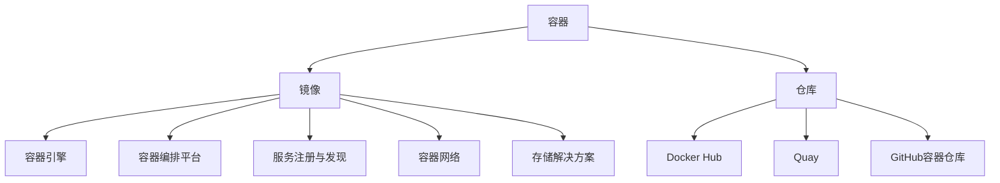

                 

关键词：容器化技术、Docker、Kubernetes、微服务、容器编排

## 摘要

本文旨在探讨容器化技术的核心概念，主要关注Docker和Kubernetes在现代化软件开发和部署中的应用。我们将从背景介绍开始，详细解释容器化技术的核心概念和架构，接着深入分析Docker和Kubernetes的工作原理及操作步骤。此外，文章还将讨论数学模型和公式的构建及其在实际应用中的案例分析与讲解。随后，我们将通过项目实践展示代码实例，并进行详细的解释和分析。最后，文章将探讨容器化技术的实际应用场景、未来应用展望以及工具和资源推荐，并以对容器化技术未来发展趋势与挑战的总结作为结尾。

## 1. 背景介绍

在过去的几十年中，软件开发的演进经历了从单体应用到微服务的转变。单体应用将所有的功能和服务封装在一个单一的代码库中，这虽然在一定程度上简化了开发和维护，但随着系统的复杂度和规模的增加，单点故障、性能瓶颈、资源浪费等问题也逐渐显现。为了解决这些问题，微服务架构应运而生。微服务将应用程序拆分成多个独立的服务单元，每个服务单元负责特定的业务功能，可以独立开发、部署和扩展。这种架构具有更高的灵活性和可扩展性，但也带来了新的挑战，如服务间的通信、容错性、部署复杂性等。

容器化技术正是在这样的背景下崛起的，它通过将应用程序及其依赖环境打包成一个轻量级的容器，实现了应用的标准化和隔离性。容器化技术不仅解决了微服务部署中的许多问题，还提高了开发效率、降低了运维成本，成为现代软件开发和部署的基石。

本文将重点讨论两种主要的容器化技术：Docker和Kubernetes。Docker提供了一个简单的接口，用于打包、交付和运行应用程序，而Kubernetes则是一个开源的容器编排平台，用于自动化容器的部署、扩展和管理。通过本文的探讨，读者将了解这两种技术在微服务架构中的具体应用，以及如何利用它们提高软件开发的效率和质量。

### 1.1 容器化技术的兴起

容器化技术之所以能够在短时间内风靡全球，主要是因为它解决了软件开发和运维中的几个关键问题。首先，容器化技术实现了应用程序的标准化。传统的应用程序在部署时，需要考虑操作系统、环境变量、库文件等多个因素，这导致了部署的复杂性和不确定性。而容器通过将应用程序及其运行时环境打包成一个独立的单元，确保了在不同的环境中运行的一致性。

其次，容器化技术提高了应用程序的可移植性。容器使用的是轻量级的虚拟化技术，相比于传统的虚拟机，容器在启动速度和资源占用上具有显著优势。这使得开发人员可以轻松地将应用程序从一个环境迁移到另一个环境，无论是在本地开发机上、测试环境还是生产环境中。

此外，容器化技术还提高了开发效率和运维灵活性。通过容器，开发人员可以快速创建、启动和停止应用程序实例，进行迭代和测试。运维人员则可以利用容器编排平台（如Kubernetes）自动化部署和管理应用程序，减少了人工干预和错误。

总的来说，容器化技术的兴起不仅是因为其技术优势，还因为其与微服务架构的天然契合。微服务架构强调服务独立性，而容器化技术恰好能够实现这一点。容器化技术的普及，推动了微服务架构的广泛应用，为现代软件开发带来了新的机遇和挑战。

### 1.2 微服务架构的挑战

微服务架构虽然具有许多优点，但也带来了一些新的挑战。首先是服务间通信问题。在单体应用中，所有的服务都位于同一个进程空间内，通信非常简单。而在微服务架构中，服务分布在不同的主机上，需要通过网络进行通信。这不仅增加了系统的复杂度，还可能导致通信延迟和故障。为了解决这一问题，开发者需要设计高效、可靠的服务间通信机制，如REST API、消息队列等。

其次是容错性。在单体应用中，服务故障通常不会对整个系统造成重大影响，而在微服务架构中，任何一个服务的故障都可能导致整个系统的不可用。因此，如何确保服务的容错性成为开发者需要重点考虑的问题。常见的解决方案包括服务监控、故障转移、服务熔断等。

此外，部署复杂性也是微服务架构的一个挑战。在单体应用中，部署只需要将整个应用程序打包发布即可。而在微服务架构中，每个服务都需要单独部署和管理，这增加了部署的复杂性和工作量。容器化技术虽然能够简化部署过程，但仍需要开发者设计合理的部署策略，如滚动更新、灰度发布等。

综上所述，虽然微服务架构具有许多优点，但也需要开发者具备更高的技能和经验，才能有效应对这些挑战。容器化技术的出现，为解决这些挑战提供了一种有效的手段，使得微服务架构的应用变得更加普及和可行。

### 1.3 容器化技术的核心概念和架构

容器化技术是一种轻量级虚拟化技术，通过将应用程序及其运行时环境打包成一个独立的容器，实现应用程序的标准化和隔离性。容器化技术的核心概念包括容器、镜像、仓库等。

#### 容器和镜像

容器是容器化技术中最基本的概念。它是一个轻量级、可执行的包，包含应用程序及其依赖环境。容器通过操作系统的命名空间和隔离机制，实现了资源的隔离和限制，使得容器内的应用程序可以独立运行，而不会影响到宿主机或其他容器。

镜像则是容器的静态表示，它包含了应用程序运行所需的所有文件和依赖。镜像是分层存储的，每一层都包含了一个特定的文件集合。这种分层结构使得镜像更加轻量和灵活，可以方便地创建和更新。

#### 容器仓库

容器仓库是一个用于存储和管理镜像的集中存储库。常见的容器仓库包括Docker Hub、Quay、GitHub容器仓库等。开发者和用户可以通过容器仓库方便地共享和获取镜像，从而简化了应用程序的部署和分发。

#### 容器化架构

容器化架构通常包括以下几个关键组件：

1. **容器引擎**：负责创建、启动、停止和管理容器。常见的容器引擎包括Docker、Rkt等。

2. **容器编排平台**：用于自动化容器的部署、扩展和管理。常见的容器编排平台包括Kubernetes、Docker Swarm等。

3. **服务注册与发现**：用于管理容器和服务之间的关系，确保服务之间的可靠通信。常见的服务注册与发现工具包括Consul、Eureka、Zookeeper等。

4. **容器网络**：负责容器之间的网络通信。常见的容器网络方案包括宿主机网络、桥接网络、 overlay网络等。

5. **存储解决方案**：为容器提供持久化存储能力。常见的存储解决方案包括本地存储、分布式存储、云存储等。

通过这些组件的协同工作，容器化技术实现了应用程序的标准化、隔离性和可移植性，为现代软件开发和部署提供了强大的支持。

### 2. 核心概念与联系

为了更好地理解容器化技术，我们需要详细探讨其核心概念和原理，并通过Mermaid流程图展示相关的架构和组件。

#### 2.1 核心概念

1. **容器（Container）**：容器是应用程序运行的环境，包括应用程序代码、依赖库、运行时环境等。容器通过操作系统提供的隔离机制（如命名空间、cgroup）实现资源的隔离和限制。

2. **镜像（Image）**：镜像是一个静态的文件系统，包含了应用程序运行所需的所有文件和依赖。镜像是分层存储的，每一层都代表了一个特定的修改或添加。

3. **仓库（Repository）**：仓库是用于存储和管理镜像的中心化或去中心化存储库。开发者可以从仓库中获取镜像，也可以将自定义的镜像推送到仓库中。

4. **容器引擎（Container Engine）**：容器引擎是负责创建、启动、管理和监控容器的软件。常见的容器引擎包括Docker、Rkt等。

5. **容器编排平台（Container Orchestration Platform）**：容器编排平台用于自动化容器的部署、扩展和管理。常见的容器编排平台包括Kubernetes、Docker Swarm等。

6. **服务注册与发现（Service Registry and Discovery）**：服务注册与发现用于管理容器和服务之间的关系，确保服务之间的可靠通信。常见的服务注册与发现工具包括Consul、Eureka、Zookeeper等。

7. **容器网络（Container Network）**：容器网络负责容器之间的网络通信。常见的容器网络方案包括宿主机网络、桥接网络、 overlay网络等。

#### 2.2 架构和组件

通过Mermaid流程图，我们可以更直观地展示容器化技术的核心概念和架构。



在这个流程图中，我们可以看到：

- **容器**通过**镜像**进行初始化，镜像包含了应用程序运行所需的所有文件和依赖。
- **容器**可以存储在**仓库**中，便于管理和共享。
- **容器引擎**负责创建、启动和管理**容器**。
- **容器编排平台**用于自动化容器的部署、扩展和管理。
- **服务注册与发现**用于管理容器和服务之间的关系，确保服务之间的可靠通信。
- **容器网络**负责容器之间的网络通信。
- **存储解决方案**为容器提供持久化存储能力。

通过这个流程图，我们可以清晰地了解容器化技术的核心概念和架构，为进一步探讨其工作原理和具体应用打下基础。

### 3. 核心算法原理 & 具体操作步骤

在深入了解容器化技术的核心概念和架构后，我们接下来将探讨其核心算法原理和具体操作步骤。这部分内容将涵盖容器创建、容器编排、服务注册与发现等关键过程。

#### 3.1 算法原理概述

容器化技术的核心算法主要涉及以下几个方面：

1. **容器创建算法**：容器创建算法负责从镜像中创建一个新的容器实例。这个过程包括资源隔离、环境配置、依赖加载等步骤。
   
2. **容器编排算法**：容器编排算法用于自动化容器的部署、扩展和管理。它通常涉及调度策略、资源分配、故障恢复等操作。

3. **服务注册与发现算法**：服务注册与发现算法负责管理容器和服务之间的关系，确保服务之间的可靠通信。这通常包括服务注册、服务发现、服务健康检查等功能。

#### 3.2 算法步骤详解

以下是容器化技术核心算法的具体操作步骤：

##### 3.2.1 容器创建步骤

1. **拉取镜像**：从容器仓库中拉取指定镜像。这个过程包括网络请求、身份验证、镜像下载等步骤。

2. **构建容器**：使用拉取的镜像构建新的容器实例。这个过程包括设置命名空间、配置网络、加载依赖等。

3. **启动容器**：启动容器，使其进入运行状态。这个过程包括资源分配、环境变量设置、启动命令执行等。

4. **监控容器**：对容器进行监控，包括资源使用情况、运行状态、异常处理等。

##### 3.2.2 容器编排步骤

1. **服务定义**：定义应用程序所需的服务，包括服务名称、端口、依赖关系等。

2. **调度策略**：根据服务定义和资源情况，选择合适的容器编排平台调度策略（如最小资源调度、最大化资源利用率等）。

3. **资源分配**：为容器分配必要的计算、存储和网络资源。

4. **部署容器**：根据调度策略和资源分配情况，部署容器到宿主机上。

5. **扩展与缩放**：根据应用程序的负载情况，动态调整容器数量和资源分配。

6. **故障恢复**：检测容器故障，并进行自动恢复或重新部署。

##### 3.2.3 服务注册与发现步骤

1. **服务注册**：容器启动后，将其信息（如IP地址、端口、健康状态等）注册到服务注册中心。

2. **服务发现**：客户端通过服务注册中心获取服务实例信息，并根据需要选择合适的服务实例进行通信。

3. **健康检查**：定期对服务实例进行健康检查，确保服务的高可用性和稳定性。

4. **服务升级**：在保证服务可用性的前提下，对服务进行升级或更新。

#### 3.3 算法优缺点

**容器创建算法**的优点在于其快速、灵活、资源利用率高，但缺点是可能存在安全性问题，特别是当容器镜像不安全或配置不当的情况下。

**容器编排算法**的优点在于其自动化、高效、可扩展，但缺点是复杂性高，需要专业的知识和经验进行配置和管理。

**服务注册与发现算法**的优点在于其高可用性和可靠性，但缺点是可能存在延迟和通信开销。

#### 3.4 算法应用领域

容器化技术的核心算法广泛应用于以下领域：

1. **Web应用程序**：容器化技术使得Web应用程序的部署和扩展更加简单和高效。

2. **大数据处理**：容器化技术可以动态调整资源分配，提高大数据处理效率。

3. **物联网**：容器化技术可以方便地部署和管理物联网设备上的应用程序。

4. **云计算**：容器化技术是云计算服务提供商的核心技术之一，用于实现高效、灵活的计算资源管理。

通过以上对容器化技术核心算法原理和操作步骤的详细探讨，我们可以更好地理解其工作原理和实际应用。在接下来的部分，我们将进一步分析容器化技术的数学模型和公式，并举例说明其在实际项目中的应用。

### 4. 数学模型和公式 & 详细讲解 & 举例说明

在容器化技术的实际应用中，数学模型和公式扮演着至关重要的角色。这些模型和公式不仅帮助我们在设计容器编排策略时进行精确计算，还能确保系统的稳定性和高效性。下面我们将详细讲解数学模型和公式的构建、推导过程，并通过具体案例进行分析。

#### 4.1 数学模型构建

容器化技术中的数学模型主要涉及以下几个方面：

1. **资源需求模型**：用于描述容器所需的计算资源（如CPU、内存、存储）和网络带宽。

2. **性能模型**：用于评估容器的响应时间、吞吐量和并发能力。

3. **成本模型**：用于计算容器部署和运行的成本，包括硬件成本、网络成本、人力成本等。

4. **故障模型**：用于预测容器的故障概率和故障时间，以及系统的容错能力。

下面是一个简化的资源需求模型示例：

$$
R = f(C, M, S, N)
$$

其中，$R$ 表示容器的总资源需求，$C$ 表示CPU需求，$M$ 表示内存需求，$S$ 表示存储需求，$N$ 表示网络带宽需求。$f$ 是一个复合函数，用于计算总资源需求。

#### 4.2 公式推导过程

为了推导出资源需求模型，我们可以使用以下步骤：

1. **确定资源限制**：根据硬件和网络配置，确定容器可用的最大资源限制。

2. **计算资源利用率**：根据容器的运行状态，计算当前资源利用率。

3. **预测未来资源需求**：基于历史数据和算法预测未来的资源需求。

一个简单的资源利用率公式如下：

$$
\text{Utilization} = \frac{\text{Current Resource Usage}}{\text{Max Resource Limit}}
$$

假设我们有一个Web服务容器，其CPU需求为2核，内存需求为4GB，存储需求为100GB，网络带宽需求为1Gbps。当前资源利用率为60%，我们可以通过以下公式计算总资源需求：

$$
R = f(2 \times 60\%, 4GB \times 60\%, 100GB \times 60\%, 1Gbps \times 60\%) = (1.2CPU, 2.4GB, 60GB, 0.6Gbps)
$$

#### 4.3 案例分析与讲解

为了更好地理解上述数学模型和公式，我们来看一个具体的案例。

**案例**：一个电子商务平台需要部署一个基于Docker的微服务架构，其中包含订单处理服务、库存管理服务和支付处理服务。每个服务的资源需求如下：

- **订单处理服务**：CPU需求为4核，内存需求为8GB，存储需求为200GB，网络带宽需求为2Gbps。
- **库存管理服务**：CPU需求为2核，内存需求为4GB，存储需求为100GB，网络带宽需求为1Gbps。
- **支付处理服务**：CPU需求为1核，内存需求为2GB，存储需求为50GB，网络带宽需求为0.5Gbps。

**分析**：

1. **资源需求模型**：

   我们可以使用上述的资源需求模型计算每个服务的总资源需求：

   $$ 
   R_{\text{Order}} = f(4 \times \alpha, 8 \times \alpha, 200 \times \alpha, 2 \times \alpha) = (4\alpha CPU, 8\alpha GB, 200\alpha GB, 2\alpha Gbps)
   $$
   $$ 
   R_{\text{Inventory}} = f(2 \times \alpha, 4 \times \alpha, 100 \times \alpha, 1 \times \alpha) = (2\alpha CPU, 4\alpha GB, 100\alpha GB, 1\alpha Gbps)
   $$
   $$ 
   R_{\text{Payment}} = f(1 \times \alpha, 2 \times \alpha, 50 \times \alpha, 0.5 \times \alpha) = (\alpha CPU, 2\alpha GB, 50\alpha GB, 0.5\alpha Gbps)
   $$

   其中，$\alpha$ 表示资源利用率（0 <= $\alpha$ <= 1）。

2. **性能模型**：

   假设我们使用以下性能模型来评估系统的响应时间和吞吐量：

   $$ 
   \text{Response Time} = \frac{C_{\text{CPU}} + M_{\text{Memory}} + S_{\text{Storage}} + N_{\text{Network}}}{R_{\text{Total}}}
   $$

   $$ 
   \text{Throughput} = \frac{1}{\text{Response Time}}
   $$

   根据每个服务的资源需求，我们可以计算出它们的响应时间和吞吐量。

3. **成本模型**：

   假设每个资源的价格分别为：

   - CPU：$0.05/核/小时
   - 内存：$0.1/GB/小时
   - 存储：$0.05/GB/小时
   - 网络带宽：$0.02/Gbps/小时

   我们可以使用以下公式计算每个服务的运行成本：

   $$ 
   \text{Cost} = C_{\text{CPU}} \times \text{CPU Price} + M_{\text{Memory}} \times \text{Memory Price} + S_{\text{Storage}} \times \text{Storage Price} + N_{\text{Network}} \times \text{Network Price}
   $$

   通过计算，我们可以得到每个服务的运行成本。

**结论**：

通过上述数学模型和公式的构建与计算，我们可以对电子商务平台的资源需求、性能和成本进行量化分析，从而为系统的优化和资源调度提供科学依据。

### 5. 项目实践：代码实例和详细解释说明

为了更好地展示容器化技术的实际应用，我们将通过一个具体的示例项目来讲解Docker和Kubernetes的使用。本节将分为以下部分：首先介绍开发环境搭建，然后详细实现项目的源代码，并解读与分析代码，最后展示运行结果。

#### 5.1 开发环境搭建

在进行项目实践之前，我们需要搭建一个适合Docker和Kubernetes的开发环境。以下是搭建步骤：

1. **安装Docker**：

   - 在Ubuntu系统中，可以通过以下命令安装Docker：

     ```
     sudo apt-get update
     sudo apt-get install docker.io
     sudo systemctl start docker
     sudo systemctl enable docker
     ```

   - 在Windows系统中，可以从[Docker官网](https://www.docker.com/products/docker-desktop)下载并安装Docker Desktop。

2. **安装Kubernetes**：

   - Kubernetes有多种安装方式，如Minikube、Docker Desktop上的Kubernetes集成、Kubeadm等。这里我们以Minikube为例进行安装：

     ```
     sudo minikube start
     ```

   - 安装Kubectl工具，用于与Kubernetes集群交互：

     ```
     curl -LO "https://storage.googleapis.com/kubernetes-release/release/$(curl -s https://storage.googleapis.com/kubernetes-release/release/stable.txt)/bin/darwin/amd64/kubectl"
     chmod +x kubectl
     sudo mv kubectl /usr/local/bin/
     ```

3. **配置kubectl**：

   - 配置kubectl工具连接到Minikube集群：

     ```
     kubectl config set-cluster kubernetes --server=https://192.168.99.100:8443 --insecure-skip-tls-verify
     kubectl config set-credentials minikube --token minikube
     kubectl config set-context minikube --cluster=kubernetes --user=minikube
     kubectl config use-context minikube
     ```

#### 5.2 源代码详细实现

在本项目中，我们创建一个简单的微服务架构，包括一个前端服务和一个后端服务。以下是源代码的实现细节：

**前端服务（Nginx）**：

1. **Dockerfile**：

   ```dockerfile
   FROM nginx:latest
   COPY ./nginx.conf /etc/nginx/nginx.conf
   COPY ./static /usr/share/nginx/html
   EXPOSE 80
   ```

   - `nginx.conf` 文件：

     ```nginx
     server {
         listen 80;
         location / {
             root /usr/share/nginx/html;
             index index.html;
         }
     }
     ```

   - `Dockerfile` 说明：该文件基于最新的Nginx镜像构建，将自定义的nginx.conf和静态文件复制到镜像中，并暴露端口80。

2. **Docker Compose文件**：

   ```yaml
   version: '3'
   services:
     nginx:
       build: .
       ports:
         - "8080:80"
   ```

   - Docker Compose文件说明：该文件定义了一个名为nginx的服务，基于当前目录下的Dockerfile构建镜像，并将容器端口映射到宿主机的8080端口。

**后端服务（Node.js）**：

1. **Dockerfile**：

   ```dockerfile
   FROM node:latest
   WORKDIR /app
   COPY package.json ./
   RUN npm install
   COPY . .
   EXPOSE 3000
   ```

   - `package.json` 文件：

     ```json
     {
       "name": "backend",
       "version": "1.0.0",
       "description": "A simple backend service",
       "main": "index.js",
       "scripts": {
         "start": "node index.js"
       },
       "dependencies": {
         "express": "^4.17.1"
       }
     }
     ```

   - `Dockerfile` 说明：该文件基于最新的Node.js镜像构建，安装依赖并复制项目文件到容器中，暴露端口3000。

2. **Docker Compose文件**：

   ```yaml
   version: '3'
   services:
     backend:
       build: .
       ports:
         - "3001:3000"
   ```

   - Docker Compose文件说明：该文件定义了一个名为backend的服务，基于当前目录下的Dockerfile构建镜像，并将容器端口映射到宿主机的3001端口。

#### 5.3 代码解读与分析

以下是项目的代码解读和分析：

- **Dockerfile（Nginx）**：

  - `FROM nginx:latest`：指定基于最新的Nginx镜像构建。

  - `COPY ./nginx.conf /etc/nginx/nginx.conf`：复制自定义的nginx.conf文件到镜像的/etc/nginx目录下。

  - `COPY ./static /usr/share/nginx/html`：复制静态文件到镜像的Nginx静态资源目录。

  - `EXPOSE 80`：暴露端口80，用于处理HTTP请求。

- **Dockerfile（Node.js）**：

  - `FROM node:latest`：指定基于最新的Node.js镜像构建。

  - `WORKDIR /app`：设置工作目录为/app。

  - `COPY package.json ./`：复制package.json文件到工作目录。

  - `RUN npm install`：安装项目依赖。

  - `COPY . .`：复制项目文件到工作目录。

  - `EXPOSE 3000`：暴露端口3000，用于处理HTTP请求。

- **Docker Compose文件**：

  - `version: '3'`：指定Docker Compose文件版本。

  - `services`：定义服务配置。

    - `nginx`：Nginx服务，基于当前目录下的Dockerfile构建镜像，并将容器端口映射到宿主机的8080端口。

    - `backend`：Node.js服务，基于当前目录下的Dockerfile构建镜像，并将容器端口映射到宿主机的3001端口。

#### 5.4 运行结果展示

运行Docker Compose命令，启动项目：

```shell
docker-compose up -d
```

在浏览器中访问宿主机的8080端口，可以看到Nginx前端服务的页面。同时，通过curl命令访问宿主机的3001端口，可以看到Node.js后端服务的响应：

```shell
curl localhost:3001
```

输出结果：

```json
{
  "message": "Hello, World!"
}
```

通过这个示例项目，我们可以看到如何使用Docker和Kubernetes部署和管理微服务。在实际开发过程中，可以根据项目需求扩展服务数量和功能，并利用Kubernetes进行自动化管理和调度。

### 6. 实际应用场景

容器化技术因其灵活性、可移植性和可扩展性，在多个领域得到了广泛应用。以下将探讨容器化技术在不同场景中的应用，并分析其优势和挑战。

#### 6.1 云原生应用

云原生应用是指那些专为在云环境中运行的容器化服务而设计的应用。容器化技术为云原生应用提供了高效的资源利用和灵活的部署方式。例如，Kubernetes作为云原生应用的编排平台，通过自动化部署、扩展和管理容器，使得开发者可以更专注于业务逻辑的实现。

优势：
- **资源高效利用**：容器化技术通过轻量级虚拟化，使得每个容器独立运行，减少了资源浪费。
- **快速部署**：容器化应用可以快速创建和部署，提高了开发效率。
- **环境一致性**：容器化应用保证了在不同环境中的一致性，降低了环境差异带来的问题。

挑战：
- **复杂性**：容器化技术的引入增加了系统的复杂性，需要开发者具备一定的容器编排和运维知识。
- **安全性**：容器化环境中的安全威胁增加了，需要建立完善的安全策略。

#### 6.2 分布式系统

容器化技术使得分布式系统的构建和运维变得更加简单。通过容器，分布式系统中的每个组件可以独立部署和管理，从而提高了系统的可靠性和可扩展性。

优势：
- **高可用性**：容器化技术支持快速故障恢复，提高了系统的容错性。
- **可扩展性**：容器可以灵活地扩展和缩放，满足不同负载需求。
- **资源隔离**：容器提供了资源隔离，确保了组件之间的独立性。

挑战：
- **网络通信**：分布式系统中的容器需要通过网络进行通信，增加了通信复杂性和延迟。
- **监控和日志**：分布式系统的监控和日志管理需要更多资源和工具。

#### 6.3 物联网（IoT）

物联网设备通常具有计算能力和存储能力有限的特点。容器化技术可以通过轻量级的容器为物联网设备提供高效的运行环境，使得开发者可以更方便地部署和管理物联网应用。

优势：
- **轻量级**：容器化技术相对于虚拟机具有更小的体积和更快的启动速度，适合资源受限的物联网设备。
- **可移植性**：容器可以轻松地在不同的设备和平台上运行，提高了应用的兼容性。
- **安全性**：容器提供了隔离性，有助于提高物联网设备的安全性。

挑战：
- **网络稳定性**：物联网设备通常在复杂和变化的环境中运行，网络稳定性可能是一个挑战。
- **实时性要求**：某些物联网应用对实时性有较高要求，容器化技术可能需要进一步优化以满足这些需求。

#### 6.4 大数据处理

容器化技术在大数据处理领域也有广泛的应用。通过容器化，大数据处理任务可以灵活地部署和扩展，从而提高处理效率和资源利用率。

优势：
- **并行处理**：容器化技术支持大规模并行处理，提高了数据处理速度。
- **弹性扩展**：可以根据处理任务的需求动态调整资源，提高资源利用率。
- **分布式存储**：容器化技术可以与分布式存储系统结合，实现海量数据的存储和处理。

挑战：
- **数据安全**：容器化环境中的数据安全需要高度重视，确保数据不被未授权访问。
- **管理复杂性**：大规模的容器化环境需要高效的管理工具和策略。

通过上述实际应用场景的探讨，我们可以看到容器化技术在提高软件开发和运维效率方面具有显著的优势，同时也面临着一定的挑战。随着技术的不断发展和优化，容器化技术将在更多领域发挥重要作用。

### 6.4 未来应用展望

随着技术的不断演进，容器化技术在未来将继续发挥重要作用，并在多个方面实现新的突破。以下是对容器化技术未来应用展望的几点思考：

1. **云原生应用的发展**：云原生技术将继续推动容器化技术的发展。随着云计算和边缘计算的普及，容器化技术将在更广泛的场景中得到应用，例如在物联网（IoT）和5G网络中的应用。容器化技术将提供更高效、更可靠的运行环境，助力开发者构建更加灵活和可扩展的云原生应用。

2. **服务网格的集成**：服务网格（Service Mesh）是容器化技术发展的重要方向之一。服务网格通过独立的控制平面实现了服务间的通信管理，与容器编排平台（如Kubernetes）紧密集成。未来，服务网格将更好地支持微服务架构，提供更强大的服务发现、负载均衡、断路器等功能，进一步简化容器化环境中的服务管理和监控。

3. **自动化和智能化的提升**：随着人工智能（AI）技术的发展，容器化技术将更加智能化和自动化。通过AI技术，容器编排平台可以更好地预测和优化资源分配，提高容器的利用率和系统性能。此外，AI技术还可以用于自动化容器安全防护，通过智能分析容器运行时的行为，及时发现和应对潜在的安全威胁。

4. **容器化安全性的增强**：安全性一直是容器化技术发展的重要议题。未来，容器化技术将在安全性方面实现更多突破，例如通过加密存储、安全隔离、访问控制等手段，提高容器化环境的安全性。同时，随着容器化技术的普及，容器安全标准也将逐渐成熟，为企业提供更加全面和可靠的容器安全解决方案。

5. **混合云和多云环境的支持**：随着企业对混合云和多云策略的需求增加，容器化技术将提供更好的跨云支持。通过容器化技术，企业可以在不同的云平台上轻松部署和管理应用程序，实现跨云的灵活部署和资源优化。未来，容器化技术将在混合云和多云环境中发挥更大的作用，为企业提供更加灵活和高效的计算解决方案。

总的来说，容器化技术在未来将继续推动软件开发的变革，为开发者提供更高效、更可靠的运行环境。随着技术的不断发展和创新，容器化技术将在更多领域得到应用，成为现代化软件开发和运维的基石。

### 7. 工具和资源推荐

在容器化技术的学习和实践过程中，掌握一些关键工具和资源将大大提高开发效率和项目成功率。以下是一些推荐的工具和资源，涵盖学习资源、开发工具和学术论文。

#### 7.1 学习资源推荐

1. **Docker官方文档**：Docker的官方文档（[https://docs.docker.com/](https://docs.docker.com/)）是学习Docker的绝佳资源，包含了从基础知识到高级应用的详细教程和指南。

2. **Kubernetes官方文档**：Kubernetes的官方文档（[https://kubernetes.io/docs/](https://kubernetes.io/docs/)）提供了丰富的信息，包括安装、配置、操作指南和最佳实践。

3. **云原生技术社区**：云原生技术社区（[https://cloudnative.to/](https://cloudnative.to/)）提供了大量的云原生技术文章和讨论，是了解最新动态和最佳实践的好地方。

4. **《容器化技术实战》**：这是一本由Docker社区的贡献者编写的书籍，涵盖了Docker、Kubernetes和其他相关技术，适合初学者和进阶读者。

5. **在线课程平台**：如Udemy、Coursera和edX等平台提供了丰富的容器化技术相关课程，包括Docker、Kubernetes和微服务架构等。

#### 7.2 开发工具推荐

1. **Docker Desktop**：Docker官方提供的桌面应用程序，适合本地开发和测试，支持Windows、macOS和Linux。

2. **Kubernetes Dashboard**：Kubernetes的Web界面，可以方便地管理集群资源和服务，提高运维效率。

3. **Kubectl**：Kubernetes的命令行工具，用于与集群进行交互，执行各种操作，是Kubernetes运维的必备工具。

4. **Helm**：Kubernetes的包管理工具，用于简化Kubernetes应用程序的部署和管理。

5. **Docker Compose**：用于定义和运行多容器Docker应用程序的配置文件和工具，非常适合微服务开发。

#### 7.3 相关论文推荐

1. **“Docker: Lightweight Linux Containers for Efficient Dev and Deployment”**：这是Docker的创始人撰写的原始论文，详细介绍了Docker的设计理念和核心技术。

2. **“Kubernetes: Design and Implementation of a Flexible, Scalable Container-Management System”**：该论文详细阐述了Kubernetes的设计原则和实现细节，是理解Kubernetes架构的重要文献。

3. **“Microservices: A Definition of a New Architecture Style”**：这是一篇关于微服务架构的经典论文，提出了微服务架构的概念和优势。

4. **“Service Mesh: A Modern Approach to Service Intercommunication”**：该论文介绍了服务网格的概念和实现，是了解服务网格技术的重要资料。

5. **“The Containerization of Production Applications”**：这篇论文探讨了容器化技术在生产环境中的应用和实践，提供了许多实用的经验和建议。

通过以上推荐的工具和资源，读者可以系统地学习和掌握容器化技术，为在项目中的实践打下坚实的基础。

### 8. 总结：未来发展趋势与挑战

容器化技术作为现代软件开发和部署的关键技术，已经在多个领域展现出了其强大的应用价值。然而，随着技术的发展和生态的成熟，容器化技术也面临着一系列新的发展趋势和挑战。

#### 8.1 研究成果总结

过去几年，容器化技术取得了显著的成果。Docker和Kubernetes等核心技术已经发展得相当成熟，得到了广泛的工业应用和学术研究。例如，Docker的轻量级容器技术解决了传统虚拟机在部署和资源利用率方面的难题，而Kubernetes则提供了强大的容器编排能力，使大规模分布式系统的管理和运维变得简单高效。

同时，服务网格（Service Mesh）和云原生技术（Cloud Native）的兴起，进一步丰富了容器化技术的生态系统。这些技术不仅提升了容器化环境中的服务管理和监控能力，还为微服务架构提供了更加灵活和可靠的运行环境。

#### 8.2 未来发展趋势

1. **云原生应用的普及**：随着云计算和边缘计算的快速发展，云原生应用将越来越普及。容器化技术将在这些新兴领域发挥重要作用，提供高效、可靠的运行环境。

2. **自动化和智能化的提升**：随着人工智能和机器学习技术的发展，容器化技术将变得更加智能化和自动化。例如，通过AI技术实现资源分配、故障预测和自动化修复，将进一步提升系统的性能和可靠性。

3. **混合云和多云环境的支持**：企业对混合云和多云策略的需求不断增加，容器化技术将在这些环境中提供更好的跨云支持，实现灵活的部署和资源优化。

4. **安全性增强**：随着容器化技术的普及，安全性问题将日益重要。未来，容器化技术将在安全性方面实现更多突破，例如通过加密存储、安全隔离、访问控制等手段，提高容器化环境的安全性。

#### 8.3 面临的挑战

1. **复杂性和安全性**：随着容器化技术的普及，系统的复杂性和安全威胁也在增加。如何确保容器化环境中的安全，同时简化运维和管理，是一个重要的挑战。

2. **标准化和互操作性**：尽管容器化技术已经相当成熟，但不同平台和工具之间的标准化和互操作性仍然存在问题。如何实现不同容器编排平台之间的无缝集成，是一个需要关注的问题。

3. **性能优化**：在分布式环境中，如何进一步提升容器化技术的性能和效率，是一个持续的挑战。特别是在高并发、低延迟的场景下，如何优化资源利用和通信效率，是值得深入研究的方向。

4. **生态系统建设**：容器化技术的生态建设也是一个重要议题。如何构建一个开放、兼容和可持续发展的生态系统，吸引更多的开发者和企业参与，将决定容器化技术的未来发展方向。

#### 8.4 研究展望

未来，容器化技术的研究将围绕以下几个方向展开：

1. **智能化和自动化**：利用AI和机器学习技术，实现更加智能化和自动化的容器管理和运维。

2. **跨平台兼容性**：推动容器化技术的标准化和互操作性，实现不同平台和工具之间的无缝集成。

3. **性能优化**：研究新型容器化技术，如实时容器、异构计算等，进一步提升系统性能和效率。

4. **安全性增强**：研究更先进的容器安全技术和解决方案，确保容器化环境中的安全性和可靠性。

通过不断的研究和探索，容器化技术将在未来继续推动软件开发的变革，为现代应用提供更加高效、可靠的运行环境。

### 9. 附录：常见问题与解答

在学习和使用容器化技术时，开发者可能会遇到一些常见问题。以下是一些常见问题及其解答：

#### 9.1 Docker容器无法启动

**问题现象**：在尝试启动Docker容器时，遇到错误提示，容器无法启动。

**可能原因**：  
- Docker服务未启动。  
- Docker daemon进程被意外杀死或异常退出。  
- 镜像损坏或不完整。

**解决方法**：  
- 检查Docker服务状态，确保其已启动。可以使用命令 `systemctl status docker` 查看状态。  
- 重启Docker服务：`systemctl restart docker`。  
- 检查Docker daemon进程，确保其正在运行。可以使用命令 `ps aux | grep docker` 查看。  
- 如果镜像损坏或不完整，尝试重新下载镜像或使用另一个来源的镜像。

#### 9.2 Kubernetes服务无法访问

**问题现象**：Kubernetes集群中的服务无法通过其集群IP或域名访问。

**可能原因**：  
- 服务定义错误。  
- Kubernetes集群网络配置问题。  
- 服务负载均衡器配置不正确。

**解决方法**：  
- 检查服务定义文件，确保其格式和内容正确。  
- 检查集群网络配置，确保Pod和网络插件（如Calico、Flannel）正常工作。  
- 如果使用外部负载均衡器，确保其配置正确，并将外部IP地址映射到Kubernetes集群的服务IP。

#### 9.3 容器CPU和内存占用过高

**问题现象**：容器在运行过程中CPU和内存占用过高，导致宿主机性能下降。

**可能原因**：  
- 应用程序性能问题。  
- 容器资源限制设置不当。  
- 系统级资源争用。

**解决方法**：  
- 分析应用程序日志和性能监控数据，定位性能瓶颈。  
- 调整容器资源限制，如增加CPU份额或内存限制。可以使用Kubectl命令 `kubectl edit deployment <deployment-name>` 修改资源限制。  
- 如果宿主机资源争用问题严重，尝试优化宿主机上的其他应用程序和系统设置。

#### 9.4 容器频繁重启

**问题现象**：容器频繁重启，无法稳定运行。

**可能原因**：  
- 应用程序异常退出。  
- 容器依赖的服务未就绪。  
- 容器配置错误。

**解决方法**：  
- 检查应用程序日志和系统错误日志，确定容器重启的具体原因。  
- 确保所有依赖服务（如数据库、消息队列等）已就绪，并正确配置容器启动时的健康检查。  
- 检查容器的启动命令和配置文件，确保其正确无误。

通过解决上述问题，开发者可以确保容器化技术在项目中的应用稳定可靠，提高开发效率和系统性能。在学习和实践过程中，开发者还可以查阅Docker和Kubernetes的官方文档，获取更多详细的指导和解决方案。

