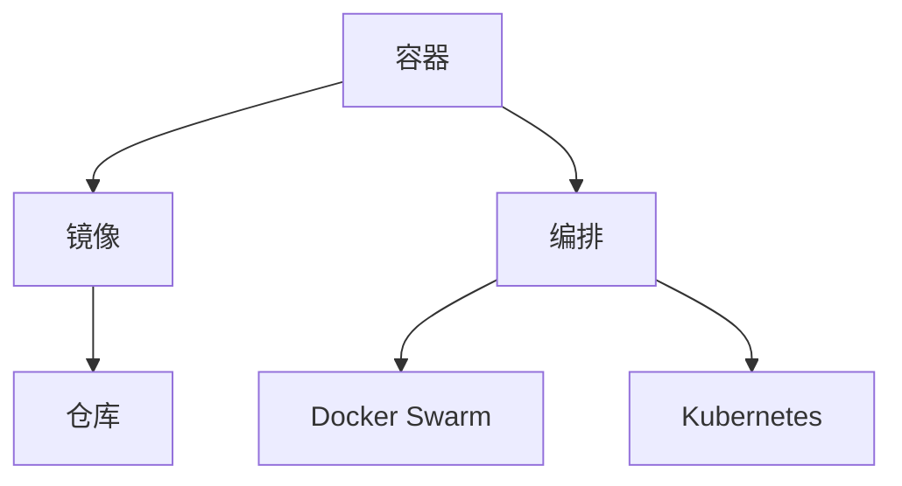

                 

关键词：容器化技术、Docker、Kubernetes、实践、微服务架构、持续集成、持续部署

## 摘要

本文旨在深入探讨容器化技术，特别是Docker与Kubernetes的应用与实践。通过梳理容器化的背景与重要性，详细介绍Docker的基本概念、安装与配置，以及Kubernetes的核心架构与功能。接着，我们将通过具体的案例，展示如何利用Docker和Kubernetes实现微服务架构的持续集成与持续部署，最后对这两项技术的未来发展趋势和面临的挑战进行展望。

## 1. 背景介绍

容器技术自其诞生以来，已经成为现代软件开发和运维的基石。传统的虚拟化技术虽然能够实现隔离，但其资源开销较大，部署复杂。而容器则通过轻量级的隔离机制，使得应用程序能够在几乎相同的运行环境中跨不同主机、云平台进行部署和运行。

Docker 是最流行的容器化平台之一，它简化了容器的创建、部署和运行。通过Docker，开发者可以将应用程序及其依赖打包到一个容器中，保证其在任何地方都能按照预期运行。

Kubernetes 则是一个开源的容器编排平台，它负责管理容器的生命周期，包括部署、扩展和滚动更新等。Kubernetes 提供了强大的集群管理能力，使得开发者可以更加专注于应用程序的开发，而无需担心底层的基础设施管理。

容器化技术的出现，不仅使得持续集成和持续部署（CI/CD）成为可能，还推动了微服务架构的流行。微服务架构将大型应用程序拆分成多个独立的小服务，每个服务都可以独立开发、部署和扩展，从而提高了系统的可伸缩性和可靠性。

## 2. 核心概念与联系

为了更好地理解容器化技术，我们需要首先掌握几个核心概念：容器、镜像、仓库、编排。

### 2.1 容器和镜像

容器（Container）是容器化的基本单位，它包含了应用程序及其运行环境。容器通过隔离机制，使得应用程序在内部运行时不会影响到其他容器或系统。

镜像（Image）是容器的静态版本，它包含了应用程序、库、配置文件等所有需要运行的资源。容器是通过镜像来创建的，每个容器都是基于一个镜像运行的实例。

### 2.2 仓库

仓库（Repository）是用于存储和管理镜像的地方。Docker Hub 是最常用的公共仓库，开发者可以在这里共享、下载和更新自己的镜像。

### 2.3 编排

编排（Orchestration）是指管理和自动化容器集群的过程。Docker Swarm 和 Kubernetes 都是常见的编排工具。

### 2.4 Mermaid 流程图



## 3. 核心算法原理 & 具体操作步骤

### 3.1 算法原理概述

容器化技术的核心算法原理主要包括：

- 隔离：通过命名空间（Namespace）和cgroups实现进程和资源的隔离。
- 资源管理：通过cgroups实现对容器CPU、内存、磁盘等资源的限制。
- 网络通信：通过VLAN和iptables实现容器间的网络通信。

### 3.2 算法步骤详解

#### 3.2.1 Docker的基本操作

1. **安装Docker**：在Linux系统中，通常通过包管理器进行安装。
2. **创建镜像**：使用Dockerfile定义应用程序的运行环境。
3. **构建镜像**：通过docker build命令生成镜像。
4. **运行容器**：使用docker run命令启动容器。
5. **管理容器**：通过docker ps、docker stop等命令查看和管理容器。

#### 3.2.2 Kubernetes的核心操作

1. **安装Kubernetes**：在集群中安装Kubernetes的各个组件。
2. **创建部署**：使用kubectl命令部署应用程序。
3. **管理部署**：通过kubectl get、kubectl scale等命令管理部署。
4. **服务发现与负载均衡**：使用Service和Ingress实现服务发现和负载均衡。

### 3.3 算法优缺点

- **Docker**：
  - 优点：轻量级、简单易用、支持微服务架构。
  - 缺点：缺乏集群管理能力、不适合大规模应用。

- **Kubernetes**：
  - 优点：强大的集群管理能力、可伸缩性强、支持多种编排方式。
  - 缺点：配置复杂、学习曲线较陡峭。

### 3.4 算法应用领域

- **Docker**：适合用于开发和测试环境，以及需要快速部署和迭代的应用程序。
- **Kubernetes**：适合用于生产环境，特别是需要高可用性和可伸缩性的大型应用。

## 4. 数学模型和公式 & 详细讲解 & 举例说明

### 4.1 数学模型构建

在容器化技术中，我们可以使用以下数学模型来评估系统的性能：

- **CPU利用率**：\( CPU_{利用率} = \frac{CPU_{使用时间}}{CPU_{总时间}} \times 100\% \)
- **内存利用率**：\( MEM_{利用率} = \frac{MEM_{使用量}}{MEM_{总量}} \times 100\% \)
- **容器密度**：\( D_{容器密度} = \frac{容器数量}{主机数量} \)

### 4.2 公式推导过程

#### CPU利用率推导

CPU利用率是评估系统性能的关键指标。其计算公式如下：

\[ CPU_{利用率} = \frac{CPU_{使用时间}}{CPU_{总时间}} \times 100\% \]

其中，\( CPU_{使用时间} \) 是指容器在运行过程中使用CPU的时间，\( CPU_{总时间} \) 是指容器运行的总时间。

#### 内存利用率推导

内存利用率用于评估系统内存的使用情况。其计算公式如下：

\[ MEM_{利用率} = \frac{MEM_{使用量}}{MEM_{总量}} \times 100\% \]

其中，\( MEM_{使用量} \) 是指容器在运行过程中使用的内存量，\( MEM_{总量} \) 是指系统总的内存容量。

#### 容器密度推导

容器密度用于评估系统容器的分布情况。其计算公式如下：

\[ D_{容器密度} = \frac{容器数量}{主机数量} \]

其中，\( 容器数量 \) 是指系统中运行的所有容器数量，\( 主机数量 \) 是指系统中运行容器的服务器数量。

### 4.3 案例分析与讲解

假设一个系统中运行了100个容器，系统总共有10台主机。其中，每个容器的CPU使用时间为1000秒，CPU总时间为2000秒；每个容器的内存使用量为1GB，内存总量为2GB。根据上述公式，我们可以计算出：

- CPU利用率：\( CPU_{利用率} = \frac{1000}{2000} \times 100\% = 50\% \)
- 内存利用率：\( MEM_{利用率} = \frac{1}{2} \times 100\% = 50\% \)
- 容器密度：\( D_{容器密度} = \frac{100}{10} = 10 \)

通过这些指标，我们可以评估系统的性能和容器的分布情况。如果某个主机的容器密度过高，可能会导致资源竞争，影响系统的稳定性。

## 5. 项目实践：代码实例和详细解释说明

### 5.1 开发环境搭建

在开始实践之前，我们需要搭建一个开发环境。首先，确保系统中安装了Docker和Kubernetes。

#### 安装Docker

在Linux系统中，可以通过以下命令安装Docker：

```bash
sudo apt-get update
sudo apt-get install docker.io
sudo systemctl start docker
```

#### 安装Kubernetes

安装Kubernetes的方式取决于操作系统。例如，在Ubuntu 18.04上，可以通过以下命令安装：

```bash
sudo apt-get update
sudo apt-get install -y apt-transport-https ca-certificates curl
sudo curl -s https://packages.cloud.google.com/apt/doc/apt-key.gpg | sudo apt-key add -
sudo echo "deb https://apt.kubernetes.io/ kubernetes-xenial main" | sudo tee -a /etc/apt/sources.list.d/kubernetes.list
sudo apt-get update
sudo apt-get install -y kubelet kubeadm kubectl
sudo apt-mark hold kubelet kubeadm kubectl
```

### 5.2 源代码详细实现

在本节中，我们将创建一个简单的微服务应用程序，并使用Docker和Kubernetes进行部署和管理。

#### 创建Dockerfile

```Dockerfile
FROM python:3.8
WORKDIR /app
COPY . .
RUN pip install -r requirements.txt
CMD ["python", "app.py"]
```

#### 创建Docker Compose文件

```yaml
version: '3'
services:
  web:
    build: .
    ports:
      - "8080:8080"
  db:
    image: postgres:13
    environment:
      POSTGRES_DB: myapp
      POSTGRES_USER: user
      POSTGRES_PASSWORD: password
```

#### 构建和运行容器

```bash
docker-compose build
docker-compose up -d
```

### 5.3 代码解读与分析

在上面的示例中，我们使用Docker Compose来定义和运行容器。Dockerfile定义了应用程序的运行环境，而docker-compose文件则定义了容器的配置和依赖关系。

通过运行docker-compose build，我们可以构建应用程序的Docker镜像。而运行docker-compose up -d则启动了应用程序的容器，并将它们运行在后台。

### 5.4 运行结果展示

在浏览器中输入`http://localhost:8080`，我们可以看到应用程序的运行结果。

## 6. 实际应用场景

容器化技术已经被广泛应用于实际应用场景中，以下是一些典型的应用场景：

- **持续集成和持续部署（CI/CD）**：容器化技术使得CI/CD流程更加简单和高效。通过Docker和Kubernetes，开发者可以轻松地将代码从仓库推送到容器中，并进行自动化测试和部署。
- **微服务架构**：容器化技术非常适合用于实现微服务架构。每个微服务都可以独立部署和扩展，从而提高了系统的可伸缩性和可靠性。
- **DevOps**：容器化技术推动了DevOps文化的普及。通过容器化，开发者可以更加便捷地与运维团队合作，实现快速迭代和交付。

## 7. 工具和资源推荐

### 7.1 学习资源推荐

- 《Docker实战》
- 《Kubernetes权威指南》
- 《容器化与微服务架构》

### 7.2 开发工具推荐

- Docker Desktop
- Kubernetes CLI (kubectl)
- Visual Studio Code with Docker and Kubernetes extensions

### 7.3 相关论文推荐

- "Docker: Lightweight Linux Containers for Developing, Shipping, and Running Applications"
- "Kubernetes: Design and Implementation"

## 8. 总结：未来发展趋势与挑战

### 8.1 研究成果总结

容器化技术在过去几年中取得了显著的成果，已经成为现代软件开发和运维的基石。Docker和Kubernetes作为容器化技术的代表，已经广泛应用于各个领域。

### 8.2 未来发展趋势

- **容器化技术的进一步普及**：随着云计算和大数据技术的发展，容器化技术将在更多领域得到应用。
- **自动化与智能化**：容器编排和管理将更加自动化和智能化，减少人为干预。
- **跨平台支持**：容器化技术将逐步实现跨平台支持，包括Windows、macOS等。

### 8.3 面临的挑战

- **安全性**：容器化技术带来的安全挑战不容忽视，需要加强安全防护措施。
- **标准化**：尽管Docker和Kubernetes已经成为行业标准，但仍需要进一步完善和标准化。
- **资源管理**：随着容器数量的增加，资源管理将成为更大的挑战，需要更加高效的资源分配和调度策略。

### 8.4 研究展望

容器化技术在未来将继续发展和完善，为软件开发和运维带来更多便利。同时，研究者需要关注安全性、标准化和资源管理等问题，以实现更加高效、可靠和安全的容器化应用。

## 9. 附录：常见问题与解答

### 9.1 Docker和Kubernetes有什么区别？

Docker是一个容器化平台，它负责创建、部署和运行容器。而Kubernetes是一个容器编排平台，它负责管理和自动化容器的生命周期。

### 9.2 如何在Kubernetes中部署多个容器？

在Kubernetes中，可以使用Deployment来部署多个容器。Deployment提供了一种声明式的方法来管理容器的部署、更新和扩展。

### 9.3 Docker和Kubernetes哪个更好？

Docker和Kubernetes各有优势，选择哪个取决于具体的应用场景和需求。Docker更适合于轻量级和快速部署的应用，而Kubernetes更适合于大规模和高可用的生产环境。

----------------------------------------------------------------

# 文章结束

> 作者：禅与计算机程序设计艺术 / Zen and the Art of Computer Programming
> 日期：2023年5月
> 说明：本文内容仅供参考，具体实施请结合实际情况进行调整。
----------------------------------------------------------------


