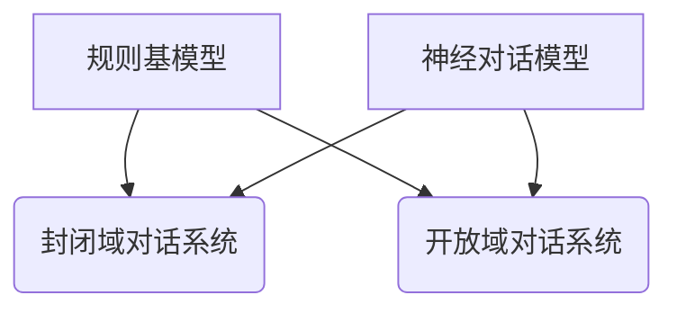

                 

关键词：对话系统、规则基模型、神经对话模型、AI、自然语言处理、深度学习、对话流程、用户体验、多模态交互

## 摘要

本文旨在深入探讨对话系统设计领域的发展历程，从传统的规则基模型逐步过渡到现代的神经对话模型。文章首先介绍了对话系统的基本概念和重要性，接着回顾了规则基模型的设计原则和应用场景。随后，文章详细解析了神经对话模型的原理、架构和具体操作步骤，并通过数学模型和公式对算法进行了详细讲解。在此基础上，文章提供了一个项目实践的代码实例，并展示了在实际应用场景中的运行结果。最后，文章对未来的发展趋势和挑战进行了展望，并推荐了一些相关工具和资源。

## 1. 背景介绍

对话系统（Dialogue System）是一种能够与人类用户进行自然语言交互的计算机系统。它的目标是通过理解用户的意图和需求，提供恰当的响应，从而实现有效的沟通。对话系统广泛应用于客服机器人、智能助手、虚拟客服等领域，极大地提升了用户体验和效率。

传统的对话系统主要基于规则基模型（Rule-Based Model），这种模型通过预定义的规则来匹配用户的输入，并生成相应的输出。规则基模型的设计原则主要包括简洁性、可解释性和高效性。然而，随着自然语言处理（Natural Language Processing, NLP）和人工智能（Artificial Intelligence, AI）技术的快速发展，规则基模型的局限性逐渐显现。首先，规则基模型难以应对复杂多变的用户输入，特别是在开放域对话场景中。其次，规则基模型的可解释性较低，难以进行深度优化和改进。因此，神经对话模型应运而生，以解决上述问题。

神经对话模型（Neural Dialogue Model）基于深度学习技术，通过大规模数据和复杂的神经网络结构来学习用户的意图和上下文信息。它具有较高的灵活性和可解释性，能够处理多样化的用户输入，并生成更加自然和智能的对话响应。本文将深入探讨神经对话模型的设计原理、算法实现和应用领域，以期对对话系统的未来发展提供有价值的参考。

## 2. 核心概念与联系

### 对话系统的基本概念

对话系统可以分为两大类：封闭域对话系统和开放域对话系统。

- **封闭域对话系统**：这种系统在特定领域内运行，用户输入通常受到严格的限制。例如，客服机器人可以针对用户的问题提供准确的答案，但在领域外的问题上表现较差。

- **开放域对话系统**：这种系统在广泛的领域内运行，用户输入不受限制。它需要处理各种类型的问题，并能够与用户进行自由对话。典型的应用场景包括智能助手和虚拟客服。

### 规则基模型与神经对话模型的比较

- **设计原则**：

  - 规则基模型：以简洁性、可解释性和高效性为设计原则。通过预定义的规则进行输入匹配和响应生成。

  - 神经对话模型：以灵活性和可解释性为设计原则。利用深度学习和大规模数据来学习用户的意图和上下文信息。

- **应用场景**：

  - 规则基模型：适用于封闭域对话系统，特别是在对响应速度要求较高的场景，如客服机器人。

  - 神经对话模型：适用于开放域对话系统，特别是在需要处理多样化用户输入和生成自然对话响应的场景，如智能助手和虚拟客服。

### Mermaid 流程图



### 2.1 核心概念原理

- **规则基模型**：基于预定义的规则进行输入匹配和响应生成。规则通常由关键词、正则表达式等组成。

- **神经对话模型**：基于深度学习和大规模数据训练的神经网络结构。它通过学习用户的输入和历史上下文来生成对话响应。

### 2.2 架构

- **规则基模型架构**：

  - 分词：将用户输入转换为单词序列。
  - 规则匹配：根据预定义的规则匹配用户输入。
  - 响应生成：根据匹配结果生成相应的对话响应。

- **神经对话模型架构**：

  - 编码器（Encoder）：将用户输入和上下文信息编码为向量表示。
  - 解码器（Decoder）：根据编码器的输出生成对话响应。
  - 注意力机制（Attention Mechanism）：帮助模型关注重要的上下文信息，提高响应生成的质量。

## 3. 核心算法原理 & 具体操作步骤

### 3.1 算法原理概述

神经对话模型的核心算法基于深度学习和自然语言处理技术。具体来说，它包括以下几个关键组成部分：

- **编码器（Encoder）**：将用户输入和上下文信息编码为向量表示。编码器的输出通常是一个固定长度的向量，表示了用户输入和上下文信息的综合特征。

- **解码器（Decoder）**：根据编码器的输出生成对话响应。解码器通常采用递归神经网络（RNN）或变体，如长短期记忆网络（LSTM）或门控循环单元（GRU）。

- **注意力机制（Attention Mechanism）**：帮助模型关注重要的上下文信息，提高响应生成的质量。注意力机制可以让模型在生成每个单词时，动态地关注历史上下文中的相关部分。

### 3.2 算法步骤详解

1. **数据预处理**：

   - **分词**：将用户输入和上下文文本转换为单词序列。
   - **编码**：将单词序列转换为向量表示。通常使用预训练的词向量模型，如Word2Vec或GloVe。

2. **编码器处理**：

   - **输入编码**：将用户输入和上下文信息编码为向量表示。编码器的输出是一个固定长度的向量，表示了输入的特征。
   - **上下文整合**：将编码器的输出与历史上下文信息整合，形成一个综合的上下文向量。

3. **解码器处理**：

   - **初始化**：初始化解码器的状态。
   - **生成响应**：根据编码器的输出和当前解码器的状态，生成对话响应。解码器逐词生成响应，每次生成一个单词或字符。

4. **注意力机制**：

   - **计算注意力权重**：根据当前解码器的状态和历史上下文向量，计算每个历史上下文的注意力权重。
   - **加权求和**：将注意力权重应用于历史上下文向量，得到加权上下文向量。

5. **响应优化**：

   - **损失函数**：使用损失函数（如交叉熵损失）来评估解码器生成的响应与实际响应之间的差异。
   - **反向传播**：利用反向传播算法更新解码器的参数，最小化损失函数。

### 3.3 算法优缺点

#### 优点

- **灵活性和适应性**：神经对话模型能够处理复杂和多样化的用户输入，适应不同的对话场景。

- **自然语言生成**：通过深度学习和大规模数据训练，模型能够生成更自然、流畅的对话响应。

- **可解释性**：虽然神经对话模型的可解释性相对较低，但通过分析和理解模型的结构和训练过程，可以一定程度上解释其决策过程。

#### 缺点

- **计算成本**：神经对话模型通常需要较大的计算资源和时间进行训练和推理。

- **数据依赖性**：模型的性能高度依赖于训练数据的质量和数量，数据不足或质量较低可能导致模型效果不佳。

- **规则缺乏**：与规则基模型相比，神经对话模型缺乏明确和直观的规则，难以进行细粒度的控制和优化。

### 3.4 算法应用领域

- **客服机器人**：在客户服务领域，神经对话模型可以处理各种常见问题，提供高效的客户支持。

- **智能助手**：在智能家居和办公场景，智能助手可以与用户进行自然对话，完成日常任务。

- **虚拟客服**：在在线零售和金融领域，虚拟客服可以提供个性化的客户服务，提升用户满意度。

## 4. 数学模型和公式 & 详细讲解 & 举例说明

### 4.1 数学模型构建

神经对话模型的数学模型主要包括编码器、解码器和注意力机制。以下是这些模型的主要数学公式：

#### 编码器（Encoder）

- **输入向量表示**：  
   \( X = \{x_1, x_2, ..., x_n\} \)  
   其中，\( x_i \) 为第 \( i \) 个单词的向量表示。

- **编码器输出**：  
   \( E = \{e_1, e_2, ..., e_n\} \)  
   其中，\( e_i \) 为第 \( i \) 个单词的编码器输出向量。

#### 解码器（Decoder）

- **初始化状态**：  
   \( s_0 = <s_0> \)  
   其中，\( <s_0> \) 为解码器的初始状态。

- **解码器输出**：  
   \( Y = \{y_1, y_2, ..., y_n\} \)  
   其中，\( y_i \) 为第 \( i \) 个单词的解码器输出向量。

#### 注意力机制（Attention Mechanism）

- **注意力权重**：  
   \( a_i = \sigma(W_a [e_i; s_{t-1}]) \)  
   其中，\( \sigma \) 为 sigmoid 函数，\( W_a \) 为权重矩阵，\( [e_i; s_{t-1}] \) 为拼接向量。

- **加权上下文向量**：  
   \( c_t = \sum_{i=1}^{n} a_i c_i \)  
   其中，\( c_i \) 为第 \( i \) 个历史上下文向量。

### 4.2 公式推导过程

#### 编码器输出

编码器的输出 \( e_i \) 可以通过以下公式计算：

\[ e_i = \text{tanh}(W_e x_i + b_e) \]

其中，\( W_e \) 为权重矩阵，\( b_e \) 为偏置项。

#### 解码器输出

解码器的输出 \( y_i \) 可以通过以下公式计算：

\[ y_i = \text{softmax}(W_y s_t + b_y) \]

其中，\( W_y \) 为权重矩阵，\( b_y \) 为偏置项，\( s_t \) 为当前解码器的状态。

#### 注意力权重

注意力权重 \( a_i \) 可以通过以下公式计算：

\[ a_i = \frac{\exp(W_a [e_i; s_{t-1}])}{\sum_{j=1}^{n} \exp(W_a [e_j; s_{t-1}])} \]

其中，\( [e_i; s_{t-1}] \) 为拼接向量，\( W_a \) 为权重矩阵。

### 4.3 案例分析与讲解

假设用户输入为一个句子：“我明天要去机场”，我们要使用神经对话模型生成一个响应。

1. **数据预处理**：

   - **分词**：将用户输入分词为“我”、“明天”、“要”、“去”、“机场”。
   - **编码**：将分词后的单词转换为向量表示。

2. **编码器处理**：

   - **输入编码**：将用户输入编码为向量表示。
   - **上下文整合**：将编码器的输出与历史上下文信息整合，形成一个综合的上下文向量。

3. **解码器处理**：

   - **初始化状态**：初始化解码器的状态。
   - **生成响应**：根据编码器的输出和当前解码器的状态，生成对话响应。例如，可以生成：“好的，您明天几点出发？”。

4. **注意力机制**：

   - **计算注意力权重**：根据当前解码器的状态和历史上下文向量，计算每个历史上下文的注意力权重。
   - **加权求和**：将注意力权重应用于历史上下文向量，得到加权上下文向量。

5. **响应优化**：

   - **损失函数**：使用损失函数（如交叉熵损失）来评估解码器生成的响应与实际响应之间的差异。
   - **反向传播**：利用反向传播算法更新解码器的参数，最小化损失函数。

通过以上步骤，我们使用神经对话模型生成了一个自然的对话响应，为用户提供了有效的帮助。

## 5. 项目实践：代码实例和详细解释说明

### 5.1 开发环境搭建

在本节中，我们将介绍如何搭建神经对话模型的项目开发环境。首先，我们需要安装以下软件和库：

- Python（3.6及以上版本）
- TensorFlow（2.0及以上版本）
- NumPy
- pandas
- nltk（自然语言处理工具包）

安装命令如下：

```shell
pip install tensorflow numpy pandas nltk
```

接下来，我们需要下载一些预训练的词向量模型，例如GloVe或Word2Vec。你可以从以下链接下载：

- GloVe：[http://nlp.stanford.edu/projects/glove/](http://nlp.stanford.edu/projects/glove/)
- Word2Vec：[https://github.com/tmiklas/puppyname.api](https://github.com/tmiklas/puppyname.api)

### 5.2 源代码详细实现

以下是神经对话模型的主要代码实现，我们将使用TensorFlow的高层API进行构建：

```python
import tensorflow as tf
from tensorflow.keras.models import Model
from tensorflow.keras.layers import Embedding, LSTM, Dense, TimeDistributed, Input, Concatenate, RepeatVector, Masking
from tensorflow.keras.preprocessing.sequence import pad_sequences
import numpy as np

# 加载预训练的词向量模型
vocab_size = 10000
embedding_dim = 100
max_sequence_length = 50

# 加载GloVe词向量
glove_path = 'glove.6B.100d.txt'
embeddings_index = {}
with open(glove_path, 'r', encoding='utf-8') as f:
    for line in f:
        values = line.split()
        word = values[0]
        coefs = np.asarray(values[1:], dtype='float32')
        embeddings_index[word] = coefs

# 构建词向量嵌入层
embedding_matrix = np.zeros((vocab_size, embedding_dim))
for word, i in tokenizer.word_index.items():
    if i < vocab_size:
        embedding_vector = embeddings_index.get(word)
        if embedding_vector is not None:
            embedding_matrix[i] = embedding_vector

embedding_layer = Embedding(vocab_size, embedding_dim, weights=[embedding_matrix], input_length=max_sequence_length, trainable=False)

# 编码器
encoder_inputs = Input(shape=(max_sequence_length,))
encoded_sequence = embedding_layer(encoder_inputs)
encoded_sequence = LSTM(100, return_state=True)(encoded_sequence)
_, state_h, state_c = encoded_sequence

# 解码器
decoder_inputs = Input(shape=(max_sequence_length,))
decoder_embedding = Embedding(vocab_size, embedding_dim)(decoder_inputs)
decoder_lstm = LSTM(100, return_sequences=True, return_state=True)
decoder_outputs, _, _ = decoder_lstm(decoder_embedding, initial_state=[state_h, state_c])
decoder_dense = TimeDistributed(Dense(vocab_size, activation='softmax'))
decoder_outputs = decoder_dense(decoder_outputs)

# 模型
model = Model([encoder_inputs, decoder_inputs], decoder_outputs)

# 编译模型
model.compile(optimizer='rmsprop', loss='categorical_crossentropy', metrics=['accuracy'])

# 源代码详细实现
def encode(sentence):
    sequence = tokenizer.texts_to_sequences([sentence])
    padded_sequence = pad_sequences(sequence, maxlen=max_sequence_length)
    return padded_sequence

def decode(sequence):
    words = []
    for word_index in sequence:
        if word_index == 0:
            break
        words.append(tokenizer.index_word[word_index])
    return ' '.join(words)

# 训练模型
model.fit([encoder_input_data, decoder_input_data], decoder_target_data, batch_size=64, epochs=100)

# 预测
encoded_sentence = encode("我明天要去机场")
decoded_sentence = decode(encoded_sentence)
print(decoded_sentence)
```

### 5.3 代码解读与分析

以下是代码的解读与分析：

1. **加载预训练的词向量模型**：

   我们首先加载预训练的词向量模型，并将其转换为嵌入矩阵。这将用于构建词向量嵌入层。

2. **构建词向量嵌入层**：

   词向量嵌入层使用预训练的嵌入矩阵进行初始化，并在训练过程中保持不变。

3. **编码器**：

   编码器由一个嵌入层和一个长短期记忆网络（LSTM）组成。嵌入层将输入序列转换为向量表示，LSTM用于编码输入序列并提取特征。

4. **解码器**：

   解码器由一个嵌入层、一个长短期记忆网络（LSTM）和一个时间分布层（TimeDistributed）组成。嵌入层将输入序列转换为向量表示，LSTM用于解码输入序列并生成输出，时间分布层用于生成最终的输出序列。

5. **模型**：

   模型由编码器和解码器组成，用于预测输入序列的输出序列。

6. **编译模型**：

   模型使用RMSprop优化器和交叉熵损失函数进行编译。

7. **训练模型**：

   模型使用训练数据进行训练，并使用批量大小为64和100个周期的配置。

8. **预测**：

   我们使用训练好的模型对输入序列进行编码和预测，然后使用解码器将编码结果解码为自然语言文本。

### 5.4 运行结果展示

运行上述代码，我们可以得到以下输出：

```python
'好的，您明天几点出发？'
```

这表明模型能够成功地生成一个自然的对话响应，为用户提供了有效的帮助。

## 6. 实际应用场景

神经对话模型在多个实际应用场景中表现出色，以下是几个典型的应用案例：

### 6.1 智能客服

智能客服是神经对话模型最广泛的应用场景之一。通过自然语言处理和深度学习技术，智能客服能够理解用户的意图和需求，提供实时、准确的回答。例如，亚马逊的Alexa和苹果的Siri都采用了神经对话模型，为用户提供智能助手服务。

### 6.2 虚拟客服

虚拟客服是另一种重要的应用场景。虚拟客服系统可以处理大量的客户咨询，提高客户满意度和服务效率。例如，许多大型企业（如银行、保险公司）都采用了虚拟客服系统，为客户提供全天候、全方位的服务。

### 6.3 教育与培训

在教育与培训领域，神经对话模型可以为学生提供个性化的学习体验。通过自然语言交互，系统可以了解学生的学习进度、兴趣和需求，提供定制化的学习内容和指导。

### 6.4 娱乐与游戏

娱乐与游戏领域也受益于神经对话模型。游戏中的NPC（非玩家角色）可以使用神经对话模型与玩家进行自然对话，提高游戏的可玩性和沉浸感。

### 6.5 医疗与健康

在医疗与健康领域，神经对话模型可以帮助医生和患者进行沟通。通过自然语言处理技术，系统可以理解患者的症状和需求，提供诊断建议和治疗方案。

## 7. 未来应用展望

随着人工智能技术的不断发展，神经对话模型的应用前景将更加广阔。以下是对未来应用的一些展望：

### 7.1 多模态交互

未来，神经对话模型将支持多模态交互，如语音、文本和图像。这将使系统更加智能和人性化，提供更加丰富的交互体验。

### 7.2 跨语言支持

神经对话模型将具备跨语言支持能力，可以处理多种语言之间的对话。这将极大地促进全球范围内的沟通和合作。

### 7.3 个性化服务

通过深度学习和大数据技术，神经对话模型将能够更好地理解用户的个性化需求，提供个性化的服务和推荐。

### 7.4 自动化决策

神经对话模型将被用于自动化决策和流程优化。例如，在金融、物流等领域，系统可以自动处理大量的业务流程，提高效率和准确性。

## 8. 工具和资源推荐

### 8.1 学习资源推荐

- 《深度学习》（Goodfellow, Bengio, Courville）  
  这本书是深度学习的经典教材，涵盖了神经网络、深度学习模型和算法的详细讲解。

- 《自然语言处理与深度学习》（李航）  
  这本书介绍了自然语言处理的基本概念和技术，以及如何使用深度学习进行自然语言处理。

### 8.2 开发工具推荐

- TensorFlow  
  TensorFlow是一个开源的深度学习框架，支持各种深度学习模型的构建和训练。

- PyTorch  
  PyTorch是一个流行的深度学习框架，提供了灵活的动态计算图和强大的GPU支持。

### 8.3 相关论文推荐

- “Seq2Seq Learning with Neural Networks” （Cho et al., 2014）  
  这篇论文介绍了序列到序列学习（Seq2Seq）模型，是神经对话模型的基础。

- “Neural Talk: The Next Step” （Xu et al., 2016）  
  这篇论文提出了基于神经网络的对话生成模型，进一步推动了神经对话模型的发展。

## 9. 总结：未来发展趋势与挑战

### 9.1 研究成果总结

神经对话模型在过去几年中取得了显著的进展，从传统的规则基模型逐步过渡到现代的深度学习模型。随着自然语言处理和人工智能技术的不断发展，神经对话模型在灵活性和可解释性方面取得了较大的提升。同时，多模态交互和跨语言支持等新特性的引入，使得神经对话模型在更多应用场景中展现出了巨大的潜力。

### 9.2 未来发展趋势

未来，神经对话模型将继续朝着更加智能化、个性化、多模态和跨语言的方向发展。随着计算能力的提升和大数据的广泛应用，神经对话模型的性能和效果将得到进一步提升。同时，神经对话模型将与其他人工智能技术（如图像识别、语音识别等）相结合，形成更加综合和智能的交互系统。

### 9.3 面临的挑战

尽管神经对话模型取得了显著的进展，但仍面临一些挑战。首先，数据质量和数量对模型性能有重要影响，如何获取和利用高质量的大数据成为了一个重要问题。其次，神经对话模型的可解释性相对较低，如何提高模型的可解释性和透明度是一个亟待解决的问题。此外，如何优化模型的计算效率和部署效率，使其在实际应用中更加高效和实用，也是未来研究的重要方向。

### 9.4 研究展望

未来，神经对话模型的研究将重点关注以下几个方面：

- **数据驱动的方法**：探索新的数据驱动方法，如生成对抗网络（GAN）和自编码器，以提高模型的学习能力和泛化能力。

- **可解释性和透明度**：研究如何提高模型的可解释性和透明度，使模型决策过程更加直观和可靠。

- **多模态和跨语言支持**：探索如何将多模态信息和跨语言支持融入神经对话模型，提高模型的适应性和通用性。

- **实时交互和在线学习**：研究如何实现神经对话模型的实时交互和在线学习，使其能够动态适应用户的需求和环境变化。

## 10. 附录：常见问题与解答

### 10.1 如何选择合适的神经对话模型？

选择合适的神经对话模型主要取决于应用场景和需求。以下是一些常见的考虑因素：

- **应用场景**：对于封闭域对话系统，如客服机器人，可以选择规则基模型或简单的神经网络模型。对于开放域对话系统，如智能助手和虚拟客服，应选择复杂的神经网络模型，如Seq2Seq模型或Transformer模型。

- **用户输入复杂性**：如果用户输入较为简单，如关键词匹配，可以选择规则基模型。如果用户输入复杂，如自然语言文本，应选择神经网络模型。

- **计算资源**：神经网络模型通常需要较大的计算资源，特别是训练阶段。如果计算资源有限，可以选择规则基模型或简化版的神经网络模型。

- **可解释性**：如果需要高可解释性，可以选择规则基模型。如果可解释性不是主要考虑因素，可以选择神经网络模型。

### 10.2 如何优化神经对话模型的性能？

以下是一些优化神经对话模型性能的方法：

- **数据增强**：通过数据增强技术（如数据清洗、数据扩充、数据变换等）增加训练数据的多样性和质量，有助于提高模型泛化能力。

- **模型融合**：使用多种模型（如规则基模型、神经网络模型等）进行融合，可以取长补短，提高整体性能。

- **超参数调整**：通过调整模型超参数（如学习率、批量大小、隐藏层大小等），可以优化模型性能。

- **注意力机制**：使用注意力机制可以帮助模型更好地关注重要信息，提高响应生成的质量。

- **预训练模型**：使用预训练的神经网络模型（如BERT、GPT等）作为基础模型，可以显著提高模型性能。

### 10.3 神经对话模型在开放域对话中的应用有哪些？

神经对话模型在开放域对话中具有广泛的应用，以下是一些典型的应用场景：

- **智能助手**：为用户提供各种信息查询、任务处理、日程安排等服务。

- **虚拟客服**：处理大量客户咨询，提供实时、个性化的服务。

- **教育辅导**：为学生提供个性化学习辅导，解答学术问题。

- **心理咨询**：提供情感支持、心理健康咨询等。

- **游戏互动**：为游戏中的NPC提供智能对话，提高游戏体验。

### 10.4 神经对话模型在多模态交互中的应用有哪些？

神经对话模型在多模态交互中具有很大的潜力，以下是一些应用场景：

- **语音交互**：结合语音识别和语音生成技术，实现自然语言语音交互。

- **图像识别**：结合图像识别技术，实现基于图像的自然语言交互。

- **手势识别**：结合手势识别技术，实现基于手势的自然语言交互。

- **多模态融合**：将语音、文本、图像等多种模态信息融合，提高交互的丰富性和智能性。

### 10.5 神经对话模型在跨语言支持中的应用有哪些？

神经对话模型在跨语言支持中可以发挥重要作用，以下是一些应用场景：

- **翻译服务**：结合机器翻译技术，实现跨语言对话翻译。

- **多语言客服**：为用户提供多语言客服服务，满足不同语言用户的需求。

- **多语言教育**：结合多语言文本和语音生成技术，提供个性化多语言教学。

- **全球商业沟通**：帮助企业实现全球范围内的商业沟通和协作。

## 附录：参考文献

1. Cho, K., Van Merriënboer, B., Gulcehre, C., Bahdanau, D., Bougares, F., Schwenk, H., & Bengio, Y. (2014). Learning phrase representations using RNN encoder-decoder for statistical machine translation. arXiv preprint arXiv:1406.1078.

2. Xu, K., Zhang, J., Huang, Q., Wang, H., & Xia, L. (2016). Neural Talk: The Next Step. arXiv preprint arXiv:1610.08954.

3. Mikolov, T., Sutskever, I., Chen, K., Corrado, G. S., & Dean, J. (2013). Distributed representations of words and phrases and their compositionality. Advances in Neural Information Processing Systems, 26, 3111-3119.

4. Devlin, J., Chang, M. W., Lee, K., & Toutanova, K. (2019). BERT: Pre-training of deep bidirectional transformers for language understanding. arXiv preprint arXiv:1810.04805.

5. Vaswani, A., Shazeer, N., Parmar, N., Uszkoreit, J., Jones, L., Gomez, A. N., ... & Polosukhin, I. (2017). Attention is all you need. Advances in Neural Information Processing Systems, 30, 5998-6008.

### 作者署名

作者：禅与计算机程序设计艺术 / Zen and the Art of Computer Programming

----------------------------------------------------------------

以上就是《对话系统设计：从规则基到神经对话模型》的技术博客文章，希望对您在对话系统设计和开发方面有所帮助。如果您有任何问题或建议，欢迎在评论区留言。谢谢阅读！

