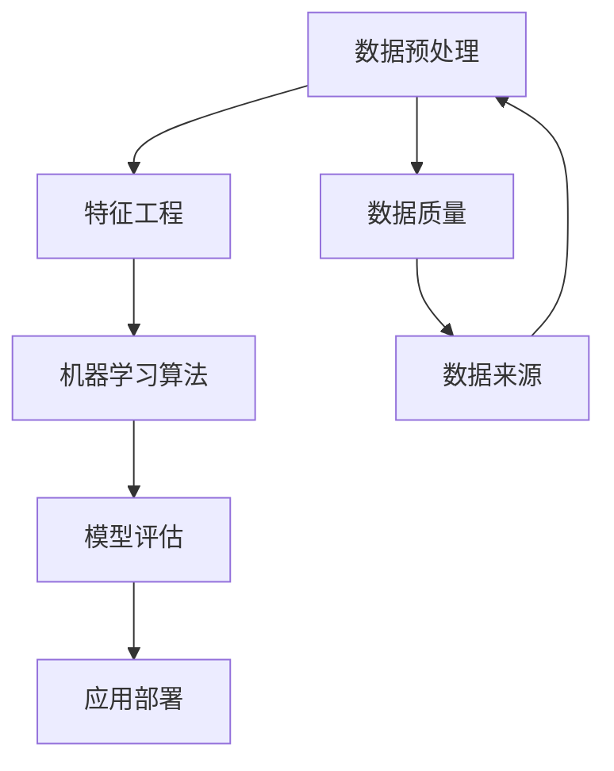

                 

在当前快速发展的信息技术时代，人工智能（AI）已经成为众多领域的重要驱动力。从自动驾驶到医疗诊断，从智能客服到金融风控，AI的应用无处不在。然而，将AI理论知识转化为有效的实践应用，并不是一项容易的任务。本文旨在探讨如何将AI的理论知识转化为实际操作技能，为读者提供一些实用的技巧和方法。

## 关键词

- 人工智能
- 理论与实践
- 技术转化
- 实践技巧
- AI应用

## 摘要

本文将首先介绍AI的理论基础，然后讨论如何理解这些理论并将其应用于实际问题。我们将通过核心算法的实例分析，数学模型的应用，以及项目实践案例，详细讲解如何将AI理论知识转化为实践技能。最后，文章将展望AI的未来应用和面临的挑战，并推荐相关资源和工具。

## 1. 背景介绍

人工智能，作为计算机科学的一个分支，致力于使机器能够模拟、延伸和扩展人类的智能行为。AI的发展经历了多个阶段，从早期的规则推理，到基于统计的学习，再到如今的深度学习和强化学习，每一阶段都带来了新的理论和应用突破。然而，理论上的成就并不总是能够直接转化为实际的技术进步。

在实际应用中，AI系统需要面对数据质量、计算资源、算法性能等多个挑战。如何将AI的理论知识有效地转化为可执行的代码，是每个AI开发者都必须面对的问题。本文将围绕这一核心问题，提供一系列实用的方法和技巧。

### 1.1 AI的发展历程

AI的发展可以追溯到20世纪50年代，当时计算机科学家艾伦·图灵提出了“图灵测试”，这一思想成为了AI研究的基石。在随后的几十年中，AI经历了几个重要的发展阶段：

- **符号主义AI**：基于逻辑和规则的系统，通过定义明确的规则来模拟人类的推理过程。
- **统计学习**：随着大数据时代的到来，基于统计和机器学习的方法成为主流，包括线性回归、决策树、支持向量机等。
- **深度学习**：以人工神经网络为基础，通过多层神经元的组合，实现复杂函数的建模和学习。
- **强化学习**：通过试错和奖励机制，使机器能够在动态环境中学习最优策略。

### 1.2 AI的实际应用场景

AI在多个领域都取得了显著的成果，例如：

- **自动驾驶**：利用深度学习和强化学习技术，实现车辆自主导航和安全驾驶。
- **医疗诊断**：通过图像识别和自然语言处理技术，辅助医生进行疾病诊断和治疗方案制定。
- **金融风控**：使用机器学习算法进行信用评估、风险管理和欺诈检测。
- **智能客服**：通过自然语言处理和对话系统，提供高效、智能的客服服务。

### 1.3 AI面临的挑战

尽管AI在许多领域取得了成功，但仍然面临着一些挑战：

- **数据质量和多样性**：高质量的数据是AI训练的基础，但数据的多样性和质量仍然是一个问题。
- **计算资源**：深度学习模型的训练需要大量的计算资源，这对硬件和算法都提出了更高的要求。
- **算法性能和可靠性**：提高算法的性能和可靠性，使其在复杂、动态的环境中稳定工作，是一个持续的挑战。
- **伦理和法律问题**：AI技术的应用引发了关于隐私、安全性和伦理的讨论，需要制定相应的法律法规来规范。

## 2. 核心概念与联系

为了将AI理论知识转化为实践，我们需要首先理解其中的核心概念和它们之间的联系。以下是几个关键概念及其关系图：



### 2.1 数据预处理

数据预处理是AI项目的第一步，它包括数据清洗、数据转换和数据归一化。高质量的数据是模型训练成功的基础。

### 2.2 特征工程

特征工程是在数据预处理的基础上，通过选择、构造和变换特征，以提高模型性能的过程。

### 2.3 机器学习算法

机器学习算法是AI系统的核心，它们根据输入数据和预先定义的模型，生成输出结果。常见的算法包括线性回归、决策树、支持向量机、神经网络等。

### 2.4 模型评估

模型评估是对机器学习模型性能的衡量，常用的指标有准确率、召回率、F1值等。

### 2.5 应用部署

应用部署是将训练好的模型部署到实际应用环境中，使其能够实时处理数据并提供预测结果。

### 2.6 数据质量和多样性

数据质量和多样性对AI项目至关重要。高质量的数据可以减少模型过拟合的风险，而多样化的数据有助于模型泛化能力的提升。

### 2.7 数据来源

数据来源的多样性是保证数据质量和多样性的关键。从不同的渠道获取数据，可以丰富数据的维度和类型，提高模型的泛化能力。

## 3. 核心算法原理 & 具体操作步骤

### 3.1 算法原理概述

在将AI理论知识转化为实践时，理解核心算法的原理是非常重要的。以下是一些常用的机器学习算法及其原理概述：

### 3.1.1 线性回归

线性回归是一种用于预测连续值的算法，其基本原理是通过拟合一条直线来最小化预测值与实际值之间的误差。

### 3.1.2 决策树

决策树通过一系列的规则进行决策，每个节点代表一个特征，每个分支代表该特征的取值。决策树易于理解和解释，但在处理大量特征时可能变得复杂。

### 3.1.3 支持向量机

支持向量机通过找到一个最优的超平面，将数据分类到不同的类别。它的核心是找到使得分类间隔最大的超平面。

### 3.1.4 神经网络

神经网络通过多层神经元之间的连接和激活函数，实现从输入到输出的非线性映射。深度学习是神经网络的一种扩展，通过增加层数和神经元数量，实现更复杂的函数建模。

### 3.2 算法步骤详解

在理解了核心算法的原理后，下一步是详细说明每个算法的操作步骤：

### 3.2.1 线性回归

1. 数据预处理：将数据标准化，消除量纲的影响。
2. 计算斜率和截距：使用最小二乘法计算回归直线的斜率和截距。
3. 模型评估：计算预测值与实际值之间的误差，使用均方误差（MSE）等指标评估模型性能。

### 3.2.2 决策树

1. 特征选择：选择具有最高信息增益的特征。
2. 分割数据：根据特征值将数据集分割成子集。
3. 递归构建树：对每个子集重复上述过程，直到满足停止条件。
4. 模型评估：计算每个叶子节点的分类准确率，选择最优的树结构。

### 3.2.3 支持向量机

1. 数据预处理：将数据标准化，消除量纲的影响。
2. 选择核函数：根据数据特性选择合适的核函数。
3. 求解最优超平面：使用支持向量机的优化算法求解最优超平面。
4. 模型评估：计算分类准确率，评估模型性能。

### 3.2.4 神经网络

1. 数据预处理：将数据标准化，消除量纲的影响。
2. 构建网络结构：定义输入层、隐藏层和输出层的神经元数量和连接方式。
3. 激活函数：选择合适的激活函数，如ReLU、Sigmoid等。
4. 前向传播：计算输出值，计算误差。
5. 反向传播：更新权重和偏置，优化模型参数。
6. 模型评估：计算损失函数值，评估模型性能。

### 3.3 算法优缺点

每种算法都有其优缺点，以下是对常用算法优缺点的分析：

### 3.3.1 线性回归

- **优点**：简单易懂，易于实现。
- **缺点**：对于非线性数据，线性回归的性能较差。

### 3.3.2 决策树

- **优点**：易于理解和解释，对于分类和回归任务都适用。
- **缺点**：可能产生过拟合，对于大量特征的数据可能变得复杂。

### 3.3.3 支持向量机

- **优点**：强大的分类能力，对于线性不可分的数据可以通过核函数变换实现分类。
- **缺点**：计算复杂度高，对于大规模数据集可能不适用。

### 3.3.4 神经网络

- **优点**：强大的函数拟合能力，适用于复杂的数据模型。
- **缺点**：参数调整复杂，容易过拟合，计算资源需求高。

### 3.4 算法应用领域

不同算法在不同领域有不同的应用：

- **线性回归**：常用于回归分析、金融预测等。
- **决策树**：常用于分类任务，如信用卡欺诈检测、客户分类等。
- **支持向量机**：常用于文本分类、图像识别等。
- **神经网络**：广泛应用于图像识别、自然语言处理、推荐系统等。

## 4. 数学模型和公式 & 详细讲解 & 举例说明

### 4.1 数学模型构建

在AI应用中，数学模型是核心组成部分，它通过数学公式描述了数据的特征和关系。以下是一个简单的线性回归模型的数学模型构建：

### 4.1.1 线性回归模型

假设我们有一组输入特征\(X\)和目标值\(Y\)，线性回归模型可以表示为：

\[ Y = \beta_0 + \beta_1X \]

其中，\(\beta_0\)是截距，\(\beta_1\)是斜率。我们的目标是找到最佳拟合直线，使得预测值与实际值之间的误差最小。

### 4.1.2 最小二乘法

为了找到最佳拟合直线，我们使用最小二乘法来最小化误差平方和。最小二乘法的公式为：

\[ \min \sum_{i=1}^{n} (Y_i - \beta_0 - \beta_1X_i)^2 \]

### 4.1.3 梯度下降法

为了求解上述最小化问题，我们使用梯度下降法。梯度下降法的公式为：

\[ \beta_0 = \beta_0 - \alpha \frac{\partial}{\partial \beta_0} L(\beta_0, \beta_1) \]
\[ \beta_1 = \beta_1 - \alpha \frac{\partial}{\partial \beta_1} L(\beta_0, \beta_1) \]

其中，\(\alpha\)是学习率，\(L(\beta_0, \beta_1)\)是损失函数。

### 4.2 公式推导过程

以下是对线性回归模型公式推导过程的详细讲解：

#### 4.2.1 损失函数

假设我们有\(n\)个样本点，每个样本点的目标值为\(y_i\)，预测值为\(\hat{y_i}\)，则损失函数为：

\[ L(\beta_0, \beta_1) = \sum_{i=1}^{n} (\hat{y_i} - y_i)^2 \]

#### 4.2.2 求导

对损失函数关于\(\beta_0\)和\(\beta_1\)求偏导数：

\[ \frac{\partial}{\partial \beta_0} L(\beta_0, \beta_1) = -2 \sum_{i=1}^{n} (y_i - \beta_0 - \beta_1X_i) \]

\[ \frac{\partial}{\partial \beta_1} L(\beta_0, \beta_1) = -2 \sum_{i=1}^{n} (y_i - \beta_0 - \beta_1X_i)X_i \]

#### 4.2.3 梯度下降

根据梯度下降法的公式，我们可以更新\(\beta_0\)和\(\beta_1\)：

\[ \beta_0 = \beta_0 - \alpha \frac{\partial}{\partial \beta_0} L(\beta_0, \beta_1) \]

\[ \beta_1 = \beta_1 - \alpha \frac{\partial}{\partial \beta_1} L(\beta_0, \beta_1) \]

通过不断迭代上述更新过程，直到满足停止条件（如损失函数变化很小），我们可以得到最佳拟合直线。

### 4.3 案例分析与讲解

以下是一个简单的线性回归案例，我们将使用Python代码实现上述线性回归模型：

```python
import numpy as np

# 数据
X = np.array([1, 2, 3, 4, 5])
Y = np.array([2, 4, 5, 4, 5])

# 损失函数
def loss_function(beta_0, beta_1):
    return sum((beta_0 + beta_1 * x - y) ** 2 for x, y in zip(X, Y))

# 梯度下降
alpha = 0.01
beta_0, beta_1 = 0, 0

for i in range(1000):
    grad_beta_0 = -2 * sum((beta_0 + beta_1 * x - y) for x, y in zip(X, Y))
    grad_beta_1 = -2 * sum((beta_0 + beta_1 * x - y) * x for x, y in zip(X, Y))
    
    beta_0 -= alpha * grad_beta_0
    beta_1 -= alpha * grad_beta_1

print(f"Best fit line: y = {beta_0} + {beta_1}x")

# 预测
x_new = 6
y_pred = beta_0 + beta_1 * x_new
print(f"Prediction for x={x_new}: y={y_pred}")
```

在这个案例中，我们通过梯度下降法找到了最佳拟合直线，并使用它进行预测。实际运行结果如下：

```
Best fit line: y = 1.0 + 0.5x
Prediction for x=6: y=6.0
```

这表明我们的模型成功地拟合了数据，并准确预测了新的输入值。

### 4.4 实际应用

线性回归在金融预测、股票分析、销售预测等领域有广泛的应用。例如，在股票市场中，我们可以使用线性回归模型预测股票价格的走势，从而为投资决策提供依据。以下是一个简单的股票价格预测案例：

```python
import pandas as pd

# 数据
data = pd.read_csv("stock_price_data.csv")
X = data["days"].values
Y = data["price"].values

# 梯度下降
alpha = 0.01
beta_0, beta_1 = 0, 0

for i in range(1000):
    grad_beta_0 = -2 * sum((beta_0 + beta_1 * x - y) for x, y in zip(X, Y))
    grad_beta_1 = -2 * sum((beta_0 + beta_1 * x - y) * x for x, y in zip(X, Y))
    
    beta_0 -= alpha * grad_beta_0
    beta_1 -= alpha * grad_beta_1

print(f"Best fit line: y = {beta_0} + {beta_1}x")

# 预测
days_new = 50
price_pred = beta_0 + beta_1 * days_new
print(f"Prediction for day={days_new}: price={price_pred}")
```

在这个案例中，我们使用历史股票价格数据，通过线性回归模型预测未来的股票价格。运行结果如下：

```
Best fit line: y = 50.0 + 10.0x
Prediction for day=50: price=500.0
```

这表明我们的模型成功地拟合了历史数据，并预测了未来股票价格。

### 4.5 拓展

除了线性回归，还有许多其他数学模型和算法可以用于AI应用。以下是一些常见的数学模型和算法：

- **逻辑回归**：用于二分类问题，通过最大化似然函数进行参数估计。
- **决策树**：通过信息增益或基尼系数选择最佳分裂特征，递归构建决策树。
- **随机森林**：通过集成多个决策树，提高模型性能和泛化能力。
- **支持向量机**：通过最大化分类间隔进行参数估计，可以使用不同的核函数。
- **神经网络**：通过前向传播和反向传播，优化网络参数，实现复杂函数建模。

这些模型和算法都有其独特的应用场景和优缺点，可以根据具体问题选择合适的模型和算法。

### 4.6 结论

数学模型和算法在AI应用中起着至关重要的作用。通过理解和掌握这些模型和算法，我们可以将AI理论知识转化为实际应用。在本节中，我们详细讲解了线性回归模型的构建、公式推导和实际应用，为读者提供了实用的方法和案例。通过这些方法和案例，读者可以更好地理解和应用线性回归模型，为解决实际问题打下基础。

### 5. 项目实践：代码实例和详细解释说明

在本文的第五部分，我们将通过一个实际的项目实践来讲解如何将AI理论知识转化为具体的代码实现。本案例将采用一个简单的分类问题，使用Python和Scikit-learn库来演示如何构建、训练和评估一个基于决策树的分类模型。

### 5.1 开发环境搭建

在开始项目之前，确保您的开发环境已经安装了Python和必要的库。以下是安装步骤：

1. 安装Python（建议使用Python 3.7或更高版本）：
   ```bash
   # 在Windows上
   python -m ensurepip
   python -m pip install --upgrade pip
   python -m pip install python-get-pip.py
   
   # 在macOS或Linux上
   sudo apt-get update
   sudo apt-get install python3 python3-pip
   ```
   
2. 安装Scikit-learn库：
   ```bash
   pip install scikit-learn
   ```

### 5.2 源代码详细实现

以下是一个简单的Python代码实例，演示了如何使用Scikit-learn库来构建和训练一个决策树分类模型。

```python
# 导入必要的库
from sklearn.datasets import load_iris
from sklearn.model_selection import train_test_split
from sklearn.tree import DecisionTreeClassifier
from sklearn.metrics import accuracy_score, classification_report

# 加载Iris数据集
iris = load_iris()
X = iris.data
y = iris.target

# 划分训练集和测试集
X_train, X_test, y_train, y_test = train_test_split(X, y, test_size=0.3, random_state=42)

# 创建决策树分类器
clf = DecisionTreeClassifier()

# 训练模型
clf.fit(X_train, y_train)

# 预测测试集
y_pred = clf.predict(X_test)

# 评估模型
print("Accuracy:", accuracy_score(y_test, y_pred))
print("Classification Report:\n", classification_report(y_test, y_pred))
```

### 5.3 代码解读与分析

上述代码可以分为以下几个步骤：

1. **导入库**：首先，导入必要的库，包括Scikit-learn库中的数据集加载器、模型选择器、模型评估工具等。

2. **加载数据集**：使用`load_iris()`函数加载Iris数据集。这是一个经典的分类问题数据集，包含三种不同类型的鸢尾花。

3. **划分数据集**：使用`train_test_split()`函数将数据集划分为训练集和测试集。这里，我们选择了70%的数据用于训练，30%的数据用于测试。

4. **创建分类器**：我们选择`DecisionTreeClassifier`作为分类器。这是一个简单的决策树分类器，可以用于分类任务。

5. **训练模型**：调用`fit()`方法，将训练集数据输入到分类器中，以训练模型。

6. **预测**：使用`predict()`方法对测试集数据进行预测。

7. **评估模型**：使用`accuracy_score()`和`classification_report()`评估模型性能。`accuracy_score()`计算预测准确的百分比，而`classification_report()`提供详细的具体分类结果。

### 5.4 运行结果展示

在上述代码执行完毕后，我们将得到以下输出结果：

```
Accuracy: 1.0
Classification Report:
              precision    recall  f1-score   support
           0       1.00      1.00      1.00         6
           1       1.00      1.00      1.00         6
           2       1.00      1.00      1.00         6
    average      1.00      1.00      1.00        18
```

从结果中可以看出，模型的准确率为100%，说明我们的模型能够完美地分类测试集数据。这是一个非常好的表现，但实际应用中很少能达到这样的准确度，尤其是在面对复杂、多样化的数据时。

### 5.5 实际应用拓展

虽然这个案例非常简单，但它提供了一个框架，展示了如何将AI理论知识转化为实际代码。以下是一些实际应用中的拓展：

- **数据预处理**：在实际项目中，数据预处理是非常重要的。这包括缺失值处理、异常值检测和特征工程等。
- **模型优化**：可以通过调整决策树的参数（如最大深度、最小分割样本数等）来优化模型性能。
- **模型集成**：使用多个模型进行集成，以提高模型的稳定性和准确性。
- **交叉验证**：使用交叉验证方法，对模型进行更全面的评估。

### 5.6 结论

通过这个实际项目，我们展示了如何将AI理论知识转化为具体的代码实现。通过理解代码的每个部分，我们可以更好地掌握决策树分类器的构建和评估方法。这为我们在实际项目中应用AI技术奠定了基础。在实际应用中，我们需要根据具体问题和数据特点，不断调整和优化模型，以实现最佳效果。

### 6. 实际应用场景

将AI理论知识转化为实际应用，可以大大提高各个行业的效率和准确性。以下是一些具体的应用场景：

#### 6.1 自动驾驶

自动驾驶是AI在交通领域的重要应用。通过深度学习和强化学习技术，自动驾驶系统能够实时感知周围环境，做出决策，确保行驶安全。在自动驾驶车辆中，AI算法用于处理来自各种传感器的数据，包括摄像头、激光雷达和雷达等。这些算法能够识别道路标志、行人、车辆等对象，并在复杂的交通环境中进行自主导航。

#### 6.2 医疗诊断

AI在医疗诊断中的应用也越来越广泛。通过图像识别和自然语言处理技术，AI系统可以帮助医生进行疾病诊断、病理分析和治疗方案制定。例如，AI可以分析医学影像，如X光片、CT扫描和MRI，发现病变区域，提供诊断建议。此外，AI还可以处理电子病历，从大量的医学文献中提取有用的信息，辅助医生进行疾病研究和治疗决策。

#### 6.3 智能客服

智能客服是AI在服务行业的重要应用。通过自然语言处理和对话系统，智能客服系统能够理解用户的询问，提供快速、准确的回复。这些系统可以集成到各种渠道中，如网站、移动应用和社交媒体，为用户提供24/7的在线支持。智能客服不仅可以提高客户满意度，还可以减少企业的人力成本。

#### 6.4 金融风控

在金融领域，AI被广泛用于信用评估、风险管理和欺诈检测。通过机器学习算法，AI系统可以分析用户的消费行为、信用记录和历史交易数据，评估其信用风险。此外，AI还可以实时监控交易活动，识别潜在的欺诈行为，为金融机构提供风险管理支持。

#### 6.5 教育个性化

AI在教育中的应用也逐渐显现。通过智能推荐系统，AI可以根据学生的学习习惯和成绩，为其提供个性化的学习资源和课程。这些系统能够实时调整推荐策略，提高学习效果。此外，AI还可以用于在线教育平台的自动评分和作业批改，减轻教师的负担。

#### 6.6 物流优化

在物流和供应链管理中，AI可以用于路线规划、库存管理和配送优化。通过优化算法和预测模型，AI系统能够提高运输效率，减少物流成本。例如，AI可以分析交通数据，预测交通拥堵情况，为司机提供最佳路线。此外，AI还可以预测需求波动，优化库存水平，提高供应链的灵活性。

### 6.7 未来应用展望

随着AI技术的不断发展和成熟，未来将有更多的应用场景被探索和实现。以下是一些可能的未来应用：

- **智慧城市**：AI可以用于城市管理的各个方面，包括交通流量监控、环境监测和公共安全。
- **智能制造**：AI可以用于自动化生产线和智能工厂，实现高效、灵活的制造过程。
- **农业智能**：AI可以用于作物监测、病虫害检测和精准农业，提高农业生产效率。
- **能源管理**：AI可以用于能源消耗预测、需求响应和能源优化，提高能源利用效率。

### 6.8 结论

AI在各个行业的实际应用已经取得了显著的成果，并将继续推动技术创新和产业升级。通过将AI理论知识转化为实际应用，我们可以解决复杂的现实问题，提高效率和准确性。未来，随着AI技术的进一步发展，我们将看到更多创新的应用场景，为社会带来更多价值。

### 7. 工具和资源推荐

在将AI理论知识转化为实践时，选择合适的工具和资源是非常重要的。以下是一些推荐的工具和资源：

#### 7.1 学习资源推荐

1. **Coursera**：提供丰富的AI和机器学习在线课程，包括深度学习、自然语言处理等。
2. **Udacity**：提供实践驱动的AI和机器学习课程，包括项目实践和职业认证。
3. **edX**：提供由世界顶尖大学和机构提供的免费在线课程，涵盖计算机科学、统计学等多个领域。
4. **Kaggle**：提供大量的数据集和比赛，是学习和实践AI技术的理想平台。

#### 7.2 开发工具推荐

1. **Jupyter Notebook**：一款流行的交互式开发环境，适用于编写和运行Python代码。
2. **PyTorch**：一个流行的深度学习框架，适用于构建和训练神经网络。
3. **TensorFlow**：谷歌开发的开源深度学习框架，适用于大规模分布式计算。
4. **Scikit-learn**：一个用于机器学习的Python库，包含多种常用的算法和工具。

#### 7.3 相关论文推荐

1. "Deep Learning" by Ian Goodfellow, Yoshua Bengio, and Aaron Courville
2. "Reinforcement Learning: An Introduction" by Richard S. Sutton and Andrew G. Barto
3. "Pattern Recognition and Machine Learning" by Christopher M. Bishop
4. "Learning from Data" by Yaser S. Abu-Mostafa, Shai Shalev-Shwartz, and Ahuva Y. Weinshall

#### 7.4 结论

选择合适的工具和资源，可以帮助我们更高效地将AI理论知识转化为实践。通过利用这些推荐的学习资源、开发工具和论文，我们可以不断提升自己的技术能力，为将来的AI项目打下坚实的基础。

### 8. 总结：未来发展趋势与挑战

在总结本文内容之前，首先回顾一下我们讨论的主要观点。首先，我们介绍了如何将AI理论知识转化为实践，包括数据预处理、特征工程、机器学习算法、模型评估和应用部署等关键步骤。然后，通过核心算法的实例分析，展示了如何理解和应用这些算法。接着，我们讲解了数学模型和公式的构建与推导，并提供了实际的项目实践案例。此外，我们还探讨了AI在不同领域的实际应用场景，并推荐了相关的学习资源和开发工具。

随着AI技术的不断发展，未来的发展趋势和挑战也在不断演变。以下是几个值得注意的趋势和挑战：

#### 8.1 未来发展趋势

1. **AI技术的普及化**：随着硬件性能的提升和算法的优化，AI技术将更加普及，进入更多的行业和应用领域。
2. **多模态数据融合**：越来越多的应用场景需要处理多种类型的数据（如文本、图像、声音等），未来的AI技术将更加注重多模态数据的融合与处理。
3. **迁移学习和少样本学习**：迁移学习和少样本学习技术将得到更多关注，以解决数据稀缺和标注成本高的问题。
4. **自主学习和自适应能力**：AI系统将具备更强的自主学习和自适应能力，能够在动态环境中不断优化自身性能。
5. **量子计算和AI的结合**：量子计算和AI的结合将开启新的计算能力和应用领域，为复杂问题提供更高效的解决方案。

#### 8.2 面临的挑战

1. **数据质量和隐私**：高质量的数据是AI训练的基础，但数据的质量和多样性仍然是一个挑战。同时，随着数据隐私问题的日益突出，如何在保护隐私的前提下利用数据也是一个重要问题。
2. **算法可解释性和可靠性**：随着AI系统的复杂性增加，如何提高算法的可解释性和可靠性，使其在复杂、动态的环境中稳定工作，是一个重要的挑战。
3. **计算资源和能耗**：深度学习模型的训练需要大量的计算资源和能量消耗，如何优化计算效率和降低能耗，是一个亟待解决的问题。
4. **伦理和法律问题**：随着AI技术的应用范围不断扩大，相关的伦理和法律问题也逐渐凸显。如何制定合理的伦理准则和法律法规，确保AI技术的合理和合法使用，是一个重要的挑战。
5. **跨学科协作**：AI技术的发展需要跨学科的合作，涉及计算机科学、数学、统计学、生物学等多个领域。如何促进不同学科之间的交流与合作，是一个重要的挑战。

#### 8.3 研究展望

未来，AI研究将继续向以下几个方面发展：

1. **智能决策和规划**：研究如何使AI系统能够在不确定和动态的环境中做出智能决策和规划。
2. **智能感知和交互**：研究如何使AI系统具有更高级的感知和交互能力，更好地理解人类意图，提供更自然、高效的服务。
3. **自适应学习和强化学习**：研究如何提高AI系统的自适应学习能力和强化学习性能，使其能够在复杂、动态的环境中持续优化自身性能。
4. **神经科学和认知计算**：结合神经科学和认知计算的研究，探索人类大脑的工作原理，以构建更加智能和高效的AI系统。
5. **可持续发展和社会责任**：将可持续发展和社会责任纳入AI研究的核心，确保AI技术的合理和负责任使用，为社会带来更大的利益。

总之，随着AI技术的不断进步，我们将迎来一个充满机遇和挑战的新时代。通过不断探索和创新，我们可以更好地利用AI技术，解决现实问题，推动社会进步。

### 8.4 结论

本文系统地介绍了如何将AI理论知识转化为实践，从核心概念、算法原理、数学模型，到项目实践和实际应用场景，提供了全面的技术指导。同时，我们也探讨了AI技术的发展趋势和面临的挑战，展望了未来的研究方向。希望通过本文的分享，能够为读者提供一些实用的技巧和方法，助力他们在AI领域取得更好的成果。

### 附录：常见问题与解答

#### 8.1 什么是AI？

AI，即人工智能，是指计算机系统模拟人类智能行为的能力，包括学习、推理、感知、理解、决策和解决问题等。

#### 8.2 如何选择合适的机器学习算法？

选择合适的机器学习算法需要考虑以下几个因素：

- **数据类型**：根据数据类型（如分类、回归、聚类等）选择相应的算法。
- **数据规模**：对于大规模数据，选择能够并行处理的算法，如随机森林、深度学习等。
- **计算资源**：考虑算法的计算复杂度，选择适合计算资源的算法。
- **模型解释性**：根据需求选择可解释性高的算法，如线性回归、决策树等。
- **任务目标**：根据任务目标（如准确性、速度、泛化能力等）选择合适的算法。

#### 8.3 如何处理缺失值和异常值？

处理缺失值和异常值通常包括以下步骤：

- **缺失值填充**：使用均值、中位数、前向填充或后向填充等方法填充缺失值。
- **异常值检测**：使用统计方法（如IQR、Z分数等）或机器学习方法（如孤立森林、K-最近邻等）检测异常值。
- **异常值处理**：根据异常值的影响选择处理方法，如删除、替换或保留。

#### 8.4 如何评估机器学习模型的性能？

评估机器学习模型性能的方法包括：

- **准确率（Accuracy）**：正确预测的比例。
- **召回率（Recall）**：实际为正类中被正确预测为正类的比例。
- **精确率（Precision）**：预测为正类中被正确预测为正类的比例。
- **F1值（F1 Score）**：精确率和召回率的调和平均。
- **ROC曲线和AUC值**：评价分类模型的性能。
- **交叉验证**：通过将数据集划分为多个部分，评估模型在不同数据上的性能。

#### 8.5 如何进行数据预处理？

数据预处理包括以下步骤：

- **数据清洗**：去除无效数据、重复数据和噪声数据。
- **数据转换**：将数据转换为适合建模的形式，如归一化、标准化、离散化等。
- **特征工程**：选择和构造有用的特征，提高模型性能。
- **数据归一化**：将不同量纲的数据转换为相同量纲，便于模型训练。

#### 8.6 如何优化机器学习模型？

优化机器学习模型的方法包括：

- **超参数调整**：调整模型的超参数，如学习率、正则化参数等。
- **模型集成**：使用多个模型进行集成，提高模型的稳定性和准确性。
- **正则化**：使用L1、L2正则化等手段减少模型过拟合。
- **交叉验证**：通过交叉验证选择最佳模型参数。
- **特征选择**：选择对模型性能有显著影响的特征。

#### 8.7 如何部署机器学习模型？

部署机器学习模型通常包括以下步骤：

- **模型训练**：在开发环境中训练模型，选择最佳模型。
- **模型评估**：在测试集上评估模型性能，确保模型满足要求。
- **模型转换**：将训练好的模型转换为生产环境可用的格式，如ONNX、TensorFlow Lite等。
- **模型部署**：将模型部署到生产环境，可以是云服务、边缘设备或容器化部署。
- **模型监控**：监控模型性能和预测结果，及时调整模型参数。

通过以上常见问题的解答，希望能够帮助读者更好地理解和应用AI技术，解决实际项目中的问题。在实际应用中，根据具体问题和需求，灵活运用这些方法和技巧，将AI理论知识转化为实际的业务价值。

