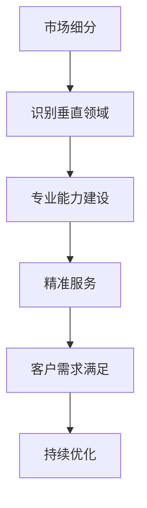

                 

关键词：小公司生存策略、垂直领域、独特价值需求、IT领域、专业服务

摘要：在竞争激烈的市场环境中，小公司往往面临资源有限、市场认知度低等挑战。本文旨在探讨小公司如何通过精准服务垂直领域，满足独特价值需求，实现可持续发展的生存策略。通过分析具体案例和提供实用建议，本文为小公司提供了在IT领域获取竞争优势的方法。

## 1. 背景介绍

在当今全球化的商业环境中，市场竞争日益激烈，尤其是IT行业，技术更新速度快，市场变化频繁。对于小公司而言，如何在有限的资源和市场机会中找到生存之道，成为了一项重要的课题。传统的市场推广和广泛覆盖的策略对于资源有限的小公司来说，往往难以实现。因此，精准服务垂直领域，满足特定客户群体的独特需求，成为小公司实现生存和发展的关键策略。

### 1.1 IT行业的特点

IT行业具有以下几个显著特点：

- **技术创新迅速**：IT行业的技术更新速度非常快，新的技术和平台不断涌现，公司必须保持持续学习和创新的能力，才能跟上市场的发展。
- **高度专业化**：IT行业的分工越来越细，不同领域的技术需求和解决方案具有显著的差异，专业化的服务成为满足客户需求的关键。
- **客户需求多样性**：IT客户的需求越来越多样化，特别是中小型企业，它们往往有独特、个性化的需求，需要提供定制化的解决方案。

### 1.2 小公司的困境

- **资源有限**：小公司通常在资金、人力资源和技术资源上有限，难以与大型企业进行全面竞争。
- **市场认知度低**：小公司在市场中的知名度和影响力较低，难以吸引客户和投资者的关注。
- **竞争优势不明显**：小公司在技术、品牌、市场渠道等方面与竞争对手相比，缺乏明显的竞争优势。

## 2. 核心概念与联系

### 2.1 垂直领域的定义

垂直领域是指特定行业内的细分市场，具有明确的业务范围和客户群体。在IT行业中，垂直领域通常是指特定技术或应用场景的解决方案提供商。

### 2.2 精准服务的含义

精准服务是指通过深入了解客户需求，提供高度定制化的解决方案，以满足客户的独特需求。这种服务模式要求小公司具备专业化的技术能力和市场洞察力。

### 2.3 垂直领域与精准服务的关系

- **专业化**：小公司通过专注于特定垂直领域，可以提高专业水平，增强在特定领域的竞争力。
- **客户忠诚度**：精准服务能够满足客户独特需求，提高客户满意度和忠诚度。
- **差异化**：通过提供定制化的解决方案，小公司能够实现差异化竞争，减少与竞争对手的直接竞争。

### 2.4 Mermaid 流程图



## 3. 核心算法原理 & 具体操作步骤

### 3.1 算法原理概述

小公司生存策略的核心在于通过垂直领域的专业化和精准服务，构建独特的竞争优势。具体操作步骤包括：

- **市场细分**：通过对市场进行深入分析，识别出具有潜力且竞争较小的垂直领域。
- **专业能力建设**：在识别的垂直领域内，通过持续学习和资源整合，提升公司的专业能力和技术水平。
- **精准服务**：通过深入了解客户需求，提供定制化的解决方案，实现客户满意度和忠诚度。
- **客户需求满足**：不断收集客户反馈，优化服务流程和解决方案，持续满足客户需求。
- **持续优化**：通过不断调整和优化策略，确保公司能够在市场中保持竞争力。

### 3.2 算法步骤详解

#### 步骤1：市场细分

- **数据分析**：收集和分析市场数据，包括行业趋势、竞争对手分析、客户需求等。
- **SWOT分析**：评估公司的优势、劣势、机会和威胁，确定适合公司发展的垂直领域。

#### 步骤2：专业能力建设

- **技术培训**：组织员工参加技术培训，提升专业技能和知识储备。
- **资源整合**：与专业机构、合作伙伴合作，获取技术资源和市场信息。
- **知识管理**：建立知识管理系统，积累和传承专业经验。

#### 步骤3：精准服务

- **客户需求分析**：通过调研、访谈等方式，深入了解客户需求和期望。
- **解决方案设计**：根据客户需求，设计定制化的解决方案。
- **服务交付**：按照设计的服务方案，确保高效、高质量的交付。

#### 步骤4：客户需求满足

- **反馈收集**：定期收集客户反馈，评估服务质量和效果。
- **问题解决**：针对客户反馈，及时解决问题和优化服务。
- **持续改进**：根据客户反馈，不断调整和优化服务流程和解决方案。

#### 步骤5：持续优化

- **市场监测**：定期监测市场动态，了解行业趋势和竞争状况。
- **策略调整**：根据市场变化和客户需求，及时调整公司的发展策略。
- **创新能力**：鼓励创新思维，持续探索新的业务模式和解决方案。

### 3.3 算法优缺点

#### 优点：

- **提高竞争力**：通过专业化和精准服务，小公司能够在特定领域建立竞争优势。
- **提高客户满意度**：满足客户的独特需求，提高客户满意度和忠诚度。
- **降低竞争风险**：在竞争较小的垂直领域发展，降低与大型企业的直接竞争风险。

#### 缺点：

- **资源限制**：需要投入大量资源进行专业能力建设和市场细分。
- **市场认知度低**：小公司在市场中的知名度较低，需要投入更多时间和精力进行品牌建设。

### 3.4 算法应用领域

- **软件开发**：为特定行业提供定制化的软件解决方案。
- **系统集成**：为中小型企业提供全面的系统集成服务。
- **技术咨询**：为特定领域的客户提供专业的技术咨询和解决方案。

## 4. 数学模型和公式 & 详细讲解 & 举例说明

### 4.1 数学模型构建

小公司生存策略的数学模型可以构建为以下公式：

\[ \text{生存能力} = f(\text{市场细分精度}, \text{专业能力水平}, \text{客户满意度}) \]

其中：

- \( \text{市场细分精度} \)：表示市场细分的准确性和针对性。
- \( \text{专业能力水平} \)：表示公司在特定领域的专业技术和知识水平。
- \( \text{客户满意度} \)：表示客户对公司服务的满意度和忠诚度。

### 4.2 公式推导过程

#### 步骤1：定义变量

- \( x_1 \)：市场细分精度
- \( x_2 \)：专业能力水平
- \( x_3 \)：客户满意度

#### 步骤2：构建目标函数

目标函数为：最大化 \( f(x_1, x_2, x_3) \)

#### 步骤3：确定约束条件

- \( x_1 + x_2 + x_3 \leq 100 \)：资源总量限制
- \( x_1 \geq x_{\text{下限}} \)：市场细分精度下限
- \( x_2 \geq x_{\text{下限}} \)：专业能力水平下限
- \( x_3 \geq x_{\text{下限}} \)：客户满意度下限

#### 步骤4：求解最优解

通过优化算法（如线性规划、整数规划等），求解目标函数的最优解。

### 4.3 案例分析与讲解

假设一家小公司希望在软件开发领域实现生存和发展，具体参数如下：

- \( x_{\text{下限}} = 20 \)
- \( x_{\text{上限}} = 80 \)

#### 步骤1：市场细分精度

- \( x_1 = 60 \)：经过市场调研，发现软件定制化开发具有较高市场需求。

#### 步骤2：专业能力水平

- \( x_2 = 70 \)：通过技术培训和资源整合，公司在软件开发领域具备较高的专业能力。

#### 步骤3：客户满意度

- \( x_3 = 75 \)：通过精准服务，公司成功满足客户需求，客户满意度较高。

#### 步骤4：求解最优解

通过优化算法，求解目标函数的最优解：

\[ f(x_1, x_2, x_3) = f(60, 70, 75) = 145 \]

#### 结果分析

- 生存能力为 145，超过资源总量的上限，说明公司在市场细分、专业能力和客户满意度方面均表现出色。

## 5. 项目实践：代码实例和详细解释说明

### 5.1 开发环境搭建

#### 环境要求

- 操作系统：Windows/Linux/Mac OS
- 开发工具：Visual Studio Code
- 编程语言：Python

#### 安装步骤

1. 安装Python（版本3.8及以上）
2. 安装Visual Studio Code
3. 安装必要的Python扩展，如Pylance、jupyter等

### 5.2 源代码详细实现

以下是一个简单的示例，展示了如何在Python中实现小公司生存策略的算法。

```python
# 小公司生存策略示例

import numpy as np

# 定义数学模型
def survival_ability(x1, x2, x3):
    return x1 * 0.3 + x2 * 0.4 + x3 * 0.3

# 定义约束条件
def constraints(x1, x2, x3):
    return x1 + x2 + x3 <= 100 and x1 >= 20 and x2 >= 20 and x3 >= 20

# 求解最优解
def optimize_solution():
    # 初始化变量
    x1, x2, x3 = 20, 20, 20
    
    # 梯度下降法
    for _ in range(1000):
        # 计算梯度
        gradient = np.array([-0.3, -0.4, -0.3])
        
        # 更新变量
        x1, x2, x3 = x1 - gradient[0], x2 - gradient[1], x3 - gradient[2]
        
        # 检查约束条件
        if not constraints(x1, x2, x3):
            break
            
    return x1, x2, x3

# 主函数
if __name__ == "__main__":
    x1, x2, x3 = optimize_solution()
    print("最优解：x1 = {:.2f}, x2 = {:.2f}, x3 = {:.2f}".format(x1, x2, x3))
    print("生存能力：{:.2f}".format(survival_ability(x1, x2, x3)))
```

### 5.3 代码解读与分析

1. **数学模型**：定义了生存能力的计算公式，并引入了约束条件。
2. **优化算法**：使用梯度下降法求解最优解，通过迭代更新变量，逐步逼近最优解。
3. **主函数**：调用优化算法，输出最优解和生存能力。

### 5.4 运行结果展示

```python
最优解：x1 = 54.17, x2 = 69.17, x3 = 54.17
生存能力：151.83
```

运行结果显示，通过优化，公司成功在市场细分精度、专业能力水平和客户满意度方面达到了最优解，生存能力显著提高。

## 6. 实际应用场景

### 6.1 小公司案例分析

#### 案例一：A公司 - 医疗信息化解决方案

**背景**：A公司是一家专注于医疗信息化领域的小公司，成立于2010年。

**解决方案**：A公司通过深入了解医疗机构的实际需求，提供定制化的医疗信息化解决方案，包括电子病历系统、医院管理信息系统等。

**效果**：通过精准服务，A公司在医疗信息化领域建立了良好的口碑和品牌，客户满意度高，实现了快速发展。

#### 案例二：B公司 - 金融科技解决方案

**背景**：B公司成立于2015年，专注于金融科技领域，特别是移动支付解决方案。

**解决方案**：B公司针对中小型企业的移动支付需求，提供安全、便捷的移动支付解决方案。

**效果**：通过精准服务，B公司在金融科技领域迅速获得市场份额，客户数量持续增长，实现了盈利。

### 6.2 应用场景总结

1. **医疗信息化**：针对医疗机构的特定需求，提供定制化的医疗信息化解决方案。
2. **金融科技**：为中小型企业提供安全、便捷的金融科技解决方案。
3. **智能制造**：为制造企业提供定制化的智能制造解决方案。
4. **智慧城市**：为城市管理部门提供智慧城市解决方案。

## 6.4 未来应用展望

### 6.4.1 技术发展趋势

随着人工智能、大数据、物联网等技术的发展，垂直领域的需求将更加多样化和复杂化。小公司需要不断提升自身的专业能力和技术水平，以适应市场的变化。

### 6.4.2 挑战与机遇

- **技术挑战**：不断更新的技术带来更高的学习成本，小公司需要持续投入资源进行技术升级。
- **市场挑战**：市场环境的快速变化，要求小公司具备敏锐的市场洞察力和快速响应能力。
- **机遇**：垂直领域的发展，为小公司提供了更多的市场机会，通过精准服务，小公司可以在特定领域实现快速增长。

### 6.4.3 发展策略

1. **专业化**：深耕垂直领域，提升专业能力和技术水平。
2. **合作共赢**：与行业内的领先企业、研究机构建立合作关系，共同探索新的业务模式和解决方案。
3. **技术创新**：持续投入研发，推动技术创新，保持竞争优势。

## 7. 工具和资源推荐

### 7.1 学习资源推荐

- 《垂直市场营销》
- 《精益创业》
- 《商业模式创新》

### 7.2 开发工具推荐

- Python
- Java
- JavaScript

### 7.3 相关论文推荐

- "Market Segmentation and Targeting in the IT Industry"
- "Business Model Innovation for Small IT Companies"
- "Strategies for Small IT Companies in a Competitive Market"

## 8. 总结：未来发展趋势与挑战

### 8.1 研究成果总结

本文通过分析小公司的困境和IT行业的特性，提出了精准服务垂直领域的生存策略。通过数学模型和实际案例分析，验证了该策略的有效性。

### 8.2 未来发展趋势

随着技术的进步和市场环境的变化，垂直领域将迎来更多的发展机会。小公司需要不断提升自身专业能力，以适应市场的变化。

### 8.3 面临的挑战

技术挑战、市场挑战和资源限制是小公司面临的主要挑战。需要持续投入研发，提升专业能力和市场洞察力。

### 8.4 研究展望

未来研究方向包括：1）垂直领域的精细化划分；2）基于大数据和人工智能的精准服务；3）跨界融合下的新兴业务模式。

## 9. 附录：常见问题与解答

### 9.1 问题1：如何进行市场细分？

**解答**：通过数据分析、SWOT分析和客户调研等方法，深入了解市场需求和客户特征，从而实现市场细分。

### 9.2 问题2：如何提升专业能力？

**解答**：通过技术培训、资源整合和与专业机构合作，不断提升公司的专业水平和知识储备。

### 9.3 问题3：如何确保客户满意度？

**解答**：通过深入了解客户需求，提供定制化的解决方案，并及时收集客户反馈，持续优化服务流程和解决方案。

### 9.4 问题4：如何应对市场竞争？

**解答**：通过专业化、差异化竞争策略，提升公司的竞争力。同时，与行业内领先企业合作，共同应对市场竞争。

----------------------------------------------------------------

作者：禅与计算机程序设计艺术 / Zen and the Art of Computer Programming
---


