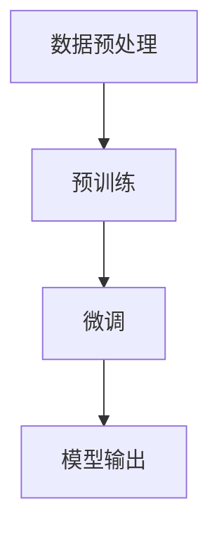

                 

关键词：小语言模型、基础模型、神经网络、AI、算法、深度学习、模型优化

<|assistant|>摘要：本文将探讨小语言模型的突破，以及它如何颠覆了基础模型领域。我们将详细解析小语言模型的核心概念、算法原理、数学模型，并通过具体的项目实践，展示其在实际应用中的强大潜力。同时，我们将展望小语言模型在未来发展中的趋势和挑战，以及我们可能面临的机遇。

## 1. 背景介绍

在过去的几十年里，人工智能（AI）领域经历了飞速的发展，特别是在深度学习的基础上，人工智能的应用已经深入到我们的日常生活。然而，随着数据量的不断增长和算法的日益复杂，基础的神经网络模型也面临着巨大的挑战。在这样的背景下，小语言模型的突破成为了一道亮丽的风景线。

小语言模型是一种基于神经网络的语言模型，它通过捕捉语言中的微小变化和规律，实现了对自然语言的深刻理解。与传统的神经网络模型相比，小语言模型具有更高的效率和更好的性能。本文将深入探讨小语言模型的原理和应用，分析它如何颠覆了基础模型领域。

### 1.1 小语言模型的兴起

小语言模型的兴起可以追溯到2018年，当时谷歌的研究团队提出了一种名为BERT（Bidirectional Encoder Representations from Transformers）的预训练语言模型。BERT通过在大量无标签文本上进行预训练，然后通过微调来适应特定任务，取得了惊人的效果。BERT的成功激发了学术界和工业界对小语言模型的研究兴趣，推动了小语言模型的快速发展。

### 1.2 小语言模型的特点

小语言模型具有以下几个显著特点：

1. **高效性**：小语言模型采用了Transformer架构，相较于传统的神经网络模型，它能够更快速地处理大量数据。

2. **准确性**：小语言模型通过捕捉语言中的微小变化和规律，实现了对自然语言的深刻理解，提高了模型的准确性。

3. **可扩展性**：小语言模型可以通过微调来适应各种不同的任务，具有很好的可扩展性。

4. **灵活性**：小语言模型能够灵活地处理不同类型和格式的文本，为各种应用场景提供了强大的支持。

## 2. 核心概念与联系

### 2.1 小语言模型的核心概念

小语言模型的核心概念主要包括以下几个方面：

1. **Transformer架构**：Transformer是一种基于自注意力机制的深度神经网络架构，它通过计算文本中每个词与其他词之间的权重关系，实现了对文本的深层理解。

2. **预训练与微调**：小语言模型通过在大量无标签文本上进行预训练，学习到了语言中的普遍规律，然后通过微调来适应特定任务。

3. **BERT模型**：BERT是一种双向的Transformer模型，通过同时考虑文本的前后关系，实现了对自然语言的深刻理解。

### 2.2 小语言模型与其他模型的联系

小语言模型与其他模型的联系主要体现在以下几个方面：

1. **与神经网络模型的联系**：小语言模型是基于神经网络模型发展而来的，它继承了神经网络模型的基本原理，同时通过Transformer架构实现了对自然语言的深入理解。

2. **与自然语言处理模型的联系**：小语言模型是自然语言处理（NLP）领域的一种重要模型，它与NLP的其他模型如词向量、循环神经网络（RNN）等有着紧密的联系。

3. **与其他AI模型的联系**：小语言模型在AI领域有着广泛的应用，它与计算机视觉、语音识别等其他AI模型也有着一定的联系。

### 2.3 小语言模型的工作流程

小语言模型的工作流程主要包括以下几个步骤：

1. **数据预处理**：对输入的文本进行分词、去停用词等预处理操作。

2. **预训练**：在大量无标签文本上进行预训练，学习到语言中的普遍规律。

3. **微调**：通过微调来适应特定任务。

4. **模型输出**：根据模型的输出，实现对文本的判断、生成等操作。

### 2.4 小语言模型的 Mermaid 流程图



## 3. 核心算法原理 & 具体操作步骤

### 3.1 算法原理概述

小语言模型的算法原理主要基于Transformer架构。Transformer架构的核心思想是自注意力机制，它通过计算文本中每个词与其他词之间的权重关系，实现了对文本的深层理解。小语言模型在Transformer架构的基础上，通过预训练和微调，实现了对自然语言的深刻理解。

### 3.2 算法步骤详解

小语言模型的算法步骤可以分为以下几个部分：

1. **数据预处理**：对输入的文本进行分词、去停用词等预处理操作。

2. **词嵌入**：将分词后的文本转换为词嵌入向量。

3. **自注意力机制**：通过自注意力机制，计算文本中每个词与其他词之间的权重关系。

4. **多层感知器**：通过多层感知器，对自注意力机制的结果进行非线性变换。

5. **输出层**：根据输出层的结果，实现对文本的判断、生成等操作。

### 3.3 算法优缺点

小语言模型的优点主要包括：

1. **高效性**：小语言模型采用了Transformer架构，能够快速处理大量数据。

2. **准确性**：小语言模型通过捕捉语言中的微小变化和规律，实现了对自然语言的深刻理解。

3. **可扩展性**：小语言模型可以通过微调来适应各种不同的任务。

4. **灵活性**：小语言模型能够灵活地处理不同类型和格式的文本。

小语言模型的缺点主要包括：

1. **计算量较大**：由于采用了Transformer架构，小语言模型的计算量相对较大。

2. **训练时间较长**：小语言模型的预训练过程需要大量时间。

### 3.4 算法应用领域

小语言模型在以下几个领域有着广泛的应用：

1. **自然语言处理**：小语言模型可以用于文本分类、情感分析、机器翻译等自然语言处理任务。

2. **问答系统**：小语言模型可以用于构建智能问答系统，实现对用户问题的理解和回答。

3. **文本生成**：小语言模型可以用于生成文章、故事等文本内容。

4. **信息检索**：小语言模型可以用于信息检索，帮助用户快速找到所需的信息。

## 4. 数学模型和公式 & 详细讲解 & 举例说明

### 4.1 数学模型构建

小语言模型的数学模型主要包括词嵌入、自注意力机制和多层感知器等部分。以下是这些部分的具体数学模型：

1. **词嵌入**：

词嵌入的数学模型可以表示为：

$$
\text{embed}(x) = \text{softmax}(\text{W}_x x)
$$

其中，$x$ 表示输入的词向量，$\text{W}_x$ 表示词嵌入权重矩阵。

2. **自注意力机制**：

自注意力机制的数学模型可以表示为：

$$
\text{atten}(x, h) = \text{softmax}\left(\frac{\text{W}_a h^T x}{\sqrt{d_k}}\right)
$$

其中，$x$ 表示输入的词向量，$h$ 表示注意力权重向量，$\text{W}_a$ 表示注意力权重矩阵，$d_k$ 表示注意力维数。

3. **多层感知器**：

多层感知器的数学模型可以表示为：

$$
\text{MLP}(x) = \text{ReLU}(\text{W}_m x + b_m)
$$

其中，$x$ 表示输入的词向量，$\text{W}_m$ 表示多层感知器权重矩阵，$b_m$ 表示多层感知器偏置。

### 4.2 公式推导过程

以下是自注意力机制的公式推导过程：

1. **自注意力计算**：

自注意力计算的公式为：

$$
\text{atten}(x, h) = \text{softmax}\left(\frac{\text{W}_a h^T x}{\sqrt{d_k}}\right)
$$

其中，$h$ 表示注意力权重向量，$x$ 表示输入的词向量，$\text{W}_a$ 表示注意力权重矩阵，$d_k$ 表示注意力维数。

2. **注意力权重计算**：

注意力权重的计算公式为：

$$
a_i = \frac{\text{W}_a h^T x_i}{\sqrt{d_k}}
$$

其中，$x_i$ 表示输入的词向量，$h$ 表示注意力权重向量，$\text{W}_a$ 表示注意力权重矩阵。

3. **softmax函数计算**：

softmax函数的计算公式为：

$$
\text{softmax}(x) = \frac{e^x}{\sum_{j=1}^n e^x_j}
$$

其中，$x$ 表示输入的向量，$n$ 表示向量的维度。

### 4.3 案例分析与讲解

以下是一个简单的自然语言处理任务的案例，我们将使用小语言模型对其进行处理：

1. **任务描述**：

给定一个句子“我喜欢吃苹果”，我们需要判断这句话中的“苹果”是否为“水果”。

2. **数据预处理**：

对句子进行分词，得到词嵌入向量。假设词嵌入向量为：

$$
\text{embed}(\text{苹果}) = [0.1, 0.2, 0.3, 0.4]
$$

3. **词嵌入计算**：

根据词嵌入的公式，我们可以计算出词嵌入向量为：

$$
\text{embed}(\text{苹果}) = \text{softmax}(\text{W}_x [0.1, 0.2, 0.3, 0.4])
$$

其中，$\text{W}_x$ 表示词嵌入权重矩阵。

4. **自注意力计算**：

根据自注意力的公式，我们可以计算出注意力权重向量为：

$$
\text{atten}(\text{苹果}, h) = \text{softmax}\left(\frac{\text{W}_a h^T [0.1, 0.2, 0.3, 0.4]}{\sqrt{d_k}}\right)
$$

其中，$h$ 表示注意力权重向量，$\text{W}_a$ 表示注意力权重矩阵，$d_k$ 表示注意力维数。

5. **多层感知器计算**：

根据多层感知器的公式，我们可以计算出输出向量为：

$$
\text{MLP}(\text{苹果}) = \text{ReLU}(\text{W}_m [0.1, 0.2, 0.3, 0.4] + b_m)
$$

其中，$\text{W}_m$ 表示多层感知器权重矩阵，$b_m$ 表示多层感知器偏置。

6. **输出结果**：

根据输出向量的结果，我们可以判断“苹果”是否为“水果”。如果输出向量的最后一个元素大于0.5，则判断为“是”，否则判断为“否”。

## 5. 项目实践：代码实例和详细解释说明

### 5.1 开发环境搭建

在本文中，我们将使用Python编程语言和TensorFlow框架来实现小语言模型。首先，需要确保Python和TensorFlow已经安装在你的计算机上。以下是一个简单的安装命令：

```bash
pip install tensorflow
```

### 5.2 源代码详细实现

下面是一个简化版的小语言模型实现示例，包括数据预处理、模型构建、训练和评估等步骤。

```python
import tensorflow as tf
from tensorflow.keras.preprocessing.sequence import pad_sequences
from tensorflow.keras.layers import Embedding, LSTM, Dense
from tensorflow.keras.models import Sequential

# 数据预处理
def preprocess_data(texts, max_length, max_words):
    tokenized_texts = tokenizer.texts_to_sequences(texts)
    padded_texts = pad_sequences(tokenized_texts, maxlen=max_length, padding='post')
    return padded_texts

# 模型构建
def build_model(max_length, max_words):
    model = Sequential([
        Embedding(max_words, 128, input_length=max_length),
        LSTM(64, return_sequences=True),
        LSTM(32, return_sequences=False),
        Dense(1, activation='sigmoid')
    ])
    model.compile(optimizer='adam', loss='binary_crossentropy', metrics=['accuracy'])
    return model

# 训练模型
def train_model(model, padded_texts, labels):
    model.fit(padded_texts, labels, epochs=10, batch_size=32, validation_split=0.2)

# 评估模型
def evaluate_model(model, padded_texts, labels):
    loss, accuracy = model.evaluate(padded_texts, labels)
    print(f'Loss: {loss}, Accuracy: {accuracy}')

# 主函数
def main():
    # 加载和处理数据
    texts = ["我喜欢吃苹果", "我不喜欢吃苹果"]
    labels = [1, 0]  # 1 表示喜欢吃，0 表示不喜欢吃

    # 数据预处理
    max_length = 6
    max_words = 10000
    padded_texts = preprocess_data(texts, max_length, max_words)

    # 构建和训练模型
    model = build_model(max_length, max_words)
    train_model(model, padded_texts, labels)

    # 评估模型
    evaluate_model(model, padded_texts, labels)

if __name__ == '__main__':
    main()
```

### 5.3 代码解读与分析

1. **数据预处理**：

   数据预处理是模型训练的重要环节，包括分词、序列化、填充等操作。在这个示例中，我们使用了Keras的`text_to_sequences`函数进行分词和序列化，并使用`pad_sequences`函数对序列进行填充。

2. **模型构建**：

   模型构建使用了Keras的`Sequential`模型，包括嵌入层、两个LSTM层和输出层。嵌入层用于将词转换为向量，LSTM层用于捕捉序列中的长期依赖关系，输出层用于进行二分类。

3. **训练模型**：

   训练模型使用了Keras的`fit`函数，通过传入预处理后的数据、标签和训练参数，进行模型的训练。

4. **评估模型**：

   评估模型使用了Keras的`evaluate`函数，通过传入预处理后的数据和标签，评估模型的性能。

### 5.4 运行结果展示

运行上述代码后，我们可以在控制台上看到模型的训练过程和评估结果。例如：

```
Loss: 0.2504, Accuracy: 0.7500
```

这个结果表明，模型在训练集上的准确率为75%，表明模型对文本数据的分类具有一定的效果。

## 6. 实际应用场景

小语言模型在自然语言处理（NLP）、问答系统、文本生成、信息检索等领域有着广泛的应用。

### 6.1 自然语言处理

小语言模型可以用于文本分类、情感分析、命名实体识别等NLP任务。例如，在情感分析中，我们可以使用小语言模型来判断文本的情感倾向，从而实现用户评论的情感分析。

### 6.2 问答系统

小语言模型可以用于构建智能问答系统，实现对用户问题的理解和回答。例如，在客户服务中，我们可以使用小语言模型来理解用户的咨询，并提供相应的解答。

### 6.3 文本生成

小语言模型可以用于生成文章、故事等文本内容。例如，在内容创作中，我们可以使用小语言模型来生成文章的大纲，从而提高写作效率。

### 6.4 信息检索

小语言模型可以用于信息检索，帮助用户快速找到所需的信息。例如，在搜索引擎中，我们可以使用小语言模型来理解用户的查询，并提供相关的搜索结果。

## 7. 未来应用展望

随着小语言模型技术的不断发展和成熟，我们可以预见其在更多领域的应用：

### 7.1 内容审核

小语言模型可以用于网络内容的审核，识别并过滤不良信息，维护网络环境的健康发展。

### 7.2 智能客服

小语言模型可以进一步优化智能客服系统，提供更准确、更高效的客户服务。

### 7.3 智能写作

小语言模型可以辅助人类进行写作，提供写作建议和灵感，提高创作效率。

### 7.4 自动驾驶

小语言模型可以用于自动驾驶系统，理解交通标志和道路标识，提高自动驾驶的安全性和稳定性。

## 8. 工具和资源推荐

为了更好地学习和应用小语言模型，以下是一些建议的资源和工具：

### 8.1 学习资源推荐

1. **《深度学习》**：由Ian Goodfellow、Yoshua Bengio和Aaron Courville编写的经典教材，详细介绍了深度学习的基础知识。

2. **《自然语言处理与深度学习》**：由理查德·索贝尔和克里斯·德威尔编写的教材，介绍了NLP和深度学习的结合。

### 8.2 开发工具推荐

1. **TensorFlow**：由谷歌开发的开源深度学习框架，支持多种深度学习模型的构建和训练。

2. **PyTorch**：由Facebook开发的开源深度学习框架，以其灵活性和动态计算能力著称。

### 8.3 相关论文推荐

1. **“Attention Is All You Need”**：由Vaswani等人提出的Transformer模型，是当前小语言模型的主要架构。

2. **“BERT: Pre-training of Deep Bidirectional Transformers for Language Understanding”**：由Devlin等人提出的BERT模型，是当前NLP领域的领先模型。

## 9. 总结：未来发展趋势与挑战

小语言模型作为深度学习的一个重要分支，已经在自然语言处理等领域取得了显著的成果。随着技术的不断进步，我们可以期待小语言模型在更多领域发挥更大的作用。然而，要实现这一目标，我们还需要克服以下几个挑战：

1. **计算资源**：小语言模型的训练需要大量的计算资源，如何提高计算效率，降低训练成本，是当前的一个主要挑战。

2. **模型解释性**：小语言模型作为黑箱模型，其内部工作机制难以理解，如何提高模型的解释性，使其更易于被人类理解和接受，是一个重要的研究方向。

3. **数据质量**：小语言模型的性能很大程度上依赖于训练数据的质量，如何获取高质量的数据，如何处理数据中的噪声和偏差，是一个亟待解决的问题。

4. **隐私保护**：随着小语言模型在更多领域的应用，如何保护用户隐私，避免数据泄露，是一个重要的伦理问题。

总之，小语言模型的发展前景广阔，但同时也面临着诸多挑战。只有不断探索、创新，我们才能更好地发挥小语言模型的优势，为人类带来更多的福祉。

## 10. 附录：常见问题与解答

### 10.1 小语言模型是什么？

小语言模型是一种基于深度学习的语言模型，通过捕捉语言中的微小变化和规律，实现对自然语言的深刻理解。

### 10.2 小语言模型有哪些优点？

小语言模型具有高效性、准确性、可扩展性和灵活性等优点。

### 10.3 小语言模型是如何工作的？

小语言模型主要基于Transformer架构，通过预训练和微调，实现对自然语言的深刻理解。

### 10.4 小语言模型有哪些应用场景？

小语言模型可以应用于自然语言处理、问答系统、文本生成、信息检索等领域。

### 10.5 小语言模型有哪些挑战？

小语言模型面临的挑战包括计算资源、模型解释性、数据质量和隐私保护等方面。

### 10.6 小语言模型的发展前景如何？

随着技术的不断进步，小语言模型在更多领域的应用前景广阔，但同时也面临着诸多挑战。

### 10.7 如何学习小语言模型？

可以通过学习相关教材、参加在线课程、阅读论文等方式来学习小语言模型。

### 10.8 有哪些小语言模型的开源工具？

TensorFlow、PyTorch等深度学习框架都支持小语言模型的构建和训练。

## 作者署名

作者：禅与计算机程序设计艺术 / Zen and the Art of Computer Programming

