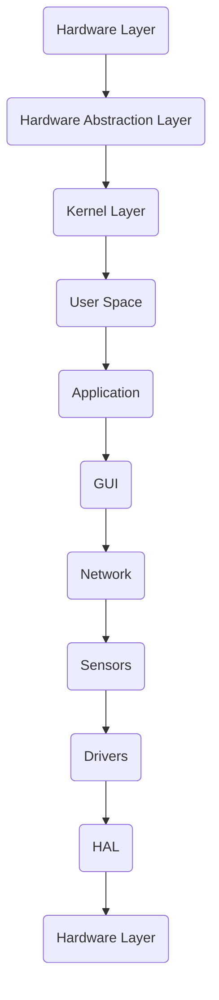

                 

关键词：嵌入式Linux、设备运行、操作系统、硬件抽象层、实时系统、内核、编译、调试、性能优化

摘要：本文将深入探讨嵌入式 Linux 的概念、优势及其在设备上运行的关键技术和挑战。我们将分析嵌入式 Linux 的核心架构，探讨其在实时系统和硬件抽象层中的应用，并通过实际案例展示如何进行编译、调试和性能优化。本文旨在为嵌入式系统开发者提供全面的指南，以帮助他们更好地利用嵌入式 Linux 实现高效的设备运行。

## 1. 背景介绍

嵌入式系统是指那些具有特定功能的独立计算机系统，它们通常嵌入在其他设备中，如工业控制设备、智能家居设备、医疗设备和汽车电子系统等。随着物联网（IoT）的兴起，嵌入式系统的应用领域和复杂性不断增加，这使得对高效、稳定的操作系统的需求日益迫切。

Linux 操作系统因其开源、稳定、高性能等特点，成为嵌入式系统的首选操作系统之一。嵌入式 Linux 是一种针对嵌入式设备的 Linux 发行版，它与通用 Linux 相比，对硬件资源的要求更低，更适合运行在资源受限的嵌入式设备上。

本文将主要讨论以下主题：

1. 嵌入式 Linux 的基本概念和架构
2. 嵌入式 Linux 在实时系统和硬件抽象层中的应用
3. 嵌入式 Linux 的编译、调试和性能优化技术
4. 嵌入式 Linux 在实际应用场景中的挑战和未来展望

## 2. 核心概念与联系

### 2.1 嵌入式 Linux 的基本概念

嵌入式 Linux 是一种基于 Linux 内核的操作系统，专为嵌入式设备设计。它具有以下核心概念：

- **内核（Kernel）**：Linux 内核是嵌入式 Linux 的核心，负责管理硬件资源、内存、进程、文件系统等。
- **设备树（Device Tree）**：设备树是一种描述硬件配置的数据结构，用于在内核启动时初始化硬件设备。
- **用户空间（User Space）**：用户空间包括各种应用程序和库，用于提供用户交互和服务功能。
- **硬件抽象层（HAL）**：硬件抽象层是操作系统与硬件之间的接口，用于简化硬件管理，提高系统可移植性。

### 2.2 嵌入式 Linux 的架构

嵌入式 Linux 的架构主要包括以下层次：

- **硬件层（Hardware Layer）**：包括嵌入式设备的物理硬件，如CPU、内存、外设等。
- **硬件抽象层（HAL）**：提供统一的接口，使操作系统与硬件解耦，提高系统可移植性。
- **内核层（Kernel Layer）**：负责硬件管理、进程管理、内存管理、文件系统等核心功能。
- **用户空间（User Space）**：包括应用程序、库和用户界面等，为用户提供服务。

### 2.3 Mermaid 流程图

以下是一个简化的嵌入式 Linux 架构的 Mermaid 流程图：



## 3. 核心算法原理 & 具体操作步骤

### 3.1 算法原理概述

嵌入式 Linux 的核心算法主要包括以下几个方面：

- **进程调度**：根据进程优先级和资源需求，合理调度进程执行，提高系统响应速度。
- **内存管理**：通过虚拟内存技术，高效管理内存资源，减少内存碎片。
- **文件系统**：提供文件存储和访问机制，支持多种文件系统格式，如 ext4、fat32 等。
- **设备驱动**：为硬件设备提供驱动程序，实现硬件与操作系统的通信。

### 3.2 算法步骤详解

#### 3.2.1 内核编译

1. **选择内核版本**：根据项目需求选择适合的内核版本。
2. **下载内核源码**：从 Linux 内核官方网站下载内核源码。
3. **配置内核**：使用 `make menuconfig` 或 `make xconfig` 命令配置内核选项。
4. **编译内核**：使用 `make` 命令编译内核。
5. **安装内核**：将编译好的内核安装到设备中。

#### 3.2.2 设备驱动开发

1. **分析硬件文档**：了解硬件规格和功能，编写相应的硬件文档。
2. **编写驱动程序**：根据硬件文档编写驱动程序，实现硬件与操作系统的通信。
3. **调试驱动程序**：使用调试工具，如 GDB，调试驱动程序，确保其正确性。
4. **集成驱动程序**：将驱动程序集成到内核中，确保其正常工作。

### 3.3 算法优缺点

#### 优点

- **开源**：嵌入式 Linux 是开源的，开发者可以自由修改和扩展系统功能。
- **稳定性**：经过多年的发展和优化，嵌入式 Linux 具有很高的稳定性。
- **高性能**：嵌入式 Linux 支持多线程和实时扩展，可以高效处理复杂任务。

#### 缺点

- **学习成本**：嵌入式 Linux 开发需要一定的专业知识，对开发者要求较高。
- **资源消耗**：嵌入式 Linux 对硬件资源的要求较高，不适合所有嵌入式设备。

### 3.4 算法应用领域

嵌入式 Linux 广泛应用于以下领域：

- **工业控制**：用于控制工业设备，如PLC、机器人等。
- **智能家居**：用于智能设备，如智能门锁、智能照明等。
- **医疗设备**：用于医疗设备，如医疗监护仪、手术机器人等。
- **汽车电子**：用于汽车电子系统，如车载信息娱乐系统、自动驾驶等。

## 4. 数学模型和公式 & 详细讲解 & 举例说明

### 4.1 数学模型构建

嵌入式 Linux 的性能优化主要涉及以下几个方面：

1. **内存管理**：使用分页机制和内存映射技术，提高内存利用率。
2. **进程调度**：使用调度算法，如 SCHED_RR 和 SCHED_FIFO，优化进程执行顺序。
3. **I/O 优化**：使用异步 I/O 和零拷贝技术，提高 I/O 操作效率。

### 4.2 公式推导过程

#### 内存管理

- **分页机制**：将物理内存分成固定大小的页（Page），虚拟地址（Virtual Address）与物理地址（Physical Address）的映射关系通过页表（Page Table）实现。

$$
Physical\ Address = Page\ Table \times Page\ Size + Offset
$$

- **内存映射**：将文件映射到内存中，通过文件描述符和虚拟地址进行映射。

$$
Virtual\ Address = File\ Descriptor \times Block\ Size + Offset
$$

#### 进程调度

- **调度算法**：进程优先级（Priority）是进程调度的关键因素。

$$
Scheduling\ Decision = \arg\max(Priority)
$$

#### I/O 优化

- **异步 I/O**：通过异步 I/O，将 I/O 操作与进程调度分离，提高 I/O 操作效率。

$$
Asynchronous\ I/O = \{ \text{Start I/O}, \text{Continue Processing}, \text{Complete I/O} \}
$$

- **零拷贝技术**：通过零拷贝技术，减少数据在用户空间和内核空间之间的拷贝次数。

$$
Zero-Copy\ Technology = \{ \text{Direct Data Transfer}, \text{Reduce Memory Copies} \}
$$

### 4.3 案例分析与讲解

#### 内存管理案例

假设一个嵌入式设备具有 256MB 的物理内存，我们需要对其进行内存管理。我们可以将物理内存划分为大小为 4KB 的页，即每个页表项对应一个 4KB 的内存块。

- **分页机制**：使用 256MB / 4KB = 64,000 个页表项。
- **内存映射**：将一个 100MB 的文件映射到内存中，需要 100MB / 4KB = 25,000 个页表项。

通过分页机制和内存映射技术，我们可以高效地管理内存资源。

#### 进程调度案例

假设有两个进程，进程 A 和进程 B，它们的优先级分别为 10 和 5。使用 SCHED_RR 算法进行调度。

- **调度顺序**：首先调度进程 A，执行一段时间后，切换到进程 B，再切换回进程 A，如此循环。

#### I/O 优化案例

假设我们需要从一个网络服务器读取一个 1GB 的文件，使用异步 I/O 和零拷贝技术进行优化。

- **异步 I/O**：将读取操作与进程调度分离，提高 I/O 操作效率。
- **零拷贝技术**：通过套接字缓冲区直接将数据从内核空间传输到用户空间，减少数据拷贝次数。

通过异步 I/O 和零拷贝技术，我们可以显著提高 I/O 操作的效率。

## 5. 项目实践：代码实例和详细解释说明

### 5.1 开发环境搭建

在搭建嵌入式 Linux 开发环境时，我们需要安装以下工具：

- **Linux 发行版**：如 Ubuntu 20.04。
- **交叉编译工具链**：如 arm-none-eabi-gcc。
- **内核源码**：如 Linux 5.10。
- **设备树**：根据硬件规格生成。

### 5.2 源代码详细实现

以下是嵌入式 Linux 内核编译的主要步骤：

1. **下载内核源码**：

```bash
git clone https://github.com/torvalds/linux.git
cd linux
```

2. **配置内核**：

```bash
make menuconfig
```

3. **编译内核**：

```bash
make
```

4. **安装内核**：

```bash
make modules_install
make install
```

### 5.3 代码解读与分析

在内核源码中，主要涉及以下关键组件：

- **内核配置（kernel/configs）**：包含各种硬件平台的内核配置文件，如 arm、x86 等。
- **内核源码（kernel/source）**：包含内核源代码文件，如 init/main.c、sched/core.c 等。
- **设备树（arch/arm/boot/dts）**：包含设备树文件，如 imx6ull.dts、rk3399.dts 等。

### 5.4 运行结果展示

编译完成后，我们将内核文件（如 vmlinuz）和设备树文件（如 imx6ull.dts）烧写到设备中，然后重启设备，内核将成功运行。

## 6. 实际应用场景

### 6.1 工业控制

在工业控制领域，嵌入式 Linux 用于控制各种工业设备和生产线。例如，PLC（可编程逻辑控制器）通常使用嵌入式 Linux 作为操作系统，实现自动化控制和监控。

### 6.2 智能家居

智能家居设备如智能门锁、智能照明和智能摄像头等，通常使用嵌入式 Linux 来实现智能控制和网络通信功能。嵌入式 Linux 提供了丰富的库和工具，方便开发者进行智能家居设备的开发。

### 6.3 医疗设备

医疗设备如医疗监护仪、手术机器人等，对实时性和稳定性要求较高。嵌入式 Linux 提供了实时扩展（RTAI、PREEMPT_RT），可以提高系统响应速度和稳定性，满足医疗设备的需求。

### 6.4 汽车电子

汽车电子系统如车载信息娱乐系统（IVI）、自动驾驶系统等，对性能和可靠性要求极高。嵌入式 Linux 提供了丰富的硬件支持和优化工具，可以满足汽车电子系统的需求。

## 7. 工具和资源推荐

### 7.1 学习资源推荐

- 《嵌入式 Linux 从入门到精通》
- 《Linux 设备驱动程序》
- 《Linux 内核设计与实现》

### 7.2 开发工具推荐

- **交叉编译工具链**：如 Yocto Project、Buildroot
- **调试工具**：如 GDB、JTAG
- **版本控制工具**：如 Git

### 7.3 相关论文推荐

- "Real-Time Linux: Challenges and Opportunities"
- "Performance Optimization of Embedded Linux"
- "Linux Device Drivers"

## 8. 总结：未来发展趋势与挑战

### 8.1 研究成果总结

近年来，嵌入式 Linux 在实时系统、硬件抽象层、性能优化等方面取得了显著成果，为嵌入式系统的开发提供了强大支持。然而，嵌入式 Linux 仍面临许多挑战，如实时性、安全性、资源优化等。

### 8.2 未来发展趋势

- **实时扩展**：随着物联网和自动驾驶等领域的快速发展，实时扩展将成为嵌入式 Linux 的重要发展方向。
- **安全性**：随着嵌入式设备在关键领域的应用，嵌入式 Linux 的安全性越来越受到关注。
- **资源优化**：为适应更多资源受限的嵌入式设备，嵌入式 Linux 将在资源利用率和性能优化方面继续改进。

### 8.3 面临的挑战

- **实时性**：如何提高嵌入式 Linux 的实时性能，满足实时系统的需求。
- **安全性**：如何提高嵌入式 Linux 的安全性，防范安全威胁。
- **资源优化**：如何在资源受限的嵌入式设备上实现更高的性能和效率。

### 8.4 研究展望

未来，嵌入式 Linux 将在实时系统、安全性和资源优化等方面继续取得突破。同时，随着物联网和人工智能等新兴技术的快速发展，嵌入式 Linux 的应用领域将更加广泛，对嵌入式系统开发者的要求也将不断提高。

## 9. 附录：常见问题与解答

### 问题 1：如何选择适合的嵌入式 Linux 版本？

**解答**：根据项目需求和硬件平台，选择适合的嵌入式 Linux 版本。常用的版本包括 Ubuntu、Fedora、Red Hat 等。对于嵌入式设备，建议选择轻量级版本，如 Ubuntu Core、Fedora Silverblue 等。

### 问题 2：如何进行嵌入式 Linux 的编译和调试？

**解答**：首先，搭建嵌入式 Linux 开发环境，安装交叉编译工具链和调试工具。然后，下载内核源码和设备树文件，进行内核配置和编译。编译完成后，将内核和设备树文件烧写到设备中，使用调试工具进行调试。

### 问题 3：如何优化嵌入式 Linux 的性能？

**解答**：优化嵌入式 Linux 的性能可以从以下几个方面入手：

1. **内存管理**：使用分页机制和内存映射技术，提高内存利用率。
2. **进程调度**：选择合适的调度算法，如 SCHED_RR 和 SCHED_FIFO，优化进程执行顺序。
3. **I/O 优化**：使用异步 I/O 和零拷贝技术，提高 I/O 操作效率。

---

作者：禅与计算机程序设计艺术 / Zen and the Art of Computer Programming

