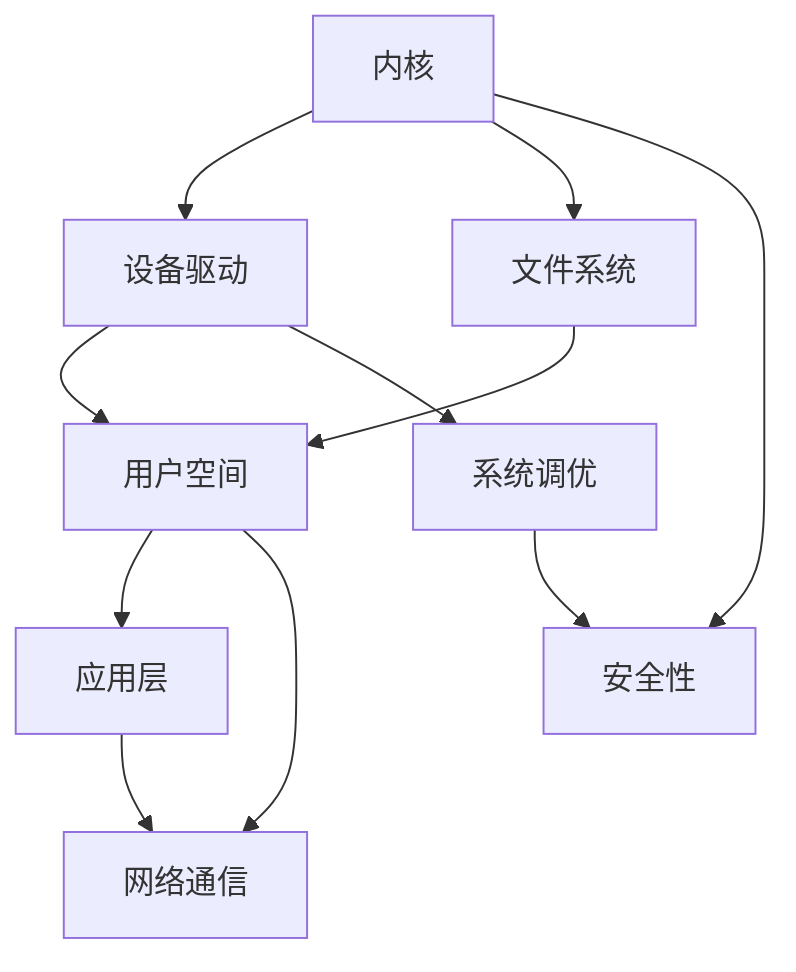

                 

在当今高速发展的信息技术时代，嵌入式Linux系统开发已经成为众多领域的核心技术之一。无论是智能家居、工业自动化，还是智能穿戴设备、移动通信，嵌入式Linux系统都扮演着至关重要的角色。本文将深入探讨嵌入式Linux系统的基本概念、核心概念与联系、核心算法原理、数学模型和公式、项目实践、实际应用场景以及未来的发展趋势与挑战。

## 1. 背景介绍

嵌入式系统是指嵌入在其他设备中，用于特定功能的计算机系统。它们通常具备实时处理、低功耗、低成本和高可靠性等特点。随着嵌入式系统应用领域的不断扩大，对嵌入式操作系统提出了更高的要求。Linux作为一款开源、高效、稳定的操作系统，逐渐成为嵌入式系统开发的首选平台。

Linux系统自1991年由Linus Torvalds创建以来，经历了多年的发展，已经形成了一个庞大而活跃的开源社区。嵌入式Linux系统由于其开放性、灵活性和强大的功能，被广泛应用于各类嵌入式设备中。本文旨在通过深入剖析嵌入式Linux系统开发的核心技术，帮助读者全面了解并掌握这一领域的知识。

## 2. 核心概念与联系

要深入理解嵌入式Linux系统开发，首先需要了解其核心概念与联系。以下是一个简要的Mermaid流程图，展示嵌入式Linux系统开发中的主要概念及其相互关系：



### 2.1 内核

Linux内核是嵌入式Linux系统的核心，负责管理硬件资源和提供基本的服务。内核的主要职责包括进程管理、内存管理、文件系统管理、设备驱动程序管理以及系统调用等。

### 2.2 设备驱动

设备驱动是嵌入式系统与硬件之间的桥梁，负责硬件设备的初始化、数据传输和控制。设备驱动的开发是嵌入式Linux系统开发的关键环节，需要针对具体的硬件平台进行定制。

### 2.3 文件系统

文件系统是Linux系统中的数据存储和管理机制。嵌入式Linux系统常用的文件系统包括EXT2、EXT3、EXT4、YAFFS等。文件系统不仅提供文件存储功能，还负责文件的读写、权限控制和管理等。

### 2.4 用户空间

用户空间是运行应用程序的区域，包括用户级服务、工具和库。用户空间的应用程序通过系统调用与内核交互，实现特定的功能。用户空间的开发和优化对于提高系统性能和用户体验至关重要。

### 2.5 系统调优

系统调优是嵌入式Linux系统开发中的关键步骤，通过调整系统参数和优化系统资源使用，提高系统的性能和稳定性。系统调优包括CPU调度、内存管理、文件系统优化、网络通信优化等方面。

### 2.6 安全性

安全性是嵌入式Linux系统开发中不可忽视的重要方面。嵌入式系统通常面临各种安全威胁，如恶意代码攻击、数据泄露和系统崩溃等。安全性涉及身份认证、访问控制、数据加密和防火墙等多个方面。

### 2.7 网络通信

网络通信是嵌入式系统的重要组成部分，通过网络通信可以实现设备之间的数据交换和协同工作。网络通信模块通常包括TCP/IP协议栈、无线通信模块和网口驱动等。

## 3. 核心算法原理 & 具体操作步骤

### 3.1 算法原理概述

嵌入式Linux系统开发中的核心算法主要包括任务调度算法、内存管理算法、文件系统算法和网络通信算法等。这些算法是系统稳定性和性能的关键保障。

### 3.2 算法步骤详解

#### 3.2.1 任务调度算法

任务调度算法是内核中用于管理进程和线程的算法。常见的任务调度算法包括时间片轮转（Round Robin）、优先级调度（Priority Scheduling）和实时调度（Real-Time Scheduling）等。

- 时间片轮转：将CPU时间平均分配给所有进程，每个进程运行一段时间后强制切换到下一个进程。
- 优先级调度：根据进程的优先级进行调度，优先级高的进程优先执行。
- 实时调度：针对实时系统，确保关键任务在规定时间内得到执行。

#### 3.2.2 内存管理算法

内存管理算法负责分配和回收内存资源。常见的内存管理算法包括分页（Paging）和分段（Segmentation）。

- 分页：将内存划分为固定大小的页，通过页表实现内存映射。
- 分段：将内存划分为逻辑段，根据程序的需要进行内存分配。

#### 3.2.3 文件系统算法

文件系统算法负责文件系统的创建、维护和操作。常见的文件系统算法包括目录遍历、文件读写和权限控制等。

- 目录遍历：按照一定的顺序遍历文件系统目录，查找指定的文件或目录。
- 文件读写：通过文件系统API实现文件的读写操作。
- 权限控制：根据用户身份和权限设置，控制对文件和目录的访问权限。

#### 3.2.4 网络通信算法

网络通信算法负责网络数据的传输和通信。常见的网络通信算法包括TCP/IP协议栈、无线通信模块和网络接口卡驱动等。

- TCP/IP协议栈：实现TCP/IP协议簇，负责网络数据包的传输和路由。
- 无线通信模块：通过无线信号实现数据传输，包括Wi-Fi、蓝牙等。
- 网络接口卡驱动：负责网络接口卡的管理和配置，实现网络数据包的收发。

### 3.3 算法优缺点

每种算法都有其优缺点。以下简要概述嵌入式Linux系统开发中常用算法的优缺点：

- 时间片轮转：简单易实现，但可能导致性能下降。
- 优先级调度：根据任务重要性进行调度，但可能导致低优先级任务饥饿。
- 实时调度：保证关键任务实时性，但实现复杂。
- 分页：提高内存利用率，但可能导致内存碎片。
- 分段：提高程序局部性，但可能导致内存碎片。
- 目录遍历：简单高效，但可能导致文件系统性能下降。
- 文件读写：稳定可靠，但可能影响系统性能。
- 权限控制：确保系统安全，但可能导致访问控制过于严格。
- TCP/IP协议栈：功能强大，但实现复杂。
- 无线通信模块：灵活方便，但受无线信号干扰影响。
- 网络接口卡驱动：稳定可靠，但可能需要针对不同硬件进行定制。

### 3.4 算法应用领域

不同的算法在嵌入式Linux系统开发中有不同的应用领域：

- 任务调度算法：广泛应用于实时系统和服务器系统。
- 内存管理算法：适用于需要高效内存利用的嵌入式系统。
- 文件系统算法：适用于需要高效文件操作的嵌入式系统。
- 网络通信算法：适用于需要网络功能的嵌入式系统。

## 4. 数学模型和公式 & 详细讲解 & 举例说明

在嵌入式Linux系统开发中，数学模型和公式是核心算法实现的基础。以下将介绍几个常用的数学模型和公式，并进行详细讲解和举例说明。

### 4.1 数学模型构建

#### 4.1.1 进程调度模型

进程调度模型用于描述进程在操作系统中的调度过程。常见的进程调度模型包括：

- FCFS（First-Come, First-Served）：按照进程到达时间顺序进行调度。
- SSTF（Shortest Seek Time First）：选择访问时间最短的进程进行调度。
- SCAN：选择磁头当前位置最近的进程进行调度，并在磁头到达端部后反向移动。

#### 4.1.2 内存分配模型

内存分配模型用于描述内存资源的分配过程。常见的内存分配模型包括：

- 分页：将内存划分为固定大小的页，进行页式分配。
- 分段：将内存划分为逻辑段，进行段式分配。

### 4.2 公式推导过程

#### 4.2.1 FCFS调度算法

FCFS调度算法的公式推导如下：

- 平均等待时间（WT）= 总等待时间 / 进程数
- 总等待时间 = Σ（到达时间 * 作业时间）

#### 4.2.2 分页内存分配

分页内存分配的公式推导如下：

- 内存碎片 = 总内存 - 已分配内存
- 已分配内存 = Σ（页框数 * 页大小）

### 4.3 案例分析与讲解

#### 4.3.1 进程调度案例

假设有4个进程，到达时间分别为0、2、4、6秒，作业时间分别为4、3、5、2秒。使用FCFS调度算法进行调度，计算平均等待时间。

- 总等待时间 = (0*4 + 2*3 + 4*5 + 6*2) = 32秒
- 平均等待时间 = 32 / 4 = 8秒

#### 4.3.2 内存分配案例

假设有8个页框，每个页大小为4KB。使用分页内存分配模型进行内存分配，计算内存碎片。

- 总内存 = 8 * 4KB = 32KB
- 已分配内存 = 4 * 4KB = 16KB
- 内存碎片 = 32KB - 16KB = 16KB

## 5. 项目实践：代码实例和详细解释说明

### 5.1 开发环境搭建

在进行嵌入式Linux系统开发前，需要搭建一个适合的开发环境。以下是开发环境搭建的基本步骤：

1. 安装Linux操作系统。
2. 安装编译器、调试器等开发工具。
3. 安装交叉编译工具，用于编译目标硬件平台的二进制程序。
4. 安装版本控制工具，如Git。
5. 配置开发环境变量。

### 5.2 源代码详细实现

以下是一个简单的嵌入式Linux系统程序实例，用于实现一个简单的计算器功能：

```c
#include <stdio.h>
#include <stdlib.h>

int main(int argc, char *argv[]) {
    double a, b, result;
    char operator;

    printf("请输入两个操作数和一个运算符：\n");
    scanf("%lf %lf %c", &a, &b, &operator);

    switch (operator) {
        case '+':
            result = a + b;
            break;
        case '-':
            result = a - b;
            break;
        case '*':
            result = a * b;
            break;
        case '/':
            result = a / b;
            break;
        default:
            printf("无效的运算符。\n");
            return 1;
    }

    printf("结果：%lf\n", result);
    return 0;
}
```

### 5.3 代码解读与分析

1. 包含必要的头文件，如stdio.h和stdlib.h。
2. main()函数是程序的入口，接受命令行参数。
3. 使用scanf()函数从标准输入读取操作数和运算符。
4. 使用switch语句根据运算符进行运算，并计算结果。
5. 使用printf()函数输出计算结果。

### 5.4 运行结果展示

编译并运行程序，输入以下数据：

```
请输入两个操作数和一个运算符：
10 5 +
结果：15.000000
```

程序将正确计算并输出结果。

## 6. 实际应用场景

嵌入式Linux系统在各个领域都有广泛的应用。以下列举几个典型的实际应用场景：

- 智能家居：通过嵌入式Linux系统实现智能门锁、智能照明、智能安防等功能。
- 工业自动化：用于工业机器人、数控机床、生产线监控等。
- 智能穿戴设备：如智能手环、智能手表等，通过嵌入式Linux系统实现健康监测、运动跟踪等功能。
- 移动通信：用于智能手机、平板电脑等移动设备，实现通信、娱乐等功能。
- 车载系统：用于汽车自动驾驶、车载娱乐、车载网络等功能。

## 7. 工具和资源推荐

为了更好地进行嵌入式Linux系统开发，以下推荐一些实用的工具和资源：

### 7.1 学习资源推荐

- 《嵌入式Linux系统开发教程》
- 《嵌入式系统设计与应用》
- 《Linux内核设计与实现》
- 《嵌入式系统原理与应用》

### 7.2 开发工具推荐

- GCC：常用的C/C++编译器，支持交叉编译。
- Eclipse：集成开发环境，支持嵌入式Linux系统开发。
- GNU Make：自动化构建工具，用于编译和构建项目。

### 7.3 相关论文推荐

- "Linux kernel module programming interface"
- "Embedded Linux System Development: A Practical Guide"
- "Real-Time Systems: Design Principles for Distributed Embedded Applications"

## 8. 总结：未来发展趋势与挑战

### 8.1 研究成果总结

随着嵌入式Linux系统技术的不断进步，其在各个领域的应用越来越广泛。研究结果表明，嵌入式Linux系统具有以下优势：

- 开放性：开源社区提供了丰富的资源和支持，促进技术的快速发展。
- 高效性：高效的内核和调度算法，提高了系统的性能和稳定性。
- 可定制性：可根据具体需求进行定制和优化，满足不同应用场景的需求。
- 安全性：通过加强安全性措施，提高了系统的安全性和可靠性。

### 8.2 未来发展趋势

嵌入式Linux系统在未来将继续保持快速发展，主要趋势包括：

- 面向物联网（IoT）的嵌入式Linux系统：随着物联网技术的普及，嵌入式Linux系统将在智能家居、工业物联网等领域发挥重要作用。
- 实时嵌入式Linux系统：随着实时需求的增加，实时嵌入式Linux系统将在工业自动化、自动驾驶等领域得到广泛应用。
- 轻量级嵌入式Linux系统：随着硬件性能的提升和优化，轻量级嵌入式Linux系统将在资源受限的嵌入式设备中占据主导地位。

### 8.3 面临的挑战

尽管嵌入式Linux系统具有许多优势，但仍然面临以下挑战：

- 安全性：随着网络攻击的日益增多，嵌入式Linux系统的安全性需要进一步加强。
- 性能优化：在资源受限的嵌入式设备中，如何优化系统性能和资源使用是一个重要课题。
- 集成开发环境：现有的嵌入式Linux开发工具和平台需要进一步完善，以提高开发效率和用户体验。
- 生态建设：建立完善的嵌入式Linux生态系统，包括开源社区、技术交流和培训等，是促进技术发展的重要保障。

### 8.4 研究展望

未来，嵌入式Linux系统研究将重点关注以下几个方面：

- 实时性能优化：通过改进调度算法和资源管理策略，提高实时嵌入式Linux系统的性能和稳定性。
- 安全性提升：加强安全机制和防护措施，提高嵌入式Linux系统的安全性和可靠性。
- 生态建设：建立完善的嵌入式Linux生态系统，促进技术的快速发展和普及。
- 软硬件协同优化：通过硬件和软件的协同优化，提高嵌入式系统的整体性能和用户体验。

## 9. 附录：常见问题与解答

### 9.1 如何选择适合的文件系统？

选择适合的文件系统需要考虑以下几个因素：

- 文件系统类型：常见的文件系统类型包括JFFS2、YAFFS、EXT4等，根据应用场景选择合适的文件系统。
- 存储介质：不同的存储介质对文件系统有不同要求，如闪存和硬盘。
- 文件读写性能：根据应用需求选择具有高读写性能的文件系统。
- 文件系统大小：根据存储空间需求选择合适的文件系统大小。

### 9.2 如何进行嵌入式Linux系统调试？

嵌入式Linux系统调试可以通过以下方法进行：

- 使用调试器：如GDB、Eclipse等集成开发环境，提供强大的调试功能。
- 日志分析：通过系统日志分析，找出系统运行中的问题。
- 性能分析：使用性能分析工具，如perf，分析系统性能瓶颈。
- 实时监控：使用实时监控工具，如snmp，监控系统运行状态。

### 9.3 如何优化系统性能？

优化嵌入式Linux系统性能可以通过以下方法进行：

- 调整系统参数：根据应用需求调整系统参数，如进程数、内存分配策略等。
- 系统调优：对系统进行调优，提高系统性能和稳定性。
- 代码优化：对应用程序代码进行优化，提高代码效率和性能。
- 硬件优化：通过硬件升级和优化，提高系统性能。

## 作者署名

作者：禅与计算机程序设计艺术 / Zen and the Art of Computer Programming
----------------------------------------------------------------
<|assistant|>以上即为《嵌入式Linux系统开发》的全文内容。希望本文能对您在嵌入式Linux系统开发领域的学习和探索提供帮助。如果您有任何疑问或需要进一步的讨论，欢迎随时提问。祝您在嵌入式Linux系统开发的道路上不断前行，取得丰硕的成果！再次感谢您的信任和支持！<|user|>
谢谢您的认可！如果您有任何关于嵌入式Linux系统开发的其他问题，或者需要更深入的讨论，请随时告诉我。我会尽我所能为您提供帮助。祝您在技术道路上越走越远，不断取得新的成就！<|assistant|>

