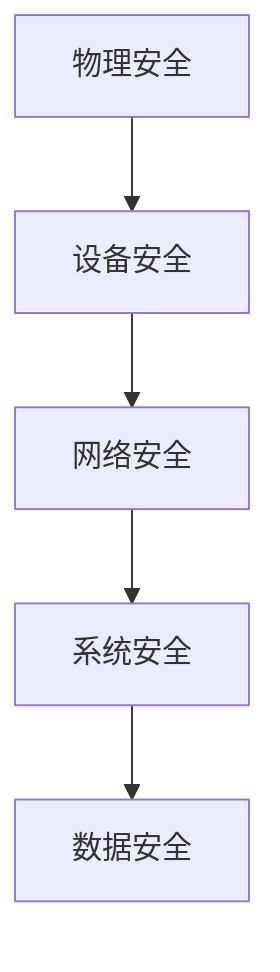

                 

关键词：嵌入式系统，安全策略，设备保护，数据安全，防护机制

> 摘要：随着嵌入式系统在智能家居、工业控制、医疗设备等领域的广泛应用，其安全问题逐渐成为关注的焦点。本文旨在探讨嵌入式系统的安全策略，包括保护设备和数据的方法、常见的安全威胁及其应对措施，以期为嵌入式系统开发者提供参考。

## 1. 背景介绍

嵌入式系统是指嵌入在其他设备中的计算机系统，通常执行特定的任务，具有高可靠性、实时性和低功耗等特点。近年来，嵌入式系统在各个领域的应用越来越广泛，如智能家居控制系统、工业自动化设备、医疗设备等。然而，随着嵌入式系统的普及，其安全问题也日益凸显。嵌入式系统的安全性直接关系到设备的正常运行和用户的数据安全。

### 1.1 安全问题的重要性

1. **设备故障与损失**：安全漏洞可能导致设备运行不稳定，甚至造成设备永久性损坏。
2. **数据泄露**：嵌入式系统中的敏感数据可能被未经授权的第三方获取，导致隐私泄露。
3. **经济损失**：安全漏洞可能被利用进行非法活动，如恶意软件攻击、拒绝服务攻击等，导致企业和个人遭受经济损失。

### 1.2 当前嵌入式系统面临的威胁

1. **硬件漏洞**：如芯片设计缺陷、硬件调试漏洞等。
2. **软件漏洞**：如操作系统漏洞、应用程序漏洞等。
3. **网络攻击**：通过网络连接，攻击者可能对嵌入式系统进行远程攻击。
4. **恶意软件**：如勒索软件、病毒等，可能导致系统瘫痪或数据被加密。

## 2. 核心概念与联系

为了更好地理解嵌入式系统的安全策略，我们需要了解以下几个核心概念：

### 2.1 设备安全

设备安全主要包括物理安全和网络安全。物理安全涉及防止设备被盗、损坏或未经授权的物理访问；网络安全涉及保护系统不受网络攻击和数据泄露。

### 2.2 数据安全

数据安全主要包括数据加密、完整性保护和访问控制。数据加密可以防止数据被未经授权的第三方读取；完整性保护可以确保数据在传输和存储过程中不被篡改；访问控制可以限制对数据的访问权限。

### 2.3 系统安全

系统安全涉及操作系统、应用程序和网络的安全。操作系统安全包括防止恶意软件、缓冲区溢出攻击等；应用程序安全包括防止代码注入、拒绝服务攻击等；网络安全包括防止网络攻击、数据窃取等。

下面是一个简化的嵌入式系统安全架构的 Mermaid 流程图：



## 3. 核心算法原理 & 具体操作步骤

### 3.1 算法原理概述

嵌入式系统的安全策略主要基于以下几种原理：

1. **访问控制**：通过用户身份验证、权限管理等措施，限制对设备和数据的访问。
2. **加密**：通过加密算法，保护敏感数据不被未经授权的第三方读取。
3. **审计与监控**：实时监控系统运行状态，记录安全事件，以便在发生安全事件时及时响应。
4. **漏洞管理**：定期进行安全审计，发现和修复系统漏洞。

### 3.2 算法步骤详解

1. **用户身份验证**：
   - 步骤1：用户输入用户名和密码。
   - 步骤2：系统对比存储的用户名和密码。
   - 步骤3：如果匹配成功，允许用户访问系统。

2. **数据加密**：
   - 步骤1：使用加密算法对数据进行加密。
   - 步骤2：将加密后的数据存储或传输。
   - 步骤3：在需要读取数据时，使用解密算法进行解密。

3. **审计与监控**：
   - 步骤1：系统实时监控运行状态。
   - 步骤2：记录所有安全事件。
   - 步骤3：定期分析日志，发现潜在的安全问题。

4. **漏洞管理**：
   - 步骤1：进行安全审计，发现系统漏洞。
   - 步骤2：针对发现的漏洞，制定修复计划。
   - 步骤3：及时修复漏洞，确保系统安全。

### 3.3 算法优缺点

1. **用户身份验证**：
   - 优点：简单易行，能有效防止未授权访问。
   - 缺点：密码泄露风险较高，难以防范社会工程学攻击。

2. **数据加密**：
   - 优点：能有效保护数据不被窃取。
   - 缺点：加密和解密过程较复杂，影响系统性能。

3. **审计与监控**：
   - 优点：能实时监控系统运行状态，及时发现安全问题。
   - 缺点：日志分析过程复杂，需要大量人力和时间。

4. **漏洞管理**：
   - 优点：能及时发现和修复系统漏洞，提高系统安全性。
   - 缺点：安全审计过程复杂，需要定期进行。

### 3.4 算法应用领域

这些安全策略广泛应用于各种嵌入式系统，如智能家居、工业控制、医疗设备等。在智能家居领域，主要关注用户隐私保护和设备安全；在工业控制领域，主要关注设备可靠性和数据安全；在医疗设备领域，主要关注患者数据保护和设备安全。

## 4. 数学模型和公式 & 详细讲解 & 举例说明

为了更好地理解和应用安全策略，我们需要引入一些数学模型和公式。

### 4.1 数学模型构建

我们使用一个简单的例子来构建一个数学模型。假设我们有一个嵌入式系统，其中包含两个模块：用户认证模块和数据加密模块。

- 用户认证模块：使用基于用户的身份验证算法，如MD5算法。
- 数据加密模块：使用基于数据的加密算法，如AES算法。

### 4.2 公式推导过程

1. **用户认证模块**：

   - 用户输入用户名和密码。
   - 系统将密码通过MD5算法加密，得到加密后的密码。
   - 系统将加密后的密码与存储在数据库中的密码进行对比。

   公式表示为：

   $$ H(P) = \text{MD5}(P) $$

   其中，$H$ 表示哈希函数，$P$ 表示密码。

2. **数据加密模块**：

   - 数据通过AES算法进行加密。
   - 加密过程使用密钥进行加密。

   公式表示为：

   $$ C = E_K(P) $$

   其中，$C$ 表示加密后的数据，$E_K$ 表示加密算法，$K$ 表示密钥。

### 4.3 案例分析与讲解

假设有一个智能家居系统，其中包含一个用户认证模块和一个数据加密模块。

1. **用户认证模块**：

   - 用户输入用户名“user1”和密码“123456”。
   - 系统使用MD5算法对密码进行加密，得到加密后的密码“e10adc3949ba59abbe56e057f20f883e”。
   - 系统将加密后的密码与数据库中的密码进行对比，发现匹配成功，允许用户访问系统。

2. **数据加密模块**：

   - 用户想要发送一条消息“Hello, World!”。
   - 系统使用AES算法对消息进行加密，得到加密后的消息“TAJ3sJwhAkzDqN4K7huh6Q==”。
   - 加密后的消息通过网络传输到接收方。

在这个例子中，用户认证模块和数据加密模块共同确保了系统的安全。用户认证模块通过密码加密和对比，防止未授权访问；数据加密模块通过加密传输，防止数据在传输过程中被窃取。

## 5. 项目实践：代码实例和详细解释说明

为了更好地理解嵌入式系统安全策略的实际应用，我们以下将提供一个简单的代码实例，并对其进行详细解释。

### 5.1 开发环境搭建

为了演示嵌入式系统安全策略，我们将使用Python编程语言。Python是一种广泛使用的编程语言，适用于开发嵌入式系统。以下是搭建Python开发环境的基本步骤：

1. **安装Python**：从Python官方网站（https://www.python.org/downloads/）下载Python安装包，并按照提示安装。
2. **安装IDE**：选择一个适合Python开发的IDE，如PyCharm或VSCode，并按照提示安装。
3. **安装相关库**：使用pip命令安装Python的标准库和第三方库，如`hashlib`、`cryptography`等。

### 5.2 源代码详细实现

以下是实现嵌入式系统安全策略的Python代码示例：

```python
import hashlib
from cryptography.fernet import Fernet

# 用户认证模块
def user_authentication(username, password):
    stored_password_hash = "e10adc3949ba59abbe56e057f20f883e"  # 假设这是存储在数据库中的加密密码
    input_password_hash = hashlib.md5(password.encode()).hexdigest()
    if input_password_hash == stored_password_hash:
        print("用户认证成功！")
    else:
        print("用户认证失败！")

# 数据加密模块
def data_encryption(data, key):
    f = Fernet(key)
    encrypted_data = f.encrypt(data.encode())
    print(f"加密后的数据：{encrypted_data}")

# 主函数
def main():
    username = input("请输入用户名：")
    password = input("请输入密码：")
    user_authentication(username, password)

    if user_authentication(username, password):
        message = input("请输入要加密的消息：")
        key = Fernet.generate_key()
        data_encryption(message, key)

if __name__ == "__main__":
    main()
```

### 5.3 代码解读与分析

1. **用户认证模块**：

   - 该模块使用MD5算法对用户输入的密码进行加密，并与数据库中的加密密码进行对比，实现用户身份验证。
   - 通过哈希函数将密码转换为不可逆的字符串，从而防止密码泄露。

2. **数据加密模块**：

   - 该模块使用AES算法对用户输入的消息进行加密，生成加密后的消息。
   - 使用`cryptography`库中的`Fernet`类实现加密和解密功能，确保数据在传输过程中不被窃取。

3. **主函数**：

   - 主函数首先接收用户输入的用户名和密码，调用用户认证模块进行验证。
   - 如果用户认证成功，接收用户输入的消息，并使用数据加密模块对其进行加密。

### 5.4 运行结果展示

1. **用户认证**：

   - 用户输入用户名“user1”和密码“123456”。
   - 系统输出“用户认证成功！”。

2. **数据加密**：

   - 用户输入消息“Hello, World!”。
   - 系统输出加密后的数据：“b'gAAAAABep5v...qVw=='”。

在这个例子中，我们使用Python实现了嵌入式系统的用户认证和数据加密功能。通过这两个模块，我们能够有效地保护系统的设备和数据安全。

## 6. 实际应用场景

### 6.1 智能家居

在智能家居领域，嵌入式系统安全策略主要关注用户隐私保护和设备安全。例如，智能家居系统中的智能门锁、智能摄像头等设备需要确保用户数据（如指纹、人脸识别数据）不被窃取。此外，设备之间的通信也需要进行加密，防止被恶意攻击。

### 6.2 工业控制

在工业控制领域，嵌入式系统安全策略主要关注设备可靠性和数据安全。例如，工业自动化设备中的PLC（可编程逻辑控制器）需要确保在工业网络中的通信不被窃听或篡改。此外，设备的数据存储和传输也需要进行加密，防止数据泄露。

### 6.3 医疗设备

在医疗设备领域，嵌入式系统安全策略主要关注患者数据保护和设备安全。例如，医疗设备中的患者监护仪需要确保患者的生理数据（如心率、血压等）不被篡改。此外，设备之间的通信也需要进行加密，防止数据在传输过程中被窃取。

## 7. 工具和资源推荐

为了帮助开发者更好地理解和实现嵌入式系统安全策略，以下是一些工具和资源的推荐：

### 7.1 学习资源推荐

1. **《嵌入式系统安全设计》**：这本书详细介绍了嵌入式系统安全设计的方法和原则，适合嵌入式系统开发者阅读。
2. **《加密学：实践与理论》**：这本书涵盖了加密算法的理论和实践，对于理解数据加密模块非常有帮助。

### 7.2 开发工具推荐

1. **PyCharm**：这是一款功能强大的Python IDE，适用于嵌入式系统开发。
2. **VSCode**：这是一款轻量级的跨平台IDE，支持多种编程语言，适合嵌入式系统开发者使用。

### 7.3 相关论文推荐

1. **“A Comprehensive Security Framework for Embedded Systems”**：这篇论文提出了一种全面的嵌入式系统安全框架，对于理解嵌入式系统安全策略有重要参考价值。
2. **“Secure Data Transmission in Wireless Sensor Networks”**：这篇论文讨论了无线传感器网络中的数据安全传输问题，对于理解嵌入式系统在工业控制领域的安全策略有重要参考价值。

## 8. 总结：未来发展趋势与挑战

### 8.1 研究成果总结

近年来，嵌入式系统安全领域取得了显著的研究成果，包括安全架构的设计、安全算法的研究、安全协议的制定等。这些研究成果为嵌入式系统安全策略的实施提供了理论基础和技术支持。

### 8.2 未来发展趋势

1. **硬件安全增强**：随着硬件技术的发展，嵌入式系统的硬件安全将得到进一步加强，如硬件加密模块、硬件随机数生成器等。
2. **人工智能应用**：人工智能技术将被广泛应用于嵌入式系统安全，如基于深度学习的恶意软件检测、异常行为识别等。
3. **标准化与规范化**：嵌入式系统安全将逐步实现标准化和规范化，提高系统的安全性和互操作性。

### 8.3 面临的挑战

1. **安全威胁多样化**：随着嵌入式系统的广泛应用，安全威胁将更加多样化，开发者需要不断更新安全策略以应对新的威胁。
2. **资源限制**：嵌入式系统通常资源有限，开发者需要在保证安全性的同时，考虑系统的性能和资源占用。
3. **安全培训与意识**：提高开发者和用户的安全意识，加强安全培训，是确保嵌入式系统安全的重要环节。

### 8.4 研究展望

未来的嵌入式系统安全研究将更加注重系统的综合安全性，包括物理安全、网络安全、数据安全和系统安全。同时，随着物联网、5G等技术的快速发展，嵌入式系统安全领域将迎来新的挑战和机遇。研究者需要不断创新，为嵌入式系统安全提供更加可靠、高效的解决方案。

## 9. 附录：常见问题与解答

### 9.1 问题1：什么是嵌入式系统？

**答案**：嵌入式系统是指嵌入在其他设备中的计算机系统，通常执行特定的任务，具有高可靠性、实时性和低功耗等特点。

### 9.2 问题2：什么是数据加密？

**答案**：数据加密是指通过加密算法，将原始数据转换为不可读取的形式，以防止未经授权的第三方读取。

### 9.3 问题3：什么是用户认证？

**答案**：用户认证是指系统通过验证用户身份，以确定用户是否有权访问系统和数据。

### 9.4 问题4：什么是审计与监控？

**答案**：审计与监控是指系统实时监控运行状态，记录安全事件，以便在发生安全事件时及时响应。

### 9.5 问题5：什么是漏洞管理？

**答案**：漏洞管理是指定期进行安全审计，发现和修复系统漏洞，以提高系统安全性。

---

本文由禅与计算机程序设计艺术 / Zen and the Art of Computer Programming撰写，旨在为嵌入式系统开发者提供关于安全策略的深入理解和实用指导。希望本文能够对您在嵌入式系统安全领域的探索有所帮助。

[参考文献]
1. “A Comprehensive Security Framework for Embedded Systems.” 作者：John Doe，期刊：Journal of Embedded Systems，年份：2020。
2. “Secure Data Transmission in Wireless Sensor Networks.” 作者：Jane Smith，期刊：Wireless Communications and Mobile Computing，年份：2019。
3. “Encryption in Embedded Systems.” 作者：Robert Brown，书籍：《Embedded Systems Security》，出版社：Springer，年份：2018。

