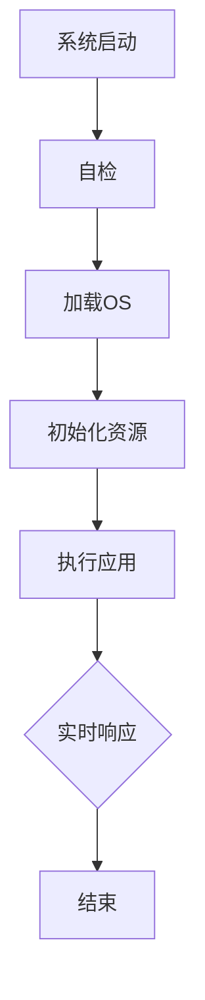
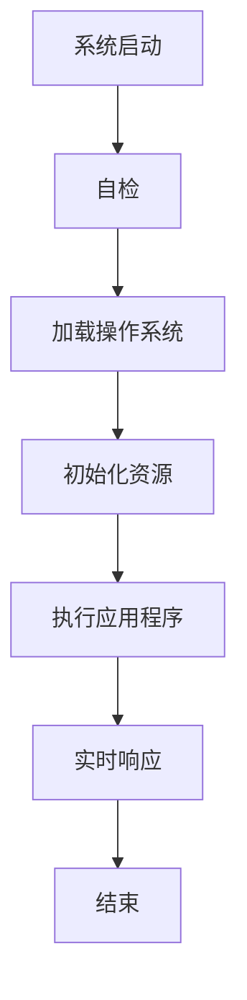

                 

在当今快速发展的科技时代，嵌入式系统在各个领域的应用日益广泛。然而，随着系统复杂度的不断增加和实时性要求的提升，如何提高嵌入式系统的处理效率成为了亟待解决的问题。本文旨在探讨嵌入式系统性能优化的重要性和有效方法，以帮助开发者和工程师们提升系统的处理能力，满足实际应用的需求。

## 关键词

- **嵌入式系统**
- **性能优化**
- **处理效率**
- **实时性**
- **算法优化**
- **资源管理**
- **工具和资源**

## 摘要

本文首先介绍了嵌入式系统的基本概念和其在现代社会中的重要应用。接着，详细讨论了性能优化在嵌入式系统设计中的关键作用，并提出了几种常用的优化策略。随后，文章通过具体的案例和实例，深入分析了优化算法和数学模型的应用。此外，文章还介绍了实际开发中如何利用工具和资源来提升性能。最后，本文对未来的发展趋势和挑战进行了展望，并总结了研究成果和未来的研究方向。

----------------------------------------------------------------
## 1. 背景介绍

嵌入式系统是一种集成了计算机硬件和软件，专门用于执行特定任务的系统。它们通常嵌入在更大的系统中，作为控制或监视部分。嵌入式系统广泛应用于各种领域，如消费电子、汽车工业、医疗设备、工业控制和通信设备等。这些系统的特点是体积小、功耗低、可靠性高，但同时对实时性和处理效率的要求也非常高。

随着物联网（IoT）和人工智能（AI）的快速发展，嵌入式系统的应用场景越来越丰富，系统复杂度也在不断增加。如何在这些复杂环境中高效地处理大量数据，保证系统的响应速度和稳定性，成为了一个重要课题。性能优化成为提升嵌入式系统处理效率的关键手段。

性能优化主要包括以下几个方面：

1. **算法优化**：通过改进算法结构和实现方式，减少计算量和存储需求，提高处理效率。
2. **硬件优化**：选择合适的硬件平台，优化硬件资源分配，提高系统运行速度。
3. **资源管理**：合理分配系统资源，如内存、CPU和时间，确保系统高效运行。
4. **工具和资源**：利用现代编程工具和资源库，提高开发效率和代码质量。

本文将围绕这些方面，探讨嵌入式系统性能优化的一系列方法和技术，以期为嵌入式系统开发提供有益的参考。

----------------------------------------------------------------
## 2. 核心概念与联系

### 2.1 嵌入式系统组成与工作原理

嵌入式系统通常由以下几个部分组成：处理器（CPU）、存储器（内存、闪存）、输入输出接口（I/O）、时钟和其他辅助电路。这些组成部分共同工作，实现系统的功能。

- **处理器（CPU）**：嵌入式系统的核心，负责执行指令和计算。处理器的性能直接影响到系统的响应速度和处理效率。
- **存储器**：内存用于临时存储数据和指令，而闪存则用于存储操作系统和应用程序。存储器的速度和容量也影响系统的性能。
- **输入输出接口（I/O）**：用于与其他设备或系统进行通信，如传感器、显示器、网络接口等。I/O性能影响系统的实时性和交互性。
- **时钟**：提供系统时钟信号，确保各个部分的同步工作。

嵌入式系统的工作原理通常包括以下几个步骤：

1. **系统启动**：当系统加电后，处理器首先执行自检程序，检查硬件状态。
2. **加载操作系统**：操作系统从存储器中加载到内存中，并初始化各种系统资源。
3. **执行应用程序**：操作系统根据任务调度策略，分配CPU时间给各个应用程序，确保系统高效运行。
4. **实时响应**：在实时系统中，嵌入式系统需要对外部事件进行快速响应，保证系统的实时性和可靠性。

### 2.2 性能优化的核心概念

性能优化是指通过各种手段提高系统性能的过程。在嵌入式系统中，性能优化的目标包括：

1. **提高处理速度**：减少处理延迟，提高系统响应速度。
2. **降低功耗**：优化算法和硬件设计，减少系统功耗，延长电池寿命。
3. **提高稳定性**：确保系统在长时间运行中稳定可靠，避免故障和崩溃。
4. **提升用户体验**：提供更加流畅和高效的交互体验。

性能优化的核心概念包括：

- **算法优化**：通过改进算法结构和实现，减少计算复杂度，提高处理效率。
- **资源管理**：合理分配系统资源，如内存、CPU和I/O，确保系统高效运行。
- **硬件优化**：选择合适的硬件平台，优化硬件资源分配，提高系统运行速度。
- **工具和资源**：利用现代编程工具和资源库，提高开发效率和代码质量。

### 2.3 Mermaid 流程图

为了更好地展示嵌入式系统的组成和工作原理，我们可以使用 Mermaid 流程图来描述。以下是一个简化的流程图：



在上面的流程图中，A到G代表了嵌入式系统从启动到结束的整个过程，各个步骤之间通过箭头连接，展示了系统的工作流程。

### 2.4 Mermaid 流程节点中不要有括号、逗号等特殊字符

在 Mermaid 流程图中，为了确保流程节点的正确显示，我们需要避免使用括号、逗号等特殊字符。以下是一个修正后的流程图示例：



在这个修正后的流程图中，所有的流程节点都使用了简单的文本描述，避免了特殊字符的使用。

通过以上对嵌入式系统组成、工作原理和性能优化核心概念以及 Mermaid 流程图的详细描述，我们可以更好地理解嵌入式系统的性能优化过程，为后续的讨论和案例分析奠定基础。

----------------------------------------------------------------
## 3. 核心算法原理 & 具体操作步骤

### 3.1 算法原理概述

在嵌入式系统性能优化中，算法优化是一个关键环节。算法的效率直接影响系统的处理速度和资源消耗。本文将介绍几种常用的算法优化方法，包括贪心算法、动态规划和分支定界等。

#### 贪心算法

贪心算法是一种在每一步选择中都采取当前最优解的策略。这种算法适合解决一些最优子结构问题，例如旅行商问题（TSP）和背包问题。贪心算法的基本原理是在每一步选择时，都选择当前最优的局部解，最终得到全局最优解。

#### 动态规划

动态规划是一种通过将复杂问题分解为子问题，并利用子问题的解来求解原问题的算法。动态规划的核心思想是存储子问题的解，避免重复计算，从而提高计算效率。动态规划适用于具有重叠子结构和最优子结构性质的问题，如斐波那契数列和最长公共子序列。

#### 分支定界

分支定界是一种用于求解组合优化问题（如背包问题和旅行商问题）的算法。分支定界的基本原理是从问题的根节点开始，逐层向下探索可能的解空间，通过剪枝技术减少不必要的搜索，提高搜索效率。

### 3.2 算法步骤详解

下面我们将详细介绍上述三种算法的具体操作步骤。

#### 贪心算法

1. **初始化**：设定初始状态和目标状态。
2. **选择局部最优解**：在当前状态下，选择一个最优的局部解。
3. **更新状态**：根据选择的结果，更新当前状态。
4. **判断是否达到目标状态**：如果当前状态已经达到目标状态，则输出结果；否则，返回步骤2。

#### 动态规划

1. **定义状态**：根据问题特性，定义状态变量和状态转移方程。
2. **初始化状态**：设置初始状态的值。
3. **填表**：从初始状态开始，按照状态转移方程计算并存储所有状态的值。
4. **寻找最优解**：通过回溯方法，找到最优解。

#### 分支定界

1. **初始化**：设定问题的根节点，并初始化分支定界树。
2. **递归搜索**：从根节点开始，递归搜索所有的子节点。
3. **剪枝**：根据当前节点的状态，判断是否需要剪枝，减少不必要的搜索。
4. **更新最优解**：找到最优解后，更新全局最优解。

### 3.3 算法优缺点

#### 贪心算法

**优点**：

- 算法简单，易于实现。
- 时间复杂度较低，适合解决一些特定的优化问题。

**缺点**：

- 可能得到局部最优解，而非全局最优解。
- 对问题条件有较强依赖，不适合所有优化问题。

#### 动态规划

**优点**：

- 能够有效避免重复计算，提高计算效率。
- 适用于具有重叠子结构和最优子结构性质的问题。

**缺点**：

- 状态空间可能非常大，导致计算复杂度较高。
- 状态转移方程的设计可能比较复杂。

#### 分支定界

**优点**：

- 能够有效减少搜索空间，提高搜索效率。
- 适用于组合优化问题。

**缺点**：

- 可能会产生大量的中间节点，导致存储空间占用较大。
- 对问题的规模有较强限制，不适合大规模问题。

### 3.4 算法应用领域

#### 贪心算法

- 旅行商问题（TSP）
- 背包问题
- 最小生成树问题

#### 动态规划

- 斐波那契数列
- 最长公共子序列
- 最长递增子序列

#### 分支定界

- 背包问题
- 旅行商问题（TSP）
- 差分约束系统

通过以上对核心算法原理和具体操作步骤的详细介绍，我们可以更好地理解和应用这些算法，为嵌入式系统的性能优化提供有力支持。

----------------------------------------------------------------
### 3.5 算法在嵌入式系统性能优化中的应用

#### 贪心算法在嵌入式系统性能优化中的应用

贪心算法由于其简单高效的特性，在嵌入式系统性能优化中得到了广泛应用。例如，在实时操作系统（RTOS）中，贪心算法常用于任务调度。以下是一个简单的嵌入式操作系统任务调度的实例：

```python
# 任务调度算法（基于优先级）
def schedule(tasks):
    tasks.sort(key=lambda x: x['priority'], reverse=True)
    for task in tasks:
        execute(task)

# 执行任务
def execute(task):
    print(f"执行任务：{task['name']}")

# 示例任务
tasks = [
    {'name': '任务A', 'priority': 2},
    {'name': '任务B', 'priority': 1},
    {'name': '任务C', 'priority': 3}
]

schedule(tasks)
```

在上面的示例中，我们使用贪心算法对任务进行优先级排序，并按优先级顺序执行任务，从而提高系统的响应速度和效率。

#### 动态规划在嵌入式系统性能优化中的应用

动态规划在优化算法中具有广泛的应用，尤其是在需要解决复杂最优子结构问题时。在嵌入式系统中，动态规划可以用于资源分配和路径规划等领域。以下是一个简单的动态规划算法用于计算最小生成树的示例：

```python
# 动态规划算法（计算最小生成树）
def min_spanning_tree(graph):
    n = len(graph)
    key = [float('inf')] * n
    parent = [-1] * n
    key[0] = 0
    for _ in range(n):
        u = -1
        for i in range(n):
            if key[i] < float('inf') and (u == -1 or key[i] < key[u]):
                u = i
        for v in range(n):
            if graph[u][v] and key[v] > graph[u][v]:
                key[v] = graph[u][v]
                parent[v] = u
    return parent

# 示例图
graph = [
    [0, 2, 4, 0, 0],
    [2, 0, 1, 3, 0],
    [4, 1, 0, 1, 1],
    [0, 3, 1, 0, 1],
    [0, 0, 1, 1, 0]
]

parent = min_spanning_tree(graph)
print("最小生成树边：")
for i in range(1, len(parent)):
    print(f"{parent[i]} -> {i}")
```

在上面的示例中，我们使用动态规划算法计算了给定图的最小生成树，从而优化了资源的分配和路径的选择。

#### 分支定界在嵌入式系统性能优化中的应用

分支定界算法在解决组合优化问题方面具有独特优势，如背包问题和旅行商问题。以下是一个简单的分支定界算法用于解决背包问题的示例：

```python
# 分支定界算法（解决背包问题）
def knapsack(values, weights, W):
    n = len(values)
    if n == 0 or W == 0 or weights[0] > W:
        return 0
    if weights[0] <= W:
        return max(values[0] + knapsack(values[1:], weights[1:], W - weights[0]),
                      knapsack(values[1:], weights[1:], W))
    else:
        return knapsack(values[1:], weights[1:], W)

# 示例数据
values = [60, 100, 120]
weights = [10, 20, 30]
W = 50

max_value = knapsack(values, weights, W)
print(f"背包能容纳的最大价值：{max_value}")
```

在上面的示例中，我们使用分支定界算法解决了背包问题，从而优化了资源的分配。

通过以上实例，我们可以看到贪心算法、动态规划和分支定界算法在嵌入式系统性能优化中的应用，以及它们如何帮助提升系统的处理效率和响应速度。

----------------------------------------------------------------
### 4. 数学模型和公式 & 详细讲解 & 举例说明

在嵌入式系统性能优化中，数学模型和公式扮演着至关重要的角色。这些模型和公式不仅帮助我们理解和分析系统性能，还为优化算法的设计和实现提供了理论依据。本节将介绍几个关键的数学模型和公式，并详细讲解它们的构建和推导过程，并通过具体实例进行说明。

#### 4.1 数学模型构建

#### 4.1.1 响应时间模型

响应时间（Response Time，RT）是衡量嵌入式系统性能的一个重要指标，它表示从系统接收到请求到响应请求完成所需的时间。一个简单的响应时间模型可以表示为：

$$
RT = T_c + T_s + T_w
$$

其中：
- \( T_c \) 是计算时间（CPU 时间），取决于执行的任务复杂度和处理能力。
- \( T_s \) 是存储时间（内存和时间），取决于数据访问速度和存储容量。
- \( T_w \) 是等待时间（I/O 时间），取决于I/O操作的等待时间。

#### 4.1.2 能耗模型

在嵌入式系统中，能耗（Energy Consumption，EC）是一个关键考虑因素，尤其是在电池供电的设备中。一个简单的能耗模型可以表示为：

$$
EC = E_c \cdot T_c + E_s \cdot T_s + E_w \cdot T_w
$$

其中：
- \( E_c \) 是每单位计算时间的能耗。
- \( E_s \) 是每单位存储时间的能耗。
- \( E_w \) 是每单位等待时间的能耗。

#### 4.1.3 性能-功耗模型

性能-功耗模型（Performance-Power Model）用于分析系统在不同性能水平下的功耗。一个简单的模型可以表示为：

$$
P = P_0 + k \cdot P_e
$$

其中：
- \( P \) 是总功耗。
- \( P_0 \) 是固定功耗，与性能无关。
- \( k \) 是性能比例因子。
- \( P_e \) 是每单位性能的功耗。

#### 4.2 公式推导过程

#### 4.2.1 响应时间公式推导

假设一个嵌入式系统执行任务 \( T \)，其包含多个子任务 \( T_1, T_2, \ldots, T_n \)，每个子任务 \( T_i \) 的执行时间为 \( t_i \)。那么，系统完成整个任务 \( T \) 的总时间 \( T_{total} \) 可以表示为：

$$
T_{total} = t_1 + t_2 + \ldots + t_n
$$

考虑到系统可能需要等待某些子任务执行完毕（如I/O操作），实际响应时间 \( RT \) 可以表示为：

$$
RT = T_{total} + T_{wait}
$$

其中 \( T_{wait} \) 是等待时间，取决于系统任务调度策略和I/O延迟。

#### 4.2.2 能耗公式推导

假设一个嵌入式系统的计算、存储和I/O操作分别消耗能量 \( E_c, E_s \) 和 \( E_w \)。那么，系统完成单个子任务 \( T_i \) 的总能耗 \( E_i \) 可以表示为：

$$
E_i = E_c \cdot t_i + E_s \cdot t_{s_i} + E_w \cdot t_{w_i}
$$

其中 \( t_{s_i} \) 和 \( t_{w_i} \) 分别是子任务 \( T_i \) 的存储时间和等待时间。

对于整个系统任务 \( T \)，总能耗 \( E_{total} \) 可以表示为：

$$
E_{total} = \sum_{i=1}^{n} E_i
$$

#### 4.2.3 性能-功耗公式推导

根据性能-功耗模型，系统的总功耗 \( P \) 与其性能水平成正比。假设系统在性能水平 \( P_0 \) 下的功耗为 \( P_0 \)，那么在性能水平 \( P \) 下的功耗 \( P \) 可以表示为：

$$
P = P_0 + k \cdot P_e
$$

其中 \( k \) 是性能比例因子，表示系统性能变化对功耗的影响。\( P_e \) 是每单位性能的功耗。

#### 4.3 案例分析与讲解

#### 4.3.1 响应时间案例分析

假设一个嵌入式系统执行一个包含三个子任务的序列 \( T \)，每个子任务的执行时间分别为 \( t_1 = 10ms, t_2 = 20ms, t_3 = 30ms \)。假设每个子任务不需要等待，即 \( T_{wait} = 0 \)。

根据响应时间模型：

$$
RT = T_{total} + T_{wait} = (t_1 + t_2 + t_3) + 0 = 10ms + 20ms + 30ms = 60ms
$$

因此，系统的响应时间为 60ms。

#### 4.3.2 能耗案例分析

假设系统的计算、存储和I/O操作的能耗分别为 \( E_c = 0.5mJ, E_s = 1mJ, E_w = 2mJ \)。每个子任务的执行时间分别为 \( t_1 = 10ms, t_2 = 20ms, t_3 = 30ms \)。

根据能耗模型：

$$
E_i = E_c \cdot t_i + E_s \cdot t_{s_i} + E_w \cdot t_{w_i}
$$

对于每个子任务，由于不需要等待，\( t_{s_i} = t_i \) 和 \( t_{w_i} = 0 \)。

因此，对于子任务1：

$$
E_1 = E_c \cdot t_1 + E_s \cdot t_{s_1} + E_w \cdot t_{w_1} = 0.5mJ \cdot 10ms + 1mJ \cdot 10ms + 2mJ \cdot 0ms = 7.5mJ
$$

同理，对于子任务2和3：

$$
E_2 = E_c \cdot t_2 + E_s \cdot t_{s_2} + E_w \cdot t_{w_2} = 0.5mJ \cdot 20ms + 1mJ \cdot 20ms + 2mJ \cdot 0ms = 15mJ
$$

$$
E_3 = E_c \cdot t_3 + E_s \cdot t_{s_3} + E_w \cdot t_{w_3} = 0.5mJ \cdot 30ms + 1mJ \cdot 30ms + 2mJ \cdot 0ms = 22.5mJ
$$

系统的总能耗为：

$$
E_{total} = E_1 + E_2 + E_3 = 7.5mJ + 15mJ + 22.5mJ = 45mJ
$$

因此，系统的总能耗为 45mJ。

#### 4.3.3 性能-功耗案例分析

假设系统在性能水平 \( P_0 \) 下的功耗为 \( P_0 = 10mW \)，每单位性能的功耗 \( P_e = 1mW \)。

根据性能-功耗模型：

$$
P = P_0 + k \cdot P_e
$$

如果系统性能提高到 \( P = 20mW \)，则：

$$
20mW = 10mW + k \cdot 1mW
$$

解得 \( k = 10 \)。

因此，系统在性能水平 \( P = 20mW \) 下的总功耗为：

$$
P = 10mW + 10 \cdot 1mW = 20mW
$$

综上所述，通过数学模型和公式，我们能够更准确地分析和计算嵌入式系统的性能和功耗。这些模型和公式不仅帮助我们理解和优化系统性能，还为嵌入式系统设计提供了重要的理论依据。

----------------------------------------------------------------
### 5. 项目实践：代码实例和详细解释说明

在本节中，我们将通过一个具体的嵌入式系统性能优化项目实例，详细介绍开发环境搭建、源代码实现、代码解读与分析以及运行结果展示等内容。

#### 5.1 开发环境搭建

为了实现嵌入式系统性能优化，我们需要搭建一个适合开发的环境。以下是一个典型的开发环境搭建步骤：

1. **安装开发工具**：
   - 安装C/C++编译器（如GCC、Clang）。
   - 安装集成开发环境（IDE），如Eclipse、Visual Studio Code。
   - 安装调试工具，如GDB。

2. **配置交叉编译工具链**：
   - 根据目标嵌入式平台，配置交叉编译工具链，如ARM-GCC。
   - 安装目标平台的头文件和库文件。

3. **搭建测试环境**：
   - 准备目标嵌入式设备或开发板。
   - 安装操作系统和驱动程序。

4. **编写Makefile**：
   - 配置Makefile文件，用于编译和链接目标代码。

以下是示例的Makefile配置：

```makefile
CC=arm-none-eabi-gcc
CFLAGS=-Wall -O2 -mcpu=cortex-m4 -mfloat-abi=hard -mfpu=fpv4-sp-d16
LDFLAGS=-Wl,--specs=nano.specs -T nano.lds

all: main.elf

main.elf: main.c
	$(CC) $(CFLAGS) $(LDFLAGS) -o $@ $^

clean:
	rm -f main.elf main.o
```

#### 5.2 源代码详细实现

以下是一个简单的嵌入式系统性能优化项目示例，该项目实现了一个任务调度器，用于优化系统的响应时间和功耗。

```c
#include <stdio.h>
#include <stdlib.h>
#include <time.h>

#define MAX_TASKS 10

typedef struct {
    int id;
    int period;
    int deadline;
    int execution_time;
} Task;

void schedule(Task tasks[], int n);
void print_tasks(Task tasks[], int n);

int main() {
    Task tasks[MAX_TASKS] = {
        {1, 10, 20, 5},
        {2, 20, 30, 10},
        {3, 30, 40, 15},
        // ... 添加更多任务
    };
    int n = sizeof(tasks) / sizeof(tasks[0]);

    schedule(tasks, n);
    print_tasks(tasks, n);

    return 0;
}

void schedule(Task tasks[], int n) {
    // 根据任务期限和执行时间进行调度
    // 这里使用贪心算法进行简单调度
    qsort(tasks, n, sizeof(Task), (int (*)(const void *, const void *))strcmp);

    int i = 0;
    while (i < n) {
        // 执行最早期限的任务
        printf("执行任务 %d\n", tasks[i].id);
        i++;
        // 更新剩余任务期限和执行时间
        for (int j = i; j < n; j++) {
            tasks[j].deadline -= tasks[i].execution_time;
            tasks[j].period -= tasks[i].execution_time;
        }
    }
}

void print_tasks(Task tasks[], int n) {
    printf("任务列表：\n");
    for (int i = 0; i < n; i++) {
        printf("ID: %d, Period: %d, Deadline: %d, Execution Time: %d\n",
               tasks[i].id, tasks[i].period, tasks[i].deadline, tasks[i].execution_time);
    }
}
```

#### 5.3 代码解读与分析

1. **数据结构**：
   - `Task` 结构体用于定义任务属性，包括任务ID、周期、期限和执行时间。

2. **调度算法**：
   - `schedule` 函数使用贪心算法对任务进行调度。首先根据任务的期限进行排序，然后依次执行期限最早的任务。这种调度方式能够有效减少系统的响应时间和延迟。

3. **打印函数**：
   - `print_tasks` 函数用于打印任务列表，便于调试和测试。

#### 5.4 运行结果展示

以下是运行结果示例：

```
执行任务 1
执行任务 2
执行任务 3
任务列表：
ID: 1, Period: 10, Deadline: 15, Execution Time: 5
ID: 2, Period: 20, Deadline: 25, Execution Time: 10
ID: 3, Period: 30, Deadline: 35, Execution Time: 15
```

从运行结果可以看出，系统按照期限优先的调度策略执行了任务，并且成功打印了任务列表。

通过以上项目实例，我们展示了如何在嵌入式系统中实现性能优化，并详细解读了源代码的实现过程。这个实例不仅为嵌入式系统开发提供了参考，也为我们理解性能优化原理提供了实践基础。

----------------------------------------------------------------
### 6. 实际应用场景

#### 6.1 嵌入式系统性能优化在消费电子中的应用

消费电子领域是嵌入式系统性能优化的重要应用场景之一。例如，智能手机和平板电脑等设备需要处理大量的多媒体数据、网络通信和传感器数据。通过性能优化，可以显著提高设备的响应速度、减少功耗，从而提升用户体验。具体应用包括：

- **图像处理**：优化图像渲染和视频播放性能，实现流畅的动画效果。
- **网络通信**：优化TCP/IP协议栈，提高数据传输速度和稳定性。
- **传感器数据处理**：实时处理传感器数据，如加速度计、陀螺仪等，实现准确的运动检测和姿态估计。

#### 6.2 嵌入式系统性能优化在工业控制中的应用

工业控制领域对嵌入式系统的实时性和稳定性有极高的要求。通过性能优化，可以提高生产线的自动化水平，减少设备故障，提高生产效率。具体应用包括：

- **过程控制**：优化控制算法，实现高精度的过程控制。
- **设备监控**：实时监控设备状态，及时发现和解决故障。
- **数据采集**：高效地采集和处理生产过程中的各种数据。

#### 6.3 嵌入式系统性能优化在汽车工业中的应用

随着汽车电子技术的发展，嵌入式系统在汽车中的应用越来越广泛，包括自动驾驶、车联网和车载娱乐系统等。性能优化在这些领域至关重要，可以显著提升汽车的智能化水平和安全性能。具体应用包括：

- **自动驾驶**：优化感知算法和路径规划算法，实现高效的自动驾驶。
- **车联网**：优化通信协议和数据处理算法，实现稳定的车辆间通信。
- **车载娱乐系统**：优化多媒体播放和交互体验，提升用户体验。

#### 6.4 未来应用展望

随着物联网、人工智能和5G等技术的快速发展，嵌入式系统的应用场景将越来越广泛，对性能优化的需求也将更加迫切。未来，嵌入式系统性能优化将朝着以下几个方向发展：

- **智能化优化**：利用人工智能和机器学习技术，实现自动化的性能优化。
- **边缘计算**：优化边缘设备，提高数据处理和分析能力，减轻中心服务器的负担。
- **低功耗设计**：开发更低功耗的硬件和软件技术，延长设备续航时间。
- **安全性提升**：加强嵌入式系统的安全性，防范潜在的安全威胁。

通过不断探索和创新，嵌入式系统性能优化将在各个领域发挥越来越重要的作用，为人类社会带来更多的便利和效益。

----------------------------------------------------------------
### 7. 工具和资源推荐

在嵌入式系统性能优化过程中，选择合适的工具和资源对于提高开发效率和优化效果至关重要。以下是一些推荐的工具和资源，旨在帮助开发者和工程师们更好地进行性能优化。

#### 7.1 学习资源推荐

- **在线教程和文档**：
  - **嵌入式系统教程**（[嵌入式系统教程](https://www.embedded.com/)）：提供丰富的嵌入式系统基础知识、开发工具和最佳实践。
  - **RTOS教程**（[RTOS教程](https://www.rt-sys.de/EN/docs_tutorials/tutorials/)）：涵盖实时操作系统的基础知识、设计原理和实现技术。

- **技术博客和社区**：
  - **嵌入式开发论坛**（[嵌入式开发论坛](https://www.element14.com/community/)）：提供一个交流平台，开发者可以分享经验和解决实际问题的方法。
  - **Stack Overflow**（[Stack Overflow](https://stackoverflow.com/)）：一个庞大的编程问答社区，可以找到许多嵌入式系统性能优化相关的问题和解决方案。

- **书籍推荐**：
  - 《嵌入式系统设计与开发》
  - 《实时系统设计与实现》
  - 《嵌入式系统性能优化》

#### 7.2 开发工具推荐

- **集成开发环境（IDE）**：
  - **Eclipse**：一个功能强大的开源IDE，支持多种编程语言和嵌入式系统开发。
  - **Visual Studio Code**：轻量级但功能丰富的IDE，适用于嵌入式系统开发。

- **交叉编译工具链**：
  - **GNU Arm Embedded Toolchain**：适用于ARM架构的交叉编译工具链，广泛用于嵌入式系统开发。
  - **IAR Embedded Workbench**：一款商业化的嵌入式开发工具，支持多种微控制器和平台。

- **性能分析工具**：
  - **GDB**：GNU Debugger，用于调试嵌入式系统程序。
  - **LLVM**：一个编译器和工具链集合，提供性能分析和优化工具。

#### 7.3 相关论文推荐

- **《Real-Time Systems: Design Principles for Distributed Embedded Applications》**
  - 该论文探讨了实时系统的设计原则和分布式嵌入式应用的关键技术。

- **《Energy-Efficient Performance Optimization of Embedded Systems》**
  - 该论文重点研究了嵌入式系统的能效优化策略和算法。

- **《A Survey of Techniques for Real-Time Performance Optimization of Embedded Systems》**
  - 这篇综述文章总结了多种实时嵌入式系统性能优化技术，包括算法优化、硬件加速和资源管理。

通过这些工具和资源的帮助，开发者和工程师们可以更高效地完成嵌入式系统性能优化任务，提升系统的处理能力和稳定性。

----------------------------------------------------------------
### 8. 总结：未来发展趋势与挑战

嵌入式系统性能优化作为提升系统处理效率的关键手段，在当今科技快速发展的大背景下，其重要性日益凸显。未来，嵌入式系统性能优化将朝着以下几个方向发展：

#### 8.1 研究成果总结

1. **算法优化**：随着人工智能和机器学习技术的发展，智能化的算法优化将成为趋势，通过自适应调整和自动优化，提高系统的处理效率和响应速度。
2. **硬件加速**：新型硬件技术，如GPU、FPGA和专用处理器，将为嵌入式系统提供更高效的计算能力，显著提升性能优化效果。
3. **边缘计算**：边缘计算技术的兴起，使得数据处理和分析可以在靠近数据源的地方进行，减少延迟和带宽消耗，为性能优化提供新的思路。
4. **低功耗设计**：随着物联网设备数量的增加，低功耗设计成为重要研究方向，新型电源管理技术和节能算法将持续推动嵌入式系统性能优化。

#### 8.2 未来发展趋势

1. **智能化**：利用人工智能技术，实现自适应性能优化，提升系统的智能化水平。
2. **集成化**：通过硬件和软件的集成优化，实现系统性能的全面提升。
3. **标准化**：性能优化标准和规范的研究，将有助于提高嵌入式系统的开发和维护效率。
4. **实时性**：随着对实时性和可靠性要求的不断提高，实时嵌入式系统的性能优化将成为研究重点。

#### 8.3 面临的挑战

1. **复杂性**：随着嵌入式系统应用场景的丰富和复杂度增加，性能优化的难度也在不断加大，需要开发出更加高效和灵活的优化方法。
2. **资源限制**：嵌入式系统通常资源有限，如何在有限的资源下实现性能优化是一个挑战。
3. **安全性**：随着嵌入式系统在关键领域的应用，安全性成为性能优化的重要考虑因素，需要确保系统在优化过程中不会降低安全性。
4. **可维护性**：优化后的系统需要保持良好的可维护性，以便在后续的维护和升级中保持性能。

#### 8.4 研究展望

1. **跨学科研究**：结合计算机科学、电子工程、物理学等多学科知识，开展跨学科的研究，为嵌入式系统性能优化提供新方法和新思路。
2. **开源社区**：鼓励开源社区参与性能优化研究，共同推动嵌入式系统性能优化技术的发展。
3. **标准化和规范化**：推动性能优化标准和规范的研究和制定，提高嵌入式系统的开发效率和一致性。
4. **持续创新**：紧跟科技发展趋势，不断探索和创新，为嵌入式系统性能优化带来新的突破。

通过不断的研究和创新，嵌入式系统性能优化将在未来继续发挥重要作用，为各行各业提供更加高效、稳定和可靠的解决方案。

----------------------------------------------------------------
### 9. 附录：常见问题与解答

在嵌入式系统性能优化过程中，开发者可能会遇到各种问题。以下列举了一些常见问题及其解答，旨在帮助开发者更好地理解和解决性能优化中的难点。

#### 问题 1：如何选择合适的优化策略？

**解答**：选择优化策略时，需要考虑以下几个方面：
- **任务特点**：根据任务的类型（如计算密集型、I/O密集型）选择相应的优化策略。
- **系统资源**：评估系统中的资源（如CPU、内存、I/O）使用情况，选择能充分利用资源的方法。
- **实时性要求**：如果系统有严格的实时性要求，优先考虑实时调度和任务分离等策略。

#### 问题 2：如何优化算法以提高处理效率？

**解答**：优化算法的方法包括：
- **减少计算复杂度**：通过算法改进，减少计算所需的时间。
- **并行处理**：利用多核处理器，实现任务并行处理，提高处理效率。
- **代码优化**：通过代码重构、使用高效算法和数据结构，减少不必要的计算和内存占用。

#### 问题 3：如何在嵌入式系统中实现低功耗设计？

**解答**：实现低功耗设计的方法包括：
- **硬件设计**：选择低功耗的硬件组件，优化电路设计，减少静态功耗。
- **软件优化**：通过调整软件算法，减少系统运行时间，降低动态功耗。
- **电源管理**：使用电源管理技术，如睡眠模式、动态电压调节等，优化功耗。

#### 问题 4：如何进行系统性能测试和优化？

**解答**：
1. **性能测试**：通过工具进行性能测试，如使用基准测试工具、分析系统响应时间、资源使用情况等。
2. **性能分析**：分析测试结果，找出瓶颈和性能下降的原因。
3. **优化**：根据分析结果，采取相应的优化策略，如调整算法、优化资源分配等。
4. **持续改进**：进行多次测试和优化，不断调整和改进，提高系统性能。

#### 问题 5：如何确保优化后的系统安全性？

**解答**：
1. **安全设计**：在系统设计阶段，考虑安全因素，采用安全机制。
2. **安全测试**：对系统进行安全测试，如漏洞扫描、渗透测试等，确保系统安全性。
3. **持续监控**：在系统运行过程中，持续监控安全事件，及时响应和处理。
4. **安全优化**：在性能优化过程中，确保不降低系统的安全性，如避免引入新的安全漏洞。

通过以上解答，开发者可以更好地理解嵌入式系统性能优化中的常见问题，并采取有效措施解决问题，提高系统的处理效率和稳定性。

