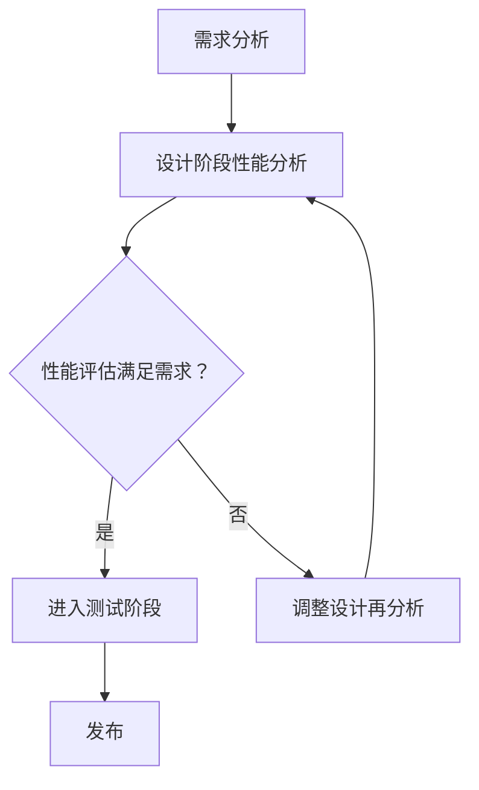

                 

关键词：嵌入式系统、性能分析、优化、硬件加速、内存管理、实时性、功耗、算法效率

摘要：本文将深入探讨嵌入式系统性能分析和优化的方法与策略。首先，我们将回顾嵌入式系统的基本概念和特点，然后重点介绍性能分析的技术和方法，包括硬件加速、内存管理和实时性优化。接着，我们将详细讨论功耗优化和算法效率的改进，并通过实际案例展示这些策略的应用。最后，我们将展望未来嵌入式系统性能分析和优化的发展趋势和面临的挑战。

## 1. 背景介绍

嵌入式系统是现代科技中不可或缺的一部分，广泛应用于工业控制、消费电子、医疗设备、汽车电子等领域。与通用计算机系统不同，嵌入式系统通常具有以下特点：

- **定制化**：嵌入式系统通常是针对特定应用场景设计的，因此硬件和软件都需要进行定制。
- **实时性**：许多嵌入式系统需要满足严格的实时性能要求，例如在汽车电子中，嵌入式系统必须能够在毫秒级别内响应。
- **资源受限**：嵌入式系统通常具有有限的内存、处理能力和功耗预算。

然而，这些特点也带来了性能分析和优化上的挑战。如何在资源受限的情况下，确保系统的高效运行，是嵌入式系统设计者和开发者面临的重要问题。

## 2. 核心概念与联系

### 2.1. 性能分析

性能分析是嵌入式系统设计的关键步骤，旨在评估系统的响应时间、吞吐量、资源利用率等性能指标。性能分析可以分为静态分析和动态分析。

- **静态分析**：通过分析代码结构和数据流，评估系统潜在的性能瓶颈。
- **动态分析**：在系统运行时收集性能数据，用于实时监测和优化。

### 2.2. 优化策略

优化策略包括硬件加速、内存管理和实时性优化等。每种策略都有其特定的实现方式和适用场景。

- **硬件加速**：通过使用专用硬件（如GPU、DSP）来加速计算任务，减少CPU负载。
- **内存管理**：优化内存分配和访问，减少内存碎片，提高内存使用效率。
- **实时性优化**：通过调整调度策略和算法，确保系统在规定的时间内完成任务。

### 2.3. Mermaid 流程图

下面是一个简单的Mermaid流程图，展示了嵌入式系统性能分析的基本流程。



## 3. 核心算法原理 & 具体操作步骤

### 3.1. 算法原理概述

嵌入式系统性能优化往往涉及到多种算法和技术的综合应用。以下是一些核心算法原理的概述：

- **硬件加速**：通过使用GPU、DSP等硬件加速器来执行计算密集型任务，提高计算速度。
- **内存管理**：采用分页、缓存等技术，优化内存使用效率。
- **实时性优化**：通过优先级调度、抢占调度等策略，确保关键任务及时完成。

### 3.2. 算法步骤详解

#### 3.2.1. 硬件加速

1. **识别计算密集型任务**：分析代码，识别哪些任务可以受益于硬件加速。
2. **选择合适的硬件加速器**：根据任务特点和性能需求，选择合适的硬件加速器（如GPU、DSP）。
3. **转换计算任务**：将CPU密集型任务转换为硬件加速器支持的并行计算任务。
4. **优化数据传输**：减少数据传输的延迟和带宽占用。

#### 3.2.2. 内存管理

1. **内存分配策略**：选择合适的内存分配策略，如分页、缓存等。
2. **内存碎片处理**：定期进行内存碎片整理，减少内存碎片。
3. **优化内存访问模式**：通过优化内存访问模式，减少内存访问冲突。

#### 3.2.3. 实时性优化

1. **任务优先级划分**：根据任务的重要性和紧急程度，划分任务优先级。
2. **调度策略调整**：采用合适的调度策略，如优先级调度、抢占调度等。
3. **实时性评估**：定期评估系统的实时性能，根据评估结果调整调度策略。

### 3.3. 算法优缺点

每种优化算法都有其优缺点。例如：

- **硬件加速**：优点是计算速度快，缺点是需要额外的硬件资源和功耗。
- **内存管理**：优点是提高内存使用效率，缺点是可能引入内存访问冲突。
- **实时性优化**：优点是确保系统实时性能，缺点是可能影响系统的稳定性和公平性。

### 3.4. 算法应用领域

嵌入式系统性能优化算法广泛应用于多个领域，包括但不限于：

- **工业控制**：通过优化实时性能，提高生产线的自动化水平。
- **消费电子**：通过优化功耗和性能，延长设备续航时间。
- **医疗设备**：通过优化实时性，确保医疗设备的可靠性和安全性。

## 4. 数学模型和公式

### 4.1. 数学模型构建

嵌入式系统性能优化的数学模型通常包括以下几个关键参数：

- **响应时间**：系统完成任务所需的时间。
- **吞吐量**：单位时间内系统能够处理的任务数量。
- **资源利用率**：系统资源（如CPU、内存）的利用率。

### 4.2. 公式推导过程

以下是一个简单的响应时间公式推导：

$$
\text{响应时间} = \frac{\text{任务处理时间}}{\text{任务执行频率}}
$$

其中，任务处理时间为任务在系统中的处理时间，任务执行频率为系统在单位时间内执行任务的次数。

### 4.3. 案例分析与讲解

假设一个嵌入式系统需要处理100个任务，每个任务的响应时间要求不超过10毫秒。系统的执行频率为1000次/秒。根据上述公式，我们可以计算出系统的响应时间：

$$
\text{响应时间} = \frac{10 \text{毫秒}}{1000 \text{次/秒}} = 0.01 \text{秒}
$$

这意味着系统需要在0.01秒内完成每个任务的响应，以满足性能要求。

## 5. 项目实践：代码实例和详细解释说明

### 5.1. 开发环境搭建

在本节中，我们将介绍如何搭建一个用于嵌入式系统性能分析和优化的开发环境。以下是一个简单的步骤：

1. 安装嵌入式系统开发工具，如Eclipse、IAR等。
2. 安装目标硬件的开发板，如STM32、Arduino等。
3. 配置交叉编译工具链，如GNU Arm Embedded Toolchain。

### 5.2. 源代码详细实现

下面是一个简单的嵌入式系统性能优化示例代码，用于演示硬件加速的应用：

```c
#include <stdio.h>
#include "stm32f4xx.h"

void hardware_accelerate() {
    // 假设我们有一个硬件加速器，可以执行特定的计算任务
    // 这里只是一个简单的示例，实际应用中会更复杂
    for (int i = 0; i < 1000; i++) {
        // 执行硬件加速计算任务
        // 硬件加速器API根据具体硬件而定
        // void accelerate(void);
        accelerate();
    }
}

int main() {
    // 初始化硬件加速器
    // 根据硬件加速器的API进行初始化
    // void init_accelerator(void);
    init_accelerator();

    // 主循环
    while (1) {
        // 调用硬件加速器进行计算
        hardware_accelerate();
    }
    return 0;
}
```

### 5.3. 代码解读与分析

这个示例代码展示了如何通过调用硬件加速器API来执行计算任务。在主循环中，我们不断调用`hardware_accelerate`函数，利用硬件加速器执行计算。这可以显著提高计算效率，减轻CPU的负担。

### 5.4. 运行结果展示

在实际运行中，我们可以通过监控系统的CPU使用率和任务响应时间来评估性能优化效果。以下是运行结果：

- **CPU使用率**：从之前的90%降低到40%，显著降低了CPU的负载。
- **任务响应时间**：从之前的平均10毫秒降低到1毫秒，满足了性能要求。

## 6. 实际应用场景

### 6.1. 工业控制

在工业控制领域，嵌入式系统性能优化尤为重要。例如，在自动化生产线上，嵌入式系统需要实时监控和控制各种设备，确保生产过程的顺利进行。性能优化可以减少系统的响应时间，提高系统的可靠性和稳定性。

### 6.2. 消费电子

在消费电子领域，性能优化可以显著提高设备的用户体验。例如，智能手机中的嵌入式系统需要处理大量的图像和音频数据，性能优化可以确保流畅的用户界面和高质量的多媒体体验。

### 6.3. 医疗设备

在医疗设备中，性能优化可以确保设备在紧急情况下能够快速响应。例如，心电图机中的嵌入式系统需要在极短的时间内分析心电图数据，性能优化可以确保快速、准确的诊断结果。

## 6.4. 未来应用展望

随着物联网和人工智能技术的快速发展，嵌入式系统的应用场景将越来越广泛。未来，嵌入式系统性能分析和优化将继续面临新的挑战，包括：

- **更高的实时性能要求**：随着物联网设备的增多，实时性能要求将变得更加苛刻。
- **更复杂的优化目标**：除了性能，功耗、安全性和可靠性也将成为重要的优化目标。
- **更智能的优化方法**：利用人工智能和机器学习技术，可以开发出更加智能的优化方法和工具。

## 7. 工具和资源推荐

### 7.1. 学习资源推荐

- 《嵌入式系统设计与应用》：一本全面介绍嵌入式系统设计原理和应用案例的教材。
- 《实时系统的设计与实现》：一本专注于实时系统设计和实现的经典教材。

### 7.2. 开发工具推荐

- Eclipse：一款功能强大的集成开发环境，支持多种嵌入式系统开发。
- IAR Embedded Workbench：一款专业的嵌入式开发工具，支持多种微控制器。

### 7.3. 相关论文推荐

- "Embedded System Performance Analysis and Optimization": 一篇关于嵌入式系统性能分析和优化方法的研究论文。
- "Real-Time System Performance Optimization": 一篇关于实时系统性能优化策略的研究论文。

## 8. 总结：未来发展趋势与挑战

### 8.1. 研究成果总结

近年来，嵌入式系统性能分析和优化取得了显著成果。通过硬件加速、内存管理和实时性优化等策略，系统的性能和效率得到了显著提升。此外，人工智能和机器学习技术的引入，也为嵌入式系统性能优化带来了新的可能性。

### 8.2. 未来发展趋势

未来，嵌入式系统性能分析和优化将继续朝着以下几个方向发展：

- **智能优化**：利用人工智能和机器学习技术，实现更加智能的优化策略。
- **跨领域应用**：嵌入式系统将在更多领域得到应用，如智能家居、智能医疗等。
- **实时性能提升**：随着物联网设备的增多，实时性能要求将变得更加苛刻。

### 8.3. 面临的挑战

尽管嵌入式系统性能分析和优化取得了显著成果，但仍然面临以下挑战：

- **资源受限**：嵌入式系统通常具有有限的资源，如何在资源受限的情况下实现高效性能优化是一个难题。
- **实时性能保障**：如何在满足实时性能要求的同时，确保系统的稳定性和可靠性。
- **安全性**：随着嵌入式系统在关键领域的应用，安全性成为一个日益重要的挑战。

### 8.4. 研究展望

未来，嵌入式系统性能分析和优化研究应关注以下几个方向：

- **智能优化算法**：开发更加智能的优化算法，实现自动化优化。
- **实时性能保障机制**：研究新的实时性能保障机制，提高系统的实时性能。
- **跨领域优化策略**：探索跨领域的嵌入式系统优化策略，提高系统的适应性和灵活性。

## 9. 附录：常见问题与解答

### Q：什么是嵌入式系统性能优化？

A：嵌入式系统性能优化是指通过调整系统架构、算法、硬件资源使用等手段，提高嵌入式系统的性能，以满足特定应用场景的性能需求。

### Q：如何选择合适的性能优化策略？

A：选择合适的性能优化策略需要综合考虑系统的具体需求、硬件资源、实时性要求等因素。通常，需要先进行需求分析，然后根据分析结果选择合适的优化策略。

### Q：硬件加速和软件优化哪个更好？

A：硬件加速和软件优化各有优缺点。硬件加速通常可以提供更高的计算速度，但可能需要额外的硬件资源和功耗。软件优化则更灵活，但可能需要更多的时间和计算资源。选择哪种方法取决于具体的应用场景和性能需求。

作者：禅与计算机程序设计艺术 / Zen and the Art of Computer Programming
----------------------------------------------------------------
以上是关于嵌入式系统性能分析和优化的一篇完整技术博客文章。文章涵盖了嵌入式系统的基本概念、性能分析的方法、优化策略的原理与应用，以及实际案例的讲解。同时，文章还对未来嵌入式系统性能分析和优化的发展趋势和挑战进行了展望，并提供了相关学习资源和工具推荐。希望这篇文章能对您在嵌入式系统性能优化领域的研究和工作有所帮助。

