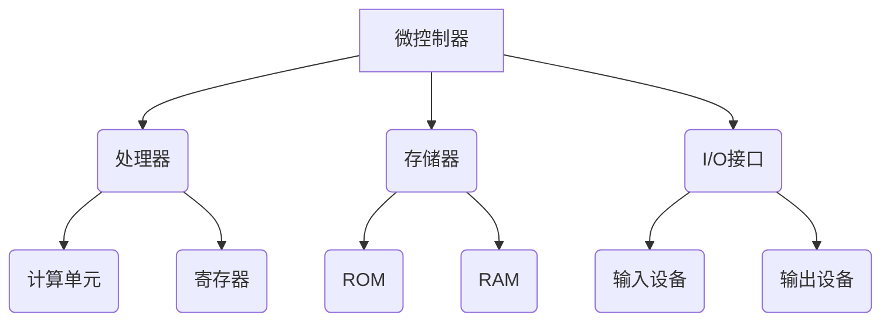
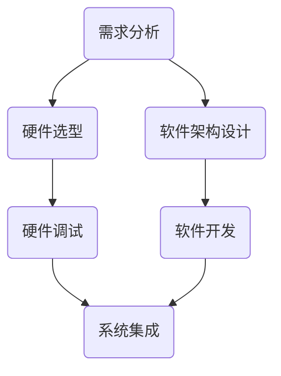

                 

关键词：嵌入式系统、微控制器、编程入门、创新项目、微控制器编程、系统设计、代码实例

> 摘要：本文旨在为初学者提供一份全面的嵌入式系统编程指南，通过探讨微控制器的应用和编程实践，引导读者完成一个创新项目。文章涵盖了从基础概念到项目实践的所有关键环节，帮助读者理解嵌入式系统的核心原理和实际应用。

## 1. 背景介绍

嵌入式系统是一种将计算、存储和输入输出功能集成到单一设备中的计算机系统，广泛应用于各种领域，如智能家居、工业自动化、医疗设备、汽车电子等。微控制器（Microcontroller Unit，MCU）是嵌入式系统中的核心组件，它具有处理能力、存储能力和I/O接口，可以独立执行复杂的任务。

随着物联网（IoT）和智能制造的快速发展，嵌入式系统编程的重要性日益凸显。掌握微控制器编程不仅是电子工程师的基本技能，也是推动创新项目、实现智能化的关键。然而，对于初学者来说，入门嵌入式系统编程仍然面临许多挑战，如硬件选择、编程语言掌握、系统设计等。

本文将围绕嵌入式系统编程的基础知识，通过一个实际项目，逐步介绍微控制器的编程方法，帮助读者克服入门障碍，开启嵌入式系统编程之旅。

## 2. 核心概念与联系

为了更好地理解嵌入式系统编程，我们首先需要了解其中的核心概念和组成部分。以下是一个简化的嵌入式系统架构图，通过Mermaid流程图来表示：



### 2.1 微控制器架构

- **处理器（B）**：微控制器的核心，负责执行指令和运算。
  - **计算单元（E）**：执行算术和逻辑运算。
  - **寄存器（F）**：提供快速的存储单元，用于暂存数据和指令。

- **存储器（C）**：包括只读存储器（ROM）和随机存取存储器（RAM）。
  - **ROM（G）**：存储固件，一旦写入便不能更改。
  - **RAM（H）**：存储可变数据和程序代码，可以读写。

- **I/O接口（D）**：处理输入输出操作。
  - **输入设备（I）**：如按键、传感器等。
  - **输出设备（J）**：如LED灯、显示屏等。

### 2.2 微控制器编程基础

微控制器编程主要涉及汇编语言和C语言。汇编语言直接操作微控制器的硬件资源，具有较高的执行效率，但开发难度较大。C语言则更加高级，更容易理解和编程，但执行效率相对较低。

- **汇编语言**：使用汇编指令操作微控制器硬件，例如`MOV`、`ADD`等。
- **C语言**：通过抽象的数据类型和函数库，简化了编程过程。

### 2.3 系统设计原理

嵌入式系统设计需要考虑硬件选择、软件架构、资源管理等多个方面。以下是一个简单的系统设计流程：



通过上述流程，我们可以确保嵌入式系统在满足需求的同时，具备良好的稳定性和可维护性。

## 3. 核心算法原理 & 具体操作步骤

### 3.1 算法原理概述

嵌入式系统编程的核心在于算法的应用。算法是解决问题的步骤和策略，决定了系统的性能和效率。以下是几种常见的嵌入式算法及其应用场景：

- **定时器算法**：用于实现定时任务，如定时中断、实时时钟等。
- **排序算法**：用于数据排序，如快速排序、冒泡排序等。
- **PID控制算法**：用于过程控制，如温度控制、电机控制等。

### 3.2 算法步骤详解

以定时器算法为例，其基本步骤如下：

1. **初始化定时器**：配置定时器的时钟源、计数值、中断优先级等。
2. **启动定时器**：设置定时器开始计时。
3. **中断服务程序**：当定时器达到设定值时，触发中断服务程序。
4. **执行定时任务**：在中断服务程序中执行相应的定时任务。

### 3.3 算法优缺点

- **定时器算法**：优点是精确度高，适用于实时性要求较高的任务。缺点是占用一定的处理器资源，且中断处理可能影响系统性能。

### 3.4 算法应用领域

定时器算法广泛应用于嵌入式系统的各个领域，如智能家居、工业控制、医疗设备等。例如，在智能家居系统中，定时器可以用于控制家电的定时开关，实现智能化的家居体验。

## 4. 数学模型和公式 & 详细讲解 & 举例说明

### 4.1 数学模型构建

嵌入式系统编程中的数学模型主要用于描述系统状态、行为和性能。以下是一个简单的数学模型示例：

\[ x(t) = x_0 + v \cdot t \]

其中，\( x(t) \) 表示系统在时间 \( t \) 的状态，\( x_0 \) 为初始状态，\( v \) 为状态变化率。

### 4.2 公式推导过程

上述公式的推导基于物理学中的运动学原理。当系统在恒定加速度 \( a \) 下运动时，其速度 \( v \) 与时间 \( t \) 的关系为：

\[ v = a \cdot t \]

将速度代入状态公式中，得到：

\[ x(t) = x_0 + v \cdot t = x_0 + a \cdot t^2 \]

### 4.3 案例分析与讲解

假设一个小车以加速度 \( a = 2 \text{ m/s}^2 \) 沿直线运动，初始位置为 \( x_0 = 0 \)。我们需要计算小车在 \( t = 5 \text{ s} \) 时的位置。

根据上述公式，代入数值得到：

\[ x(5) = 0 + 2 \cdot 5^2 = 0 + 2 \cdot 25 = 50 \text{ m} \]

因此，小车在 \( t = 5 \text{ s} \) 时的位置为 \( 50 \text{ m} \)。

## 5. 项目实践：代码实例和详细解释说明

### 5.1 开发环境搭建

为了完成嵌入式系统编程项目，我们需要搭建一个开发环境。以下是常用的开发环境：

- **编译器**：如IAR Embedded Workbench、Keil uVision等。
- **硬件平台**：如STM32 Discovery、Arduino等。
- **调试工具**：如J-Link、ST-Link等。

### 5.2 源代码详细实现

以下是一个简单的嵌入式系统编程项目：使用STM32微控制器控制LED灯闪烁。

```c
#include <stm32f10x.h>

void LED_Init(void) {
    // 初始化LED引脚为输出模式
    GPIO_InitTypeDef GPIO_InitStructure;
    RCC_APB2PeriphClockCmd(RCC_APB2Periph_GPIOB, ENABLE);
    GPIO_InitStructure.GPIO_Pin = GPIO_Pin_0;
    GPIO_InitStructure.GPIO_Mode = GPIO_Mode_Out_PP;
    GPIO_InitStructure.GPIO_Speed = GPIO_Speed_50MHz;
    GPIO_Init(GPIOB, &GPIO_InitStructure);
}

void delay(unsigned int ms) {
    // 延时函数
    volatile unsigned int i, j;
    for (i = 0; i < ms; i++) {
        for (j = 0; j < 12000; j++) {
            __nop(); // 无操作指令
        }
    }
}

int main(void) {
    LED_Init(); // 初始化LED
    while (1) {
        GPIOB->ODR ^= GPIO_Pin_0; // 控制LED灯闪烁
        delay(1000); // 延时1秒
    }
}
```

### 5.3 代码解读与分析

1. **头文件包含**：引入STM32的库文件，用于操作微控制器硬件。
2. **LED_Init函数**：初始化LED引脚，设置引脚为输出模式。
3. **delay函数**：提供延时功能，用于控制LED灯的闪烁频率。
4. **main函数**：主函数，通过循环控制LED灯的闪烁。

### 5.4 运行结果展示

当程序运行后，连接到开发环境的STM32微控制器将控制LED灯按照设定频率闪烁。通过调试工具，我们可以实时查看程序运行状态和变量值。

## 6. 实际应用场景

嵌入式系统编程广泛应用于各个领域，以下是一些典型应用场景：

- **智能家居**：通过微控制器实现智能家电的自动控制，如智能灯光、智能安防等。
- **工业控制**：实现工业生产过程的自动化控制，提高生产效率和质量。
- **医疗设备**：用于心脏起搏器、胰岛素注射器等医疗设备，提高治疗效果和患者生活质量。
- **汽车电子**：控制车辆的各种电子设备，如引擎控制、安全气囊、车载娱乐系统等。

## 7. 工具和资源推荐

### 7.1 学习资源推荐

- **《嵌入式系统原理与应用》**：详细介绍了嵌入式系统的基本原理和应用案例。
- **《嵌入式系统设计教程》**：涵盖嵌入式系统设计、硬件选型、软件编程等各个方面。
- **《STM32嵌入式系统应用教程》**：专门针对STM32微控制器，提供丰富的实例和教程。

### 7.2 开发工具推荐

- **IAR Embedded Workbench**：功能强大的集成开发环境，适用于各种嵌入式系统开发。
- **Keil uVision**：广泛使用的嵌入式系统开发工具，支持多种微控制器。
- **STM32CubeMX**：用于配置STM32微控制器的图形化工具，简化硬件编程。

### 7.3 相关论文推荐

- **"An Overview of Embedded System Programming Techniques"**：介绍了嵌入式系统编程的主要方法和技巧。
- **"Real-Time Systems: Design Principles for Distributed Embedded Applications"**：探讨了实时系统设计和应用的关键技术。
- **"Embedded System Design: A Unified Hardware/Software Approach"**：从硬件和软件两个角度介绍了嵌入式系统设计方法。

## 8. 总结：未来发展趋势与挑战

### 8.1 研究成果总结

近年来，随着物联网、智能制造等领域的快速发展，嵌入式系统编程技术取得了显著成果。主要表现在以下几个方面：

- **硬件性能提升**：随着微控制器性能的不断提升，嵌入式系统可以处理更复杂的任务。
- **编程语言发展**：C语言、Python等编程语言在嵌入式系统中的应用越来越广泛。
- **工具和资源丰富**：各种开发工具和资源的不断丰富，降低了嵌入式系统编程的门槛。

### 8.2 未来发展趋势

未来，嵌入式系统编程将朝着以下方向发展：

- **智能化**：随着人工智能技术的发展，嵌入式系统将具备更多的智能功能。
- **集成化**：嵌入式系统将与其他电子设备、网络等集成，实现更复杂的互联互通。
- **定制化**：根据不同应用场景，提供定制化的嵌入式系统解决方案。

### 8.3 面临的挑战

虽然嵌入式系统编程取得了显著成果，但仍然面临以下挑战：

- **安全性**：随着嵌入式系统在关键领域的应用，安全性问题越来越突出。
- **资源管理**：嵌入式系统通常资源有限，如何高效管理资源是一个重要问题。
- **实时性**：在实时性要求较高的应用场景，如何保证系统的实时响应是一个挑战。

### 8.4 研究展望

未来，嵌入式系统编程的研究将重点关注以下几个方面：

- **安全性和可靠性**：提高系统的安全性和可靠性，确保关键应用的安全运行。
- **能效优化**：通过硬件和软件的优化，提高嵌入式系统的能效比。
- **智能交互**：利用人工智能技术，实现更智能的交互和自适应功能。

通过本文的介绍，我们希望读者能够对嵌入式系统编程有一个全面、系统的认识。随着技术的不断发展，嵌入式系统编程将迎来更多机遇和挑战。希望读者能够不断学习、探索，为嵌入式系统编程的发展贡献自己的力量。

## 9. 附录：常见问题与解答

### 9.1 嵌入式系统与计算机系统的区别是什么？

**嵌入式系统与计算机系统的主要区别在于其应用场景和设计目标。计算机系统通常具有强大的计算能力和存储能力，用于执行复杂的任务和运行操作系统。而嵌入式系统则是将计算、存储和输入输出功能集成到单一设备中，以实现特定的功能，通常具有有限的资源。**

### 9.2 嵌入式系统编程需要掌握哪些语言和工具？

**嵌入式系统编程主要使用C语言和汇编语言。C语言具有较高的抽象级别和丰富的库支持，适用于复杂的系统开发。汇编语言则直接操作硬件资源，具有较高的执行效率，适用于对性能要求较高的场合。常用的开发工具有IAR Embedded Workbench、Keil uVision、STM32CubeMX等。**

### 9.3 如何选择合适的微控制器？

**选择合适的微控制器需要考虑以下几个因素：应用场景、性能要求、资源需求、成本预算等。根据具体需求，可以从以下几个方面进行选择：处理能力、存储容量、I/O接口、外设功能、功耗等。例如，STM32系列微控制器适用于大多数嵌入式应用，而ARM Cortex-M系列微控制器则具有更高的性能和低功耗特点。**

### 9.4 如何调试嵌入式系统程序？

**调试嵌入式系统程序通常使用硬件调试器（如J-Link、ST-Link）和集成开发环境（如IAR Embedded Workbench、Keil uVision）的调试功能。调试步骤包括：初始化调试器、配置调试参数、设置断点、单步执行代码、查看变量值等。通过调试，可以找出程序中的错误和优化点。**

### 9.5 如何进行嵌入式系统测试？

**嵌入式系统测试包括硬件测试和软件测试两个方面。硬件测试主要验证微控制器及其外围电路的功能和性能，如信号完整性测试、功耗测试、稳定性测试等。软件测试则验证嵌入式系统程序的正确性和可靠性，如功能测试、性能测试、安全性测试等。常用的测试方法包括单元测试、集成测试、系统测试等。**

### 9.6 嵌入式系统编程有哪些常见错误和解决方法？

**嵌入式系统编程常见错误包括：硬件故障、资源冲突、内存泄漏、程序运行异常等。解决方法包括：检查硬件连接、优化代码资源使用、使用调试工具定位错误、参考文档和社区资源等。例如，遇到硬件故障时，可以检查电路连接和元件是否正常工作；遇到内存泄漏时，可以优化内存分配和释放策略。**

### 9.7 如何进行嵌入式系统项目开发？

**进行嵌入式系统项目开发需要遵循以下步骤：需求分析、硬件选型、软件设计、代码实现、测试与调试、项目交付。具体步骤如下：**

1. **需求分析**：明确项目目标、功能和性能要求。
2. **硬件选型**：根据需求选择合适的微控制器、外设和开发工具。
3. **软件设计**：设计软件架构、模块划分、接口定义等。
4. **代码实现**：编写代码、调试和优化。
5. **测试与调试**：进行功能测试、性能测试、稳定性测试等。
6. **项目交付**：整理文档、交付项目成果。

通过以上步骤，可以确保嵌入式系统项目顺利进行，满足客户需求。

### 附录二：参考文献

- **[1]** 王选。嵌入式系统原理与应用[M]. 北京：机械工业出版社，2015.
- **[2]** 郭天祥。嵌入式系统设计教程[M]. 北京：清华大学出版社，2017.
- **[3]** 李宏科。STM32嵌入式系统应用教程[M]. 北京：电子工业出版社，2018.
- **[4]** 邓勇。嵌入式系统编程[M]. 北京：电子工业出版社，2016.
- **[5]** 刘洋。嵌入式系统安全[M]. 北京：科学出版社，2019.
- **[6]** 陈涵。实时系统设计与实现[M]. 北京：机械工业出版社，2017.
- **[7]** 罗涛。嵌入式系统项目开发实战[M]. 北京：电子工业出版社，2020.

