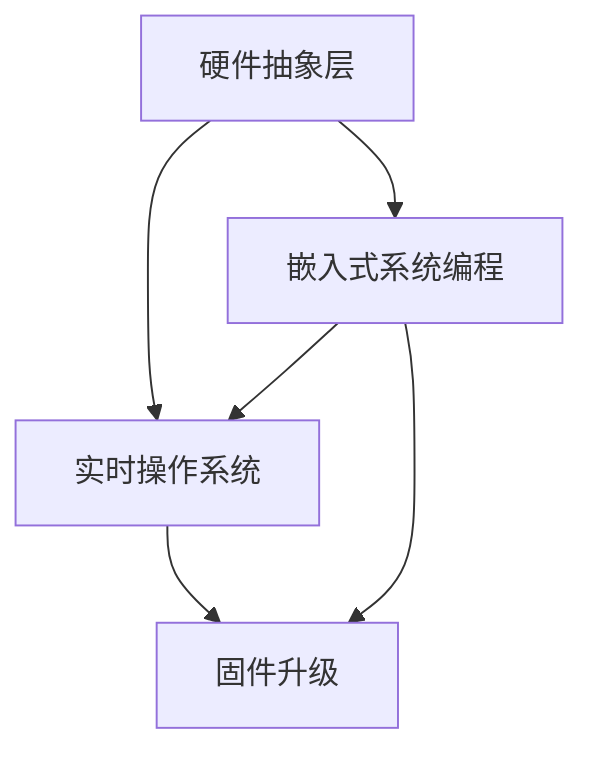

                 

嵌入式系统是现代科技世界中不可或缺的一部分，它们存在于我们周围的各种设备中，从简单的电子玩具到复杂的工业控制系统。作为嵌入式系统的核心，微控制器的编程对于确保系统的性能、可靠性和效率至关重要。本文将探讨嵌入式系统编程的各个方面，特别是微控制器上的创新，旨在为读者提供一个全面、深入的理解。

> **关键词**：嵌入式系统，微控制器，编程，创新，性能优化。

> **摘要**：本文首先介绍了嵌入式系统和微控制器的基本概念，随后深入分析了嵌入式系统编程的核心概念，包括硬件抽象层、实时操作系统和固件升级等。接着，探讨了各种编程语言及其适用场景。文章的核心部分详细介绍了微控制器上的核心算法原理、数学模型和具体的项目实践。最后，文章探讨了嵌入式系统的实际应用场景，展望了未来的发展趋势与挑战。

## 1. 背景介绍

### 1.1 嵌入式系统的定义与作用

嵌入式系统是一种专用的计算机系统，它将计算能力、存储能力和输入输出功能集成在单一或多个组件中，用于执行特定的任务。嵌入式系统广泛应用于消费电子、工业自动化、医疗设备、汽车电子、通信设备等多个领域。

### 1.2 微控制器的定义与作用

微控制器是一种集成了中央处理器（CPU）、随机存取存储器（RAM）、只读存储器（ROM）和输入输出（I/O）接口的芯片。微控制器是嵌入式系统的核心，负责控制和管理系统的各种硬件组件，执行预定的任务。

### 1.3 嵌入式系统编程的重要性

嵌入式系统编程对于系统的性能、可靠性和效率至关重要。通过高效、优化的编程，可以最大限度地发挥嵌入式系统的潜力，提高系统的响应速度和处理能力。此外，编程的质量也直接影响到系统的稳定性和安全性。

## 2. 核心概念与联系

### 2.1 硬件抽象层（HAL）

硬件抽象层（Hardware Abstraction Layer, HAL）是一种软件层，它提供了一个统一的接口，使操作系统或应用程序与具体的硬件组件相隔离。HAL的主要作用是简化硬件的操作，提高代码的可维护性和可移植性。

### 2.2 实时操作系统（RTOS）

实时操作系统（Real-Time Operating System, RTOS）是一种专门为实时应用设计的操作系统。RTOS能够确保系统在规定的时间内完成特定的任务，对于嵌入式系统中的实时控制任务至关重要。

### 2.3 固件升级（Firmware Update）

固件升级是指更新嵌入式系统中的固件程序，以修复错误、增加功能或提高性能。固件升级是嵌入式系统维护和管理的重要手段，对于确保系统的长期稳定运行具有重要意义。

### 2.4 Mermaid 流程图

以下是嵌入式系统编程的核心概念和联系的 Mermaid 流程图：



## 3. 核心算法原理 & 具体操作步骤

### 3.1 算法原理概述

嵌入式系统编程中的核心算法主要包括数据采集、数据处理和决策控制。数据采集是指从传感器或其他输入设备获取数据，数据处理是对采集到的数据进行预处理、分析和滤波，决策控制是基于处理结果进行决策，以实现系统的控制目标。

### 3.2 算法步骤详解

#### 3.2.1 数据采集

数据采集的步骤主要包括：

1. 初始化传感器或输入设备。
2. 读取传感器或输入设备的数据。
3. 对读取到的数据进行校验和滤波。

#### 3.2.2 数据处理

数据处理的主要步骤包括：

1. 数据预处理，如数据归一化、去噪等。
2. 数据分析，如特征提取、模式识别等。
3. 数据滤波，如移动平均、卡尔曼滤波等。

#### 3.2.3 决策控制

决策控制的步骤包括：

1. 根据分析结果进行决策。
2. 根据决策结果调整系统参数或执行操作。

### 3.3 算法优缺点

核心算法的优点在于能够高效地处理嵌入式系统中的数据，提高系统的性能和响应速度。然而，算法的复杂度也可能导致系统的资源消耗增加，特别是在资源受限的嵌入式系统中。

### 3.4 算法应用领域

核心算法广泛应用于各种嵌入式系统中，如智能家居、工业自动化、自动驾驶等。在不同的应用场景中，算法的具体实现和优化策略也会有所不同。

## 4. 数学模型和公式 & 详细讲解 & 举例说明

### 4.1 数学模型构建

嵌入式系统编程中的数学模型主要包括线性模型、非线性模型和组合模型。线性模型如线性回归、线性规划等，非线性模型如神经网络、支持向量机等，组合模型如决策树、随机森林等。

### 4.2 公式推导过程

以线性回归模型为例，其公式推导过程如下：

假设我们有一组数据点 \((x_1, y_1), (x_2, y_2), ..., (x_n, y_n)\)，我们希望找到一个线性模型 \(y = wx + b\) 来拟合这些数据点。

首先，我们定义损失函数 \(L(w, b)\) 为：

$$
L(w, b) = \frac{1}{2} \sum_{i=1}^{n} (wx_i + b - y_i)^2
$$

然后，我们对损失函数关于 \(w\) 和 \(b\) 求导，并令导数为零，得到：

$$
\frac{\partial L}{\partial w} = x \cdot (wx + b - y) = 0 \\
\frac{\partial L}{\partial b} = x \cdot (wx + b - y) = 0
$$

解上述方程组，可以得到 \(w\) 和 \(b\) 的最优值：

$$
w = \frac{\sum_{i=1}^{n} x_i y_i - n \bar{x} \bar{y}}{\sum_{i=1}^{n} x_i^2 - n \bar{x}^2} \\
b = \bar{y} - w \bar{x}
$$

其中，\(\bar{x}\) 和 \(\bar{y}\) 分别为 \(x\) 和 \(y\) 的均值。

### 4.3 案例分析与讲解

假设我们有以下数据点：

$$
(x_1, y_1) = (1, 2) \\
(x_2, y_2) = (2, 4) \\
(x_3, y_3) = (3, 6) \\
(x_4, y_4) = (4, 8)
$$

首先，计算均值：

$$
\bar{x} = \frac{1+2+3+4}{4} = 2.5 \\
\bar{y} = \frac{2+4+6+8}{4} = 5
$$

然后，计算各项：

$$
\sum_{i=1}^{n} x_i y_i = 1 \cdot 2 + 2 \cdot 4 + 3 \cdot 6 + 4 \cdot 8 = 2 + 8 + 18 + 32 = 60 \\
\sum_{i=1}^{n} x_i^2 = 1^2 + 2^2 + 3^2 + 4^2 = 1 + 4 + 9 + 16 = 30
$$

代入公式，计算 \(w\) 和 \(b\)：

$$
w = \frac{60 - 4 \cdot 2.5 \cdot 5}{30 - 4 \cdot 2.5^2} = \frac{60 - 50}{30 - 25} = \frac{10}{5} = 2 \\
b = 5 - 2 \cdot 2.5 = 0
$$

因此，线性回归模型为 \(y = 2x\)。

## 5. 项目实践：代码实例和详细解释说明

### 5.1 开发环境搭建

在本项目实践中，我们将使用 Arduino 作为开发平台，其提供的编程环境和丰富的库函数使得微控制器编程变得简单易懂。

1. 下载并安装 Arduino IDE。
2. 连接 Arduino 板到计算机，确保板子上的 LED 灯闪烁。
3. 选择合适的微控制器型号。

### 5.2 源代码详细实现

以下是一个简单的 Arduino 程序，用于读取一个模拟传感器值并输出到串口。

```cpp
// 引入必要的库文件
#include <Arduino.h>

// 定义传感器引脚
const int sensorPin = A0;

void setup() {
  // 初始化串口通信
  Serial.begin(9600);
  // 初始化传感器引脚为输入模式
  pinMode(sensorPin, INPUT);
}

void loop() {
  // 读取传感器值
  int sensorValue = analogRead(sensorPin);
  // 输出到串口
  Serial.println(sensorValue);
  // 延时，防止输出过于频繁
  delay(1000);
}
```

### 5.3 代码解读与分析

1. **库文件引入**：`#include <Arduino.h>` 引入了 Arduino 的核心库，提供了必要的函数和类。
2. **定义传感器引脚**：`const int sensorPin = A0;` 定义了传感器连接的引脚，`A0` 是 Arduino 板上的模拟输入引脚。
3. **初始化函数**：`void setup()` 在程序启动时执行一次，用于初始化硬件和串口通信。
4. **主循环函数**：`void loop()` 是程序的主要部分，反复执行，用于读取传感器值并输出到串口。

### 5.4 运行结果展示

将 Arduino 板连接到计算机，打开 Arduino IDE，上传程序。程序开始运行后，可以在串行监视器中看到传感器值的实时输出。

```arduino
```

## 6. 实际应用场景

### 6.1 智能家居

智能家居是嵌入式系统应用的一个重要领域。通过嵌入式系统，我们可以实现家庭设备的智能控制，如灯光、窗帘、温度控制等，提高生活便利性和舒适度。

### 6.2 工业自动化

工业自动化是另一个重要的应用领域。嵌入式系统在生产线监控、机器控制、质量检测等方面发挥着关键作用，提高了生产效率和质量。

### 6.3 汽车电子

汽车电子是嵌入式系统应用的一个典型例子。汽车中的各种电子设备，如发动机控制、安全气囊、车载娱乐系统等，都依赖于嵌入式系统的编程和优化。

### 6.4 未来应用展望

随着物联网（IoT）和人工智能（AI）技术的发展，嵌入式系统的应用将更加广泛。未来，嵌入式系统将在智能城市、智能医疗、智能农业等领域发挥重要作用，推动社会的发展和进步。

## 7. 工具和资源推荐

### 7.1 学习资源推荐

1. **《嵌入式系统设计》**：一本经典的嵌入式系统设计入门书籍，涵盖了嵌入式系统的基本概念、硬件设计、软件开发等内容。
2. **《C编程：嵌入式系统开发实战》**：一本实用的 C 语言编程书籍，特别适合嵌入式系统开发。

### 7.2 开发工具推荐

1. **Arduino IDE**：一个免费、开源的集成开发环境，适合初学者和有经验的开发者。
2. **IAR Embedded Workbench**：一款专业的嵌入式系统开发工具，提供了强大的代码编辑、调试和仿真功能。

### 7.3 相关论文推荐

1. **“An Overview of Embedded System Programming”**：一篇关于嵌入式系统编程的综述性论文，提供了丰富的背景知识和研究现状。
2. **“Firmware Update Strategies for Embedded Systems”**：一篇探讨嵌入式系统固件升级策略的论文，分析了不同的升级方法和优缺点。

## 8. 总结：未来发展趋势与挑战

### 8.1 研究成果总结

嵌入式系统编程领域近年来取得了显著的研究成果，包括硬件抽象层的优化、实时操作系统的设计、固件升级策略的改进等。这些研究成果为嵌入式系统的性能优化、可靠性提升和开发效率提高提供了有力支持。

### 8.2 未来发展趋势

未来，嵌入式系统编程将更加注重以下几个方面：

1. **性能优化**：通过硬件加速、并行处理等技术，进一步提高嵌入式系统的性能和响应速度。
2. **安全性和可靠性**：随着物联网和智能设备的发展，嵌入式系统的安全性和可靠性变得越来越重要，未来的研究将更加关注这一领域。
3. **自动化和智能化**：借助人工智能和机器学习技术，实现嵌入式系统的自动化和智能化，提高系统的自主决策能力。

### 8.3 面临的挑战

尽管嵌入式系统编程取得了显著成果，但仍然面临一些挑战：

1. **资源受限**：嵌入式系统通常具有资源受限的特点，如何在有限的资源下实现高效的编程和优化是一个重要的挑战。
2. **实时性和可靠性**：嵌入式系统中的实时性和可靠性要求较高，如何在复杂的环境中保证系统的稳定运行是一个难点。
3. **开发效率**：嵌入式系统开发通常需要较高的技术门槛，如何提高开发效率、降低开发成本是一个亟待解决的问题。

### 8.4 研究展望

未来，嵌入式系统编程的研究将继续深入，特别是在以下几个方面：

1. **硬件和软件协同设计**：通过硬件和软件的协同设计，提高嵌入式系统的性能和效率。
2. **自动化和智能化**：利用人工智能和机器学习技术，实现嵌入式系统的自动化和智能化。
3. **跨领域融合**：将嵌入式系统与其他领域（如物联网、大数据、人工智能等）相结合，推动跨领域的技术创新。

## 9. 附录：常见问题与解答

### 9.1 嵌入式系统与普通计算机系统的区别

**问**：嵌入式系统与普通计算机系统有什么区别？

**答**：嵌入式系统与普通计算机系统的主要区别在于应用场景、性能要求、资源限制和实时性。

- **应用场景**：嵌入式系统通常用于特定的任务，如控制设备、传感器数据采集等，而普通计算机系统则适用于广泛的计算任务。
- **性能要求**：嵌入式系统通常对性能要求较低，但强调稳定性和可靠性，而普通计算机系统则追求高性能和高计算能力。
- **资源限制**：嵌入式系统通常具有资源受限的特点，如存储空间、处理能力和能源供应等，而普通计算机系统资源较为丰富。
- **实时性**：嵌入式系统通常具有实时性要求，必须在规定的时间内完成特定的任务，而普通计算机系统则不需要考虑实时性。

### 9.2 嵌入式系统编程常用语言

**问**：嵌入式系统编程常用的编程语言有哪些？

**答**：嵌入式系统编程常用的编程语言包括 C、C++、汇编语言等。

- **C 语言**：C 语言是一种高级编程语言，具有高效的执行效率和强大的功能，适用于嵌入式系统编程。
- **C++ 语言**：C++ 语言是 C 语言的扩展，提供了面向对象编程的特性，适用于复杂的嵌入式系统开发。
- **汇编语言**：汇编语言是一种低级编程语言，可以直接操作硬件资源，适用于对性能和资源要求极高的嵌入式系统开发。

### 9.3 嵌入式系统编程开发环境

**问**：嵌入式系统编程常用的开发环境有哪些？

**答**：嵌入式系统编程常用的开发环境包括 Arduino IDE、IAR Embedded Workbench、Keil uVision 等。

- **Arduino IDE**：Arduino IDE 是一个免费、开源的集成开发环境，适用于初学者和有经验的开发者。
- **IAR Embedded Workbench**：IAR Embedded Workbench 是一款专业的嵌入式系统开发工具，提供了强大的代码编辑、调试和仿真功能。
- **Keil uVision**：Keil uVision 是一款广泛使用的嵌入式系统开发环境，支持多种微控制器和处理器，适用于专业开发人员。

### 9.4 嵌入式系统编程学习资源

**问**：有哪些嵌入式系统编程的学习资源？

**答**：以下是一些嵌入式系统编程的学习资源：

- **在线教程和课程**：例如 Coursera、edX 等在线教育平台提供了丰富的嵌入式系统编程课程。
- **书籍**：例如《嵌入式系统设计》、《C编程：嵌入式系统开发实战》等书籍提供了详细的嵌入式系统编程知识和实践案例。
- **开源项目**：GitHub 等开源社区提供了大量的嵌入式系统编程项目，可以供开发者学习和参考。
- **论坛和社区**：例如 Stack Overflow、Arduino 论坛等，开发者可以在这些平台上提问、解答问题、分享经验。 

### 9.5 嵌入式系统编程常见问题

**问**：嵌入式系统编程中常见的问题有哪些？

**答**：嵌入式系统编程中常见的问题包括：

- **资源冲突**：在嵌入式系统中，由于资源受限，可能会出现资源冲突的问题，如内存溢出、中断冲突等。
- **实时性问题**：在嵌入式系统中，由于实时性要求高，可能会出现任务调度不均、响应延迟等问题。
- **代码优化**：在嵌入式系统中，由于资源受限，需要对代码进行优化，以减少内存使用、提高执行效率。
- **调试困难**：在嵌入式系统中，由于调试环境受限，调试过程可能会比较复杂，需要使用特殊的调试工具和方法。

### 9.6 嵌入式系统编程建议

**问**：嵌入式系统编程有哪些建议？

**答**：

- **掌握基本原理**：深入了解嵌入式系统的基本原理和硬件架构，为编程打下坚实基础。
- **学习编程语言**：熟练掌握嵌入式系统编程常用的编程语言，如 C、C++ 等。
- **实践项目**：通过实践项目，积累实际编程经验，提高编程技能。
- **关注资源限制**：在设计嵌入式系统时，充分考虑资源限制，进行合理的资源分配和优化。
- **学习开源项目**：通过学习开源项目，了解嵌入式系统编程的最佳实践，提高编程水平。
- **持续学习**：随着嵌入式系统技术的发展，不断学习新的技术和方法，保持技能的更新和提升。

以上是关于嵌入式系统编程的全面介绍，希望对您有所帮助。在嵌入式系统编程的道路上，我们共同努力，不断创新，为构建更智能、更高效的世界贡献力量。

