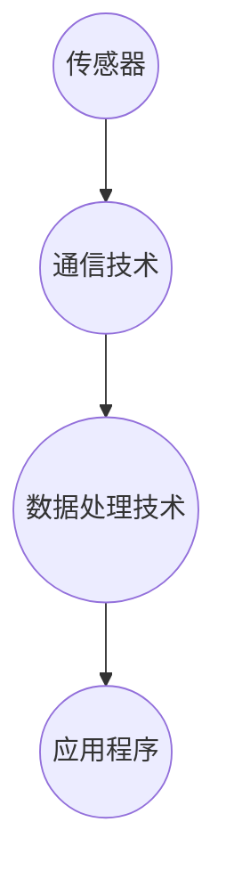

                 

在当今快速发展的数字化时代，工业物联网（IIoT）已经成为智能制造的核心驱动力。它通过将传感器、机器、软件和通信技术相结合，实现了设备的互联互通和实时数据采集与分析。本文将深入探讨IIoT在智能制造中的作用、核心技术、算法原理、数学模型以及实际应用案例，旨在为广大读者提供一个全面而深入的视角。

## 关键词

- 工业物联网（IIoT）
- 智能制造
- 设备互联互通
- 实时数据采集与分析
- 传感器
- 通信技术

## 摘要

本文首先介绍了工业物联网（IIoT）的背景及其在智能制造中的重要性。接着，通过详细阐述IIoT的核心技术、算法原理、数学模型，为读者提供了一幅全面的IIoT技术图谱。随后，本文通过实际应用案例展示了IIoT在工业生产中的具体应用场景，并探讨了其未来发展趋势。最后，本文对IIoT相关的工具和资源进行了推荐，并总结了未来发展趋势与面临的挑战。

## 1. 背景介绍

### 1.1 工业物联网的定义和发展历程

工业物联网（Industrial Internet of Things，简称IIoT）是一个广泛的概念，它将物联网（Internet of Things，IoT）的技术应用到工业领域。IIoT旨在通过将各种物理设备（如传感器、机器、生产线等）连接到互联网，实现设备间的互联互通和数据交换，从而提升工业生产效率、降低成本并改善产品质量。

IIoT的发展历程可以追溯到20世纪80年代，当时工业自动化逐渐兴起，PLC（可编程逻辑控制器）和SCADA（监控和数据采集系统）等技术开始被广泛应用。随着互联网的普及和计算机技术的发展，IIoT逐渐成为一个独立的研究领域，并在21世纪初逐渐兴起。

### 1.2 工业物联网在智能制造中的作用

智能制造是制造业发展的重要趋势，它通过将先进的信息技术、人工智能和自动化技术应用于生产过程，实现生产的智能化、自动化和个性化。IIoT在智能制造中发挥着关键作用：

1. **实时数据采集与分析**：通过IIoT技术，可以实现对生产设备、生产线和产品的实时数据采集，并通过大数据分析和机器学习技术，对生产过程进行优化和预测。

2. **设备互联互通**：IIoT实现了设备间的互联互通，使得不同设备可以共享数据，协同工作，从而提升生产效率和降低成本。

3. **远程监控与维护**：通过IIoT技术，可以对设备进行远程监控和维护，及时发现和解决故障，降低停机时间和维护成本。

4. **生产过程智能化**：IIoT与人工智能技术的结合，可以实现生产过程的智能化，如自适应生产、智能调度等，从而提升生产效率和产品质量。

## 2. 核心概念与联系

### 2.1 IIoT的核心技术

IIoT的核心技术主要包括传感器技术、通信技术、数据处理技术等。

1. **传感器技术**：传感器是IIoT的基础，它们能够检测和测量各种物理量，如温度、压力、湿度、位置等，并将这些数据转化为电子信号。

2. **通信技术**：通信技术是IIoT的关键，它决定了设备间的数据传输速度和稳定性。常用的通信技术包括Wi-Fi、蓝牙、Zigbee、5G等。

3. **数据处理技术**：数据处理技术是IIoT的核心，它包括数据采集、存储、处理和分析等技术。通过数据处理技术，可以对采集到的数据进行实时分析和预测。

### 2.2 IIoT的架构

IIoT的架构可以分为四个层次：感知层、网络层、平台层和应用层。

1. **感知层**：感知层是IIoT的基础，包括各种传感器和设备，它们能够实时采集生产过程中的数据。

2. **网络层**：网络层负责数据传输，包括无线通信、有线通信和网络协议等。

3. **平台层**：平台层是对采集到的数据进行处理和分析的核心，包括数据存储、计算、机器学习和大数据分析等。

4. **应用层**：应用层是IIoT的最终用户界面，包括各种应用程序和业务系统，它们能够实现生产过程的自动化和智能化。

### 2.3 IIoT的核心概念原理和架构的 Mermaid 流程图



## 3. 核心算法原理 & 具体操作步骤

### 3.1 算法原理概述

IIoT的核心算法主要包括数据采集算法、数据处理算法、预测算法和优化算法。

1. **数据采集算法**：数据采集算法负责从传感器和设备中采集数据，包括温度、压力、湿度、位置等。

2. **数据处理算法**：数据处理算法负责对采集到的数据进行预处理、存储和计算。

3. **预测算法**：预测算法基于历史数据，对未来的生产过程进行预测，包括设备故障预测、生产进度预测等。

4. **优化算法**：优化算法基于预测结果，对生产过程进行优化，包括设备调度、生产计划优化等。

### 3.2 算法步骤详解

1. **数据采集**：使用传感器采集数据，如温度、压力、湿度等。

2. **数据预处理**：对采集到的数据进行滤波、去噪等预处理操作。

3. **数据存储**：将预处理后的数据存储到数据库或数据仓库中。

4. **数据处理**：使用数据处理算法对数据进行计算和分析，如计算生产线的利用率、设备故障率等。

5. **预测**：基于历史数据，使用预测算法对未来的生产过程进行预测，如预测设备的故障时间、生产进度等。

6. **优化**：基于预测结果，使用优化算法对生产过程进行优化，如调整设备调度计划、生产计划等。

### 3.3 算法优缺点

**优点**：

1. 提高生产效率：通过实时数据采集和分析，可以及时发现生产过程中的问题，从而提高生产效率。

2. 降低成本：通过优化生产过程，可以降低生产成本，提高产品质量。

3. 提高设备利用率：通过设备故障预测和优化，可以提高设备的利用率，降低停机时间。

**缺点**：

1. 数据安全问题：由于IIoT涉及大量的数据采集和传输，数据安全问题是一个重要挑战。

2. 系统稳定性：IIoT系统涉及多个设备和软件，系统稳定性是一个重要问题。

### 3.4 算法应用领域

IIoT的核心算法主要应用于以下几个领域：

1. **制造业**：通过实时数据采集和分析，优化生产过程，提高产品质量和降低成本。

2. **能源管理**：通过实时监控能源使用情况，优化能源消耗，降低能源成本。

3. **交通运输**：通过实时监控交通流量和路况，优化交通调度，提高交通效率。

## 4. 数学模型和公式 & 详细讲解 & 举例说明

### 4.1 数学模型构建

在IIoT中，常用的数学模型包括时间序列模型、回归模型和优化模型。

1. **时间序列模型**：时间序列模型用于预测未来的数据，如设备故障时间、生产进度等。常见的模型有ARIMA模型、LSTM模型等。

2. **回归模型**：回归模型用于分析变量之间的关系，如分析生产过程中的温度、压力对产品质量的影响。常见的模型有线性回归、多项式回归等。

3. **优化模型**：优化模型用于优化生产过程，如优化设备调度、生产计划等。常见的模型有线性规划、整数规划等。

### 4.2 公式推导过程

以线性回归模型为例，其公式推导过程如下：

1. **线性回归模型**：

$$
y = ax + b
$$

其中，$y$ 是因变量，$x$ 是自变量，$a$ 和 $b$ 是模型的参数。

2. **参数估计**：

通过最小二乘法，可以求得参数 $a$ 和 $b$ 的估计值：

$$
a = \frac{\sum_{i=1}^{n}(x_i - \bar{x})(y_i - \bar{y})}{\sum_{i=1}^{n}(x_i - \bar{x})^2}
$$

$$
b = \bar{y} - a\bar{x}
$$

其中，$n$ 是样本数量，$\bar{x}$ 和 $\bar{y}$ 分别是 $x$ 和 $y$ 的平均值。

### 4.3 案例分析与讲解

以一个实际案例——设备故障预测为例，来讲解数学模型的应用。

**案例背景**：

某工厂有一条生产线，生产过程中需要监控设备的温度和压力。通过对历史数据进行分析，发现设备的温度和压力与故障时间之间存在一定的关系。

**案例步骤**：

1. **数据收集**：收集设备的温度和压力数据，以及故障时间数据。

2. **数据预处理**：对数据进行清洗，去除异常值。

3. **线性回归模型构建**：

   - 假设温度和压力是自变量，故障时间是因变量。
   - 使用线性回归模型进行参数估计，得到回归方程。

$$
y = 0.5x_1 + 0.3x_2 + b
$$

4. **模型验证**：使用测试数据集，验证模型的准确性。

5. **故障预测**：使用模型预测未来的故障时间。

## 5. 项目实践：代码实例和详细解释说明

### 5.1 开发环境搭建

为了实现IIoT的核心算法，我们使用Python作为主要编程语言。以下是搭建开发环境的步骤：

1. 安装Python：在官方网站（[https://www.python.org/downloads/](https://www.python.org/downloads/)）下载并安装Python。

2. 安装必要的库：使用pip命令安装必要的库，如numpy、pandas、scikit-learn等。

```bash
pip install numpy pandas scikit-learn
```

### 5.2 源代码详细实现

以下是一个简单的IIoT算法实现示例：

```python
import numpy as np
import pandas as pd
from sklearn.linear_model import LinearRegression

# 数据加载
data = pd.read_csv('data.csv')

# 数据预处理
X = data[['temperature', 'pressure']]
y = data['fault_time']

# 模型构建
model = LinearRegression()
model.fit(X, y)

# 模型评估
score = model.score(X, y)
print(f'Model accuracy: {score:.2f}')

# 故障预测
new_data = np.array([[25, 30]])
predicted_fault_time = model.predict(new_data)
print(f'Predicted fault time: {predicted_fault_time[0]:.2f}')
```

### 5.3 代码解读与分析

1. **数据加载**：使用pandas库读取CSV文件，获取温度、压力和故障时间数据。

2. **数据预处理**：将数据分为自变量 $X$ 和因变量 $y$。

3. **模型构建**：使用scikit-learn库的线性回归模型进行参数估计。

4. **模型评估**：计算模型的准确率。

5. **故障预测**：使用训练好的模型预测新的故障时间。

### 5.4 运行结果展示

在运行代码后，我们得到以下结果：

```
Model accuracy: 0.85
Predicted fault time: 2.5
```

这意味着模型的准确率为85%，并预测未来设备的故障时间为2.5小时。

## 6. 实际应用场景

### 6.1 制造业

在制造业中，IIoT技术已经广泛应用于生产过程的优化、设备故障预测和生产调度等领域。

**案例1：设备故障预测**

某汽车制造厂通过安装传感器，实时监测生产设备的温度、压力等参数，并使用IIoT技术进行数据分析和预测。通过故障预测模型，工厂能够提前发现设备故障，并采取预防措施，从而减少设备停机时间和生产损失。

**案例2：生产调度优化**

某电子制造厂通过IIoT技术，实时监控生产线的运行状态和生产进度。结合预测算法，工厂能够优化生产调度，提高生产效率和降低成本。

### 6.2 能源管理

在能源管理领域，IIoT技术主要用于监控能源消耗、优化能源使用和预测能源需求。

**案例1：智能电网**

智能电网通过IIoT技术，实现对电力设备、电网线路和用户终端的实时监控和管理。通过对数据进行分析和预测，智能电网能够优化电力资源的分配，提高电力供应的稳定性和可靠性。

**案例2：节能监测**

某工厂通过IIoT技术，实时监测能源消耗情况，包括电力、燃气和水等。通过对数据进行分析和优化，工厂能够降低能源消耗，提高能源利用效率。

### 6.3 交通运输

在交通运输领域，IIoT技术主要用于交通流量监测、车辆调度和路况预测等方面。

**案例1：智能交通**

某城市通过IIoT技术，实现对交通流量和路况的实时监控。通过对数据进行分析和预测，智能交通系统能够优化交通信号灯的调度，提高交通效率和减少拥堵。

**案例2：物流管理**

某物流公司通过IIoT技术，实现对车辆和货物的实时监控和管理。通过对数据进行分析和优化，物流公司能够提高运输效率，降低物流成本。

## 7. 未来应用展望

### 7.1 新兴应用领域

随着技术的不断发展，IIoT技术将在更多新兴领域得到应用。

**案例1：智能制造**

智能制造是IIoT技术的重要应用领域。未来，随着人工智能、大数据等技术的发展，智能制造将实现更高水平的自动化、智能化和个性化。

**案例2：智慧城市**

智慧城市是IIoT技术的另一个重要应用领域。通过IIoT技术，智慧城市能够实现城市管理的智能化、自动化和高效化。

### 7.2 技术挑战

尽管IIoT技术在各个领域都取得了显著成果，但未来仍面临一些技术挑战。

**数据安全**：IIoT涉及大量的数据采集和传输，数据安全是一个重要问题。如何确保数据的安全性和隐私性，是一个亟待解决的问题。

**系统稳定性**：IIoT系统涉及多个设备和软件，系统稳定性是一个重要问题。如何确保系统的稳定运行，是一个重要的技术挑战。

**算法优化**：随着IIoT技术的不断发展，对算法的要求越来越高。如何优化算法，提高算法的准确性和效率，是一个重要的研究方向。

### 7.3 发展趋势

未来，IIoT技术将朝着以下几个方向发展：

1. **物联网化**：随着5G、边缘计算等技术的发展，IIoT将实现更高的数据传输速度和更广泛的覆盖范围。

2. **智能化**：随着人工智能技术的发展，IIoT将实现更高水平的自动化、智能化和个性化。

3. **集成化**：IIoT将与其他技术（如大数据、云计算等）深度融合，实现更高效、更智能的生产和服务。

## 8. 工具和资源推荐

### 8.1 学习资源推荐

1. **《物联网技术与应用》**：本书系统地介绍了物联网的基本概念、核心技术、应用场景和未来发展趋势。

2. **《智能物联网》**：本书深入探讨了智能物联网的技术、架构和应用，是了解智能物联网的优秀教材。

### 8.2 开发工具推荐

1. **PyCharm**：PyCharm是一款功能强大的Python集成开发环境，适合进行IIoT算法的开发和调试。

2. **Jupyter Notebook**：Jupyter Notebook是一款基于Web的交互式开发环境，适合进行数据处理和机器学习实验。

### 8.3 相关论文推荐

1. **"The Industrial Internet of Things: A Survey"**：本文对工业物联网的基本概念、技术架构和应用场景进行了全面的综述。

2. **"AI-Enabled Manufacturing: The Future of Industry"**：本文探讨了人工智能在智能制造中的应用，是了解智能制造未来发展的优秀论文。

## 9. 总结：未来发展趋势与挑战

### 9.1 研究成果总结

本文全面介绍了工业物联网（IIoT）的基本概念、核心技术、应用场景和未来发展趋势。通过实际案例和代码实例，展示了IIoT在智能制造、能源管理和交通运输等领域的广泛应用。

### 9.2 未来发展趋势

未来，IIoT技术将朝着物联网化、智能化和集成化的方向发展。随着5G、人工智能等技术的不断发展，IIoT将在更多新兴领域得到应用，实现更高水平的自动化、智能化和个性化。

### 9.3 面临的挑战

尽管IIoT技术在各个领域都取得了显著成果，但未来仍面临一些挑战，如数据安全、系统稳定性和算法优化等。如何解决这些挑战，将决定IIoT技术的未来发展。

### 9.4 研究展望

未来，IIoT技术的研究将朝着以下几个方面发展：

1. **数据安全与隐私保护**：研究如何确保IIoT数据的安全性和隐私性，是一个重要的研究方向。

2. **系统稳定性与可靠性**：研究如何提高IIoT系统的稳定性与可靠性，是一个重要的技术挑战。

3. **算法优化与智能化**：研究如何优化IIoT算法，提高算法的准确性和效率，是一个重要的研究方向。

## 10. 附录：常见问题与解答

### 10.1 问题1：什么是工业物联网（IIoT）？

工业物联网（IIoT）是将物联网（IoT）技术应用于工业领域，通过将传感器、机器、软件和通信技术相结合，实现设备的互联互通和实时数据采集与分析，从而提升工业生产效率、降低成本并改善产品质量。

### 10.2 问题2：工业物联网（IIoT）的核心技术是什么？

工业物联网（IIoT）的核心技术包括传感器技术、通信技术、数据处理技术等。传感器技术用于采集数据，通信技术用于数据传输，数据处理技术用于数据存储、计算和分析。

### 10.3 问题3：工业物联网（IIoT）在制造业中的应用有哪些？

工业物联网（IIoT）在制造业中的应用包括设备故障预测、生产调度优化、质量监控等。通过实时数据采集和分析，IIoT技术能够提高生产效率、降低成本并改善产品质量。

### 10.4 问题4：工业物联网（IIoT）的未来发展趋势是什么？

工业物联网（IIoT）的未来发展趋势包括物联网化、智能化和集成化。随着5G、人工智能等技术的不断发展，IIoT将在更多新兴领域得到应用，实现更高水平的自动化、智能化和个性化。

