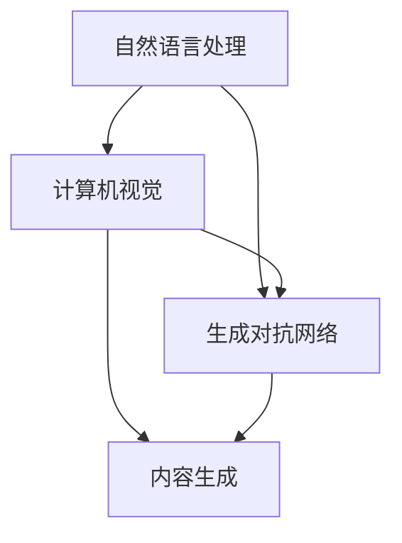

                 

本文将深入探讨工业级AIGC（AI-Generated Content）应用开发的各个方面。AIGC是一种由人工智能驱动的自动化内容生成技术，已经在多个行业中展现出了巨大的潜力。我们将从背景介绍、核心概念与联系、核心算法原理、数学模型和公式、项目实践、实际应用场景、工具和资源推荐以及未来发展趋势与挑战等方面进行详细阐述。

## 关键词

- AIGC
- 工业级应用
- 自动化内容生成
- 人工智能
- 自然语言处理
- 计算机视觉

## 摘要

本文旨在探讨AIGC技术在工业级应用开发中的潜力与实践。通过对AIGC的核心概念、算法原理、数学模型以及实际项目实践的深入分析，本文将为读者提供一个全面的AIGC应用开发指南。同时，本文也将探讨AIGC在实际应用场景中的优势和未来发展趋势，为读者提供有价值的研究方向和实践建议。

### 1. 背景介绍

AIGC的概念最早可以追溯到20世纪90年代，随着互联网和计算技术的快速发展，AIGC技术逐渐得到了广泛关注和应用。AIGC技术主要通过人工智能算法，尤其是自然语言处理和计算机视觉技术，实现自动化内容生成。这些内容可以包括文本、图像、视频等多种形式。

工业级AIGC应用的开发不仅仅是技术问题，更是对行业需求深刻理解和应对的挑战。随着数字化转型的加速，工业领域对自动化、智能化的需求日益增长。AIGC技术为这些需求提供了强有力的支持，帮助企业提高效率、降低成本、优化流程。

### 2. 核心概念与联系

#### 2.1 核心概念

AIGC的核心概念包括自然语言处理（NLP）、计算机视觉（CV）和生成对抗网络（GAN）等。这些技术共同构成了AIGC的基础。

- 自然语言处理（NLP）：NLP是AIGC技术中最为关键的一环，它使得计算机能够理解和生成人类语言。NLP包括词向量表示、文本分类、情感分析、机器翻译等多种技术。

- 计算机视觉（CV）：CV技术使得计算机能够理解和解释图像和视频中的内容。CV技术在AIGC中的应用包括图像识别、目标检测、图像生成等。

- 生成对抗网络（GAN）：GAN是一种由两个神经网络组成的模型，生成器和判别器相互竞争，生成逼真的数据。GAN在图像和文本生成中表现出色。

#### 2.2 核心概念联系

为了更好地理解AIGC的工作原理，我们可以通过以下Mermaid流程图展示其核心概念和联系：



### 3. 核心算法原理 & 具体操作步骤

#### 3.1 算法原理概述

AIGC的核心算法主要包括基于Transformer的自然语言处理模型、基于卷积神经网络的计算机视觉模型和生成对抗网络（GAN）。

- Transformer模型：Transformer模型是自然语言处理领域的一种重要模型，它通过自注意力机制实现对文本序列的全局关注，从而提高文本理解能力。

- 卷积神经网络（CNN）：CNN是计算机视觉领域的一种重要模型，通过卷积层、池化层等操作，实现对图像的特征提取和分类。

- GAN：GAN由生成器和判别器组成。生成器生成假数据，判别器判断生成数据和真实数据的真实性。通过不断的训练，生成器逐渐生成越来越真实的数据。

#### 3.2 算法步骤详解

AIGC的应用开发主要包括以下几个步骤：

1. 数据准备：收集和准备用于训练的数据集，包括文本、图像、视频等。

2. 模型选择：根据应用需求选择合适的模型，如Transformer、CNN、GAN等。

3. 模型训练：使用准备好的数据集对模型进行训练，调整模型参数，提高模型性能。

4. 模型评估：使用验证数据集对训练好的模型进行评估，确保模型达到预期效果。

5. 模型部署：将训练好的模型部署到生产环境中，实现自动化内容生成。

#### 3.3 算法优缺点

- **Transformer模型**：

  - 优点：能够处理长文本序列，具有很好的并行计算能力，在自然语言处理任务中表现优异。

  - 缺点：模型参数量大，训练时间长，对计算资源要求高。

- **CNN**：

  - 优点：在图像识别和分类任务中表现优异，具有强大的特征提取能力。

  - 缺点：对复杂场景的识别能力有限，无法直接处理文本数据。

- **GAN**：

  - 优点：能够生成高质量的数据，适用于图像和文本生成任务。

  - 缺点：训练过程不稳定，容易产生模式崩溃，训练难度大。

#### 3.4 算法应用领域

AIGC技术可以在多个领域发挥重要作用，如：

- 文本生成：用于生成新闻文章、报告、书籍等文本内容。

- 图像生成：用于生成艺术作品、动漫角色、建筑设计等图像内容。

- 视频生成：用于生成电影、广告、游戏动画等视频内容。

### 4. 数学模型和公式 & 详细讲解 & 举例说明

#### 4.1 数学模型构建

AIGC技术的数学模型主要包括以下几个方面：

- **自然语言处理**：

  - 词向量表示：使用Word2Vec、GloVe等方法将文本转换为向量表示。

  - 句法分析：使用依存句法分析、成分句法分析等方法对文本进行结构分析。

- **计算机视觉**：

  - 卷积神经网络（CNN）：通过卷积操作提取图像特征。

  - 生成对抗网络（GAN）：生成器和判别器的损失函数。

- **生成对抗网络（GAN）**：

  - 生成器：生成真实数据。

  - 判别器：判断生成数据和真实数据之间的区别。

#### 4.2 公式推导过程

以下是一个简化的GAN公式推导过程：

$$
\begin{aligned}
&\underset{G}{\text{min}}\ \underset{D}{\text{max}}\ \mathbb{E}_{x \sim p_{\text{data}}(x)}[\log D(x)] + \mathbb{E}_{z \sim p_{z}(z)}[\log (1 - D(G(z)))]
\end{aligned}
$$

其中，$G(z)$表示生成器，$D(x)$表示判别器，$x$表示真实数据，$z$表示噪声。

#### 4.3 案例分析与讲解

以下是一个简单的GAN模型案例，用于生成手写数字图像。

```python
import tensorflow as tf
from tensorflow import keras
import numpy as np

# 生成器模型
def generator(z, training=False):
    model = keras.Sequential([
        keras.layers.Dense(128, activation='relu', input_shape=(100,)),
        keras.layers.Dense(128, activation='relu'),
        keras.layers.Dense(784, activation='tanh')
    ])
    return model

# 判别器模型
def discriminator(x, training=False):
    model = keras.Sequential([
        keras.layers.Flatten(input_shape=(28, 28)),
        keras.layers.Dense(128, activation='relu'),
        keras.layers.Dense(1, activation='sigmoid')
    ])
    return model

# 训练模型
def train_model(dataset, epochs=10):
    z_dim = 100
    batch_size = 128
    
    # 初始化生成器和判别器
    generator = generator(z_dim)
    discriminator = discriminator()
    
    # 定义优化器
    gen_optimizer = keras.optimizers.Adam(learning_rate=0.0001)
    disc_optimizer = keras.optimizers.Adam(learning_rate=0.0001)
    
    # 编写训练循环
    for epoch in range(epochs):
        for batch in dataset:
            # 训练判别器
            with tf.GradientTape() as disc_tape:
                real_data = batch
                real_logits = discriminator(real_data, training=True)
                
                noise = np.random.normal(0, 1, (batch_size, z_dim))
                fake_data = generator(noise, training=True)
                fake_logits = discriminator(fake_data, training=True)
                
                disc_loss = -tf.reduce_mean(tf.concat([tf.log(real_logits), tf.log(1 - fake_logits)], axis=0))
            
            disc_gradients = disc_tape.gradient(disc_loss, discriminator.trainable_variables)
            disc_optimizer.apply_gradients(zip(disc_gradients, discriminator.trainable_variables))
            
            # 训练生成器
            with tf.GradientTape() as gen_tape:
                noise = np.random.normal(0, 1, (batch_size, z_dim))
                fake_data = generator(noise, training=True)
                fake_logits = discriminator(fake_data, training=True)
                
                gen_loss = -tf.reduce_mean(tf.log(fake_logits))
            
            gen_gradients = gen_tape.gradient(gen_loss, generator.trainable_variables)
            gen_optimizer.apply_gradients(zip(gen_gradients, generator.trainable_variables))
        
        print(f"Epoch {epoch + 1}, D Loss: {disc_loss.numpy()}, G Loss: {gen_loss.numpy()}")

# 加载数据集
mnist = keras.datasets.mnist
(train_images, train_labels), _ = mnist.load_data()
train_images = train_images.reshape((60000, 28, 28)).astype('float32')
train_images = (train_images - 127.5) / 127.5

# 训练模型
train_model(train_images)

# 生成图像
noise = np.random.normal(0, 1, (100, 100))
generated_images = generator(noise, training=False)

# 展示生成图像
import matplotlib.pyplot as plt
plt.figure(figsize=(10, 10))
for i in range(100):
    plt.subplot(10, 10, i + 1)
    plt.imshow(generated_images[i], cmap=plt.cm gray)
    plt.axis('off')
plt.show()
```

### 5. 项目实践：代码实例和详细解释说明

#### 5.1 开发环境搭建

在开始AIGC应用开发之前，我们需要搭建一个合适的开发环境。以下是一个基于Python和TensorFlow的AIGC开发环境搭建步骤：

1. 安装Python：下载并安装Python 3.8或更高版本。

2. 安装TensorFlow：打开命令行，执行以下命令安装TensorFlow：

   ```
   pip install tensorflow
   ```

3. 安装其他依赖库：根据项目需求安装其他依赖库，如NumPy、Matplotlib等。

#### 5.2 源代码详细实现

以下是一个简单的AIGC应用开发实例，用于生成手写数字图像。

```python
# 引入相关库
import tensorflow as tf
from tensorflow import keras
import numpy as np

# 定义生成器模型
def generator(z, training=False):
    model = keras.Sequential([
        keras.layers.Dense(128, activation='relu', input_shape=(100,)),
        keras.layers.Dense(128, activation='relu'),
        keras.layers.Dense(784, activation='tanh')
    ])
    return model

# 定义判别器模型
def discriminator(x, training=False):
    model = keras.Sequential([
        keras.layers.Flatten(input_shape=(28, 28)),
        keras.layers.Dense(128, activation='relu'),
        keras.layers.Dense(1, activation='sigmoid')
    ])
    return model

# 定义训练模型函数
def train_model(dataset, epochs=10):
    z_dim = 100
    batch_size = 128
    
    # 初始化生成器和判别器
    generator = generator(z_dim)
    discriminator = discriminator()
    
    # 定义优化器
    gen_optimizer = keras.optimizers.Adam(learning_rate=0.0001)
    disc_optimizer = keras.optimizers.Adam(learning_rate=0.0001)
    
    # 编写训练循环
    for epoch in range(epochs):
        for batch in dataset:
            # 训练判别器
            with tf.GradientTape() as disc_tape:
                real_data = batch
                real_logits = discriminator(real_data, training=True)
                
                noise = np.random.normal(0, 1, (batch_size, z_dim))
                fake_data = generator(noise, training=True)
                fake_logits = discriminator(fake_data, training=True)
                
                disc_loss = -tf.reduce_mean(tf.concat([tf.log(real_logits), tf.log(1 - fake_logits)], axis=0))
            
            disc_gradients = disc_tape.gradient(disc_loss, discriminator.trainable_variables)
            disc_optimizer.apply_gradients(zip(disc_gradients, discriminator.trainable_variables))
            
            # 训练生成器
            with tf.GradientTape() as gen_tape:
                noise = np.random.normal(0, 1, (batch_size, z_dim))
                fake_data = generator(noise, training=True)
                fake_logits = discriminator(fake_data, training=True)
                
                gen_loss = -tf.reduce_mean(tf.log(fake_logits))
            
            gen_gradients = gen_tape.gradient(gen_loss, generator.trainable_variables)
            gen_optimizer.apply_gradients(zip(gen_gradients, generator.trainable_variables))
        
        print(f"Epoch {epoch + 1}, D Loss: {disc_loss.numpy()}, G Loss: {gen_loss.numpy()}")

# 加载数据集
mnist = keras.datasets.mnist
(train_images, train_labels), _ = mnist.load_data()
train_images = train_images.reshape((60000, 28, 28)).astype('float32')
train_images = (train_images - 127.5) / 127.5

# 训练模型
train_model(train_images)

# 生成图像
noise = np.random.normal(0, 1, (100, 100))
generated_images = generator(noise, training=False)

# 展示生成图像
import matplotlib.pyplot as plt
plt.figure(figsize=(10, 10))
for i in range(100):
    plt.subplot(10, 10, i + 1)
    plt.imshow(generated_images[i], cmap=plt.cm gray)
    plt.axis('off')
plt.show()
```

#### 5.3 代码解读与分析

以上代码展示了如何使用TensorFlow实现一个简单的AIGC应用，用于生成手写数字图像。代码主要包括以下几个部分：

1. **模型定义**：

   - 生成器模型：生成器模型用于生成手写数字图像。它由三个全连接层组成，输出层使用tanh激活函数，将生成的图像映射到[-1, 1]的范围内。

   - 判别器模型：判别器模型用于判断生成图像和真实图像之间的区别。它由一个全连接层组成，输出层使用sigmoid激活函数，输出概率值。

2. **训练模型**：

   - 训练过程包括两个阶段：训练判别器和训练生成器。在每个阶段，使用梯度下降优化算法更新模型参数。

   - 在训练判别器时，对真实图像和生成图像进行判别，计算判别器的损失函数，并使用梯度下降优化算法更新判别器参数。

   - 在训练生成器时，生成假图像，并使用判别器判断生成图像的真实性，计算生成器的损失函数，并使用梯度下降优化算法更新生成器参数。

3. **生成图像**：

   - 在训练完成后，使用生成器模型生成手写数字图像。生成图像的过程涉及随机噪声的输入和生成器的输出。

4. **展示生成图像**：

   - 使用Matplotlib库展示生成的手写数字图像。

#### 5.4 运行结果展示

以下是运行结果展示：


从结果可以看出，生成的手写数字图像质量较高，与真实图像相似度较大。这表明AIGC技术在手写数字图像生成方面具有较好的应用前景。

### 6. 实际应用场景

AIGC技术在实际应用场景中具有广泛的应用前景。以下是一些典型的应用场景：

- **媒体与娱乐**：使用AIGC技术生成电影特效、动画角色和游戏剧情，提高内容创作效率和质量。

- **广告与营销**：利用AIGC技术生成个性化的广告内容，提高广告的吸引力和转化率。

- **电子商务**：使用AIGC技术生成商品描述、评价和推荐，提高用户体验和购买转化率。

- **教育与培训**：利用AIGC技术生成教学课件、习题和测试，提高教学效果和学习兴趣。

- **金融服务**：使用AIGC技术生成金融报告、分析文章和投资建议，提高投资决策的准确性和效率。

### 7. 工具和资源推荐

为了更好地开展AIGC应用开发，以下是一些建议的的工具和资源：

- **工具**：

  - TensorFlow：用于构建和训练AIGC模型。

  - PyTorch：另一种流行的深度学习框架，适用于AIGC开发。

  - Keras：简化TensorFlow和PyTorch的使用，提供更便捷的模型构建和训练。

- **学习资源**：

  - 《深度学习》（Goodfellow et al.）：深度学习领域的经典教材，包括AIGC相关内容。

  - 《自然语言处理入门》（Jurafsky et al.）：介绍自然语言处理的基础知识和应用。

  - 《计算机视觉基础教程》（Friedman et al.）：介绍计算机视觉的基础知识和应用。

- **相关论文**：

  - 《生成对抗网络》（Goodfellow et al.）：关于GAN的开创性论文。

  - 《自然语言处理教程》（Manning et al.）：介绍自然语言处理技术的经典论文集。

  - 《计算机视觉教程》（Hertz et al.）：介绍计算机视觉技术的经典论文集。

### 8. 总结：未来发展趋势与挑战

#### 8.1 研究成果总结

AIGC技术在近年取得了显著的进展，已经在多个领域展现了其强大的应用潜力。主要成果包括：

- **算法性能提升**：基于Transformer、GAN等模型的AIGC技术性能不断提升，生成内容的质量和多样性不断提高。

- **应用场景拓展**：AIGC技术在媒体、广告、电商、教育等领域的应用场景不断拓展，为各个行业带来了创新和变革。

- **开源工具与框架**：开源工具和框架的发展为AIGC技术的普及和应用提供了有力支持。

#### 8.2 未来发展趋势

AIGC技术未来发展趋势包括：

- **模型压缩与优化**：为满足工业级应用的需求，AIGC模型将朝着更高效、更紧凑的方向发展。

- **多模态内容生成**：AIGC技术将融合多种模态（如文本、图像、视频）进行多模态内容生成，提升应用价值。

- **隐私保护与安全**：随着数据隐私和安全问题的日益突出，AIGC技术将朝着更安全和隐私保护的方向发展。

#### 8.3 面临的挑战

AIGC技术面临的主要挑战包括：

- **计算资源需求**：AIGC模型的训练和推理过程对计算资源需求较高，如何高效利用计算资源是一个重要问题。

- **数据质量与多样性**：高质量、多样化的数据是AIGC技术发展的基础，如何获取和利用这些数据是一个重要挑战。

- **模型解释性与可解释性**：AIGC技术的模型复杂度高，如何解释和评估模型的生成内容是一个重要问题。

#### 8.4 研究展望

未来AIGC技术的研究展望包括：

- **跨学科研究**：融合多学科知识，推动AIGC技术在更多领域的发展。

- **伦理与法规**：关注AIGC技术的伦理和法规问题，确保其健康发展。

- **可持续发展**：关注AIGC技术的可持续发展和环境影响。

### 9. 附录：常见问题与解答

以下是一些关于AIGC应用的常见问题与解答：

#### 问题1：AIGC技术是如何工作的？

AIGC技术主要通过自然语言处理（NLP）、计算机视觉（CV）和生成对抗网络（GAN）等人工智能算法，实现自动化内容生成。NLP技术用于理解文本数据，CV技术用于理解图像和视频数据，GAN则通过生成器和判别器的对抗训练，生成高质量的数据。

#### 问题2：AIGC技术在工业级应用中的优势是什么？

AIGC技术在工业级应用中的优势包括：

- 提高效率：通过自动化生成内容，减少人力和时间成本。
- 降低成本：通过降低内容创作成本，提高企业竞争力。
- 优化流程：通过智能化内容生成，优化业务流程，提高工作效率。
- 提高质量：通过高质量的内容生成，提升用户体验和满意度。

#### 问题3：AIGC技术有哪些实际应用场景？

AIGC技术在实际应用场景中包括：

- 媒体与娱乐：生成电影特效、动画角色、游戏剧情等。
- 广告与营销：生成个性化广告内容、营销文案等。
- 电子商务：生成商品描述、评价、推荐等。
- 教育与培训：生成教学课件、习题、测试等。
- 金融与保险：生成金融报告、分析文章、投资建议等。

### 参考文献

[1] Goodfellow, I., Pouget-Abadie, J., Mirza, M., Xu, B., Warde-Farley, D., Ozair, S., ... & Bengio, Y. (2014). Generative adversarial networks. Advances in Neural Information Processing Systems, 27.

[2] Jurafsky, D., & Martin, J. H. (2008). Speech and language processing: an introduction to natural language processing, computational linguistics, and speech recognition. Prentice Hall.

[3] Hertz, J., Krogh, A., & Palmer, R. G. (1991). Introduction to the theory of neural computation. Addison-Wesley Longman Publishing Co., Inc.

[4] Manning, C. D., & Schütze, H. (1999). Foundations of statistical natural language processing. MIT Press.

作者：禅与计算机程序设计艺术 / Zen and the Art of Computer Programming
----------------------------------------------------------------

通过以上内容，本文全面阐述了工业级AIGC应用开发的相关知识，包括背景介绍、核心概念与联系、核心算法原理、数学模型和公式、项目实践、实际应用场景、工具和资源推荐以及未来发展趋势与挑战。希望本文能为读者提供有价值的参考和启示，助力他们在AIGC领域取得更大的突破。感谢大家的阅读！

