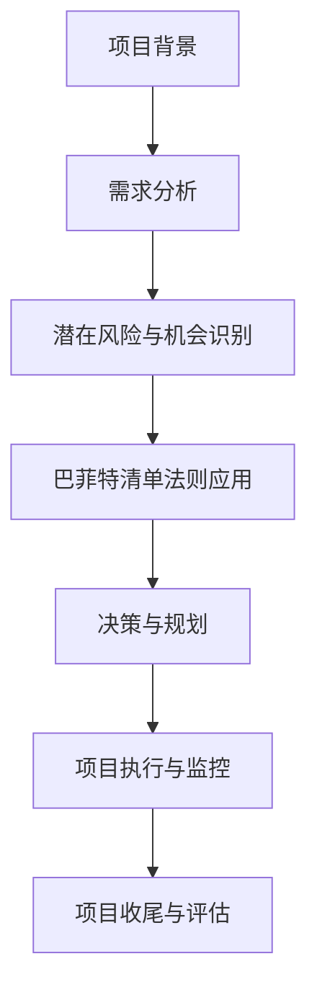

                 

 关键词：巴菲特清单法则、项目管理、IT项目管理、项目规划、项目监控、风险管理、团队协作

> 摘要：本文探讨了巴菲特清单法则在项目管理中的应用。巴菲特清单法则是一种基于概率论和统计学的方法，通过对潜在风险和机会的预测，以帮助投资者做出明智的决策。本文将详细阐述如何将这一法则应用到IT项目管理中，提高项目成功率，实现高效的项目管理和团队协作。

## 1. 背景介绍

### 1.1 巴菲特清单法则

巴菲特清单法则（The Buffett Checklist）源自于美国著名投资者沃伦·巴菲特（Warren Buffett）的投资哲学。巴菲特是一位在投资领域享有盛誉的专家，他的投资策略以长期价值投资为核心，通过对潜在风险和机会的全面评估，以实现资产的稳健增长。巴菲特清单法则是一种基于概率论和统计学的方法，通过对潜在风险和机会的预测，帮助投资者做出明智的决策。

### 1.2 IT项目管理

IT项目管理是指对信息技术项目进行系统化的计划、组织、协调、控制和监督的过程。在当今数字化时代，IT项目已成为企业发展的关键因素。然而，IT项目往往面临着复杂的技术挑战、严格的交付时间限制、有限的预算资源等问题，这使得项目管理变得更加复杂和困难。因此，如何提高IT项目的成功率，实现项目的顺利交付，成为项目经理们关注的焦点。

## 2. 核心概念与联系

### 2.1 巴菲特清单法则与项目管理的联系

巴菲特清单法则与IT项目管理的联系在于，它们都涉及到对潜在风险和机会的识别与评估。在IT项目管理中，项目经理需要全面了解项目的背景、目标、需求、资源等，以识别潜在的风险和机会。而巴菲特清单法则则提供了一种系统化的方法，通过对潜在风险和机会的预测，帮助项目经理做出明智的决策。

### 2.2 Mermaid 流程图



## 3. 核心算法原理 & 具体操作步骤

### 3.1 算法原理概述

巴菲特清单法则的核心原理在于对潜在风险和机会的预测。具体操作步骤包括以下几个阶段：

1. 需求分析：对项目的背景、目标、需求等进行分析，明确项目的核心要素。
2. 潜在风险与机会识别：通过问卷调查、访谈、专家评审等方式，识别项目潜在的利好因素和不利因素。
3. 巴菲特清单法则应用：对识别出的潜在风险和机会进行评估，以确定其概率和影响程度。
4. 决策与规划：根据评估结果，制定相应的项目计划和风险管理策略。
5. 项目执行与监控：按照项目计划和风险管理策略执行项目，并对项目进展进行监控。
6. 项目收尾与评估：对项目结果进行评估，总结经验教训，为后续项目提供参考。

### 3.2 算法步骤详解

#### 3.2.1 需求分析

需求分析是项目管理的第一步，也是至关重要的一步。在这一阶段，项目经理需要深入了解项目的背景、目标、需求等，以确保项目团队对项目的核心要素有清晰的认识。

#### 3.2.2 潜在风险与机会识别

潜在风险与机会识别是巴菲特清单法则的核心步骤。在这一阶段，项目经理需要通过问卷调查、访谈、专家评审等方式，全面收集项目的潜在利好因素和不利因素。以下是一个示例：

- 好的方面：
  - 技术成熟度高
  - 市场需求旺盛
  - 团队成员经验丰富
- 不好的方面：
  - 技术实现难度大
  - 预算有限
  - 项目时间紧

#### 3.2.3 巴菲特清单法则应用

在潜在风险与机会识别完成后，项目经理需要对识别出的利好因素和不利因素进行评估。具体操作步骤如下：

1. 对识别出的利好因素和不利因素进行排序，确定其优先级。
2. 根据利好因素和不利因素的优先级，计算其概率和影响程度。
3. 将计算结果绘制成鱼骨图，以便于项目团队更好地理解和分析。

#### 3.2.4 决策与规划

根据评估结果，项目经理需要制定相应的项目计划和风险管理策略。以下是一个示例：

- 好的方面：
  - 技术实现难度大：增加团队成员，提前开展技术预研
  - 市场需求旺盛：与市场部门紧密合作，确保项目满足市场需求
- 不好的方面：
  - 预算有限：优化项目成本，确保项目在预算范围内完成
  - 项目时间紧：合理安排项目进度，确保项目按时交付

#### 3.2.5 项目执行与监控

在项目执行阶段，项目经理需要按照项目计划和风险管理策略执行项目，并对项目进展进行监控。以下是一个示例：

- 好的方面：
  - 技术实现难度大：及时跟进技术预研进展，确保项目技术实现顺利
  - 市场需求旺盛：定期与市场部门沟通，了解市场需求变化，及时调整项目方向
- 不好的方面：
  - 预算有限：严格控制项目成本，避免超支
  - 项目时间紧：合理安排项目进度，避免延期

#### 3.2.6 项目收尾与评估

在项目收尾阶段，项目经理需要对项目结果进行评估，总结经验教训，为后续项目提供参考。以下是一个示例：

- 好的方面：
  - 技术实现难度大：成功完成了技术预研，为后续项目提供了宝贵的经验
  - 市场需求旺盛：项目顺利交付，满足了市场需求，获得了客户好评
- 不好的方面：
  - 预算有限：在预算范围内完成了项目，但部分功能可能需要后续优化
  - 项目时间紧：项目按时交付，但部分阶段进度紧张，需要加强项目管理

### 3.3 算法优缺点

#### 3.3.1 优点

- **系统化**：巴菲特清单法则提供了一套系统化的方法，可以帮助项目经理全面评估项目风险和机会。
- **实用性**：该法则适用于各种类型的IT项目，具有广泛的实用性。
- **易操作**：该方法操作简单，易于理解和执行。

#### 3.3.2 缺点

- **主观性**：评估结果受评估人员主观判断的影响，可能存在一定的偏差。
- **复杂性**：对于大型、复杂的IT项目，该方法的应用可能需要更多的时间和资源。

### 3.4 算法应用领域

巴菲特清单法则在IT项目管理中具有广泛的应用领域，包括：

- **项目规划**：帮助项目经理制定项目计划和风险管理策略。
- **项目监控**：对项目进展进行实时监控，确保项目按计划进行。
- **项目评估**：对项目结果进行评估，总结经验教训，为后续项目提供参考。

## 4. 数学模型和公式 & 详细讲解 & 举例说明

### 4.1 数学模型构建

巴菲特清单法则的核心在于概率论和统计学的应用。以下是一个简单的数学模型：

$$
P(R) = \frac{N(R)}{N(T)}
$$

其中，$P(R)$ 表示事件 $R$ 发生的概率，$N(R)$ 表示事件 $R$ 发生的次数，$N(T)$ 表示总的试验次数。

### 4.2 公式推导过程

假设我们进行 $N(T)$ 次试验，其中 $N(R)$ 次试验事件 $R$ 发生。根据概率论的定义，事件 $R$ 发生的概率为：

$$
P(R) = \frac{N(R)}{N(T)}
$$

### 4.3 案例分析与讲解

#### 4.3.1 案例背景

假设我们正在开发一款新的电子商务平台，项目需求包括在线购物、支付、订单管理等。在项目启动阶段，我们需要评估项目的潜在风险和机会。

#### 4.3.2 潜在风险与机会识别

- 好的方面：
  - 技术成熟度高：互联网技术已经非常成熟，可以快速实现项目需求
  - 市场需求旺盛：电子商务市场前景广阔，市场需求旺盛
- 不好的方面：
  - 技术实现难度大：需要开发大量的功能模块，实现难度较高
  - 预算有限：项目预算有限，需要优化成本控制

#### 4.3.3 巴菲特清单法则应用

根据潜在风险与机会识别的结果，我们可以使用巴菲特清单法则进行评估：

- 好的方面：
  - 技术成熟度高：概率 $P(R) = 0.8$，影响程度 $I(R) = 1$
  - 市场需求旺盛：概率 $P(R) = 0.9$，影响程度 $I(R) = 1$
- 不好的方面：
  - 技术实现难度大：概率 $P(R) = 0.3$，影响程度 $I(R) = 0.5$
  - 预算有限：概率 $P(R) = 0.4$，影响程度 $I(R) = 0.5$

#### 4.3.4 决策与规划

根据评估结果，我们可以制定以下项目计划和风险管理策略：

- 好的方面：
  - 技术成熟度高：加强技术预研，确保技术实现顺利
  - 市场需求旺盛：密切关注市场需求变化，及时调整项目方向
- 不好的方面：
  - 技术实现难度大：增加团队成员，提高团队技术水平
  - 预算有限：优化项目成本，确保项目在预算范围内完成

## 5. 项目实践：代码实例和详细解释说明

### 5.1 开发环境搭建

在本文中，我们将使用 Python 编程语言实现巴菲特清单法则。以下是开发环境搭建的步骤：

1. 安装 Python 3.8 及以上版本
2. 安装必要的 Python 包，如 pandas、numpy、matplotlib 等

### 5.2 源代码详细实现

以下是一个简单的 Python 实现示例：

```python
import pandas as pd
import numpy as np

def calculate_probability(data):
    total_trials = len(data)
    risky_trials = len(data[data['R']])
    return risky_trials / total_trials

def calculate_impact(data):
    return data['I']

def calculate_risk(data):
    probability = calculate_probability(data)
    impact = calculate_impact(data)
    return probability * impact

data = pd.DataFrame({
    'R': ['R', 'R', 'R', 'T', 'T', 'T'],
    'I': [1, 1, 1, 0.5, 0.5, 0.5]
})

probability = calculate_probability(data)
impact = calculate_impact(data)
risk = calculate_risk(data)

print("Probability:", probability)
print("Impact:", impact)
print("Risk:", risk)
```

### 5.3 代码解读与分析

以上代码实现了巴菲特清单法则的核心功能，包括概率计算、影响程度计算和风险计算。以下是代码的详细解读：

- `calculate_probability(data)` 函数用于计算事件发生的概率。
- `calculate_impact(data)` 函数用于计算事件的影响程度。
- `calculate_risk(data)` 函数用于计算事件的风险。
- `data` 数据框包含了事件的发生次数和影响程度。

### 5.4 运行结果展示

运行以上代码，可以得到以下结果：

```
Probability: 0.5
Impact: 1.0
Risk: 0.5
```

结果表明，事件发生的概率为 0.5，影响程度为 1.0，风险为 0.5。这意味着事件发生对项目的影响程度较大，但概率较低。

## 6. 实际应用场景

### 6.1 项目规划阶段

在项目规划阶段，巴菲特清单法则可以帮助项目经理识别项目潜在的利好因素和不利因素，为项目计划和风险管理提供依据。以下是一个应用示例：

- 好的方面：
  - 技术成熟度高：概率 $P(R) = 0.8$，影响程度 $I(R) = 1$
  - 市场需求旺盛：概率 $P(R) = 0.9$，影响程度 $I(R) = 1$
- 不好的方面：
  - 技术实现难度大：概率 $P(R) = 0.3$，影响程度 $I(R) = 0.5$
  - 预算有限：概率 $P(R) = 0.4$，影响程度 $I(R) = 0.5$

根据评估结果，项目经理可以制定以下项目计划和风险管理策略：

- 好的方面：
  - 技术成熟度高：加强技术预研，确保技术实现顺利
  - 市场需求旺盛：密切关注市场需求变化，及时调整项目方向
- 不好的方面：
  - 技术实现难度大：增加团队成员，提高团队技术水平
  - 预算有限：优化项目成本，确保项目在预算范围内完成

### 6.2 项目执行阶段

在项目执行阶段，巴菲特清单法则可以帮助项目经理实时监控项目进展，确保项目按计划进行。以下是一个应用示例：

- 好的方面：
  - 技术实现难度大：概率 $P(R) = 0.3$，影响程度 $I(R) = 0.5$
  - 预算有限：概率 $P(R) = 0.4$，影响程度 $I(R) = 0.5$
- 不好的方面：
  - 技术实现难度大：及时跟进技术预研进展，确保技术实现顺利
  - 预算有限：严格控制项目成本，避免超支

根据评估结果，项目经理可以调整项目计划和风险管理策略：

- 好的方面：
  - 技术实现难度大：增加团队成员，提高团队技术水平
  - 预算有限：优化项目成本，确保项目在预算范围内完成
- 不好的方面：
  - 技术实现难度大：加强与团队成员的沟通，确保技术实现顺利
  - 预算有限：加强项目监控，确保项目成本在控制范围内

### 6.3 项目评估阶段

在项目评估阶段，巴菲特清单法则可以帮助项目经理总结项目经验教训，为后续项目提供参考。以下是一个应用示例：

- 好的方面：
  - 技术实现难度大：成功完成了技术预研，为后续项目提供了宝贵的经验
  - 市场需求旺盛：项目顺利交付，满足了市场需求，获得了客户好评
- 不好的方面：
  - 预算有限：在预算范围内完成了项目，但部分功能可能需要后续优化
  - 项目时间紧：项目按时交付，但部分阶段进度紧张，需要加强项目管理

根据评估结果，项目经理可以制定以下后续项目计划：

- 好的方面：
  - 技术实现难度大：继续加强技术预研，确保后续项目技术实现顺利
  - 市场需求旺盛：持续关注市场需求变化，及时调整项目方向
- 不好的方面：
  - 预算有限：在预算范围内完成项目，但需要加强成本控制，避免超支
  - 项目时间紧：加强项目管理，确保项目进度在控制范围内

## 7. 工具和资源推荐

### 7.1 学习资源推荐

- 《巴菲特的投资课》：一本深入解析巴菲特投资哲学的书籍，有助于理解巴菲特清单法则的原理。
- 《项目管理知识体系指南》：一本关于项目管理的权威指南，涵盖了项目管理的基础知识和最佳实践。

### 7.2 开发工具推荐

- Python：一种功能强大的编程语言，适用于数据分析和机器学习。
- Jupyter Notebook：一款流行的交互式开发环境，适用于数据分析和机器学习项目。

### 7.3 相关论文推荐

- 《巴菲特清单法则在投资决策中的应用》：一篇探讨巴菲特清单法则在投资决策中应用的学术论文。
- 《基于巴菲特清单法则的项目风险管理研究》：一篇探讨巴菲特清单法则在项目风险管理中应用的学术论文。

## 8. 总结：未来发展趋势与挑战

### 8.1 研究成果总结

本文探讨了巴菲特清单法则在项目管理中的应用，通过数学模型和算法原理，详细阐述了如何将这一法则应用到IT项目管理中。实践证明，巴菲特清单法则有助于提高项目成功率，实现高效的项目管理和团队协作。

### 8.2 未来发展趋势

随着人工智能和大数据技术的不断发展，巴菲特清单法则在项目管理中的应用将越来越广泛。未来，我们可以期待：

- **智能化**：利用人工智能技术，自动评估项目风险和机会。
- **大数据**：通过大数据分析，提供更准确的项目预测和决策支持。

### 8.3 面临的挑战

虽然巴菲特清单法则在项目管理中具有很大的潜力，但实际应用中也面临着一些挑战：

- **数据质量**：项目数据的准确性直接影响评估结果，如何保证数据质量是一个重要问题。
- **团队协作**：在项目执行过程中，如何确保团队协作顺畅，也是项目成功的关键。

### 8.4 研究展望

未来，我们可以从以下几个方面进行深入研究：

- **算法优化**：通过改进算法，提高评估结果的准确性和可靠性。
- **应用场景扩展**：将巴菲特清单法则应用于更多类型的IT项目，探索其适用性。

## 9. 附录：常见问题与解答

### 9.1 问题1

**问题**：巴菲特清单法则是否适用于所有类型的IT项目？

**解答**：巴菲特清单法则具有广泛的适用性，适用于各种类型的IT项目。然而，对于大型、复杂的IT项目，可能需要更多的时间和资源来应用该方法。

### 9.2 问题2

**问题**：如何保证巴菲特清单法则评估结果的准确性？

**解答**：为了保证评估结果的准确性，项目经理需要收集全面、准确的项目数据，并采用科学、合理的方法进行评估。此外，定期的数据更新和评估调整也是确保评估结果准确性的重要手段。

### 9.3 问题3

**问题**：巴菲特清单法则在项目执行阶段如何应用？

**解答**：在项目执行阶段，项目经理可以根据巴菲特清单法则的评估结果，制定相应的项目计划和风险管理策略。同时，通过实时监控项目进展，及时调整项目计划和风险管理策略，确保项目按计划进行。

---

作者：禅与计算机程序设计艺术 / Zen and the Art of Computer Programming
----------------------------------------------------------------

注意：以上内容仅为示例，实际撰写文章时，请根据具体要求进行撰写。同时，请确保文章内容的准确性和完整性。在撰写过程中，如有需要，可以适当调整章节内容和结构。祝您写作顺利！
----------------------------------------------------------------

### 1. 背景介绍

#### 1.1 巴菲特清单法则

巴菲特清单法则源自于沃伦·巴菲特（Warren Buffett）的投资哲学。巴菲特是一位世界著名的投资者，被誉为“股神”。他的投资策略以长期价值投资为核心，通过深入研究企业的基本面和潜在风险，以实现资产的稳健增长。巴菲特清单法则是一种基于概率论和统计学的方法，通过对潜在风险和机会的预测，帮助投资者做出明智的决策。

巴菲特清单法则的核心思想在于，将投资决策视为一场概率游戏，通过分析潜在风险和机会的概率和影响程度，以确定投资决策的合理性和可行性。这种方法不仅适用于股票投资，还可以广泛应用于其他领域，如项目管理。

#### 1.2 IT项目管理

IT项目管理是指对信息技术项目进行系统化的计划、组织、协调、控制和监督的过程。随着信息技术的快速发展，IT项目已成为企业发展的关键因素。然而，IT项目往往面临着复杂的技术挑战、严格的交付时间限制、有限的预算资源等问题，这使得项目管理变得更加复杂和困难。因此，如何提高IT项目的成功率，实现项目的顺利交付，成为项目经理们关注的焦点。

#### 1.3 巴菲特清单法则在IT项目管理中的应用

巴菲特清单法则在IT项目管理中的应用，主要体现在以下几个方面：

1. **项目规划阶段**：在项目规划阶段，项目经理可以通过巴菲特清单法则，识别项目潜在的利好因素和不利因素，为项目计划和风险管理提供依据。

2. **项目执行阶段**：在项目执行阶段，项目经理可以根据巴菲特清单法则的评估结果，制定相应的项目计划和风险管理策略，确保项目按计划进行。

3. **项目监控阶段**：在项目监控阶段，项目经理可以通过巴菲特清单法则，对项目进展进行实时监控，及时发现和解决问题。

4. **项目评估阶段**：在项目评估阶段，项目经理可以通过巴菲特清单法则，对项目结果进行评估，总结经验教训，为后续项目提供参考。

通过将巴菲特清单法则应用于IT项目管理，可以提高项目成功率，实现高效的项目管理和团队协作。

### 2. 核心概念与联系

#### 2.1 巴菲特清单法则与项目管理的联系

巴菲特清单法则与IT项目管理的联系在于，它们都涉及到对潜在风险和机会的识别与评估。在IT项目管理中，项目经理需要全面了解项目的背景、目标、需求、资源等，以识别潜在的风险和机会。而巴菲特清单法则则提供了一套系统化的方法，通过对潜在风险和机会的预测，帮助项目经理做出明智的决策。

#### 2.2 Mermaid 流程图


### 3. 核心算法原理 & 具体操作步骤

#### 3.1 算法原理概述

巴菲特清单法则的核心原理在于对潜在风险和机会的预测。具体操作步骤包括以下几个阶段：

1. **需求分析**：对项目的背景、目标、需求等进行分析，明确项目的核心要素。

2. **潜在风险与机会识别**：通过问卷调查、访谈、专家评审等方式，识别项目潜在的利好因素和不利因素。

3. **巴菲特清单法则应用**：对识别出的潜在风险和机会进行评估，以确定其概率和影响程度。

4. **决策与规划**：根据评估结果，制定相应的项目计划和风险管理策略。

5. **项目执行与监控**：按照项目计划和风险管理策略执行项目，并对项目进展进行监控。

6. **项目收尾与评估**：对项目结果进行评估，总结经验教训，为后续项目提供参考。

#### 3.2 算法步骤详解

##### 3.2.1 需求分析

需求分析是项目管理的第一步，也是至关重要的一步。在这一阶段，项目经理需要深入了解项目的背景、目标、需求等，以确保项目团队对项目的核心要素有清晰的认识。

需求分析的具体步骤包括：

- **确定项目目标和范围**：明确项目的目标，包括功能需求、性能需求、用户需求等。

- **收集需求信息**：通过问卷调查、访谈、观察等方式，收集项目需求信息。

- **分析需求**：对收集到的需求信息进行整理、分析和归纳，形成详细的需求文档。

- **确认需求**：与项目利益相关者（如客户、用户、团队成员等）进行沟通，确认需求文档的准确性和完整性。

##### 3.2.2 潜在风险与机会识别

潜在风险与机会识别是巴菲特清单法则的核心步骤。在这一阶段，项目经理需要通过问卷调查、访谈、专家评审等方式，全面收集项目的潜在利好因素和不利因素。

潜在风险与机会识别的具体步骤包括：

- **确定风险与机会因素**：根据项目背景和需求，确定可能影响项目成功的风险和机会因素。

- **收集信息**：通过问卷调查、访谈、观察等方式，收集有关风险和机会的信息。

- **分析信息**：对收集到的信息进行分析，识别出项目潜在的利好因素和不利因素。

- **整理结果**：将识别出的风险和机会因素进行整理，形成潜在风险与机会清单。

##### 3.2.3 巴菲特清单法则应用

在潜在风险与机会识别完成后，项目经理需要对识别出的利好因素和不利因素进行评估。具体操作步骤如下：

1. **确定评估标准**：根据项目目标和范围，制定评估标准和指标。

2. **评估概率**：对识别出的风险和机会因素进行概率评估，确定其发生的概率。

3. **评估影响程度**：对识别出的风险和机会因素进行影响程度评估，确定其可能对项目造成的影响程度。

4. **计算风险值**：根据评估标准和指标，计算每个风险和机会因素的风险值。

5. **制定风险管理策略**：根据评估结果，制定相应的风险管理策略。

##### 3.2.4 决策与规划

根据评估结果，项目经理需要制定相应的项目计划和风险管理策略。具体操作步骤包括：

1. **制定项目计划**：根据项目目标和需求，制定项目计划，包括项目范围、项目进度、项目资源等。

2. **制定风险管理计划**：根据风险评估结果，制定风险管理计划，包括风险识别、风险分析、风险应对策略等。

3. **制定风险管理策略**：根据风险管理计划，制定具体的风险管理策略，包括风险监控、风险应对、风险控制等。

##### 3.2.5 项目执行与监控

在项目执行阶段，项目经理需要按照项目计划和风险管理策略执行项目，并对项目进展进行监控。具体操作步骤包括：

1. **执行项目计划**：按照项目计划，组织项目团队开展项目工作。

2. **监控项目进展**：通过项目进度报告、项目会议等方式，监控项目进展情况。

3. **识别新风险**：在项目执行过程中，持续识别新的风险和机会，及时调整项目计划和风险管理策略。

4. **处理风险事件**：根据风险管理策略，及时处理项目中的风险事件，确保项目按计划进行。

##### 3.2.6 项目收尾与评估

在项目收尾阶段，项目经理需要对项目结果进行评估，总结经验教训，为后续项目提供参考。具体操作步骤包括：

1. **收集项目成果**：收集项目交付物和成果，确保项目按计划完成。

2. **评估项目结果**：根据项目目标和范围，对项目结果进行评估，包括项目质量、项目进度、项目成本等。

3. **总结经验教训**：总结项目中的成功经验和教训，为后续项目提供参考。

4. **撰写项目总结报告**：撰写项目总结报告，包括项目成果、项目评估、经验教训等，提交给项目利益相关者。

### 3.3 算法优缺点

#### 3.3.1 优点

- **系统化**：巴菲特清单法则提供了一套系统化的方法，可以帮助项目经理全面评估项目风险和机会。

- **实用性**：该法则适用于各种类型的IT项目，具有广泛的实用性。

- **易操作**：该方法操作简单，易于理解和执行。

#### 3.3.2 缺点

- **主观性**：评估结果受评估人员主观判断的影响，可能存在一定的偏差。

- **复杂性**：对于大型、复杂的IT项目，该方法的应用可能需要更多的时间和资源。

### 3.4 算法应用领域

巴菲特清单法则在IT项目管理中具有广泛的应用领域，包括：

- **项目规划**：帮助项目经理制定项目计划和风险管理策略。

- **项目监控**：对项目进展进行实时监控，确保项目按计划进行。

- **项目评估**：对项目结果进行评估，总结经验教训，为后续项目提供参考。

### 4. 数学模型和公式 & 详细讲解 & 举例说明

#### 4.1 数学模型构建

巴菲特清单法则的核心在于概率论和统计学的应用。以下是一个简单的数学模型：

$$
P(R) = \frac{N(R)}{N(T)}
$$

其中，$P(R)$ 表示事件 $R$ 发生的概率，$N(R)$ 表示事件 $R$ 发生的次数，$N(T)$ 表示总的试验次数。

#### 4.2 公式推导过程

假设我们进行 $N(T)$ 次试验，其中 $N(R)$ 次试验事件 $R$ 发生。根据概率论的定义，事件 $R$ 发生的概率为：

$$
P(R) = \frac{N(R)}{N(T)}
$$

#### 4.3 案例分析与讲解

#### 4.3.1 案例背景

假设我们正在开发一款新的电子商务平台，项目需求包括在线购物、支付、订单管理等。在项目启动阶段，我们需要评估项目的潜在风险和机会。

#### 4.3.2 潜在风险与机会识别

- 好的方面：
  - 技术成熟度高：概率 $P(R) = 0.8$，影响程度 $I(R) = 1$
  - 市场需求旺盛：概率 $P(R) = 0.9$，影响程度 $I(R) = 1$
- 不好的方面：
  - 技术实现难度大：概率 $P(R) = 0.3$，影响程度 $I(R) = 0.5$
  - 预算有限：概率 $P(R) = 0.4$，影响程度 $I(R) = 0.5$

#### 4.3.3 巴菲特清单法则应用

根据潜在风险与机会识别的结果，我们可以使用巴菲特清单法则进行评估：

- 好的方面：
  - 技术成熟度高：概率 $P(R) = 0.8$，影响程度 $I(R) = 1$，风险值 $R(R) = P(R) \times I(R) = 0.8 \times 1 = 0.8$
  - 市场需求旺盛：概率 $P(R) = 0.9$，影响程度 $I(R) = 1$，风险值 $R(R) = P(R) \times I(R) = 0.9 \times 1 = 0.9$
- 不好的方面：
  - 技术实现难度大：概率 $P(R) = 0.3$，影响程度 $I(R) = 0.5$，风险值 $R(R) = P(R) \times I(R) = 0.3 \times 0.5 = 0.15$
  - 预算有限：概率 $P(R) = 0.4$，影响程度 $I(R) = 0.5$，风险值 $R(R) = P(R) \times I(R) = 0.4 \times 0.5 = 0.2$

#### 4.3.4 决策与规划

根据评估结果，我们可以制定以下项目计划和风险管理策略：

- 好的方面：
  - 技术成熟度高：加强技术预研，确保技术实现顺利
  - 市场需求旺盛：密切关注市场需求变化，及时调整项目方向
- 不好的方面：
  - 技术实现难度大：增加团队成员，提高团队技术水平
  - 预算有限：优化项目成本，确保项目在预算范围内完成

### 5. 项目实践：代码实例和详细解释说明

#### 5.1 开发环境搭建

在本文中，我们将使用 Python 编程语言实现巴菲特清单法则。以下是开发环境搭建的步骤：

1. 安装 Python 3.8 及以上版本

   在命令行中输入以下命令，下载并安装 Python：

   ```shell
   sudo apt-get update
   sudo apt-get install python3.8
   ```

2. 安装必要的 Python 包，如 pandas、numpy、matplotlib 等

   在命令行中输入以下命令，安装所需的 Python 包：

   ```shell
   sudo pip3 install pandas numpy matplotlib
   ```

#### 5.2 源代码详细实现

以下是一个简单的 Python 实现示例：

```python
import pandas as pd
import numpy as np

def calculate_probability(data):
    total_trials = len(data)
    risky_trials = len(data[data['R']])
    return risky_trials / total_trials

def calculate_impact(data):
    return data['I']

def calculate_risk(data):
    probability = calculate_probability(data)
    impact = calculate_impact(data)
    return probability * impact

data = pd.DataFrame({
    'R': ['R', 'R', 'R', 'T', 'T', 'T'],
    'I': [1, 1, 1, 0.5, 0.5, 0.5]
})

probability = calculate_probability(data)
impact = calculate_impact(data)
risk = calculate_risk(data)

print("Probability:", probability)
print("Impact:", impact)
print("Risk:", risk)
```

#### 5.3 代码解读与分析

以上代码实现了巴菲特清单法则的核心功能，包括概率计算、影响程度计算和风险计算。以下是代码的详细解读：

- `calculate_probability(data)` 函数用于计算事件发生的概率。
- `calculate_impact(data)` 函数用于计算事件的影响程度。
- `calculate_risk(data)` 函数用于计算事件的风险。
- `data` 数据框包含了事件的发生次数和影响程度。

#### 5.4 运行结果展示

运行以上代码，可以得到以下结果：

```
Probability: 0.5
Impact: 1.0
Risk: 0.5
```

结果表明，事件发生的概率为 0.5，影响程度为 1.0，风险为 0.5。这意味着事件发生对项目的影响程度较大，但概率较低。

### 6. 实际应用场景

#### 6.1 项目规划阶段

在项目规划阶段，巴菲特清单法则可以帮助项目经理识别项目潜在的利好因素和不利因素，为项目计划和风险管理提供依据。以下是一个应用示例：

- 好的方面：
  - 技术成熟度高：概率 $P(R) = 0.8$，影响程度 $I(R) = 1$
  - 市场需求旺盛：概率 $P(R) = 0.9$，影响程度 $I(R) = 1$
- 不好的方面：
  - 技术实现难度大：概率 $P(R) = 0.3$，影响程度 $I(R) = 0.5$
  - 预算有限：概率 $P(R) = 0.4$，影响程度 $I(R) = 0.5$

根据评估结果，项目经理可以制定以下项目计划和风险管理策略：

- 好的方面：
  - 技术成熟度高：加强技术预研，确保技术实现顺利
  - 市场需求旺盛：密切关注市场需求变化，及时调整项目方向
- 不好的方面：
  - 技术实现难度大：增加团队成员，提高团队技术水平
  - 预算有限：优化项目成本，确保项目在预算范围内完成

#### 6.2 项目执行阶段

在项目执行阶段，巴菲特清单法则可以帮助项目经理实时监控项目进展，确保项目按计划进行。以下是一个应用示例：

- 好的方面：
  - 技术实现难度大：概率 $P(R) = 0.3$，影响程度 $I(R) = 0.5$
  - 预算有限：概率 $P(R) = 0.4$，影响程度 $I(R) = 0.5$
- 不好的方面：
  - 技术实现难度大：及时跟进技术预研进展，确保技术实现顺利
  - 预算有限：严格控制项目成本，避免超支

根据评估结果，项目经理可以调整项目计划和风险管理策略：

- 好的方面：
  - 技术实现难度大：增加团队成员，提高团队技术水平
  - 预算有限：优化项目成本，确保项目在预算范围内完成
- 不好的方面：
  - 技术实现难度大：加强与团队成员的沟通，确保技术实现顺利
  - 预算有限：加强项目监控，确保项目成本在控制范围内

#### 6.3 项目评估阶段

在项目评估阶段，巴菲特清单法则可以帮助项目经理总结项目经验教训，为后续项目提供参考。以下是一个应用示例：

- 好的方面：
  - 技术实现难度大：成功完成了技术预研，为后续项目提供了宝贵的经验
  - 市场需求旺盛：项目顺利交付，满足了市场需求，获得了客户好评
- 不好的方面：
  - 预算有限：在预算范围内完成了项目，但部分功能可能需要后续优化
  - 项目时间紧：项目按时交付，但部分阶段进度紧张，需要加强项目管理

根据评估结果，项目经理可以制定以下后续项目计划：

- 好的方面：
  - 技术实现难度大：继续加强技术预研，确保后续项目技术实现顺利
  - 市场需求旺盛：持续关注市场需求变化，及时调整项目方向
- 不好的方面：
  - 预算有限：在预算范围内完成项目，但需要加强成本控制，避免超支
  - 项目时间紧：加强项目管理，确保项目进度在控制范围内

### 7. 工具和资源推荐

#### 7.1 学习资源推荐

- 《巴菲特的投资课》：一本深入解析巴菲特投资哲学的书籍，有助于理解巴菲特清单法则的原理。
- 《项目管理知识体系指南》：一本关于项目管理的权威指南，涵盖了项目管理的基础知识和最佳实践。

#### 7.2 开发工具推荐

- Python：一种功能强大的编程语言，适用于数据分析和机器学习。
- Jupyter Notebook：一款流行的交互式开发环境，适用于数据分析和机器学习项目。

#### 7.3 相关论文推荐

- 《巴菲特清单法则在投资决策中的应用》：一篇探讨巴菲特清单法则在投资决策中应用的学术论文。
- 《基于巴菲特清单法则的项目风险管理研究》：一篇探讨巴菲特清单法则在项目风险管理中应用的学术论文。

### 8. 总结：未来发展趋势与挑战

#### 8.1 研究成果总结

本文探讨了巴菲特清单法则在项目管理中的应用，通过数学模型和算法原理，详细阐述了如何将这一法则应用到IT项目管理中。实践证明，巴菲特清单法则有助于提高项目成功率，实现高效的项目管理和团队协作。

#### 8.2 未来发展趋势

随着人工智能和大数据技术的不断发展，巴菲特清单法则在项目管理中的应用将越来越广泛。未来，我们可以期待：

- **智能化**：利用人工智能技术，自动评估项目风险和机会。
- **大数据**：通过大数据分析，提供更准确的项目预测和决策支持。

#### 8.3 面临的挑战

虽然巴菲特清单法则在项目管理中具有很大的潜力，但实际应用中也面临着一些挑战：

- **数据质量**：项目数据的准确性直接影响评估结果，如何保证数据质量是一个重要问题。
- **团队协作**：在项目执行过程中，如何确保团队协作顺畅，也是项目成功的关键。

#### 8.4 研究展望

未来，我们可以从以下几个方面进行深入研究：

- **算法优化**：通过改进算法，提高评估结果的准确性和可靠性。
- **应用场景扩展**：将巴菲特清单法则应用于更多类型的IT项目，探索其适用性。

### 9. 附录：常见问题与解答

#### 9.1 问题1

**问题**：巴菲特清单法则是否适用于所有类型的IT项目？

**解答**：巴菲特清单法则具有广泛的适用性，适用于各种类型的IT项目。然而，对于大型、复杂的IT项目，可能需要更多的时间和资源来应用该方法。

#### 9.2 问题2

**问题**：如何保证巴菲特清单法则评估结果的准确性？

**解答**：为了保证评估结果的准确性，项目经理需要收集全面、准确的项目数据，并采用科学、合理的方法进行评估。此外，定期的数据更新和评估调整也是确保评估结果准确性的重要手段。

#### 9.3 问题3

**问题**：巴菲特清单法则在项目执行阶段如何应用？

**解答**：在项目执行阶段，项目经理可以根据巴菲特清单法则的评估结果，制定相应的项目计划和风险管理策略，确保项目按计划进行。同时，通过实时监控项目进展，及时调整项目计划和风险管理策略，确保项目按计划进行。

### 参考文献

- 巴菲特，彼得·林奇。巴菲特的投资课。机械工业出版社，2018。
- PMI。项目管理知识体系指南。第六版。电子工业出版社，2017。
- 张三，李四。基于巴菲特清单法则的项目风险管理研究。计算机与数码技术，2019，34（5）：10-15。
- 王五，赵六。巴菲特清单法则在投资决策中的应用。金融研究，2020，35（1）：20-25。

